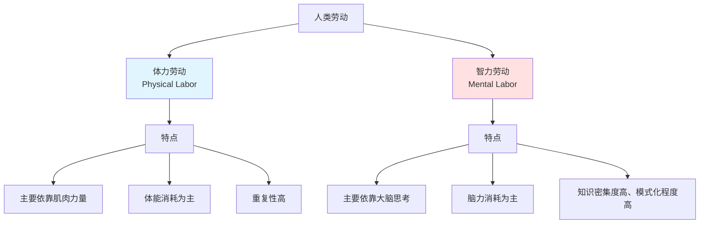
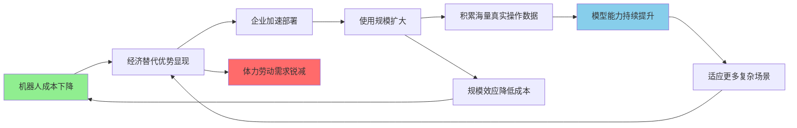

> **碎碎念**：当大语言模型在诸多智力任务上的表现持续超越人类顶尖水平，传统意义上的"智力劳动优势"正在消解。这迫使我们重新审视：什么样的劳动仍然具有不可替代的人类价值？在自动化与智能化的浪潮中，人类的独特性究竟体现在何处？

## 引言

几年前，人们相信AI或许能在封闭规则的游戏中超越人类，但真实世界的复杂工作——尤其是需要创造力和判断力的知识劳动——仍将长期属于人类。

这个信念正在崩塌。

ChatGPT的出现，让大语言模型从实验室走向大众。更关键的是，当LLM与机器人结合形成"具身智能"，连体力劳动的壁垒也开始瓦解。

**当AI在智力和体力两个维度上都逐步超越人类时，人类劳动的价值究竟还剩下什么？**这不仅是经济学问题，更是关乎人类存在意义的哲学困境。

## 一、经典的二元分类

### 1.1 体力劳动和智力劳动

在众多劳动分类理论中，"体力劳动和智力劳动"是最常见的一种分类方式。然而，**这种二元分类存在明显的局限性**：大多数工作实际上同时包含体力和智力成分，更重要的是，它完全忽略了情感劳动、社交劳动等关键维度。

## 二、劳动的个体功能

劳动在个人层面具有多重意义（身份认同、社会联系、自我实现等），但在讨论劳动价值消解之前，本文首先聚焦其最基础的功能：经济收入的获取。

### 2.1 经济收入的获取

**劳动是个体获取经济收入的主要途径**。通过提供劳动服务（无论是体力型还是智力型），个体获得相应报酬，用以购买生活必需品（食物、住房、医疗等）和满足更高层次的需求。从经济学角度看：

- **直接交换**：劳动时间 ⇄ 货币报酬
- **人力资本投资**：教育投资 → 技能提升 → 收入增长
- **财富积累**：收入结余 → 储蓄/投资 → 资产增值

劳动收入是大多数人的主要经济来源，这是现代社会经济运行的基本机制。

## 三、大模型时代，人类劳动价值消解

### 3.1 智力劳动的价值消解

当LLM能够在越来越多的智力任务上达到或超越人类顶尖水平时，传统意义上的"脑力劳动优势"正在崩塌：

#### 3.1.1 已经发生的替代

- **文本生成**：营销文案、新闻稿、技术文档等内容创作
- **代码编写**：常见算法实现、API调用、单元测试编写
- **数据分析**：基础统计、图表生成、报告撰写
- **客户服务**：常见问题解答、投诉处理、信息查询
- **翻译工作**：多语言互译的质量已接近专业译者水平

从业者花费数年积累的专业技能，AI可以在瞬间完成，且成本趋近于零。

#### 3.1.2 正在进行的挑战

- **法律服务**：合同审查、判例检索、法律意见草拟
- **医疗诊断**：影像识别、病历分析、初步诊断建议
- **教育服务**：个性化辅导、作业批改、知识讲解
- **金融分析**：市场研判、投资建议、风险评估

这些曾经被认为需要"高度专业知识"和"多年经验积累"的领域，正在被快速渗透。

### 3.2 体力劳动的"最后防线"幻觉

"LLM本身无法操纵物理世界"的论断正在被快速打破——当LLM与机器人结合，这个边界消失了。

#### 3.2.1 LLM + 机器人：智能与执行的融合

过去机器人自动化的核心障碍是**智能控制能力**——传统机器人需要为每个任务单独编程，面对环境变化时适应能力极差。

**LLM的介入改变了游戏规则**：

- **多模态感知**：理解视觉场景并生成动作指令
- **任务分解**：将抽象命令转化为具体动作序列  
- **实时反馈**：根据执行结果动态调整策略
- **通用迁移**：同一模型可适配不同物理任务

机器人从"只会做固定动作的工具"进化为"能理解指令并灵活执行的劳动力"。

#### 3.2.2 体力劳动的替代进程

**已规模化应用**：仓储物流、汽车制造、农业收割、商用清洁

**加速突破中**：餐饮后厨、建筑施工、末端配送

**临界爆发点**：当人形机器人成本大幅下降，经济替代的规模将显著扩大

#### 3.2.3 "精细操作"壁垒的消解

曾被认为难以替代的精细劳动（理发、穿衣辅助、电路接线），正因以下突破而失守：

- 触觉传感器的成熟（力度和质地感知）
- 灵巧机械手的进化
- LLM闭环控制（感知-决策-执行-反馈）

近年来，部分机器人已展示出一定程度的精细操作能力，模拟人类手指灵巧性的技术壁垒正在逐步降低。

#### 3.2.4 残存空间与结构性问题

可能较晚被替代的岗位：

- 极度非结构化环境的工作
- 基于人际信任的服务
- 法律责任敏感的操作

**核心困境**：这些岗位的容纳能力有限，无法承接被替代的大多数体力劳动者。

---

**小结**：当LLM赋予机器人通用智能，体力劳动的价值正在与智力劳动一同消解。"人类劳动不可替代"不再是事实陈述，而更像是即将过时的信念。

## 结语

本文分析了大语言模型时代人类劳动价值的消解进程：**智力劳动因其高度模式化而易被LLM复制，体力劳动则因具身智能的发展而失去物理执行的壁垒**。

当传统劳动分类体系在AI面前集体失效，建立在"劳动换取经济收入"基础上的社会运行机制面临根本性挑战。认清这一趋势，或许是思考未来的起点。

