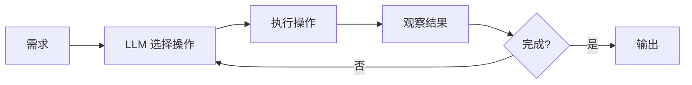

> **核心观点**：可靠性不来自于 LLM 本身，而来自于**约束 LLM 的操作空间**和**验证每一步操作的结果**。

## 问题：一次性生成的不确定性

让 LLM 直接生成完整代码，存在根本性的可靠性问题：

- **输出不稳定**：相同提示词可能产生不同结果
- **错误隐蔽**：生成的代码看似正确，实则存在逻辑漏洞
- **难以验证**：一大段代码难以逐行核查
- **无法定位**：出错时不知道问题出在哪一步

本质上，这是把 LLM 当作一个**黑盒**——输入需求，期望直接输出正确代码。

## 范式转变：从"生成代码"到"执行操作"

更可靠的方式是：**让 LLM 在一个受限的操作空间中持续操作**。

三个关键要素：

| 要素             | 说明                                                                         |
| ---------------- | ---------------------------------------------------------------------------- |
| **固定操作空间** | LLM 只能调用预定义的工具（读文件、写文件、运行命令等），而非自由生成任意代码 |
| **固定提示词**   | 每次循环使用相同的 System Prompt，确保行为一致可预测                         |
| **结果可观察**   | 每步操作都有明确输出，作为下一步决策的输入                                   |

## 为什么这更可靠

**操作粒度小** → 每步只做一件事，错误容易定位

**结果可验证** → 每步执行后都能检查是否符合预期

**流程可重复** → 固定的提示词 + 固定的操作空间 = 更一致的行为

**错误可恢复** → 发现问题可以回退到上一步，而非重新生成全部代码

## 实践要点

1. **设计最小化操作集**：只暴露必要的工具，减少出错可能
2. **每步操作要有可验证输出**：能运行、能测试、能检查
3. **设定明确的终止条件**：避免无限循环
4. **保留操作历史**：便于回溯和调试

## 结语

LLM 的能力已经足够强大，问题在于如何**约束和引导**这种能力。

把 LLM 放进一个受控的操作空间，让它通过**小步迭代**而非**一次生成**来完成任务——这是让 AI 代码生成从"能用"走向"可靠"的关键转变。
