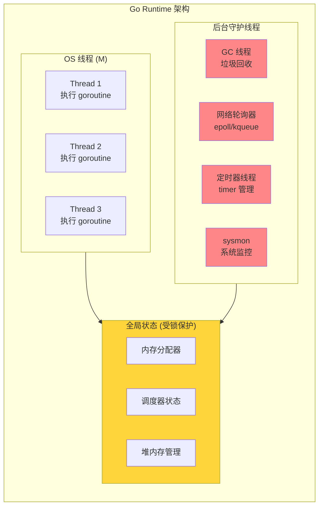
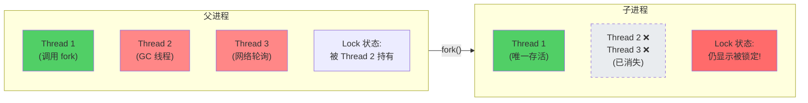
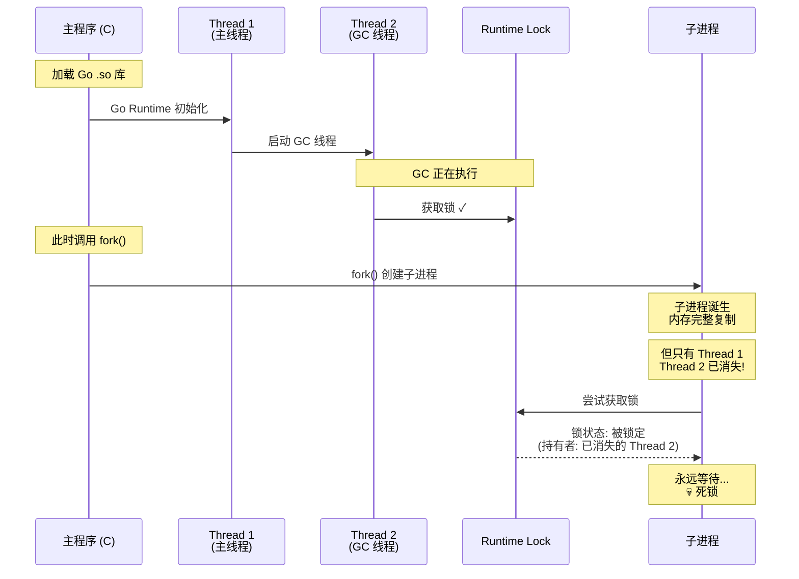
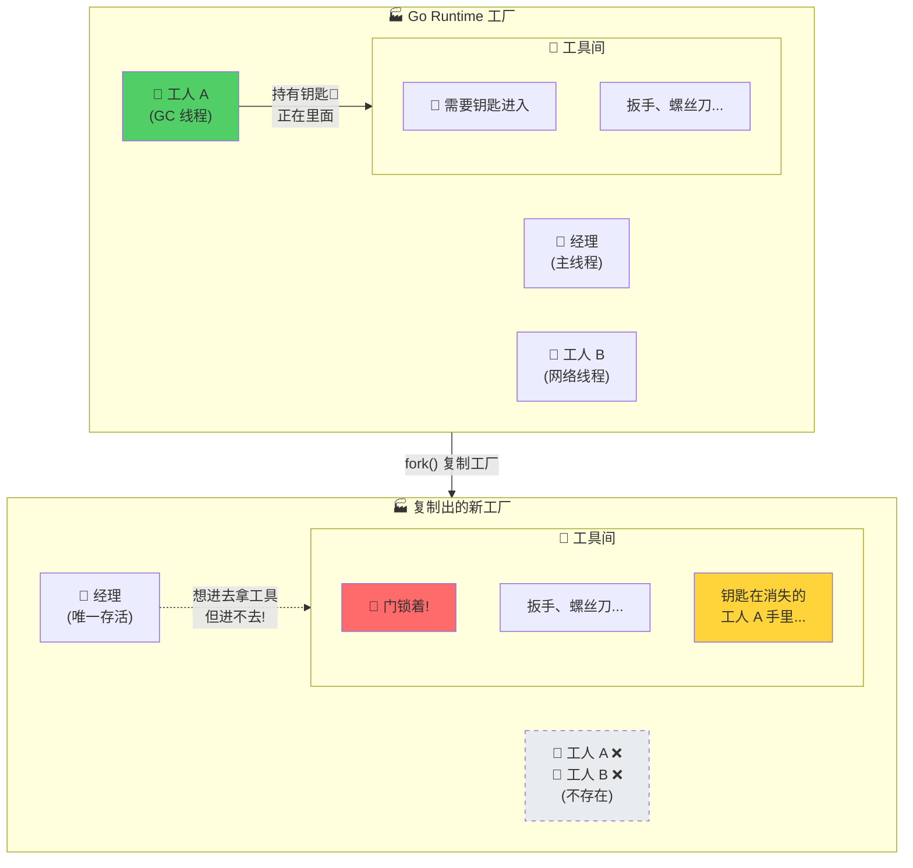
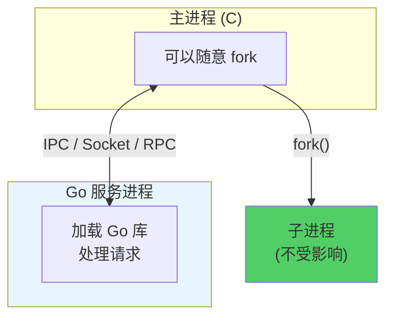

> **核心观点**：Go Runtime 是一个**多线程运行时环境**，而 `fork` 仅复制调用线程。在多线程环境下执行 fork，子进程将成为一个**线程状态不一致的进程副本**——后台线程消失，但它们持有的锁状态被保留，最终导致死锁。

## 一、问题背景

当你用 Go 编写一个 Shared Library（`.so` 文件），并在 C/C++ 主程序中加载它时，可能会遇到一个诡异的问题：

**主程序一旦调用 `fork()`，子进程就会死锁或崩溃。**

这不是代码 bug，而是 Go Runtime 与 POSIX `fork` 语义之间的根本性冲突。

## 二、核心矛盾：多线程 Runtime vs 单线程 Fork

### Go Runtime 是多线程的

当你运行一个 Go 程序（或加载 Go 编译的 Shared Library）时，Go Runtime 会启动一个"微型操作系统"来管理你的代码：



**关键特性**：

- **多个 OS 线程（M）**：Go 会启动多个系统线程来并行执行 goroutine
- **后台守护线程**：GC、网络轮询器、定时器等都在独立线程中运行
- **全局锁与状态**：Runtime 内部维护大量全局状态，由互斥锁保护

### fork 的语义：仅复制调用线程

在 Linux/Unix 中，调用 `fork()` 时：



**核心问题**：

1. 子进程**只复制了调用 `fork()` 的那个线程**
2. 其他线程**不会被复制**——它们在子进程中不存在
3. 但它们的**遗留状态**（比如持有的锁）**仍保留在内存中**

## 三、死锁是如何发生的

让我们还原一个典型场景：



**三个阶段**：

1. **初始化阶段**：Go Runtime 启动多个线程，某些线程持有锁
2. **Fork 阶段**：子进程只有主线程，其他线程消失，但锁状态被复制
3. **死锁阶段**：子进程尝试获取锁，但持有锁的线程已不存在

## 四、形象的比喻

想象 Go Runtime 是一个繁忙的**工厂车间**：



**比喻解读**：

- 工人 A（GC 线程）拿着钥匙进了工具间，正在修机器
- `fork()` 发生：整个工厂被复制
- 新工厂里只有经理一个人，其他工人都消失了
- 工具间的门还锁着，钥匙在消失的工人 A 手里
- 经理永远等在门口——**死锁**

## 五、为什么 Go 原生程序通常没事

如果是纯 Go 程序，使用 `os.Exec` 或 `syscall.ForkExec` 时通常不会出问题。这是因为 Go 标准库做了特殊处理：

### 1. runtime.ForkLock 机制

```go
// Go 在 fork 前会锁住所有线程
runtime.ForkLock.Lock()
// fork 后立即 exec，不使用残缺的 Runtime
syscall.RawSyscall(syscall.SYS_FORK, ...)
syscall.RawSyscall(syscall.SYS_EXEC, ...)
runtime.ForkLock.Unlock()
```

### 2. fork + exec 策略

Go 的标准做法是 **fork 之后立刻 exec**：


子进程不会使用那个不一致的 Runtime 状态，而是立刻用新程序替换整个进程地址空间。

### 3. C 调用 Go Shared Library 的问题

但在 **C 主程序加载 Go 动态库**的场景下：

| 控制方     | 能否协调 fork            | 结果 |
| ---------- | ------------------------ | ---- |
| 纯 Go 程序 | Go 控制 fork，可以协调   | 安全 |
| C + Go .so | C 控制 fork，Go 无法协调 | 危险 |

C 程序随时可能调用 `fork()`，Go Runtime 没有机会执行 fork 前的同步操作（如获取 `ForkLock`、暂停后台线程）。

## 六、解决方案

| 方案                 | 描述                                  | 适用场景         | 复杂度 |
| -------------------- | ------------------------------------- | ---------------- | ------ |
| **Fork 后立即 Exec** | fork 后子进程立刻调用 exec 加载新程序 | 只需启动外部进程 | 低     |
| **多进程模型**       | 主程序通过 IPC 与 Go 服务进程通信     | 需要复用 Go 逻辑 | 中     |
| **避免多线程 Fork**  | 在 Go Runtime 初始化前 fork           | 几乎不可行       | 高     |

### 方案 1：Fork 后立即 Exec（推荐）

这是 POSIX 的标准建议：

```c
pid_t pid = fork();
if (pid == 0) {
    // 子进程：立刻 exec，不要复用任何 Go 逻辑
    execve("/path/to/new/program", argv, envp);
    _exit(1); // exec 失败时退出
}
```

新程序会完全替换子进程的地址空间，不一致的状态随之消失。

### 方案 2：多进程模型（反向控制）

不要在主进程中加载 Go 库然后 fork，而是：



主进程通过 IPC 与 Go 服务进程通信，主进程可以随意 fork。

### 方案 3：避免在多线程环境下 Fork（极难实现）

理论上，如果能保证：

- Go Runtime 还没初始化，或
- 所有 Go 后台线程都没启动

那么 fork 是安全的。但在实际运行中，**几乎无法保证**——Go 的 GC 和调度器随时可能在工作。

## 七、总结

这个问题的本质是两种设计哲学的冲突：

|              | Go Runtime           | POSIX fork                 |
| ------------ | -------------------- | -------------------------- |
| **线程模型** | 多线程，后台守护线程 | 仅复制调用线程             |
| **状态管理** | 全局状态，互斥锁保护 | 完整复制内存（包括锁状态） |
| **设计假设** | 线程协作，共享状态   | 进程隔离，独立运行         |

**核心结论**：

1. Go Runtime 是多线程运行时环境，而 fork 仅复制调用线程
2. fork 后，持有锁的线程消失，但锁状态还在——导致死锁
3. 如果必须 fork，请在 fork 后立刻 exec，或使用多进程架构

理解这个问题，有助于在设计跨语言系统时避免踩坑。当你看到 Go Shared Library 相关的死锁问题时，不妨先检查：**是否有人在 Go Runtime 活跃时调用了 fork？**
