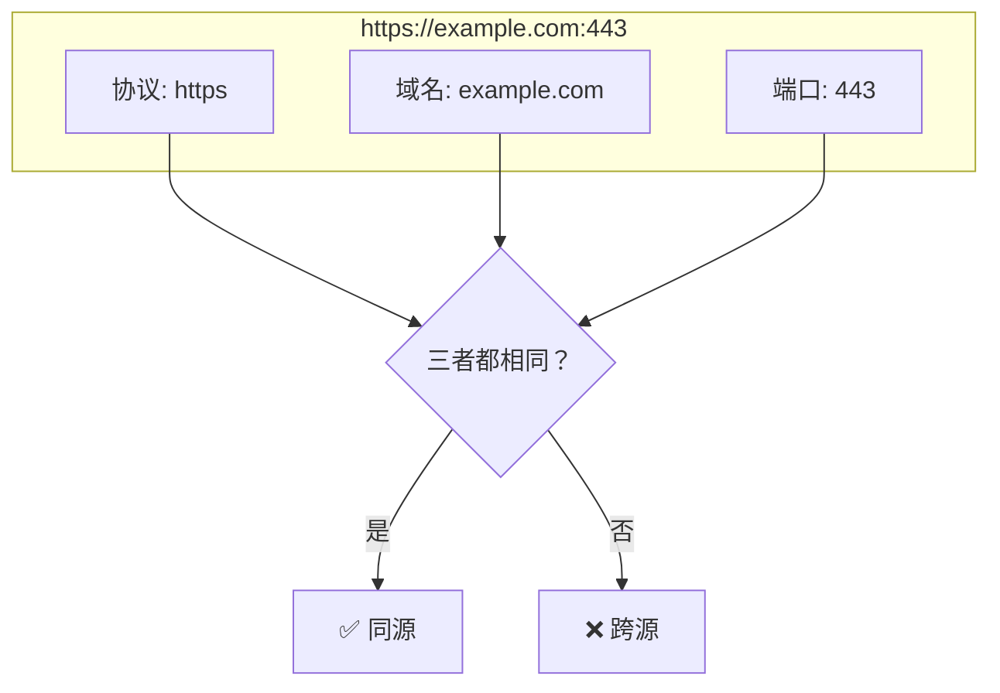
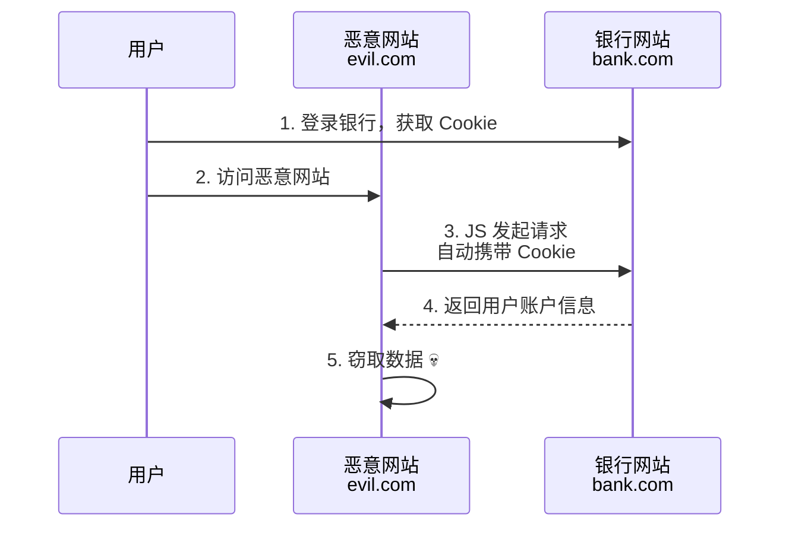
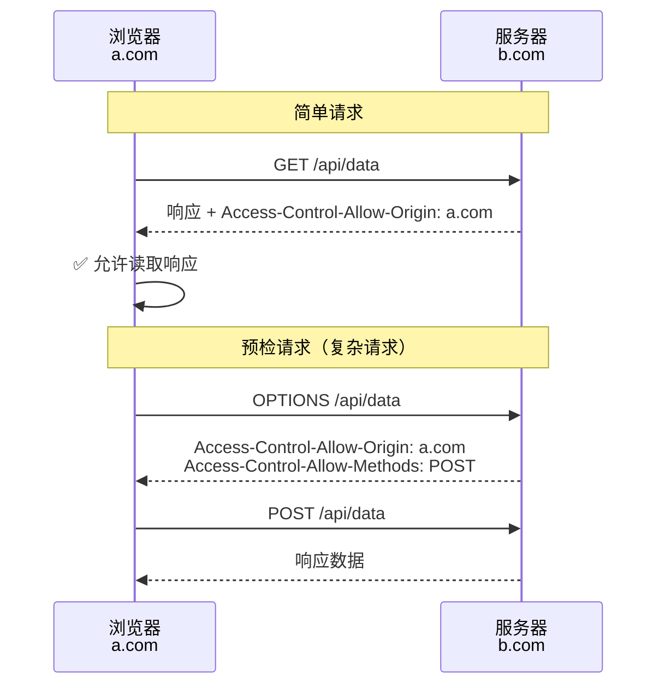
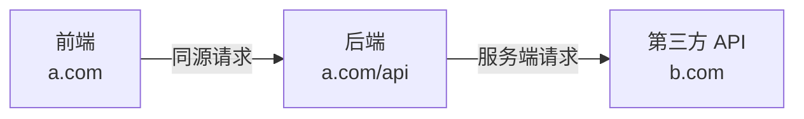

> **核心观点**：同源策略是浏览器的**访问控制策略**——它限制一个源的脚本只能读取同源的资源，防止恶意网站窃取用户在其他网站上的敏感数据。

## 一、什么是"源"

在浏览器中，**源（Origin）** 由三部分组成：

| 组成部分 | 示例                  |
| -------- | --------------------- |
| 协议     | `https://`            |
| 域名     | `example.com`         |
| 端口     | `:443`（HTTPS 默认）  |

**判断规则**：三者完全相同才算同源。



### 同源判断示例

以 `https://example.com/page.html` 为基准：

| URL                                  | 是否同源 | 原因         |
| ------------------------------------ | -------- | ------------ |
| `https://example.com/other.html`     | ✅ 同源   | 路径不同不影响 |
| `http://example.com/page.html`       | ❌ 跨源   | 协议不同     |
| `https://api.example.com/page.html`  | ❌ 跨源   | 子域名也算不同域名 |
| `https://example.com:8080/page.html` | ❌ 跨源   | 端口不同     |

## 二、为什么需要同源策略

想象没有同源策略的世界：



**没有同源策略**：恶意网站的 JS 可以：
- 读取你在银行网站的余额
- 获取你在邮箱的所有邮件
- 窃取任何网站的敏感数据

**有了同源策略**：浏览器会阻止 `evil.com` 的脚本读取 `bank.com` 的响应。

## 三、同源策略限制什么

同源策略主要限制**跨源读取**，而非所有跨源行为：

| 行为类型   | 是否允许 | 示例                          |
| ---------- | -------- | ----------------------------- |
| 跨源写入   | ✅ 允许   | 表单提交、链接跳转            |
| 跨源嵌入   | ✅ 允许   | `<script>`、``、`<iframe>` |
| 跨源读取   | ❌ 禁止   | AJAX 读取响应、iframe 内容读取 |

### 具体限制

```javascript
// ❌ 禁止：读取跨源 AJAX 响应
fetch('https://api.other.com/data')
  .then(res => res.json())  // 请求会发送，但响应被阻止读取

// ❌ 禁止：读取跨源 iframe 内容
const iframe = document.querySelector('iframe');
iframe.contentDocument;  // 抛出安全错误

// ❌ 禁止：读取跨源 canvas 图像数据
const canvas = document.createElement('canvas');
ctx.drawImage(crossOriginImg, 0, 0);
canvas.toDataURL();  // 污染的 canvas，抛出安全错误
```

## 四、如何合法跨源

### 1. CORS（跨源资源共享）

服务端通过 HTTP 头声明"允许谁来访问"：



**关键响应头**：

```http
Access-Control-Allow-Origin: https://a.com
Access-Control-Allow-Methods: GET, POST, PUT
Access-Control-Allow-Headers: Content-Type
Access-Control-Allow-Credentials: true
```

### 2. JSONP（仅限 GET，已过时）

利用 `<script>` 标签不受同源限制的特性：

```javascript
// 客户端
function handleData(data) {
  console.log(data);
}
// <script src="https://api.com/data?callback=handleData"></script>

// 服务端返回
handleData({"name": "Aaron"});
```

**缺点**：只支持 GET、存在 XSS 风险，已被 CORS 取代。

### 3. 代理服务器

通过同源的后端转发请求：



服务端没有同源限制，可以自由请求任何 API。

## 五、常见误区

| 误区                        | 真相                                          |
| --------------------------- | --------------------------------------------- |
| 同源策略阻止请求发送        | ❌ 请求会发送，只是**阻止读取响应**            |
| `` 跨源被阻止          | ❌ 嵌入资源允许，但 JS 无法读取图片像素数据    |
| CORS 是前端配置             | ❌ CORS 是**服务端**通过响应头控制的          |
| 同源策略能防止 CSRF         | ❌ 跨源写入（表单提交）是允许的，需额外防护   |

## 六、总结

同源策略的设计哲学：

| 原则       | 实现                                |
| ---------- | ----------------------------------- |
| 默认隔离   | 不同源的脚本不能互相读取数据        |
| 嵌入宽松   | 允许嵌入跨源资源（script、img 等） |
| 读取严格   | 禁止读取跨源响应内容                |
| 服务端授权 | 通过 CORS 让服务端决定谁能访问      |

**一句话总结**：同源策略体现了浏览器的"最小权限原则"——默认禁止跨源读取，除非目标服务器明确授权。
