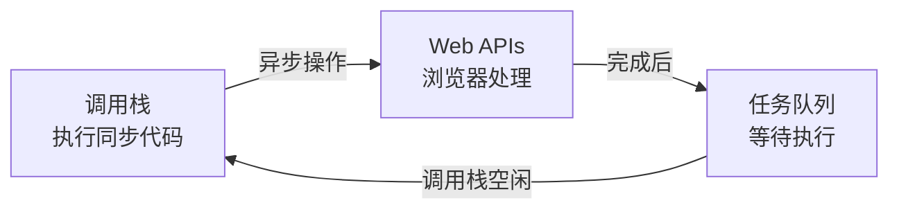
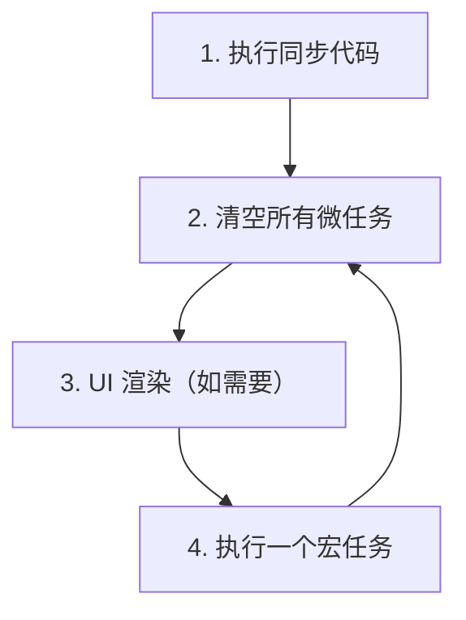

> **核心观点**：事件循环是 JavaScript 单线程实现异步非阻塞的核心机制——它负责**监控调用栈和任务队列，当调用栈空闲时，把任务队列里的任务拿出来执行**。

## 一、核心组成部分

| 组件         | 作用                                      |
| ------------ | ----------------------------------------- |
| 调用栈       | 执行同步代码，后进先出（LIFO）             |
| Web APIs     | 浏览器处理异步操作（setTimeout、fetch 等） |
| 任务队列     | 存放待执行的回调，分为宏任务和微任务队列   |



## 二、宏任务与微任务

| 类型   | 包含                                              |
| ------ | ------------------------------------------------- |
| 宏任务 | `script`、`setTimeout`、`setInterval`、I/O          |
| 微任务 | `Promise.then/catch/finally`、`MutationObserver`   |

**优先级：微任务 > 宏任务**

## 三、事件循环流程



**口诀**：同步代码 → 所有微任务 → 渲染 → 一个宏任务 → 循环

## 四、经典示例

```javascript
console.log('1. 开始');      // 同步

setTimeout(() => {
    console.log('2. setTimeout'); // 宏任务
}, 0);

Promise.resolve().then(() => {
    console.log('3. Promise');    // 微任务
});

console.log('4. 结束');      // 同步
```

**执行分析**：

| 阶段             | 动作                                  | 输出       |
| ---------------- | ------------------------------------- | ---------- |
| 同步执行         | 执行 `console.log`，注册异步回调       | 1, 4       |
| 清空微任务队列   | 执行 Promise 回调                     | 3          |
| 执行宏任务       | 执行 setTimeout 回调                  | 2          |

**输出结果**：`1. 开始` → `4. 结束` → `3. Promise` → `2. setTimeout`

## 五、总结

| 要点         | 说明                                    |
| ------------ | --------------------------------------- |
| 单线程       | JS 同一时间只能做一件事                 |
| 异步不阻塞   | 耗时操作交给 Web APIs，不卡住调用栈     |
| 微任务优先   | 每个宏任务后，必须清空所有微任务        |
| 循环往复     | 宏任务 → 微任务 → 宏任务 → ...          |

**一句话总结**：事件循环让单线程的 JavaScript 能够"一心多用"——同步代码优先执行，微任务插队，宏任务排队。
