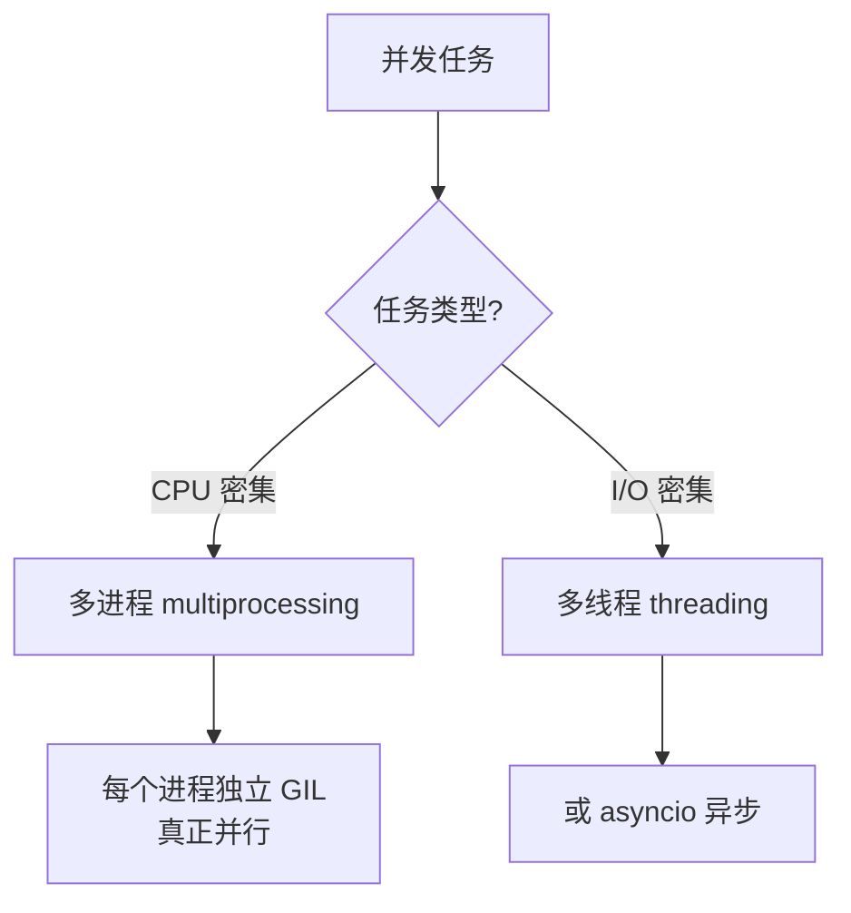

> **核心观点**：GIL 是 CPython 为保护引用计数而设计的全局锁，它让多线程无法利用多核。理解 GIL 的本质和边界，是写出高效 Python 并发代码的关键。

## 一、GIL 是什么

**GIL（Global Interpreter Lock，全局解释器锁）** 是 CPython 解释器中的一把互斥锁。它的规则很简单：**任何时刻，只有一个线程能执行 Python 字节码**。


可以把 GIL 想象成工作间唯一的门禁卡——无论有多少工人（线程）排队，只有拿到卡的那个才能进去干活。

## 二、为什么需要 GIL

GIL 的存在源于 CPython 的**引用计数**内存管理机制：

| 机制 | 说明 |
|------|------|
| 引用计数 | 每个对象记录被引用次数，归零时立即回收 |
| 竞态风险 | 多线程同时修改计数可能导致内存错误 |
| GIL 方案 | 用一把全局锁保护所有对象访问 |

在**单核时代**，这个设计简单高效。但进入**多核时代**后，GIL 成了性能瓶颈：即使有 8 个核，同一时刻也只能有一个线程在执行 Python 代码。

## 三、GIL 的真实影响

GIL 的影响**取决于任务类型**：

### CPU 密集型任务

特点：大量计算，如数值处理、图像处理。

**多线程不仅无效，可能更慢**——线程争抢 GIL 的开销反而拖累性能：

| 方式 | 耗时 | 说明 |
|------|------|------|
| 单线程 | 3.2s | 基准 |
| 4 线程 | 6.1s | 比单线程慢（GIL 竞争） |
| 4 进程 | 1.8s | 真正并行，接近 4 倍加速 |

### I/O 密集型任务

特点：大量等待，如网络请求、文件读写。

**多线程非常有效**——线程在 I/O 等待时会释放 GIL，让其他线程执行：

| 方式 | 耗时 | 说明 |
|------|------|------|
| 多线程 | 1.2s | 高效并发 |
| 多进程 | 1.5s | 进程开销抵消优势 |

## 四、如何突破 GIL



### 方案对比

| 方案 | 适用场景 | 多核利用 | 开销 |
|------|----------|----------|------|
| `threading` | I/O 密集 | ❌ | 低 |
| `multiprocessing` | CPU 密集 | ✅ | 高（独立内存） |
| `asyncio` | 高并发 I/O | ❌ | 极低 |
| C 扩展（NumPy 等） | 计算密集 | ✅ | 取决于具体库 |

**多进程示例**：

```python
from multiprocessing import Pool

def square(x):
    return x * x

if __name__ == '__main__':
    with Pool(4) as p:
        print(p.map(square, range(10)))
```

## 五、历史转折：Python 3.13 的无 GIL 实验

经过多年努力，**Python 3.13** 通过 PEP 703 实现了**可选的无 GIL 模式**。这是 Python 并发史上的重大突破。

### 如何体验

从 Python 3.13 起，官方提供 "free-threaded" 构建版本：

```python
import sys
print(sys._is_gil_enabled())  # False 表示 GIL 已禁用
```

### 技术实现

| 技术 | 作用 |
|------|------|
| 偏置引用计数 | 同线程内快速操作，跨线程才用原子操作 |
| 不朽对象 | `None`、小整数等不再修改引用计数 |
| 细粒度锁 | 容器操作使用局部锁替代全局锁 |

### 权衡

| 方面 | 影响 |
|------|------|
| 单线程性能 | 略慢 3-5% |
| 内存占用 | 增加约 10% |
| 生态兼容 | 部分 C 扩展需要适配 |

**实测效果**：CPU 密集型多线程任务从 5.77s 降至 1.36s。

> ⚠️ 目前仍处于实验阶段，不建议用于生产环境。预计 Python 3.14/3.15 后逐渐成熟。

## 六、总结

| 要点 | 内容 |
|------|------|
| GIL 本质 | 保护引用计数的全局锁 |
| CPU 密集型 | GIL 是瓶颈，用多进程 |
| I/O 密集型 | GIL 影响小，用多线程 |
| 未来方向 | Python 3.13+ 支持无 GIL 模式 |

**一句话总结**：GIL 是单核时代的产物，理解它的边界才能写出高效的并发代码；而无 GIL Python 的到来，标志着 Python 正式迈入多核并行时代。
