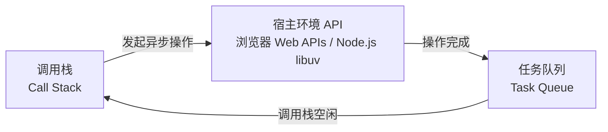
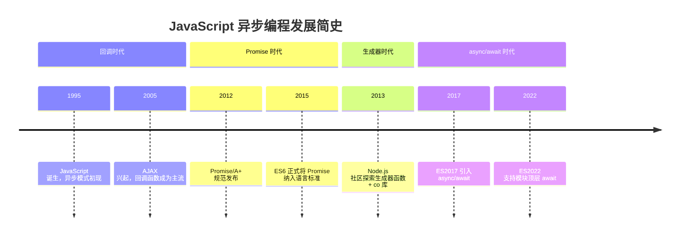
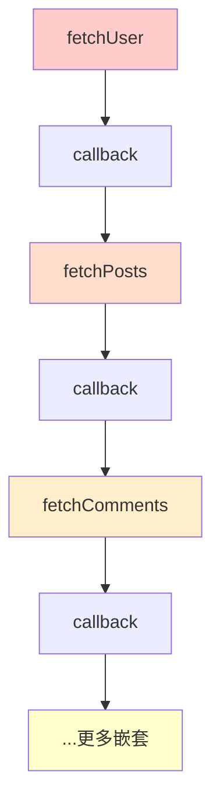
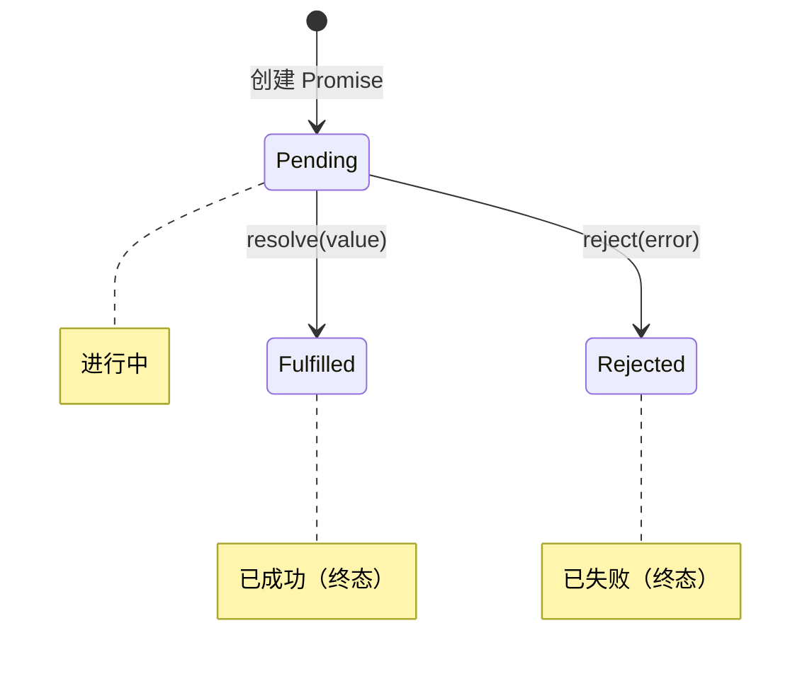
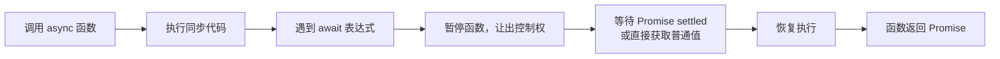

> **核心观点**：JavaScript 异步编程的演进史，就是一部**不断摆脱"回调地狱"，让异步代码更优雅、更接近同步思维**的历史。理解这条进化之路，是掌握现代 JavaScript 的必经之路。

## 一、什么是异步编程

要理解异步，先要理解 JavaScript 的执行模型。

### 1.1 单线程与事件循环

JavaScript 的执行环境是**单线程**的，这意味着它一次只能执行一个任务。为了避免耗时任务（如等待服务器响应）导致整个程序"卡死"，JavaScript 采用了**事件循环（Event Loop）** 机制。

> **注意**：事件循环并非 ECMAScript 语言规范的一部分，而是由宿主环境定义——浏览器中由 [WHATWG HTML 规范](https://html.spec.whatwg.org/multipage/webappapis.html#event-loops) 定义，Node.js 中由 libuv 库实现。



其核心思想是：
1. **同步任务**在主线程上执行，形成一个**执行栈（Call Stack）**
2. **异步操作**被交给宿主环境处理（浏览器的 Web APIs 或 Node.js 的 libuv）
3. 异步操作完成后，其**回调函数**被放入**任务队列（Task Queue）**
4. 当执行栈为空时，事件循环从任务队列取出回调执行

> **注意**：并非所有异步操作都使用额外线程。例如网络 I/O 通常使用操作系统的非阻塞 I/O 机制，而 `Promise.resolve().then()` 只是将回调加入微任务队列，完全不涉及额外线程。

### 1.2 同步 vs. 异步

| 特性         | 同步（Synchronous）                                | 异步（Asynchronous）                                     |
| :----------- | :------------------------------------------------- | :------------------------------------------------------- |
| **执行方式** | 代码按顺序**逐行执行**，上一行未完成则下一行等待    | 发起操作后**不立即等待**，继续执行后续代码                 |
| **阻塞情况** | **会阻塞**后续代码，耗时操作导致程序"假死"          | **不阻塞**主线程，保证 UI 持续响应                        |
| **典型场景** | 数学运算、变量赋值、函数调用                        | 网络请求、文件读写、定时器、事件监听                      |
| **比喻**     | **排队买票**：必须等前一个人买完                    | **餐厅点餐**：点完菜后找座位坐下，菜好了服务员端上来       |

## 二、异步编程发展史

JavaScript 异步编程经历了四个主要阶段：



### 2.1 回调函数（Callback）—— 异步的起点

这是最原始的异步编程方式。将一个函数作为参数传递给另一个函数，在操作完成后被调用。

```javascript
// 模拟异步操作（使用 Node.js 风格的"错误优先回调"约定）
function doAsyncTask(callback) {
  setTimeout(() => {
    const data = "这是异步获取的数据";
    callback(null, data); // 第一个参数是错误（null 表示无错误），第二个是数据
  }, 1000);
}

// 使用回调处理结果
console.log('开始执行异步任务...');
doAsyncTask(function(error, result) {
  if (error) {
    console.error('发生错误:', error);
  } else {
    console.log('异步任务完成:', result); // 1秒后执行
  }
});
console.log('这句代码会立即执行');
```

> **错误优先回调（Error-First Callback）**：这是 Node.js 社区的约定——回调函数的第一个参数保留给错误对象（无错误时为 `null`），第二个参数才是成功的数据。

| 方面 | 说明 |
|------|------|
| 优点 | 简单直接，是理解异步机制的基础 |
| 缺点 | **回调地狱（Callback Hell）**——多个依赖的异步操作导致层层嵌套 |

**回调地狱示例**：

```javascript
fetchUser(function(user) {
  fetchPosts(user.id, function(posts) {
    fetchComments(posts[0].id, function(comments) {
      // ...一层又一层，难以阅读和维护
    });
  });
});
```



### 2.2 Promise —— 链式调用与状态管理

为了解决回调地狱，**Promise** 应运而生。Promise 是一个代表**异步操作最终结果**的对象。

#### Promise 的三种状态



| 术语 | 含义 |
|------|------|
| **Pending**（待定） | 初始状态，既未成功也未失败 |
| **Fulfilled**（已兑现） | 操作成功完成 |
| **Rejected**（已拒绝） | 操作失败 |
| **Settled**（已敲定） | Fulfilled 或 Rejected 的统称，即不再是 Pending |
| **Resolved**（已决议） | Promise 的最终去向已确定（可能是 fulfilled、rejected，或锁定到另一个 Promise） |

> **`resolve()` vs `fulfill`**：Promise 构造器中的 `resolve()` 回调并不总是导致 Fulfilled 状态。如果传入的值本身是一个被拒绝的 Promise，则原 Promise 也会变为 Rejected。

**状态一旦改变（settled），就不会再变**。这是 Promise 的核心特性。

```javascript
// 使用 Promise 封装异步操作
function doAsyncTaskWithPromise() {
  return new Promise((resolve, reject) => {
    setTimeout(() => {
      const success = true;
      if (success) {
        resolve("这是异步获取的数据");
      } else {
        reject("操作失败");
      }
    }, 1000);
  });
}

// 链式调用
doAsyncTaskWithPromise()
  .then(result => {
    console.log('成功:', result);
    return result + " - 处理后";
  })
  .then(processed => {
    console.log('处理结果:', processed);
  })
  .catch(error => {
    console.error('错误:', error);
  });
```

| 方面 | 说明 |
|------|------|
| 优点 | 通过 `.then()` 链解决回调地狱；`.catch()` 统一错误处理；状态可预期 |
| 缺点 | 大量 `.then()` 仍显冗长；在 `.then()` 中遗忘 `.catch()` 会导致未捕获错误 |

### 2.3 生成器函数（Generator）—— 暂停与恢复

生成器函数是 ES6 引入的特殊函数，通过 `function*` 和 `yield` 实现**暂停执行**和**恢复执行**。

开发者发现，通过在生成器内部使用 `yield` 等待异步操作，可以写出非常像同步代码的异步逻辑。社区中出现了 `co` 库来自动执行生成器。

```javascript
// 使用生成器 + co 库
const co = require('co');

function fetchUser() {
  return Promise.resolve({ id: 1, name: 'Alice' });
}
function fetchPosts(userId) {
  return Promise.resolve([{ title: 'Post 1' }]);
}

// 看起来就像同步代码！
co(function* () {
  try {
    const user = yield fetchUser();
    console.log('用户:', user);
    const posts = yield fetchPosts(user.id);
    console.log('文章:', posts);
  } catch (error) {
    console.error('错误:', error);
  }
});
```

| 方面 | 说明 |
|------|------|
| 优点 | 代码最接近同步风格，彻底摆脱 `.then()` 链 |
| 缺点 | 需要外部库支持（非语言原生）；概念抽象，理解成本高；并非为异步而生 |

### 2.4 async/await —— 异步编程的终极形态

`async/await` 是 ES2017 引入的**语法糖**，基于 Promise 实现，被认为是异步编程的**终极解决方案**。



- **`async`**：声明异步函数，该函数**总是返回 Promise**（即使 return 非 Promise 值也会自动包装）
- **`await`**：可以等待**任何值**（Promise、thenable 对象或普通值）。如果是 Promise/thenable，则暂停执行直到其 settled；如果是普通值，则直接返回该值。ES2022 起支持在**模块顶层**使用

```javascript
function fetchUser() {
  return Promise.resolve({ id: 1, name: 'Alice' });
}
function fetchPosts(userId) {
  return Promise.resolve([{ title: 'Post 1' }]);
}

// 完全同步的代码风格！
async function getUserAndPosts() {
  try {
    const user = await fetchUser();
    console.log('用户:', user);
    const posts = await fetchPosts(user.id);
    console.log('文章:', posts);
  } catch (error) {
    console.error('错误:', error);
  }
}

getUserAndPosts();
console.log('这句代码会立即执行');
```

| 方面 | 说明 |
|------|------|
| 优点 | 最佳可读性；标准 `try/catch` 错误处理；原生支持，无需外部库；完全兼容 Promise |
| 缺点 | ES2022 前 `await` 只能在 `async` 函数内使用；理解底层原理仍需学习 |

## 三、四种方式对比

| 特性           | 回调函数           | Promise            | 生成器 + co        | async/await        |
| :------------- | :----------------- | :----------------- | :----------------- | :----------------- |
| **代码可读性** | ⭐⭐               | ⭐⭐⭐             | ⭐⭐⭐⭐⭐         | ⭐⭐⭐⭐⭐         |
| **错误处理**   | ⭐⭐               | ⭐⭐⭐⭐           | ⭐⭐⭐⭐           | ⭐⭐⭐⭐⭐         |
| **学习曲线**   | ⭐⭐⭐⭐⭐         | ⭐⭐⭐             | ⭐⭐               | ⭐⭐⭐⭐           |
| **社区/生态**  | ⭐⭐⭐⭐⭐         | ⭐⭐⭐⭐⭐         | ⭐⭐               | ⭐⭐⭐⭐⭐         |
| **适用场景**   | 简单一次性操作     | 中等复杂度异步流程 | 已被取代           | **现代开发首选**   |

## 四、最佳实践与常见误区

### 4.1 最佳实践

#### 优先使用 async/await

对于新代码，`async/await` 提供最佳开发体验和可维护性。

#### 善用 Promise.all() 并发执行

当多个异步操作**互不依赖**时，并发执行可显著提高效率：

```javascript
// ❌ 串行执行，总耗时 = t1 + t2
const user = await fetchUser();
const posts = await fetchPosts();

// ✅ 并发执行，总耗时 = max(t1, t2)
const [userData, postList] = await Promise.all([fetchUser(), fetchPosts()]);
```

> **并发 vs 并行**：JavaScript 是单线程的，`Promise.all()` 实现的是**并发（Concurrency）**——多个异步操作同时进行，而非**并行（Parallelism）**——多个线程同时执行代码。

#### 始终处理错误

无论用 `.catch()` 还是 `try/catch`，**不要让异步错误未捕获**。

#### 理解微任务与宏任务

| 类型   | 包含                                                        | 优先级 |
| ------ | ----------------------------------------------------------- | ------ |
| 微任务 | `Promise.then/catch/finally`、`MutationObserver`、`queueMicrotask()` | 高     |
| 宏任务 | `script`（初始脚本）、`setTimeout`、`setInterval`、I/O       | 低     |

> **注意**：「宏任务」是社区常用术语，WHATWG 规范中称为「Task」。

**执行顺序**：同步代码 → 清空所有微任务 → 一个宏任务 → 循环

### 4.2 常见误区

| 误区 | 真相 |
|------|------|
| `await` 会阻塞整个程序 | ❌ `await` **只暂停当前 async 函数**，不阻塞主线程 |
| `async` 函数总是异步的 | ❌ 第一个 `await` 之前的代码**同步执行** |
| Promise 是"线程" | ❌ JavaScript 仍是单线程，Promise 只是状态管理对象 |
| `await` 只能在 async 函数内用 | ❌ ES2022 起，**模块顶层**也可以直接使用 `await` |

**`async` 函数执行顺序示例**：

```javascript
async function foo() {
  console.log('1. 同步执行');  // 立即执行
  await 1;
  console.log('3. 异步执行');  // await 后执行
}

foo();
console.log('2. 主线程代码');  // 同步执行
```

**输出顺序**：`1. 同步执行` → `2. 主线程代码` → `3. 异步执行`

#### ES2022 顶层 await 示例

```javascript
// config.mjs（ES 模块）
const response = await fetch('/api/config');  // 模块顶层直接 await
export const config = await response.json();

// app.mjs
import { config } from './config.mjs';  // 自动等待 config 加载完成
console.log(config);
```

> **注意**：顶层 await 仅限于 ES 模块（`.mjs` 或 `type: "module"`），不适用于普通脚本。

## 五、总结

| 阶段 | 方案 | 意义 |
|------|------|------|
| **起点** | 回调函数 | 奠定异步基础，但嵌套是噩梦 |
| **革命** | Promise | 解决嵌套，统一异步接口，现代异步基石 |
| **探索** | 生成器函数 | 证明"同步风格写异步"的可行性 |
| **终点** | async/await | 语法糖完美结合生成器优雅与 Promise 可靠性 |

**给你的建议**：

1. **优先使用 async/await**：在新项目中写出更优雅、更易维护的异步代码
2. **彻底理解 Promise**：async/await 是基于 Promise 的，理解其工作原理非常重要
3. **了解回调**：能读懂旧代码，但避免写出新的回调地狱
4. **深入事件循环**：理解调用栈、任务队列的模型，能从根本上分析复杂异步问题

**一句话总结**：JavaScript 异步编程从回调函数到 async/await 的演进，是从"能用"到"好用"的进化——async/await 让我们用同步的思维写出优雅的异步代码。
