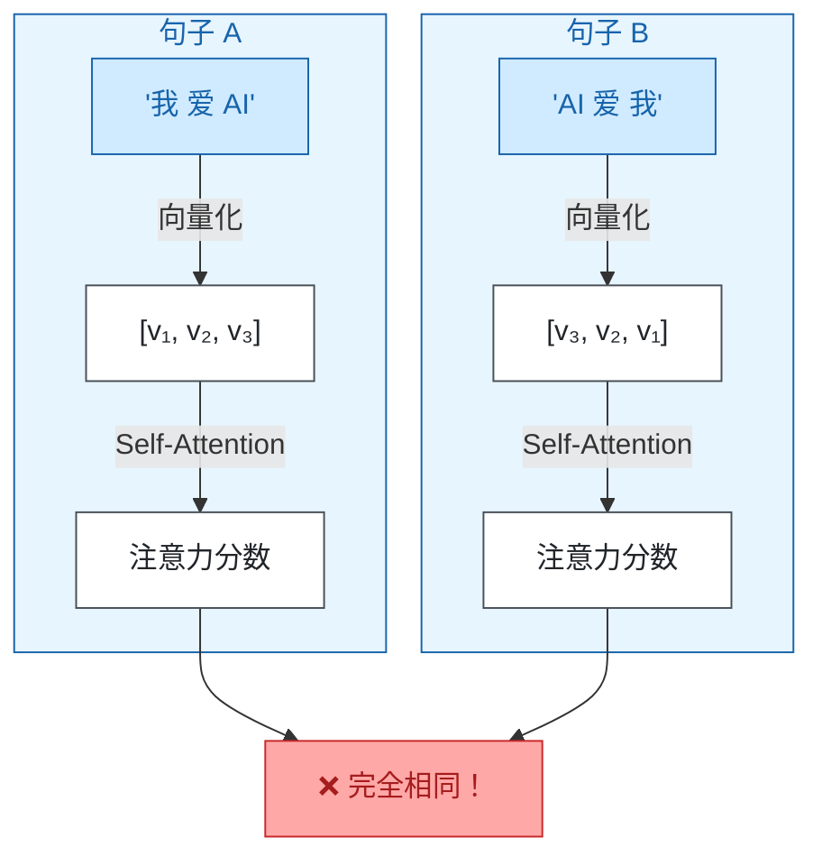
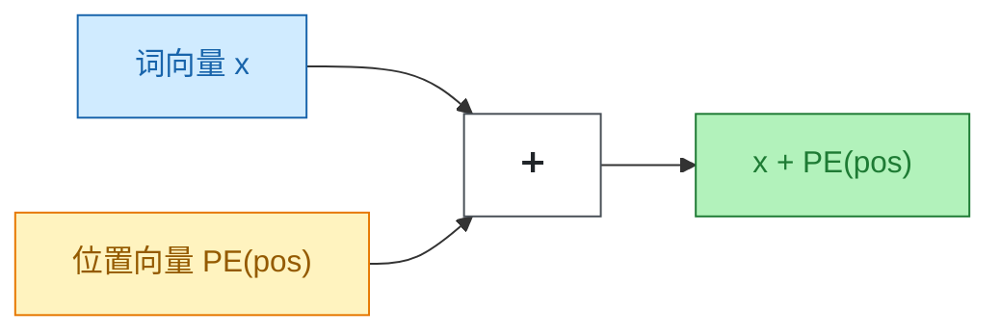
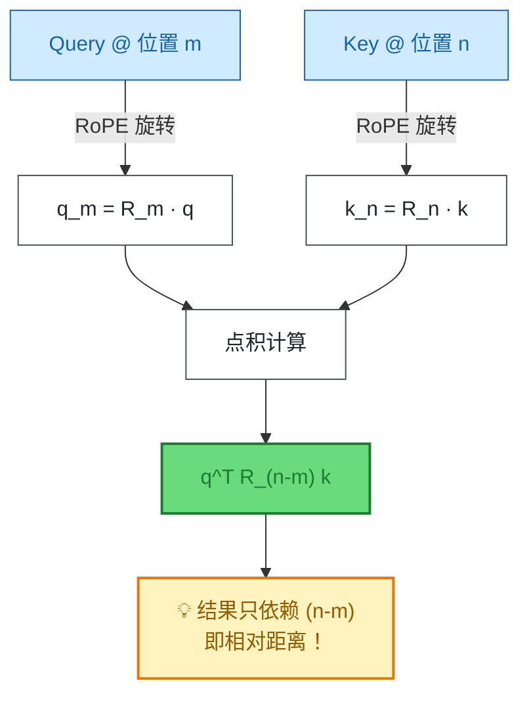
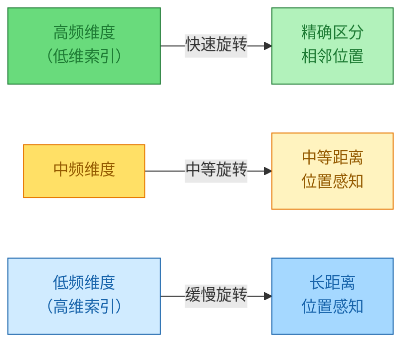
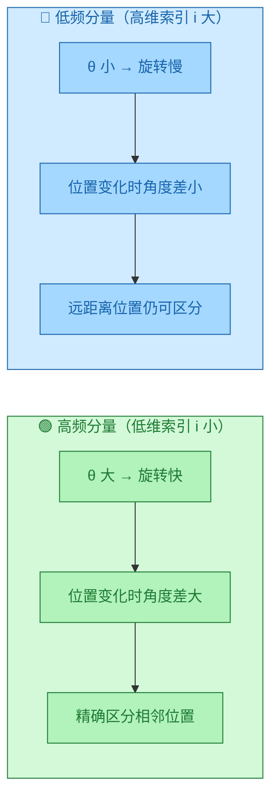

> **核心观点**：RoPE 通过**旋转向量**将位置信息编码到向量的**方向**中，使模型在计算注意力时能够直接感知**相对位置**，从而突破了传统绝对位置编码的泛化瓶颈，成为当代大语言模型的标配技术。

## 一、起点：为什么需要位置编码？

在 Transformer 出现之前，RNN 和 LSTM 天然具备处理序列的能力——它们按顺序一个一个地处理 token，位置信息隐含在处理顺序中。

但 Transformer 不同。它的核心机制——**自注意力（Self-Attention）**——是**并行**计算所有 token 之间的关系的。这带来了一个问题：



**问题本质**：自注意力机制对输入的**排列顺序不敏感**（permutation invariant）。如果不加任何位置标记，"我爱AI"和"AI爱我"在模型眼中完全等价。

因此，我们必须**显式地**告诉模型：这句话里的字，哪个在前，哪个在后，它们之间的距离有多远。

这就是**位置编码（Positional Encoding）**的使命。

## 二、历史演进：位置编码的三代技术

### 第一代：正弦位置编码（Sinusoidal PE）

2017 年原始 Transformer 论文提出了一种优雅的解决方案：使用不同频率的正弦和余弦函数来编码位置。

$$
PE_{(pos, 2i)} = \sin\left(\frac{pos}{10000^{2i/d}}\right)
$$

$$
PE_{(pos, 2i+1)} = \cos\left(\frac{pos}{10000^{2i/d}}\right)
$$

其中 $pos$ 是位置，$i$ 是维度索引，$d$ 是向量维度。



**优点**：
- 无需学习，直接计算
- 理论上可以泛化到任意长度

**缺点**：
- 位置信息通过**加法**注入，可能与语义信息产生干扰
- 模型无法**显式**感知相对位置

### 第二代：可学习绝对位置编码（Learned Absolute PE）

BERT 和 GPT 系列采用了更简单粗暴的方式：直接为每个位置学习一个向量。

```python
# 伪代码
position_embeddings = nn.Embedding(max_length, hidden_size)
output = word_embedding + position_embeddings[position_ids]
```

**优点**：
- 实现简单，模型可以学习到最优的位置表示

**致命缺点**：
- **无法泛化到训练时未见过的位置**
- 训练时 `max_length=512`，推理时给 1024 长度的文本就会崩溃
- 模型只知道"我在第 100 位"，不知道"我和第 101 位相距 1"

### 第三代：相对位置编码的崛起

研究者们意识到：语言理解中，**相对位置**往往比绝对位置更重要。

- "他"指代的是**前面**的某个名词
- 形容词通常在名词**之前**
- 主语和谓语之间的**距离**影响语义理解


**代表性工作**：

| 方法 | 年份 | 特点 |
|------|------|------|
| Transformer-XL | 2019 | 在注意力分数中加入相对位置偏置 |
| T5 Relative PE | 2020 | 学习相对位置的 bias 向量 |
| ALiBi | 2022 | 根据距离线性衰减注意力分数 |
| **RoPE** | 2021 | 通过旋转实现相对位置编码 |

## 三、RoPE 的核心原理：用旋转代替加法

### 3.1 核心思想

RoPE 的灵感来源于**复数乘法**和**几何旋转**。

传统方法是在词向量上**加**一个位置向量：

$$
\text{output} = \text{embedding} + \text{position}
$$

RoPE 则是用位置信息**旋转**词向量：

$$
\text{output} = \text{Rotate}(\text{embedding}, \theta \cdot m)
$$

其中 $m$ 是位置，$\theta$ 是旋转的基础角度。

### 3.2 二维旋转的直觉

想象你在二维平面上有一个点 $(x, y)$。把它绕原点旋转角度 $\theta$：

$$
\begin{pmatrix} x' \\ y' \end{pmatrix} = 
\begin{pmatrix} \cos\theta & -\sin\theta \\ \sin\theta & \cos\theta \end{pmatrix}
\begin{pmatrix} x \\ y \end{pmatrix}
$$


**关键性质**：旋转保持向量的**模长不变**，只改变**方向**。

### 3.3 RoPE 的具体操作

RoPE 将高维向量两两分组，每组作为一个二维子空间进行旋转：

对于位置 $m$ 的向量 $\mathbf{x} = (x_1, x_2, x_3, x_4, ..., x_{d-1}, x_d)$：

$$
\text{RoPE}(\mathbf{x}, m) = 
\begin{pmatrix}
x_1 \cos(m\theta_1) - x_2 \sin(m\theta_1) \\
x_1 \sin(m\theta_1) + x_2 \cos(m\theta_1) \\
x_3 \cos(m\theta_2) - x_4 \sin(m\theta_2) \\
x_3 \sin(m\theta_2) + x_4 \cos(m\theta_2) \\
\vdots
\end{pmatrix}
$$

不同维度使用不同的基础频率 $\theta_i$：

$$
\theta_i = 10000^{-2i/d}
$$

> **实现说明**：上述公式采用"交错配对"方式，即 $(x_1, x_2), (x_3, x_4), ...$ 为一组。实际代码实现（如 LLaMA、GPT-NeoX）通常采用"分半配对"方式，即 $(x_i, x_{i+d/2})$ 为一组，将向量分成前后两半进行配对。两种方式**数学上完全等价**，只是维度排列顺序不同。

## 四、为什么 RoPE 能感知相对位置？

这是 RoPE 最神奇的地方。让我们来看数学推导。

### 4.1 注意力分数的计算

在注意力机制中，Query 向量 $\mathbf{q}$ 和 Key 向量 $\mathbf{k}$ 的点积决定了注意力分数：

$$
\text{Attention}(Q, K) = \text{softmax}\left(\frac{QK^T}{\sqrt{d_k}}\right)
$$

假设 Query 在位置 $m$，Key 在位置 $n$。经过 RoPE 编码后：

$$
\mathbf{q}_m = R_m \mathbf{q}, \quad \mathbf{k}_n = R_n \mathbf{k}
$$

其中 $R_m$ 和 $R_n$ 是旋转矩阵。

### 4.2 相对位置的显现

计算点积：

$$
\mathbf{q}_m^T \mathbf{k}_n = (R_m \mathbf{q})^T (R_n \mathbf{k}) = \mathbf{q}^T R_m^T R_n \mathbf{k}
$$

由于旋转矩阵的性质 $R_m^T = R_{-m}$，所以：

$$
\mathbf{q}_m^T \mathbf{k}_n = \mathbf{q}^T R_{n-m} \mathbf{k}
$$

**关键洞察**：最终的注意力分数**只依赖于 $(n-m)$**，即两个位置的**相对距离**！



这意味着：
- 模型**不关心**词是在第 100 位还是第 1000 位
- 模型**只关心**它们之间**相隔几个位置**

## 五、RoPE 的三大优势

### 优势一：相对位置感知

正如上面推导的，RoPE 天然具备相对位置感知能力。

| 编码方式 | 位置 100 和 101 | 位置 500 和 501 |
|----------|-----------------|-----------------|
| 绝对位置 | PE(100), PE(101) | PE(500), PE(501) 完全不同 |
| RoPE | 相对距离 = 1 | 相对距离 = 1 **相同！** |

### 优势二：多尺度位置感知

RoPE 通过多频率设计，使模型能同时关注不同尺度的位置关系。



**注意**：RoPE 本身**并不会自动导致**注意力分数随距离衰减。是否产生"近处关注强、远处关注弱"的效果，取决于模型学习到的 Query/Key 权重。RoPE 只是提供了编码相对位置的能力，如何利用这个信息由模型自己学习。

> 这与 ALiBi 不同——ALiBi **显式地**对注意力分数施加线性衰减偏置，而 RoPE 是隐式编码。

### 优势三：长度外推潜力

由于 RoPE 基于相对位置，它具备一定的长度外推能力：

| 训练长度 | 推理长度 | 绝对位置编码 | RoPE |
|----------|----------|--------------|------|
| 2048 | 2048 | ✅ 正常 | ✅ 正常 |
| 2048 | 4096 | ❌ 崩溃（没见过 2049+ 的位置） | ⚠️ 性能下降，但可用 |
| 2048 | 4096 + YaRN | - | ✅ 通过插值恢复性能 |

这也是为什么 **YaRN**、**NTK-aware** 等长文本扩展技术都是基于 RoPE 的数学原理来改进的。

## 六、多频率设计：既见树木，又见森林

RoPE 为不同维度设计了不同的旋转频率：

$$
\theta_i = 10000^{-2i/d} = \frac{1}{10000^{2i/d}}
$$

其中 $i$ 是维度对的索引（从 0 开始），$d$ 是向量总维度。

**关键理解**：$i$ 越小，$\theta_i$ 越大（频率越高）；$i$ 越大，$\theta_i$ 越小（频率越低）。

| 维度索引 $i$ | $\theta_i$ 值 | 频率 | 旋转速度 | 擅长捕捉 |
|-------------|--------------|------|---------|---------|
| $i = 0$（低维） | $\theta_0 = 1$ | 高频 | 快 | 局部细节、相邻位置差异 |
| $i = d/4$（中维） | $\theta \approx 0.01$ | 中频 | 中等 | 中等距离依赖 |
| $i = d/2-1$（高维） | $\theta \approx 0.0001$ | 低频 | 慢 | 长距离依赖 |



**直观理解**：
- **高频维度**（快速旋转）：相邻两个位置的角度差就很大，能精确区分"第 5 位"和"第 6 位"
- **低频维度**（缓慢旋转）：即使位置差 1000，角度变化也不大，因此能"看到"很远的位置

**类比**：就像傅里叶变换用不同频率的正弦波来表示信号，RoPE 用不同频率的旋转来编码位置，使模型能同时关注局部细节和全局结构。

## 七、RoPE 的代码实现

以下是 RoPE 的核心实现逻辑（参考 GPT-NeoX / LLaMA 实现）：

```python
import torch

class RotaryEmbedding(torch.nn.Module):
    """旋转位置编码"""
    def __init__(self, dim: int, base: int = 10000):
        super().__init__()
        # 计算不同维度的频率：theta_i = 1 / (base^(2i/d))
        # arange(0, dim, 2) 生成 [0, 2, 4, ...] 对应维度对索引 * 2
        inv_freq = 1.0 / (base ** (torch.arange(0, dim, 2).float() / dim))
        self.register_buffer("inv_freq", inv_freq)
        self.seq_len_cached = None
        self.cos_cached = None
        self.sin_cached = None
    
    def forward(self, x, seq_len: int):
        # 动态计算并缓存
        if seq_len != self.seq_len_cached:
            self.seq_len_cached = seq_len
            # 位置索引 [0, 1, 2, ..., seq_len-1]
            t = torch.arange(seq_len, device=x.device).type_as(self.inv_freq)
            # 外积得到每个位置、每个维度的角度 [seq_len, dim/2]
            freqs = torch.einsum("i,j->ij", t, self.inv_freq)
            # 拼接两份用于 rotate_half 技巧 [seq_len, dim]
            emb = torch.cat((freqs, freqs), dim=-1)
            # 添加维度以便广播到 [batch, seq, heads, dim]
            # 形状变为 [seq_len, 1, 1, dim]
            self.cos_cached = emb.cos()[:, None, None, :]
            self.sin_cached = emb.sin()[:, None, None, :]
        return self.cos_cached, self.sin_cached


def rotate_half(x):
    """将向量的前半部分和后半部分交换，并对新的前半部分取负
    
    输入: x = [a_1, ..., a_{d/2}, b_1, ..., b_{d/2}]  (a 是前半，b 是后半)
    输出: [-b_1, ..., -b_{d/2}, a_1, ..., a_{d/2}]
    
    这是一种高效的旋转实现技巧，配合 cos/sin 使用可实现完整的 2D 旋转。
    """
    x1, x2 = x[..., : x.shape[-1] // 2], x[..., x.shape[-1] // 2 :]
    return torch.cat((-x2, x1), dim=-1)


def apply_rotary_pos_emb(q, k, cos, sin):
    """
    对 Query 和 Key 应用旋转位置编码（分半配对实现）
    
    数学原理（以向量前半 a 和后半 b 为配对）：
    原始向量: [a_1, a_2, ..., a_{d/2}, b_1, b_2, ..., b_{d/2}]
    配对关系: (a_i, b_i) 构成一个旋转对
    
    旋转公式: (a_i, b_i) → (a_i·cos - b_i·sin, b_i·cos + a_i·sin)
    
    使用 rotate_half 实现：
    x * cos + rotate_half(x) * sin
    = [a·cos, b·cos] + [-b·sin, a·sin]
    = [a·cos - b·sin, b·cos + a·sin] ✓
    
    参数:
        q, k: [batch, seq_len, num_heads, head_dim]
        cos, sin: [seq_len, 1, 1, head_dim] (会广播到 q/k 的形状)
    """
    q_embed = (q * cos) + (rotate_half(q) * sin)
    k_embed = (k * cos) + (rotate_half(k) * sin)
    return q_embed, k_embed
```

**实现要点**：
- **只对 Query 和 Key 应用 RoPE**，不对 Value 应用（Value 不参与位置相关的点积计算）
- 使用 `rotate_half` 技巧避免显式构造旋转矩阵，计算更高效
- `cos`/`sin` 需要正确的维度以便广播到 `[batch, seq, heads, dim]`
- 实际部署时通常结合 Flash Attention 等优化技术

## 八、谁在使用 RoPE？

RoPE 已经成为现代大语言模型的**标配**：

| 模型 | 开发者 | 是否使用 RoPE |
|------|--------|---------------|
| LLaMA / LLaMA 2 / LLaMA 3 | Meta | ✅ |
| Qwen (通义千问) | 阿里巴巴 | ✅ |
| ChatGLM | 智谱 AI | ✅ |
| Mistral / Mixtral | Mistral AI | ✅ |
| Baichuan | 百川智能 | ✅ |
| DeepSeek | 深度求索 | ✅ |
| Gemma | Google | ✅ |

可以说，**如果一个模型宣称支持长上下文，它大概率使用了 RoPE 或其变体**。

## 九、RoPE 的扩展：长文本技术

基于 RoPE 的数学特性，研究者们开发了多种长文本扩展技术：

| 技术 | 原理 | 效果 |
|------|------|------|
| **位置插值 (PI)** | 线性缩放位置索引 | 简单有效，但高频信息丢失 |
| **NTK-aware** | 修改频率基数 base | 保持高频信息 |
| **YaRN** | 分段处理不同频率 | 目前最优，广泛应用 |
| **动态 NTK** | 根据实际长度动态调整 | 灵活适应不同长度 |

## 十、总结

| 维度 | 说明 |
|------|------|
| **RoPE 是什么** | 通过**旋转向量**注入位置信息的编码技术 |
| **解决什么问题** | 传统编码无法显式捕捉**相对位置**、长文本**泛化能力差** |
| **核心原理** | 将位置信息编码到向量的**方向**，使注意力计算只依赖**相对距离** |
| **关键优势** | 相对位置感知、多尺度频率设计、长度外推潜力、无额外参数 |
| **应用现状** | 几乎所有主流大模型的标配 |

**一句话总结**：RoPE 用一个优雅的几何操作——**旋转**，让 Transformer 既能"看到"每个词的位置，又能自然地理解词与词之间的距离关系，是连接数学美学与工程实践的典范之作。

---

**参考资料**：
- Su et al. [*"RoFormer: Enhanced Transformer with Rotary Position Embedding"*](https://arxiv.org/abs/2104.09864) (2021) — RoPE 的原始论文
- EleutherAI [*"Rotary Embeddings: A Relative Revolution"*](https://blog.eleuther.ai/rotary-embeddings/) (2021) — 深入浅出的技术解析
- Peng et al. [*"YaRN: Efficient Context Window Extension of Large Language Models"*](https://arxiv.org/abs/2309.00071) (2023) — 长文本扩展技术
