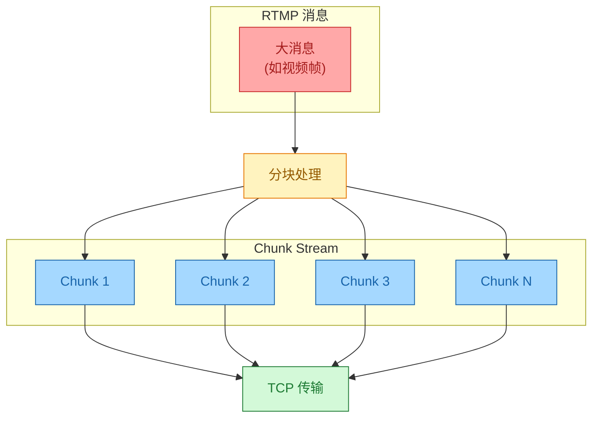
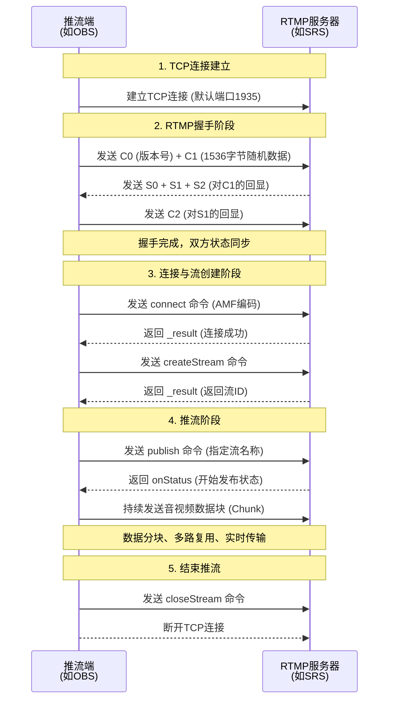
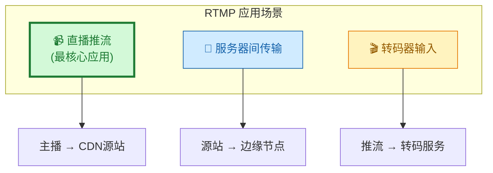
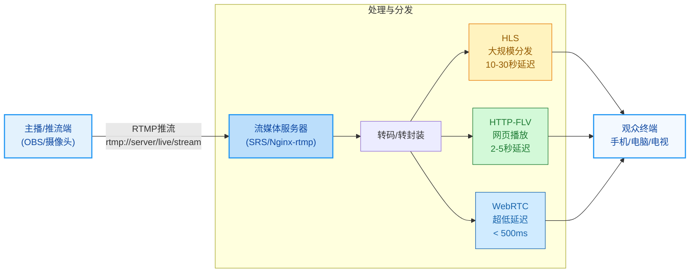
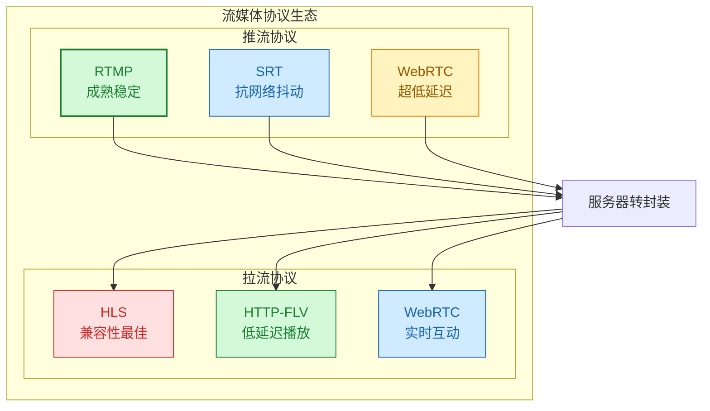
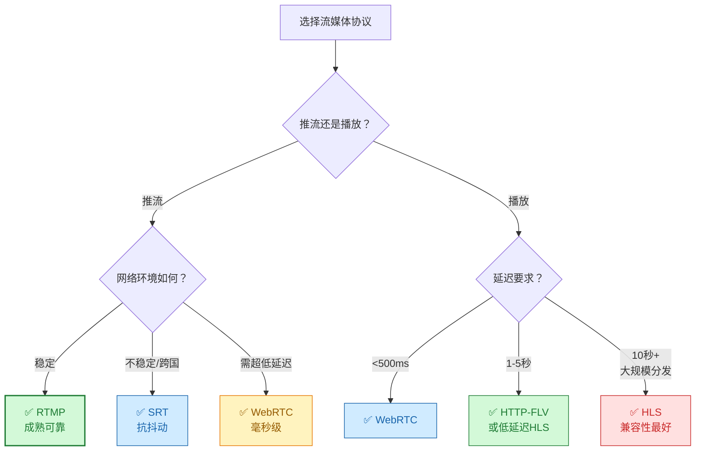

> **核心观点**：RTMP（Real-Time Messaging Protocol）是一种**低延迟、高可靠**的流媒体传输协议，虽然源于Flash时代，但在现代直播架构中依然是**推流端的事实标准**，几乎所有主流直播平台都支持RTMP推流。

## 一、RTMP是什么

RTMP（Real-Time Messaging Protocol，实时消息传输协议）是一种**应用层协议**，最初由Macromedia（后被Adobe收购）开发，用于在Flash平台和服务器之间进行**高性能、低延迟**的音频、视频和数据实时传输。

### 基本特性

| 特性       | 说明                                                                      |
| :--------- | :------------------------------------------------------------------------ |
| 传输层协议 | 基于 **TCP**，默认端口 **1935**                                           |
| 延迟表现   | 推流到服务器延迟低(毫秒到秒级)，端到端延迟取决于播放协议(2-30秒不等)     |
| 可靠性     | TCP保证数据完整性和顺序性，不丢包                                         |
| 数据类型   | 支持音频、视频、文本、命令等多种消息类型                                  |
| 编码格式   | 命令消息使用 **AMF(Action Message Format)** 编码                         |

## 二、RTMP的核心特点

### 🔹 1. 低延迟设计

RTMP作为**推流协议**具有很低的传输延迟。从编码器到服务器的推流延迟通常为1-3秒（包含编码处理、网络传输和服务器接收等环节，取决于关键帧间隔、编码器缓冲和网络条件）。在完整的直播链路中:
- **RTMP推流 + HTTP-FLV播放**: 端到端延迟约 **2-5秒**
- **RTMP推流 + 低延迟HLS**: 端到端延迟约 **5-10秒**  
- **RTMP推流 + 标准HLS**: 端到端延迟约 **20-30秒**

> 注：延迟受关键帧间隔(通常1-2秒)、播放器缓冲区、网络条件等多种因素影响。

相比纯HLS方案(10-30秒)，RTMP推流配合适当的播放协议可以显著降低延迟，使其非常适合:
- 体育赛事直播
- 游戏直播
- 在线拍卖
- 连麦互动
- 远程教学


### 🔹 2. 分块传输机制（Chunking）

RTMP将大的消息分割成更小的**Chunk**（默认128字节）进行传输：

| 优势       | 说明                                       |
| :--------- | :----------------------------------------- |
| 多路复用   | 音频、视频、控制命令可在同一连接上交织传输 |
| 网络适应性 | 灵活应对网络波动，避免大消息阻塞           |
| 传输效率   | 提高网络利用率，减少延迟                   |



### 🔹 3. 协议变种

RTMP提供多种变种以适应不同需求：

| 变种      | 全称                         | 特点                      | 端口                    |
| :-------- | :--------------------------- | :------------------------ | :---------------------- |
| **RTMP**  | Real-Time Messaging Protocol | 标准RTMP                  | 1935                    |
| **RTMPS** | RTMP over TLS/SSL            | 加密传输，提升安全性      | 443/8443（视平台而定）  |
| **RTMPT** | RTMP Tunneled over HTTP      | 封装在HTTP中，穿越防火墙  | 80/443                  |
| **RTMPE** | RTMP Encrypted               | Adobe自有加密（已废弃）   | 1935                    |

## 三、RTMP工作流程

### 典型推流流程



### 详细步骤说明

#### 1️⃣ **握手阶段（Handshake）**

客户端与服务器交换**六个数据包**（C0/C1/C2 和 S0/S1/S2），握手流程如下：

| 步骤 | 发送方向 | 数据包 | 大小 | 说明 |
|:-----|:---------|:-------|:-----|:-----|
| 1 | Client → Server | C0 + C1 | 1 + 1536字节 | 版本号 + 时间戳和随机数 |
| 2 | Server → Client | S0 + S1 + S2 | 1 + 1536 + 1536字节 | 版本号 + 时间戳随机数 + 对C1的回显 |
| 3 | Client → Server | C2 | 1536字节 | 对S1的回显 |

**作用**：
- 确认协议版本兼容性
- 验证网络连通性
- 为后续通信建立时间基准

#### 2️⃣ **建立网络连接（NetConnection）**

客户端发送 `connect` 命令（使用AMF编码），包含：
- 应用名称（如 `live`）
- Flash版本信息
- 连接参数

服务器响应 `_result`，连接建立成功。

#### 3️⃣ **创建网络流（NetStream）**

客户端发送 `createStream` 命令，服务器分配一个**流ID**并返回。

#### 4️⃣ **发布/播放**

**推流端**：
```javascript
// 发送 publish 命令
publish("livestream", "live");
// 开始发送音视频数据
```

**拉流端**：
```javascript
// 发送 play 命令
play("livestream");
// 开始接收音视频数据
```

#### 5️⃣ **数据传输**

音视频数据被封装成RTMP消息，再分割成Chunk，通过TCP连接传输。

## 四、RTMP的应用场景

### 主要应用



### 典型直播架构



> ⚠️ **重要提示**：RTMP通常**不直接用于向终端用户播放**。现代浏览器已不再支持Flash插件，无法原生播放RTMP流。观众端更常用**HLS、HTTP-FLV、WebRTC**等协议。

### 支持RTMP的平台

几乎所有主流直播平台都支持RTMP推流：

| 平台          | 推流支持 | 播放支持       |
| :------------ | :------- | :------------- |
| Twitch        | ✅ RTMP   | ❌ HLS/HTTP-FLV |
| YouTube Live  | ✅ RTMP   | ❌ HLS          |
| Bilibili      | ✅ RTMP   | ❌ HTTP-FLV/HLS |
| 抖音          | ✅ RTMP   | ❌ 自有协议     |
| Facebook Live | ✅ RTMP   | ❌ HLS          |

## 五、RTMP的优缺点

### ✅ 优点

| 优势         | 说明                                       |
| :----------- | :----------------------------------------- |
| **低延迟**   | 推流延迟低(1-3秒)，配合合适的播放协议可实现2-5秒端到端延迟 |
| **稳定可靠** | 基于TCP，保证数据完整性和顺序              |
| **生态成熟** | 所有主流推流软件和服务器都支持             |
| **多路复用** | 音视频数据在同一连接上高效传输             |
| **支持加密** | 可通过RTMPS提供传输层安全性                |

### ❌ 缺点

| 劣势             | 说明                                  |
| :--------------- | :------------------------------------ |
| **浏览器不支持** | 依赖Flash，无法在现代浏览器中原生播放 |
| **资源消耗高**   | TCP握手和确认机制在高并发下压力大     |
| **穿透性一般**   | 1935端口可能被防火墙拦截              |
| **非最新技术**   | 超低延迟（<500ms）场景不如WebRTC/SRT  |

## 六、常用工具与实践

### 推流软件

**1. OBS Studio（开源免费）**

```bash
# OBS推流配置示例
服务器: rtmp://live.example.com/live
串流密钥: mystreamkey
```

**2. FFmpeg（命令行）**

```bash
# 推送本地视频文件到RTMP服务器
ffmpeg -re -i input.mp4 \
  -c:v libx264 -preset veryfast -b:v 2500k \
  -c:a aac -b:a 128k \
  -f flv rtmp://server/live/stream

# 推送摄像头实时流
ffmpeg -f v4l2 -i /dev/video0 \
  -f alsa -i hw:0 \
  -c:v libx264 -c:a aac \
  -f flv rtmp://server/live/stream
```

**命令说明**：
- `-re`：以原始帧率读取输入（模拟实时）
- `-i input.mp4`：指定输入文件
- `-c:v libx264`：使用H.264编码视频
- `-preset veryfast`：编码速度预设（更快但压缩率稍低）
- `-b:v 2500k`：视频码率2.5Mbps
- `-c:a aac`：使用AAC编码音频
- `-b:a 128k`：音频码率128kbps
- `-f flv`：输出格式为FLV
- `rtmp://server/live/stream`：RTMP推流地址

### 流媒体服务器

**1. SRS (Simple Realtime Server)**

```bash
# Docker快速启动
docker run -d -p 1935:1935 -p 1985:1985 -p 8080:8080 \
  ossrs/srs:5

# 推流地址
rtmp://localhost/live/livestream

# HTTP-FLV播放地址
http://localhost:8080/live/livestream.flv

# HLS播放地址
http://localhost:8080/live/livestream.m3u8
```

**2. Nginx + RTMP模块**

```nginx
rtmp {
    server {
        listen 1935;
        chunk_size 4096;

        application live {
            live on;
            record off;
            
            # 转HLS
            hls on;
            hls_path /tmp/hls;
            hls_fragment 3s;
        }
    }
}
```

## 七、RTMP的替代与补充协议



### 协议对比

| 协议         | 端到端延迟          | 传输层   | 主要用途               | 与RTMP的关系               |
| :----------- | :------------------ | :------- | :--------------------- | :------------------------- |
| **RTMP**     | 推流1-3秒           | TCP      | 直播推流               | -                          |
| **WebRTC**   | <500ms（通常240-300ms） | UDP      | 实时通信、超低延迟互动 | 替代RTMP(超低延迟场景)     |
| **SRT**      | 120ms-3秒           | UDP      | 专业广播、远程制作     | 替代RTMP(网络不稳定场景)   |
| **HLS**      | 10-30秒             | HTTP/TCP | 大规模点播和直播分发   | 由RTMP转封装而来           |
| **HTTP-FLV** | 2-5秒               | HTTP/TCP | 网页播放               | 由RTMP转封装而来           |

### 选择建议



## 八、总结

RTMP作为一款**久经考验**的流媒体传输协议，虽然在播放端已被更现代的协议替代，但在**直播推流这个"第一公里"**，依然是**最主流、最可靠、最被广泛支持**的选择。

### 关键要点

| 方面       | 核心特点                                   |
| :--------- | :----------------------------------------- |
| **定位**   | 直播推流的事实标准                         |
| **延迟**   | 推流1-3秒，配合HTTP-FLV可实现2-5秒端到端延迟 |
| **可靠性** | 基于TCP，保证数据完整性                    |
| **生态**   | 所有主流平台和工具都支持                   |
| **局限**   | 播放端需转封装为HLS/HTTP-FLV等             |

**一句话总结**：当你需要**稳定地将直播内容推送到服务器或CDN**时，RTMP是你的不二之选；而当你需要为观众提供**更低延迟的互动体验**时，则可以由服务器将RTMP流转封装为HTTP-FLV、低延迟HLS或WebRTC等格式。

---

**参考资料**：
- Adobe Systems. [*RTMP Specification*](https://rtmp.veriskope.com/docs/spec/) — RTMP官方规范文档
- [SRS (Simple Realtime Server)](https://github.com/ossrs/srs) — 开源流媒体服务器
- [OBS Studio](https://obsproject.com/) — 开源推流软件
