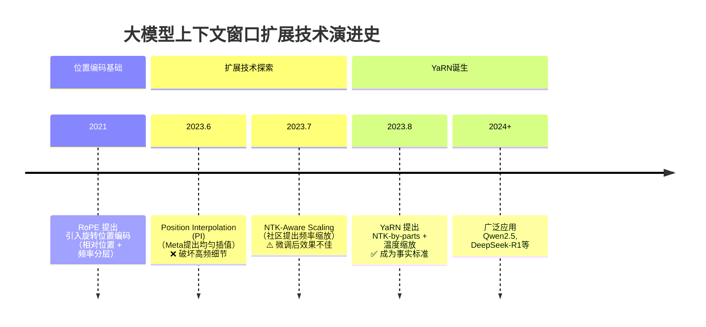
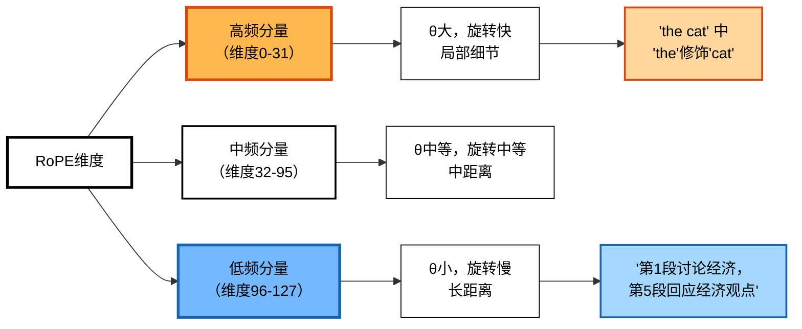
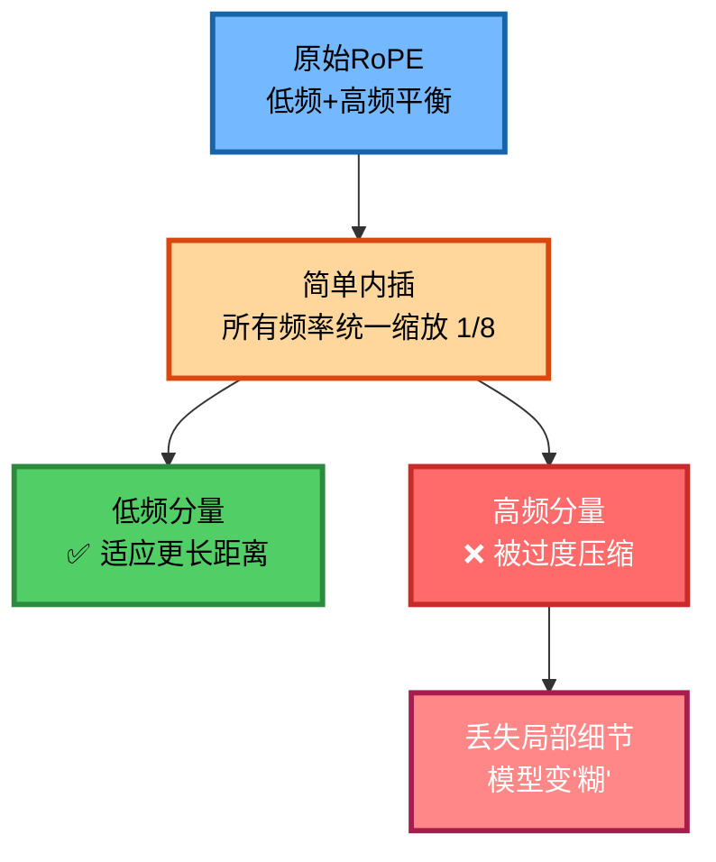
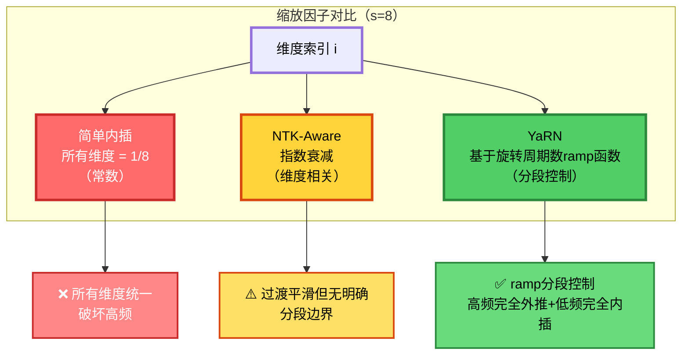
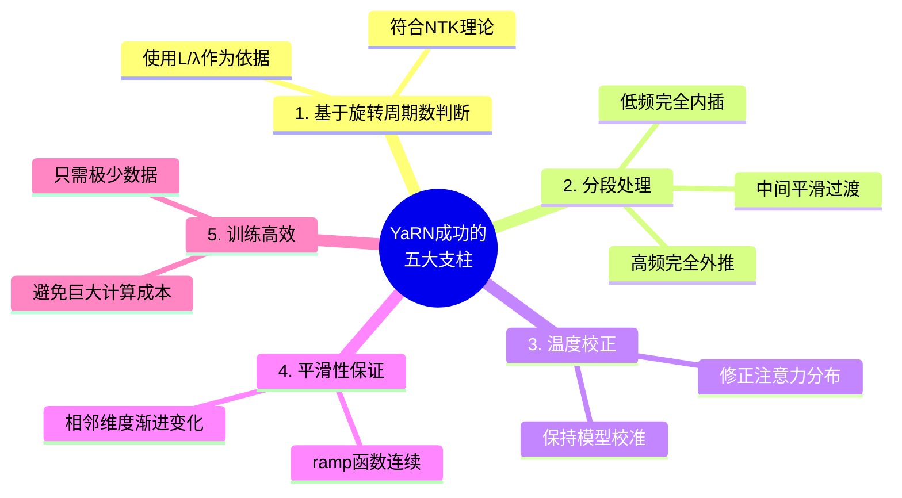
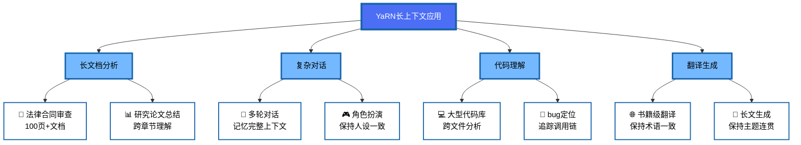
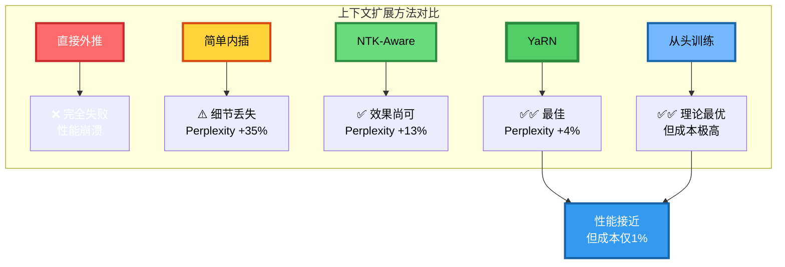

> **核心观点**：YaRN（Yet Another RoPE Extension）通过**NTK-by-parts分段插值**实现了对RoPE位置编码的智能缩放——对高频分量（短波长，训练时已完整旋转多个周期）保持外推，对低频分量（长波长，训练时仅经历部分周期）进行内插以适应更长序列，并通过**ramp函数**实现分段线性的平滑过渡，成为现代大模型支持长上下文的高效技术方案。

## 一、为什么需要上下文扩展？

当你向GPT-4提供一份100页的PDF文档，并要求它总结关键信息时，这背后涉及一个核心技术挑战：**如何让模型"看懂"超长文本？**

大语言模型在预训练时通常有固定的**上下文窗口长度**（如4096个token）。超出这个长度，模型要么：
- **截断输入**：只看前面4096个token，后面的内容"视而不见"
- **分段处理**：多次调用模型处理不同片段，但丢失了跨片段的全局理解

这就像让一个人只能记住最近说的100个字，却要求他理解一整本书——显然不现实。

**上下文扩展技术**的目标是：在**不完全重新训练**或**极少训练**的前提下，让模型能够处理比预训练时长得多的序列，同时保持甚至提升性能。

## 二、历史演进：从RoPE到YaRN的技术之路



### 2.1 起点：RoPE的核心特性

**RoPE（Rotary Positional Embeddings，旋转位置编码）**由Su等人于2021年提出（arXiv论文提交于2021年4月），现已成为LLaMA、GLM、PaLM等主流大模型的标配位置编码方案。

它有两个关键特性使其适合扩展：

#### 特性1：相对位置感知

RoPE不直接编码绝对位置（"这是第10个token"），而是通过**旋转向量的角度差**来表达相对位置（"它们相距5个token"）。

对于位置为 $m$ 和 $n$ 的两个token，它们的Query和Key向量经过RoPE变换后，内积为：

$$ \langle \mathbf{RoPE}(Q_m), \mathbf{RoPE}(K_n) \rangle = f(m-n) $$

这个函数 $f$ 只依赖于**相对距离** $m-n$，而非绝对位置。

#### 特性2：频率分层结构

根据**神经正切核（NTK）理论**，RoPE中不同维度的频率分量有不同的作用：

| 频率类型     | 维度索引   | 旋转频率θ | 旋转速度 | 负责能力           | 典型任务                |
| ------------ | ---------- | --------- | -------- | ------------------ | ----------------------- |
| **高频分量** | 较小的 $i$ | 较大      | 旋转快   | 捕捉**局部细节**   | 识别相邻token的语法关系 |
| **低频分量** | 较大的 $i$ | 较小      | 旋转慢   | 捕捉**长距离依赖** | 理解段落间的主题关联    |

> 💡 **注意**：RoPE的频率公式为 $\theta_i = \text{base}^{-2i/d}$，其中base=10000。维度索引 $i$ 越大，$\theta_i$ 越小，对应低频（长波长）。



这种**分层的频率结构**为后续的扩展技术奠定了理论基础。

### 2.2 失败的尝试：直接外推与简单内插

在YaRN之前，研究者尝试了两种直观但效果不佳的方法：

#### 方法1：直接外推（Extrapolation）

**思路**：直接将位置索引扩展到目标长度。

**示例**：训练长度4k，目标32k，位置索引从 $[0, 4095]$ 直接变为 $[0, 32767]$。

**缩放策略**：$\lambda = 1$（不缩放）

**失败原因**：
```python
# 训练时见过的最大旋转角度
max_angle_train = 4095 * θ_i  

# 实际使用的旋转角度
max_angle_test = 32767 * θ_i  # 是训练时的 8 倍！
```

模型**从未见过**如此大的旋转角度，导致注意力分数分布混乱，性能**完全崩溃**。

#### 方法2：简单内插（Position Interpolation）

**思路**：将位置索引均匀压缩到原范围内。

**示例**：将 $[0, 32767]$ 压缩到 $[0, 4095]$，相当于所有位置乘以 $1/8$。

**缩放策略**：$\lambda = 1/s = 1/8$（统一压缩）

**失败原因**：



所有维度都被统一缩放，导致**高频分量的频率被降低**。根据NTK理论，这使得模型难以学习高频信息，**无法捕捉局部细节**（如相邻token间的语法关系），模型在短距离理解上"变糊"。

### 2.3 理论突破：NTK-Aware Scaling

研究者意识到关键洞察：**不同频率分量应该差异化对待**。

NTK-Aware Scaling（由社区研究者bloc97在Reddit上提出）的核心思想是：将简单内插对所有维度的统一压缩，分散到不同维度上——**高频分量少缩放（更接近外推），低频分量多缩放（更接近内插）**。

**实现方式**：通过修改RoPE的基数（base change）来实现频率相关的缩放

$$ b' = b \cdot s^{\frac{|D|}{|D| - 2}} $$

其中 $b$ 是原始基数（10000），$s$ 是扩展比例，$|D|$ 是隐藏维度数。这等价于对每个维度应用不同的缩放因子 $\theta'_i / \theta_i = s^{-2i/(|D|-2)}$——维度索引 $i$ 越小（频率越高），缩放越少（越接近外推）；$i$ 越大（频率越低），缩放越多（越接近内插）。

**不足之处**：

NTK-Aware在**不微调**时表现优于简单内插（PI），但在**微调后**效果反而不如PI。YaRN论文作者推测，这是因为NTK-Aware对高频分量保持外推（不缩放），导致模型在微调时难以适应高频维度上超出训练分布的旋转角度，损害了对局部细节的理解能力。

### 2.4 集大成者：YaRN的诞生

**YaRN（Yet Another RoPE Extension）**由Nous Research和EleutherAI的研究者（Bowen Peng, Jeffrey Quesnelle, Honglu Fan, Enrico Shippole）于2023年8月31日提出（arXiv 2309.00071）。其中Honglu Fan同时隶属于日内瓦大学。

**核心创新**：YaRN = **NTK-by-parts频率缩放** + **注意力温度校正**，实现了两方面的优化：
1. 使用基于**旋转周期数**的**分段线性ramp函数**，在与NTK-Aware相同的缩放方向（高频外推、低频内插）上，通过明确的边界阈值实现更精确的分段控制——高频维度**完全外推**、低频维度**完全内插**、中间维度平滑过渡
2. 引入**温度参数**修正扩展上下文后的注意力分布偏移

## 三、YaRN的技术原理

### 3.1 核心公式（一）：NTK-by-parts频率缩放

YaRN对RoPE频率使用**分段线性插值**（也称"NTK-by-parts"）：

$$ h(\theta_i) = (1 - \gamma(r)) \cdot \frac{\theta_i}{s} + \gamma(r) \cdot \theta_i $$

其中 $\gamma(r)$ 是一个**ramp函数**（斜坡函数），基于维度 $i$ 在训练长度内完成的旋转周期数 $r = L / \lambda_i$：

$$
\gamma(r) = 
\begin{cases}
0, & \text{if } r < \alpha \\
\frac{r - \alpha}{\beta - \alpha}, & \text{if } \alpha \leq r \leq \beta \\
1, & \text{if } r > \beta
\end{cases}
$$

**参数说明**：
- $s = L_{\text{target}} / L_{\text{train}}$ —— 扩展比例
- $\theta_i = \text{base}^{-2i/d}$ —— 原始RoPE频率
- $\lambda_i = 2\pi / \theta_i$ —— 波长（完成一次完整旋转所需的token数）
- $r = L / \lambda_i$ —— 维度 $i$ 在训练长度 $L$ 内完成的**旋转周期数**
- $\alpha, \beta$ —— ramp函数的边界参数，表示旋转周期数的阈值（YaRN论文实验中使用 $\alpha=1, \beta=32$，具体实现可能因模型而异）

**工作原理**：
- **高频分量**（$r > \beta$，即旋转超过32周，短波长）：$\gamma=1$ → $h(\theta_i) = \theta_i$ → **完全外推**（频率保持不变，因为模型已充分学习这些维度的旋转模式）
- **低频分量**（$r < \alpha$，即旋转不足1周，长波长）：$\gamma=0$ → $h(\theta_i) = \theta_i/s$ → **完全内插**（频率被缩小，将位置压缩到已见范围内）
- **中间频率**（$\alpha \leq r \leq \beta$）：$0 < \gamma < 1$ → **平滑过渡**

### 3.2 核心公式（二）：注意力温度缩放

YaRN的第二个关键创新是在注意力机制中引入**温度参数** $t$：

**原始注意力**：
$$ \text{softmax}\left(\frac{q_m^T k_n}{\sqrt{|D|}}\right) $$

**YaRN修改后**：
$$ \text{softmax}\left(\frac{q_m^T k_n}{t\sqrt{|D|}}\right) $$

温度参数 $t$ 根据扩展比例 $s$ 自动确定：

$$ \sqrt{\frac{1}{t}} = 0.1 \ln(s) + 1 $$

即 $t = \frac{1}{(0.1 \ln(s) + 1)^2}$。例如，当 $s=8$ 时，$\sqrt{1/t} = 0.1 \times \ln(8) + 1 \approx 1.208$，因此 $t \approx 0.685$。由于 $t < 1$，注意力分布会变得更集中，以补偿长上下文导致的注意力过度分散。

**作用**：扩展上下文后，注意力分数的分布会发生偏移，温度缩放用于校正这种偏移，使模型在长上下文下保持良好的校准（calibration）。

> 💡 **实现技巧**：在实际代码中，可以将温度缩放"烧入"位置编码，通过对query和key向量乘以 $\sqrt{1/t}$ 来实现，避免修改注意力计算代码。注意这里的实现方式是：因为 $(Q \cdot K) / t = (Q/\sqrt{t}) \cdot (K/\sqrt{t})$，所以可以通过缩放Q和K向量来达到相同效果。

### 3.3 可视化对比

让我们以 $s=8$（4k→32k）为例，对比不同方法的缩放因子：



| 维度索引 $i$ | 频率类型 | 简单内插 | NTK-Aware | **YaRN**     |
| ------------ | -------- | -------- | --------- | ------------ |
| 0 (最高频)   | 局部细节 | 0.125    | ~1.0      | **1.0**      |
| 16           | 中等距离 | 0.125    | ~0.61     | **1.0**      |
| 32           | 中等距离 | 0.125    | ~0.37     | **~0.60**    |
| 48           | 长距离   | 0.125    | ~0.22     | **0.125**    |
| 63 (最低频)  | 长距离   | 0.125    | ~0.125    | **0.125**    |

> 💡 **注意**：YaRN的具体数值取决于ramp函数参数（α, β），上表基于α=1, β=32的示意值。NTK-Aware的缩放因子为 $s^{-2i/(|D|-2)}$。

可以看到，**NTK-Aware和YaRN的缩放方向相同**：都是高频外推（缩放因子≈1）、低频内插（缩放因子≈1/s）。关键区别在于**过渡方式**：NTK-Aware使用指数函数平滑过渡，而YaRN使用ramp函数实现**分段控制**——高频维度（>32周旋转）**完全外推**（因子=1），低频维度（<1周旋转）**完全内插**（因子=1/s），中间维度线性过渡。这种分段策略使得每个频率区间都得到最优处理。

### 3.4 数学本质

YaRN修改的是RoPE的**有效位置索引**：

**原始RoPE**：
$$ \text{Attention}(Q_m, K_n) \propto \exp(\mathrm{i} \cdot m \cdot \theta_d) \cdot \exp(-\mathrm{i} \cdot n \cdot \theta_d) $$

其中 $\mathrm{i}$ 为虚数单位，$d$ 为维度索引。

**YaRN修改后**：
$$ m' = m \cdot f(\lambda_d), \quad n' = n \cdot f(\lambda_d) $$

等价于修改旋转频率：
$$ \theta_d' = h(\theta_d) = (1-\gamma) \cdot \frac{\theta_d}{s} + \gamma \cdot \theta_d $$

**效果**：
- **高频维度**（短波长 $\lambda \ll L$，旋转多周）：$\gamma=1$ → $\theta' = \theta$ → 频率不变，模型已充分学习这些旋转模式，可安全外推
- **低频维度**（长波长 $\lambda \gg L$，旋转不足一周）：$\gamma=0$ → $\theta' = \theta/s$ → 频率被压缩，将超长位置映射到训练时已见过的范围内

### 3.5 为什么YaRN如此有效？



**核心优势**：

1. **理论正确性**：完全基于NTK理论，使用旋转周期数作为判断依据，尊重不同频率的内在作用
2. **分段精确控制**：ramp函数通过旋转周期数阈值（α, β）将维度明确划分为完全外推区（高频）、完全内插区（低频）和过渡区，相比NTK-Aware的指数过渡更精确可控
3. **平滑过渡**：分段线性插值确保相邻维度的变化是连续且渐进的
4. **双重优化**：频率缩放 + 温度校正，同时解决位置编码和注意力分布两个问题
5. **训练高效**：只需在**极少量长文本数据**上微调（通常**400-1000步**）

## 四、实战应用

### 4.1 使用YaRN扩展模型的完整流程


### 4.2 代码实现示例

以下是一个简化的PyTorch实现：

```python
import math
import torch
import torch.nn as nn

# 辅助函数：根据旋转周期数找到对应的维度索引
def find_correction_dim(num_rotations, dim, base=10000, max_position_embeddings=2048):
    return (dim * math.log(max_position_embeddings / (num_rotations * 2 * math.pi))) / (2 * math.log(base))

def find_correction_range(low_rot, high_rot, dim, base=10000, max_position_embeddings=2048):
    low = math.floor(find_correction_dim(low_rot, dim, base, max_position_embeddings))
    high = math.ceil(find_correction_dim(high_rot, dim, base, max_position_embeddings))
    return max(low, 0), min(high, dim - 1)

class YaRNScaledRoPE(nn.Module):
    def __init__(self, dim, max_position_embeddings=4096, 
                 base=10000, scale=8, beta_fast=32, beta_slow=1):
        """
        Args:
            dim: 模型维度
            max_position_embeddings: 原始训练长度
            base: RoPE的基数（通常为10000）
            scale: 扩展倍数（如4k→32k则为8）
            beta_fast: 完全外推的旋转周期数阈值（默认32，对应论文的β）
            beta_slow: 完全内插的旋转周期数阈值（默认1，对应论文的α）
        """
        super().__init__()
        self.dim = dim
        self.scale = scale
        
        # 计算原始频率和内插频率
        pos_freqs = base ** (torch.arange(0, dim, 2).float() / dim)
        inv_freq_extrapolation = 1.0 / pos_freqs       # θ_i（原始，外推）
        inv_freq_interpolation = 1.0 / (scale * pos_freqs)  # θ_i/s（内插）
        
        # 找到ramp函数的维度边界
        # low = 旋转 beta_fast 周的维度索引（高频边界）
        # high = 旋转 beta_slow 周的维度索引（低频边界）
        low, high = find_correction_range(
            beta_fast, beta_slow, dim, base, max_position_embeddings)
        
        # 构建ramp函数：从 0（d≤low，高频）到 1（d≥high，低频）
        ramp = torch.clamp(
            (torch.arange(dim // 2, dtype=torch.float32) - low) / (high - low), 0, 1)
        
        # γ = 1 - ramp：高频维度γ=1（外推），低频维度γ=0（内插）
        inv_freq_mask = 1.0 - ramp
        
        # 应用NTK-by-parts公式：h(θ) = (1-γ)·θ/s + γ·θ
        inv_freq = inv_freq_interpolation * (1 - inv_freq_mask) + \
                   inv_freq_extrapolation * inv_freq_mask
        
        self.register_buffer("inv_freq", inv_freq)
        
        # 温度缩放因子：根据论文 √(1/t) = 0.1 * ln(s) + 1
        # 应用于 cos/sin 输出（等价于对 Q/K 向量乘以 √(1/t)）
        self.mscale = 0.1 * math.log(scale) + 1.0
    
    def forward(self, x, seq_len):
        # 生成位置索引
        t = torch.arange(seq_len, device=x.device, dtype=self.inv_freq.dtype)
        
        # 计算旋转角度
        freqs = torch.einsum("i,j->ij", t, self.inv_freq)
        
        # 组合成完整的旋转矩阵
        emb = torch.cat((freqs, freqs), dim=-1)
        
        # 应用温度缩放（等价于对 Q/K 向量乘以 √(1/t)）
        return emb.cos() * self.mscale, emb.sin() * self.mscale

# 使用示例
model = YaRNScaledRoPE(dim=128, max_position_embeddings=4096, scale=8)
cos, sin = model(torch.randn(1, 32768, 128), seq_len=32768)
print(f"成功将4k模型扩展到32k：{cos.shape}")
```

### 4.3 真实案例：开源模型中的YaRN

| 模型                   | 原始长度 | 扩展后长度 | 扩展比例 | 上下文扩展技术                          |
| ---------------------- | -------- | ---------- | -------- | --------------------------------------- |
| **Qwen2.5系列**        | 4k-32k   | 128k-1M    | 多倍     | ✅ 使用YaRN等RoPE缩放技术               |
| **DeepSeek-R1**        | -        | 128k       | -        | ✅ 基于DeepSeek-V3，支持128k上下文（具体方法未公开） |
| **LLaMA 2 (社区扩展)** | 4k       | 32k-128k   | 8-32×    | ✅ 使用YaRN微调                         |

> 💡 **说明**：Qwen2.5配置文件中明确使用了YaRN缩放；DeepSeek-R1支持128k上下文，但技术报告未详细说明具体的RoPE缩放方法。

### 4.4 适用场景

YaRN在以下任务中表现优异：



## 五、性能表现

### 5.1 实验数据

YaRN论文在多个数据集上的验证结果（滑动窗口perplexity评估，窗口大小S=256）：

| 模型配置               | 原始长度 | 扩展后  | 微调步数 | Perplexity (↓) | PassKey准确率 (↑) |
| ---------------------- | -------- | ------- | -------- | -------------- | ----------------- |
| LLaMA 2 7B (基线)      | 4k       | 4k      | -        | ~5.1           | -                 |
| LLaMA 2 7B (简单内插)  | 4k       | 32k     | 1000     | ~6.8-6.9       | ~45%              |
| LLaMA 2 7B (NTK-Aware) | 4k       | 32k     | 1000     | ~5.7-5.8       | ~72%              |
| **LLaMA 2 7B (YaRN)**  | 4k       | **32k** | **400**  | **~5.3-5.4**   | **~94%**          |
| LLaMA 2 7B (YaRN)      | 4k       | **64k** | **1000** | **~5.5**       | **~89%**          |

> 💡 **说明**：上述数值为近似值，基于YaRN论文的实验结果。Perplexity在Proof-pile测试集上使用滑动窗口(S=256)评估，PassKey为检索准确率。具体数值可能因评估设置略有差异。

**关键发现**：
- YaRN在**极少微调步数**下即可达到接近基线的Perplexity
- PassKey任务（测试精确位置信息提取）上，YaRN准确率高达**94%**
- 扩展到**64k**（16倍原始长度）仍保持优异性能

### 5.2 与其他方法的对比



## 六、深入理解：常见问题

### Q1：YaRN的ramp函数具体是怎么工作的？

**A**：ramp函数基于**旋转周期数**（维度在训练上下文中完成的完整旋转次数）来判断如何缩放：

```python
# 假设 d=128, s=8, L=4096, α(beta_slow)=1, β(beta_fast)=32
import math
import numpy as np
import matplotlib.pyplot as plt

base = 10000
dim = 128
s = 8
L = 4096
beta_fast = 32  # β：完全外推的旋转周期阈值
beta_slow = 1   # α：完全内插的旋转周期阈值

# 计算ramp函数的维度边界（与原始代码一致）
def find_correction_dim(num_rotations):
    return (dim * math.log(L / (num_rotations * 2 * math.pi))) / (2 * math.log(base))

low = max(math.floor(find_correction_dim(beta_fast)), 0)   # 高频边界
high = min(math.ceil(find_correction_dim(beta_slow)), dim - 1)  # 低频边界

# 构建ramp函数和γ
i = np.arange(0, dim // 2)
ramp = np.clip((i - low) / (high - low), 0, 1)  # 0→1，从高频到低频
gamma = 1.0 - ramp  # γ：高频=1（外推），低频=0（内插）

# 计算有效频率缩放因子
freq_scale = (1 - gamma) / s + gamma

plt.plot(i, freq_scale, label='YaRN (NTK-by-parts)', linewidth=2)
plt.axhline(y=1/s, color='r', linestyle='--', label=f'完全内插 (1/{s})')
plt.axhline(y=1, color='g', linestyle='--', label='完全外推 (1.0)')
plt.axvline(x=low, color='gray', linestyle=':', alpha=0.5, label=f'β={beta_fast}周边界 (d={low})')
plt.axvline(x=high, color='gray', linestyle=':', alpha=0.5, label=f'α={beta_slow}周边界 (d={high})')
plt.xlabel('维度索引 i')
plt.ylabel('频率缩放因子')
plt.legend()
plt.title('YaRN ramp函数：高频外推 → 低频内插')
plt.show()
```

关键点：
1. **高频维度**（旋转>β=32周）：训练时已完整经历多个旋转周期，模型充分学习了这些维度的模式，可安全**外推**（保持频率不变）
2. **低频维度**（旋转<α=1周）：训练时仅经历部分周期，外推会产生未见过的旋转角度，应该**内插**（压缩频率，将位置映射回已见范围）
3. **中间维度**（α ≤ 旋转周期数 ≤ β）：通过ramp函数实现**平滑过渡**，避免突变

### Q2：为什么YaRN的ramp函数比NTK-Aware的指数函数更好？

**A**：两者的核心区别在于**判断依据**和**过渡方式**：

| 方面               | NTK-Aware            | YaRN (NTK-by-parts)          |
| ------------------ | -------------------- | ---------------------------- |
| **判断依据**       | 维度索引 $i$（隐式） | **旋转周期数** $L/\lambda_i$ |
| **过渡函数**       | 指数函数（平滑）     | 分段线性ramp（有明确边界）   |
| **短波长（高频）** | 接近外推（≈1.0）     | **严格外推**（γ=1，完全=1.0）|
| **长波长（低频）** | 接近内插（≈1/s）     | **严格内插**（γ=0，完全=1/s）|
| **中间维度**       | 指数渐变             | **线性过渡**（α到β之间）     |
| **整体性能**       | 中等                 | **最佳**                     |

**关键洞察**：旋转周期数是更本质的判断标准。如果某个维度在训练长度内完成了超过β=32个完整旋转周期，说明模型已充分学习该维度的旋转模式，可以安全外推；如果不足α=1个周期，模型只见过部分弧段，应该内插（将扩展位置映射回已见范围）。

NTK-Aware和YaRN的缩放**方向相同**（都是高频外推、低频内插），但YaRN通过ramp函数的明确边界（α和β）实现了更精确的**分段控制**——高频维度完全不缩放，低频维度完全缩放，避免了NTK-Aware指数过渡中的"半缩放"状态。

### Q3：YaRN是否适用于所有模型？

**A**：主要适用于**基于RoPE位置编码**的模型。对于使用其他位置编码方案的模型：

| 位置编码类型     | 能否使用YaRN | 替代方案           |
| ---------------- | ------------ | ------------------ |
| **RoPE**         | ✅ 完美适用   | -                  |
| **ALiBi**        | ❌ 不适用     | ALiBi本身支持外推  |
| **绝对位置编码** | ❌ 不适用     | 需要重新训练       |
| **xPos**         | ⚠️ 需要修改   | 结合xPos的衰减策略 |

### Q4：微调时需要多少数据？

**A**：根据YaRN论文的实验：

| 扩展比例     | 推荐微调步数 | 数据量（估算） | 训练时间（A100） |
| ------------ | ------------ | -------------- | ---------------- |
| 2× (4k→8k)   | 200-400步    | ~100M tokens   | ~1小时           |
| 4× (4k→16k)  | 400-800步    | ~200M tokens   | ~2小时           |
| 8× (4k→32k)  | 800-1000步   | ~400M tokens   | ~4小时           |
| 16× (4k→64k) | 1000-2000步  | ~800M tokens   | ~8小时           |

> 💡 **注意**：上表中的步数和数据量为经验性建议，基于YaRN论文的实验设置。实际应用中需根据具体模型和任务调整。

**关键点**：
- 数据应包含**目标长度**的样本（如扩展到32k，数据中应有接近32k的文本）
- 优先使用**多样化领域**的长文本（代码、书籍、论文等）
- 可以使用**合成数据**（如PassKey任务）辅助训练

### Q5：YaRN的局限性是什么？

**A**：

1. **仍需微调**：虽然数据量少，但不能完全零样本扩展
2. **极限扩展受限**：超过32-64倍的扩展，性能会显著下降
3. **注意力复杂度**：扩展上下文后，注意力计算的 $O(n^2)$ 复杂度仍是瓶颈
4. **依赖RoPE**：只适用于RoPE类位置编码

**未来方向**：
- **稀疏注意力**：结合Sliding Window、Dilated Attention降低复杂度
- **更激进的插值策略**：探索分段线性或样条插值
- **零样本扩展**：研究完全无需微调的方法

## 七、总结

YaRN是大模型上下文扩展技术的**集大成者**，它站在前人的肩膀上，将理论洞察（NTK）与工程实践（线性插值）完美结合，实现了：

```mermaid
graph TB
    ROOT["YaRN核心价值"]
    
    ROOT --> A["技术突破"]
    ROOT --> B["工程价值"]
    ROOT --> C["生态影响"]
    ROOT --> D["应用场景"]
    
    A --> A1["NTK-by-parts插值"]
    A --> A2["精确分段控制"]
    A --> A3["保持训练分布"]
    
    B --> B1["极少微调成本"]
    B --> B2["400-1000步可用"]
    B --> B3["性能接近最优"]
    
    C --> C1["开源模型标配"]
    C --> C2["Qwen、DeepSeek等"]
    C --> C3["成为事实标准"]
    
    D --> D1["长文档分析"]
    D --> D2["复杂对话"]
    D --> D3["代码理解"]
    D --> D4["翻译生成"]
    
    style ROOT fill:#4c6ef5,stroke:#1864ab,stroke-width:4px,color:#fff
    style A fill:#51cf66,stroke:#2b8a3e,stroke-width:3px,color:#000
    style B fill:#ffd43b,stroke:#d9480f,stroke-width:3px,color:#000
    style C fill:#ff8787,stroke:#c92a2a,stroke-width:3px,color:#000
    style D fill:#74b9ff,stroke:#1864ab,stroke-width:3px,color:#000
    style A1 fill:#b2f2bb,stroke:#2b8a3e,stroke-width:2px,color:#000
    style A2 fill:#b2f2bb,stroke:#2b8a3e,stroke-width:2px,color:#000
    style A3 fill:#b2f2bb,stroke:#2b8a3e,stroke-width:2px,color:#000
    style B1 fill:#ffe066,stroke:#d9480f,stroke-width:2px,color:#000
    style B2 fill:#ffe066,stroke:#d9480f,stroke-width:2px,color:#000
    style B3 fill:#ffe066,stroke:#d9480f,stroke-width:2px,color:#000
    style C1 fill:#ffc9c9,stroke:#c92a2a,stroke-width:2px,color:#000
    style C2 fill:#ffc9c9,stroke:#c92a2a,stroke-width:2px,color:#000
    style C3 fill:#ffc9c9,stroke:#c92a2a,stroke-width:2px,color:#000
    style D1 fill:#a5d8ff,stroke:#1864ab,stroke-width:2px,color:#000
    style D2 fill:#a5d8ff,stroke:#1864ab,stroke-width:2px,color:#000
    style D3 fill:#a5d8ff,stroke:#1864ab,stroke-width:2px,color:#000
    style D4 fill:#a5d8ff,stroke:#1864ab,stroke-width:2px,color:#000
```



**关键要点回顾**：

1. **历史定位**：YaRN是从RoPE→PI→NTK-Aware的自然演进结果
2. **核心创新**：NTK-by-parts（基于旋转周期数的ramp函数）+ 注意力温度缩放
3. **理论基础**：基于NTK理论和旋转周期数分析，区分高低频分量的不同作用
4. **实用价值**：极少训练（400步）即可扩展8倍，准确率94%+，且微调后效果最佳
5. **广泛应用**：已成为开源大模型长上下文的首选技术

当你下次使用Qwen2.5处理100页PDF，或用DeepSeek-R1进行复杂推理时，背后正是YaRN在默默支撑着这一切。

---

## 参考资料

1. [YaRN: Efficient Context Window Extension of Large Language Models](https://arxiv.org/abs/2309.00071)
2. [RoFormer: Enhanced Transformer with Rotary Position Embedding](https://arxiv.org/abs/2104.09864)
3. [Extending Context Window of Large Language Models via Position Interpolation](https://arxiv.org/abs/2306.15595)
4. [Fourier Features Let Networks Learn High Frequency Functions in Low Dimensional Domains](https://arxiv.org/abs/2006.10739)
5. [Neural Tangent Kernel: Convergence and Generalization in Neural Networks](https://arxiv.org/abs/1806.07572)

---

> 💡 **实践建议**：如果你正在开发需要处理长文本的应用，优先选择已集成YaRN的开源模型（如Qwen2.5），而非自己从头实现扩展——站在巨人的肩膀上，事半功倍。
