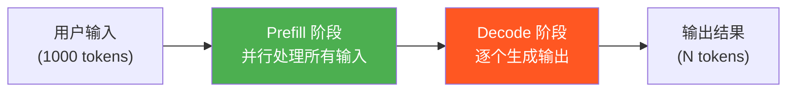
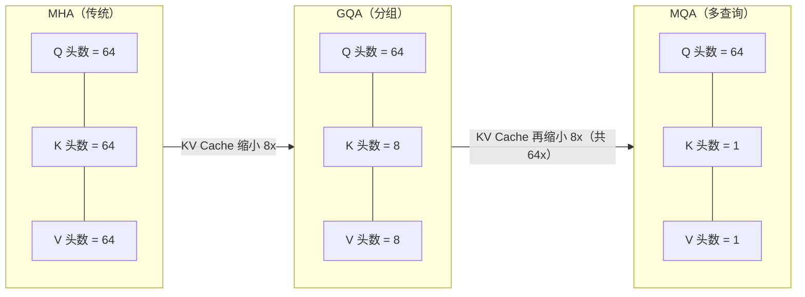
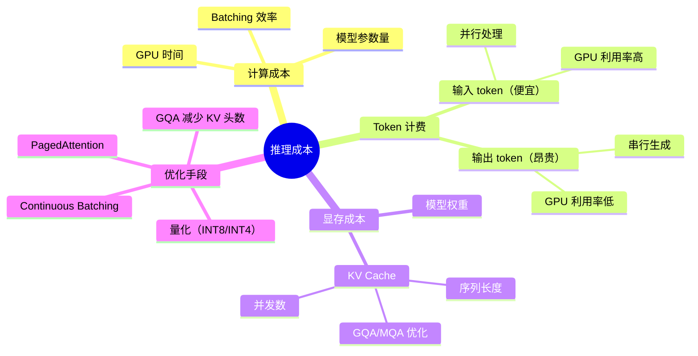

> **核心观点**：大模型推理成本的本质不是"处理了多少 token"，而是"占用了多长时间的 GPU"。输出 token 之所以比输入 token 贵 4-5 倍甚至更高，是因为自回归生成的串行本质导致每个输出 token 都需要独占一次完整的模型前向传播，GPU 利用率极低——这不是商业策略，而是物理限制。

## 一、从 API 账单说起：Token 计费模型

如果你使用过 OpenAI、Anthropic 或 Google 等大模型 API，一定注意到了账单上会区分两类费用：

| 费用类型 | 说明 | 典型价格（假设） |
|---------|------|----------------|
| 输入 token（Input/Prompt） | 你发送给模型的文本 | \$3 / 1M tokens |
| 输出 token（Output/Completion） | 模型生成的文本 | \$15 / 1M tokens |

输出 token 的价格通常是输入的 **4-5 倍**甚至更高。这就引出了一个直觉上的疑问：**同样是"处理 token"，为什么让模型"说话"比"听话"贵这么多？**

要回答这个问题，我们需要理解推理背后真正发生了什么。

---

## 二、推理的两个阶段：Prefill 与 Decode

大模型推理并不是一个统一的过程，而是分为两个截然不同的阶段：



### 2.1 Prefill（预填充）阶段 —— 一次性并行处理

假设你发送了 1000 个输入 token，在 Prefill 阶段：

- GPU 一次性把 1000 个 token 打包成矩阵
- 执行**大矩阵 × 大矩阵**的乘法运算
- GPU 的数千个计算核心被充分利用
- **1 次前向传播**就处理完全部 1000 个 token

这个阶段是**计算密集型**（compute-bound）的，GPU 算力被充分利用，效率很高。

### 2.2 Decode（解码）阶段 —— 逐个串行生成

假设模型要输出 1000 个 token，在 Decode 阶段：

```
生成 token₁ → 1 次前向传播
生成 token₂ → 1 次前向传播
生成 token₃ → 1 次前向传播
...
生成 token₁₀₀₀ → 1 次前向传播
```

- 每个 token 都需要**独立的一次前向传播**
- 每次做的是**大矩阵 × 小向量**的乘法（只有 1 个 token 的 Query）
- GPU 大量计算核心处于空闲状态
- 生成 1000 个 token 需要 **1000 次前向传播**

这个阶段是**内存带宽密集型**（memory-bound）的，GPU 的计算能力严重闲置，瓶颈在于显存数据的搬运速度。

### 2.3 两阶段对比

| | Prefill（输入阶段） | Decode（输出阶段） |
|---|---|---|
| 处理方式 | 所有输入 token **并行**计算 | 每个 token **串行**生成 |
| 计算类型 | 大矩阵 × 大矩阵 | 大矩阵 × 小向量 |
| GPU 利用率 | 高（60-90%） | 低（1-5%） |
| 瓶颈类型 | 算力（compute-bound） | 显存带宽（memory-bound） |

> **关键洞察**：同样 1000 个 token，输入只需 1 次前向传播，输出需要 1000 次。这就是价格差异的根本原因。

---

## 三、差距有多大？用数字说话

理解了两个阶段的本质差异后，我们来算一笔具体的账。

### 3.1 H100 上的一笔账

以一个 70B 模型（FP16）在 H100 SXM GPU 上为例：

| 指标 | 数值 |
|------|------|
| 模型权重大小 | ~140 GB |
| H100 SXM 显存带宽 | ~3.35 TB/s |
| 读取一次模型权重 | ~42 ms |

> 注：70B FP16 权重（140 GB）超过单张 H100 的 80 GB 显存，实际需要多卡张量并行部署。此处用单卡带宽简化计算，多卡场景下结论类似。

**处理 1000 个输入 token**：

- 仅需 **1 次前向传播**，1000 个 token 打包成矩阵并行计算
- 模型权重只需从显存读取 **1 次**
- Prefill 是 compute-bound（大矩阵乘法），GPU 算力被充分利用

**生成 1000 个输出 token**：

- **1000 次前向传播**，每次都要把全部权重从显存读一遍
- 每步受限于显存带宽（memory-bound），耗时约 **42 ms**
- 总耗时：42 ms × 1000 ≈ **42 秒**

> 输出 1000 个 token 需要完整读取模型权重 **1000 次**，而处理 1000 个输入 token 只需 **1 次**——这就是 GPU 资源占用差距的根源。

实际部署中，Batching 优化（把多个请求合并处理）能显著提升 Decode 阶段的 GPU 利用率。但即便如此，输出 token 对硬件资源的占用仍远高于输入 token，这也是定价差异的根本原因。

### 3.2 大巴车比喻

> 想象你有一辆能坐 50 人的大巴车（GPU）：
> - **输入阶段**：50 人一起上车，一趟送到目的地。每人均摊的成本很低。
> - **输出阶段**：每次只能送 1 个人，但大巴车还是要跑一整趟。每人的成本是满载时的 50 倍。

GPU 就是这辆"大巴"——无论处理 1 个 token 还是 1000 个 token，每次前向传播都要把整个模型的所有参数从显存读一遍。

### 3.3 经济学视角

对服务商来说，成本结构如下：

| 资源 | 输入 token 占用方式 | 输出 token 占用方式 |
|------|-------------------|-------------------|
| **GPU 时间** | 短暂（并行处理，瞬间完成） | 长期占用（每个 token 都要一轮） |
| **显存** | 临时占用（处理完即释放） | 持续占用（生成过程中缓存不断增长） |
| **带宽利用** | 利用率高 | 利用率低 |

服务商的定价反映的是**单位 token 占用的硬件资源时间**。1000 个输入 token 可能只占用 GPU 几十毫秒，1000 个输出 token 可能占用 GPU 几十秒。GPU 是按时间付费的，所以输出自然贵得多。

---

## 四、深入 Decode 瓶颈：从自回归到 KV Cache

前三节已经完整回答了「为什么输出贵」这个核心问题。接下来，我们深入 Decode 阶段的技术细节：自回归为何导致重复计算、KV Cache 如何优化、以及它带来的显存挑战。

### 4.1 自回归的重复计算问题

大模型是**自回归模型**，每次生成新 token 时都需要参考前面所有 token 的信息。如果不做任何优化，每一步都要重新处理所有历史 token：

```
生成 token₁：计算 [提示词]
生成 token₂：计算 [提示词, token₁]              ← 提示词重复算了
生成 token₃：计算 [提示词, token₁, token₂]       ← 提示词、token₁ 重复算了
生成 token₄：计算 [提示词, token₁, token₂, token₃] ← 又全部重复算了
...
```

这样计算量是 \( O(n^2) \) 级别的，极其浪费。**这个重复计算问题确实存在，但已经被一种叫做 KV Cache 的机制解决了。**

### 4.2 KV Cache：用空间换时间

在 Transformer 的自注意力机制中，每个 token 会被投影为三个向量：

- **Q（Query）**：当前 token 用来"提问"的向量
- **K（Key）**：每个 token 用来"被检索"的向量
- **V（Value）**：每个 token 实际携带的信息

注意力计算的本质是：用当前 token 的 **Q** 去和所有历史 token 的 **K** 做点积，得到注意力权重，再对所有 **V** 加权求和。

关键洞察在于：已经生成的 token 的 K 和 V 向量**一旦计算出来就不会改变**。KV Cache 的核心思想就是——**把历史 token 的 K 和 V 缓存起来，每一步只计算新 token 的 Q/K/V**：

```
生成 token₁：计算 Q₁, K₁, V₁ → 缓存 K₁, V₁
生成 token₂：计算 Q₂, K₂, V₂ → 缓存 K₂, V₂，用 Q₂ 和 [K₁,K₂] [V₁,V₂] 做注意力
生成 token₃：计算 Q₃, K₃, V₃ → 缓存 K₃, V₃，用 Q₃ 和 [K₁,K₂,K₃] [V₁,V₂,V₃] 做注意力
...
```

> 想象你在写一篇文章。每写一个新字，你需要"回顾"前面所有内容来决定下一个字写什么。
>
> - **没有 KV Cache**：每次回顾时，你把前面每个字都重新"理解"一遍（重新计算 K、V）。
> - **有 KV Cache**：你把之前每个字的"理解笔记"（K、V）记在旁边，每次只需要翻笔记，不用重新理解。

### 4.3 有了 KV Cache，为什么 Decode 还是慢？

KV Cache 解决了重复计算的问题，但 Decode 阶段仍然很慢。原因是：

| 方面 | 说明 |
|------|------|
| **依然是串行的** | 第 n+1 个 token 必须等第 n 个生成完才能开始，无法并行 |
| **每步都要读取整个模型权重** | 即使只生成 1 个 token，也要把所有参数从显存读一遍 |
| **KV Cache 不断增长** | 随着序列变长，缓存越来越大，也需要反复读取 |
| **内存带宽瓶颈** | GPU 的计算单元大部分时间在"等数据"，而不是在"做计算" |

正如第三节的计算所示，即使只生成 1 个 token，也要把全部模型权重从显存读一遍，GPU 算力严重空闲——这就是 Decode 阶段 **memory-bound** 的本质。

### 4.4 KV Cache 的显存挑战

KV Cache 解决了计算问题，却带来了显存压力。每生成一个 token，需要在**每一层**缓存一组 K 和 V 向量：

$$
\text{KV Cache 大小} = 2 \times L \times n_{\text{kv\_heads}} \times d_{\text{head}} \times \text{seq\_len} \times \text{batch\_size} \times \text{dtype\_bytes}
$$

| 符号 | 含义 | 说明 |
|------|------|------|
| 2 | K 和 V 两组 | 固定 |
| \( L \) | Transformer 层数 | 模型越大，层越多 |
| \( n_{\text{kv\_heads}} \) | KV 注意力头数 | 关键变量，下文详解 |
| \( d_{\text{head}} \) | 每个头的维度 | 通常固定为 128 |
| seq\_len | 当前序列长度 | 越长越大 |
| batch\_size | 并发请求数 | 越多越大 |
| dtype\_bytes | 数据类型字节数 | FP16=2, FP32=4 |

KV Cache 随模型增大而增大，但两者**不成正比**——模型参数量的大头来自 **FFN（前馈网络）层**（通常占 2/3 以上），而 FFN 跟 KV Cache 完全无关。简单说：**KV Cache 只跟注意力层的"形状"有关，跟 FFN 的大小无关**。

现代模型通过**分组查询注意力（GQA）**进一步压缩 KV Cache。传统 MHA 中 Q、K、V 头数相同，而 GQA 让多个 Q 头共享少量 KV 头：



- **GQA**（如 Llama 3 70B）：64 个 Q 头，但只有 **8 个** KV 头 → KV Cache 缩小 8 倍
- **MQA**：所有 Q 头共享同一组 K/V → KV Cache 缩小 64 倍

以 Llama 3.1 系列为例（FP16，序列长度 4096，batch\_size=1）：

| 模型 | 层数 | KV 头数 | KV Cache 大小 | 模型权重大小 | 占比 |
|------|------|---------|--------------|------------|------|
| 8B | 32 | 8 | ~512 MB | ~16 GB | ~3.2% |
| 70B | 80 | 8 | ~1.3 GB | ~140 GB | ~0.9% |
| 405B | 126 | 8 | ~2 GB | ~810 GB | ~0.25% |

看起来占比不大？但注意两个**线性增长**因子：**序列长度**（128K 上下文 = 上表 × 32）和**并发数**（64 个请求 = 再 × 64）。以 70B 模型，128K 上下文 × 64 并发为例：

$$
1.3\text{ GB} \times 32 \times 64 \approx 2.6\text{ TB}
$$

这已经**远超模型权重本身的 140 GB**，KV Cache 的显存管理往往比模型权重本身更具挑战性。

---

## 五、更多影响成本的因素

理解了核心机制后，还有几个重要因素值得关注：

### 5.1 模型参数量

参数越多（如 8B → 70B → 405B），每次前向传播需要的浮点运算越多，需要读取的权重越多，GPU 时间和显存占用都更高。成本与参数量近似**线性关系**。

### 5.2 上下文长度

注意力计算的复杂度随上下文长度增长，传统 Transformer 是 \( O(n^2) \)。更长的上下文还意味着更大的 KV Cache，能同时服务的并发请求更少。这也是为什么长上下文 API 通常价格更高。

### 5.3 量化

将模型权重从 FP16 量化为 INT8 或 INT4，可以：

- 减小模型体积（降低显存占用和带宽需求）
- 加速推理（更小的数据搬运量）
- 降低成本

代价是可能影响模型输出质量。

### 5.4 Batching

服务商会把多个用户的请求合并（continuous batching），在一次前向传播中同时为多个请求生成 token：

```
一次前向传播同时处理：
  - 用户 A 的第 15 个输出 token
  - 用户 B 的第 8 个输出 token
  - 用户 C 的第 42 个输出 token
  ...
```

这提高了 GPU 利用率，降低了单 token 均摊成本。但即使这样，Decode 阶段仍然是 memory-bound，且 Batch 中每个请求的 KV Cache 都占显存，限制了 batch 能做多大。

### 5.5 思维链（CoT）推理的额外成本

像 o1、DeepSeek-R1 这类"推理模型"，会在输出中产生大量的**思考 token**（thinking tokens）：

- 需要像普通输出一样逐个生成，消耗同样的计算资源
- 大幅增加输出 token 数量（可能是普通回答的 **5-50 倍**）
- 所以"深度思考"模型的推理成本远高于普通模型

---

## 六、总结：一张图看懂推理成本



用一个简单的比喻来概括：

> **输入**就像让模型"读"一本书——可以一目十行，相对便宜。
> **输出**就像让模型"写"一本书——必须一个字一个字写，相对昂贵。
> **模型越大**，相当于雇了一个更贵的"专家"。
> **上下文越长**，相当于让专家记住更多内容，需要更大的"桌面"（显存）。

理解这些底层机制，不仅能帮助你更好地控制 API 使用成本（比如精简 prompt、控制输出长度），也能让你在选择模型和部署方案时做出更明智的决策。
