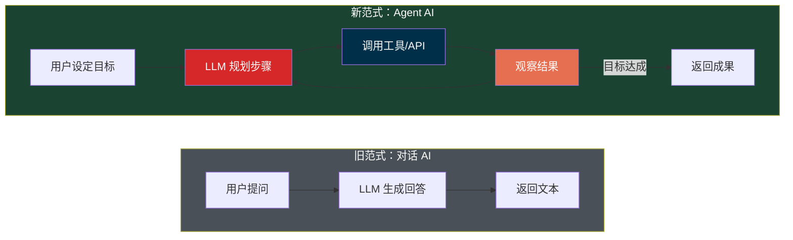
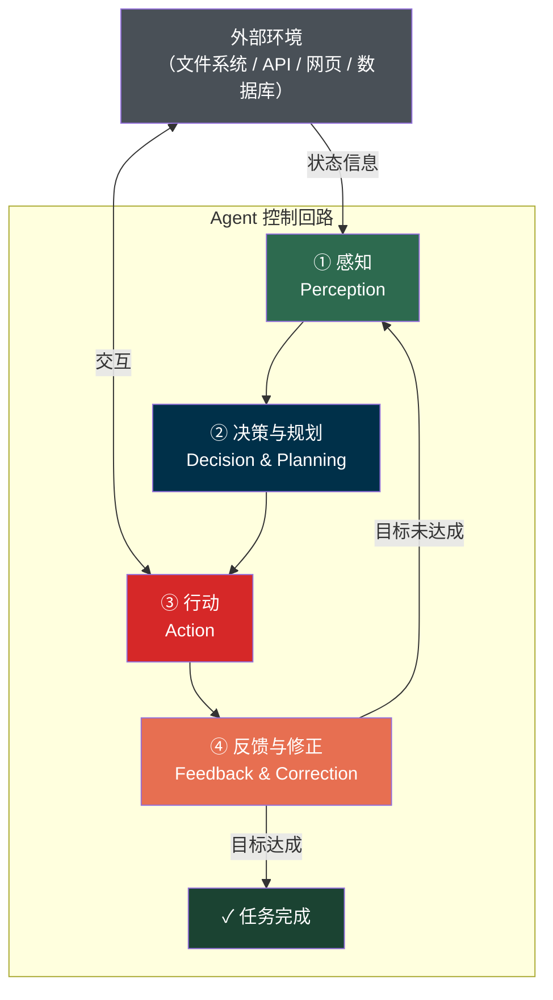
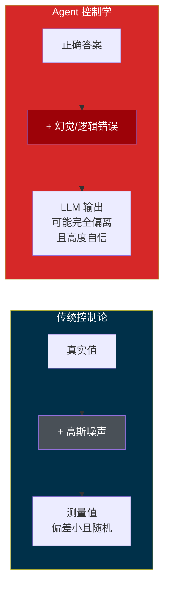
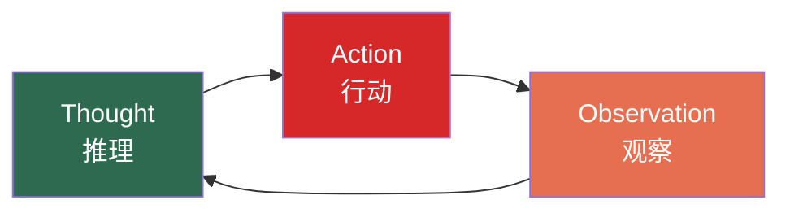
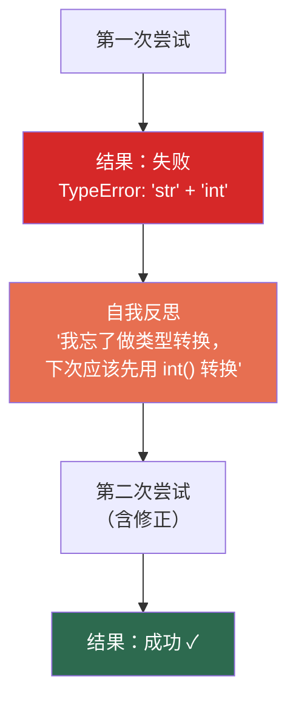
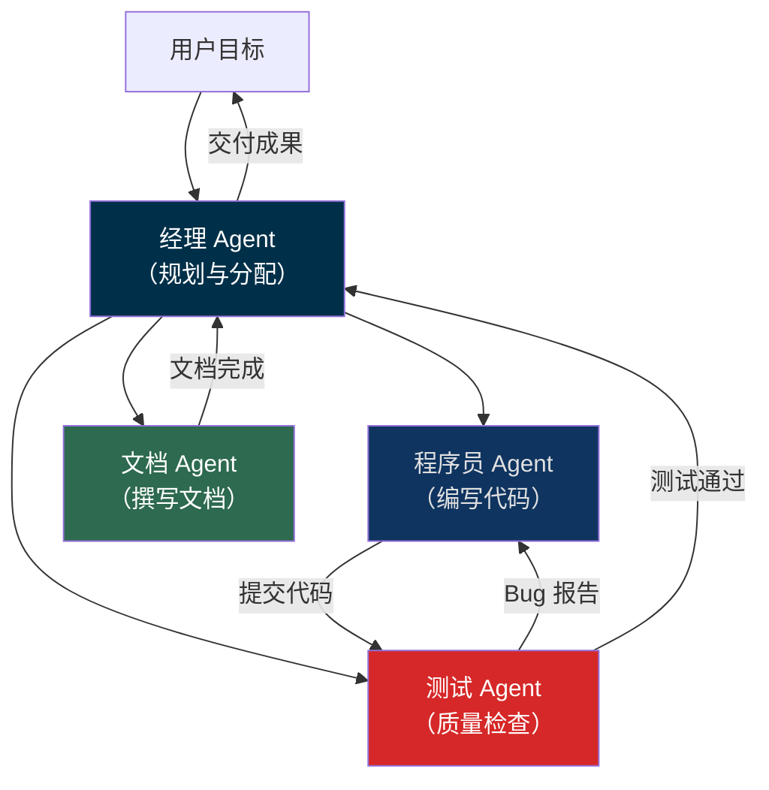
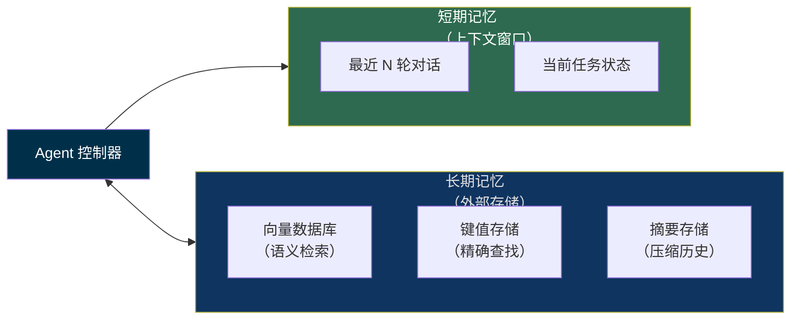
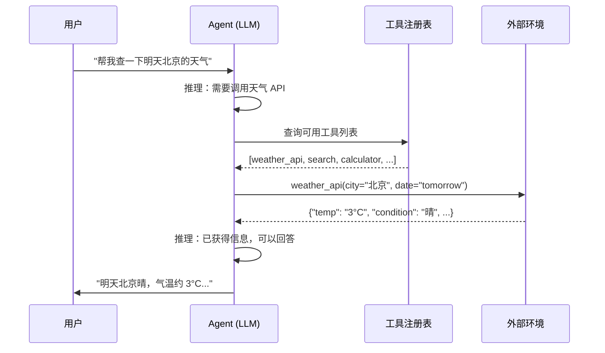
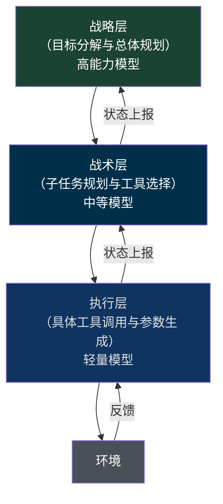
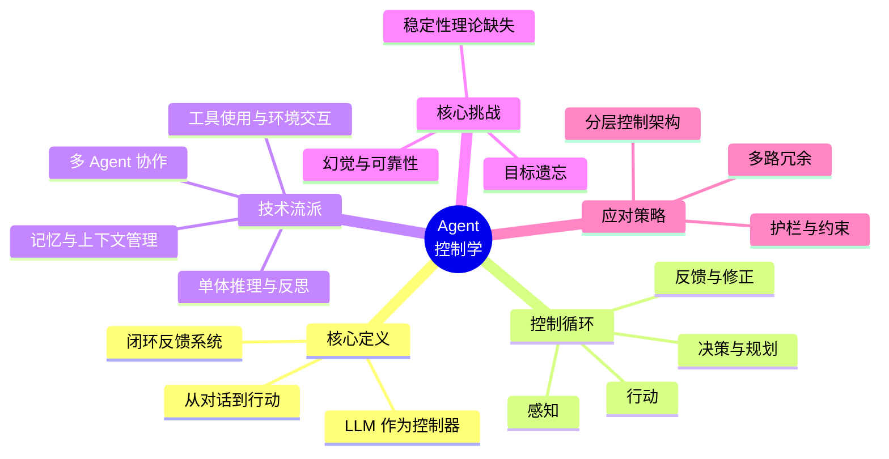

> **核心观点**：Agent 控制学是研究如何将概率性的语言模型，转化为具有确定性、鲁棒性和目标导向能力的行动决策者的技术体系。它的核心挑战在于——**如何用不可靠的模型（LLM），构建可靠的系统。**

## 一、引言：一个新学科的诞生

在过去两年里，大语言模型（LLM）经历了一次身份的根本转变。

2022 年底，ChatGPT 横空出世时，人们对它的定义是**对话助手**——你问它答，一问一答，被动响应。但到了 2024-2025 年，当 OpenAI 的 Function Calling、Anthropic 的 Tool Use、以及 Google 的 Gemini Agent 等能力逐步成熟后，LLM 的角色悄然发生了质变：

> 它不再只是一个**回答问题**的文本生成器，而是一个能够**规划步骤、调用工具、观察结果、修正策略**的自主行动者。

这个转变催生了一个新兴的交叉领域——**Agent 控制学**。



如果将大模型比作"大脑"，那么 Agent 控制学就是研究这个大脑如何通过"神经系统"去指挥"身体"（工具、API、机器人等）完成任务的学科。它既不完全属于传统的自动控制理论，也不完全属于自然语言处理，而是横跨两者的**前沿交叉地带**。

---

## 二、核心定义：从"对话"到"行动"

### 2.1 什么是 Agent 控制学？

**Agent 控制学**是研究**如何利用大语言模型作为核心"控制器"，来管理和驱动智能体在复杂环境中自主完成目标的理论、方法与技术体系。**

拆解这个定义中的关键词：

| 要素 | 含义 | 具体映射 |
|------|------|----------|
| **控制器** | 做决策的核心组件 | 大语言模型（GPT-4、Claude、Gemini 等） |
| **智能体（Agent）** | 具有自主行动能力的实体 | 代码执行环境 + 工具接口 + 记忆系统 |
| **复杂环境** | 非结构化的、动态变化的任务空间 | 互联网、文件系统、数据库、物理世界 |
| **自主完成目标** | 无需人类逐步干预 | 自动分解子任务、自动选择工具、自动纠错 |

### 2.2 从被动到主动的范式转变

传统 AI 应用的交互模式可以用一个开环系统来描述——输入进去，输出出来，没有反馈回路：

$$
\text{Output} = f(\text{Input})
$$

而 Agent 控制学关注的是一个**闭环系统**——输出会影响环境，环境的变化又会被感知并影响下一步决策：

$$
\begin{aligned}
s_{t+1} &= \text{Env}(s_t, a_t) \\
a_t &= \text{LLM}(s_t, g, h_t)
\end{aligned}
$$

其中：
- $ s_t $ 是时刻 $ t $ 的环境状态
- $ a_t $ 是 Agent 在时刻 $ t $ 采取的行动
- $ g $ 是用户设定的目标
- $ h_t $ 是历史信息（对话上下文、先前的行动与观察）
- $ \text{Env} $ 是环境的状态转移函数
- $ \text{LLM} $ 是大模型作为策略函数

这个闭环结构使得 Agent 不再是一个"函数调用"，而是一个**持续运行的控制进程**。

---

## 三、核心机制：控制循环

Agent 控制学的核心在于构建一个**闭环控制系统**。这与经典控制论中的"感知-决策-执行"循环高度一致，但在大模型时代有了全新的内涵。

### 3.1 四阶段控制回路



#### 阶段一：感知（Perception）

Agent 接收两类信息：

- **用户指令**：自然语言描述的目标（"帮我分析这份销售数据并生成可视化报告"）
- **环境状态**：当前文件列表、网页内容、API 返回值、上一步操作的结果

LLM 的作用：将非结构化的多模态信息（文本、图片、表格、错误日志）转化为可推理的内部表征。这相当于控制系统中的**传感器**。

#### 阶段二：决策与规划（Decision & Planning）

Agent 思考"下一步该做什么"。

LLM 的作用：利用其推理能力，进行链式思考（Chain-of-Thought），生成行动计划。它可能需要：

1. 将大目标分解为可执行的子目标
2. 选择合适的工具来完成每个子目标
3. 确定子目标的执行顺序和依赖关系

这相当于控制系统中的**控制器**——Agent 控制学中最核心的组件。

#### 阶段三：行动（Action）

Agent 调用外部工具执行具体操作：

- 调用搜索引擎获取信息
- 执行 Python 代码处理数据
- 操作浏览器填写表单
- 调用 API 发送邮件

LLM 的作用：生成结构化的工具调用参数（函数名 + 参数 JSON）。这相当于控制系统中的**执行器**。

#### 阶段四：反馈与修正（Feedback & Correction）

**这是 Agent 控制学最关键的一步。**

Agent 观察行动的结果：成功了？失败了？报错了？结果符合预期吗？

- 如果 API 返回 404，需要修正 URL
- 如果代码执行报 TypeError，需要修正变量类型
- 如果搜索结果不相关，需要换一个关键词重试
- 如果子任务完成但结果不理想，需要重新规划

LLM 的作用：如果结果不符预期，LLM 作为控制器需要**自我反思**，重新规划，修正参数，再次尝试。这相当于控制系统中的**反馈回路**和**误差校正机制**。

### 3.2 用伪代码理解控制循环

将上述四阶段用一段伪代码来表达，Agent 的运行时本质上就是一个 while 循环：

```python
def agent_loop(goal: str, env: Environment, llm: LLM):
    """Agent 控制回路的核心逻辑"""
    history = []                          # 历史记录（状态变量）
    max_iterations = 20                   # 最大迭代次数（防止无限循环）
    
    for step in range(max_iterations):
        # ① 感知：收集当前环境状态
        observation = env.get_state()
        
        # ② 决策：LLM 作为控制器，根据目标、历史和当前状态做决策
        thought, action = llm.reason(
            goal=goal,
            history=history,
            observation=observation
        )
        
        # 判断是否达成目标
        if action.type == "finish":
            return action.result           # 目标达成，退出循环
        
        # ③ 行动：调用外部工具
        result = env.execute(action)
        
        # ④ 反馈：将结果记录到历史，供下一轮决策使用
        history.append({
            "thought": thought,            # 思考过程
            "action": action,              # 采取的行动
            "result": result               # 行动的结果（反馈信号）
        })
    
    return "达到最大迭代次数，任务未完成"    # 安全阀：防止失控
```

注意这段代码中几个与控制论对应的关键设计：

| 代码要素 | 控制论对应概念 | 作用 |
|----------|---------------|------|
| `history` | 状态变量 | 维护系统的"记忆"，避免重复错误 |
| `llm.reason()` | 控制器 | 根据误差（目标与现状的差距）生成控制信号（行动） |
| `env.execute()` | 执行器 + 被控对象 | 将控制信号作用于环境 |
| `result` | 反馈信号 | 告诉控制器行动的效果 |
| `max_iterations` | 安全阀 / 稳定性约束 | 防止正反馈导致的无限循环 |

---

## 四、大模型"控制"与传统控制论的对比

Agent 控制学虽然借鉴了经典控制论的核心范式（闭环反馈），但两者在几乎所有技术细节上都有根本性的差异。

### 4.1 多维对比

| 维度 | 传统控制理论 | 大模型 Agent 控制学 |
| :--- | :--- | :--- |
| **控制对象** | 物理系统（电机、温度、飞行器），数学模型精确 | 语言与逻辑任务（写代码、订机票、数据分析），模型模糊且概率性 |
| **控制器** | PID、MPC、LQR 等数学函数 | LLM（千亿参数的神经网络） |
| **数学基础** | 微分方程、传递函数、状态空间 | 神经语言模型（Transformer）、提示词工程、强化学习（RLHF/RLAIF） |
| **控制信号** | 连续信号（电压、电流、力矩） | 离散符号（文本 Token、API 调用、JSON 参数） |
| **不确定性来源** | 传感器噪声、模型误差，通常有明确的统计学描述 | **幻觉**、逻辑错误、上下文长度限制，不确定性极高且难以量化 |
| **可预测性** | 给定初始条件和输入，输出可精确计算 | 同一输入可能产生不同输出（温度参数、采样随机性） |
| **稳定性分析** | Lyapunov 稳定性、Bode 图、Nyquist 判据 | 尚无成熟的理论框架，主要依赖经验性的 Prompt 调优和评测 |
| **故障模式** | 系统发散、振荡 | 幻觉、死循环、目标遗忘、工具滥用 |

### 4.2 不确定性：核心差异

传统控制论中，不确定性通常可以用概率分布来刻画。例如传感器噪声可以建模为高斯分布：

$$
y_{\text{measured}} = y_{\text{true}} + \epsilon, \quad \epsilon \sim \mathcal{N}(0, \sigma^2)
$$

控制器可以针对这种已知的不确定性进行鲁棒设计（$ H_\infty $ 控制、卡尔曼滤波等）。

但 LLM 的不确定性截然不同——**幻觉（Hallucination）**是一种结构化的、自信的错误。LLM 可能会编造一个完全不存在的 API 端点，并以完美的语法和自信的语气将其传递给 Agent。这种错误不是"噪声"，而是**系统性偏差**，且难以用传统的统计方法来建模。



这意味着 Agent 控制学需要一套全新的"鲁棒性"策略——不是滤波，而是**验证、反思与多路冗余**。

### 4.3 一个统一的视角

尽管差异巨大，两者在最高层的抽象上是一致的：

$$
\text{控制的本质} = \text{缩小"目标"与"现实"之间差距的持续过程}
$$

传统控制学缩小的是物理量的误差（温度偏差、位置偏差），Agent 控制学缩小的是**任务完成度的差距**（目标状态与当前状态之间的语义距离）。本质上，它们都是在做同一件事——**通过反馈驱动的迭代逼近**。

---

## 五、技术流派：让 LLM "控制器"更可靠

Agent 控制学的研究核心归结为一个问题：**如何让 LLM 这个"控制器"更听话、更聪明、更可靠？** 当前主要有四大技术流派。

### 5.1 流派一：单体内的推理与反思

这是最基础的流派，关注单个 Agent 内部的控制质量。

#### 思维链（Chain-of-Thought, CoT）

强迫模型在行动前"慢慢想"，把控制过程**显性化**。类比传统控制论中的"状态可观测性"——如果你看不到控制器内部在想什么，就无法诊断问题。

```
问题：帮我查看服务器 192.168.1.100 的磁盘使用情况

不好的控制（直接行动）：
→ 调用 ssh 连接工具

好的控制（思维链）：
思考：用户想查看服务器磁盘使用情况。
  1. 我需要先通过 SSH 连接到目标服务器
  2. 然后执行 df -h 命令查看磁盘使用率
  3. 解析输出结果并以可读格式返回
→ 调用 ssh 工具，执行 df -h
```

#### ReAct（Reason + Act）

**ReAct 是 Agent 控制学中最经典的框架**，由 Yao et al.（2023）提出。它让模型在每一步交替进行"推理"和"行动"，形成一个显式的控制回路：



一个典型的 ReAct 轨迹：

```
目标：查找 2025 年诺贝尔物理学奖得主的出生地

Thought 1: 我需要搜索 2025 年诺贝尔物理学奖的信息。
Action 1: search("2025 Nobel Prize in Physics winner")
Observation 1: The 2025 Nobel Prize in Physics was awarded to ...

Thought 2: 我找到了获奖者的名字，现在需要查找他的出生地。
Action 2: search("John Doe birthplace")
Observation 2: John Doe was born in ...

Thought 3: 我已经获得了所需的全部信息，可以给出最终答案。
Action 3: finish("2025 年诺贝尔物理学奖得主 John Doe 出生于...")
```

#### 自我反思（Reflexion）

当行动失败后，让模型自我批评"为什么做错了"，然后重试。这相当于控制学中的**误差校正**，但操作的对象不是数值参数，而是自然语言的**策略描述**：



### 5.2 流派二：多 Agent 协作

当一个任务太复杂、单个 Agent 控制不住时，将任务拆解给多个 Agent——这相当于**群体智能控制**或**分布式控制系统**。

#### 核心思想：分工与协作



代表框架：

| 框架 | 核心理念 | 协作模式 |
|------|----------|----------|
| **MetaGPT** | 用软件工程的角色分工来组织 Agent | 产品经理 → 架构师 → 程序员 → 测试 |
| **AutoGen** | Agent 之间通过对话自组织协作 | 灵活的多轮对话与任务委派 |
| **CrewAI** | 以"团队"为单位定义 Agent 群组 | 角色、目标、工具的声明式配置 |
| **LangGraph** | 将多 Agent 交互建模为状态图 | 显式的状态机控制流 |

从控制论视角看，多 Agent 系统引入了新的控制挑战：

- **一致性问题**：多个 Agent 的决策可能冲突
- **通信开销**：Agent 之间需要通过自然语言通信，信息损耗大
- **死锁与活锁**：Agent 之间互相等待或互相否定
- **责任归属**：当系统出错时，难以定位是哪个 Agent 的决策失误

### 5.3 流派三：记忆与上下文管理

控制学需要"状态变量"来追踪系统的演化。大模型的上下文窗口有限（即使是 128K 或 200K token 的窗口在复杂任务中也可能不够），如何管理**长期记忆**是维持控制连续性的关键。

如果控制器"忘了"刚才做了什么，控制就会失效。



记忆管理的关键技术：

| 技术 | 原理 | 类比 |
|------|------|------|
| **RAG（检索增强生成）** | 在推理时从外部知识库检索相关信息注入上下文 | 人类查阅笔记和参考资料 |
| **摘要压缩** | 将冗长的历史对话压缩为关键信息摘要 | 人类的"要点记忆"而非逐字记忆 |
| **工作记忆管理** | 动态决定哪些信息保留在上下文中、哪些存入长期存储 | 大脑的海马体与工作记忆 |
| **结构化记忆** | 将经验存储为结构化的知识图谱而非扁平文本 | 人类的概念网络 |

### 5.4 流派四：工具使用与环境交互

一个没有"手脚"的控制器无法作用于环境。**工具使用（Tool Use）**是 Agent 控制学中连接"决策"与"行动"的关键桥梁。

工具使用的典型流程：



当前主流的工具使用协议正在逐步标准化——从 OpenAI 的 Function Calling 到 Anthropic 的 Tool Use，再到 Anthropic 于 2024 年 11 月推出的开放标准 **MCP（Model Context Protocol）**，整个行业正在为 Agent 构建统一的"神经-肌肉接口"。

---

## 六、Agent 控制学的核心挑战

### 6.1 可靠性悖论

Agent 控制学面临的最根本挑战可以概括为一句话：

> **用不可靠的组件构建可靠的系统。**

LLM 作为控制器存在以下固有缺陷：

| 缺陷 | 表现 | 传统控制论类比 |
|------|------|---------------|
| **幻觉** | 编造不存在的函数、API、事实 | 传感器给出完全错误的读数 |
| **目标遗忘** | 在长序列推理中逐渐偏离原始目标 | 控制器的参考信号漂移 |
| **过度自信** | 对错误的决策不产生怀疑 | 缺少误差检测机制 |
| **脆弱性** | 微小的 Prompt 变化导致行为剧变 | 系统对初始条件极度敏感（混沌） |

### 6.2 当前的应对策略

针对这些挑战，Agent 控制学发展出了一系列工程化的应对策略：

**1. 多路冗余验证**

类似航空电子系统中的三重冗余设计，让多个 LLM 实例独立推理，取共识结果：

$$
a^* = \text{majority\_vote}(a_1, a_2, \ldots, a_n), \quad a_i = \text{LLM}_i(s, g, h)
$$

**2. 护栏与约束（Guardrails）**

为 Agent 的行动空间设置硬性边界：
- 白名单：只允许调用预定义的工具
- 资源限制：限制 API 调用次数、执行时间、花费金额
- 审批机制：高风险操作需要人类确认

**3. 分层控制架构**

将 Agent 系统设计为分层结构，不同层级处理不同粒度的决策：



这与 Stafford Beer 的**可行系统模型（VSM）** 不谋而合——每一层都有自己的控制回路，上层控制下层的目标设定，下层向上层报告执行状态。

---

## 七、为什么现在重要？

### 7.1 从"工具"到"员工"

Agent 控制学被视为通向 **AGI（通用人工智能）** 的关键一步。它标志着 AI 的角色从**被动工具**向**主动行动者**的根本转变：

| 阶段 | AI 的角色 | 人类的角色 | 代表产品 |
|------|----------|-----------|----------|
| **阶段 1：工具** | 执行单步指令 | 全程操控 | 搜索引擎、翻译工具 |
| **阶段 2：助手** | 对话式问答 | 逐步指导 | ChatGPT、Claude |
| **阶段 3：Agent** | 自主规划与执行 | 设定目标并审核 | Cursor Agent、Devin |
| **阶段 4：自治** | 独立运作 | 监督与治理 | 尚未实现 |

我们正处于**阶段 2 向阶段 3 的过渡期**。Agent 控制学正是为这个过渡提供理论基础和工程方法的学科。

### 7.2 落地应用场景

Agent 控制学已经在多个领域展现出巨大潜力：

- **软件开发**：AI Agent 自主编写、测试、调试代码（Cursor、Devin、GitHub Copilot Workspace）
- **科学研究**：自动化实验设计、文献综述、数据分析（ChemCrow、科研 Agent）
- **企业自动化**：自动处理邮件、安排会议、生成报告、执行 RPA 流程
- **自动驾驶决策**：将 LLM 作为高层决策模块，处理复杂的交通场景理解
- **智能客服**：从"查找 FAQ"到"自动办理业务"（退款、改签、账户操作）

---

## 八、总结与展望

### 8.1 核心要点回顾



### 8.2 未来方向

Agent 控制学仍处于发展早期，以下方向值得关注：

1. **形式化理论**：能否为 LLM-Agent 系统建立类似 Lyapunov 稳定性分析的形式化框架？如何证明一个 Agent 系统在给定条件下一定能收敛到目标？

2. **可解释性**：当 Agent 做出一个决策时，如何追溯其推理链条？这对于高风险场景（医疗、金融、法律）至关重要。

3. **效率优化**：当前的 Agent 系统往往需要数十次 LLM 调用才能完成一个任务，如何减少不必要的推理步骤，降低延迟与成本？

4. **安全与对齐**：当 Agent 拥有调用工具的能力后，如何确保它不会执行有害的操作？这是 AI 安全领域最紧迫的课题之一。

5. **人机协作**：最优的控制架构可能不是完全自治，而是**人在回路（Human-in-the-Loop）**——在关键决策节点引入人类判断，在常规执行中保持自动化。

### 8.3 结语

回到文章开头的那个比喻——如果 LLM 是"大脑"，那么 Agent 控制学就是让这个大脑学会驾驭身体的学问。

传统控制学用了一个世纪的时间，让机器精确控制物理世界。Agent 控制学面对的挑战更加深刻：它要用**概率性的、会犯错的、会幻觉的**语言模型，去构建**确定性的、可靠的、目标导向的**智能系统。

这个矛盾本身就蕴含着推动整个 AI 领域前进的张力。

---

## 参考文献

1. Yao, S., Zhao, J., Yu, D., et al. (2023). ReAct: Synergizing Reasoning and Acting in Language Models. *ICLR 2023*.
2. Shinn, N., Cassano, F., et al. (2023). Reflexion: Language Agents with Verbal Reinforcement Learning. *NeurIPS 2023*.
3. Wei, J., Wang, X., Schuurmans, D., et al. (2022). Chain-of-Thought Prompting Elicits Reasoning in Large Language Models. *NeurIPS 2022*.
4. Hong, S., Zhuge, M., et al. (2024). MetaGPT: Meta Programming for A Multi-Agent Collaborative Framework. *ICLR 2024 (Oral)*.
5. Wu, Q., Bansal, G., et al. (2024). AutoGen: Enabling Next-Gen LLM Applications via Multi-Agent Conversation. *COLM 2024*.
6. Wiener, N. (1948). *Cybernetics: or Control and Communication in the Animal and the Machine*. John Wiley & Sons.
7. Beer, S. (1972). *Brain of the Firm*. Allen Lane.
8. Sumers, T. R., Yao, S., et al. (2024). Cognitive Architectures for Language Agents. *TMLR 2024*.
9. Wang, L., Ma, C., et al. (2024). A Survey on Large Language Model based Autonomous Agents. *Frontiers of Computer Science*.
10. Xi, Z., Chen, W., et al. (2023). The Rise and Potential of Large Language Model Based Agents: A Survey. *arXiv:2309.07864*.
