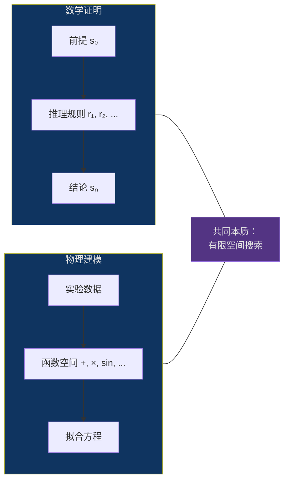
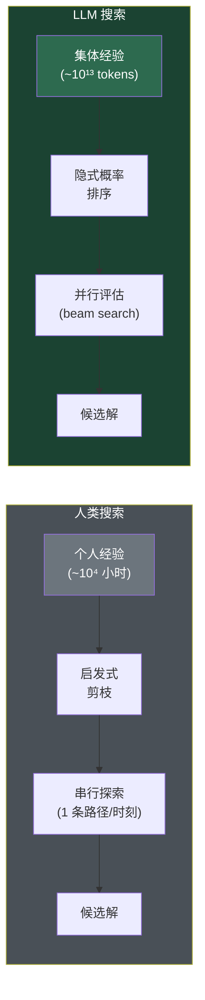
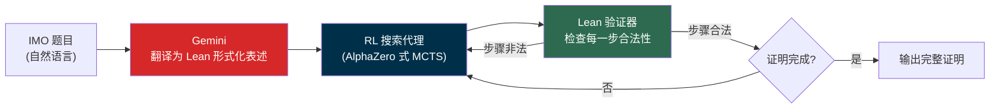
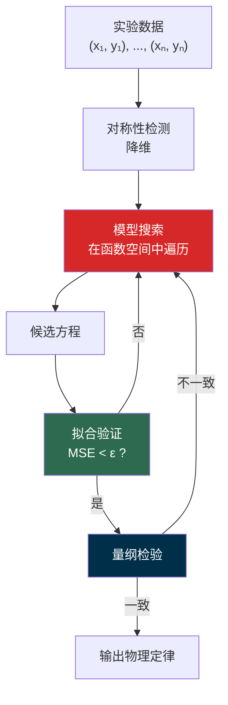

> **核心观点**：数学证明和物理定律发现本质上是**在有限解空间中的搜索问题**。大模型之所以能在这两个领域展现出替代人类的潜力，并非因为它"理解"了数学或物理，而是因为它将人类需要数年积累的**搜索启发式**（heuristics）压缩成了一次前向传播——同时，这两个领域都存在**完美或接近完美的外部验证器**（形式化证明检查器、实验数据拟合），恰好弥补了 LLM 自身验证能力不可靠的弱点。

## 一、问题求解的搜索本质

### 1.1 数学家和物理学家在做什么？

表面上看，数学家在"思考"证明，物理学家在"理解"自然。但如果剥去这些浪漫化的描述，他们的核心工作可以统一建模为：

> **在一个由规则定义的有限空间中，搜索满足特定约束的解。**

- 数学证明：在公理和推理规则组成的空间中，搜索从前提到结论的合法路径
- 物理建模：在数学函数和参数组成的空间中，搜索拟合实验数据的最优方程

### 1.2 搜索空间的两个关键维度

大模型能否替代这些工作，取决于两个维度：

| 维度 | 定义 | 影响 |
|------|------|------|
| **空间有限性** | 解空间是否有上界？ | 有限空间内，LLM 的模式匹配能有效收敛 |
| **验证成本** | 判断候选解是否正确的难度 | 验证越容易，LLM "生成-验证"循环效率越高 |

数学和物理恰好在这两个维度上都处于有利位置——空间大但有限，且都有成本极低的外部验证器。

### 1.3 LLM 搜索 vs 人类搜索

人类面对搜索问题时靠两样东西：**启发式剪枝**（凭经验跳过不太可能的分支）和**类比迁移**（把过去的策略搬到新问题上）。这两样的共同瓶颈是**认知带宽**：

- 工作记忆约 $7 \pm 2$ 个组块
- 注意力同一时刻只能聚焦一条路径
- 个人阅读量上限约 $10^8$ 量级的 tokens

大语言模型本质上是一个**压缩了人类集体搜索经验的概率分布**：

$$
\text{LLM}(\text{问题}) \approx \arg\max_{s \in \mathcal{S}} P(s \mid \text{问题}, \theta)
$$

参数 $\theta$ 从 $10^{13}$ 量级的 tokens 中学到（如 Llama 3 训练了 15 万亿 tokens），隐式编码了数百万篇论文中的证明策略和建模方法。关键差异不在于 LLM "更聪明"，而在于**搜索宽度**（同时对数千条路径做概率排序）和**模式库规模**（比任何个人的经验大五个数量级）。

### 1.4 验证器：被忽视的关键变量

LLM 搜索效率虽高，但有一个致命弱点——**它自身不擅长验证**。它能高效生成候选解，但无法可靠判断候选解是否正确。这就是为什么外部验证器至关重要：

$$
\text{有效替代} = \underbrace{\text{LLM 搜索效率}}_{\text{高}} + \underbrace{\text{外部验证器}}_{\text{可用}} - \underbrace{\text{LLM 自身验证}}_{\text{不可靠}}
$$

LLM 只负责"搜索"，把"验证"外包给确定性系统。但并非所有验证器都一样好——验证器的质量直接决定了 LLM 在该领域的表现上限：

| 验证器质量 | 特征 | 代表领域 | LLM 表现上限 |
|-----------|------|---------|-------------|
| **完美验证器** | 零误判，确定性判定 | 数学（Lean/Coq） | 高（已达 IMO 银牌） |
| **近似验证器** | 有噪声，概率性判定 | 物理（数据拟合） | 中（可重现已知定律） |
| **无可靠验证器** | 主观或无法形式化 | 创意写作、哲学 | 低（生成容易，质量无法保证） |

数学有形式化证明检查器，物理有实验数据——验证器质量的差异，正是两个领域中 LLM 表现差异的底层原因。后续两章将分别展开。

---

## 二、数学：在证明空间中的搜索革命

### 2.1 数学证明 = 有限空间搜索

一个数学证明可以形式化为：

$$
\text{证明} = (s_0, r_1, s_1, r_2, s_2, \ldots, r_n, s_n)
$$

其中 $s_0$ 是前提（假设），$s_n$ 是结论（待证命题），每个 $r_i$ 是一条推理规则。对于任何固定长度 $n$ 的证明，可能的推理路径数量虽然巨大，但**有限**。

更关键的是，数学证明拥有**完美的验证器**——形式化证明检查器（如 Lean、Coq、Isabelle）。给定一个候选证明，检查器能在多项式时间内判断其是否正确。

| 属性 | 数学定理证明 |
|------|------------|
| 搜索空间 | 有限（固定长度证明的推理路径数有上界） |
| 验证器 | 完美（形式化证明检查器，零误判） |
| LLM 角色 | 生成候选证明策略 |

### 2.2 AlphaProof：AI 搜索 + 形式验证器的范式

2024 年，DeepMind 的 **AlphaProof** 与 **AlphaGeometry 2** 合计解决了 IMO 2024 的 6 道题中的 4 道（得分 28/42，达银牌水平，仅差 1 分即为金牌）。其中 AlphaProof 解决了 3 道代数与数论题（包括全场最难的第 6 题，仅 5 名选手解出），AlphaGeometry 2 解决了 1 道几何题。

AlphaProof 的核心架构并非纯粹的 LLM 生成，而是 **Gemini（LLM）自动形式化 + AlphaZero 式强化学习证明搜索 + Lean 形式验证** 的三段式流水线：

> **注**：AlphaProof 的证明搜索核心是强化学习代理（通过在百万级自动形式化题目上自我对弈训练），而非直接用 LLM 逐步生成证明。但从更宏观的视角看，它仍然体现了本文的核心范式——**AI 驱动的高效搜索 + 形式化验证器的确定性反馈**。后续纯 LLM 驱动的证明系统（如 DeepSeek-Prover）也在快速发展，进一步印证了这一范式。

### 2.3 AI 在数学中的深层优势

AlphaProof 的搜索效率远超人类数学家，不是因为"算力碾压"，而是因为 AI 系统（无论是 RL 还是 LLM 驱动）在搜索层面拥有结构性优势：

1. **无偏见搜索**：人类数学家受"审美偏好"影响，倾向于追求"优雅"的证明路径，可能错过"丑陋但正确"的路径。LLM 没有这种偏见，对所有合法路径一视同仁。
2. **海量策略库**：LLM 从数百万篇数学论文中学到的证明策略远超任何个人。一个数学家穷其一生能精读的论文是数千篇，而 LLM 的训练语料覆盖了几乎所有公开的数学文献。
3. **不知疲倦**：IMO 每天 3 题、限时 4.5 小时（两天共 9 小时完成 6 题），人类选手需要在有限时间内分配精力。AlphaProof 对最难的第 6 题连续搜索了约 3 天，不存在注意力衰减。

本质上，这三个优势都指向同一件事：**在有限空间中，AI 的搜索覆盖率远超个体人类。**

### 2.4 替代的边界与角色转变

关键分界线：**在给定猜想后寻找证明**是有限空间搜索（可被替代），但**提出值得证明的猜想**是开放空间探索（暂时不可替代）。数学的核心价值正在从"证明能力"向"提问能力"迁移。

工作内容正在发生结构性转变：

| 传统角色 | 新兴角色 |
|---------|---------|
| 手工构造证明 | 设计证明搜索策略 |
| 验证他人证明 | 构建形式化验证环境 |
| 发现新定理 | **提出新猜想**（这仍然是开放空间问题） |
| 发展直觉与审美 | 将直觉翻译为搜索引导信号 |

---

## 三、物理：在方程空间中的符号回归

### 3.1 物理定律发现 = 函数空间搜索

物理学的核心工作之一是：给定实验数据，找到描述数据的数学方程。这本质上是一个**符号回归**（Symbolic Regression）问题——在由基本数学运算（加、减、乘、除、幂、三角函数等）构成的函数空间中，搜索拟合数据的最优表达式。

对于一个包含 $k$ 种基本运算、最大深度为 $d$ 的表达式树，搜索空间的大小约为：

$$
\lvert \mathcal{S} \rvert \sim k^{2^d - 1}
$$

这个空间虽然巨大（$k = 10, d = 5$ 时约 $10^{31}$），但**有限且可枚举**。更重要的是，给定实验数据，评估一个候选方程的拟合优度可以在 $O(n)$ 时间内完成（$n$ 为数据点数量），即**验证成本极低**。

### 3.2 从开普勒到 AI Feynman

符号回归并不是一个新问题。开普勒从第谷积累的大量天文观测数据中，耗费数年手工搜索，于 1609 年在《新天文学》中发表了前两条行星运动定律（椭圆轨道、面积定律），又于 1619 年在《世界的和谐》中发表了第三条定律（周期定律）——这本质上就是在函数空间中的人工搜索。他没有现成的理论框架指导，靠的是反复试错与直觉。

四百年后，2020 年 MIT 的 Udrescu 和 Tegmark 发表了 **AI Feynman** 系统，将这一过程自动化。其核心思路：

1. **有限空间定义**：限定方程的复杂度上界（树的最大深度、允许的运算类型）
2. **神经网络搜索**：利用模型的模式匹配能力，在函数空间中快速定位有希望的区域
3. **符号验证**：将候选方程与实验数据对比，并检查量纲一致性

该系统成功"重新发现"了 100 个已知的物理方程——从牛顿万有引力定律到相对论性动能公式。开普勒用数年完成的工作，AI Feynman 在秒级时间内就能复现。

> **注**：AI Feynman（2020）使用的是神经网络而非严格意义上的大语言模型。但它开创的"模型搜索 + 符号验证"范式，与后来 LLM 驱动的符号回归方法一脉相承，可视为这一方向的先驱。

### 3.3 LLM 在物理中的深层优势

传统符号回归（如遗传编程）是"盲搜"——随机生成、变异、选择。LLM 带来的根本改变是**基于知识的搜索偏置**：

- LLM 知道物理定律通常具有某些结构特征（守恒律、对称性、最小作用原理）
- LLM 知道 $F = ma$ 比 $F = m^{1.0001} \cdot a^{0.9999}$ 更"物理"
- LLM 能将自然语言描述的实验条件转化为搜索约束

这相当于给搜索引擎装上了**物理直觉的先验分布**，使其能在 $10^{31}$ 的空间中直接跳到 $10^3$ 量级的高概率区域。

### 3.4 替代的边界与角色转变

与数学类似，物理中的替代也有明确的边界：

- **可替代**：在已知框架（如牛顿力学、量子力学）内的方程拟合、参数优化、数值模拟
- **难替代**：**提出新的物理框架**。爱因斯坦从"光速不变"这一实验事实推导出相对论，不是在已知方程空间中搜索，而是**重新定义了搜索空间本身**

> 用搜索理论的术语说：LLM 擅长在给定空间 $\mathcal{S}$ 中搜索，但不擅长构造新空间 $\mathcal{S}'$。

物理工作者的角色同样在发生结构性转变：

| 传统角色 | 新兴角色 |
|---------|---------|
| 从数据中拟合方程 | 设计实验、获取高质量数据 |
| 在已知框架内做数值模拟 | 识别已知框架无法解释的新现象 |
| 手工推导解析解 | 构造新的理论框架 |
| 掌握特定领域的计算技巧 | 将物理直觉翻译为搜索先验 |

---

## 四、对比与总结

### 4.1 两个领域的横向对比

| 维度 | 数学定理证明 | 物理方程发现 |
|------|------------|------------|
| 搜索空间 | 中（指数级但有限） | 大（双指数级） |
| 验证器 | 完美（Lean/Coq，零误判） | 近似（数据拟合 + 量纲检验，有噪声） |
| AI 的搜索优势 | 海量策略库 + 无审美偏见 + RL 自我进化 | 物理直觉先验 + 对称性检测 |
| 当前进展 | AlphaProof + AlphaGeometry 2 达 IMO 银牌（28/42） | AI Feynman 重现 100 个已知定律 |
| 可替代部分 | 给定猜想后的证明搜索 | 已知框架内的方程拟合 |
| 不可替代部分 | 提出猜想 | 提出新的物理框架 |

### 4.2 共同规律

两个领域展现出相同的模式：

1. **搜索层面的工作正在被接管**：在已知空间中找证明、找方程，LLM 的效率远超人类
2. **定义层面的工作留给人类**：什么值得证明、什么是好的实验、如何构造新的理论框架——这些搜索空间本身还不存在，没法搜
3. **验证器是关键推动力**：数学有 Lean，所以 AlphaProof 能做到银牌水平；物理的验证器（数据拟合）有噪声，所以 AI Feynman 目前只能重现已知定律而非发现新定律

对从业者来说，转变方向很具体：

| 角色 | 正在被替代的工作 | 转向的工作 |
|------|----------------|-----------|
| **数学家** | 在已知猜想下手工构造证明 | 提出猜想、构建形式化环境（Lean 4）、设计搜索引导策略 |
| **物理学家** | 从数据中拟合已知框架内的方程 | 设计实验、识别新现象、构造新的理论框架 |

### 4.3 框架的适用边界

"有限空间 + 外部验证器"的分析框架不止适用于数学和物理。它可以帮助我们预判 LLM 在其他领域的替代潜力：

| 领域 | 空间有限性 | 验证器质量 | LLM 替代潜力 |
|------|----------|-----------|-------------|
| **蛋白质折叠** | 有限（氨基酸序列确定后，构象空间有物理约束） | 近似（能量函数 + 实验结构比对） | 高（AlphaFold 已验证） |
| **药物分子设计** | 有限（合成可行性约束了分子空间） | 中等（体外实验验证，周期长） | 中高（搜索有效，验证是瓶颈） |
| **软件工程** | 有限（给定语言和 API 的程序空间） | 较好（测试用例 + 编译器） | 中高（代码生成已初见成效） |
| **创意写作** | 无限（表达空间无明确边界） | 无（质量判断高度主观） | 低（生成容易，质量无法自动评判） |
| **伦理判断** | 无限（情境空间无法穷举） | 无（不存在客观裁判标准） | 低（不适用搜索-验证范式） |

规律很清晰：**空间越有限、验证器越可靠的领域，LLM 的替代潜力越大。** 当两个条件都不满足时，LLM 只能做辅助，不能做替代。
