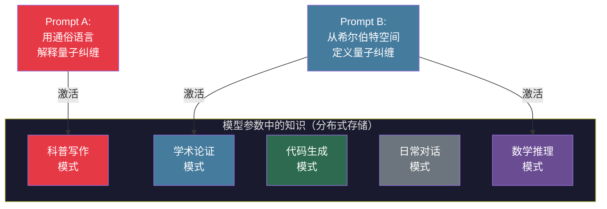
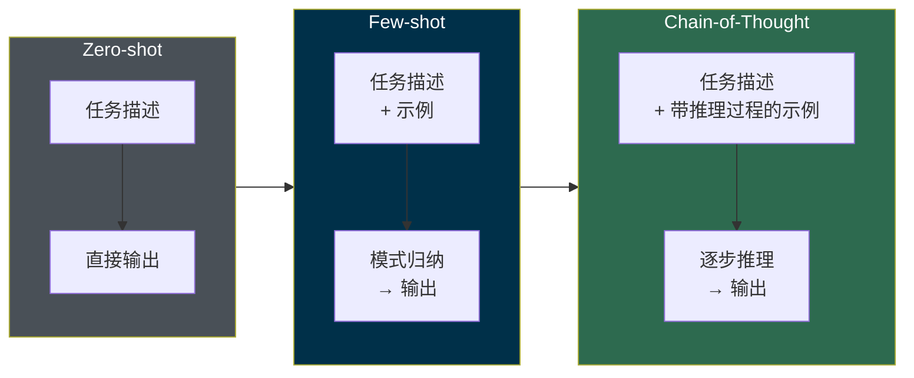
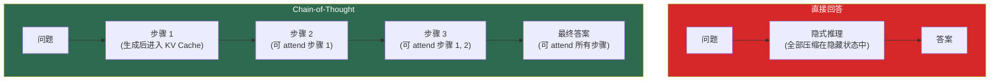
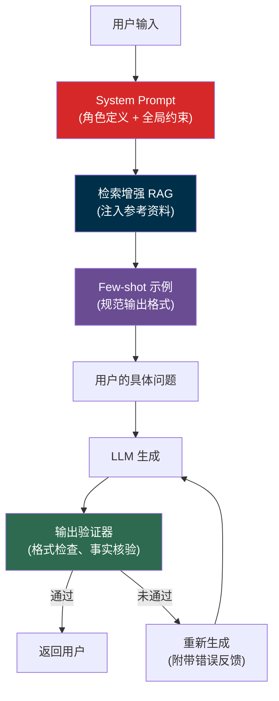
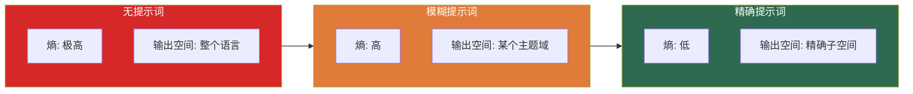
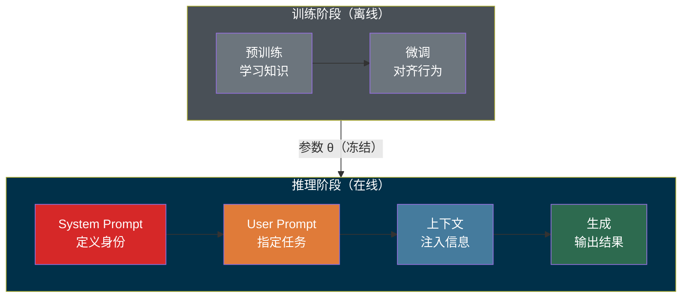

> **核心观点**：提示词（Prompt）不是"和 AI 聊天的措辞技巧"，而是**人类意图与模型能力之间的唯一编程接口**。LLM 的参数在推理时冻结不变，提示词是唯一能在运行时改变模型行为的变量——它决定了你能从一个固定的概率分布中**检索**出多少价值。理解提示词的本质，需要从条件概率、信息论和认知科学三个层面入手。

## 一、LLM 的运行机制：为什么需要提示词

### 1.1 LLM 本质上是条件概率生成器

大语言模型的核心工作方式可以用一句话概括：**给定前文，预测下一个 token 的概率分布**。

$$
P(x_{t+1} \mid x_1, x_2, \ldots, x_t; \theta)
$$

其中 $x_1, x_2, \ldots, x_t$ 是输入序列（即提示词），$\theta$ 是模型参数（推理时冻结），$x_{t+1}$ 是待生成的下一个 token。

关键在于：**参数 $\theta$ 在推理时是常量**。也就是说，一旦模型部署上线，它的"能力"就固定了。唯一能改变模型输出行为的变量，就是输入序列——提示词。

```mermaid
flowchart LR
    A["提示词<br/>(唯一可变输入)"] --> B["LLM<br/>P(x &#124; prompt, θ)"]
    C["模型参数 θ<br/>(推理时冻结)"] --> B
    B --> D["输出分布<br/>(由 prompt 决定)"]

    style A fill:#d62828,color:#fff
    style C fill:#495057,color:#fff
    style B fill:#003049,color:#fff
    style D fill:#2d6a4f,color:#fff
```



这意味着提示词不是"和模型说的话"，而是**对模型的运行时编程**——你在用自然语言写"代码"，控制一个概率分布的输出方向。

### 1.2 没有提示词会发生什么

如果输入为空或极度模糊，模型面对的是一个**高熵输出分布**——几乎任何方向的续写都有可能。这就像打开一本百科全书随机翻页，输出完全不可控。

| 输入 | 模型面对的局面 | 输出质量 |
|------|-------------|---------|
| （空输入） | 在整个语言空间中随机采样 | 不可控 |
| "写点东西" | 在所有写作主题中随机选择 | 极低 |
| "用 Go 实现一个带超时的 HTTP 客户端" | 在 Go HTTP 编程的解空间中搜索 | 高 |
| "用 Go 实现带超时的 HTTP 客户端，使用 context 包，含错误处理和重试机制" | 搜索空间进一步收窄 | 很高 |

本质上，提示词的作用是**缩小模型的输出空间**，将一个高维概率分布"压缩"到你需要的那个小区域。

### 1.3 提示词 vs 传统编程

从编程的角度看，提示词扮演的角色类似于函数调用时传入的参数——但远比传统参数复杂：

| 维度 | 传统编程 | 提示词编程 |
|------|---------|-----------|
| 接口 | 函数签名、API 规范 | 自然语言 |
| 参数类型 | 强类型 | 无类型（语义理解） |
| 行为确定性 | 确定性 | 概率性 |
| 调试方式 | 断点、日志 | 反复调整措辞 |
| 复用方式 | 函数库、SDK | Prompt 模板 |

尽管形式不同，但核心目标一致：**通过精确的输入控制程序行为**。这也是为什么 Prompt Engineering 本质上是一种编程活动。

---

## 二、提示词如何影响模型输出

### 2.1 激活特定知识子集

LLM 在预训练阶段从数万亿 token 中学习了海量知识。这些知识以参数的形式**分布式存储**在模型的权重矩阵中——不像数据库那样有清晰的索引，而是纠缠在一起。

提示词的第一个作用是**充当检索键**，在模型的参数空间中激活与当前任务最相关的知识子集。



同一个底层知识（量子纠缠），被不同的提示词"检索"出来后，呈现的形式截然不同。这不是模型"理解"了你的意图，而是提示词中的关键信号（"通俗语言" vs "希尔伯特空间"）改变了注意力权重的分布，使不同的参数子集被激活。

### 2.2 控制输出的多维属性

提示词不仅决定"说什么"，还决定"怎么说"。一个精心设计的提示词可以同时控制输出的多个维度：

| 控制维度 | 提示词中的信号 | 效果 |
|---------|-------------|------|
| **内容范围** | "解释 Go 的 GMP 调度器" | 限定主题 |
| **输出格式** | "以 JSON 格式返回" | 限定结构 |
| **详细程度** | "用 500 字以内概述" | 限定篇幅 |
| **技术深度** | "面向有 3 年经验的后端工程师" | 限定难度 |
| **语言风格** | "用正式的学术语气" | 限定调性 |
| **角色扮演** | "你是一个代码审查专家" | 限定身份 |
| **行为约束** | "如果不确定，请说不知道" | 限定边界 |

每增加一个维度的约束，输出空间就收窄一次。这类似于数据库查询中添加 `WHERE` 条件——条件越多，结果集越精确。

### 2.3 注意力机制：提示词影响输出的底层原理

从技术层面看，提示词影响输出的机制是 **注意力权重的动态分配**。在 Transformer 架构中，每个输出 token 的生成都会对**所有前序 token** 计算注意力分数：

$$
\text{Attention}(Q, K, V) = \text{softmax}\left(\frac{QK^T}{\sqrt{d_k}}\right)V
$$

其中 $Q$ 来自当前生成位置，$K$ 和 $V$ 来自**所有已处理的 token**——既包括提示词，也包括模型已经生成的 token。这正是 KV Cache 的工作原理：缓存所有已处理 token 的 $K$、$V$ 向量，避免重复计算。也正是这一机制，使得 Chain-of-Thought（第三章）中生成的中间步骤能够被后续步骤"看到"并利用。

但在生成的起点，模型唯一可以 attend 的内容就是提示词。因此，提示词的内容从根本上决定了注意力权重的初始分布方向，进而影响整个生成过程。

这意味着：

- **提示词中的每个词都有影响**：不是只有"关键词"有用，措辞方式、句式结构、甚至标点符号都会微调注意力分布
- **位置也有影响**：由于位置编码的存在，同一句话放在提示词的开头和结尾，激活效果不同
- **顺序也有影响**：先说约束再说任务，和先说任务再说约束，可能产生不同的输出

---

## 三、上下文学习：提示词最强大的能力

### 3.1 什么是上下文学习

上下文学习（In-Context Learning, ICL）是 LLM 最深刻的能力之一：**模型可以通过提示词中的示例"学会"新任务，而无需更新任何参数**。

$$
P(y \mid \text{task}, \text{examples}, x; \theta) \neq P(y \mid x; \theta)
$$

左边是带有任务描述和示例的条件概率，右边是裸输入的条件概率。两者输出完全不同，但模型参数 $\theta$ 完全相同——改变的只有提示词。

这意味着提示词不仅是"输入"，更是一种**运行时的任务规范**。你在用自然语言"编程"模型去做一件它从未被专门训练过的事。

### 3.2 上下文学习的三种范式

根据提示词中包含的信息量，上下文学习分为三种范式，效果逐级递增：



#### Zero-shot：纯靠描述

```text
将以下英文翻译为中文：
"The quick brown fox jumps over the lazy dog."
```

模型仅靠任务描述来理解要做什么。能力完全来自预训练阶段积累的知识。

#### Few-shot：示例引导

```text
将以下英文翻译为中文：

英文: "Hello, how are you?" → 中文: "你好，你怎么样？"
英文: "Good morning." → 中文: "早上好。"

英文: "The quick brown fox jumps over the lazy dog." → 中文:
```

通过提供输入-输出对，模型从模式中归纳规律。即使翻译风格不在预训练分布中（比如你要求用文言文翻译），只要给足示例，模型也能习得。

#### Chain-of-Thought：显式推理链

```text
问：小明有 15 个苹果，给了小红 6 个，又买了 4 个，还剩多少？

让我们一步步思考：
1. 初始：15 个
2. 给了小红 6 个：15 - 6 = 9 个
3. 又买了 4 个：9 + 4 = 13 个
答：13 个

问：小华有 23 本书，捐了 8 本给图书馆，同学还了他 5 本，还剩多少？
让我们一步步思考：
```

要求模型展示中间推理步骤，而不是直接输出最终答案。这在需要多步推理的任务中效果显著。

### 3.3 为什么 Chain-of-Thought 能提升推理能力

Chain-of-Thought（CoT）能提升推理能力的原因，可以从模型的生成机制理解：

LLM 是自回归模型——每个 token 的生成只能依赖**已生成的所有前文**（如 2.3 节所述，K/V 覆盖所有已处理 token）。如果直接要求模型给出最终答案，模型需要在极少的生成步骤内（如 "13" 在主流分词器中仅为 1 个 token）完成所有推理——所有中间计算必须**隐式**地发生在模型的隐藏状态中，无法被后续 token 的注意力机制显式利用。

CoT 的作用是**将内部推理过程外化为 token 序列**。从概率角度看，这是一个链式法则分解：

$$
P(\text{答案}, \text{步骤}_{1:n} \mid \text{问题}) = \prod_{i=1}^{n} P(\text{步骤}_i \mid \text{问题}, \text{步骤}_{1:i-1}) \cdot P(\text{答案} \mid \text{问题}, \text{步骤}_{1:n})
$$

关键在于最后一项：当正确的中间步骤 $\text{步骤}_{1:n}$ 已经被显式生成后，模型在预测最终答案时可以直接 attend 到这些中间结果，使正确答案的条件概率显著提高。

每个中间步骤生成后，就成为后续步骤的**已知条件**（进入 KV Cache，被注意力机制覆盖），模型可以在下一步中"看到"并利用这些中间结果。本质上，CoT 将模型的工作记忆从**隐式**（隐藏状态，容量受限于模型宽度）扩展到了**显式**（生成的 token 序列，容量受限于上下文窗口），使模型在每一步都能利用之前的推理结果。



这也解释了为什么 CoT 对简单任务几乎没有提升——简单任务本来就只需要一步推理，外化中间步骤没有额外收益。

---

## 四、提示词如何缓解模型固有缺陷

### 4.1 LLM 的三大结构性弱点

LLM 并非万能，它存在一些由架构和训练方式决定的结构性弱点：

| 弱点 | 根本原因 | 表现 |
|------|---------|------|
| **幻觉** | 模型优化的是 token 级概率，而非事实正确性 | 生成看似合理但实际错误的内容 |
| **推理跳跃** | 自回归生成无法回溯修正 | 多步推理中出现逻辑断裂 |
| **指令遵循不稳定** | 注意力分散在长上下文中 | 忽略部分约束条件 |

### 4.2 用提示词对症下药

好的提示词策略可以针对性地缓解这些弱点：

**缓解幻觉**：

```text
根据以下参考资料回答问题。如果参考资料中没有相关信息，
请明确说"根据提供的资料无法回答此问题"，不要编造答案。

参考资料：
[具体内容]

问题：...
```

通过提供参考资料和明确的兜底指令，将模型从"开放式生成"切换为"基于证据的检索式回答"，大幅降低幻觉概率。

**缓解推理跳跃**：

```text
请一步步解决这个问题。每一步都要：
1. 明确说明你在做什么
2. 展示具体计算过程
3. 验证这一步的结果是否合理

如果某一步不确定，请标注出来。
```

强制模型逐步输出推理过程（CoT），每步都成为下一步的"已知条件"，减少逻辑跳跃。

**缓解指令遵循不稳定**：

```text
## 你的角色
代码审查专家

## 必须遵守的规则（重要）
1. 只关注安全漏洞，不评论代码风格
2. 每个问题必须给出具体的修复建议
3. 输出格式：JSON 数组

## 任务
审查以下代码：
...
```

通过结构化排版（标题、编号列表、强调标记）提升关键指令的注意力权重，减少模型"忘记"约束条件的概率。

### 4.3 从缓解到系统设计

单条提示词的优化是有上限的。在实际工程中，更有效的方式是将提示词策略嵌入系统架构：



在这个架构中，提示词不再是孤立的一段文本，而是**多层信号的组合**：System Prompt 定义行为边界，RAG 注入事实依据，Few-shot 规范输出格式，验证器提供反馈循环。每一层都在进一步收窄模型的输出空间，降低出错概率。

---

## 五、从信息论角度理解提示词

### 5.1 提示词 = 降低输出熵

信息论为理解提示词提供了一个优雅的框架。考虑模型在每一步生成时，下一个 token 的**条件熵**（conditional entropy）度量了该步输出的不确定性：

$$
H(X_{t+1} \mid x_1, \ldots, x_t, \text{prompt}) = -\sum_{x} P(x \mid x_1, \ldots, x_t, \text{prompt}) \log P(x \mid x_1, \ldots, x_t, \text{prompt})
$$

为简洁起见，我们用 $H(X \mid \text{prompt})$ 代表提示词对模型输出不确定性的整体影响。提示词越精确，输出在每一步的条件熵越低——即输出的不确定性越小。

$$
H(X) \gg H(X \mid \text{模糊提示词}) \gg H(X \mid \text{精确提示词})
$$



这就是 Prompt Engineering 的核心原则——**具体、明确、有约束**——的信息论根据：每一个约束条件都在降低条件熵，将输出分布从"几乎均匀"推向"高度集中"。

### 5.2 提示词中的信息冗余与效率

并非提示词越长越好。从信息论的角度，提示词中的每个 token 携带的**互信息**（Mutual Information）不同：

$$
I(\text{token}_i; Y) = H(Y) - H(Y \mid \text{token}_i)
$$

其中 $Y$ 是输出。一个 token 对输出的互信息越高，它对降低输出熵的贡献越大。

这意味着：

- **高信息量 token**："用 Go 语言""返回 JSON 格式""不超过 100 字"——每个都显著收窄输出空间
- **低信息量 token**："请你""帮我""谢谢"——对输出分布几乎没有影响
- **噪声 token**：与任务无关的冗长背景——占用有限的上下文窗口，稀释模型对关键 token 的注意力，反而降低输出质量（注意：信息论中条件熵满足 $H(Y \mid X_1, X_2) \leq H(Y \mid X_1)$，即额外条件不会增加理论熵；但 LLM 的注意力容量有限，实际效果等价于引入干扰）

好的提示词应该**最大化信息密度**：用最少的 token 传递最多的约束信号。

### 5.3 采样温度与提示词的协同效应

模型的采样温度（Temperature）也影响输出熵，但作用机制与提示词不同：

$$
P_T(x) = \frac{\exp(\text{logit}(x) / T)}{\sum_{x'} \exp(\text{logit}(x') / T)}
$$

| 机制 | 作用层面 | 效果 |
|------|---------|------|
| 提示词 | 改变 logit 分布本身 | 从源头决定哪些 token 概率高 |
| 温度 $T$ | 调整 logit 分布的"锐度" | 不改变排序，只改变差距 |

好的提示词 + 低温度 = 最精确的输出（低熵）。差的提示词 + 高温度 = 最不可控的输出（高熵）。两者是正交且互补的控制手段。

---

## 六、Prompt Engineering 的实践原则

基于上述理论分析，可以总结出 Prompt Engineering 的核心原则：

### 6.1 五条黄金法则

| 法则 | 理论依据 | 实践示例 |
|------|---------|---------|
| **明确任务** | 降低输出熵 | "翻译为中文" 而非 "处理这段文字" |
| **提供上下文** | 激活相关知识子集 | 附上参考资料、背景信息 |
| **规范格式** | 约束输出空间 | "以 Markdown 表格输出，包含列：名称、优点、缺点" |
| **给出示例** | 利用上下文学习 | 提供 2-3 个输入-输出对 |
| **设定边界** | 缓解模型弱点 | "仅基于提供的资料回答，不确定时说不知道" |

### 6.2 一个完整的提示词结构

将上述原则组合，一个工程级提示词通常包含以下结构：

```text
## 角色
你是一位资深的 Go 语言后端工程师，专注于高并发系统设计。

## 上下文
我正在开发一个实时消息推送系统，使用 Go 1.22，
需要支持 10 万级并发长连接。

## 任务
审查以下代码的并发安全性问题，并给出修复建议。

## 输出格式
对每个问题，按以下格式输出：
- 问题描述：...
- 严重程度：高/中/低
- 修复建议：...
- 修复后代码：...

## 约束
1. 只关注并发安全问题，不评论代码风格
2. 如果没有发现问题，明确说明"未发现并发安全问题"

## 代码
[待审查的代码]
```

每个部分都在发挥特定作用：角色激活知识子集，上下文提供领域信息，任务明确目标，格式规范输出，约束设定边界。

---

## 七、提示词的本质与局限

### 7.1 提示词能做什么

回顾全文，提示词的能力可以归纳为四个层面：

| 层面 | 机制 | 效果 |
|------|------|------|
| **检索** | 激活参数中的特定知识 | 让模型"想起"相关内容 |
| **编程** | 在运行时改变模型行为 | 让模型做它没专门训练过的事 |
| **约束** | 降低输出空间的熵 | 提高输出的精确性和可控性 |
| **补偿** | 缓解模型结构性弱点 | 减少幻觉、推理跳跃等问题 |

### 7.2 提示词不能做什么

同样重要的是认识到提示词的局限：

- **不能超越模型能力上限**：如果模型在预训练中没学过某个知识，提示词无法凭空创造。提示词是"检索"，不是"教学"
- **不能消除概率性**：LLM 的输出本质上是采样过程，即使是最完美的提示词，输出也存在随机性
- **不能替代外部验证**：提示词可以降低错误概率，但不能保证正确性。在高可靠性场景中，仍然需要外部验证器（测试、类型检查、人工审查）
- **不能无限扩展上下文**：受限于上下文窗口长度，提示词不能无限制地增加信息

### 7.3 一个统一的视角

将提示词置于更大的框架中：



训练阶段决定了模型**能做什么**（能力上限），提示词决定了模型**实际做什么**（能力兑现）。两者缺一不可——再强的模型配上糟糕的提示词，输出质量也会大打折扣；再好的提示词也无法让一个弱模型超越其能力边界。

**提示词的本质，是在一个固定的能力空间中，精确定位你需要的那个点。**
