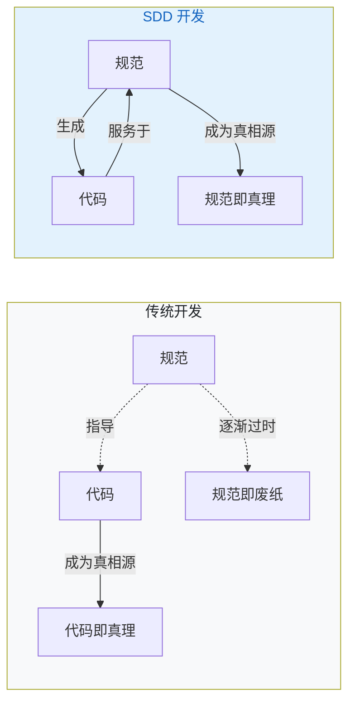
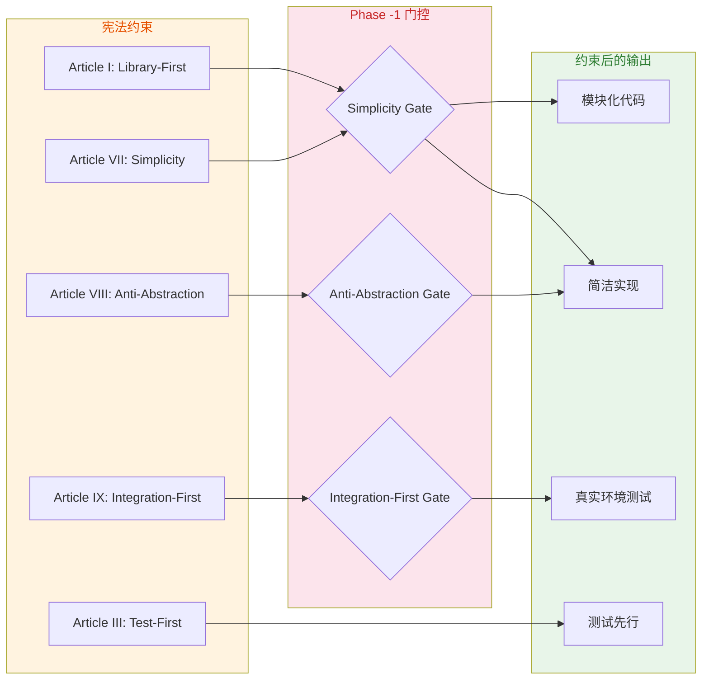
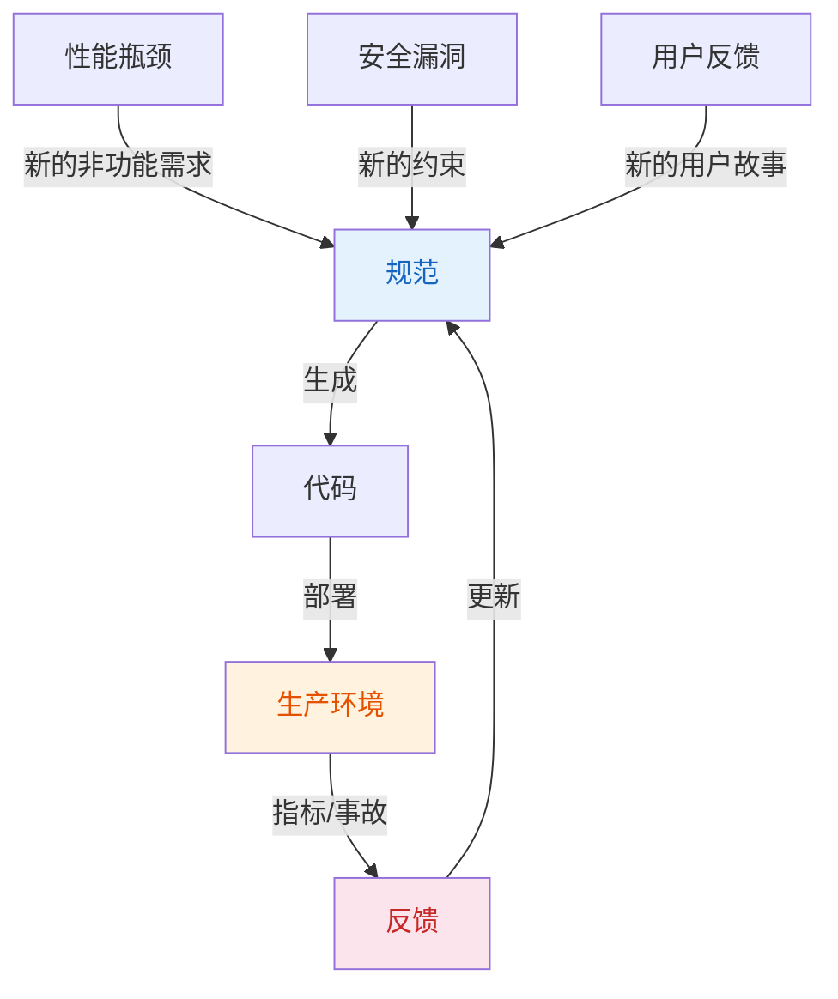
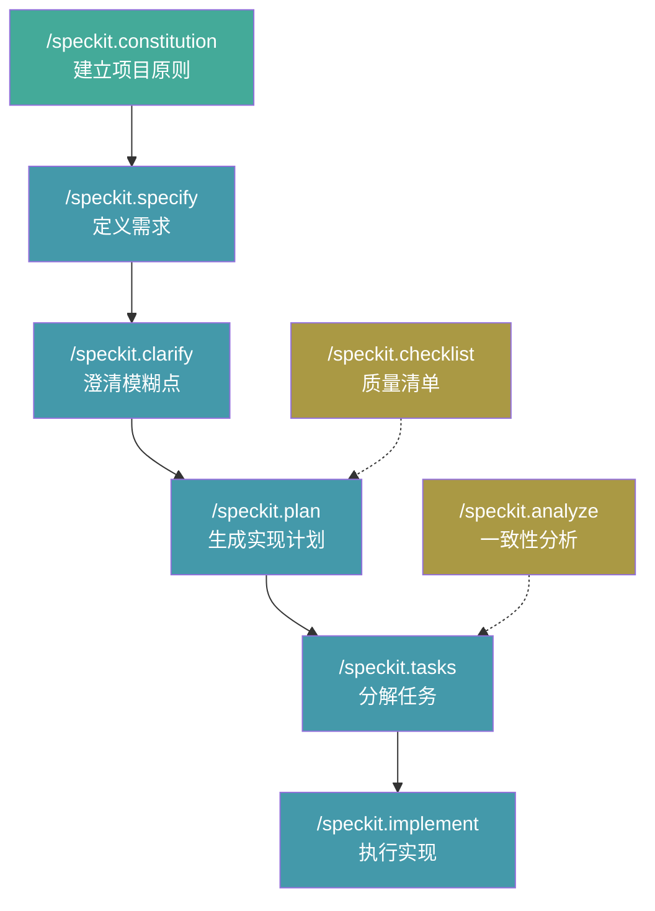

> **核心观点**：几十年来，代码一直是软件开发的王者——规范只是脚手架，用完即弃。GitHub 开源的 Spec Kit 试图颠覆这个范式：**规范成为可执行的源，代码只是规范在特定语言和框架下的表达**。这不是渐进式改进，而是一次关于"谁驱动谁"的权力反转。

## 一、从一个老问题说起

软件开发有一个几十年没解决的老问题：**规范和实现之间的鸿沟**。

我们写 PRD 指导开发，画设计图告知实现，列需求文档约束编码。但代码一旦开始写，规范就开始落后。代码成了唯一的真相源，规范慢慢变成过时的参考文档。

这个鸿沟带来了什么？

- 需求变更时，文档和代码脱节，没人确定哪个是最新版本
- 新人接手项目，代码是唯一可信的文档
- 想做 A/B 测试或平行方案探索，几乎不可能——因为实现和代码绑死在一起
- 技术债积累，没人敢重构，因为"原始意图"已经丢失在代码里

传统方法试图用更好的文档、更详细的需求、更严格的流程来弥合这个鸿沟。但这些方法都接受了一个前提：**鸿沟是不可避免的，只能缩小，不能消除**。

Spec Kit 的思路不一样。它不是缩小鸿沟，而是**消除鸿沟**——让规范直接生成代码，规范和实现之间只有"转换"，没有"距离"。

## 二、权力反转：规范驱动开发的核心哲学

Spec-Driven Development (SDD) 的核心是**权力反转**：



| 维度 | 传统开发 | SDD 开发 |
|------|---------|---------|
| **Source of Truth** | 代码 | 规范文档 |
| **规范角色** | 指导实现的参考 | 生成实现的源 |
| **维护方式** | 改代码，文档落后 | 改规范，代码重新生成 |
| **探索能力** | 有限，实现和代码绑死 | 从同一规范派生 N 种实现 |
| **调试方式** | 在代码里找 bug | 在规范里找意图偏差 |

这听起来可能有点抽象。用一个比喻来说：

传统开发就像建筑师画图纸、工人盖房子，但房子盖好后图纸就丢了。以后要改房子，只能凭经验和摸索。

SDD 开发就像建筑师画图纸、图纸直接变成房子。以后要改房子，改图纸就行，房子会自动更新。

## 三、构建 Spec Kit 体系的 7 大核心概念

### 3.1 意图驱动开发 (Intent-Driven Development)

SDD 把开发分为三个层次：

| 层次 | 表达方式 | 关注点 |
|------|---------|--------|
| **意图层** | 自然语言、用户故事 | WHAT 和 WHY |
| **设计层** | 数据模型、API 契约 | HOW 的抽象 |
| **实现层** | 具体代码 | HOW 的细节 |

开发者的核心工作停留在意图层。你告诉 AI "做一个照片管理应用，支持按日期分组和拖拽排序"，而不是"用 React 创建一个带 useState 的 PhotoAlbum 组件"。

这看起来简单，但背后是一个深刻的转变：**开发者不再是写代码的人，而是定义意图、判断输出、纠正偏差的人**。

### 3.2 宪法治理 (Constitutional Governance)

这是 Spec Kit 最独特的设计。

每个项目可以定义一部"宪法"——一组不可变的开发原则。宪法不是建议，而是**强制约束**，通过模板中的 Phase Gates 强制 LLM 遵守。

宪法定义了九条核心条款（The Nine Articles of Development），其中几条特别有意思：

**Article I: Library-First**
> 每个功能必须首先作为独立库存在。

这迫使 LLM 从一开始就做模块化设计，而不是生成一个大泥球。

**Article III: Test-First (不可协商)**
> 测试先行：先写测试 → 用户批准 → 测试失败 → 然后实现。

这完全逆转了传统 AI 代码生成的方式。不是先生成代码再希望它能工作，而是先定义"成功长什么样"，再生成满足定义的代码。

**Article VII & VIII: 简洁性和反抽象**
> 最多 3 个项目结构；直接使用框架，不要包装。

这两条专门对抗 LLM 的"过度工程化"倾向。LLM 在训练数据里看到了太多抽象层、设计模式、封装，它倾向于复制这些"最佳实践"——即使当前场景根本不需要。

**Article IX: 集成测试优先**
> 测试必须使用真实环境：优先使用真实数据库而非 mock，使用实际服务实例而非 stub。

这确保生成的代码在实践中能工作，而不只是在理论上正确。



### 3.3 模板约束 LLM 行为 (Template-Driven Quality)

Spec Kit 的模板不只是"文档格式"，而是**精密的 LLM 行为约束器**。

**第一个约束：强制标记不确定性**

模板要求 LLM 在不确定时使用 `[NEEDS CLARIFICATION]` 标记，而不是猜测。

```
- FR-006: System MUST authenticate users via [NEEDS CLARIFICATION: auth method 
  not specified - email/password, SSO, OAuth?]
```

这看起来简单，但解决了一个核心问题：LLM 的"自信幻觉"。LLM 倾向于给出看起来完整、自信的答案，即使它在猜测。强制标记不确定性，让 LLM 的知识边界变得可见。

**第二个约束：清单作为"英语的单元测试"**

每个规范和计划都附带一个质量清单，就像代码的单元测试：

```markdown
## Requirement Completeness
- [ ] No [NEEDS CLARIFICATION] markers remain
- [ ] Requirements are testable and unambiguous
- [ ] Success criteria are measurable
```

LLM 必须自检这些清单，通过才能继续。这把质量保证从"人工审查"变成了"自动化验证"。

**第三个约束：分层详情管理**

模板强制要求主文档保持高层抽象，细节提取到子文件：

```
specs/001-photo-albums/
├── spec.md              # 高层规范（WHAT 和 WHY）
├── plan.md              # 实现计划（HOW 的抽象）
├── tasks.md             # 任务分解
├── data-model.md        # 数据模型细节
├── contracts/           # API 契约细节
├── research.md          # 技术调研
└── quickstart.md        # 快速验证指南
```

这防止了规范变成"代码大杂烩"——一个 LLM 经常犯的错误。

### 3.4 分层解析栈 (Resolution Stack)

Spec Kit 的模板系统支持多层覆盖：

```
⬆ 1. Project-Local Overrides  (.specify/templates/overrides/)
   2. Presets                   (.specify/presets/templates/)
   3. Extensions                (.specify/extensions/templates/)
⬇ 4. Spec Kit Core             (.specify/templates/)
```

**运行时解析**：每个文件独立查找，第一个匹配即使用。

这意味着：
- 项目级覆盖可以微调单个模板
- 预设可以定制整个工作流风格（比如合规格式、领域术语）
- 扩展可以添加全新能力

### 3.5 分支探索 (Branching for Exploration)

从同一规范可以生成多种实现方案：

```
spec.md (规范：照片管理应用)
    ├── 分支 001-photo-albums-react  → specs/001-photo-albums-react/plan.md
    ├── 分支 002-photo-albums-vue    → specs/002-photo-albums-vue/plan.md
    └── 分支 003-photo-albums-vanilla → specs/003-photo-albums-vanilla/plan.md
```

每个分支独立拥有完整的 `specs/[###-feature]/` 目录，包含各自的 `plan.md`、`tasks.md` 等文件。通过切换 Git 分支在不同实现方案之间切换。

这支持了三种开发模式：

| 模式 | 场景 | 特点 |
|------|------|------|
| **0-to-1** | 全新项目 | 从需求到生产应用 |
| **Creative Exploration** | 技术选型 | 并行探索多种实现 |
| **Iterative Enhancement** | 遗留系统 | 迭代增强现有系统 |

### 3.6 双向反馈 (Bidirectional Feedback)

生产环境的指标和事故不只是触发 hotfix，而是**更新规范**：



### 3.7 扩展的生命周期钩子 (Hook System)

扩展可以通过生命周期钩子介入开发流程：

```yaml
hooks:
  before_specify:
    - command: speckit.security.check-requirements
      optional: false
  after_plan:
    - command: speckit.compliance.validate
      optional: true
      prompt: "Run compliance validation?"
  after_implement:
    - command: speckit.security.run-scan
      optional: false
```

这使得质量门禁可以被编码和自动化，而不是依赖人工记忆。

## 四、Spec Kit 的工作流：从想法到代码

Spec Kit 共提供 9 个 slash 命令——6 个核心（`constitution` / `specify` / `plan` / `tasks` / `taskstoissues` / `implement`）和 3 个可选（`clarify` / `analyze` / `checklist`）。以下展示最常用的工作流，其中 `clarify` 虽官方归为可选，在实践中几乎不可或缺：



以一个实际例子说明流程：

**第一步：建立宪法**
```
/speckit.constitution Create principles focused on code quality, testing standards, 
user experience consistency, and performance requirements.
```

**第二步：定义规范**
```
/speckit.specify Build an application that can help me organize my photos in separate 
photo albums. Albums are grouped by date and can be re-organized by dragging and 
dropping on the main page.
```

AI 会自动创建规范文件，包含用户故事、功能需求、成功标准，但**不包含任何技术实现细节**。

**第三步：澄清需求**
```
/speckit.clarify
```

AI 会找出规范中的模糊点，用结构化问题引导你澄清。

**第四步：生成计划**
```
/speckit.plan The application uses Vite with minimal number of libraries. Use vanilla 
HTML, CSS, and JavaScript as much as possible. Images are not uploaded anywhere and 
metadata is stored in a local SQLite database.
```

这时才引入技术栈，AI 会生成详细的实现计划、数据模型、API 契约。

**第五步：分解任务**
```
/speckit.tasks
```

AI 把计划分解为可执行的任务列表，标记并行机会，指定文件路径。

**第六步：执行实现**
```
/speckit.implement
```

AI 按照任务列表逐步实现，遵循 TDD 原则，测试先行。

## 五、为什么现在需要 SDD

三个趋势使 SDD 不仅可能，而且必要：

### 5.1 AI 能力达到临界点

自然语言规范可以可靠地生成工作代码。这不是替代开发者，而是**放大开发者的能力**——自动化从规范到实现的机械性转换。

### 5.2 软件复杂度指数增长

现代系统集成数十个服务、框架和依赖。通过手动流程保持这些组件与原始意图一致变得越来越困难。SDD 通过规范驱动的生成提供系统性对齐。

### 5.3 变化节奏加速

Pivot 不再是例外——而是常态。传统开发把变化视为中断。每次 pivot 都需要手动在文档、设计和代码之间传播变更。

SDD 把需求变更从障碍变成正常工作流。改 PRD 里的一个核心需求，受影响的实现计划自动更新。改一个用户故事，对应的 API 端点重新生成。

## 六、我的思考：SDD 的边界和适用场景

写到这里，有必要说说 SDD 的边界。

### 6.1 SDD 不是银弹

SDD 有几个隐含假设：

- **规范可以被完整表达**：很多业务逻辑的微妙之处很难用自然语言精确描述
- **AI 能正确理解规范**：即使是最先进的 LLM，也可能误解复杂的业务意图
- **变更可以被结构化处理**：有些变更涉及架构层面的根本调整，不是简单改规范能解决的

### 6.2 最适合的场景

根据我的理解，SDD 最适合这些场景：

| 场景 | 适合度 | 原因 |
|------|--------|------|
| 新项目 MVP | ⭐⭐⭐⭐⭐ | 需求相对清晰，探索空间大 |
| CRUD 应用 | ⭐⭐⭐⭐⭐ | 模式固定，规范到实现的映射明确 |
| API 服务 | ⭐⭐⭐⭐ | 契约清晰，测试先行价值高 |
| 复杂算法 | ⭐⭐ | 需要精确实现，AI 可能出错 |
| 性能关键系统 | ⭐⭐ | 需要底层优化，规范难以覆盖 |
| 遗留系统重构 | ⭐⭐⭐ | 需要先理解现有行为，再定义新规范 |

### 6.3 一个关键洞察

SDD 的真正价值不在于"不用写代码"，而在于**把开发的重心从"写代码"转移到"定义意图"**。

这和我在[《大模型时代，Taste 成为核心竞争力》]()中的观点一致：当 AI 能生成多种实现时，区分高下的就是判断力。SDD 只是把这个判断力从"代码层面"提升到了"规范层面"。

## 七、实际体验：快速开始

如果你想体验 SDD，Spec Kit 的上手路径很清晰：

```bash
# 1. 安装 CLI
uv tool install specify-cli --from git+https://github.com/github/spec-kit.git@v0.10.1

# 2. 初始化项目
specify init my-project --integration copilot

# 3. 进入项目，启动 AI Agent
cd my-project
# 然后在你的 AI Agent 中使用 /speckit.* 命令
```

Spec Kit 支持 30+ AI Agent，包括 Claude Code、GitHub Copilot、Gemini CLI、Cursor、Windsurf 等。

## 八、结语

Spec Kit 代表了一种关于 AI 编程的深层思考：**问题不是让 AI 写更多代码，而是让 AI 服务于更好的规范**。

代码是规范的表达，不是规范的目的。当我们把规范作为 Source of Truth，代码就变成了可替换的、可再生的、可探索的产物。

这可能是 AI 编程的下一个范式：不是"AI 帮我写代码"，而是"AI 帮我把意图变成现实"。

---

**参考资料**：
- [GitHub Spec Kit 仓库](https://github.com/github/spec-kit)
- [Spec-Driven Development 完整方法论](https://github.com/github/spec-kit/blob/main/spec-driven.md)
- [Spec Kit 文档](https://github.github.io/spec-kit/)
