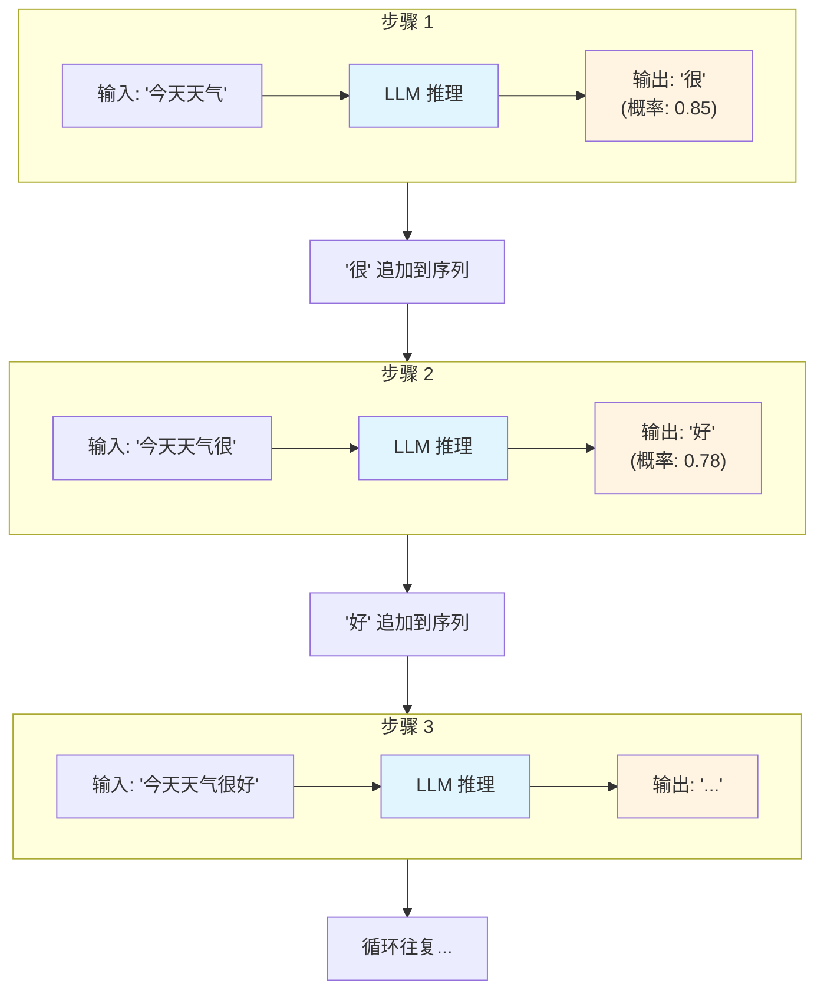

> **碎碎念**：本文内容为作者个人理解和观点，如有理解偏差或表述不当之处，欢迎批评指正。

## 引言

大语言模型（Large Language Models, LLMs）在近年来取得了显著的发展，但要充分理解和使用这些模型，我们需要认识到它们的本质特性和固有局限。

## 大语言模型的序列模型特性

### 什么是序列模型

大语言模型本质上是一种**自回归语言模型**（Autoregressive Language Model）。这意味着：

1. **输入处理方式**：模型接收一个 token 序列作为输入，通过注意力机制理解输入内容的语义和上下文关系
2. **输出生成方式**：模型逐个生成输出 token，每次输出词汇表上的概率分布，再通过采样策略（如 Top-p、Top-k、Temperature 等）选取下一个 token。每个新生成的 token 只能依赖于之前已生成的内容，不能"看到"未来的内容
3. **上下文依赖**：模型的预测依赖于之前出现的所有 token，具有强烈的位置和顺序敏感性

### 序列模型的影响

这种序列特性带来了几个重要的影响：

- **自回归生成**：模型在生成阶段逐个 token 地预测输出，每次只能基于已生成的内容继续生成，无法回溯修改之前的输出
- **上下文窗口限制**：由于计算复杂度，模型只能处理有限长度的序列（如 4K、8K 或 128K tokens）
- **推理成本**：生成长文本需要逐 token 进行前向传播，前向传播次数随输出长度线性增长，同时每步的注意力计算量随已生成序列长度递增

**关键点**：这是一个**自回归（Autoregressive）**的过程——模型每次生成的 token 会被追加到输入序列中，作为下一步推理的上下文，通过逐个 token 的预测来生成完整的输出内容。

## 缺少在线学习能力

### 静态知识的局限

大语言模型在训练完成后，其知识是**固定的、静态的**：

1. **知识截止日期**：模型只包含训练数据截止日期之前的信息
2. **无法自主更新**：模型在推理时不会学习或记住新信息
3. **缺乏个性化**：无法针对特定用户或场景自动调整和优化

### 为什么缺少在线学习

这种限制源于当前的模型架构和训练范式：

- **参数静态**：推理时模型参数保持不变，不会根据新输入进行更新
- **跨对话无状态**：不同对话之间是独立的（除非通过外部系统维护上下文）
- **训练成本高**：重新训练或微调大语言模型需要巨大的计算资源

### 局限性与解决方案

缺少在线学习带来的主要挑战包括：**知识过时**、**无法个性化**、**不记住历史**、**无法实时学习**。

尽管存在这些局限，业界已经发展出两类解决方案：

**工具链层面**（不修改模型参数）：

- **RAG（检索增强生成）**：借助向量数据库将外部知识转化为嵌入向量进行语义检索，为模型补充实时信息，解决知识过时问题
- **外部记忆**：通过向量数据库等技术持久化对话历史和用户偏好，弥补模型跨会话无状态的限制
- **上下文管理**：合理组织和管理输入上下文，在有限的上下文窗口内提供最相关信息
- **提示工程**：通过精心设计的提示词，实现个性化和可控生成
- **Function Calling**：让模型调用外部 API，执行计算、查询、操作等实时任务

**模型训练层面**（修改模型参数）：

- **微调（Fine-tuning）**：在特定领域数据上继续训练，提升专业领域表现
- **RLHF（人类反馈强化学习）**：在监督微调（SFT）之后，通过人类偏好数据训练奖励模型，再用强化学习算法（如 PPO）优化模型的对齐性和输出质量
- **持续预训练**：定期在新数据上继续预训练，更新模型知识库（成本高昂）

## 总结

理解大语言模型（LLM）的这两个核心特性——**序列模型本质**和**缺少在线学习**——对于正确使用和部署 LLM 应用至关重要。我们需要在应用设计时考虑这些局限，通过合适的架构设计（如上下文管理、外部工具调用等）来弥补这些不足。
