> **核心理念**：在大规模分布式系统的每个服务中嵌入 Claude Code Agent，为其提供**服务的完整源码**、**必要的上下文信息**和**隔离的可执行环境**。当系统出现问题或需要优化时，AI 能够快速定位问题、分析根因、提出方案，并在人工审批后执行修复。

## 引言

现代大规模系统的运维面临着前所未有的挑战：

- **复杂度爆炸**：微服务架构下，一个系统可能包含数百个服务
- **信息割裂**：代码、日志、监控指标分散在不同系统中
- **响应滞后**：人工排查问题需要耗费大量时间理解上下文
- **知识依赖**：关键服务往往只有少数人深度理解

而 Claude Code 已经在代码理解和问题解决上展现出**卓越的能力**。它缺少的，是**具体服务的源代码**、**业务上下文**和**隔离的可执行环境**。

如果我们能在每个服务上都部署一个拥有完整源码、上下文和隔离的可执行环境的 Claude Code Agent，会发生什么？

## 一、传统运维的困境

### 1.1 问题定位的时间成本

当生产环境出现故障时，典型的处理流程：

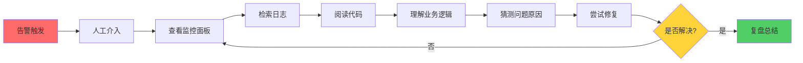

**核心痛点**：
- 从"查看监控面板"到"理解业务逻辑"这一系列步骤可能耗费 30-120 分钟（取决于工程师对服务的熟悉度）
- 关键服务负责人不在时，排查效率显著降低
- 跨服务问题需要协调多个团队，沟通成本高


### 1.2 知识孤岛效应

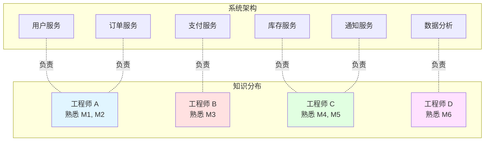

**问题**：
- 跨服务问题需要多人协作，沟通成本高
- 人员流动导致知识流失
- 深夜故障可能找不到熟悉服务的人


## 二、Claude Code 的能力边界

### 2.1 Claude Code 的代码能力

Claude Code 在代码相关任务上的表现：

| 能力维度     | 表现                         | 示例                     |
| ------------ | ---------------------------- | ------------------------ |
| **代码理解** | 可以快速理解数万行代码的逻辑 | 分析复杂的业务流程       |
| **问题诊断** | 根据错误信息定位根因         | 从堆栈追踪找到真正的 bug |
| **方案设计** | 提出多种解决方案并权衡       | 性能优化、架构重构       |
| **代码生成** | 编写高质量、可维护的代码     | 实现新功能、修复 bug     |
| **文档生成** | 自动生成技术文档             | API 文档、架构说明       |


### 2.2 当前的关键缺失

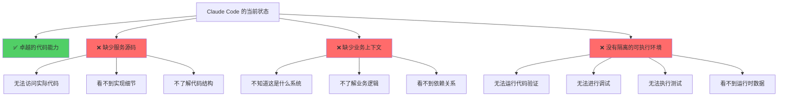

**结论**：为 Claude Code 提供**服务的完整源码**、**必要的上下文信息**和**隔离的可执行环境**，是实现智能运维的关键。

## 三、架构设计：Claude Code Agent 智能运维系统

### 3.1 核心理念

**为每个服务配备一个"驻场 AI 工程师"**：

- 拥有该服务的**完整源代码**（能看到所有实现细节）
- 理解**业务上下文**（系统架构、依赖关系、业务逻辑）
- 具备**隔离的可执行环境**（可运行、调试、测试代码）
- 实时接收**运行时数据**（日志、指标、追踪、告警）

### 3.2 整体架构

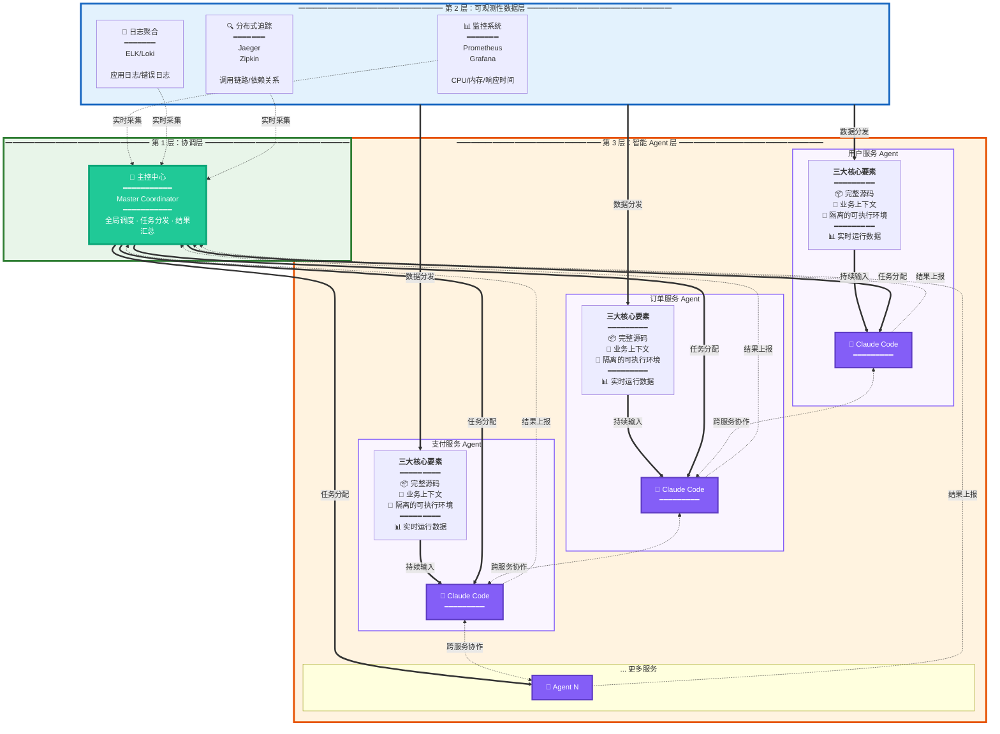

### 3.3 单个服务的详细架构

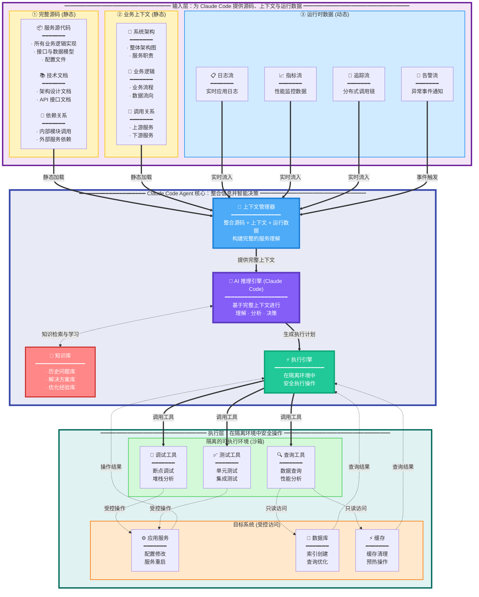

## 四、工作流程：从问题到解决

### 4.1 智能辅助故障处理流程

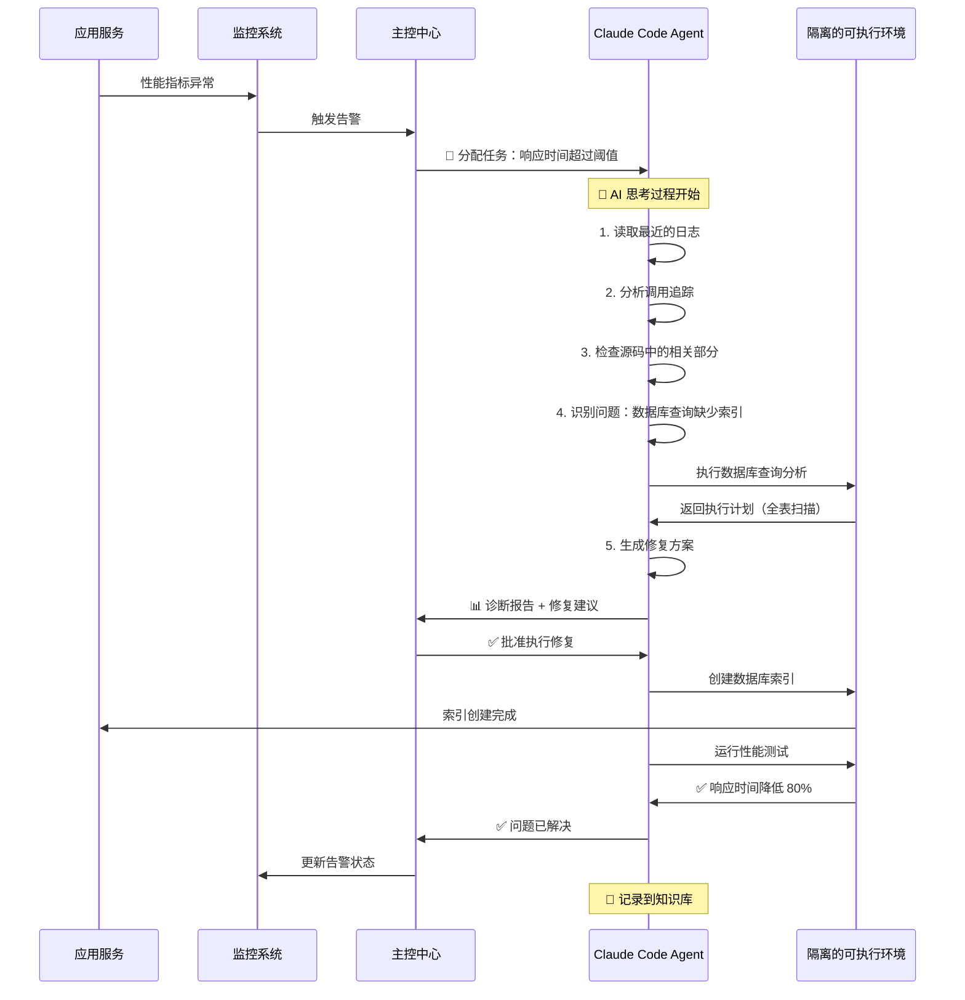

### 4.2 性能优化场景

```mermaid
graph TB
    START[收到优化请求] --> A1[采集性能基线]
    A1 --> A2[分析性能瓶颈]
    
    A2 --> B1[🔍 代码层面]
    A2 --> B2[🔍 数据库层面]
    A2 --> B3[🔍 架构层面]
    
    B1 --> C1[识别低效算法<br/>O&#40;n²&#41; → O&#40;n log n&#41;]
    B1 --> C2[发现重复计算<br/>添加缓存]
    B1 --> C3[检测内存泄漏<br/>修复资源管理]
    
    B2 --> D1[慢查询优化<br/>添加索引]
    B2 --> D2[连接池调优<br/>调整参数]
    B2 --> D3[查询优化<br/>减少 N+1 问题]
    
    B3 --> E1[服务拆分建议]
    B3 --> E2[缓存策略优化]
    B3 --> E3[异步化改造]
    
    C1 --> F[生成优化代码]
    C2 --> F
    C3 --> F
    D1 --> F
    D2 --> F
    D3 --> F
    E1 --> G[架构方案文档]
    E2 --> G
    E3 --> G
    
    F --> H[在隔离环境中测试验证]
    H --> I{性能提升?}
    I -->|是| J[提交代码审查]
    I -->|否| A2
    
    G --> K[人工评审决策]
    
    J --> L[部署上线]
    K --> L
    L --> M[持续监控效果]
    
    style START fill:#4dabf7
    style L fill:#51cf66
    style M fill:#51cf66
```

### 4.3 跨服务问题协作

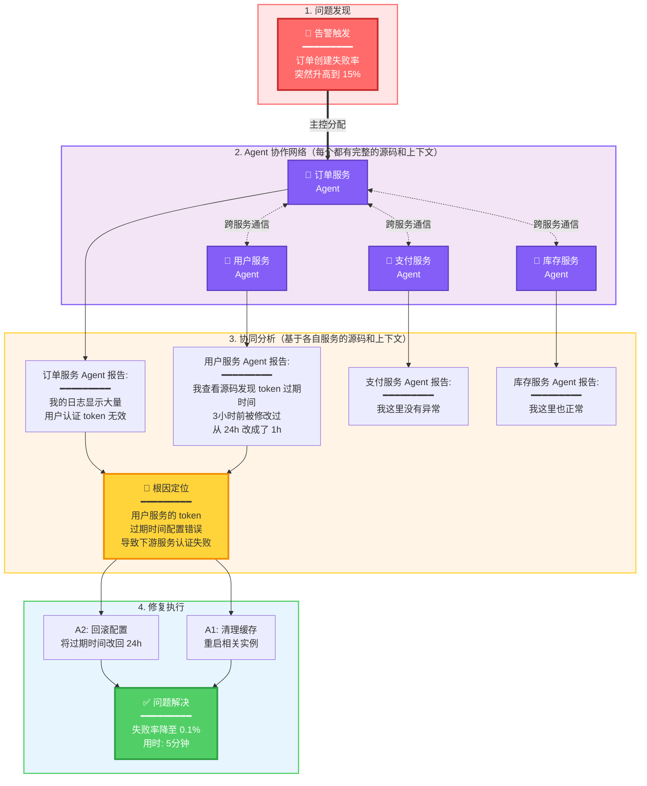

## 五、关键技术实现

### 5.1 上下文管理策略

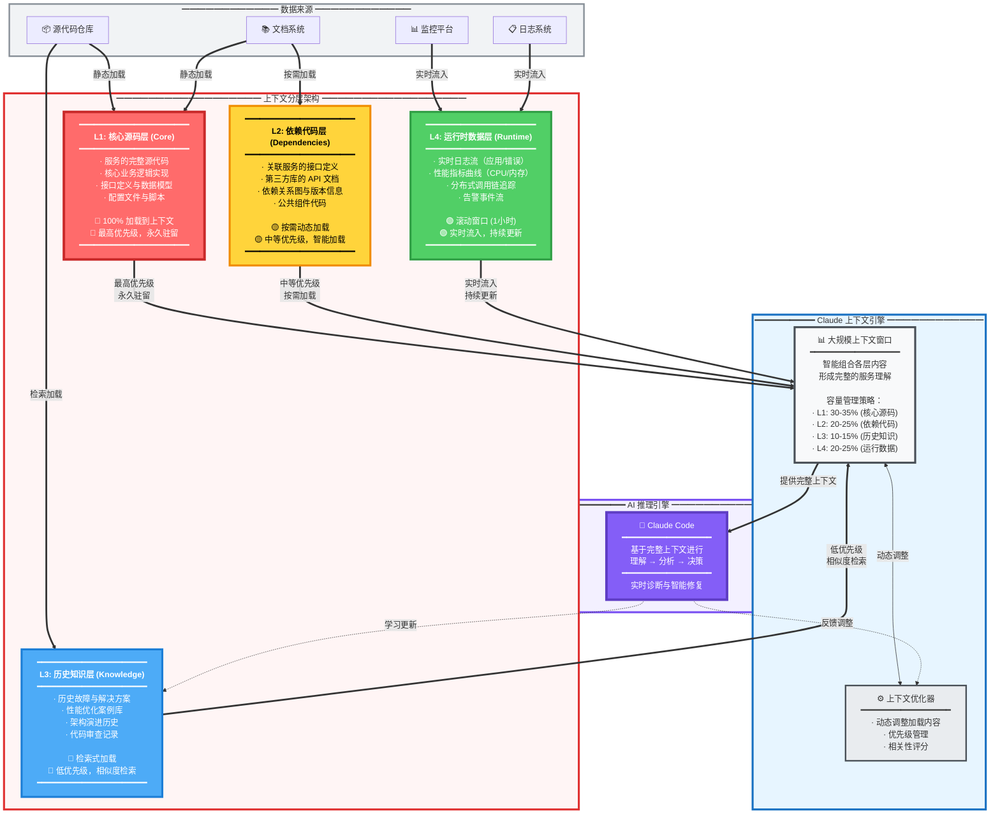

### 5.2 实时数据接入

每个 Agent 实时接收运行时信息：

1. **日志流**：通过 Fluentd/Filebeat 推送
2. **指标流**：从 Prometheus 拉取关键指标
3. **追踪流**：Jaeger Span 数据
4. **代码变更**：Git Webhook 触发更新

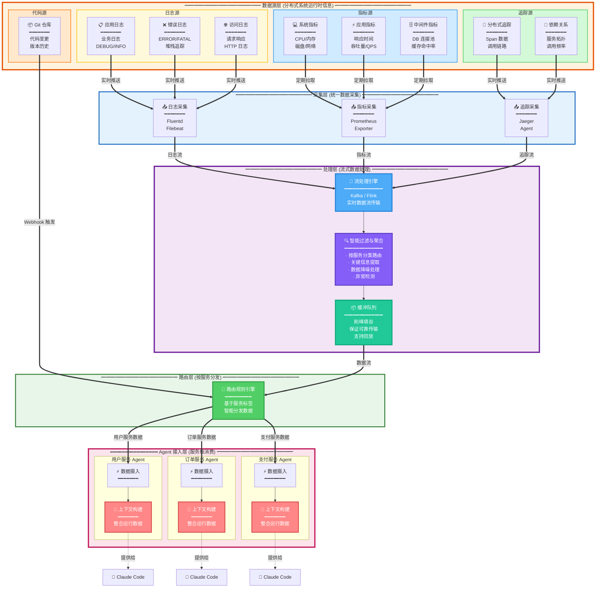

### 5.3 权限控制与审批机制

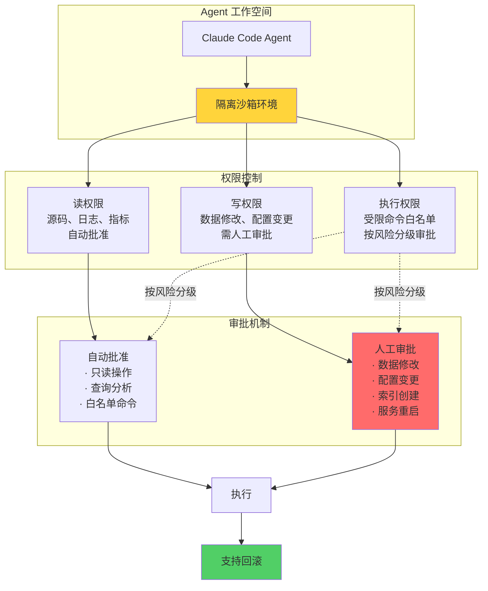

## 六、价值与效果

### 6.1 预期效果

| 场景         | 传统方式          | Claude Code Agent 辅助 | 改善方向     |
| ------------ | ----------------- | ---------------------- | ------------ |
| **故障诊断** | 30-120 分钟       | 5-15 分钟              | **显著缩短** |
| **性能优化** | 数天（分析+实现） | 数小时                 | **大幅提速** |
| **代码审查** | 1-2 小时          | 10-30 分钟             | **效率提升** |
| **问题分析** | 依赖人工经验      | AI 辅助分析            | **质量提升** |
| **知识积累** | 依赖人工交接      | 自动记录沉淀           | **持续改进** |

### 6.2 系统能力演进

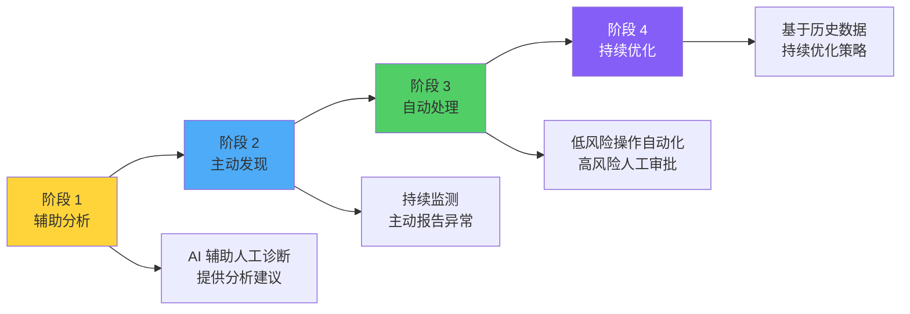

### 6.3 真实场景示例

#### 场景 1：内存泄漏辅助修复

```
📊 监控发现：订单服务内存使用率持续上升
🤖 Agent 分析：
   - 检查最近代码变更（发现 3 天前的一次更新）
   - 分析内存堆栈（发现大量未释放的 HTTP 连接）
   - 在源码中定位问题：第 245 行缺少 connection.close()
🔧 Agent 操作：
   - 生成修复代码
   - 在隔离环境中测试验证（内存稳定）
   - 提交 PR 并通知团队审查
   - 人工审批通过后部署上线
✅ 结果：问题从发现到提出方案，用时不到 30 分钟
```

#### 场景 2：数据库慢查询优化

```
🚨 告警：支付服务响应时间 P99 超过 2 秒
🤖 Agent 分析：
   - 采集慢查询日志
   - 在隔离环境中分析执行计划（全表扫描 100 万行）
   - 对比源码识别缺失索引：user_id + created_at 组合索引
   - 评估影响：索引大小约 50MB，创建时间约 5-10 秒
🔧 Agent 操作：
   - 在只读副本上测试索引效果
   - 验证查询性能（2000ms → 50ms）
   - 生成索引创建方案和回滚计划
   - 提交审批，人工确认后在生产环境执行
✅ 结果：从发现问题到提出优化方案，用时不到 1 小时
```

## 七、实施路径

### 7.1 分阶段部署

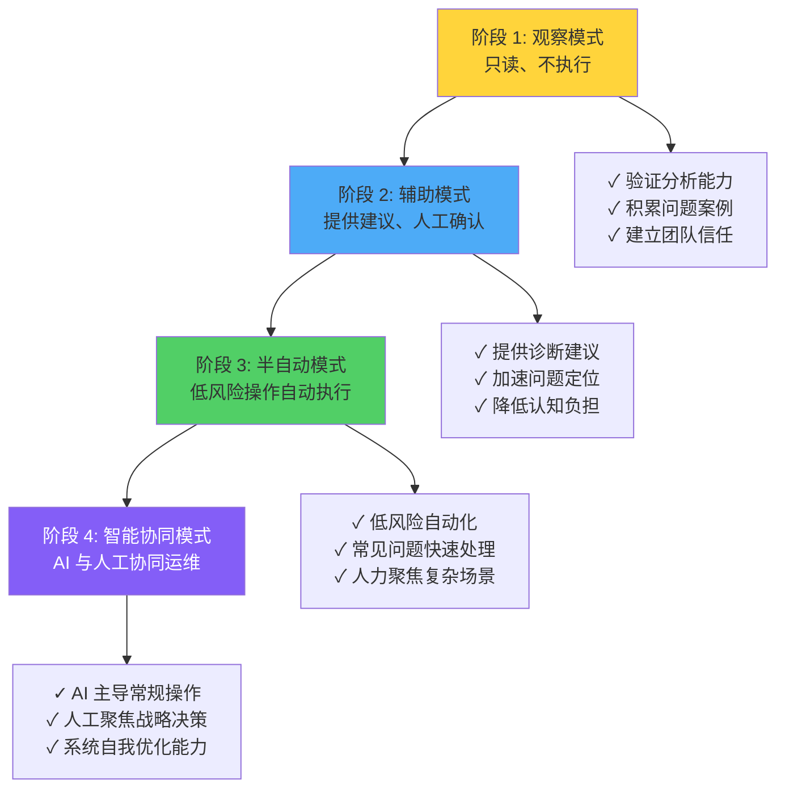

### 7.2 技术栈选型

| 组件         | 推荐方案               | 备选               |
| ------------ | ---------------------- | ------------------ |
| **AI 引擎**  | Claude API (Anthropic) | GPT-4, Gemini      |
| **容器编排** | Kubernetes             | Docker Swarm       |
| **监控**     | Prometheus + Grafana   | Datadog, New Relic |
| **日志**     | ELK Stack / Loki       | Splunk, Sumo Logic |
| **追踪**     | Jaeger                 | Zipkin, SkyWalking |
| **流处理**   | Kafka + Flink          | Pulsar, Spark Streaming |
| **代码管理** | GitLab                 | GitHub Enterprise  |

## 八、展望未来

### 8.1 从"AI 辅助运维"到"智能化运维系统"

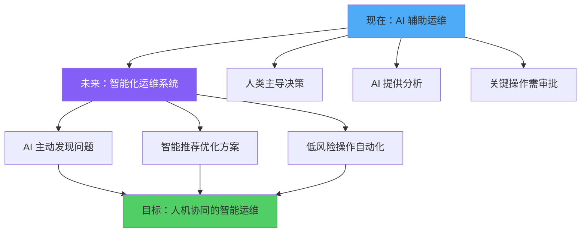

### 8.2 未来的进化方向

1. **跨系统知识共享**：不同系统的 Agent 在保护隐私前提下共享问题模式
2. **自主架构演进**：AI 基于运行数据提出并验证架构优化方案
3. **预测性运维**：基于历史数据预测可能的故障并提前处理
4. **性能持续优化**：基于实际流量特征动态调整算法和资源配置

## 结语

Claude Code 在代码理解和问题分析方面展现出卓越的能力。将这种能力嵌入到大规模系统的每个服务中，为其提供**完整的源码**、**必要的上下文**和**隔离的可执行环境**，我们就能构建一个**智能化的运维辅助系统**。

这个方案基于当前成熟的技术：

- ✅ **Claude Code 的能力**已经在实际开发中得到验证
- ✅ **容器化和微服务架构**提供了天然的模块化基础
- ✅ **可观测性技术栈**（Prometheus、ELK、Jaeger）已经成熟
- ✅ **AI API 的成本**持续降低，使大规模应用成为可能

关键在于通过合理的**架构设计**和**权限控制**，让 AI 成为人类工程师的得力助手，在确保安全的前提下提升运维效率。

当每个服务都配备了 AI 辅助系统，配合人工审批机制，大规模系统的运维将更加高效和可靠。

---

**让 AI 成为系统的一部分，而不仅仅是工具。**
