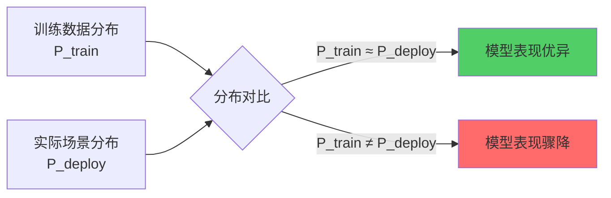

> **核心观点**：设计 LLM 应用时，最关键的决策不是"选哪个模型"，而是**判断你的场景是否落在模型的训练分布内**。将模型"放生"到与训练数据截然不同的环境，就像把淡水鱼放进海里——不是鱼的能力不够，而是水的成分不对。

## 放生的隐喻

放生动物有一条铁律：**必须放归原生栖息地**。

大模型也是如此。

每个模型都有自己的"原生栖息地"——它的训练数据分布。这个分布决定了模型见过什么、熟悉什么、擅长什么。将模型部署到与训练分布匹配的场景，它如鱼得水；部署到分布之外，它寸步难行。

## 分布偏移：模型的"水土不服"

机器学习中有个经典问题叫**分布偏移（Distribution Shift）**：



当 P_train ≈ P_deploy 时，模型泛化良好；当两者偏离，模型的表现会急剧下降——**不是因为模型"不够聪明"，而是它从未见过这类数据**。

这就像让一个只读过英文文献的学者去翻译文言文。他可能是语言天才，但在训练分布之外，天才也无能为力。

## 实际案例

### 代码生成：主流 vs 小众

| 场景            | 训练数据量 | 模型表现 |
| --------------- | ---------- | -------- |
| Python + React  | 海量       | 优秀     |
| Go + Gin        | 丰富       | 良好     |
| Rust + 自研框架 | 稀少       | 一般     |
| 内部 DSL        | 几乎没有   | 很差     |

同一个模型，在 Python 上写出教科书级代码，在内部 DSL 上却连语法都搞不清。

**关键洞察**：模型的"能力边界"本质上是"训练数据的边界"。

### 语言与领域

- **英文技术文档** → 模型的主场，表现稳定
- **中文法律合同** → 训练数据较少，需要更多引导
- **方言口语转写** → 几乎是盲区

## 如何"正确放生"

### 1. 先评估匹配度

在投入开发前，先问自己：

- 我的场景在训练数据中有多少覆盖？
- 主流还是小众？通用还是专有？
- 模型"见过"类似的任务吗？

### 2. 用 Prompt 构造熟悉语境

如果场景偏离主流，可以通过 prompt 把问题"翻译"成模型熟悉的形式：

```
❌ 直接问：请分析这段 COBOL 代码的逻辑
✅ 桥接后：这段代码的逻辑类似于以下 Python 伪代码...请分析其中的业务流程
```

### 3. Few-shot 示例模拟训练环境

提供几个高质量示例，让模型在上下文中"学会"任务模式：

```
示例 1：输入 X1 → 输出 Y1
示例 2：输入 X2 → 输出 Y2
现在请处理：输入 X3 → ?
```

这能有效帮助模型适应陌生场景。

### 4. 必要时进行微调

当场景高度专有且使用频繁，fine-tuning 是最彻底的方案——**让模型真正"见过"你的数据**。但需要注意：微调需要足够量的高质量专有数据，数据不足时反而可能导致性能下降（尤其是超大模型）。

## 放生指南

| 原则                   | 说明                               |
| ---------------------- | ---------------------------------- |
| **先问分布，再问能力** | 模型能力再强，分布外也难发挥       |
| **主流场景优先**       | 尽量让任务落在训练数据的高密度区   |
| **桥接而非硬上**       | 用 prompt 把陌生问题翻译成熟悉形式 |
| **示例胜过描述**       | Few-shot 是最直接的分布对齐手段    |

## 结语

大模型不是万能的。它的能力有明确的边界——**训练数据的边界**。

设计 LLM 应用的第一步，不是问"模型够不够强"，而是问"这个场景，模型见过吗"。

尊重模型的生态位，把它放生到正确的栖息地，才能让它真正发挥价值。
