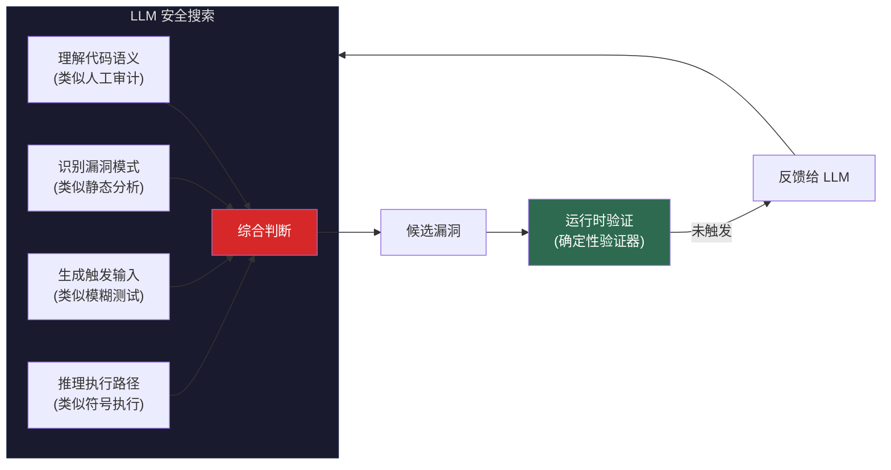
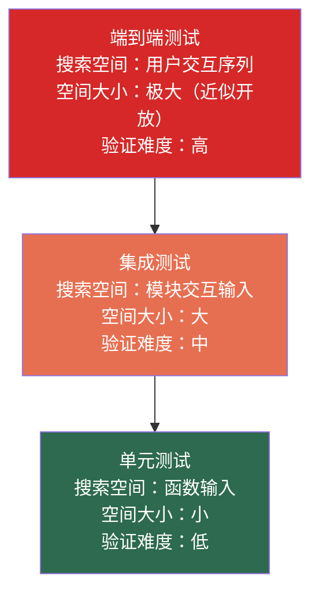

> **核心观点**：安全审计和软件测试是两个典型的**有限空间搜索问题**——搜索空间由程序的输入接口和执行路径定义，天然有限且结构化；验证器就是程序运行时本身，成本极低且确定性强。这两个条件使得安全审计和软件测试成为 LLM 搜索效率优势最容易兑现的工程领域，也是这两个工种中"执行层"工作最先被替代的根本原因。

## 一、为什么安全和测试是有限空间问题

### 1.1 程序定义了搜索空间的边界

安全审计和软件测试看似是两个不同的工种，但从搜索空间结构看，它们做的是同一件事：

> **在程序的输入空间中，搜索能触发特定行为的输入。**

区别只在于"特定行为"的定义不同：

| | 安全漏洞检测 | 软件测试 |
|--|------------|---------|
| 搜索空间 | 程序的所有合法输入 | 程序的所有合法输入 |
| 搜索目标 | 输入使程序进入不安全状态（溢出、越权、泄露） | 输入使程序输出与预期不符 |
| 验证方式 | 运行程序，观察是否崩溃/越权 | 运行程序，比较实际输出与预期输出 |
| 验证成本 | 低（毫秒到秒级） | 低（毫秒级） |

关键在于：这两个工种的搜索空间都**由程序本身定义**。一个程序的输入接口是有限的（HTTP 请求的字段、函数的参数列表、命令行的选项），执行路径虽然多但有上界。这与自然科学中"理解宇宙"或艺术中"创造作品"有本质区别——后者的搜索空间边界不清，前者的搜索空间边界写在代码里。

### 1.2 程序运行时 = 天然验证器

有限空间只是第一个条件。第二个条件同样重要：**验证成本极低**。

安全审计中，构造一个输入、运行程序、看是否崩溃/越权——这就是验证。软件测试中，运行测试用例、比较实际输出与预期输出——这也是验证。两者的验证器都是**程序运行时本身**，确定性强，成本在毫秒到秒级。

LLM 有一个已知弱点——**自身不擅长验证**，生成的答案无法自己判断对错。但安全和测试恰好不需要 LLM 自己验证：跑一下就知道了。LLM 只管搜索（生成候选输入），验证外包给运行时。

这两个条件——**空间有限 + 验证廉价**——使得安全审计和软件测试成为 LLM 搜索效率优势最容易变现的工程领域。

### 1.3 LLM 的搜索启发式从哪来

> 关于 LLM 搜索 vs 人类搜索的通用分析框架（工作记忆瓶颈、搜索宽度差异、模式库规模量化），参见本系列的姐妹篇[《数学与物理中的有限空间搜索》](/posts/llm-bounded-search-math-physics/)第 1.3 节。此处聚焦于安全和测试领域的特有优势来源。

LLM 在这两个领域的搜索效率来自训练数据中积累的**领域特有启发式知识**：

- **漏洞模式库**：数十万个 CVE 报告中的漏洞触发条件、攻击向量和修复方式
- **测试模式库**：数百万个开源项目中的测试代码，涵盖边界值选择、分支覆盖策略、mock 设计等
- **方法论知识**：大量安全研究论文和测试方法论（OWASP、STRIDE、等价类划分等）

这些构成了一个规模远超任何个人经验的模式库。一个安全研究员一生可能审计过几百个项目，一个测试工程师一生可能写过几万个测试用例——而 LLM 的训练数据覆盖了数百万个项目和数十亿行测试代码。这种量级差异使得 LLM 在模式匹配型搜索上拥有结构性优势。

---

## 二、安全审计：程序状态空间中的搜索

### 2.1 漏洞发现 = 程序状态空间搜索

软件安全领域有一个经典范式：**漏洞是程序在特定输入下到达了开发者未预期的状态**。更形式化地说：

$$
\text{漏洞} = \exists\ input \in \mathcal{I} : \text{程序}(input) \in \mathcal{S}_{unsafe}
$$

其中 $\mathcal{I}$ 是所有合法输入的集合，$\mathcal{S}_{unsafe}$ 是所有不安全状态的集合（如缓冲区溢出、权限提升、信息泄露等）。

对于一个给定程序，其输入空间 $\mathcal{I}$ 虽然可能很大，但**结构化且有限**（由程序的输入接口定义），不安全状态集合 $\mathcal{S}_{unsafe}$ 也可以通过安全规范明确定义。

### 2.2 传统安全工具的搜索策略

| 方法 | 搜索策略 | 优势 | 瓶颈 |
|------|---------|------|------|
| **模糊测试（Fuzzing）** | 随机/变异生成输入 | 不需要理解程序语义 | 难以穿越复杂条件分支 |
| **符号执行** | 系统性地枚举执行路径 | 路径覆盖有理论保证 | 路径爆炸（指数增长） |
| **静态分析** | 抽象解释程序语义 | 不需要运行程序 | 误报率高，精度有限 |
| **人工审计** | 专家基于经验的启发式搜索 | 理解业务语义 | 速度慢，依赖个人经验 |

每种方法都是在同一个搜索空间上的不同搜索策略，各有长短。

### 2.3 LLM 作为"全科医生"

传统工具是"专科医生"——fuzzer 只懂变异，符号执行只懂路径约束。LLM 的突破性在于**在同一个模型中融合了多种策略的优势面**：



具体而言：

**1. 跨模式知识融合**

LLM 读过数十万个 CVE 报告、数百万行开源代码以及大量安全研究论文。当它审查一段 C 代码时，它能同时联想到：
- 这种模式在 CVE-2024-XXXX 中导致了缓冲区溢出
- 类似的代码在 Linux 内核中曾被这样修复
- 这个函数的输入如果满足某个条件就会绕过检查

**2. 语义理解带来的剪枝**

Fuzzer 不理解代码语义，所以大量时间浪费在"不可能触发漏洞"的输入上。LLM 理解代码的**意图**，能直接定位到高风险区域：

- 看到 `memcpy(dst, src, user_controlled_len)` → 立即怀疑缓冲区溢出
- 看到 `SQL = "SELECT * FROM users WHERE id = " + input` → 立即识别 SQL 注入
- 看到 `if (token == admin_token)` 使用了 `==` 而非时间恒定比较 → 识别时序攻击

**3. 验证成本极低**

安全漏洞的验证非常明确：构造一个输入，运行程序，观察是否触发了异常行为（崩溃、越权、数据泄露）。这是一个**确定性的、低成本的验证过程**，完美适配 LLM 的"生成-验证"循环。

### 2.4 替代的现实进展

这不是纯理论推测。2024-2025 年已出现大量实证：

- Google Project Zero 先于 2024 年 6 月推出 **Naptime** 框架，将 LLM 整合进漏洞研究工作流，在 Meta CyberSecEval2 基准上大幅提升了漏洞检测得分。该项目随后演化为 **Big Sleep**（Project Zero + DeepMind 合作），于 2024 年 10 月发现了 SQLite `seriesBestIndex` 函数中一个此前未被发现的栈缓冲区下溢漏洞，且该漏洞经 150 CPU 小时的模糊测试也未被触发
- UIUC 研究团队（Fang et al., 2024）在针对 15 个已知 1-day 漏洞的测试中发现，GPT-4 作为配备终端和代码执行工具的 Agent，在给定 CVE 描述后能**自主**为其中 87%（13/15）生成有效 exploit。但移除 CVE 描述后成功率骤降至 7%，说明 LLM 当前更擅长**利用已知漏洞信息构造攻击**，而非从零独立发现未知漏洞

对安全从业者而言，传统的"模式匹配型"安全审计（代码审查中发现已知类型的漏洞）正在被快速替代。留给人类的是：

- 发现**全新类别**的漏洞（0-day 中的 0-class）
- 理解**业务语义**下的安全风险（这个接口在这个业务场景中不应该暴露）
- 设计**安全架构**（防御不是搜索问题，而是设计问题）

---

## 三、软件测试：在输入空间中的覆盖搜索

### 3.1 测试本质上是什么？

Dijkstra 的名言——"测试只能证明存在缺陷，不能证明不存在缺陷"——揭示了测试的本质：

$$
\text{测试} = \text{在输入空间 } \mathcal{I} \text{ 中搜索满足 } P(input) \neq P_{\text{expected}}(input) \text{ 的 } input
$$

这是一个纯粹的有限空间搜索问题：

- 输入空间 $\mathcal{I}$ 由程序接口定义，结构有限
- 验证器就是**程序本身**——运行测试用例，比较实际输出与预期输出
- 验证成本通常在毫秒级

### 3.2 测试金字塔与搜索空间的层次



越靠近金字塔底部，搜索空间越有限、验证越容易——越适合 LLM 替代。越靠近顶部，问题越趋向开放空间搜索，"有限空间"假设越弱，这也是 LLM 替代程度随层次上升而下降的结构性原因。

### 3.3 LLM 在测试中的具体优势

**单元测试生成**——最成熟的替代场景：

给定一个函数签名和实现，生成能达到高覆盖率的测试用例。这是一个经典的有限空间搜索：

- **搜索空间**：函数参数的所有合法取值组合
- **搜索目标**：覆盖所有代码分支
- **验证器**：编译器 + 测试运行器 + 覆盖率工具

LLM 在此场景下的效率远超人类，因为：

1. **边界值直觉**：LLM 读过数百万个测试用例，"知道"对于整数参数应该测试 `0, -1, MAX_INT, MIN_INT`，对于字符串应该测试空串、超长串、特殊字符等
2. **路径感知**：LLM 能读懂代码中的 `if-else` 分支，直接构造能触发每个分支的输入
3. **即时反馈**：运行测试并获取覆盖率报告后，LLM 能精确地补充缺失分支的测试用例

**属性测试（Property-based Testing）生成**：

比具体测试用例更高级的是**属性测试**——生成一个描述"对于所有输入都应满足的性质"的测试函数。例如：

```python
# 人类写的测试
def test_sort_specific():
    assert sort([3, 1, 2]) == [1, 2, 3]

# LLM 生成的属性测试
from collections import Counter

@given(st.lists(st.integers()))
def test_sort_properties(lst):
    result = sort(lst)
    assert len(result) == len(lst)            # 长度不变
    assert all(result[i] <= result[i+1]       # 有序
               for i in range(len(result)-1))
    assert Counter(result) == Counter(lst)    # 元素不变（含重复计数）
```

属性测试在更高的抽象层次上搜索——不再是搜索具体输入，而是搜索**输入-输出关系的不变量**。LLM 在这里的优势在于，它从训练数据中学到了大量函数的"规范行为模式"，能快速生成这些不变量。

**变异测试（Mutation Testing）**：

变异测试的核心思想是：**如果测试套件足够好，那么对源代码的任何微小修改都应该导致至少一个测试失败**。这可以形式化为：

$$
\text{变异得分} = \frac{\lvert\{m \in \mathcal{M} : \exists t \in \mathcal{T}, t \text{ fails on } m\}\rvert}{\lvert\mathcal{M}\rvert}
$$

其中 $\mathcal{M}$ 是所有变异体（源代码的微小修改），$\mathcal{T}$ 是测试套件。实践中 $\mathcal{M}$ 的规模可能极大（每个条件、运算符、常量都可以变异），通常需要采样策略来控制计算成本。

LLM 在这里的优势恰恰在于**用语义理解替代穷举采样**——它可以同时扮演"变异生成器"和"测试补充器"：

1. 读懂代码，生成**有意义的**变异（而非随机变异）
2. 对于未被杀死的变异体，生成能检测到该变异的测试用例
3. 形成"变异-测试"的对抗性搜索循环

### 3.4 替代的程度

| 测试层次 | 替代程度 | 原因 |
|---------|---------|------|
| 单元测试 | **高（80-90%）** | 空间最小，验证最容易 |
| 集成测试 | **中（50-70%）** | 需要理解模块交互语义 |
| 端到端测试 | **低（20-40%）** | 需要理解用户意图和业务场景 |
| 探索性测试 | **极低（<20%）** | 本质上是开放空间探索 |

---

## 四、同构性与替代模式

回顾第二、三节的分析，安全审计与软件测试虽然日常工作差异显著——一个找漏洞，一个写测试——但它们在搜索结构上完全同构：共享同一个搜索空间（程序输入）、同一类验证器（程序运行时）、同一种 LLM 搜索优势（从海量代码和报告中学到的模式匹配能力）。区别仅在于搜索目标——一个找安全违规，一个找功能错误。

这个同构性直接解释了两者的替代模式也相同：**模式匹配型的执行工作被接管，需要定义"什么算安全"或"什么算质量"的判断工作留给人类**。下面通过横向对比进一步验证这个结论。

---

## 五、横向对比

| 维度 | 安全漏洞检测 | 软件测试（单元测试） |
|------|------------|-------------------|
| 搜索空间 | 中（需覆盖程序级输入空间及状态交互组合） | 小（仅覆盖单个函数的参数空间） |
| 验证器 | 确定性（运行时崩溃/越权检测） | 确定性（编译 + 运行 + 覆盖率） |
| LLM 的搜索优势 | 融合四种传统策略 + CVE 知识库 | 边界值直觉 + 路径感知 + 即时反馈 |
| 当前进展 | Big Sleep 发现真实 0-day | 已进入工程实用阶段 |
| 可替代部分 | 已知模式的漏洞检测 | 单元测试、回归测试生成 |
| 不可替代部分 | 新攻击类别发现、安全架构设计 | 质量策略定义、探索性测试 |
| 训练数据 | 丰富（CVE + 开源代码） | 极丰富（GitHub 数十亿行测试代码） |

回到第一节的判断框架：空间有限性和验证成本决定了 LLM 的替代程度。这两个工种在这两个维度上都处于有利位置——搜索空间由程序接口定义（有限），验证器就是程序运行时（廉价）。这是它们比其他软件工程工作（如需求分析、架构设计）更早被替代的结构性原因。

从业者的转变方向：

| 角色 | 正在被替代的工作 | 转向的工作 |
|------|----------------|-----------|
| **安全研究员** | 代码审计中发现已知模式的漏洞 | 发现新攻击面（0-day 中的 0-class）、设计安全架构 |
| **测试工程师** | 手写单元测试和回归测试 | 定义质量策略、搭建测试基础设施、设计 LLM 驱动的测试流水线 |
