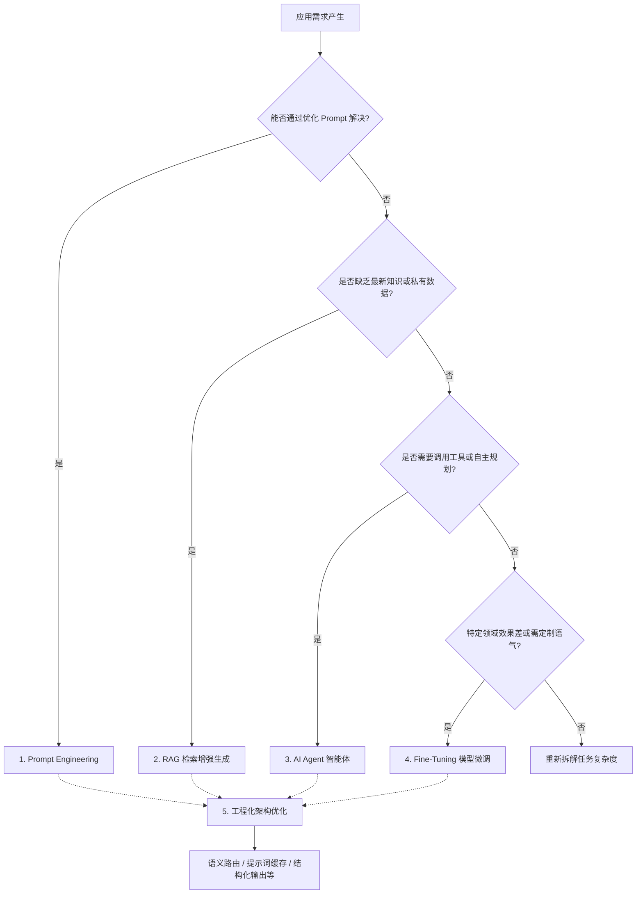

> **核心导读**：挖掘大模型（LLM）的能力是一个从“会用”到“用好”，再到“深度定制”的系统性工程。要充分发挥大模型的潜力，通常可以从提示词工程、检索增强生成（RAG）、构建智能体（AI Agents）、模型微调（Fine-Tuning）到工程化架构优化这五个维度递进式地进行探索和挖掘。

## 1. 提示词工程（Prompt Engineering）：最基础也最立竿见影

这是挖掘大模型能力的第一步，通过优化输入来引导模型输出更高质量的结果。

- **基础技巧**：设定清晰的角色（Role）、明确的任务目标（Task）、提供充分的上下文（Context）、规定输出格式（Format）。
- **少样本提示（Few-Shot Prompting）**：给模型提供几个优秀的输入输出示例，大模型的上下文学习能力会迅速“模仿”这种模式。
- **思维链（Chain of Thought, CoT）**：在提示词中加入“请一步步思考（Let's think step by step）”或具体规定推理步骤，强迫模型把复杂的推理过程拆解，显著降低逻辑错误和幻觉。

  ```text
  【Zero-shot CoT 示例】
  输入：一个农场有15头牛和10只鸡，今天卖出3头牛并买入5只鸭，现在农场共有多少只脚？请一步步思考（Let's think step by step）。

  输出：
  1. 初始：15头牛（15×4=60只脚），10只鸡（10×2=20只脚）。
  2. 卖出3头牛：剩下12头牛（12×4=48只脚）。
  3. 买入5只鸭：新增5只鸭（5×2=10只脚）。
  4. 鸡的数量不变：10只鸡（20只脚）。
  5. 总脚数计算：48 + 20 + 10 = 78只脚。
  ```
- **进阶思维框架**：如思维树（Tree of Thoughts, ToT）、反思机制（Reflection），让模型在给出最终答案前，先生成多个草稿并自我评估纠错。

## 2. 检索增强生成（RAG）：打破知识边界与减少幻觉

大模型的知识停留在训练截止日期，且容易胡说八道。RAG（Retrieval-Augmented Generation）是目前企业级应用最核心的技术。

- **核心原理**：先在本地/企业私有知识库中检索与用户问题相关的文档，然后把“文档片段 + 用户问题”一起喂给大模型，让它基于提供的文档来回答。
- **关键优化点**：挖掘 RAG 的能力不仅在于大模型本身，更在于检索环节。例如文档切分策略（Chunking）、基于余弦相似度 $\text{sim}(q, d) = \frac{q \cdot d}{\|q\| \|d\|}$ 的向量检索与关键词混合检索机制（Hybrid Search）、以及重排（Rerank）机制。

## 3. 构建智能体（AI Agents）：从“动嘴”到“动手”

如果说大模型是大脑，Agent 就是给大脑装上了手脚。

- **工具调用（Function Calling / Tool Use）**：教大模型使用外部工具。比如让它能调用搜索引擎查最新天气，调用 Python 解释器运行代码，或者调用公司内部的 API 查数据库。
- **规划与执行（ReAct 框架）**：即 Reason + Act，让模型具备“思考 -> 行动 -> 观察结果 -> 再次思考”的循环能力，从而自主完成复杂的多步骤任务（如：分析竞品数据并自动生成带有图表的 PDF 报告）。

  ```text
  【ReAct 循环示例】
  Question: 北京今天的温差是多少？
  Thought 1: 我需要找到北京今天的天气，然后计算最高温和最低温的差值。
  Action 1: SearchWeather[北京]
  Observation 1: 今天北京多云，最高温15℃，最低温5℃。
  Thought 2: 最高温是15℃，最低温是5℃，温差为 15 - 5 = 10℃。
  Action 2: Finish[10℃]
  ```
- **多智能体协同（Multi-Agent）**：比如使用 AutoGen 等框架，设定一个“程序员” Agent 和一个“测试员” Agent，让它们相互对话、审阅代码，共同完成一个项目。

## 4. 模型微调（Fine-Tuning）：注入垂直领域基因

当提示词工程和 RAG 无法满足特定领域的专业性、语气风格，或者为了降低延迟和成本时，就需要引入微调。

- **监督微调（SFT）**：收集几千到几万条高质量的“问答对”，让模型学习特定场景的表达方式和专业术语（如医疗问诊、法律合同起草）。
- **高效微调（PEFT / LoRA）**：不需要重新训练整个几百亿参数的模型，只需训练极少量的附加参数。LoRA (Low-Rank Adaptation) 的核心思想是将权重更新矩阵分解为低秩矩阵的乘积，并引入一个缩放因子 $\frac{\alpha}{r}$：

  $$
  W = W_0 + \Delta W = W_0 + \frac{\alpha}{r} B A
  $$

  其中，预训练权重 $W_0 \in \mathbb{R}^{d \times k}$ 保持冻结，可训练参数为 $B \in \mathbb{R}^{d \times r}$ 和 $A \in \mathbb{R}^{r \times k}$，且秩 $r \ll \min(d, k)$。$\alpha$ 是一维常数。这种机制让单张消费级显卡（如 RTX 4090）就能跑起大模型，成本极低。
- **对齐训练（RLHF / DPO）**：让模型的价值观和输出倾向更符合人类期望（比如变得更安全、不具有攻击性）。其中 RLHF（基于人类反馈的强化学习）通过训练奖励模型并使用 PPO 算法优化策略；而 DPO（直接偏好优化）则从数学上绕过了复杂的强化学习阶段，直接将偏好损失函数等价转化为语言模型的交叉熵损失，训练更稳定高效。

## 5. 工程化架构优化：榨干最后一点性能

到了系统级应用阶段，性能和成本成为核心考量。

- **语义路由（Semantic Routing）**：不要所有问题都扔给最贵最慢的模型（如 GPT-4 / Claude 3.5 Sonnet）。简单的问候或基础任务路由给小模型（如 GPT-4o-mini / Llama 3 8B），复杂推理才交给大模型，兼顾能力与成本。
- **结构化输出约束**：在业务代码中，我们通常需要大模型返回严格的 JSON 格式。可以使用大模型原生支持的 JSON Mode，或者利用 Instructor、Outlines 等开源库强行约束其输出结构。
- **提示词缓存（Prompt Caching）**：很多最新的大模型支持上下文缓存，如果经常输入相同的大段背景设定或代码库，缓存机制可以大幅提高响应速度并降低成本。

## 总结与建议路线

**落地大模型应用的最佳实践路线：**



1. **先从 Prompt Engineering 开始**压榨模型的原生能力；
2. 遇到**私有数据问题**就上 **RAG**；
3. 遇到需要**执行动作的复杂任务**就做 **Agent**；
4. 当发现它在特定任务上总是差强人意，且你**积累了大量优秀数据**时，再考虑 **Fine-tuning**。

循序渐进，方能将大模型的能力真正转化为生产力。
