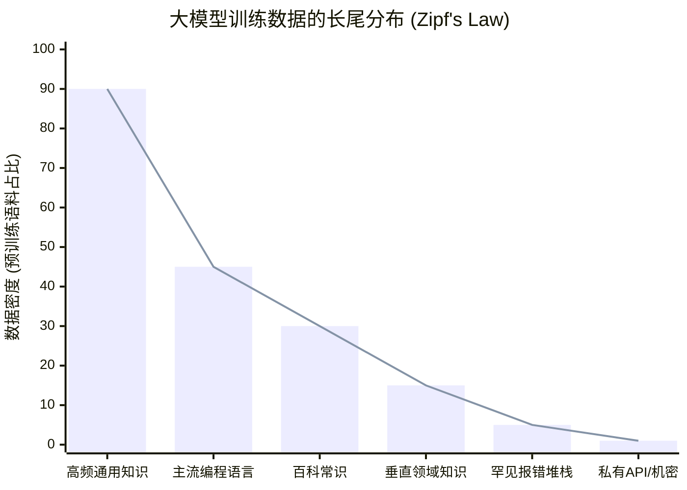
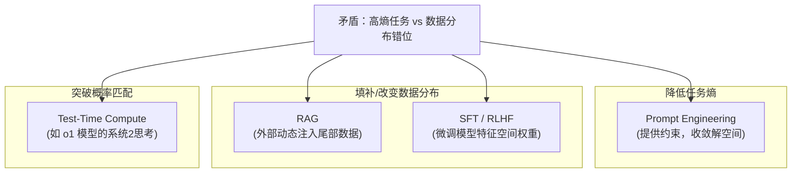
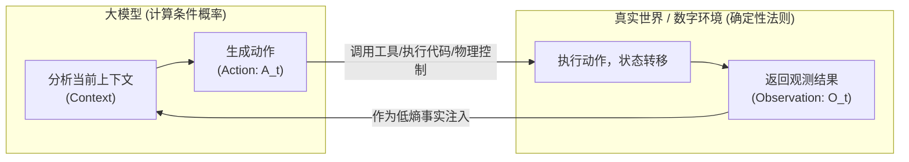

> **核心命题**：“现实任务的信息熵”衡量的是我们在真实世界中遇到的问题的不确定性和复杂性；而“大模型的数据分布”则代表了模型在预训练阶段所捕获的关于世界的先验知识的形态。这两者之间的匹配与错位，直接决定了大模型在具体应用中的表现是“令人惊艳”还是“胡言乱语”。

当前人工智能（特别是大语言模型，LLM）的能力边界，往往让人感到迷惑：它有时能写出完美的复杂代码，有时却在简单的逻辑题上翻车。要理解这种现象，我们需要引入两个核心概念：**现实任务的信息熵**与**大模型的数据分布**。

我们可以从以下几个维度来深入探讨这一决定 AI 能力天花板的底层逻辑。

---

## 一、 现实任务的信息熵：从确定性到混沌

在信息论中，熵（Entropy）是对系统不确定性的度量。对于一个给定具体输入 $x$（即任务上下文和 Prompt）的大语言模型，其输出解空间 $Y$ 的不确定性可以用给定 $x$ 时的**条件分布熵**（Entropy of conditional distribution）来精确表示：

$$
H(Y \mid X=x) = -\sum_{y \in \mathcal{Y}} P(y \mid x) \log P(y \mid x)
$$

将其映射到现实世界的任务中，我们可以将任务按照该熵值 $H(Y \mid x)$ 的高低进行分类：

### 1.1 低熵任务（高确定性、低复杂性，$H(Y \mid x)$ 接近于 0）

*   **特征**：规则明确，边界清晰，答案唯一或高度收敛。
*   **例子**：语法纠错、特定格式的数据提取、编写基础的“增删改查（CRUD）”代码、翻译标准公文。
*   **本质**：这类任务的解空间 $\mathcal{Y}$ 很小且概率分布极度集中，所需的信息量是封闭的。无论环境如何变化，任务的目标和评判标准都是固定的。

### 1.2 高熵任务（高不确定性、高复杂性，$H(Y \mid x)$ 很大）

*   **特征**：开放式、高度依赖长上下文、存在多重变量博弈、需要创新或对罕见边缘场景（Edge Cases）的处理。
*   **例子**：复杂的架构设计、排查深层次的系统级 Bug、撰写具有独特见解的行业分析报告、在缺乏先例的新兴领域进行推理。
*   **本质**：解空间巨大甚至未定义，概率分布平缓。任务的微小条件变化可能导致结果发生“蝴蝶效应”般的巨大偏移。

---

## 二、 大模型的数据分布：长尾效应与知识密度的不均

大模型的能力来源于其庞大的训练语料（主要来自互联网）。这种数据分布并非均匀，而是呈现出极其明显的**长尾特征（Zipf 定律）**：

在语料库中，某个词汇或知识点出现的频率 $P(r)$ 与其在整体分布中的频率排名 $r$ 成反比：

$$
P(r) \propto \frac{1}{r^\alpha} \quad (\alpha \approx 1)
$$

这意味着绝大多数的权重被极少数的“头部知识”占据，而海量的“尾部知识”则极度稀疏。

### 2.1 分布的“头部”（高密度数据）

包含了人类社会最通用、最频繁被记录的知识。
*   **涵盖内容**：主流编程语言（Python, JavaScript）的基础语法、维基百科的常识、常见的客套话和模板化写作。
*   **模型表现**：模型对这部分数据的拟合极其完美，形成了强大的“肌肉记忆”。在这个区域，模型的参数空间被充分激活，输出概率极高且稳定。

### 2.2 分布的“尾部”（低密度数据 / 稀疏数据）

包含了极其专业、冷门、或者由于商业机密未被公开的数据。
*   **涵盖内容**：某家公司内部的私有 API、极度垂直领域的行业 Know-how、非常罕见的代码报错堆栈。
*   **模型表现**：模型在这些区域的特征空间是稀疏的，甚至是空白的。遇到这类问题时，模型往往只能依赖极其微弱的概率信号进行猜测。

---

## 三、 熵与分布的交锋：大模型表现的四个象限

当现实任务的信息熵，撞上大模型的数据分布时，就产生了大模型在实际落地中的四种典型表现：

| 任务类型 / 数据分布 | **头部数据** (高密度先验知识) | **尾部数据** (低密度/稀疏知识) |
| :--- | :--- | :--- |
| **低熵任务** (规则明确，解空间小) | **第一象限：降维打击** | **第三象限：机械性失效** |
| **高熵任务** (复杂多变，解空间大) | **第二象限：似是而非的“幻觉”** | **第四象限：智能的盲区** |

### 1. 第一象限：降维打击（完美替代）
**低熵任务 + 头部数据**
当任务很简单，且所需的知识在互联网上铺天盖地时，大模型表现完美。比如让模型“用 Python 写一个冒泡排序”。这类任务模型甚至不需要复杂的推理，仅仅依靠条件概率的模式匹配就能给出标准答案。在这个象限，AI 已经完全超越了普通人类的效率。

### 2. 第二象限：似是而非的“幻觉”（缝合怪）
**高熵任务 + 头部数据**
当任务很复杂、要求高逻辑性，但探讨的话题是很常见的时候，模型容易翻车。因为大模型本质上是“概率预测机”，它倾向于用头部数据中最常出现的词汇组合，来填补它在深度逻辑推理上的缺失。这就导致了“幻觉”（Hallucination）——它给出了一段看似极其专业、语言流畅，但逻辑完全不通或事实错误的内容。

### 3. 第三象限：机械性失效
**低熵任务 + 尾部数据**
任务逻辑其实很简单，但由于使用的是冷门知识，模型没见过。比如让模型用一种非常小众且缺乏开源代码的编程语言去写一个“Hello World”。任务的信息熵很低，但由于数据分布太稀疏，模型没有建立起对应的条件概率映射，只能胡乱猜测语法，导致失效。

### 4. 第四象限：智能的盲区（彻底无能为力）
**高熵任务 + 尾部数据**
这是现实商业环境中最核心的痛点。例如：解决一个涉及新型硬件且毫无互联网资料的底层并发死锁问题。极高的任务复杂度和极度缺乏的先验数据，使得大模型完全无法提供帮助，必须依赖人类专家的直觉、经验和物理世界的实验。

---

## 四、 缩小鸿沟：当前的工程解法与演进方向

为了解决“任务高熵”与“数据分布不匹配”的矛盾，目前的 AI 工程界演化出了一系列解法。其核心思想无外乎两点：**降低任务的相对熵**，或者**改变模型面临的数据分布**。

### 4.1 Prompt Engineering (提示词工程)
*   **本质**：通过提供更多的上下文（Context）和约束条件，强行降低现实任务的信息熵。把一个开放式的“高熵任务”，收敛成一个半填空式的“低熵任务”。
*   **机制**：例如 Chain-of-Thought（思维链），强制模型将高熵的复杂多步推理过程，拆解为多个低熵的单步推理。

### 4.2 RAG (检索增强生成)
*   **本质**：针对模型“尾部数据”缺失的问题，在推理时动态注入外部知识库。
*   **机制**：这实际上是用外部的确定性信息，填补了模型参数空间中的知识稀疏区，让原本落在第四象限的任务，在运行时被硬生生拉回了第一或第二象限。

### 4.3 SFT (监督微调) / RLHF (人类反馈强化学习)
*   **本质**：强行改变模型在特定领域的数据分布。
*   **机制**：提升目标任务在模型特征空间中的权重，使其相关知识从“长尾”向“头部”移动，从而让模型在特定垂直领域的表现更加稳定。

### 4.4 Test-Time Compute (如 OpenAI o1 模型)
*   **本质**：对于极高熵的任务，仅仅依靠预训练数据的单次采样预测已经不够了。最新的学术研究表明，**生成过程中的局部熵（Entropy）可以作为大模型推理的置信度信号**。
*   **机制**：当任务解空间庞大且生成熵值激增时（代表模型面临巨大的不确定性），大模型可以在推理阶段自动扩展计算时间（Test-Time Compute）。通过引入强化学习、搜索树和反思机制，让模型在巨大的解空间中展开多步推理并自我纠错。这是试图从单纯的“条件概率模式匹配（系统 1）”走向“真正的慢思考推理（系统 2）”。

## 五、 闭环系统：现实环境的反馈降低任务熵

在现实应用中，仅仅依靠模型自身的“开环（Open-loop）”生成往往无法应对极其复杂的高熵任务。此时，引入**物理世界或数字环境的真实反馈（Environment Feedback）**，构建一个“闭环（Closed-loop）”系统，成为了持续降低任务不确定性的最有效手段。

环境反馈本质上是在大模型每一次动作（Action，记为 $A_t$）后，由环境提供一次真实的观测变量（Observation，记为 $O_t$）。根据信息论中的**条件减少熵（Conditioning reduces entropy）**定理，引入新的观测变量作为已知条件，在数学期望上必定会使系统对后续决策或目标 $Y$ 的不确定性递减或持平：

$$
H(Y \mid X_0, A_1, O_1, \dots, A_t, O_t) \le H(Y \mid X_0, A_1, O_1, \dots, A_t)
$$

这种“动作 - 观测”的循环，用现实环境的确定性，强行抵消了大模型在长步数自回归生成中的误差累积。

### 5.1 软件工程：编译器与运行时反馈

在代码生成领域，如果要求模型一次性从零写出一个数千行的复杂系统，其任务熵是极高的，极易产生“幻觉代码”。但现代 AI 编程 Agent（如 Cursor）采用了闭环的工程策略：

*   **编译反馈**：模型生成代码后，立即在沙盒中调用编译器。如果出现语法错误或类型不匹配，编译器抛出的报错堆栈（Error Stack）会作为精确的低熵反馈传回给模型。
*   **测试与运行时反馈**：代码通过编译后，执行单元测试（Unit Tests）。失败的测试用例和运行时的标准输出（stdout）能让模型瞬间定位到逻辑 Bug，推翻之前的错误假设。
*   **本质**：这是用“计算机科学的确定性规则”来压制“大模型输出的概率性”。每一次真实的报错反馈，都在收敛原本发散的代码解空间。

### 5.2 具身智能（Embodied AI）：物理世界的传感器反馈

当大模型被用作机器人（Robotics）的大脑时，它们面对的是物理世界——一个信息熵最高、最具混沌特性的环境。摩擦力、光照、材质等未对齐的长尾数据，会让纯靠预训练分布的“开环”控制完全失效。

*   **多模态感知与纠偏**：机器人执行抓取动作时，一旦机械臂触碰物体，力矩传感器（Force Sensor）会实时传回触觉反馈。如果发现物体滑动，模型会基于反馈立即调整抓取力度。
*   **从试错中学习**：面对训练语料中极度稀疏的长尾物理场景，模型先进行微小的“试探性动作”（如轻推一下物体），根据物体在现实世界中的反馈状态，实时修正内部的“世界模型（World Model）”。
*   **本质**：物理定律构成了最严苛、最客观的“判别器”。通过极高频的“动作 - 传感器观测 - 修正”循环，将原本处于第四象限的混沌长尾问题，强行拉回收敛域。

### 5.3 交互式工具调用（Tool Use）

在日常复杂任务中，模型也可以通过调用外部工具获取确定性反馈：

*   如果模型需要执行严密逻辑的数学计算，或者获取一家公司的最新财报（动态数据），它会编写一段代码运行或调用 API，并将环境返回的确切数据作为新的上下文。
*   **本质**：模型将自身不擅长的“精确计算与记忆”外包给确定性的环境工具。工具返回的反馈，都在将极高熵的预测任务，降维成了低熵的“基于确凿事实进行总结”的任务。

---

## 结语

“现实任务的信息熵”与“大模型的数据分布”之间的矛盾，是当前 AI 落地最大的阻碍，但同时也是最有价值的突破口。

人类在解决高熵任务时，依靠的不仅仅是记忆（数据分布），更是物理定律、逻辑推演以及对世界底层运行规律的理解（World Model）。大模型如果仅仅停留在对海量数据的统计学拟合，永远无法跨越长尾的深渊。

未来的 AI 发展，必然是从单纯的“拟合数据分布”，走向构建能够真正理解和消化“现实高熵环境”的**推理引擎**。只有当模型能够在缺乏先验数据的情况下，依然通过第一性原理进行推演时，真正的通用人工智能（AGI）才会到来。