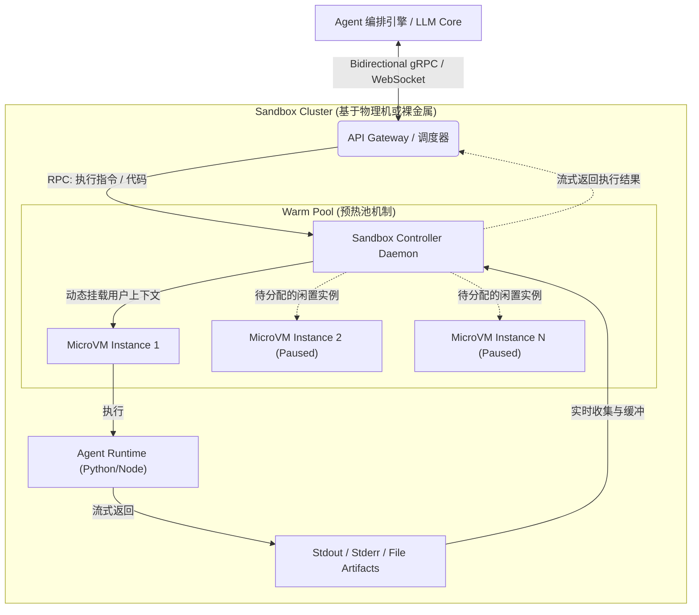

> **核心导读**：随着大语言模型（LLM）向具备自主规划与工具调用能力的 Agentic AI 演进，赋予模型图灵完备的动态代码执行能力（Code Execution）已成为必然趋势。然而，将非确定性的生成内容直接转化为系统级指令，带来了前所未有的安全挑战。本文将从威胁模型出发，深度剖析当前主流的代码执行隔离（Sandbox）技术栈，并探讨面向 AI Agent 的沙盒编排系统架构设计。

在 ChatGPT 引入 Advanced Data Analysis（原 Code Interpreter）以及各类 AI 编码助手（如 Cursor、Devin）爆火之后，LLM 已经突破了纯文本处理的边界。当模型需要处理复杂数学计算、数据可视化或自动化运维时，生成并执行代码是唯一可靠的路径。但这要求我们在不受信任的 AI 生成代码与宿主基础设施之间，构建一道坚不可摧且极低延迟的隔离屏障。

---

## 一、 威胁模型与隔离需求分析 (Threat Model & Requirements)

在评估和设计 AI 代码执行环境时，我们首先需要明确其面临的安全威胁以及业务层面的核心诉求。

### 1. 威胁模型 (Threat Model)

*   **非确定性输出引发的系统崩溃 (Systemic Risks of Non-deterministic Outputs)**：LLM 存在固有的“幻觉（Hallucination）”。模型可能会生成极其低效的死循环代码导致 CPU 耗尽，或者执行无意识的危险命令（如 `rm -rf /`），从而导致宿主节点（Host Node）崩溃或资源耗尽（如 OOM 或 CPU Starvation）。
*   **提示词注入与越权执行 (Prompt Injection & Privilege Escalation)**：攻击者可以通过构造恶意的输入（Payload），触发 Prompt Injection，劫持 LLM 生成恶意反弹 Shell 代码或横向移动脚本。如果执行环境权限过高，攻击者将直接接管宿主机，甚至渗透内网。
*   **多租户数据泄露 (Cross-tenant Data Leakage)**：在云端提供 AI 服务时，同一个物理节点可能同时运行多个用户的 Agent 会话。如果沙盒隔离不彻底，用户 A 的 Agent 可能会读取到用户 B 的内存状态、环境变量或持久化文件。

### 2. 核心系统诉求

*   **极速冷启动 (Ultra-fast Cold Start)**：Agent 的思考链（Reasoning Chain）通常需要与沙盒进行高频交互（生成代码 -> 执行 -> 观察报错 -> 修正代码）。环境的冷启动延迟必须控制在 **亚秒级甚至毫秒级**，否则将严重破坏用户体验。
*   **状态持久化与一致性 (Stateful Sessions & Consistency)**：在单次交互会话（Session）中，沙盒需要保持状态。例如，第一步 `pip install` 的依赖库，第二步执行代码时必须可用。同时，环境基线必须保证绝对干净，避免“脏环境”导致模型产生难以排查的 Bug。

---

## 二、 核心隔离技术栈对比分析

为了在“强隔离安全”与“低延迟高并发”之间寻找平衡点，业界演化出了多种隔离方案。

### 1. 基于内核共享的容器化（Namespaces & Cgroups）

这是最基础、最成熟的方案，通常以 Docker 为代表。

*   **技术机制**：利用 Linux 的 `namespaces` 实现进程树、网络栈、挂载点（Mount）、IPC 等的视图隔离；利用 `cgroups` 进行 CPU、内存、块设备 I/O 等资源的硬限制。
*   **优势**：生态成熟，镜像分发机制完善，启动速度相对较快（数百毫秒级），运行时性能损耗极低（接近原生性能）。
*   **致命缺陷与安全隐患**：所有容器共享同一个宿主机 Linux 内核（Host Kernel）。如果恶意代码利用了内核漏洞（如著名的 Dirty COW 漏洞、eBPF 漏洞），就能轻松实现**容器逃逸（Container Escape）**，获取宿主机 `root` 权限。因此，在没有进一步安全加固的情况下，**纯 Docker 容器绝对不能用于运行完全不受信任的 AI 代码。**

### 2. 进程级沙盒与系统调用拦截（gVisor / seccomp）

为了弥补纯容器共享内核的缺陷，引入了用户态内核技术。

*   **技术机制**：以 Google 开源的 `gVisor` 为例，它用 Go 语言在用户空间实现了一个兼容 Linux 的内核代理（Sentry）。当容器内的不受信代码发起系统调用（Syscalls）时，请求会被 Sentry 拦截并代理执行，而非直接触达宿主机内核。此外，`seccomp`（Secure Computing Mode）可以通过 BPF 过滤器，直接禁用极其危险的系统调用（如 `ptrace`, `unshare`）。
*   **应用场景**：作为 Docker/Kubernetes 的安全增强插件（如 `runsc` 运行时）。能够在不改变容器化部署架构的前提下，大幅提升防御内核漏洞提权的能力。
*   **局限**：系统调用拦截会导致极大的上下文切换开销（Context Switch Overhead），在进行高频文件 I/O 或网络请求时，性能下降显著。

### 3. 微型虚拟机 MicroVM (Firecracker)：Serverless AI 的基石

这是目前专为执行不可信代码（如 AWS Lambda，以及 E2B、Daytona 等 AI 沙盒）设计的黄金标准。

*   **技术机制**：基于 KVM（Kernel-based Virtual Machine），为每个沙盒分配一个极其精简的、定制化的内核（Guest Kernel）。Firecracker 移除了传统虚拟机（如 QEMU）中大量冗余的设备驱动模型（如 USB、VGA 虚拟化），仅保留必要的 VirtIO 块设备和网络接口。
*   **核心优势**：
    *   **硬件级强隔离**：攻击者即使攻破了 Guest Kernel，也依然被阻挡在 KVM 硬件虚拟化边界之内。
    *   **毫秒级启动**：相比传统 VM 分钟级的启动时间，MicroVM 可以实现 **100~200 毫秒** 的极速拉起，内存开销仅为数 MB。
*   **地位**：MicroVM 完美兼顾了虚拟机的安全隔离级别与容器的轻量级特性，是目前构建 AI Agent 代码执行环境的最优解。

### 4. WebAssembly (Wasm) 与 WASI：极致的边缘冷启动

*   **技术机制**：一种基于栈式虚拟机的跨平台二进制指令格式。Wasm 在设计之初就采用了基于线性内存（Linear Memory）的安全模型，代码无法越界访问分配之外的内存。结合 WASI（WebAssembly System Interface），可以实现对底层系统资源的安全、细粒度受控访问。
*   **核心优势**：启动延迟达到**微秒级（Microseconds）**，极小的磁盘与内存占用。支持直接在浏览器端（Edge/Client-side）运行大模型生成的代码，实现计算力的极致下放与“零服务端计算成本”。
*   **局限**：生态仍处于发展期，很多依赖复杂底层 C 扩展或系统特性（如多线程共享内存、复杂网络栈）的 Python/Node.js 库，在 Wasm 编译和运行上仍存在巨大挑战。

---

## 三、 面向 Agent 的沙盒编排系统架构设计

在生产环境中，单节点的沙盒技术必须配合分布式的编排系统，才能支撑大规模的 AI Agent 并发调用。典型的沙盒集群架构如下：

### 关键架构组件：

1.  **预热池机制 (Warm Pool Management)**
    虽然 MicroVM 启动仅需 100ms，但在启动后往往还需要加载 Python 解释器、挂载文件系统等初始化操作。为了追求极致体验，系统会在后台预先启动一定数量的“空白 MicroVM”并暂停（Pause）其 CPU 周期。当接收到请求时，系统只需唤醒（Resume）实例并将其分配给用户，从而将整体耗时压榨到 10ms 级别。
2.  **双向流式通信 (Bidirectional Streaming RPC)**
    传统的 HTTP Req-Res 模式无法满足执行长时间运行（Long-running）代码的需求。系统必须建立全双工的通信信道（如 gRPC Streaming 或 WebSocket），以便实时地将标准输出（`stdout`）、异常堆栈（`stderr`）流式返回给大模型。如果模型发现代码陷入死循环，也可以通过该信道发送 SIGTERM 信号实时强杀进程。
3.  **多模态产物收集 (Artifacts Extraction)**
    AI 执行代码往往不仅仅是为了获取文本输出，还可能生成数据图表（Matplotlib 生成的 PNG）、处理后的 Excel 表格等。沙盒守护进程需要具备高效的内存文件系统监控机制，自动收集新生成的文件对象，并将其转化为 Base64 或对象存储 URL 返回给上层应用。

---

## 四、 前沿挑战与下一代沙盒技术演进

随着大模型能力向多模态、超长上下文和底层系统级操作延伸，目前的隔离环境方案仍有极大的演进空间：

### 1. 内存快照与挂起恢复 (Memory Snapshotting & Restore)

**挑战**：Agent 会话可能会持续数小时甚至数天，期间会加载大量数据（如数 GB 的 Pandas DataFrame）。如果 Agent 处于等待用户指令的闲置状态，维持高配虚拟机存活的成本极其高昂。
**演进方向**：通过虚拟机克隆和内存快照技术，在极短时间内将 CPU 寄存器和完整内存页（Memory Pages）挂起并序列化到分布式存储系统。当请求恢复时，系统直接从快照恢复执行流，实现类似“休眠-唤醒”的无缝切换，极大降低计算成本。

### 2. 受控的外部网络通道 (Egress Network Control & MITM Proxy)

**挑战**：绝对安全的沙盒应完全断网，但这会导致 Agent 无法使用 `curl` 获取文档、无法 `pip install` 新依赖、无法调用第三方 API。
**演进方向**：设计细粒度的动态 Egress 防火墙。默认阻断一切外网连接，仅放行特定的代码托管平台和包管理器仓库。对于未知的 API 请求，采用中间人代理（MITM Proxy）拦截并实时交由一个安全审计子模型进行判定，防止 SSRF 攻击、端口扫描和数据外泄（Data Exfiltration）。

### 3. 异构计算资源（GPU/NPU）的隔离与直通

**挑战**：当前 AI 沙盒大多仅局限于 CPU 算力。当大模型试图自主编写 CUDA 算子并进行编译验证，或者在沙盒内加载一个较小的专属领域模型（如进行数据本地蒸馏）时，沙盒必须具备访问 GPU 的能力。
**演进方向**：探索 vGPU 切片隔离或 SR-IOV 硬件级直通技术，将宿主机的 GPU 安全地挂载给不受信的 MicroVM 实例，同时防止显存越界读取或 GPU 资源独占导致的拒绝服务攻击。

## 结语

在软件工程的范式转换期，代码执行的沙盒（Sandbox）不再仅仅是一个后台的安全组件，而是已经跃升为 **Agentic AI 的核心基础设施**。它为大模型连接物理数字世界戴上了“无菌手套”，提供了极其宝贵的容错空间。未来，衡量一个 AI 平台能力天花板的，除了大模型本身的参数量与智商，还将取决于其背后代码沙盒引擎的灵活性、安全性与极致性能。