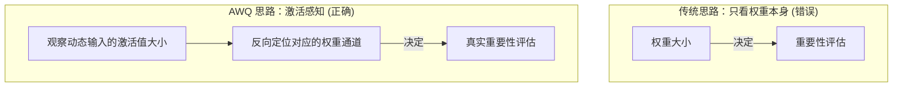

> **核心命题**：大模型参数虽多，但并非“众生平等”。传统的量化算法粗暴地将所有参数一视同仁，导致模型能力断崖式下跌。而 **AWQ（激活感知权重量化）** 的伟大之处，在于它打破了“看权重本身找重要性”的惯性思维，通过观测动态的“激活值”，精准锁定那决定生死的极少数（约 0.1%~1%）关键权重，并通过巧妙的数学“等价缩放”，在不增加任何硬件推理负担的情况下，实现了几乎无损的 4-bit 极限压缩。

当我们试图把几十 GB 甚至上百 GB 的大语言模型（LLM）塞进消费级显卡（比如只有 24GB 显存的 RTX 4090）时，“量化（Quantization）”是我们唯一且必须的选择。

在量化算法的江湖中，诞生于 MIT 韩松教授团队（Han Lab）的 **AWQ（Activation-aware Weight Quantization）** 绝对是一颗璀璨的明珠（荣获 MLSys 2024 最佳论文）。它用极其优雅的数学和极低的工程代价，终结了量化领域的混乱。

要真正理解 AWQ，我们同样需要**自底向上（Bottom-up）**地去剖析它到底解决了量化过程中的什么根本矛盾。

---

## 一、 最底层的痛点：“一刀切”的悲剧

量化的本质，是降低数字的精度（分辨率）。在计算机里，通常使用 16-bit 浮点数（FP16）来存储模型的权重。如果我们强行把它塞进 4-bit（INT4）的整数网格中，不可避免地会产生**舍入误差（Quantization Error）**。

这就像把一张 4K 的高清照片强行压缩成马赛克像素图，细节必定丢失。

早期的量化算法（如 RTN, Round-to-Nearest，即直接四舍五入）采取的是“一刀切”策略：对同一量化分组（Group）内的所有权重一视同仁，不考虑其对特征表达的重要性，采用统一的公式进行暴力的四舍五入压缩。

但研究人员很快发现了一个致命现象：**大模型里的权重，并非众生平等。**
* 大部分（约 99%）的权重，哪怕你把它压缩得面目全非，模型依然能正常对话。
* 极小部分（约 0.1%~1%）的权重，一旦出现轻微的量化误差，整个模型就会瞬间“变傻”，开始胡言乱语。这极少数的关键权重被称为 **显著权重（Salient Weights）**。

> 💡 **核心矛盾**：既然只要保护好这 0.1%~1% 的显著权重就能保住模型的智商，那么我们**如何在一座由数百亿参数组成的数字大山中，精准地揪出这极少数的关键？**

---

## 二、 破局点一：从“静态权重”转向“动态激活值”

按照常理，我们找“最重要”的权重，肯定会看权重本身的数值。谁的绝对值最大，谁就最重要。但这在深度学习中竟然是**错的**！

AWQ 团队的核心洞察，就藏在它的名字里——**Activation-aware（激活感知）**。

在神经网络的一层计算中，可以用一个最简单的公式表示：$Y = W \cdot X$（注：为了与 AWQ 原始论文中的数学推导保持绝对一致，这里采用 $W$ 在左、$X$ 在右的表示法，即权重矩阵乘输入特征）。
* $W$ 是权重（静态的，储存在显存中）。
* $X$ 是激活值（动态的，是你输入的 Prompt 经过层层计算流到这一层时的数据）。

AWQ 团队发现：**一个权重通道重不重要，不是看它自己的数值有多大，而是看和它相乘的“激活值通道”的数值有多大。**
如果某一个输入特征通道（即 $X$ 的某一行）经常要处理非常庞大的激活数值，那么它对应的权重通道（即 $W$ 的某一列）就极其关键。因为即使该权重通道只有微小的量化误差，一旦乘上那个巨大的激活值，最终输出 $Y$ 的误差也会被无限放大，从而引发灾难。

这就是 AWQ 名字的由来：它不看死板的权重，而是通过喂给模型少量真实数据（Calibration Data），观察激活值的流动，从而精准地抓住了那极少数的“显眼包”。

---

## 三、 破局点二：神来之笔“等价缩放”

找到了这 0.1%~1% 的关键权重，接下来的问题是：**怎么保护它们不被 4-bit 粗暴截断？**

最直观的想法是混合精度（Mixed Precision）：让 99% 以上的参数用 4-bit 存，剩下不到 1% 的关键参数保留在 16-bit（如 LLM.int8() 算法）。
但在实际工程中，GPU 是极其讨厌这种“分支逻辑”的。一会儿算 4-bit 一会儿算 16-bit，会导致硬件无法进行高效的矩阵向量乘法，从而让推理速度变得奇慢无比。

在这里，AWQ 祭出了全篇最优雅的数学技巧：**等价缩放（Equivalent Transformation）**。

假设某一个重要的权重是 $W$，它对应的激活值是 $X$。既然不能保留 16-bit，AWQ 决定通过“放大”来保护它。

1. **放大权重**：在矩阵运算中，把重要的权重通道（即 $W$ 的相应列，对应输入的特征维度）乘以一个大于 1 的缩放因子 $\mathbf{s}$（*注：在 AWQ 算法实现中，$\mathbf{s}$ 的大小是通过激活值的平均幅值 $\mathbf{s}_X$ 和一个在 $[0, 1]$ 之间搜索的超参数 $\alpha$ 来自动确定的，即 $\mathbf{s} = {\mathbf{s}_X}^\alpha$*）。在数学上相当于 $W' = W \cdot \text{diag}(\mathbf{s})$。
2. **缩小激活**：为了保证最终计算结果不变，把对应的激活值通道（即 $X$ 的相应行）缩小相同的倍数。在数学上相当于 $X' = \text{diag}(\mathbf{s})^{-1} \cdot X$。
3. **等价结果**：$Y = W' \cdot X' = W \cdot \text{diag}(\mathbf{s}) \cdot \text{diag}(\mathbf{s})^{-1} \cdot X = W \cdot X$。结果完全不变！

**这有什么用呢？**
这就好比你要在一个非常粗糙的刻度尺（4-bit 网格）上记录一个微小但关键的数据。如果你直接记，相对误差会极大；但如果你先把这个数据在数学上**放大几倍**再去记录，相对误差就瞬间变小了。

通过这一手数学变换，AWQ 实现了两大奇迹：
* **模型保真**：那极少数的关键权重被放大了，在 4-bit 压缩中得到了重点保护，模型能力几乎无损。
* **零硬件负担**：缩放因子 $\mathbf{s}$ 的计算是在离线阶段就完成并合并到权重里的（Weight-only Quantization）。在真正的 GPU 推理时，所有的权重都是清一色的 4-bit 整数。对于激活值的缩放计算 $X' = \text{diag}(\mathbf{s})^{-1} \cdot X$，AWQ 极其聪明地将其**数学等价融合到了前置的层（例如 LayerNorm 操作）中**。因此，推理时没有任何混合精度的判断逻辑，也没有额外的激活缩放开销，硬件跑起来可以风驰电掣！

---

## 四、 历史发展与工程落地：当理论遇见底层引擎（TinyChat / vLLM / LMDeploy 等）

任何伟大的算法如果只有 Python 写的原型代码，都注定无法在工业界掀起波澜。在 AWQ 论文问世时，MIT 韩松团队就为了证明其硬件可行性，亲自开发并开源了 **TinyChat** 推理框架，通过手写 W4A16 的底层 Kernel（支持 CUDA 和 ARM NEON 等），在桌面和移动端 GPU 上初步实现了相比 FP16 高达 3 倍以上的加速。

但这仅仅是个开始。AWQ 的真正爆发和大规模普及，离不开工业界顶级推理引擎的深度集成与底层性能压榨，最具代表性的包括 **vLLM、LMDeploy（上海人工智能实验室）、TensorRT-LLM** 等。

在当时，工业界面临的最大挑战是如何在生产环境中极致且稳定地发挥 4-bit 算子的性能。各大推理引擎团队敏锐地捕捉到了 AWQ 的潜力，上演了一场经典的“工程美学”：
* 他们深入到 GPU 底层，专门针对 AWQ 的 W4A16 内存排布格式及融合前置激活缩放逻辑，**徒手优化出了一套极其极致的 CUDA 计算内核（Kernel）**。
* 结合 PagedAttention、Continuous Batching 等高阶显存管理技术，将其深度集成到 C++ 推理引擎中。

结果是震撼的。结合了 AWQ 算法与底层系统级优化的引擎，不仅将模型的显存占用硬生生砍到了原来的四分之一，其推理吞吐量更是比跑原始 FP16 模型**快了数倍**。

从那一刻起，**“AWQ 算法 + 高效推理引擎（如 vLLM / LMDeploy / TensorRT-LLM）”** 几乎成为了业内跑量化大模型的标配黄金组合，也彻底推开了大模型在消费级显卡和端侧设备上大规模落地的大门。

---

## 五、 总结：从直觉走向科学

回顾 AWQ 的底层逻辑，它给我们带来了两个极其深刻的启发：

1. **不要只盯着静态的参数看问题。** 神经网络的魔法发生在数据流动的那一刻（Activation），只有动起来，你才知道谁才是真正的关键少数。
2. **用数学解决硬件问题。** 面临硬件不喜欢“混合精度”的限制，AWQ 没有硬扛，而是通过巧妙的 $Y = W \cdot \text{diag}(\mathbf{s}) \cdot \text{diag}(\mathbf{s})^{-1} \cdot X$ 等价变换，在不增加任何运行时代价的前提下，完美地“骗”过了量化带来的误差。

这就是所谓的“四两拨千斤”。在目前各种模型越做越大、算力极度短缺的时代，AWQ 无疑是一座光芒万丈的灯塔，照亮了端侧和消费级硬件部署大模型的前路。
