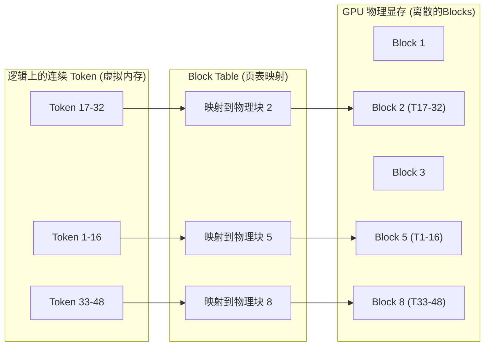

> **核心命题**：如果把大语言模型（LLM）的推理过程看作是执行一个极其庞大且内存饥渴的程序，那么传统的推理框架就像是一个没有内存管理、没有多任务调度的简陋单片机。而 **vLLM** 的出现，本质上是为大模型推理引入了现代操作系统（OS）中最重要的两个基本思路：**虚拟内存分页** 和 **细粒度进程调度**。

当我们谈论大语言模型（LLM）时，往往会被其惊人的参数量和涌现能力所吸引。然而，当把这些庞然大物真正落地到生产环境中去服务千万用户时，我们面临的核心瓶颈已经不再是单纯的算力，而是**内存（GPU 显存）的 I/O 与容量瓶颈**。

目前，**vLLM** 是大模型推理领域毫无争议的明星框架和事实标准。为什么是它？要真正理解 vLLM，我们不应该去死记硬背它支持多少模型或 API，而是应该**自底向上（Bottom-up）**地去剖析它到底解决了底层硬件与计算模式之间的什么矛盾。

本文将剥开 vLLM 的外衣，从最基础的显存分配开始，逐步推演出 vLLM 的核心设计思想。

---

## 一、 最底层的痛点：显存去哪儿了？

在探讨 vLLM 之前，我们必须先弄清楚大模型在推理时，GPU 的显存里到底装了什么。

当一个大模型被加载到 GPU 时，显存通常被划分为两大部分：
1. **模型权重（Model Weights）**：这部分是静态的。比如一个 8B（80亿参数）的 FP16 模型，雷打不动地占用约 16GB 的显存。
2. **KV Cache（键值缓存）**：这是大模型在生成每一个 Token 时，为了避免重复计算历史 Context 而保存的中间张量（Tensors）。**这是动态的，且极其庞大。**

### 致命的显存碎片化

传统的推理框架（如早期的 HuggingFace Transformers）在处理 KV Cache 时，使用的是**预分配连续内存**的策略。

假设我们收到一个请求，要求模型最多生成 2048 个 Token。传统的做法是：直接在 GPU 显存中划出一块连续的、足够容纳 2048 个 Token 的 KV Cache 空间。

但这会带来一个灾难性的问题：
* **内部碎片**：如果模型实际上只生成了 100 个 Token 就遇到了 `<EOS>`（结束符），那么剩下的 1948 个 Token 的空间就被白白浪费了。
* **外部碎片**：即使总显存还有很多，但由于内存被各种预分配的连续块切碎了，导致找不到一块足够大的连续内存来容纳新请求的 KV Cache，新请求只能排队等待。

> 💡 **系统视角的思考**：这不就是早期计算机操作系统面临的内存碎片问题吗？每个程序都要求分配一块连续的物理内存，导致内存利用率极低（根据 vLLM 论文数据，传统系统的有效显存利用率仅为 20.4%-38.2%）。

---

## 二、 破局点一：PagedAttention（显存的分页管理）

既然传统推理的痛点与早期操作系统的内存痛点如出一辙，那么 vLLM 团队（来自 UC Berkeley 的系统研究者）给出的第一个基本思路，自然就是借用现代操作系统中最伟大的发明之一：**虚拟内存与分页（Paging）**。

这就诞生了 vLLM 的灵魂技术：**PagedAttention**。

### 1. 将 KV Cache 切成“页”

vLLM 不再为每个请求预分配一大块连续的物理显存。相反，它将 KV Cache 切分成固定大小的“块（Blocks）”，也就是“页”。
* 每个 Block 只包含固定数量 Token（比如 16 个）的 KV Cache。
* 这些 Block 在物理显存中是**完全离散、非连续的**。

### 2. 引入虚拟内存映射（Block Table）

既然物理存储是离散的，当计算 Attention 时，模型怎么知道去哪里拿历史的 KV Cache 呢？

vLLM 在内存中维护了一个类似于操作系统“页表（Page Table）”的结构，叫做 **Block Table**。
* **逻辑视角**：对大模型来说，它看到的 KV Cache 依然是一根连续的、按顺序排列的 Token 序列（就像进程看到的虚拟内存）。
* **物理视角**：vLLM 的底层内核会通过 Block Table，将逻辑上的连续 Token 实时映射到物理显存中那些零散的 Block 上。

### 3. PagedAttention 带来的奇迹

通过这种极其优雅的自底向上设计，PagedAttention 实现了：
1. **消灭内部碎片**：按需分配，用多少 Token 就分配多少个 Block，浪费的最多只有不到一个 Block 的空间。
2. **消灭外部碎片**：所有的物理内存都可以被充分利用，不需要寻找连续的大块内存。
3. **内存共享**：更令人惊叹的是，这为跨请求的内存共享打下了基础。基于此，vLLM 实现了 **Automatic Prefix Caching（自动前缀缓存）**，如果多个并发请求共享相同的 System Prompt 或前缀，通过计算 Token Hash，它们可以映射并指向相同的物理 Block，从而避免重复计算并极大地节省了显存！

最终的结果是：**vLLM 将显存的浪费率从 60%-80% 暴降到了 4% 以下。** 这极大提升了有效 KV Cache 的容量（从不足 40% 提升至 96% 以上）。省下来的海量显存，可以用来塞进更多并发的请求。

---

## 三、 破局点二：Continuous Batching（细粒度调度）

有了 PagedAttention 释放出的海量显存空间，我们需要将其转化为实际的吞吐量（Throughput）。这就引出了 vLLM 的第二个基本思路：**改进批处理机制**。

### 传统的 Static Batching 的笨拙

GPU 是一个极其庞大的并行计算工厂。为了让 GPU 吃饱，我们必须把多个请求打包成一个批次（Batch）一起送进去算。

传统的批处理是**静态的（Static Batching）**：
假设我们把 4 个请求打包成一个 Batch 送去推理。其中 3 个请求很快就生成完了（比如只生成了 10 个词），但有 1 个请求特别长，需要生成 1000 个词。
结果就是：整个 GPU 被这 1 个长请求“绑架”了，必须等它完全生成完，才能接收下一批新的请求。这就导致 GPU 的算力严重闲置。

### Continuous Batching（连续批处理 / 迭代级调度）

vLLM（以及由 Orca 论文首次提出并启发的框架）引入了 **Continuous Batching（或者叫 In-flight Batching / Iteration-Level Scheduling）**。

其核心思路也是操作系统级别的：**把调度的粒度，从“请求（Request）”级别，降低到了“迭代（Iteration / Token）”级别。**

* 大模型每生成一个 Token，算作一次迭代（Step / Iteration）。
* 在每一次迭代结束后，调度器都会停下来检查：有没有请求已经生成完了？如果有，立刻释放其占用的 Block，并把它踢出当前的 Batch。
* 然后立刻看看等待队列里有没有新请求，或者当前剩余的 Token Budget（Token 预算）是否允许？如果允许，立刻把新请求塞进当前的 Batch 中（执行 Prefill 或 Decode），参与下一个 Token 的生成。

```mermaid
gantt
    title Continuous Batching 的细粒度调度
    dateFormat  HH:mm:ss
    axisFormat  %H:%M:%S
    
    section Request 1 (短)
    生成Token 1-5      :a1, 00:00:00, 5s
    完成并退出 Batch    :milestone, m1, 00:00:05, 0s
    
    section Request 2 (长)
    生成Token 1-5      :a2, 00:00:00, 5s
    继续生成Token 6-10  :a3, after a2, 5s
    
    section Request 3 (新加入)
    等待中...          :a4, 00:00:00, 5s
    加入Batch,生成Token 1-5: a5, after a4, 5s
```

这就好比一条永不停歇的流水线，有空位随时补人，做完立刻下车。整个 GPU 的计算单元被压榨到了极致，吞吐量因此获得了数倍的提升。

---

## 四、 总结：从大模型走向系统工程

如果我们跳出 AI 的视角，从纯粹的计算机系统（Systems）视角来看 vLLM，你会发现它是一次经典的“跨界降维打击”。

1. **痛点**：由于 Transformer 自回归生成的特殊性（KV Cache 随时间动态增长），导致了 GPU 显存管理的极度混乱。
2. **底层抽象**：把 KV Cache 抽象为**动态增长的内存需求**，把并发请求抽象为**多任务进程**。
3. **系统解法**：用 **PagedAttention（虚拟内存分页）** 解决内存碎片问题；用 **Continuous Batching（细粒度时分复用）** 解决 CPU/GPU 闲置问题。

vLLM 之所以能成为今天的行业标杆，正是因为它极其准确地抓住了大模型推理的底层矛盾（显存 I/O 而非纯算力），并用历经数十年检验的计算机系统基本思路，给出了最优雅的解答。

学习 vLLM，不仅是在学习如何部署一个 AI 模型，更是在重温一次经典的计算机系统架构之美。
