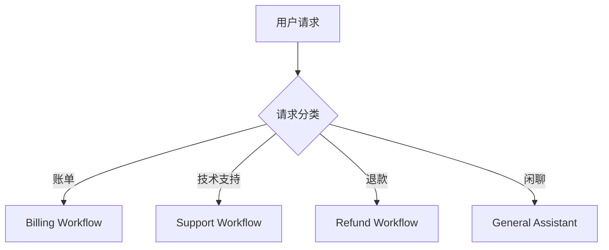
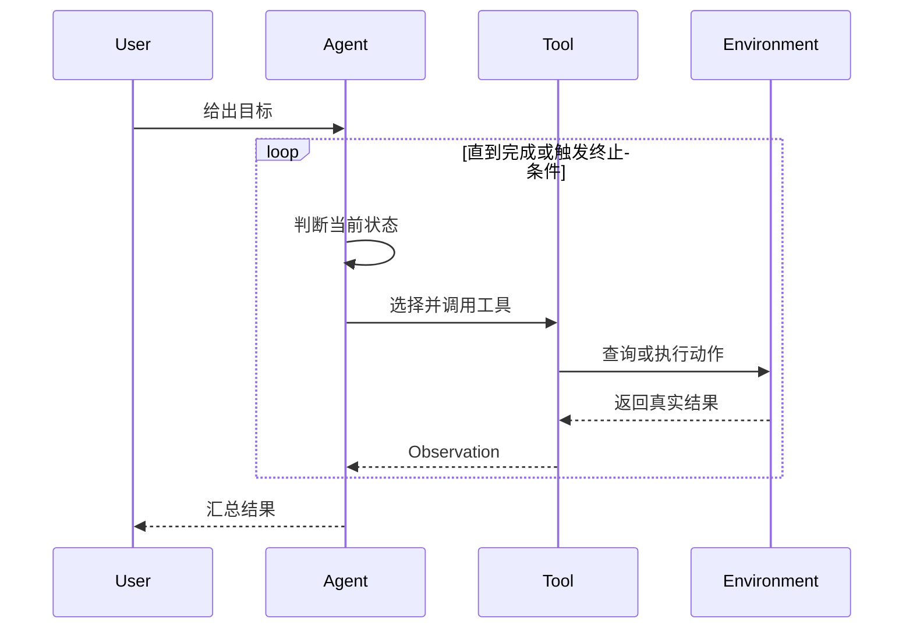
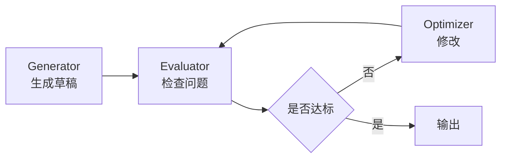
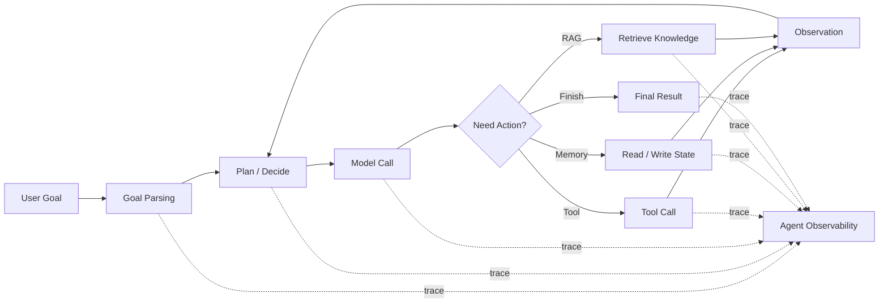

> **核心观点**：Agent 不是“会自己干活的聊天机器人”，而是一类以大语言模型为决策核心、以工具和状态为行动边界、以观测和反馈为控制回路的软件系统。真正可靠的 Agent 工程，重点不在于让模型更自由，而在于**把自由放进可观测、可恢复、可评估的结构里**。

## 一、先区分：Workflow 与 Agent

讨论 Agent 时，最容易混乱的地方是：很多人把所有“LLM + 工具 + 多步调用”的系统都叫 Agent。

更清晰的划分是把它们放在一条连续谱上：

- **Workflow**：执行路径主要由代码预先定义，LLM 只负责某些步骤中的理解、生成、分类、判断。
- **Agent**：执行路径由 LLM 在运行时动态决定，模型会根据目标、状态、工具返回结果，决定下一步该做什么。

这不是好坏之分，而是**控制权分配**不同。

如果任务路径固定、风险高、结果必须稳定，Workflow 往往比 Agent 更合适；如果任务路径无法预先枚举，需要模型动态选择工具、迭代搜索和纠错，才更适合使用 Agent。

## 二、Agent 的设计范式

### 2.1 增强型 LLM：最小可用单元

增强型 LLM 是所有 Agentic System 的基础构件。

它通常由四部分组成：

| 能力 | 作用 |
|------|------|
| **检索** | 让模型访问外部知识，减少幻觉 |
| **工具** | 让模型执行确定性动作，例如查询、计算、写入、调用 API |
| **记忆** | 让系统在多轮任务中保留用户偏好、上下文和中间状态 |
| **结构化输出** | 让模型输出可被程序稳定解析的数据 |

很多业务场景到这里就够了。例如知识库问答、合同摘要、日志分析、客服回复建议。它们不需要“自主性”，需要的是**上下文准确、输出稳定、接口清晰**。

### 2.2 Prompt Chaining：链式工作流

链式工作流把复杂任务拆成固定步骤：

这种范式适合可以清晰拆解的任务，比如：

- 先生成大纲，再写文章
- 先抽取字段，再生成 JSON
- 先翻译，再校对术语
- 先总结，再生成邮件

它的优势是可测试、可插入校验、失败位置明确。缺点是路径固定，面对开放任务时灵活性不足。

### 2.3 Routing：路由与分诊

Routing 的核心是先判断输入类型，再交给对应处理流程：

它适合客服、工单、企业知识库、模型分层调用等场景。

这里的关键不是“分类器有多聪明”，而是每条分支是否有足够清晰的能力边界：不同的提示词、工具、权限、SLA、审计策略，都可以随着路由分离开来。

### 2.4 Parallelization：并行分解与汇总

当任务可以被自然拆成多个互不依赖的子问题时，可以并行执行，再汇总结果。

常见形式有两种：

- **Sectioning**：把任务拆成多个不同维度，例如从安全、性能、可维护性三个角度审查代码。
- **Voting**：让多个模型或多个提示词独立判断，再投票或合并，提升鲁棒性。

并行范式的价值不只是降低延迟，也可以让每个模型调用“只关注一个维度”，减少单次提示词的认知负载。

### 2.5 Tool-use / ReAct：思考、行动、观察

Tool-use Agent 是最经典的 Agent 范式。

它的循环是：

这个范式适合搜索、代码修改、数据分析、浏览器自动化等任务。它的强大之处在于模型可以根据工具返回结果动态调整策略；危险之处也在这里：如果没有权限边界、最大步数、错误处理和日志追踪，错误会在循环中累积。

### 2.6 Planner-Executor：规划者与执行者

Planner-Executor 把“想清楚怎么做”和“实际执行”拆开：

- **Planner**：拆任务、制定计划、决定依赖关系。
- **Executor**：调用工具、处理文件、运行命令、收集结果。
- **Replanner**：根据执行结果修正计划。

这适合长任务，比如“阅读一个代码库并实现功能”“调研一个技术选型并产出报告”“排查线上故障并提出修复方案”。

它通常比单纯 ReAct 更容易控制，因为计划提供了中间结构；但计划不应该变成僵硬剧本。好的 Planner-Executor 应该允许执行结果反过来修改计划。

### 2.7 Reflection / Evaluator-Optimizer：生成与批判

Reflection 范式把“生成”和“评价”拆成两个角色：

它适合质量标准明确、反复修改有价值的任务：

- 代码审查和修复
- 翻译润色
- 安全检查
- 文档写作
- 复杂研究报告

它的关键是评价标准必须外显。没有标准的“反思”，常常只是让模型多说一轮。

### 2.8 Multi-Agent：专业化、交接与协作

Multi-Agent 不是“多几个模型就更聪明”，它首先解决的是**责任边界**问题，也常用于能力隔离、上下文隔离、并行探索和权限隔离。

常见模式包括：

| 模式 | 适用场景 |
|------|----------|
| **Coordinator / Dispatcher** | 一个入口，根据请求分派给不同专家 |
| **Sequential Pipeline** | 多个 agent 按固定顺序处理 |
| **Fan-out / Gather** | 多个 agent 并行分析，最后汇总 |
| **Manager-Workers** | 管理者拆任务，工作者执行子任务 |
| **Generator-Critic** | 一个生成，一个审查 |
| **Hierarchical Decomposition** | 任务层级很深，需要逐层分解 |
| **Human-in-the-loop** | 某些节点必须等待人类批准 |

OpenAI Agents SDK 中有一个非常实用的区分：

- **Handoff**：专家 agent 接管后续对话，适合“所有权转移”。
- **Agents as tools**：专家只是管理者调用的工具，最终回复仍由 manager 负责。

这个差异很重要。多 Agent 系统首先要问的不是“要几个 agent”，而是：**谁拥有最终回答权？谁拥有工具调用权？谁对副作用负责？**

### 2.9 Durable Agent：长期运行、可恢复、可审计

当 Agent 从演示走向生产，问题会从“能不能完成任务”变成：

- 中途失败能否恢复？
- 人类审批等一天后，任务能否继续？
- 工具调用是否幂等？
- 状态是否持久化？
- 每一步是否可追踪？
- 结果是否可评估？

这类问题对应 Durable Agent 或 durable execution 的范式。它通常需要工作流引擎、状态存储、队列、沙箱、权限系统、trace 和 eval。LangGraph 更偏底层编排运行时，Dapr Agents 通过 Dapr Workflow 和状态存储提供 durable agent 能力；两者实现方式不同，但都强调长期运行、状态化、可恢复、人类介入和可观测性。

## 三、Agent 的开发范式

设计范式回答“系统长什么样”，开发范式回答“怎么把它做可靠”。

### 3.1 Context Engineering：上下文工程

Prompt Engineering 关注“怎么问模型”，Context Engineering 关注“模型每一步到底能看到什么”。

Agent 的上下文通常包括：

- 用户目标
- 系统约束
- 当前计划
- 历史步骤
- 工具返回结果
- 可用资源
- 失败记录
- 输出格式要求

上下文不是越多越好。真正好的上下文应该是**压缩过、分层过、与当前决策相关**的。长任务 Agent 尤其需要状态摘要、任务日志和可检索记忆，而不是把所有历史无脑塞回窗口。

### 3.2 Tool Engineering：工具即接口

Agent 的能力上限，很大程度由工具决定。

一个好工具需要：

- 名称清晰，模型一看就知道何时使用
- 参数少而明确，避免模糊布尔值和自由文本
- 返回结果结构化，方便模型继续推理
- 错误信息可操作，而不是只返回 `failed`
- 有权限边界，危险动作需要审批
- 支持幂等或事务，避免重复执行造成副作用

Anthropic 提出过一个很有启发的说法：除了 HCI（Human-Computer Interface），还要认真设计 ACI（Agent-Computer Interface）。也就是说，工具不是给人类看的按钮，而是给模型使用的“操作界面”。工具描述、参数名、失败信息，都会直接影响 Agent 的行为质量。

### 3.3 State Engineering：状态与记忆

很多 Agent 失败，不是因为模型不够聪明，而是因为状态混乱。

至少要区分三种状态：

| 状态类型 | 例子 | 处理方式 |
|----------|------|----------|
| **会话状态** | 当前任务目标、计划、步骤结果 | 放入短期上下文或 run state |
| **长期记忆** | 用户偏好、项目背景、历史结论 | 结构化存储，可检索、可更新 |
| **外部事实** | 文件、数据库、API 返回值 | 以工具查询为准，不靠模型记忆 |

不要把“记忆”做成一个无限追加的聊天记录。生产系统里的记忆应该可过期、可修正、可追溯，必要时还要可删除。

### 3.4 Guardrails 与 Human Review

Guardrails 负责自动化检查，Human Review 负责高风险决策。

常见控制点包括：

- 输入前置检查：用户请求是否越权、违法、超范围
- 工具参数检查：是否要删除、转账、取消订单、发送邮件
- 输出检查：是否泄露隐私、是否包含不允许内容
- 人工审批：在产生真实副作用前暂停

一个实用原则是：**越靠近副作用，越需要确定性控制**。不要只在系统提示词里写“谨慎操作”，而要在工具层、权限层、审批层真正拦住危险动作。

### 3.5 Observability：看清 Agent 的每一步

Agent 系统必须可观测，否则调试会非常痛苦。

普通 LLM 应用的可观测性，重点是看清一次模型调用的输入、输出、成本、延迟和质量。Agent 系统更复杂，因为它会规划、循环、调用工具、读写状态、访问知识库，甚至产生真实副作用。

所以 Agent 可观测性要回答的问题不是一句“模型答得对不对”，而是：

> 这个 Agent 为什么这样决策？  
> 它每一步做了什么？  
> 工具调用是否正确？  
> 失败发生在目标理解、规划、上下文、工具、记忆、安全，还是执行环境？

一次典型的 Agent trace 可以拆成这样：

更具体地说，生产级或高风险 Agent 系统，通常可以从这些维度建立观测能力：

| 观测维度 | 需要记录什么 | 要回答的问题 |
|----------|--------------|--------------|
| **任务与目标** | 用户原始输入、解析出的目标、约束条件、成功标准 | Agent 是否理解对了任务？ |
| **规划与决策** | 任务拆解、当前计划、下一步动作、停止原因、重试策略 | Agent 为什么选择这一步？ |
| **循环过程** | 第几轮循环、每轮输入输出、最大步数、是否卡住 | Agent 是否陷入无意义循环？ |
| **模型调用** | 模型、prompt 版本、参数、token、耗时、成本、错误 | 哪一步模型调用最贵或最慢？ |
| **上下文** | 会话历史、系统约束、工具描述、检索片段、权限信息 | Agent 是否看到了正确上下文？ |
| **工具调用** | 工具名、schema 版本、参数、返回值、耗时、重试、副作用 | 工具是否选对？参数是否构造正确？ |
| **状态与记忆** | 当前任务状态、中间变量、记忆读取与写入、过期策略 | 是否因为状态污染或记忆错误导致失败？ |
| **RAG 与知识** | 查询语句、命中文档、文档版本、相关性分数、注入片段 | 答错是模型问题，还是资料没找对？ |
| **执行结果** | 任务完成状态、步骤数、失败原因、人工接管、用户反馈 | Agent 是否真的完成了目标？ |
| **安全与权限** | 越权访问、prompt injection、敏感信息、审批记录、审计日志 | Agent 是否做了不该做的事？ |
| **成本与效率** | 单任务 token、工具成本、平均步数、重试次数、cache 命中率 | 是否用过多步骤完成简单任务？ |
| **质量评估** | 目标理解、计划合理性、工具选择、执行完整性、输出可信度 | 这次任务质量是否达标？ |

这里有两个实践原则很重要。

第一，不要只记录最终答案。Agent 的可靠性藏在过程中，一次错误可能是早期目标理解偏了，也可能是中间检索错了，还可能是工具返回值被模型误读了。

第二，不要记录完整的私密推理链，而要记录**可审计的决策摘要**。例如“选择退款状态查询工具，因为用户询问订单退款进度”，这比暴露模型内部推理更适合工程排障、审计和隐私治理。

OpenAI Agents SDK 内置 tracing；LangGraph 通常结合 LangSmith 做 tracing、调试和评测。原因很简单：Agent 的错误通常不是单点错误，而是决策链条中的偏移。没有 trace，就无法知道系统为什么走到那里。

### 3.6 Eval-driven Development：用评测驱动迭代

Agent 不能只靠 demo 验收。

评测集至少应该覆盖：

- 正常任务
- 边界任务
- 恶意或越权请求
- 工具失败
- 信息不足
- 多轮纠错
- 长任务中断恢复

评价指标也不应该只有“回答看起来不错”。更有价值的指标包括任务完成率、工具调用准确率、错误恢复率、审批触发准确率、成本、延迟、人工接管率。

### 3.7 Sandbox 与权限最小化

一旦 Agent 可以执行代码、操作浏览器、修改文件、调用业务 API，它就不再只是文本系统，而是行动系统。

因此需要：

- 沙箱执行环境
- 文件系统权限隔离
- 网络访问控制
- 只读与写入工具分离
- 敏感操作审批
- 操作日志留存
- 可回滚机制

Agent 的自主性越强，运行环境越要保守。

## 四、如何选择范式

可以用下面这张表做初步判断：

| 任务特征 | 推荐范式 |
|----------|----------|
| 单步生成即可完成 | 普通 LLM 调用 |
| 需要外部知识或工具，但流程简单 | 增强型 LLM |
| 步骤固定，质量要求高 | Prompt Chaining / Workflow |
| 输入类型多，处理策略不同 | Routing |
| 多个维度可独立分析 | Parallelization |
| 步骤数量不可预知，需要边做边看 | Tool-use / ReAct Agent |
| 长任务需要计划和重规划 | Planner-Executor |
| 输出质量可被明确评价 | Evaluator-Optimizer |
| 领域边界复杂，需要专家分工 | Multi-Agent |
| 有真实副作用或合规要求 | Guardrails + Human-in-the-loop |
| 任务跨小时、跨天、可中断 | Durable Agent |

最重要的原则是：**从最简单的结构开始，只在证据表明需要时增加自治性**。

## 五、常见反模式

### 5.1 为了 Agent 而 Agent

如果一个固定流程能稳定解决问题，就不要强行做成自治 Agent。自治性会带来成本、延迟和错误扩散。

### 5.2 工具设计粗糙

很多系统把工具当成后端 API 的简单暴露：参数复杂、返回冗长、错误含糊。对 Agent 来说，这相当于把一个很难用的界面交给它操作。

### 5.3 多 Agent 过早拆分

多 Agent 会增加提示词数量、状态传递、调试难度和责任边界。只有当不同角色真的需要不同工具、不同策略、不同权限时，拆分才有价值。

### 5.4 没有终止条件

所有循环型 Agent 都应该有最大步数、最大成本、最大时间、失败次数上限，以及“无法继续时如何交还给人”的路径。

### 5.5 只看最终答案，不看过程

Agent 的可靠性藏在过程中。一次正确答案不代表系统可靠，尤其不代表工具调用、权限控制和异常恢复是正确的。

## 六、一个现实的建设路线

如果要从零建设一个生产级 Agent，我会按这个顺序推进：

1. 先做普通 LLM 调用，建立基础评测集。
2. 加 RAG 或工具，把模型从“凭记忆回答”变成“基于事实回答”。
3. 把稳定路径固化成 Workflow，不急着自治。
4. 只有当路径不可预知时，再加入 Tool-use 循环。
5. 给循环加最大步数、错误恢复、状态摘要和 trace。
6. 对高风险工具加入 guardrails 和 human review。
7. 当角色边界确实复杂时，再拆 Multi-Agent。
8. 当任务需要跨时间运行时，引入 durable execution 和持久状态。

这条路线的核心不是保守，而是工程上更诚实：先把可控部分做好，再把不确定性逐步引入系统。

## 七、结语

Agent 的本质不是“大模型变聪明了，所以可以让它随便做事”。

更准确地说，Agent 是一种新的软件架构：它把概率模型放进一个由工具、状态、权限、反馈、评测和人类审批组成的控制系统里。

未来的 Agent 工程师，既要懂模型，也要懂系统；既要会写提示词，也要会设计工具接口；既要追求自治，也要知道什么时候应该把控制权交还给确定性的代码和人类判断。

真正成熟的 Agent 系统，不是看起来最像人，而是**在不确定的世界里，仍然能被理解、被约束、被恢复、被信任**。

## 参考资料

- [Anthropic: Building effective agents](https://www.anthropic.com/engineering/building-effective-agents)
- [OpenAI Agents SDK: Orchestration and handoffs](https://developers.openai.com/api/docs/guides/agents/orchestration)
- [OpenAI Agents SDK: Guardrails and human review](https://developers.openai.com/api/docs/guides/agents/guardrails-approvals)
- [OpenAI Agents SDK: Integrations and observability](https://developers.openai.com/api/docs/guides/agents/integrations-observability)
- [OpenAI: Evaluate agent workflows](https://developers.openai.com/api/docs/guides/agent-evals)
- [OpenAI Agents SDK: Tools usage](https://developers.openai.com/api/docs/guides/tools#usage-in-the-agents-sdk)
- [Google ADK: Multi-agent systems](https://adk.dev/agents/multi-agents/)
- [LangGraph Overview](https://docs.langchain.com/oss/python/langgraph/overview)
- [Dapr Agents: Agentic Patterns](https://docs.dapr.io/developing-ai/dapr-agents/dapr-agents-patterns/)
