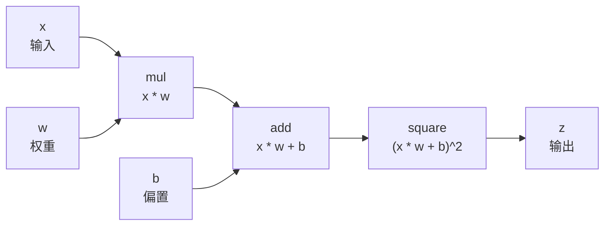
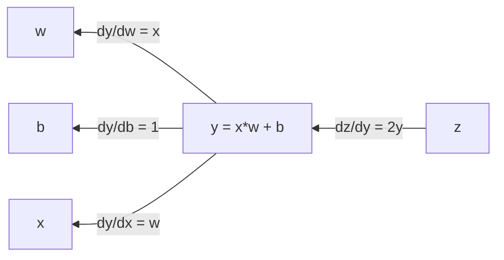
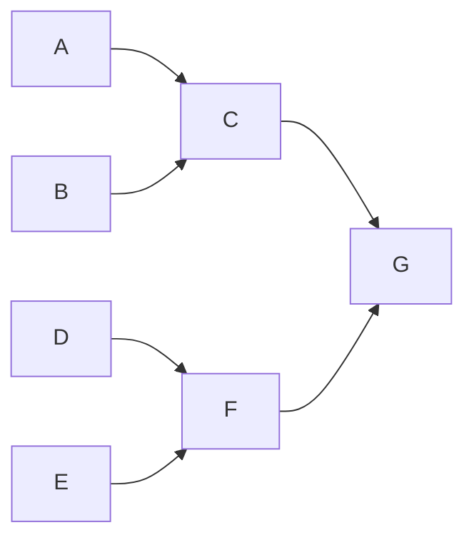
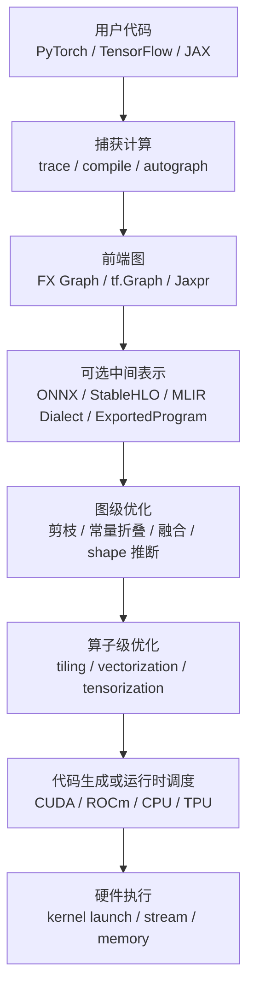
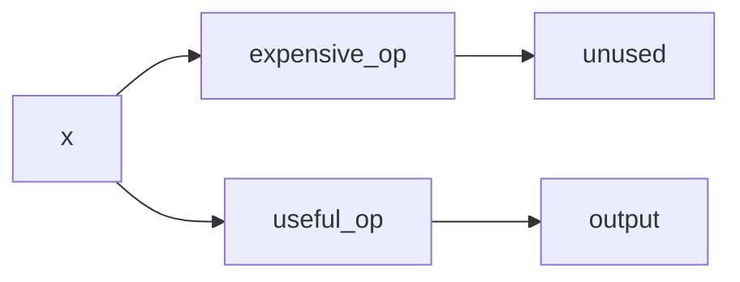
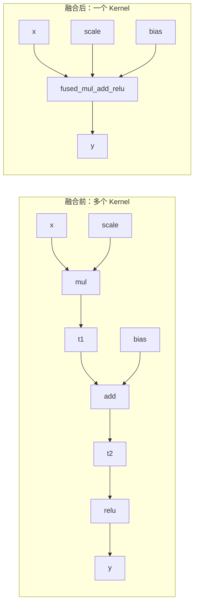

> **核心命题**：计算图不是把代码画成流程图，而是把一次数值计算表达成“算子与张量依赖”的数据结构。有了这种结构化表示，训练框架可以结合算子梯度规则做自动求导，运行时和编译器也可以分析依赖、安排执行顺序、复用内存、跨设备调度，并把一串零散算子优化成更接近硬件的高效执行计划。

很多人第一次听到“计算图”时，会把它理解成神经网络结构图：输入层、隐藏层、输出层，箭头表示数据流。这个理解不算错，但太窄了。

在深度学习框架里，计算图更接近一种**程序的中间表示（Intermediate Representation, IR）**：它记录“哪些计算要做、输入输出是什么、数据依赖是什么”，但不一定记录 Python 代码本身。换句话说，计算图是框架和编译器看懂模型的方式。

本文讨论的是深度学习和数值计算里的计算图，不是图数据库，也不是图神经网络里的“图数据”。

## 一、什么是计算图？

一句话定义：

> **计算图是一个用节点、值和边描述计算及其依赖关系的数据结构。**

在多数深度学习框架里：

1. **节点（Node / Operation）** 通常表示算子调用，例如 matmul、add、relu。
2. **值（Value / Tensor）** 表示输入、输出、参数、常量或中间张量。
3. **边（Edge）** 表示值在算子之间的流动，或者表示控制依赖。
4. **拓扑顺序（Topological Order）** 用于描述哪些节点必须先算、哪些节点可以并行算；对循环和控制流，框架通常会引入专门的控制流节点、region 或子图表示。
5. **输出值** 通常是 loss、logits、embedding、预测结果或某个中间特征。

不同 IR 的具体建模方式不完全相同。例如 TensorFlow 文档把 `tf.Operation` 视为计算单元、`tf.Tensor` 视为在运算之间流动的数据单元；ONNX 图中的节点是算子或本地函数调用，输入输出是具名值；MLIR 则明确把 Operations 看成节点、Values 看成边。本文后面为了易读，会统一用“节点”和“边”泛称这些结构。

看一个最小例子：

$$
z = (x \cdot w + b)^2
$$

它对应的计算图可以写成：



这个图表达的不是“代码长什么样”，而是“数据如何被一步步计算出来”。只要有了这张图，运行时就可以顺着箭头做前向计算；如果框架还为这些算子定义了梯度规则，就可以反过来用链式法则做反向传播。

## 二、计算图和普通代码有什么区别？

普通 Python 代码是立即执行的：

```python
z = (x * w + b) ** 2
```

解释器看到一行就执行一行，执行完后通常只留下结果。计算图则会把这段计算记录成结构化对象：

```text
mul(x, w) -> add(mul, b) -> square(add) -> z
```

这个结构化对象带来一个关键变化：**在静态图或编译捕获模式下，框架可以在执行前观察一段计算；在 PyTorch eager 这类动态图模式下，框架则是一边执行前向计算，一边记录后续反向传播所需的图。**

这就是计算图的价值。程序一旦变成图，就不再只是“执行”，还可以被分析、重写、切分、调度、保存和迁移。

## 三、为什么深度学习离不开计算图？

计算图至少解决了五类核心问题。

### 1. 自动求导

训练神经网络时，我们最终要更新参数：

$$
w \leftarrow w - \eta \frac{\partial L}{\partial w}
$$

问题是，真实模型可能有数百层、上千个算子、数十亿参数。人工推导每个参数的梯度既不现实，也极易出错。

在具备自动微分系统和算子梯度规则的训练框架里，计算图让框架可以自动应用链式法则。以前面的标量例子为例：

$$
y = x \cdot w + b
$$

$$
z = y^2
$$

反向传播从输出开始：

$$
\frac{\partial z}{\partial y} = 2y
$$

$$
\frac{\partial y}{\partial w} = x
$$

所以：

$$
\frac{\partial z}{\partial w}
= \frac{\partial z}{\partial y} \cdot \frac{\partial y}{\partial w}
= 2y \cdot x
$$

这个过程对应的就是沿着计算图反向遍历。



深度学习常用的是**反向模式自动微分（Reverse-mode AD）**，因为模型通常是“很多参数输入，少量标量 loss 输出”。从一个 loss 反向传播，可以一次性得到大量参数的梯度。

### 2. 执行调度

计算图天然暴露依赖关系：



如果 `C` 依赖 `A` 和 `B`，那 `A` 与 `B` 可以并行；如果 `G` 同时依赖 `C` 和 `F`，那 `C` 与 `F` 也可能并行。运行时和编译器可以结合这些依赖关系、设备放置策略和硬件能力，把计算安排到 CPU、GPU、TPU 或多个设备上。

### 3. 内存管理

在静态图、编译图或 autograd 记录中，依赖关系能帮助运行时或编译器判断：一个中间张量什么时候被创建、什么时候最后一次被使用、什么时候可以释放或复用。这个信息对 GPU 显存尤其重要。

比如：

```text
a = f(x)
b = g(a)
c = h(b)
```

如果后面不再需要 `a`，运行时就有机会释放或复用 `a` 的内存。训练时还要额外考虑反向传播需要保存哪些中间激活值，哪些可以通过重计算换显存。

### 4. 模型序列化与跨平台部署

如果模型只是一段 Python 代码，那么部署环境必须理解 Python、框架版本和全部动态控制逻辑。计算图则可以被导出、保存，或被降低到更通用的表示，例如 TensorFlow SavedModel、ONNX、`torch.export` 的 ExportedProgram、StableHLO 等。

这让模型可以从训练框架迁移到推理引擎、移动端、浏览器、数据库内推理或专用加速器上。

### 5. 编译优化

编译器只有看到足够大的计算范围，才知道哪些算子可以合并，哪些中间结果没必要写回显存，哪些形状可以静态推断，哪些静态可判定的分支不会影响输出。

计算图就是深度学习编译器的优化入口。

## 四、静态图与动态图

计算图大体可以分成**静态图**、**动态图**，以及二者之间的**混合模式**。

| 类型 | 代表方式 | 特点 | 优点 | 代价 |
| --- | --- | --- | --- | --- |
| 静态图或捕获图 | TensorFlow `tf.Graph` / SavedModel、XLA/JAX 的编译视角 | 先捕获/构建一段图，再由运行时或编译器执行 | 便于全局优化、部署、跨设备调度 | 调试和动态控制流更麻烦 |
| 动态图 | PyTorch eager mode | 边执行边构图 | 直观、容易调试、天然支持 Python 控制流 | 全局优化视野较小 |
| 混合模式 | PyTorch 2 `torch.compile`、TensorFlow 2 `tf.function` | 平时像动态图，关键路径捕获成图 | 兼顾易用性和性能 | 可能出现 graph break、retrace、shape specialization 等问题 |

动态图并不是“没有图”。以 PyTorch 为例，前向执行时 autograd 会同步构建用于反向传播的图；每次迭代都会重新构建，因此可以自然支持不同分支、不同循环次数和不同输入形状。

静态图也不是“不能动态”。现代框架通常会把控制流、动态 shape、函数调用等转换成更复杂的图表示，只是它们需要更多编译器和运行时机制来支撑。

## 五、计算图从代码到执行的大致链路

现代深度学习框架通常会经历这条链路：



不同框架的名字不同，但思路相近：先把高层模型表达成图，再逐步降低到硬件可以高效执行的形式。

## 六、计算图有哪些优化方式？

计算图优化可以分成两大层次：

1. **图级优化**：改变算子之间的结构关系。
2. **算子级优化**：优化单个算子或融合算子的底层实现。

下面按工程中最常见的优化方式拆开看。

### 1. 死节点删除：不影响输出就不算

如果某些节点对最终输出没有贡献，就可以删除。



这里 `expensive_op` 的结果没有流向输出，也没有可观察副作用，就可以从图中剪掉。TensorFlow Grappler 里就有类似的 pruning optimizer。

注意：不是所有“看起来没用”的节点都能删。如果节点有 I/O、断言、随机数状态、变量写入、调试输出等副作用，优化器必须保守处理。

### 2. 常量折叠：编译期能算完就提前算

如果一段子图只依赖常量，运行时就没有必要重复计算。

```text
y = x * (2 + 3)
```

可以改成：

```text
y = x * 5
```

这类优化看起来简单，但在大模型里很常见：固定 shape 计算、固定 mask、固定位置编码片段、固定缩放系数，都可能被提前计算或缓存。

### 3. 公共子表达式消除：相同计算只做一次

如果图里出现重复子图：

```text
a = x * w
b = x * w
y = a + b
```

优化后可以变成：

```text
t = x * w
y = t + t
```

这叫 **Common Subexpression Elimination, CSE**。它减少重复计算，但要确保两个子表达式真的等价，尤其要小心随机数、状态读写和浮点数精度差异。

### 4. 代数化简：用更便宜的等价表达式

在实数数学里，常见规则包括：

| 原表达式 | 可优化为 | 安全条件 |
| --- | --- | --- |
| `x + 0` | `x` | 通常安全，但严格 IEEE 浮点下仍要考虑 signed zero 等细节 |
| `x * 1` | `x` | 通常安全 |
| `x * 0` | `0` | 只在允许忽略 `NaN`、`inf` 等 IEEE 特例时安全；默认不能随便做 |
| `reshape(reshape(x))` | `reshape(x)` | shape 语义一致，且不改变 layout/alias 约束 |
| `transpose(transpose(x))` | `x` | 维度排列互为逆变换 |
| `log(exp(x))` | `x` | 只有在不会溢出、不会改变 `NaN`/`inf` 语义时才安全 |

代数化简的难点不在规则，而在“什么时候规则是安全的”。浮点数有 `NaN`、`inf`、舍入误差和溢出，数学上等价的式子在机器上不一定完全等价。

### 5. 算子融合：少读写一次显存就是巨大收益

算子融合是深度学习编译器最重要的优化之一。

假设有一串 elementwise 计算：

```text
y = relu(x * scale + bias)
```

如果拆成三个 kernel：

```text
mul -> add -> relu
```

GPU 需要多次读写 HBM 显存：

```text
读 x, scale -> 写 t1
读 t1, bias -> 写 t2
读 t2 -> 写 y
```

融合后可以变成一个 kernel：

```text
读 x, scale, bias -> 寄存器里完成 mul/add/relu -> 写 y
```



融合的收益主要来自三点：

1. 减少 kernel launch 开销。
2. 减少中间张量写回和读回。
3. 增加编译器做寄存器、共享内存和向量化优化的空间。

但融合不是越多越好。融合过度可能增加寄存器压力，降低 occupancy，甚至让性能变差。

### 6. 布局优化：让数据排布适合硬件

同一个张量可以有不同内存布局：

```text
NCHW: batch, channel, height, width
NHWC: batch, height, width, channel
```

不同硬件、不同算子对布局的偏好不同。卷积、矩阵乘、注意力、归一化对内存连续性和向量化方式都有要求。

布局优化会尝试：

1. 选择更适合目标硬件的 layout。
2. 消除多余的 transpose。
3. 把 layout 转换移动到更便宜的位置。
4. 让相邻算子共享同一种布局，避免来回转换。

很多模型部署后性能差，不是因为模型本身慢，而是因为图里夹杂了大量隐式 layout conversion。

### 7. Shape 推断与特化：知道形状，优化才有抓手

如果编译器知道张量 shape，就能做更多事情：

1. 提前计算输出大小。
2. 选择更合适的 kernel。
3. 分配更精确的内存。
4. 展开循环或做 tiling。
5. 避免运行时 shape 检查。

问题是，真实业务常常有动态 batch、动态序列长度、动态图片尺寸。于是框架会在“通用性”和“性能”之间权衡：

1. **完全动态**：适配性强，但优化空间小。
2. **静态特化**：性能好，但换 shape 可能重新编译。
3. **有限动态**：例如按长度分桶、固定若干常用 shape，兼顾吞吐和编译成本。

LLM 推理里的 prompt 长度分桶、图像模型里的固定输入尺寸，本质上都是在给编译器和运行时制造更稳定的 shape。

### 8. 内存优化：少存、复用、必要时重算

训练时，前向传播需要保存中间激活值给反向传播使用。模型越深，保存的激活越多，显存压力越大。

静态/编译图、autograd 保存信息和运行时内存规划可以支持几类内存优化：

| 优化方式 | 思路 | 代价 |
| --- | --- | --- |
| 生命周期分析 | 最后一次使用后释放张量 | 需要准确分析依赖 |
| Buffer 复用 | 不重叠生命周期的张量共用内存 | 需要处理别名和原地写 |
| 原地计算 | 直接覆盖输入或中间结果 | 可能破坏 autograd |
| Activation Checkpointing | 不保存部分激活，反向时重算 | 增加计算量 |
| Offload | 把部分张量移到 CPU 或 NVMe | 增加数据搬运延迟 |

这些依赖信息让运行时或编译器更容易看见“谁还会被用到”。缺少这个视野时，内存优化会更依赖人工经验、局部启发式和通用内存分配器。

### 9. 精度优化：用更便宜的数据类型计算

常见精度优化包括：

1. FP32 计算使用 TF32 Tensor Core，或将数据与计算改为 BF16 / FP16。
2. FP16 / BF16 mixed precision training。
3. INT8 / INT4 weight-only quantization。
4. FP8 training 或 inference。

精度优化通常会同时降低计算量、显存占用和带宽压力。但它不是纯图结构优化，还涉及数值稳定性、校准数据、量化误差、硬件支持和 kernel 实现。

在计算图层面，优化器需要决定：

1. 哪些节点可以低精度。
2. 哪些节点必须保持高精度，例如 softmax、归一化、loss 缩放相关计算。
3. 哪里需要插入 cast。
4. 哪些 cast 可以被消除或融合。

### 10. 自动微分相关优化：别让无关子图进入反向传播

反向图也需要优化。常见做法包括：

1. 冻结参数时关闭对应梯度。
2. 推理时使用 `no_grad`、`inference_mode` 或等价机制。
3. 对不需要梯度的张量及时 `detach`。
4. 自定义梯度，避免保存过多中间结果。
5. 避免把无效计算先记入图、再用 mask 丢弃结果。

最后一点很容易踩坑。例如除零、非法 `log`、无效 `sqrt` 即使最后被 mask 掉，也可能已经进入反向图，导致梯度出现 `NaN`。更稳妥的做法是在危险操作发生前就做条件过滤。

### 11. 调度与设备放置：让计算和数据在正确位置发生

计算图还可以用于决定：

1. 哪些算子放 CPU，哪些放 GPU。
2. 多个 GPU 之间如何切分计算。
3. 通信和计算能否重叠。
4. AllReduce、AllGather、ReduceScatter 是否可以合并或提前。
5. pipeline parallel、tensor parallel、data parallel 如何插入通信节点。

在分布式训练中，性能瓶颈经常不是单个算子，而是计算图里的通信边。优化目标也从“少算一点”扩展为“少同步、少等待、少跨设备搬运”。

### 12. 输入与批处理优化：稳定图形状，提升吞吐

计算图再好，如果输入形状极度发散，也会带来 retrace、recompile、padding 浪费和 kernel 选择不稳定。

常见工程手段包括：

1. 对序列长度做 bucketing。
2. 对图片尺寸做固定或分档。
3. 使用 dynamic batching。
4. 把小请求合批，减少单次执行开销。
5. 为高频 shape 预热编译缓存。

这类优化不一定发生在图内部，但会极大影响图执行效率。

## 七、什么时候计算图反而会带来问题？

计算图不是银弹。常见问题有几个。

**第一，构图和编译本身有成本。**

如果函数很小、只执行一次，构图成本可能超过优化收益。图编译通常适合重复执行、结构稳定、计算密集的路径。

**第二，动态图捕获可能出现 graph break。**

Python 副作用、动态类型、无法追踪的控制流、依赖外部对象的逻辑，都可能导致编译器中断图捕获。表面上用了编译模式，实际图被切碎，优化空间就小了。

**第三，动态 shape 可能导致频繁重新编译。**

如果每次输入形状都不同，框架可能不断为新 shape 生成新图。线上服务要特别关注编译缓存命中率。

**第四，数值等价不等于工程等价。**

代数化简、融合、低精度转换都可能改变浮点计算顺序。结果通常在误差范围内等价，但对极端输入、训练稳定性或严格可复现任务可能有影响。

**第五，优化可能影响可调试性。**

节点被融合、重排或删除后，报错位置和用户代码不再一一对应。性能优化和可观测性之间需要权衡。

## 八、排查和优化计算图的实用清单

如果你面对一个慢模型，可以按下面顺序排查。

### 训练阶段

1. 看 profiler，确认瓶颈是算子、数据加载、通信还是显存。
2. 检查是否有意外 graph break 或 retrace。
3. 保持输入 shape 尽量稳定，必要时做 bucketing。
4. 推理或验证阶段关闭梯度。
5. 对深模型尝试 activation checkpointing。
6. 对 GPU 训练开启混合精度，并监控 loss scale 和 `NaN`。
7. 分布式训练里重点看通信等待时间，而不只看算子耗时。

### 推理阶段

1. 固定常用 shape，预热编译缓存。
2. 尝试 `torch.compile`、`tf.function(jit_compile=True)`、XLA、TensorRT、ONNX Runtime 或厂商推理引擎。
3. 检查图里是否有多余 transpose、reshape、cast。
4. 融合 matmul + bias + activation、conv + batchnorm + activation 等常见模式。
5. 使用合适的 batch size，避免 GPU 太空或延迟过高。
6. 对模型做 INT8、INT4 或 FP8 量化时，用真实数据校准和回归验证。
7. 线上关注 P50/P95/P99 延迟、编译缓存命中率、显存峰值和吞吐。

### 部署阶段

1. 选择合适的导出格式，例如 ONNX、SavedModel、`torch.export` / PT2 Archive、StableHLO。TorchScript 在新版 PyTorch 文档中已标记为 deprecated，新项目应优先评估 `torch.export`。
2. 明确目标硬件：CPU、NVIDIA GPU、AMD GPU、TPU、移动端 NPU 的最优图不同。
3. 使用 Netron、框架 profiler 或编译器 dump 查看最终图。
4. 用真实业务输入做 benchmark，不只测随机张量。
5. 对关键输出做数值对齐，避免优化后静默退化。

## 九、总结

计算图的本质，是把“我要怎么计算”从代码执行过程里抽出来，变成一个可以被框架和编译器分析的数据结构。

它的价值可以压缩成三句话：

1. **对训练来说，计算图配合算子梯度规则，让自动求导成为可能。**
2. **对推理来说，计算图让模型可以被导出、部署和跨平台执行。**
3. **对性能来说，计算图给了编译器做全局优化的视野。**

如果只把计算图看成神经网络结构图，就会漏掉它真正重要的系统意义：它是深度学习框架、自动微分系统、模型编译器和硬件运行时之间的共同语言。

理解计算图之后，再看 PyTorch、TensorFlow、JAX、ONNX、XLA、TVM、TensorRT，会发现它们看似风格不同，其实都在回答同一个问题：

> 如何把人类写下的高层数学表达，变成硬件上高效、稳定、可部署的执行计划？

## 术语表

| 术语 | 解释 |
| --- | --- |
| 计算图 | 用节点、值和边表示数值计算及其依赖关系的数据结构。 |
| 节点 | 图中的计算单元，通常是算子调用或函数调用。 |
| 值 | 图中的数据对象，例如输入、输出、参数、常量或中间张量。 |
| 边 | 节点之间的数据依赖或控制依赖，通常表示某个值从生产者流向消费者。 |
| 张量 | 多维数组，是深度学习框架中的核心数据单位。 |
| 算子 | 对张量执行的基本操作，例如 matmul、conv、relu、reshape。 |
| 自动求导 | 框架根据计算图、算子梯度规则和链式法则自动计算梯度的机制。 |
| 反向传播 | 从 loss 出发沿计算图反向传播梯度的算法过程。 |
| 静态图 | 先构建完整计算图，再执行的模式，便于全局优化和部署。 |
| 动态图 | 边执行边构图的模式，调试直观，适合动态控制流。 |
| IR | Intermediate Representation，中间表示，编译器用于分析和优化程序的结构化表示。 |
| Graph Break | 图捕获被无法追踪的代码打断，导致图被切碎的现象。 |
| Retrace | 框架因输入签名、shape 或 Python 对象变化而重新追踪生成图。 |
| 常量折叠 | 在编译期提前计算只依赖常量的子图。 |
| 算子融合 | 将多个相邻算子合并成一个更高效的算子或 kernel。 |
| Shape 推断 | 根据输入和算子规则推导中间张量及输出张量形状。 |
| Activation Checkpointing | 训练时少保存部分激活，反向传播时重算，以计算换显存。 |
| Layout | 张量在内存中的维度排列方式，例如 NCHW、NHWC。 |
| Kernel | 在 CPU、GPU 或其他加速器上执行的底层计算函数。 |
| XLA | Accelerated Linear Algebra，面向线性代数和机器学习的编译器。 |
| ONNX | Open Neural Network Exchange，一种可移植的模型和计算图表示规范。 |
| ExportedProgram | `torch.export` 生成的 PyTorch 图表示，可保存、加载并用于后续部署链路。 |

## 参考文献

1. TensorFlow Core, 计算图和 `tf.function` 简介, <https://tensorflow.google.cn/guide/intro_to_graphs?hl=zh-cn>
2. TensorFlow Core, TensorFlow graph optimization with Grappler, <https://tensorflow.google.cn/guide/graph_optimization?hl=en>
3. PyTorch Documentation, Autograd mechanics, <https://docs.pytorch.org/docs/main/notes/autograd.html>
4. PyTorch Tutorials, Automatic Differentiation with `torch.autograd`, <https://docs.pytorch.org/tutorials/beginner/basics/autogradqs_tutorial.html>
5. PyTorch Documentation, `torch.export`, <https://docs.pytorch.org/docs/main/user_guide/torch_compiler/export.html>
6. PyTorch Documentation, `torch.compile` Troubleshooting, <https://docs.pytorch.org/docs/main/user_guide/torch_compiler/torch.compiler_troubleshooting.html>
7. PyTorch Documentation, TorchScript, <https://docs.pytorch.org/docs/2.9/jit.html>
8. PyTorch Documentation, CUDA semantics: TensorFloat-32, <https://docs.pytorch.org/docs/main/notes/cuda.html>
9. PyTorch Blog, Current and New Activation Checkpointing Techniques in PyTorch, <https://pytorch.org/blog/activation-checkpointing-techniques/>
10. OpenXLA Project, XLA Architecture, <https://openxla.org/xla/architecture>
11. OpenXLA Project, XLA: GPU Architecture Overview, <https://openxla.org/xla/gpu_architecture>
12. ONNX Documentation, Open Neural Network Exchange Intermediate Representation Specification, <https://onnx.ai/onnx/repo-docs/IR.html>
13. Tianqi Chen et al., TVM: An Automated End-to-End Optimizing Compiler for Deep Learning, <https://arxiv.org/abs/1802.04799>
14. MLIR Project, MLIR Language Reference, <https://mlir.llvm.org/docs/LangRef/>
