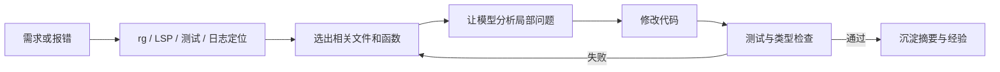
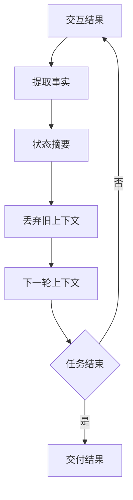

> **核心观点**：开发中使用大模型，真正要优化的不是“尽量少用 token”，而是**让每个 token 承载更高的信息密度**。不要把大模型当成一个无限便宜的搜索框，而要把它当成一个需要预算、缓存、分层调度和可观测性的工程组件。

现在用大模型写代码，体验已经很接近“开一个懂项目的结对程序员”。问题也随之变得现实：上下文越塞越长，Agent 越跑越久，一次复杂任务下来，token 消耗可能比预期高很多。

如果只看单价，很容易陷入两个误区：

- 只追求最便宜的模型，最后因为返工、误改和调试消耗更多；
- 只使用最强的模型，把大量简单任务也交给昂贵推理完成。

更合理的思路是：**把 token 当成软件工程里的运行成本来管理**。它应该被拆分、计量、缓存、复用，并且根据任务价值选择不同模型。

## 一、Token 成本主要花在哪里

文本模型请求的 token 账单通常可以粗略拆成三类；除此之外，部分内置工具还会有独立的调用或资源费用：

| 类型 | 例子 | 成本特征 |
|------|------|----------|
| 输入 token | 需求、代码、日志、文档、历史对话 | 上下文越长越贵，可通过检索和缓存优化 |
| 缓存命中 / 读取输入 token | 重复出现的系统提示、项目规则、接口定义 | 命中缓存后通常更便宜，也更快；首次缓存写入不一定更便宜 |
| 输出 token | 模型生成的解释、代码、计划、测试 | 往往比输入更贵，应限制冗余输出 |

开发场景里最浪费的不是“问了一个问题”，而是以下几种情况：

- 每次都把整个仓库或大量无关文件塞给模型；
- 让模型反复输出完整文件，而不是只输出修改点；
- 多轮对话里不断累积已经过时的上下文；
- 简单格式化、搜索、测试结果解释也使用最强模型；
- 缺少成本日志，不知道钱花在了哪个仓库、任务或用户身上。

一个很实用的成本公式是：

```text
一次请求成本 ≈ 普通输入成本 + 缓存写入 / 命中输入成本 + 输出成本 + 工具调用或资源成本
```

所以优化也应该对应这四个方向：减少普通输入、提高缓存命中、压缩输出、把工具调用放到合适的位置。不同服务商的字段和计费方式会有差异：有的只暴露 `cached_tokens`，有的会区分 cache write 和 cache read；有的工具调用还会叠加单独费用。

## 二、第一原则：先缩小问题，再调用模型

编程任务最常见的浪费，是把“定位问题”和“解决问题”混在一起，让模型在巨大的上下文里盲搜。

更好的流程是先用确定性工具缩小范围：



模型擅长推理、归纳和生成，但不应该替代最便宜、最可靠的本地工具。

例如，遇到一个接口报错时，不要直接把整个服务目录发给模型。可以先做几件事：

- 用 `rg` 搜索接口名、错误码、关键字段；
- 用测试或日志确定失败路径；
- 只提供相关函数、调用链、错误栈和约束；
- 明确告诉模型“只分析这个路径，不要扩展到无关模块”。

这一步的价值很大：上下文越小，模型越不容易迷失，输出也越短。

## 三、按任务分层使用模型

不是所有开发任务都值得调用最强模型。一个实际可用的分层策略是：

| 任务类型 | 推荐模型层级 | 原因 |
|----------|--------------|------|
| 命名、注释、文档润色、简单脚本 | 小模型 | 错误成本低，结果容易检查 |
| 单文件 bug fix、测试补全、局部重构 | 中等模型 | 需要一定代码理解，但上下文有限 |
| 跨模块设计、疑难并发问题、架构取舍 | 强模型 | 判断成本高，返工代价大 |
| 批量代码审查、批量文档生成 | Batch / 异步模式 | 不要求实时返回，适合换取更低成本 |

这里的关键不是“永远用便宜模型”，而是**让强模型只处理强模型真正有价值的部分**。

一个好用的模式是：

1. 小模型先做粗筛：总结报错、列出可疑文件、生成候选方案；
2. 中等模型做局部实现：补测试、改函数、处理边界条件；
3. 强模型只做关键判断：方案是否成立、抽象是否合理、有没有隐藏风险。

这样既能控制成本，也能减少强模型在低价值上下文上消耗注意力。

## 四、让 Prompt 对缓存友好

Prompt caching 的核心思想很简单：如果很多请求共享一段稳定前缀，服务商可以复用之前处理过的上下文，从而降低延迟和成本。OpenAI、Anthropic、Google Gemini 等主流 API 都已经提供了不同形式的缓存能力。

这里有两个边界需要先说清楚：缓存不是“只要重复就一定省钱”，通常还要满足模型支持、最小 token 长度、前缀一致、TTL 或显式缓存配置等条件；而且便宜的一般是缓存命中 / 读取，缓存写入本身可能按普通输入计费，甚至有额外溢价或存储时长费用。

要提高缓存命中率，Prompt 结构应该稳定：

```text
# 稳定前缀：尽量保持完全一致
- 角色与行为规则
- 项目约定
- 输出格式
- 常用接口定义
- 重要架构背景

# 动态部分：每次任务变化
- 当前需求
- 本次相关代码片段
- 错误日志
- 用户补充约束
```

也就是说，**稳定内容放前面，动态内容放后面**。

实际开发中，最容易破坏缓存的是这些细节：

- 在系统提示前部插入当前时间、随机 ID、临时说明；
- 每次用不同顺序拼接项目规则；
- 把动态日志放在静态规则之前；
- 工具列表、格式说明、项目背景频繁变化；
- 为了“更自然”而不断改写同一段提示词。

如果你在做自己的 AI 编程工具，建议把 prompt 构造成几个明确区块，并尽量保证稳定区块字面完全一致。缓存通常依赖前缀匹配或显式缓存对象，前面动得越多，后面越难复用。

## 五、限制输出，不要只盯输入

很多人只盯着输入 token，却忽略输出 token。实际 API 里，输出 token 的单价通常更高，因为模型需要自回归地一个 token 一个 token 生成。不过在超长代码、日志或文档场景里，输入仍可能是总成本大头，所以更准确的做法是同时管住输入和输出。

开发中可以用几条简单规则减少输出浪费：

- 让模型先给结论，再给必要理由；
- 修改代码时优先输出 patch 或关键片段，不要重复贴完整文件；
- 让模型只列高风险问题，不写泛泛的代码风格建议；
- 对日志分析要求“只输出根因、证据、下一步验证”；
- 对代码审查要求“没有问题就明确说没有”，不要强行展开。

例如，代码审查的输出约束可以这样写：

```text
只输出会导致错误行为、数据损坏、安全问题或可观测性缺失的发现。
每个发现必须包含文件位置、触发条件、影响和修复建议。
如果没有发现问题，输出“未发现高风险问题”。
不要总结代码做了什么。
```

这类约束不仅省 token，也会让模型更接近工程审查，而不是写一篇读后感。

## 六、把长任务拆成“状态摘要”

长周期开发任务最容易出现两个问题：

- 上下文持续膨胀，成本越来越高；
- 旧信息、错误假设和已经废弃的方案继续留在对话里，干扰后续判断。

解决办法不是无限扩大上下文，而是定期生成状态摘要。

一个好的状态摘要应该保留：

- 当前目标；
- 已经确认的事实；
- 已经修改的文件；
- 仍然失败的测试或日志；
- 被排除的方向；
- 下一步最小行动。

不应该保留：

- 已经无效的猜测；
- 重复的日志全文；
- 过长的闲聊解释；
- 已经被代码体现的中间推理。

可以把长任务想成一个压缩循环：



这和人类开发时写 TODO、提交说明、排查记录很像。区别只是：在 AI 编程里，它同时也是成本控制手段。

## 七、异步任务不要走实时通道

很多编程任务并不需要马上返回，比如：

- 批量为旧代码补单测；
- 对一批 PR 做审查；
- 给几十个接口生成文档；
- 分析大量静态扫描结果；
- 为历史事故日志做分类总结。

这类任务适合使用 Batch API 或其他异步/低优先级模式。OpenAI 的 Batch API 官方说明中就明确支持异步批处理，并以 50% 成本折扣和独立限流池换取 24 小时完成窗口；如果没有在窗口内完成，batch 会进入 `expired` 状态，未完成请求会被取消。OpenAI Flex Processing 这类服务层级也是类似思路：按 Batch 费率定价，并用更慢响应和偶发资源不可用换取更低成本；它仍是 beta，且模型可用性有限。

实时开发交互应该留给真正需要即时反馈的任务；批量、离线、可重试的工作，则应该进入异步队列。

## 八、建立 Token 可观测性

如果没有日志，成本优化只能靠感觉。

至少应该记录这些字段：

| 字段 | 用途 |
|------|------|
| model | 看不同模型的成本占比 |
| input_tokens | 识别上下文过大的任务 |
| cached_input_tokens | 观察缓存是否命中 |
| output_tokens | 找到话太多的 prompt |
| task_type | 区分 review、debug、test、doc 等任务 |
| repo / project | 按项目归因成本 |
| user / team | 做预算和限流 |
| success / retry_count | 识别返工造成的隐性成本 |

真正有用的指标不是“今天花了多少钱”，而是：

- 每个成功任务平均消耗多少 token；
- 每次合并 PR 平均消耗多少 token；
- 哪些 prompt 输出 token 异常偏高；
- 缓存命中率是否稳定；
- 强模型调用是否集中在高价值任务上。

一旦这些数据可见，很多优化会自然浮现。

## 九、不要为了便宜牺牲安全

开发场景里，prompt 经常包含源代码、接口结构、日志、配置片段、数据库字段，甚至可能意外夹带密钥。所谓“低价中转 API”“共享账号”“不明代理”看起来能省钱，但风险很高：

- 代码和业务上下文可能被记录；
- 模型可能被替换成更便宜的版本；
- 请求和响应可能被用于二次训练或转卖；
- 没有稳定的数据处理协议和审计能力。

如果是个人玩具项目，风险可以自己承担；如果是公司代码、客户数据或生产日志，应该优先选择可审计、可签约、可控数据策略的供应商或自建方案。

省 token 是成本优化，泄露代码是安全事故。两者不是一个量级的问题。

## 十、一个实用默认工作流

把上面的原则压缩成开发中的默认流程：

1. 先用本地工具定位：`rg`、测试、类型检查、日志检索。
2. 只把相关上下文给模型：函数、调用链、错误栈、约束。
3. 简单任务用小模型，关键判断用强模型。
4. 稳定提示词放前面，动态任务放后面，在满足供应商缓存条件时提高缓存命中。
5. 要求短输出：结论、证据、patch、验证步骤。
6. 长任务定期摘要，丢弃过期上下文。
7. 批量任务走异步通道。
8. 记录 token 使用，按任务和项目归因。
9. 不通过不可信代理发送代码和日志。

这套流程的目标不是把大模型用得很小气，而是让它像一个工程系统一样可控。

## 结语

大模型编程的成本问题，本质上是上下文管理问题。

当我们把整个仓库、所有历史对话和大量无关日志都塞进 prompt 时，模型当然会变贵，也更容易变笨。相反，如果先定位问题、压缩上下文、复用稳定前缀、限制输出、把任务分层调度，token 成本会明显下降，模型质量也通常会上升。

好的 AI 编程工作流，不是让模型“什么都知道”，而是让它在每一步只看到**足够解决当前问题的信息**。

## 术语表

- **Token**：大模型处理文本的基本单位，可以是一个词、一个字、一个标点或词片段，具体取决于分词器。
- **Prompt**：发送给模型的输入，包括系统规则、用户问题、上下文、代码片段和工具结果等。
- **Prompt Caching / Context Caching**：复用重复输入前缀或显式缓存内容的机制；命中后通常降低延迟和输入 token 成本，但可能涉及缓存写入或存储时长费用。
- **Input Token**：用户发送给模型的输入 token。
- **Output Token**：模型生成的输出 token。
- **Batch API**：将大量非实时请求打包异步执行的 API 模式，通常用更长完成窗口换取更低成本；未在窗口内完成的任务可能过期。
- **Flex Processing**：在支持模型上，以较慢响应和可能的资源不可用为代价，换取更低成本的服务层级。
- **KV Cache**：Transformer 推理中缓存历史 token 的 Key/Value 张量或状态，避免重复计算历史上下文。

## 参考文献

- [OpenAI API Pricing](https://developers.openai.com/api/docs/pricing)
- [OpenAI Prompt Caching](https://developers.openai.com/api/docs/guides/prompt-caching)
- [OpenAI Batch API](https://developers.openai.com/api/docs/guides/batch)
- [OpenAI Flex Processing](https://developers.openai.com/api/docs/guides/flex-processing)
- [Anthropic Prompt Caching](https://docs.anthropic.com/en/docs/build-with-claude/prompt-caching)
- [Anthropic Pricing](https://docs.anthropic.com/en/docs/about-claude/pricing)
- [Gemini API Context Caching](https://ai.google.dev/gemini-api/docs/caching)
- [Gemini API Pricing](https://ai.google.dev/gemini-api/docs/pricing)
