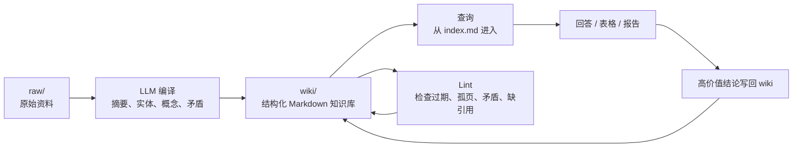

如果你最近看到有人讨论 **LLM Karpathy Knowledge Base**、**LLM Knowledge Bases** 或 **LLM Wiki**，它们大概率指的是同一个东西：Andrej Karpathy 在 2026 年 4 月公开描述的一种用大语言模型维护个人或团队知识库的模式。

它不是一个固定产品，也不是某个官方框架的名字。更准确地说，它是一种工作流：让 LLM 把原始资料持续“编译”成一个结构化、可链接、可维护的 Markdown Wiki。人负责收集资料、提出问题和判断方向；LLM 负责总结、归档、交叉引用、更新索引、标记矛盾和维护日志。

这篇文章试图把这个模式讲清楚：它解决什么问题，和 RAG 有什么不同，应该怎么落地，以及实践中要注意哪些边界。

## 一、它想解决什么问题

我们平时用 LLM 处理资料，常见方式有两种。

第一种是直接把文件丢进聊天窗口，让模型读完后回答问题。它适合一次性任务，但问题是答案留在聊天记录里，下次再问，模型又要重新读、重新总结、重新拼接。

第二种是 RAG，也就是检索增强生成。常见实现会先把文档切块，建立 BM25、向量索引或混合检索索引；用户提问时，再检索相关片段，塞进上下文，让 LLM 生成答案。这比纯聊天强很多，但它仍然有一个明显特点：**知识主要在查询时被临时重组**。

Karpathy 的 LLM Wiki 模式换了一个角度：不要等到提问时才临时检索和综合，而是在资料进入系统时，就让 LLM 把它整理进一个长期存在的 Wiki。



这个模式的关键不在“能不能回答问题”，而在“每次阅读和每次回答是否会沉淀为下一次可继承的结构”。

## 二、核心结构：raw、wiki、schema

Karpathy 在公开 Gist 中把这个模式概括成三层。

### 1. raw：不可变的事实来源

`raw/` 放原始资料，例如论文、网页、访谈记录、会议纪要、截图、PDF、书摘、代码仓库说明等。

这里最重要的规则是：**raw 是 source of truth，LLM 只读，不改**。如果 LLM 编译出来的 Wiki 有问题，应该回到原始资料或修改规则，而不是让模型随手改 raw 文件。

### 2. wiki：LLM 维护的知识层

`wiki/` 放 LLM 编译后的 Markdown 页面，例如：

- source summary：单个资料的摘要
- concept page：跨资料沉淀出来的概念页
- entity page：人、公司、产品、技术、项目等实体页
- synthesis：综合分析页
- decision：决策记录
- contradiction：矛盾和争议记录
- exploration：一次高价值问答或研究结果

这层不是简单“摘要集合”，而是一个会增长、会改写、会交叉链接的知识网络。新资料进入后，LLM 不只创建一篇摘要，还会更新已有概念页、实体页、索引和日志。

### 3. schema：给 Agent 的操作契约

`schema` 是告诉 LLM 如何维护 Wiki 的规则文件。不同工具名称不同：

- Codex 常用 `AGENTS.md`
- Claude Code 常用 `CLAUDE.md`
- 其他 Agent 通常也有自己的规则文件或项目级指令入口

这个文件不应该写成百科全书。OpenAI 在 Codex 工程实践中强调过类似原则：让 Agent 从“小而稳定的入口”开始，再按需进入更深的上下文。放到 LLM Wiki 里，`AGENTS.md` 更适合做地图和操作契约，而不是一份塞满所有知识的长手册。真正的知识应该放进结构化文档里，规则文件只保留目录职责、操作流程、页面格式和质量约束。

## 三、它和 RAG 的真正区别

LLM Wiki 经常被宣传成“替代 RAG”，但这个说法需要限定范围。更准确的说法是：**在个人或小团队规模下，它可以减少对传统检索式 RAG 的依赖；在大规模企业知识库里，它更像是 RAG 上方的一层编译知识层。**

| 维度 | 传统 RAG | Karpathy LLM Wiki |
| :--- | :--- | :--- |
| 知识处理时机 | 查询时检索和拼接 | ingest 时先编译成 Wiki |
| 存储形态 | chunks、全文索引、embeddings、向量索引或混合索引 | Markdown 页面、索引、日志、链接 |
| 是否积累综合结论 | 通常不积累，除非额外设计 | 鼓励把高价值结论写回 |
| 可读性 | 检索索引和向量库不如 Markdown 直接可读 | 人可以直接读、diff、review |
| 矛盾处理 | 容易被回答过程抹平 | 可以显式记录 contradiction |
| 适合规模 | 成熟 RAG 更适合大规模、多源、低延迟检索 | 纯 Markdown 形态更适合个人/小团队/中等规模主题知识库 |
| 主要风险 | 检索失败、chunk 丢上下文 | 编译丢事实、LLM 自我污染 |

成熟 RAG 的强项是规模和检索效率。LLM Wiki 的强项是知识沉淀、可读性和长期维护。两者不是非此即彼。一个成熟系统可以把两者组合起来：

```text
raw sources -> search/PageIndex/RAG as needed -> compiled wiki -> query/lint/writeback
```

小规模时，可以先不用向量数据库；规模变大后，再按瓶颈补工具：Wiki 页面搜索变慢时接入 qmd、BM25 或向量搜索；原始资料是长 PDF 或长文档时引入 PageIndex 这类层级索引；进入企业级场景后，再考虑权限、审计、图数据库和完整 RAG 管线。

## 四、一个可落地的目录结构

如果从零开始，不建议一上来就搭复杂系统。一个兼容 Karpathy 思路和 OpenKB 目录习惯、同时方便后续扩展的起步结构如下：

```text
knowledge_base/
  raw/
    sources/
    assets/
  wiki/
    index.md
    log.md
    current-status.md       # 可选：当前主题状态
    sources/
    summaries/
    concepts/
    entities/               # 可选：人物、产品、组织、项目等实体页
    decisions/              # 可选：决策记录
    contradictions/         # 可选：矛盾和争议记录
    explorations/
    reports/
  AGENTS.md              # schema，也可以按实现放在 wiki/AGENTS.md
```

其中最关键的是 `index.md` 和 `log.md`。

`index.md` 是内容导航。Agent 回答问题前先读它，再进入相关页面，而不是每次扫描所有文件。

`log.md` 是时间线。它记录每次 ingest、query、lint、decision。没有日志，Wiki 很快会失去“发生过什么”的操作记忆。

日志格式可以固定为：

```markdown
## [2026-05-26] ingest | karpathy-llm-wiki

- Source: raw/sources/karpathy-llm-wiki.md
- Updated:
  - wiki/summaries/karpathy-llm-wiki.md
  - wiki/concepts/compiled-knowledge.md
  - wiki/concepts/rag-vs-llm-wiki.md
- Notes:
  - Added contradiction tracking as a required workflow.
```

页面本身也应该有稳定格式。比如一个概念页可以这样写：

```markdown
---
title: "Compiled Knowledge"
type: concept
status: draft
source_status: source-linked
sources:
  - raw/sources/karpathy-llm-wiki.md
related:
  - concepts/rag.md
  - concepts/agent-memory.md
last_reviewed: 2026-05-26
---

## Summary

...

## Key Claims

...

## Evidence

...

## Contradictions / Open Questions

...

## Related

...
```

## 五、三种日常操作：ingest、query、lint

### 1. Ingest：把新资料编译进 Wiki

Ingest 不是“生成一篇摘要”这么简单。一个好的 ingest 应该至少做这些事：

1. 读取 raw 资料，但不修改 raw。
2. 创建或更新 `wiki/summaries/` 下的资料摘要，并在需要时维护 `wiki/sources/` 下的来源记录或全文转换。
3. 提取关键主张、证据、实体、概念和开放问题。
4. 更新相关 concept/entity 页面，或按 schema 更新综合分析页。
5. 如果新资料和旧资料冲突，显式记录矛盾。
6. 更新 `index.md`。
7. 追加 `log.md`。

一个新资料可能会触碰十来个 Wiki 页面。OpenKB README 的实现说明里就提到，单个来源可能更新 10 到 15 个页面。这不是缺点，正是这个模式的价值所在：新资料不是孤立存放，而是进入已有知识网络。

### 2. Query：从 Wiki 出发，而不是直接回 raw

查询时，推荐让 Agent 先读 `wiki/index.md`，再打开最小必要页面集合。只有当 Wiki 信息不足、引用不清或需要核验时，才回到 raw。

一个好的查询 Prompt 可以是：

```text
Using knowledge_base/wiki/index.md as the entry point, answer:
Karpathy LLM Wiki 和传统 RAG 的差异是什么？

要求：
- 引用你使用的本地 wiki 页面。
- 标记缺少来源的判断。
- 如果产生新的决策、对比或开放问题，先建议是否写回 wiki。
```

真正重要的是最后一条：**高价值答案不要死在聊天记录里**。如果一次问答产出了有复用价值的结论，就应该写回 `decisions/`、`explorations/` 或相关概念页。

### 3. Lint：维护知识库健康

传统 Wiki 最容易死在维护成本上。LLM Wiki 的优势之一，就是让模型承担枯燥的维护工作。

定期 lint 应该检查：

- 是否有孤立页面
- 是否有断链
- 是否有页面太长，需要拆分
- 是否有概念频繁出现但没有独立页面
- 是否有缺少来源的关键判断
- 是否有旧结论被新资料推翻
- 是否有两个页面在同一问题上互相矛盾

Lint 不是可有可无的清洁动作，而是这个系统长期可信的关键。

## 六、最佳实践

### 1. 先用 Markdown 和 Git，不要先买一套基础设施

小规模知识库最重要的是结构和流程，不是技术栈。Markdown 的好处是可读、可 diff、可搜索、可版本控制，不依赖某个厂商。

等到 `index.md` 太大、页面数量过多、查询开始不稳定时，再引入 qmd、BM25、向量检索或图数据库；如果主要问题是长 PDF、长报告、整本书这类原始资料难以一次读完，则优先考虑 PageIndex 或分层摘要。

### 2. raw 永远不可变

这是最重要的边界。`raw/` 是事实来源，`wiki/` 是模型编译出来的中间层。两者混在一起，后续就很难判断一个结论到底来自资料，还是来自模型之前的生成。

### 3. 每个关键结论都要能追溯来源

LLM Wiki 最大的风险是“模型读自己写过的东西，然后把错误当成事实继续扩散”。所以 Wiki 页面必须保留 sources、evidence 或 footnotes。

没有来源的判断可以存在，但应该明确标记为 `source-needed` 或 `unsupported`。

### 4. 明确记录矛盾，不要让模型自动调和

现实资料经常互相冲突。糟糕的模型会把冲突材料揉成一个听起来顺滑的答案；好的知识库应该把冲突暴露出来。

例如：

```text
wiki/contradictions/pricing-assumption-2026-05.md
```

里面记录双方观点、来源、时间、当前判断和待确认问题。

### 5. AGENTS.md 要短

`AGENTS.md` 应该像操作契约：

- 哪些目录只读
- 哪些目录可写
- ingest 怎么做
- query 怎么做
- lint 怎么做
- 页面 frontmatter 长什么样
- 最终回复要报告什么

不要把它写成几千行说明书。规则越长，Agent 越难稳定遵守。

### 6. 长文档要先结构化

长 PDF、长会议记录、整本书，不适合简单粗暴地一次塞给模型。可以先做分层摘要、目录树、章节摘要，再进入 Wiki。OpenKB 使用 PageIndex 处理长 PDF 的方向，本质上就是先把长文档变成可导航结构。

### 7. 重要主题要做 evaluate/refine

2026 年 5 月的一篇 arXiv 预印本 WiCER 专门讨论了一个问题：盲目编译可能会丢关键事实。它提出的思路是 compile、evaluate、refine：先编译，再用诊断问题检查遗漏，最后强制下一轮保留被遗漏的事实。

这还不是行业标准，但对严肃知识库是有用提醒：不要假设第一次编译就是完整的。

## 七、什么时候不该用它

LLM Wiki 不是万能解法。

如果你只有两三篇资料，只想问一个一次性问题，直接把资料放进上下文即可，不需要建 Wiki。

如果资料质量很差，例如会议转写混乱、来源不明、版本冲突严重，不要急着自动编译。LLM 很擅长把烂资料写得像好资料，这反而危险。

如果是法律、医疗、金融、合规等高风险场景，LLM Wiki 可以做辅助整理，但必须有人类审核和严格引用。它不能替你承担事实责任。

如果知识库已经是企业级规模，几千上万文档、多权限、多版本、多语言、多业务线，那么单纯 Markdown Wiki 很快不够。此时应该把它作为“编译知识层”，和搜索、RAG、权限系统、审计系统结合。

## 八、这个模式真正有价值的地方

我认为 Karpathy LLM Knowledge Base 最重要的启发不是“不要 RAG”，而是这句话：

**让知识在使用中复利。**

传统聊天是消耗性的。你问一次，答一次，结果留在会话里，很快消失。

传统 RAG 是可检索的。资料可以被找到，但每次仍然要重新综合。

LLM Wiki 是可积累的。每次 ingest、每次 query、每次 lint，都可能让知识库变得更结构化、更可核验、更适合下一次使用。

这对个人学习、长期研究、项目复盘、技术决策、团队知识沉淀都很有价值。它把 LLM 从“回答机器”往前推了一步：变成一个长期维护知识结构的协作者。

## 术语表

**LLM（Large Language Model）**：大语言模型，例如 GPT、Claude、Gemini 等，能够基于上下文生成文本、代码和结构化内容。

**LLM Wiki**：Karpathy 提出的知识库模式，用 LLM 把 raw 资料持续编译成结构化 Markdown Wiki。

**Knowledge Base**：知识库，用于存放、组织和检索知识的系统。

**RAG（Retrieval-Augmented Generation）**：检索增强生成。模型回答前先从外部知识库检索相关内容，再基于检索结果生成答案。

**raw**：原始资料层，是不可变的事实来源。

**wiki**：LLM 编译后的 Markdown 知识层，由模型维护，人类阅读和审核。

**schema / AGENTS.md / CLAUDE.md**：给 Agent 的规则文件，定义目录、页面格式、ingest/query/lint 流程和质量约束。

**ingest**：把新资料读入并编译进 Wiki 的过程。

**lint**：对知识库做健康检查，发现矛盾、过期、孤页、断链、缺引用等问题。

**writeback**：把高价值问答、决策、分析结果写回知识库，而不是留在聊天记录里。

**provenance**：来源溯源。指每个关键结论应该能追溯到原始资料。

## 参考文献

一手与官方资料：

1. Andrej Karpathy, [LLM Wiki](https://gist.github.com/karpathy/442a6bf555914893e9891c11519de94f), GitHub Gist, 2026-04-04.
2. OpenAI, [Harness engineering: leveraging Codex in an agent-first world](https://openai.com/index/harness-engineering/), 2026-02-11.
3. VectifyAI, [OpenKB: Open LLM Knowledge Base](https://github.com/VectifyAI/OpenKB), GitHub Repository.
4. tobi/qmd, [QMD: Query Markup Documents](https://github.com/tobi/qmd), GitHub Repository.
5. VectifyAI, [PageIndex: Vectorless, Reasoning-based RAG](https://github.com/VectifyAI/PageIndex), GitHub Repository.
6. Juan M. Huerta, [WiCER: Wiki-memory Compile, Evaluate, Refine Iterative Knowledge Compilation for LLM Wiki Systems](https://arxiv.org/abs/2605.07068), arXiv, 2026-05-08.

延伸阅读：

1. Denser.ai, [LLM Wiki: Karpathy's Idea for AI Knowledge Bases](https://denser.ai/blog/llm-wiki-karpathy-knowledge-base/), 2026-04-16.
2. LlmWikis.org, [Designing AGENTS.md and CLAUDE.md](https://llmwikis.org/schema-engineering/agents-md/), 2026-04-27.
