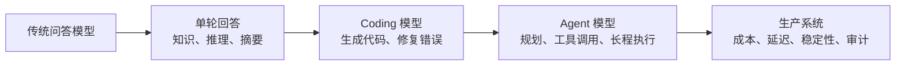

> **核心观点**：截至 2026 年 5 月，国内大模型竞争已经不再只是“谁的参数更多”。真正值得关注的变化有三点：第一，中国模型在开放权重阵营里进入全球前沿；第二，模型能力的主战场从单轮问答转向 Agent、Coding 和长上下文任务；第三，推理工程正在成为模型能否低成本落地的关键。

最近看到一份关于国内大模型的整理，里面把 Artificial Analysis 排行榜、Kimi、DeepSeek、小米 MiMo、SGLang 和 SWA 放在一起讲。它的主线是对的：国内模型正在从“追赶式发布”进入“前沿能力与工程效率同时竞争”的阶段。

但这类文章很容易出现三个问题。

第一，排行榜数字会快速变化，必须标注口径和日期。比如 Artificial Analysis 的 Intelligence Index 是一个文本为主的综合评测，不等于所有场景下的“绝对智商”。

第二，口语里的“开源”、严格意义上的开放源代码、开放权重、可商用、商业受限不能混用。模型能在 Hugging Face 下载，不代表它一定是宽松开源协议。

第三，SGLang、RadixAttention、SWA、KV Cache 优化属于不同层次的东西。SGLang 是推理框架，RadixAttention 是前缀 KV Cache 复用机制，SWA 是模型注意力结构的一种稀疏化方式。把它们混在一起，会误解模型为什么更便宜、更快。

本文基于公开资料重新梳理一遍。

## 一、先看格局：国内模型已经站到开放权重前沿

下面这张表不是永久排行榜，而是**截至 2026-05-27 的公开评测快照**。主要数据来自 Artificial Analysis 模型页，价格采用其页面展示的输入 / 输出 token 价格口径。不同服务商、促销期、缓存命中率都会改变真实成本，因此价格更适合看相对区间，不适合当成固定报价。

| 模型 | 机构 | 开放程度 | 发布时间 | Intelligence Index | 上下文 | 参数规模 | 价格口径 |
|---|---|---:|---:|---:|---:|---:|---:|
| Qwen3.7 Max | 阿里巴巴 | 闭源 API | 2026-05 | 57 | 1M | 未公开 | $2.50 / $7.50 |
| Kimi K2.6 | Moonshot AI | 开放权重，Modified MIT | 2026-04 | 54 | 256K | 1T / 32B active | $0.95 / $4.00 |
| MiMo-V2.5-Pro | 小米 | 开放权重，MIT | 2026-04 | 54 | 1M | 1.02T / 42B active | $1.00 / $3.00 |
| DeepSeek V4 Pro | DeepSeek | 开放权重，MIT | 2026-04 | 52 | 1M | 1.6T / 49B active | $1.74 / $3.48 |
| GLM-5.1 Reasoning | Z AI | 开放权重，MIT | 2026-04 | 51 | 200K | 约 754B / 40B active | $1.40 / $4.40 |
| MiniMax-M2.7 | MiniMax | 开放权重，非商业许可 | 2026-03 | 50 | 205K | 230B / 10B active | $0.30 / $1.20 |
| Qwen3.6 Plus | 阿里巴巴 | 闭源 API | 2026-04 | 50 | 1M | 未公开 | $0.50 / $3.00 |

GLM-5.1 的参数口径略有差异：Hugging Face 模型页显示模型大小为 754B，Artificial Analysis 页面列出 744B total / 40B active。这里按“约 754B / 40B active”处理，不把个位数百分比差异当成能力判断依据。

这里最重要的不是某个模型排第几，而是结构性变化。

国内闭源模型已经能进入全球第一梯队。Qwen3.7 Max 在 Artificial Analysis 上拿到 57 分，是国内闭源模型里非常强的一个代表，并且输出速度很高。

国内开放权重模型也已经逼近闭源前沿。Kimi K2.6、MiMo-V2.5-Pro、DeepSeek V4 Pro、GLM-5.1 这些模型都不是“小模型玩具”，而是数千亿到万亿级 MoE 架构，重点面向 Agent、Coding、长上下文和工具调用。

价格竞争也更复杂了。不能只看每百万 token 的输入价或输出价，还要看缓存命中、推理长度、模型是否啰嗦、失败重试率、工具调用成本。强模型如果一次完成任务，未必比便宜模型贵；便宜模型如果经常失败，也未必便宜。

## 二、为什么现在都是 MoE

这一轮国内前沿开放权重模型大多绕不开 MoE，也就是 Mixture of Experts。

MoE 的核心思路很简单：模型总参数可以很大，但每个 token 只激活其中一部分专家。这样既能提高模型容量，又不会让每次推理都付出全量参数的计算成本。

| 模型 | 总参数 | 每 token 激活参数 | 直观理解 |
|---|---:|---:|---|
| Kimi K2.6 | 1T | 32B | 以 32B 左右的计算量调动万亿级容量 |
| MiMo-V2.5-Pro | 1.02T | 42B | 面向复杂 Agent 和长上下文任务 |
| DeepSeek V4 Pro | 1.6T | 49B | 更大总容量，配合长上下文稀疏注意力 |
| GLM-5.1 | 约 754B | 40B | 面向长程 Agent 和 Coding |
| MiniMax-M2.7 | 230B | 10B | 更强调成本和吞吐 |

MoE 的优势是性价比，代价是系统复杂度。专家路由、专家并行、跨 GPU 通信、负载均衡、显存布局都会变难。也就是说，模型论文里的“1T 参数、只激活 32B”不是白送的收益，它需要非常强的训练系统和推理系统配合。

这也是为什么大模型竞争越来越像系统工程。单纯堆参数不够，谁能把 MoE 在真实服务里跑稳、跑快、跑便宜，谁才有落地优势。

## 三、Agent 化：排行榜背后的真正转向

过去的大模型评测更像考试：数学题、选择题、代码题、知识题。现在的前沿模型越来越强调 Agent 能力：模型要能读文件、写代码、调用工具、浏览网页、改错、反思、继续执行。

Artificial Analysis 的 Intelligence Index v4.0 已经把评测分成 Agent、Coding、General、Scientific Reasoning 四类，每类 25%。其中 GDPval-AA、Terminal-Bench Hard、tau2-Bench Telecom 等任务，都比传统问答更接近“模型能不能完成一段真实工作”。

这会改变模型设计目标。

一个好的 Agent 模型，不能只会回答最后一步。它需要在几十步、上百步工具调用里保持目标一致；需要读懂旧代码和错误日志；需要知道什么时候探索，什么时候收敛；还要控制输出长度和成本。

Kimi K2.6 的官方材料重点强调长程 Coding、Agent Swarm 和多工具执行。MiMo-V2.5-Pro 的模型卡也把复杂 Agent、软件工程和长上下文任务放在核心位置。DeepSeek V4 Pro 则在 1M 上下文和推理模式上做了明显强化。

这说明一个趋势：模型厂商已经不满足于“答得对”，而是在争夺“能不能独立做完事”。

## 四、小米 MiMo 为什么值得单独看

小米做大模型，容易被外界用“硬件公司”“组装厂”这样的刻板印象理解。但从 MiMo-V2.5-Pro 已公开的模型卡看，它不是简单套壳，而是一套完整模型工程。

MiMo-V2.5-Pro 的公开信息包括：

| 维度 | MiMo-V2.5-Pro |
|---|---|
| 架构 | MoE |
| 总参数 | 1.02T |
| 激活参数 | 42B |
| 上下文 | 1M tokens |
| 注意力 | SWA 与 Global Attention 交错 |
| SWA 窗口 | 128 |
| 训练 | 27T tokens，FP8 mixed precision |
| 后训练 | SFT、Agentic RL、Multi-Teacher On-Policy Distillation |
| 协议 | MIT |

最关键的技术点是长上下文效率。MiMo-V2.5-Pro 不是让所有 token 都互相完整注意，而是交错使用 Sliding Window Attention 和 Global Attention。模型卡写到，SWA 与 GA 以 6:1 比例交错，滑动窗口为 128，这能把 KV Cache 存储量降低接近 7 倍，同时保留长上下文能力。

这句话要拆开理解。

SWA 降低的是模型内部注意力需要保留和访问的历史范围。每个 token 不再对所有历史 token 做完整注意，而是主要关注最近窗口内的 token。Global Attention 层负责补回全局信息通道，避免模型只看局部。

这不是 SGLang 独有能力，而是模型结构本身的设计。SGLang、vLLM 这类推理框架负责把模型更高效地服务出来，包括批处理、KV Cache 管理、专家并行、Speculative Decoding、分页显存管理等。

所以更准确的说法是：

**MiMo 的长上下文效率来自模型结构与推理框架的共同作用，而不是单靠 SGLang 或单靠 SWA。**

## 五、SGLang 到底解决什么问题

SGLang 是一个高性能大模型推理框架。它最早由 LMSYS 团队提出，论文题目是 *SGLang: Efficient Execution of Structured Language Model Programs*。它包含两层含义：

| 层次 | 作用 |
|---|---|
| 前端语言 | 用 Python DSL 描述多轮生成、并行、结构化输出、控制流 |
| 后端运行时 | 提供高吞吐推理、KV Cache 复用、批处理、结构化输出加速 |

SGLang 早期最有代表性的优化叫 RadixAttention。它解决的是：复杂 LLM 程序里，大量请求会共享相同前缀，但传统推理系统没有充分复用这些前缀已经计算出来的 KV Cache。

例如，一个 Agent 在同一个项目里反复调用模型，系统提示词、项目规则、工具说明、部分历史上下文都是重复的。如果每次都重新计算这些前缀，就会浪费算力和显存带宽。

RadixAttention 用 Radix Tree 管理 KV Cache。相同前缀可以自动共享，缓存可以插入、查找、淘汰。LMSYS 的博客和论文都强调，这对 few-shot、multi-turn chat、tree-of-thought、agent loop 这类前缀复用明显的工作负载很有价值。

吞吐提升要看具体口径。LMSYS 早期博客在 Llama-7B 和 Mixtral-8x7B 实验中写的是相对 Guidance、vLLM 等系统最高约 5 倍吞吐；SGLang 论文 v2 摘要写的是在多类任务和模型上最高 6.4 倍。它们都不是“任何场景固定提升 5 倍或 6.4 倍”的意思。

需要注意的是，RadixAttention 和 SWA 不是同一个层次：

| 技术 | 所在层次 | 解决的问题 |
|---|---|---|
| SWA | 模型结构 | 单个长序列内部如何减少注意力计算和 KV 存储 |
| RadixAttention | 推理框架 | 多个请求之间如何复用相同前缀的 KV Cache |
| PagedAttention | 推理框架 | 如何像操作系统分页一样管理 KV Cache 显存 |
| Speculative Decoding | 推理框架 / 模型配合 | 如何用草稿模型或 MTP 加速生成 |
| Expert Parallelism | 分布式推理 | MoE 专家如何跨 GPU 调度 |

这也是为什么“推理优化”不能只看一个名词。一个生产级 Agent 服务，可能同时依赖 SWA、PagedAttention、RadixAttention、连续批处理、专家并行、投机解码、CPU / GPU 分层缓存和路由策略。

## 六、DeepSeek、Kimi、MiMo、Qwen 的差异

如果只看榜单分数，这几个模型差距似乎不大。但从产品和技术定位看，它们差异很明显。

### 1. Qwen3.7 Max：闭源前沿与高吞吐

Qwen3.7 Max 是闭源 API 模型，Artificial Analysis 页面显示其 Intelligence Index 为 57，上下文 1M，输出速度约 208 tokens/s。它的意义在于：国内闭源模型已经能在综合评测里进入全球前沿区间。

它适合被看作国内闭源能力上限的代表，但不能放进开放权重模型表。闭源模型的优势通常是服务体验、速度、工具链和统一 API；劣势是权重不可控、私有化部署受限、长期成本和数据治理需要额外评估。

### 2. Kimi K2.6：开放权重 Agent Coding 模型

Kimi K2.6 是 Moonshot 在 2026 年 4 月发布的开放权重模型。Artificial Analysis 显示它是 1T 总参数、32B 激活参数、256K 上下文，Intelligence Index 为 54。Kimi 官方博客把重点放在长程 Coding、Agent Swarm、多工具执行和前端 / 全栈生成上。

它的优势在 Agent 和 Coding 叙事非常清晰：不是只做聊天模型，而是面向长时间、多步骤、多工具的软件工程工作流。

### 3. MiMo-V2.5-Pro：1M 上下文与小米生态入口

MiMo-V2.5-Pro 的特点是 1M 上下文、MIT 协议、1.02T / 42B MoE，以及 SWA + Global Attention 的混合注意力结构。官方模型卡已经明确给出模型权重、长上下文结构和训练/后训练设计；具体到不同推理框架和芯片厂商的适配状态，仍应以各框架和厂商文档为准。

这说明小米做 MiMo 不只是为了发布一个模型排行榜成绩。它更像是在为手机、汽车、IoT、开发者 API 和端云协同准备基础模型能力。真正值得观察的是：MiMo 能不能把开放权重、长上下文、语音、多模态和小米硬件生态连接起来。

### 4. DeepSeek V4 Pro：长上下文效率与开放权重工程延续

DeepSeek V4 Pro 的公开模型卡显示，它是 1.6T 总参数、49B 激活参数，支持 1M 上下文，并采用 CSA 与 HCA 的混合注意力结构。DeepSeek 称在 1M 上下文单 token 推理场景下，V4 Pro 相比 V3.2 只需要 27% FLOPs 和 10% KV Cache。

DeepSeek 的长期优势是工程效率叙事很强：从 V2、V3、R1 到 V4，它一直在强调低成本训练、稀疏结构、推理效率和开放权重。V4 Pro 继续沿着这个方向前进。

## 七、不要把排行榜当成唯一依据

排行榜有用，但它只回答一部分问题。

对于个人开发者或企业选型，更应该问下面几个问题。

| 问题 | 为什么重要 |
|---|---|
| 任务是聊天、Coding、Agent、RAG 还是多模态？ | 不同模型强项差异很大 |
| 上下文是真需要 1M，还是只是心理安全感？ | 长上下文会带来成本、延迟和注意力退化问题 |
| 是否需要私有化部署？ | 闭源 API 和开放权重的治理边界不同 |
| 是否允许商业使用和二次训练？ | Modified MIT、MIT、非商业许可不是一回事 |
| 工具调用失败率如何？ | Agent 场景里，工具调用比单轮回答更关键 |
| 输出是否过长？ | 推理模型啰嗦会直接放大成本 |
| 缓存命中率能否稳定？ | 长系统提示词和项目上下文如果能缓存，成本差异会很大 |
| 是否有 SGLang / vLLM / TensorRT-LLM 等成熟部署路径？ | 没有稳定推理栈，模型再强也难上线 |

尤其是 Agent 场景，真正的成本不是 token 单价，而是任务有效成本：

这里的公式不是严格数学模型，而是一个工程估算口径：

**任务有效成本 = 输入 token + 输出 token + 缓存成本 + 工具调用成本 + 失败重试成本 + 人工复核成本。**

这也是为什么很多模型公司开始强调 Agent 任务完成率、工具调用质量、长程稳定性和 token efficiency。这些指标比单纯“每百万 token 几美元”更接近真实业务。

## 八、结论：国内大模型进入系统工程竞争阶段

把 2026 年 5 月的国内大模型放在一起看，可以得到几个判断。

第一，国内模型已经不是只在中文场景里强，而是在全球通用评测、Coding、Agent、长上下文上进入前沿区间。

第二，开放权重正在成为国内模型的重要竞争策略。Kimi、DeepSeek、MiMo、GLM 等模型让开发者可以自托管、微调、适配推理框架，也让模型能力更快进入工具链和云服务。

第三，MoE 已经成为前沿开放权重模型的主流路线之一。它把模型容量和推理成本拆开，但也把系统复杂度推高。

第四，模型能力和推理工程已经不可分割。SWA、RadixAttention、PagedAttention、专家并行、投机解码、分层缓存都会影响最终可用性。未来的竞争不是“模型研究”和“工程部署”两条线，而是一整套从训练、后训练、推理到产品的系统能力。

所以，如果要概括这轮国内大模型的发展现状，不是简单一句“中国模型变强了”，而是：

**国内大模型正在从能力追赶，进入开放生态、Agent 任务和推理效率共同驱动的新阶段。**

## 术语表

| 术语 | 说明 |
|---|---|
| LLM | Large Language Model，大语言模型 |
| MoE | Mixture of Experts，混合专家架构，每个 token 只激活部分专家 |
| Active Parameters | 激活参数，单次推理中实际参与计算的参数量 |
| Context Window | 上下文窗口，模型一次请求可接收的最大 token 数 |
| Agent | 能规划、调用工具、执行多步骤任务的智能体 |
| SFT | Supervised Fine-Tuning，有监督微调 |
| RL | Reinforcement Learning，强化学习 |
| MOPD | Multi-Teacher On-Policy Distillation，多教师在线策略蒸馏 |
| KV Cache | Attention 中缓存 Key / Value 张量，用来避免重复计算历史上下文 |
| SWA | Sliding Window Attention，滑动窗口注意力，只关注局部窗口内 token |
| Global Attention | 全局注意力，用于补充跨长距离信息通道 |
| RadixAttention | SGLang 提出的基于 Radix Tree 的 KV Cache 前缀复用机制 |
| Radix Tree | 前缀树，适合高效管理共享前缀 |
| PagedAttention | vLLM 提出的分页式 KV Cache 管理方法 |
| Speculative Decoding | 投机解码，用更轻量的草稿预测加速生成 |
| MTP | Multi-Token Prediction，一次预测多个后续 token 的训练或推理机制 |
| GDPval-AA | Artificial Analysis 的真实知识工作 Agent 评测 |
| Terminal-Bench | 面向终端操作和工程任务的 Agent 评测 |
| AA-Omniscience | Artificial Analysis 的知识可靠性和幻觉评测 |

## 参考文献

1. Artificial Analysis, [Comparison of AI Models: Intelligence, Performance & Price Analysis](https://artificialanalysis.ai/models)
2. Artificial Analysis, [Intelligence Benchmarking Methodology](https://artificialanalysis.ai/methodology/intelligence-benchmarking)
3. Artificial Analysis, [Qwen3.7 Max](https://artificialanalysis.ai/models/qwen3-7-max)
4. Artificial Analysis, [Kimi K2.6](https://artificialanalysis.ai/models/kimi-k2-6)
5. Artificial Analysis, [MiMo-V2.5-Pro](https://artificialanalysis.ai/models/mimo-v2-5-pro)
6. Artificial Analysis, [DeepSeek V4 Pro](https://artificialanalysis.ai/models/deepseek-v4-pro)
7. Artificial Analysis, [GLM-5.1](https://artificialanalysis.ai/models/glm-5-1)
8. Artificial Analysis, [MiniMax-M2.7](https://artificialanalysis.ai/models/minimax-m2-7)
9. Artificial Analysis, [Qwen3.6 Plus](https://artificialanalysis.ai/models/qwen3-6-plus)
10. Moonshot AI, [Kimi K2.6: Advancing Open-Source Coding](https://www.kimi.com/blog/kimi-k2-6)
11. Hugging Face, [moonshotai/Kimi-K2.6](https://huggingface.co/moonshotai/Kimi-K2.6)
12. Hugging Face, [XiaomiMiMo/MiMo-V2.5-Pro](https://huggingface.co/XiaomiMiMo/MiMo-V2.5-Pro)
13. Z AI, [GLM-5.1 Developer Documentation](https://docs.z.ai/guides/llm/glm-5.1)
14. Hugging Face, [zai-org/GLM-5.1](https://huggingface.co/zai-org/GLM-5.1)
15. Hugging Face, [MiniMaxAI/MiniMax-M2.7](https://huggingface.co/MiniMaxAI/MiniMax-M2.7)
16. Hugging Face, [MiniMax-M2.7 LICENSE](https://huggingface.co/MiniMaxAI/MiniMax-M2.7/raw/main/LICENSE)
17. Xiaomi MiMo, [Xiaomi MiMo Home](https://mimo.mi.com/)
18. Hugging Face, [deepseek-ai/DeepSeek-V4-Pro](https://huggingface.co/deepseek-ai/DeepSeek-V4-Pro)
19. SGLang, [High-Performance Serving Framework for LLMs and VLMs](https://www.sglang.io/)
20. LMSYS, [Fast and Expressive LLM Inference with RadixAttention and SGLang](https://www.lmsys.org/blog/2024-01-17-sglang/)
21. arXiv, [SGLang: Efficient Execution of Structured Language Model Programs](https://arxiv.org/abs/2312.07104)
22. arXiv, [Efficient Memory Management for Large Language Model Serving with PagedAttention](https://arxiv.org/abs/2309.06180)
