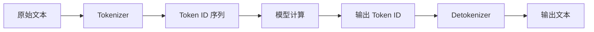

我们平时和大语言模型对话时，输入的是自然语言；模型真正处理和计费的单位却不是“字”“词”或“字符”，而是 `Token`。

理解 Token 机制有两个直接好处：

1. 能判断为什么同一段意思，用中文、英文、日文或代码表达时，消耗可能不一样。
2. 能正确估算 API 成本、上下文窗口占用和生成速度，而不是只看字符数。

这篇文章从机制、语言差异、成本公式和工程实践几个角度，把 Token 这件事讲清楚。

## 1. Token 到底是什么

`Token` 可以理解为模型处理文本时的基本片段。它可能是一个完整单词，也可能是一个词的一部分、一个汉字、一个标点、一个空格，甚至是换行符。



OpenAI 的官方说明里有几个有用的经验值：英文里 `1 token` 大约对应 `4` 个字符，`100 tokens` 大约对应 `75` 个英文单词。但这只是英文经验值；不同模型、不同 tokenizer、不同语言都会有差异。

更准确的说法是：**Token 是 tokenizer 的输出，不是语言学意义上的词。**

例如：

| 文本片段 | 可能的 Token 形式 | 说明 |
|---|---|---|
| `hello` | 一个 token | 高频英文词通常容易合并成整体 |
| `unhappiness` | `un` + `happiness` 或其他子词组合 | 取决于词表和合并规则 |
| `你好` | 一个或两个 token | 取决于 tokenizer 是否学到这个高频片段 |
| `\n\n` | 一个或多个 token | 换行和空白也可能计入 |
| `get_user_profile` | 多个 token | 代码标识符经常按下划线、词片段拆开 |

因此，任何“中文一个字等于几个 token”“英文一个词等于一个 token”的说法，都只能当粗略估算。

## 2. 为什么需要 Tokenizer

神经网络不能直接处理自然语言文本。模型实际接收的是数字 ID 序列，Tokenizer 的工作就是把文本切成 token，再把 token 映射成 ID。

常见分词方式有三类：

| 方法 | 思路 | 优点 | 局限 |
|---|---|---|---|
| 词级分词 | 一个词作为一个 token | 直观，序列较短 | 词表巨大，遇到新词容易 OOV |
| 字符级分词 | 一个字符作为一个 token | 几乎没有 OOV | 序列很长，效率低 |
| 子词分词 | 高频词整体保留，低频词拆成片段 | 词表适中，能处理新词 | 结果不一定符合人类直觉 |

现代 LLM 大多使用子词分词或它的变体。Hugging Face 的 tokenizer 文档把主流子词算法概括为 `BPE`、`Unigram` 和 `WordPiece`：它们把文本切在词和字符之间，让常见词保留为整体，让罕见词拆成可复用的子词片段。

## 3. 几种主流 tokenizer 算法

### 3.1 BPE：合并高频相邻片段

`BPE`，也就是 Byte Pair Encoding，核心思想是从字符或字节开始，反复合并训练语料里最常见的相邻片段。

下面是一个简化示例：

```text
原始文本: "aaaabbaaac"
字符序列: a a a a b b a a a c

相邻字符对统计:
aa = 5
ab = 1
bb = 1
ba = 1
ac = 1

第一轮合并最高频片段 "aa":
a a a a b b a a a c
=> aa aa b b aa a c

Token 数从 10 个字符变成 7 个片段。
```

这里有两个细节容易写错：

1. `"aaaabbaaac"` 里的相邻 `aa` 是 `5` 次，不是 `6` 次。
2. BPE 的真实训练是在整个语料和词频上做，不是只在单个字符串上做一次。

### 3.2 Byte-level BPE：用字节兜底

如果直接把所有 Unicode 字符放进基础词表，词表会非常大。Byte-level BPE 用 256 个字节值作为基础词表，再学习合并规则。这样几乎任何文本都能被编码，不需要把未知字符统一变成 `<unk>`。

GPT-2 使用的就是 byte-level BPE。很多后续模型也沿用了类似思想，但具体词表和合并规则不同。

### 3.3 WordPiece：不只是看频率

`WordPiece` 和 BPE 一样也是自底向上合并片段，但它不是简单合并出现次数最多的 pair，而是倾向于选择能提高训练数据似然的片段。Hugging Face 文档中给出的直观评分形式是：

```text
score(x, y) = frequency(xy) / (frequency(x) * frequency(y))
```

这意味着 WordPiece 更偏好“两个片段一起出现的关联程度高”的组合，而不是只看绝对频率。

### 3.4 SentencePiece：直接从原始文本训练

`SentencePiece` 是一个开源 tokenizer/detokenizer 库，支持 BPE 和 Unigram 等子词算法。它的重要特点不是“专门为某一种语言分词”，而是可以直接从原始句子训练，不强制要求先用语言相关工具做预分词。

这对中文、日文这类没有显式空格分隔的语言很重要。SentencePiece 会把句子当作 Unicode 字符序列处理，空格也作为普通符号参与建模，常见写法是用 `▁` 表示空格。

### 3.5 不要把 Jieba 和 LLM Tokenizer 混为一谈

`Jieba` 是中文分词工具，常用于搜索、关键词提取、传统 NLP 等场景。它和 LLM 的 tokenizer 不是一回事。

闭源模型的 tokenizer 通常在模型训练前就已经固定。你不能通过给 Jieba 加自定义词典来改变 GPT、Claude、Gemini 或 DeepSeek API 的 token 计费方式。Jieba 可以帮助你做文本预处理，但不能替代模型自己的 tokenizer。

## 4. 为什么不同语言 Token 消耗不同

语言差异来自几个方面：

| 角度 | 英文 | 中文、日文、韩文等 |
|---|---|---|
| 词边界 | 空格天然分隔单词 | 中文、日文通常没有空格边界 |
| 字符系统 | 字母数量少，组合成词 | 字符集大，CJK 字符很多 |
| 训练语料 | 很多 tokenizer 对英文覆盖充分 | 覆盖程度取决于训练语料和词表设计 |
| 高频片段 | `the`、`is`、`ing` 等容易成为高效 token | 常见词可能高效，生僻字和新词可能拆得更碎 |

这并不意味着“中文一定永远比英文贵 2 倍”。更准确的结论是：

> 在同等语义内容下，非英文文本，特别是 CJK 文本，在不少 tokenizer 中会出现 token 溢价；但具体倍率取决于模型、tokenizer、文本领域和写法。

例如，普通中文口语、技术文档、古文、网络热词、生僻字、人名地名，token 消耗会很不一样。代码也是类似：短关键字可能很省 token，但长标识符、路径、JSON、日志和大量标点会显著增加 token 数。

## 5. 怎么正确测 Token 数

最可靠的方法是使用目标模型对应的 tokenizer 或官方 token counting API。

OpenAI 模型可以用 `tiktoken` 做本地估算：

```python
import tiktoken

model = "gpt-4o"  # 替换成你实际使用且 tiktoken 支持的模型名
enc = tiktoken.encoding_for_model(model)

samples = [
    "Hello, world!",
    "你好，世界！",
    "人工智能正在改变软件开发。",
    "def get_user_profile(user_id): return db.get(user_id)",
]

for text in samples:
    print(text, len(enc.encode(text)))
```

这个代码块的重点不是记住某个固定结果，而是建立一个习惯：**不要靠字符数猜成本，直接用目标 tokenizer 测。**

如果你使用 Claude、Gemini、DeepSeek 或其他模型，也应该优先看对应厂商的 token counting 工具、API 返回的 usage 字段，或者官方文档说明。

## 6. Token 如何影响成本

API 计费一般分为输入 token、输出 token、缓存 token，有些推理模型还会有内部 reasoning tokens。OpenAI 官方帮助文档也明确把 token usage 分为 input、output、cached、reasoning 等类别。

所以成本不能写成“总 tokens × 单一价格”。更稳妥的公式是：

```text
成本 =
  uncached_input_tokens * input_price        / 1_000_000
+ cache_read_tokens     * cache_read_price   / 1_000_000
+ cache_write_tokens    * cache_write_price  / 1_000_000
+ output_tokens         * output_price       / 1_000_000
+ cache_storage_fee
+ 其他工具/运行时费用
```

这里的 `uncached_input_tokens` 指没有命中缓存、按标准输入价计费的输入 token。`cache_read_tokens` 指从缓存读取的 token，`cache_write_tokens` 指首次写入缓存的 token。不同厂商的 usage 字段命名不同：有些会把缓存命中的 token 包在总 input/prompt tokens 里，再用明细字段标出 cached tokens。做成本核算时要先按厂商定义拆分，避免把缓存 token 双算。

缓存计费也不是所有厂商都一样。OpenAI 的公开价格表直接列出 cached input 单价；Anthropic 的 prompt caching 有 cache write 和 cache read 两类倍率；Gemini 的 context caching 还可能有按小时计算的 storage price。因此，严谨核算时不能只看“缓存命中 token 更便宜”，还要看是否有写入费和存储费。

如果没有缓存和工具，只看文本模型：

```text
成本 = input_tokens * input_price / 1_000_000
     + output_tokens * output_price / 1_000_000
```

推理模型还要额外注意 `reasoning_tokens`：它们可能不直接显示在最终文本里，但通常会体现在 usage 明细和计费 token 中。具体应以目标厂商返回的 usage 字段和计费说明为准。

如果比较同等语义内容的不同语言，并假设某语言输入和输出都是英文 token 数的 `r` 倍：

```text
语言成本 = r * english_input_tokens  * input_price  / 1_000_000
         + r * english_output_tokens * output_price / 1_000_000
```

这个 `r` 必须来自实际测量或保守估算，不能写死成某个固定值。

## 7. 价格示例：按输入和输出分别算

下面价格只作为截至 `2026-05-27` 的公开示例，实际使用必须以厂商官方页面为准。

| 厂商/模型 | 输入价格 | 输出价格 | 备注 |
|---|---:|---:|---|
| OpenAI GPT-5.4 | $2.50 / 1M tokens | $15.00 / 1M tokens | 标准处理价格，缓存输入另计 |
| OpenAI GPT-5.4 mini | $0.75 / 1M tokens | $4.50 / 1M tokens | 标准处理价格，缓存输入另计 |
| Claude Sonnet 4.6 | $3.00 / 1M tokens | $15.00 / 1M tokens | Anthropic 标准价格 |
| Claude Haiku 4.5 | $1.00 / 1M tokens | $5.00 / 1M tokens | Anthropic 标准价格 |
| Gemini 2.5 Pro | $1.25 / 1M tokens | $10.00 / 1M tokens | 标准模式，prompt 不超过 200k tokens |
| DeepSeek V4 Flash | $0.14 / 1M tokens | $0.28 / 1M tokens | DeepSeek 官方价，缓存命中更低 |
| DeepSeek V4 Pro | $0.435 / 1M tokens | $0.87 / 1M tokens | DeepSeek 官方折扣期价格，官方说明促销到 2026-05-31 15:59 UTC |

这张表只列常见文本 token 的标准单价，省略了部分条件。OpenAI 表中 GPT-5.4 系列价格对应官网标注的标准处理、上下文长度低于 270K 的场景；Claude 价格是 Anthropic 第一方 API 的标准价，batch、prompt caching、data residency、fast mode 会改变实际单价；Gemini 2.5 Pro 的输出价包含 thinking tokens，超过 200k prompt tokens 时单价会上调；DeepSeek 价格可能随官方促销和调价变化。

用 OpenAI GPT-5.4 举例，如果一次请求是 `50k input tokens + 50k output tokens`：

```text
输入成本 = 50,000 * 2.50 / 1,000,000 = $0.125
输出成本 = 50,000 * 15.00 / 1,000,000 = $0.750
总成本   = $0.875
```

如果同等语义的中文版本实测是英文的 `1.5` 倍 token：

```text
中文输入成本 = 75,000 * 2.50 / 1,000,000 = $0.1875
中文输出成本 = 75,000 * 15.00 / 1,000,000 = $1.1250
中文总成本   = $1.3125
差额         = $0.4375
```

这个例子说明了一件事：**输出 token 经常比输入 token 贵得多，所以只压缩 prompt 不一定够，控制输出长度同样重要。**

再看一个月度估算。假设每月 `10,000` 次请求，每次英文平均 `100 input tokens + 100 output tokens`，使用 GPT-5.4：

```text
英文月输入 = 10,000 * 100 = 1,000,000 tokens
英文月输出 = 10,000 * 100 = 1,000,000 tokens
英文月成本 = 1 * 2.50 + 1 * 15.00 = $17.50

如果某语言 token 数为 1.5 倍：
月成本 = $17.50 * 1.5 = $26.25
年度差额 = ($26.25 - $17.50) * 12 = $105.00
```

这里的关键不是 `$105` 这个具体数字，而是计算方法：输入、输出分开算，倍率基于同等语义内容测量。

## 8. Token 如何影响速度和上下文

Token 数还会影响两个工程指标：

1. 上下文窗口：一次请求能放进去的输入和输出总量有限。
2. 响应时间：模型通常逐 token 生成输出，输出越长，总耗时越长。

不过，“每秒输出多少 token”不是模型的固定属性。它会受模型大小、推理模式、provider、负载、硬件、量化、推理引擎、输入长度和是否流式输出影响。

看速度榜时至少要区分三个指标：

| 指标 | 含义 | 为什么重要 |
|---|---|---|
| TTFT | Time to First Token，首 token 延迟 | 决定交互场景的第一反应速度 |
| Output tokens/s | 开始输出后每秒生成多少 token | 决定长回答吐字速度 |
| End-to-end time | 从请求发出到完整答案返回 | 同时受 TTFT、reasoning、输出长度影响 |

Artificial Analysis 这类第三方榜单会按 provider 持续测量这些指标。例如它对 DeepSeek V4 Flash 的页面会分别列出 provider 的 output speed、latency 和 blended price，并说明这些是最近窗口内的中位数测量。这样的数据适合做选型参考，但不适合写成永久不变的模型排名。

## 9. 工程实践建议

### 9.1 成本监控

在生产系统里，不要只记录“调用次数”。至少要记录：

| 字段 | 用途 |
|---|---|
| `input_tokens` | 估算输入成本和上下文占用 |
| `output_tokens` | 控制输出成本和响应耗时 |
| `cached_tokens` | 评估缓存收益 |
| `reasoning_tokens` | 观察推理模型的隐藏消耗 |
| `model` | 不同模型价格和 tokenizer 不同 |
| `language` 或 `locale` | 观察多语言 token 溢价 |

### 9.2 Prompt 压缩

优先压缩重复、模板化、低信息密度的内容。比如历史对话、长系统提示词、重复 JSON schema、大段日志。

但不要为了省 token 牺牲关键信息。少给关键上下文导致模型答错，重试成本可能更高。

### 9.3 输出控制

输出成本通常高于输入成本，所以需要明确控制：

```text
请用 5 条以内回答。
请只输出 JSON，不要解释。
请控制在 300 字以内。
```

如果需要长文或长代码，最好分段生成、分段校验，而不是一次要求模型输出上万 token。

### 9.4 多语言产品

多语言产品不要用统一字符数限制来估算成本。更合理的做法是：

1. 用目标模型 tokenizer 对不同语言样本做离线测量。
2. 按语言、场景、文本类型建立 token 预算。
3. 上线后用真实 usage 数据校正估算倍率。

## 10. 常见误区

| 误区 | 更准确的说法 |
|---|---|
| 一个中文字符固定等于 2 tokens | 不固定，取决于 tokenizer 和文本内容 |
| 英文一定最省钱 | 多数英文 tokenizer 效率较高，但要看同等语义内容和模型 |
| 总 tokens 乘一个价格就是成本 | 输入、输出、缓存、推理 token 的价格可能不同 |
| Jieba 自定义词典能降低闭源 LLM API 计费 | 不能改变闭源模型固定 tokenizer |
| 速度榜上的 tokens/s 是模型永久速度 | 它受 provider、负载、输入长度和测量窗口影响 |
| 缓存命中就是免费 | 多数厂商只是降价，且可能有缓存写入或存储费用 |

## 结论

Token 是连接自然语言和模型计算的计量单位。它同时影响上下文长度、API 成本、响应速度和系统设计。

真正可靠的做法不是背一个“中文多少 token、英文多少 token”的固定比例，而是：

1. 用目标模型 tokenizer 实测。
2. 成本按输入、输出、缓存分开计算。
3. 动态价格和速度数据以官方文档或实时榜单为准。
4. 在生产系统里持续记录真实 token usage。

理解 Token 后，很多 LLM 工程问题会变得更清楚：为什么长上下文贵，为什么输出越长越慢，为什么同样意思换一种语言可能成本不同，以及为什么 prompt 设计不是只写得清楚，还要写得经济。

## 术语表

| 术语 | 英文 | 解释 |
|---|---|---|
| Token | Token | 模型处理文本的基本片段，可能是词、子词、字符、标点或空白 |
| Tokenizer | Tokenizer | 把文本切成 token 并映射为 ID 的工具 |
| Tokenization | Tokenization | 文本转 token 的过程 |
| Vocabulary | Vocabulary | tokenizer 可识别 token 的集合 |
| BPE | Byte Pair Encoding | 通过反复合并高频相邻片段学习子词的算法 |
| Byte-level BPE | Byte-level BPE | 以字节作为基础单位的 BPE，常用于避免未知字符问题 |
| WordPiece | WordPiece | BERT 系列常用子词算法，合并规则偏向提升训练数据似然 |
| Unigram | Unigram | 从候选子词集合中基于概率模型选择分词方案的算法 |
| SentencePiece | SentencePiece | 可直接从原始句子训练的开源 tokenizer/detokenizer 库 |
| OOV | Out-of-Vocabulary | 词表外词，传统词级分词常见问题 |
| Context Window | Context Window | 单次请求可处理的输入和输出 token 总上限 |
| TTFT | Time to First Token | 从请求发出到收到第一个 token 的延迟 |
| Output tokens/s | Output tokens per second | 模型开始响应后每秒输出的 token 数 |
| Cached Tokens | Cached Tokens | 被缓存复用的输入 token，通常按更低价格计费 |
| Reasoning Tokens | Reasoning Tokens | 部分推理模型内部用于思考的 token，可能计入用量 |

## 参考文献

1. OpenAI Help Center, "What are tokens and how to count them?" https://help.openai.com/en/articles/4936856-what-are-tokens-and-how-to-count-them
2. OpenAI API Pricing, https://openai.com/api/pricing/
3. Anthropic Claude Models Overview, https://docs.anthropic.com/en/docs/about-claude/models/overview
4. Anthropic Claude Pricing, https://docs.anthropic.com/en/docs/about-claude/pricing
5. Google AI for Developers, Gemini API Pricing, https://ai.google.dev/gemini-api/docs/pricing
6. DeepSeek API Docs, Models & Pricing, https://api-docs.deepseek.com/quick_start/pricing
7. Hugging Face Transformers Documentation, "Tokenization algorithms", https://huggingface.co/docs/transformers/tokenizer_summary
8. Google SentencePiece GitHub README, https://github.com/google/sentencepiece
9. Artificial Analysis, DeepSeek V4 Flash provider benchmark, https://artificialanalysis.ai/models/deepseek-v4-flash-non-reasoning/providers
