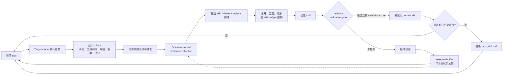

> **核心观点**：SkillOpt 的价值不在于“提示词工程下岗”，而在于把 Agent 的技能文档从一次性手写说明，变成一个可以被轨迹、评分器和验证集持续优化的工程对象。它训练的不是模型权重，而是 Agent 执行任务时依赖的外部程序性知识。

微软等机构的研究团队在 2026 年 5 月提交了论文 **SkillOpt: Executive Strategy for Self-Evolving Agent Skills**。arXiv 记录显示，v1 提交于 2026-05-22，v2 修订于 2026-05-25。

这篇论文讨论的问题很具体：当我们已经有一个 Agent、一个工具环境、一批可评分任务时，能不能像训练神经网络那样，系统地训练 Agent 的 `skill.md` 或 `SKILL.md`，而不是靠人反复手改 prompt？

SkillOpt 的答案是：可以。它把技能文档看作冻结模型之外的“可训练状态”，让一个独立的优化器模型阅读 Agent 的执行轨迹、成功失败样例和评分结果，再对同一个技能文档提出小步编辑。每次候选更新必须通过 held-out validation gate：候选 skill 只有在验证集分数超过当前 selection score 时才会成为新的 current skill；如果同时超过历史最优，才会写入最终的 `best_skill.md`。

## 一、什么是 Agent Skill

在 SkillOpt 的语境里，Skill 不是一个 API，也不是一个工具函数，而是一份自然语言写成的程序性说明。

它可能包含：

- 应该如何收集证据；
- 应该优先调用哪些工具；
- 遇到失败时如何回退；
- 输出格式必须满足什么约束；
- 哪些常见错误要避免；
- 某个领域里的经验规则和判断顺序。

对代码 Agent 来说，这类文件可能长得像 `SKILL.md`、`AGENTS.md`、`CLAUDE.md` 或某个工具约定的技能文档。它不会改变模型权重，但会作为上下文或持久指令影响 Agent 的行为。

这就是 SkillOpt 最关键的出发点：很多 Agent 失败并不是因为模型完全不会，而是因为它缺少稳定的执行规程。比如处理表格时没有先检查 workbook 结构，做文档问答时没有绑定到具体表格行列，做 ALFWorld 任务时反复检查已经搜过的位置。这些问题很适合写成技能规则。

## 二、它为什么不是普通 Prompt 优化

传统 prompt 优化通常会围绕一个 prompt 做重写、评分和选择。SkillOpt 更像是在训练一个可复用的 Agent 程序层。

它和普通 prompt 调参有几处关键差别：

| 维度 | 普通 prompt 调参 | SkillOpt |
| :--- | :--- | :--- |
| 优化对象 | 一段 prompt | 一个持久技能文档 |
| 反馈来源 | 通常是样例输出或人工观察 | Agent rollout、工具调用轨迹、verifier 评分 |
| 更新方式 | 经常是整段重写 | 有预算的 add / delete / replace 小步编辑 |
| 接受标准 | 容易凭主观判断接受 | 必须在 held-out selection split 上提升 |
| 部署成本 | 取决于 prompt 结构 | 只部署 `best_skill.md`，不增加优化器调用 |
| 可审计性 | 改动可能不稳定 | 候选编辑、验证结果和技能快照可记录 |

这里最重要的是“验证门”。优化器模型提出的编辑不一定正确，甚至很可能听起来合理但实际伤害性能。SkillOpt 不让这种编辑直接污染技能文档，而是先在验证集上跑一遍。分数严格高于当前 selection score，才会接受为新的 current skill；否则拒绝，并把失败编辑放进 rejected-edit buffer，作为后续优化的负反馈。

## 三、SkillOpt 的训练闭环

SkillOpt 里有两个模型角色。

第一个是 **target model**，也就是最终要部署的 Agent 执行模型。它在整个过程中保持冻结，不微调权重。

第二个是 **optimizer model**，负责阅读轨迹、分析失败和成功模式、提出技能编辑。它只在离线训练阶段出现，部署时不会被调用。

整体流程可以概括成下面这条闭环：

这套机制和深度学习训练的类比不是装饰性的。

| 深度学习概念 | SkillOpt 中的对应物 |
| :--- | :--- |
| 参数 | 技能文档 |
| Forward pass | Agent 带着当前 skill 执行任务并产生 rollout |
| Loss / score | benchmark scorer 或 verifier 评分 |
| Backward signal | 优化器模型从成功/失败轨迹里总结出的编辑方向 |
| Learning rate | 每一步最多允许应用多少条文本编辑的 edit budget |
| Minibatch | 分批分析成功轨迹和失败轨迹 |
| Validation | held-out selection split 上的接受门 |
| Optimizer state | rejected-edit buffer、slow update、optimizer-side meta skill |
| Checkpoint | 最优验证版本导出的 `best_skill.md` |

有了这个类比后，SkillOpt 的设计就容易理解了：它不是让 LLM 随便反思自己，而是把反思放进一个可控训练回路里。

## 四、几个稳定性设计

SkillOpt 最值得看的地方，不是“让模型改 prompt”这个动作本身，而是它如何避免自我编辑变成漂移。

第一，**失败和成功分开分析**。失败样例用于补规则、修错误；成功样例用于保留已经有效的行为。这样可以减少“修一个 bug，删掉一条有用经验”的情况。

第二，**编辑有预算**。论文把这个叫 textual learning rate。每一步进入候选 skill 的编辑数量受预算限制，默认是局部 patch，而不是整篇重写。这样相邻版本足够接近，后续才能判断到底是哪类改动有用。

第三，**验证门很保守**。候选 skill 必须在 selection split 上严格超过当前 selection score 才会被接受。持平也拒绝。这让技能不会因为听起来更完整而悄悄变差。

第四，**拒绝编辑也会变成训练信号**。被拒绝的 patch 不会部署，但会进入 epoch-local rejected-edit buffer。后续同一 epoch 内的优化器调用能看到哪些方向试过、为什么失败，从而少重复错误。

第五，**有慢更新和优化器侧记忆**。每个 epoch 结束后，SkillOpt 会比较相同任务在前后两个 skill 下的表现，把改进、退化、持续失败和稳定成功分组。慢更新写入一个受保护区域，但候选慢更新仍要通过验证门；optimizer-side meta skill 则只给优化器看，不部署给 target model。

这些机制共同解决的是同一个问题：自然语言编辑没有真正的梯度，所以必须用约束、验证和审计来制造“可训练性”。

## 五、实验结果怎么读

论文的实验覆盖了 6 个 benchmark：

- SearchQA：搜索式问答；
- SpreadsheetBench：电子表格操作和代码生成；
- OfficeQA：办公文档上的工具增强问答；
- DocVQA：文档视觉问答；
- LiveMathematicianBench：数学选择题推理；
- ALFWorld：具身环境中的顺序决策。

目标模型包括 7 个：GPT-5.5、GPT-5.4、GPT-5.4-mini、GPT-5.4-nano、GPT-5.2、Qwen3.5-4B、Qwen3.6-35B-A3B。执行环境包括 direct chat、Codex harness 和 Claude Code harness。

对比基线也比较完整：无 skill、人工 skill、一次性 LLM 生成 skill、Trace2Skill、TextGrad、GEPA，以及 harness 侧的 EvoSkill。

论文最强的主张是：在 52 个 `(model, benchmark, harness)` 评测单元上，SkillOpt 全部最好或并列最好。

以 GPT-5.5 direct chat 为例，论文表 1 给出的提升是：

| Benchmark | No skill | SkillOpt | 提升 |
| :--- | ---: | ---: | ---: |
| SearchQA | 77.7 | 87.3 | +9.6 |
| SpreadsheetBench | 41.8 | 80.7 | +38.9 |
| OfficeQA | 33.1 | 72.1 | +39.0 |
| DocVQA | 78.8 | 91.2 | +12.4 |
| LiveMath | 37.6 | 66.9 | +29.3 |
| ALFWorld | 83.6 | 95.5 | +11.9 |

平均下来，GPT-5.5 direct chat 比无 skill 提升 **+23.5** 分。arXiv v2 的摘要和表 1 逐项合计还显示，GPT-5.5 在 Codex harness 上平均提升 **+24.8** 分，在 Claude Code harness 上平均提升 **+19.1** 分。

这里有一个小细节：项目页当前结果表里有一处写成 Codex **+21.8**、Claude Code **+18.6**。但 arXiv v2 摘要和表 1 的逐项数字合计分别是 **+24.8** 和 **+19.1**。这类项目页和论文版本不同步很常见，正式引用时更适合以 arXiv v2 为准。

## 六、为什么它对 Agent 有意义

SkillOpt 对 Agent 工程最大的启发是：Agent 的能力不只来自模型本身，也来自可训练的外部程序层。

过去我们常把 Agent 拆成模型、工具、记忆、规划器、执行环境。SkillOpt 提醒我们还应该认真看待一个中间层：**技能文档**。它不是简单提示词，而是 Agent 的操作规程、领域经验和失败规避策略。

这会改变 Agent 工程的几个重心。

第一，**Prompt 会更像代码资产**。一个好的 skill 不应该只存在于聊天记录里，而应该进入版本管理、评审、测试和发布流程。SkillOpt 最终导出的是 `best_skill.md`，它可以被 diff、review、回滚和跨环境复用。

第二，**Agent 需要评分器和任务集**。没有可靠反馈，SkillOpt 就无从判断编辑是否变好。未来做 Agent，不只是写工具和 prompt，还要维护 train / validation / test 任务集，以及自动 verifier、单元测试、端到端检查或人工评分协议。

第三，**优化可以离线做，部署保持简单**。强优化器模型可以很贵，但它只在训练时调用。部署时 target model 只多读一份紧凑的 skill 文档，不增加额外推理链路。这对企业 Agent 很重要，因为线上延迟、成本和可审计性都更可控。

第四，**技能可以跨模型和执行环境迁移**。论文测试了 cross-model、cross-harness 和 cross-benchmark transfer。论文报告的迁移行都没有低于 no-skill 基线，但提升幅度差异很大。这说明很多 skill 学到的不是某个模型的口癖，而是更通用的操作规程。

第五，**小模型也能吃到程序性知识红利**。论文里 GPT-5.4-nano、Qwen3.5-4B 等较小模型也有明显收益。原因很直接：小模型权重里缺的某些领域经验，可以被外部 skill 补上。

## 七、不要把它理解成“提示词工程下岗”

如果把 SkillOpt 解读成“以后不用写 prompt 了”，就误读了论文。

SkillOpt 自动化的是一部分重复、局部、可评分的 skill 调参工作。它没有自动解决这些问题：

- 任务到底该怎么定义；
- 什么样的输出算成功；
- verifier 是否可信；
- train / validation / test 是否泄漏；
- skill 的边界应该多宽；
- Agent 可以调用哪些工具；
- 线上失败如何监控；
- 哪些领域规则不应该被模型自动改写；
- 迁移到新模型或新工具链时是否仍然有效。

换句话说，它没有消灭提示词设计，而是把提示词设计推进到更工程化的位置：人负责定义目标、边界、数据、评估和上线标准；优化器负责在这个框架里搜索更好的文本规则。

真正被削弱的是“凭感觉手调 prompt”的部分。真正变得更重要的是评估工程、任务建模、轨迹采集、工具链设计和 skill 审计。

## 八、适合和不适合的场景

SkillOpt 最适合这类 Agent 场景：

- 有重复任务，而不是一次性闲聊；
- 任务可以自动评分，或者至少可以稳定评价；
- Agent 执行过程能记录轨迹，包括工具调用、观察、错误和最终答案；
- skill 可以跨任务复用；
- 线上部署需要低延迟，不能每次都调用额外反思模型；
- 团队希望把 Agent 经验沉淀成可读、可审计的文档资产。

典型例子包括代码 Agent、表格处理 Agent、文档问答 Agent、运维排障 Agent、客服工单 Agent、企业内部流程 Agent。

它不太适合这些情况：

- 任务完全一次性，没有复用价值；
- 成功标准主观且难以评价；
- 没有足够样例，验证集不稳定；
- 任务域过于异质，一个 skill 覆盖不了多套流程；
- 训练成本高于复用收益；
- skill 中的启发式规则一旦错误，会带来明显业务风险。

论文的局限性也主要集中在这里：SkillOpt 依赖 scored trajectories 和 held-out selection split；训练时需要额外 rollout 和优化器调用；它优化的是单个可移植 skill，而不是大型 skill library；迁移到差异很大的模型、harness 或任务时仍然需要重新验证。

## 九、如果落到自己的 Agent 工程里

如果要把 SkillOpt 的思想用到实际项目，不一定要立刻照论文复现完整系统。更务实的起点是先把 Agent 的技能工程补齐。

可以按这个顺序做：

1. 把当前 Agent 的经验规则整理成一个短的 `SKILL.md`，不要一开始就写成长篇手册。
2. 收集一批真实任务，固定输入、期望输出和评分方式。
3. 把任务拆成 train、validation、test，避免用测试集指导编辑。
4. 保存每次执行的轨迹，包括工具调用、失败位置、错误输出和最终评分。
5. 让模型只提出小步 patch，而不是整篇重写。
6. 每次 patch 后先跑 validation，只有变好才合入。
7. 定期人工 review `best_skill.md`，删掉过度拟合、危险或不可解释的规则。
8. 上线后继续收集失败样例，作为下一轮 skill 训练数据。

这其实就是把 Agent 的 prompt 维护，从“写一段说明”升级成“维护一个带回归测试的程序性知识层”。

## 十、我的判断

SkillOpt 的重要性不在于它提出了一个花哨的新名字，而在于它把 Agent skill 的优化问题形式化了。

它承认了一个现实：在很多 Agent 场景里，模型权重不是我们能随便改的东西，工具环境也不能频繁变，但技能文档可以改、可以审计、可以部署、可以回滚。如果这个文档能通过轨迹和验证集持续变好，它就成了介于 prompt 和 fine-tuning 之间的一层轻量适配机制。

从这个角度看，SkillOpt 对 Agent 的作用很明确：

- 它让 Agent 的程序性经验可以被系统训练；
- 它让 prompt / skill 从手工经验变成可验证资产；
- 它把模型能力提升的一部分工作转移到离线优化阶段；
- 它要求 Agent 工程必须具备任务集、评分器、轨迹日志和发布门禁；
- 它证明了一个紧凑的自然语言 skill，在一定条件下可以跨模型、跨 harness 迁移。

但它也把问题说得更清楚了：未来 Agent 工程的瓶颈，可能不只是“模型够不够强”，而是我们有没有能力为 Agent 建立高质量的反馈系统。

没有任务集、没有验证器、没有轨迹、没有回归测试，SkillOpt 也只是更复杂的 prompt 改写。只有当这些工程基础存在时，技能文档才真的有机会变成可训练对象。

## 术语表

| 术语 | 解释 |
| :--- | :--- |
| Agent | 能根据目标、上下文和工具反馈动态决定下一步行动的 LLM 系统。 |
| Skill | 给 Agent 使用的自然语言程序性知识，包含流程、工具策略、输出约束和失败规避规则。 |
| Target model | 最终执行任务的模型。SkillOpt 中 target model 保持冻结，不更新权重。 |
| Optimizer model | 离线训练阶段负责阅读轨迹并提出 skill 编辑的模型。部署时不调用。 |
| Rollout | Agent 带着当前 skill 执行一批任务产生的完整过程记录。 |
| Trajectory | 单个任务执行过程中的消息、工具调用、观察、错误、答案和评分。 |
| Held-out validation gate | 独立验证集上的接受门。候选 skill 只有超过当前 selection score 才会被接受。 |
| Textual learning rate | 文本版学习率，用每一步最多允许应用的编辑数量来控制更新幅度。 |
| Rejected-edit buffer | 同一 epoch 内缓存被验证集拒绝的编辑，用作后续优化器调用的负反馈。 |
| Slow update | epoch 级慢更新，用更长周期的对比结果捕捉稳定经验和回归风险，候选更新仍需通过验证门。 |
| Meta skill | 只给优化器看的编辑经验总结，不部署给 target model。 |
| Harness | Agent 的执行外壳或运行环境，例如 direct chat、Codex CLI、Claude Code CLI。 |
| `best_skill.md` | 历史最佳验证 skill 文档，是最终部署的产物。 |

## 参考文献

- Yifan Yang et al., [SkillOpt: Executive Strategy for Self-Evolving Agent Skills](https://arxiv.org/abs/2605.23904), arXiv:2605.23904v2, 2026-05-25.
- Microsoft Research, [SkillOpt 项目页](https://microsoft.github.io/SkillOpt/).
- Microsoft, [microsoft/SkillOpt GitHub 仓库](https://github.com/microsoft/SkillOpt).
