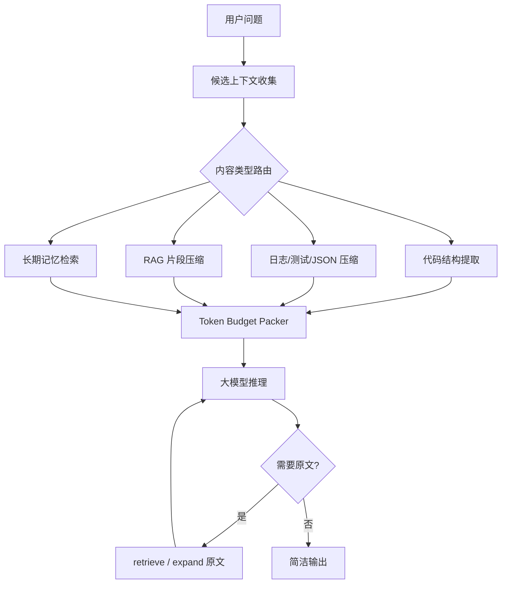

使用大模型久了，很容易把“省 Token”理解成一句话：把文本压短。

这当然有用，但只是一小部分。真正有效的省 Token 工程，通常不是单点压缩，而是把上下文入口拆开：哪些内容根本不该进入模型，哪些内容只需要结构摘要，哪些内容可以缓存复用，哪些内容必须保留原文，哪些内容只是模型最后回答时少说几句。

从近期开源项目看，省 Token 可以拆成几类常见切入点：

| 切入点 | 代表项目 | 核心思想 |
|---|---|---|
| 输出节流 | Caveman | 让 Agent 少说废话，减少输出 Token |
| 语义压缩 | Caveman Compression、LLMLingua、Selective Context | 删除可预测、低信息量内容，保留关键事实 |
| 工具输出压缩 | RTK、sqz、Headroom | 命令结果、日志、JSON、测试输出先压缩再进模型 |
| 工具沙箱与索引 | Context Mode | 大输出留在本地，模型只拿脚本结果或检索片段 |
| 代码上下文选择 | Aider repo map、SigMap、Repomix | 不传全仓库，先传结构、签名和相关文件 |
| 缓存复用 | GPTCache、Bifrost、Prompt Caching | 相同或相似请求不要重复调用大模型 |
| 长期记忆 | mem0 | 历史对话不全塞回去，抽取记忆后按需检索 |
| 数据格式压缩 | TOON | 把同构 JSON 数组换成字段只声明一次的表格式编码 |

省 Token 的第一原则是：**不要先问“怎么压缩”，先问“这段内容是否应该进入大模型上下文”。**

## 1. Token 成本来自哪里

一次大模型调用里的 Token 大致分成几类：

```text
system / developer instructions
用户当前问题
历史对话
工具输出
RAG 文档片段
代码文件和日志
模型输出
reasoning / thinking token
缓存命中的 input token
```

不同类型的 Token，优化方式并不一样。

输出 Token 贵，因为它通常是自回归逐个生成；工具输出占上下文，是因为 Agent 会把 `git diff`、测试日志、网页、文件内容原样塞进去；RAG 文档贵，是因为检索系统经常“宁可多给”；长期对话贵，是因为历史越滚越大；结构化数据贵，是因为 JSON 很容易重复字段名和符号。

所以一个完整的省 Token 架构应该长这样：



这个图里最重要的不是压缩算法，而是中间的“内容类型路由”。代码、日志、JSON、自然语言、历史对话，不能用同一种压缩器。

## 2. Caveman：少说话，先省输出 Token

[JuliusBrussee/caveman](https://github.com/JuliusBrussee/caveman) 的思路非常直接：让 Agent 用极短、片段化、去寒暄的方式回答。

它本质上是一个 Agent skill / plugin。安装后可以通过 `/caveman [lite|full|ultra|wenyan]` 进入简洁模式，也可以用 `/caveman-compress <file>` 压缩 `CLAUDE.md`、项目 notes 这类长期注入文件。项目 README 中给出的基准是：10 个 Claude API prompt 平均输出 Token 减少 65%；memory files 平均减少 46%。但它也明确说，Caveman 主要影响 **output tokens**，不会减少模型内部 thinking / reasoning tokens。

这类方案的价值在于：

1. 简单，几乎不改系统架构。
2. 对日常 Agent 对话很有效，尤其是代码评审、命令解释、进度总结。
3. 可以顺手压缩长期注入的规则文件，让每次会话启动成本变低。

但它不是解决上下文爆炸的主方案。模型读进去的文件、日志、RAG 片段并不会因为 Caveman 自动变少。它更像是“嘴变小”，不是“脑子读得少”。

## 3. Caveman Compression：删除可预测语法，保留事实

[wilpel/caveman-compression](https://github.com/wilpel/caveman-compression) 和 Caveman 名字相近，但切入点不同。它不是控制回答风格，而是做语义压缩。

它的核心假设是：大模型很擅长补全语法、连接词和常见表达，因此可以删除那些可预测的语言结构，只保留事实、数字、名称、日期、技术术语和约束。

例如：

```text
原文: In order to optimize the database query performance, we should consider implementing an index...
压缩: Need fast queries. Check columns used most. Add index...
```

项目提供三类方法：

| 方法 | 大致压缩率 | 成本 | 机制 |
|---|---:|---|---|
| LLM-based | 40-58% | 需要 API key | 用大模型做上下文感知压缩 |
| MLM-based | 20-30% | 本地免费 | 用 RoBERTa 这类 masked language model 删除最可预测 token |
| NLP-based | 15-30% | 本地免费 | 用规则和 spaCy 删除 filler、连接词和部分语法结构 |

这个项目很适合作为“小模型预清洗”的原型：前面放一个本地模型或规则系统，把长文档、会议纪要、RAG 片段先压成事实密集格式，再交给大模型。

但要注意，它不适合所有文本。法律条款、错误日志、代码 diff、SQL、配置、金额、权限条件、强格式内容，都不应该被自由改写。越是精确材料，越应该偏向可逆压缩或结构压缩，而不是语义改写。

## 4. LLMLingua 与 Selective Context：用小模型判断哪些 Token 值得保留

[microsoft/LLMLingua](https://github.com/microsoft/LLMLingua) 是 prompt compression 方向的代表项目。它使用小型语言模型，例如 GPT-2 small 或 LLaMA-7B，识别并删除 prompt 中非必要 token。README 中总结它可以做到最高 20x prompt compression，LongLLMLingua 面向长上下文和 RAG，LLMLingua-2 则通过 GPT-4 数据蒸馏训练 BERT-level encoder 做 token classification，并提升了压缩速度。

[liyucheng09/Selective_Context](https://github.com/liyucheng09/Selective_Context) 的方法更偏信息论：用基础语言模型计算句子、短语或 token 的 self-information，低信息量内容优先删除。它的目标是让固定上下文窗口处理约 2 倍内容，并在长文档、长对话中维持任务表现。

这两类方案可以回答一个关键问题：**能否在大模型前面加小模型做 Token 预清洗？**

可以，而且非常合理。工程形态通常是：

```text
候选文档 / 历史对话 / RAG chunks
  -> 小模型打分: KEEP_FULL / KEEP_SUMMARY / DROP / NEED_ORIGINAL
  -> token budget packer
  -> 大模型回答
  -> 必要时 retrieve 原文
```

如果大模型是闭源 API，就不能真正端到端联合训练。更现实的做法是让大模型当 teacher，生成压缩标注或偏好数据，再训练小模型当 compressor。评价指标也不能只看压缩率，而要看一个归一化后的综合目标，例如：

```text
score = task_success_rate
      - lambda * min(input_tokens / token_budget, 1)
      - mu * (retry_count / max_retries)
```

这里的 `lambda` 和 `mu` 是业务自己设定的权重，不是通用常数；`max_retries` 用来把重试惩罚归一化。这个公式也不是论文里的标准指标，而是工程评估模板：Token 降低必须和任务成功率、重试次数一起看。

压缩率高但任务失败，只是把成本从输入 Token 转移到了重试和错误上。

## 5. RTK 与 sqz：命令输出才是编程 Agent 的大头

编程 Agent 中最容易膨胀的不是用户问题，而是工具输出。

比如一次 `cargo test`、`npm test`、`kubectl logs`、`git diff`、`rg`，可能直接把几千到几十万 Token 扔进上下文。大模型并不需要完整输出，它需要的是失败测试、关键错误、受影响文件、重复日志的聚合结果，以及必要时可取回原文。

[rtk-ai/rtk](https://github.com/rtk-ai/rtk) 是一个 Rust CLI proxy。它通过 hook 把常见 shell 命令改写成 `rtk git status`、`rtk grep`、`rtk read` 这类 token-optimized 命令，再把压缩后的输出交给 Agent。README 中描述的策略包括 smart filtering、grouping、truncation、deduplication，支持 100+ 命令，常见开发命令节省 60-90% Token。它也提醒：Claude Code 的 `Read`、`Grep`、`Glob` 等内置工具不走 Bash hook，所以不会自动被 RTK 改写。

[ojuschugh1/sqz](https://github.com/ojuschugh1/sqz) 也是类似方向，但更强调 session-level dedup。它会安装 PreToolUse hook，压缩 shell 输出、JSON、日志和测试结果；对于 stack traces、error messages、secrets 等高风险内容进入 safe mode，不压缩。项目 README 中给出的关键设计包括：

1. 每类命令有专用 formatter。
2. 代码文件可压成 imports、函数签名和调用图。
3. 用 SHA-256 做内容 hash，重复读取同一文件时变成很短的引用。
4. JSON 管线可以 strip null、裁剪 debug 字段、flatten、collapse arrays，甚至转 TOON。
5. 高风险内容保留原文，避免把关键错误压没。

RTK 和 sqz 的共同启发是：**不要让大模型读原始终端输出。**

对于编程 Agent，这是比“压缩用户 prompt”更高收益的地方。

## 6. Context Mode：大数据不进上下文，让模型写程序处理数据

[mksglu/context-mode](https://github.com/mksglu/context-mode) 的方案更像基础设施，而不是普通压缩器。

它提供 MCP tools、hooks 和 sandbox。核心思想是：大文件、大日志、大网页和大命令输出不要直接进模型上下文，而是在本地沙箱里执行处理逻辑，最后只把 stdout、检索片段或统计结果交给模型。

它的 `ctx_execute` 可以让模型写脚本处理数据，但只有脚本输出进入上下文；`ctx_execute_file` 可以处理文件，原始文件内容不离开本地；`ctx_index` 会把文档按 heading chunk 后存入 SQLite FTS5；`ctx_search` 用 BM25、stemming、trigram、RRF、proximity reranking 和 typo correction 返回 query 附近的 smart snippets。

这个项目最值得借鉴的是“Think in Code”：

```text
错误做法:
  把 50 个文件、10 万行日志塞给模型，让模型肉眼总结。

更好做法:
  让模型写脚本在本地统计、过滤、聚合，只输出结论和证据片段。
```

Context Mode 还做了 session continuity：每次文件编辑、git 操作、任务、错误和用户决策都会进入 SQLite。会话压缩或恢复时，它不把全部历史重新塞回模型，而是构造小型 snapshot，并把详细事件索引进 FTS5，后续按需搜索。

这说明省 Token 不只是压缩文本，也可以是改变 Agent 的工作方式：**模型负责写处理逻辑，本地程序负责处理大数据。**

## 7. Headroom 与 Claw Compactor：内容路由和可逆压缩

[chopratejas/headroom](https://github.com/chopratejas/headroom) 把自己定位成 AI Agent 的 context compression layer。它提供 library、proxy、agent wrap 和 MCP server，压缩 tool outputs、logs、RAG chunks、files 和 conversation history。README 中的架构包括 CacheAligner、ContentRouter、CCR、SmartCrusher、CodeCompressor 和 Kompress-base。

这里有两个设计很关键：

1. **ContentRouter**：先识别内容类型，再选择 JSON、AST code 或 prose 压缩器。
2. **CCR reversible compression**：原文保存在本地，模型需要时通过 retrieve 工具取回。

[open-compress/claw-compactor](https://github.com/open-compress/claw-compactor) 也强调类似方向：多阶段 pipeline、AST-aware code analysis、intelligent content routing、reversible compression，并且零 LLM inference cost。

这类项目比单纯 prompt compressor 更像一个“上下文中间件”。它们的价值在于把压缩从一次性文本操作，提升成一个带类型系统、可恢复机制和统计能力的运行时。

## 8. Aider、SigMap、Repomix：代码库不是压短，而是先选对

代码场景里，直接压缩实现细节很危险。一个条件判断、一个泛型约束、一个错误处理分支被删掉，就可能让模型给出错误修改。

所以代码库更适合“选择”而不是“自由压缩”。

[Aider](https://github.com/Aider-AI/aider) 的 repo map 思路是：用 tree-sitter 抽取符号、定义、引用关系，再通过图排序和 token budget，把最有帮助的结构信息放进上下文。模型先知道仓库大概有哪些文件、类、函数和依赖关系，再决定需要展开哪些文件。

[manojmallick/sigmap](https://github.com/manojmallick/sigmap) 则主打把代码库变成 compact signatures，并用 TF-IDF、validate、judge、learn 等机制改进选择质量。它不是传完整代码，而是先给模型低成本的导航地图。

[yamadashy/repomix](https://github.com/yamadashy/repomix) 更偏一次性打包仓库。它能把仓库打包成 AI-friendly 文件，支持 token counting、include / exclude、`.gitignore` / `.repomixignore`，并且 `--compress` 会用 Tree-sitter 提取关键代码元素，减少 Token 同时保留结构。

代码上下文优化的核心原则是：

```text
先给地图，再按需展开。
先给签名，再给实现。
先给相关文件，再给全仓库。
```

## 9. GPTCache、Bifrost 与 Prompt Caching：重复问题不要重复付费

还有一类省 Token 不是减少单次输入，而是减少重复调用。

[zilliztech/GPTCache](https://github.com/zilliztech/GPTCache) 是 semantic cache 的典型项目：对 prompt 做 embedding，放进 vector store，再用 similarity evaluator 判断是否命中历史答案。对于 FAQ、客服、重复数据解释，这种缓存能直接省掉一次 LLM 调用。

[maximhq/bifrost](https://github.com/maximhq/bifrost) 是 AI gateway。它提供 OpenAI-compatible API、多 provider、failover、load balancing，并在插件体系中包含 semanticcache。它适合服务端把缓存、路由、限额和观测统一放在网关层。

Provider 原生 prompt caching 也值得利用。OpenAI 的 prompt caching 会在请求中复用相同前缀；缓存命中要求 prompt 前缀精确匹配，并且当前文档说明缓存适用于 1024 tokens 或更长的 prompt。usage 里可以看到 `cached_tokens`。这意味着系统提示词、工具 schema、固定规则、few-shot 示例应该尽量放在前面，变量内容放后面，并保持顺序稳定。

缓存类方案的风险是 false positive。相似问题不一定能复用同一答案，尤其是权限、实时数据、用户私有上下文、金融医疗法律建议。工程上必须有 TTL、租户隔离、相似度阈值、审计日志和可回退策略。

## 10. mem0：历史对话不要滚雪球

长期助手常见的浪费是：每轮都把全部历史对话塞回去。

[mem0ai/mem0](https://github.com/mem0ai/mem0) 的定位是 universal memory layer。它把长期上下文抽取成记忆，再通过 semantic、BM25 keyword、entity matching、temporal reasoning 等多信号检索，把相关记忆放回当前会话。

这类方案不是把历史“总结成一段话”这么简单。好的记忆系统要解决：

1. 什么事实值得记。
2. 旧事实和新事实冲突时怎么办。
3. 当前问题到底需要哪段记忆。
4. 时间相关事实如何排序。
5. 用户隐私和删除请求如何处理。

从省 Token 角度看，memory layer 的收益是把长历史变成可查询索引，而不是把所有历史重新注入 prompt。

## 11. TOON：结构化数据也可以换一种写法

[toon-format/toon](https://github.com/toon-format/toon) 的思路是把 JSON 数据模型编码成更适合 LLM 输入的 TOON 格式。

JSON 的问题是字段名、引号、花括号、逗号重复很多。TOON 使用类似 YAML 的缩进表达嵌套对象，用类似 CSV 的表格表达 uniform arrays of objects。字段名声明一次，后面每行只放值。

例如，一个用户数组在 JSON 中会反复写：

```json
{
  "users": [
    {"id":1,"name":"Alice","role":"admin"},
    {"id":2,"name":"Bob","role":"user"}
  ]
}
```

等价的 TOON 可以写成：

```text
users[2]{id,name,role}:
  1,Alice,admin
  2,Bob,user
```

它适合大量同构对象数组、表格化数据、RAG metadata，不一定适合深层嵌套、非均匀结构或延迟极端敏感场景。对于纯平表，CSV 可能更短；对于复杂配置，compact JSON 可能更稳。

## 12. 怎么组合成自己的省 Token 系统

如果要从零实现，我会按这个优先级做：

1. **观测先行**：记录每次调用的 input、output、cached、reasoning token，按 system、history、tool output、RAG、files 拆账。
2. **固定前缀**：system prompt、工具 schema、few-shot 和长期规则顺序稳定，争取 prompt cache 命中。
3. **工具输出压缩**：测试只保留失败，日志合并重复，JSON 去 null，diff 保留变更摘要，高风险内容 safe mode。
4. **代码结构地图**：用 AST / tree-sitter 提取 imports、签名、类、函数、调用关系，需要实现时再展开原文。
5. **本地索引**：大文档、网页、日志进入 SQLite FTS5 或向量库，模型按需搜索，不直接读全文。
6. **小模型预清洗**：对 RAG chunks 和长文档做 KEEP / DROP / SUMMARIZE / NEED_ORIGINAL 分类。
7. **可逆引用**：所有压缩内容保留 hash 和原文路径，模型能 retrieve / expand。
8. **缓存复用**：exact cache 优先，semantic cache 谨慎开启，并设置 TTL、权限隔离和阈值。
9. **长期记忆**：把历史对话变成记忆索引，不把完整历史无限滚动。
10. **输出节流**：最后再用 Caveman 类风格减少输出 Token。

这套顺序的理由很简单：先少读，再少算，再少说。

## 13. 一个现实判断

省 Token 的目标不是“让每段文本更短”，而是让模型拿到足够完成任务的最小证据集。

因此不同项目各有边界：

| 项目类型 | 最擅长 | 不擅长 |
|---|---|---|
| Caveman | 减少回答废话、压长期规则文件 | 减少工具输出和 RAG 输入 |
| Caveman Compression / LLMLingua | 文档、RAG、长对话预压缩 | 精确日志、代码 diff、法律条款 |
| RTK / sqz | 编程 Agent 的命令输出 | 内置文件工具或不走 hook 的平台 |
| Context Mode | 大输出沙箱处理、本地索引、按需检索 | 需要平台 hook / MCP 支持 |
| Aider / SigMap / Repomix | 代码库导航和结构摘要 | 替代精确实现细节 |
| GPTCache / Bifrost | 重复请求和服务端统一治理 | 强实时、强权限差异请求 |
| mem0 | 长期个性化和历史状态 | 一次性任务或无历史价值场景 |
| TOON | 同构结构化数据 | 深层非均匀 JSON |

真正稳的省 Token 系统，应该同时具备三件事：

1. 能判断内容类型。
2. 能保留原文并按需取回。
3. 用任务成功率评估压缩，而不是只看 Token reduction。

如果只追求压缩率，很容易压掉关键证据；模型一次答错、重试、再读原文，成本往往比一开始谨慎地保留关键上下文更高。

## 术语表

- **Token**：模型 tokenizer 切分后的基本文本单位，是上下文占用和 API 计费的重要单位。
- **Prompt Compression**：在不显著影响任务结果的前提下压缩输入 prompt 或上下文。
- **RAG**：Retrieval-Augmented Generation，先检索外部知识，再把相关片段交给模型生成答案。
- **MCP**：Model Context Protocol，一种让模型客户端调用外部工具和数据源的协议。
- **FTS5**：SQLite 的全文搜索扩展，可用于本地文档索引和 BM25 检索。
- **BM25**：经典文本相关性排序算法，常用于搜索系统。
- **AST**：Abstract Syntax Tree，抽象语法树，可用于从代码中提取结构、符号和调用关系。
- **Semantic Cache**：用 embedding 和相似度判断请求是否可以复用历史答案的缓存方式。
- **Prompt Caching**：模型服务商对相同 prompt 前缀做缓存复用，降低延迟或费用。
- **Safe Mode**：压缩系统遇到错误堆栈、密钥、迁移脚本等高风险内容时保留原文或降低压缩率。

## 参考文献

- microsoft/LLMLingua: <https://github.com/microsoft/LLMLingua>
- liyucheng09/Selective_Context: <https://github.com/liyucheng09/Selective_Context>
- JuliusBrussee/caveman: <https://github.com/JuliusBrussee/caveman>
- wilpel/caveman-compression: <https://github.com/wilpel/caveman-compression>
- mksglu/context-mode: <https://github.com/mksglu/context-mode>
- rtk-ai/rtk: <https://github.com/rtk-ai/rtk>
- ojuschugh1/sqz: <https://github.com/ojuschugh1/sqz>
- chopratejas/headroom: <https://github.com/chopratejas/headroom>
- open-compress/claw-compactor: <https://github.com/open-compress/claw-compactor>
- Aider-AI/aider: <https://github.com/Aider-AI/aider>
- manojmallick/sigmap: <https://github.com/manojmallick/sigmap>
- yamadashy/repomix: <https://github.com/yamadashy/repomix>
- zilliztech/GPTCache: <https://github.com/zilliztech/GPTCache>
- maximhq/bifrost: <https://github.com/maximhq/bifrost>
- mem0ai/mem0: <https://github.com/mem0ai/mem0>
- toon-format/toon: <https://github.com/toon-format/toon>
- OpenAI Prompt Caching documentation: <https://developers.openai.com/api/docs/guides/prompt-caching>
