软件工程里的图，本质上不是为了“画得好看”，而是为了降低沟通成本。

一段复杂的文字说明，往往会把流程、角色、状态、数据、部署、依赖关系全部揉在一起。图的价值就在于：**一次只回答一个核心问题**，让读者迅速建立共同上下文。

比如：

- 想讲“业务怎么走”，用流程图。
- 想讲“谁调用谁”，用时序图。
- 想讲“订单有哪些状态”，用状态机图。
- 想讲“系统由哪些模块组成”，用组件图或架构图。
- 想讲“数据之间是什么关系”，用 ER 图。
- 想讲“服务部署在哪里”，用部署图。

这篇文章整理软件工程中最常用的一组图谱，并说明它们各自适合解决什么问题。

---

## 一、先建立一个分类框架

常见工程图可以按“关注点”分成七类：

| 类型 | 关注点 | 常见图 |
| --- | --- | --- |
| 流程类 | 事情按什么步骤发生 | 流程图、活动图、泳道图 |
| 交互类 | 多个对象或系统如何协作 | 时序图、通信图 |
| 状态类 | 一个对象在生命周期中如何变化 | 状态机图 |
| 结构类 | 代码、模块、对象之间如何组织 | 类图、组件图、包图、依赖图 |
| 数据类 | 数据实体、关系与流向 | ER 图、数据流图 |
| 架构类 | 系统边界、服务关系、运行形态 | 架构图、C4 模型图、部署图 |
| 需求类 | 用户目标与业务场景 | 用例图、用户旅程图 |

需要注意的是：**UML 不是所有软件图的总称**。

UML 是 OMG 标准化的一套图形建模语言，用来可视化、规约、构造和文档化软件系统，其中包括类图、时序图、活动图、状态机图、用例图、组件图、部署图等。但 ER 图、数据流图、C4 模型图并不属于 UML，它们来自数据库建模、结构化分析和架构表达等不同传统。

实际工作中不必纠结“是不是 UML”。更重要的是：**这张图是否让问题更容易被理解**。

---

## 二、流程图：描述业务步骤和判断分支

流程图（Flowchart）是最通用、最容易理解的一类图。它用节点表示步骤，用箭头表示流转，用菱形或条件节点表示判断。

它适合回答：

- 一个业务流程有哪些步骤？
- 哪些地方存在条件分支？
- 出错后走什么路径？
- 人、系统、任务之间的大致顺序是什么？

比如一个简化版下单流程：

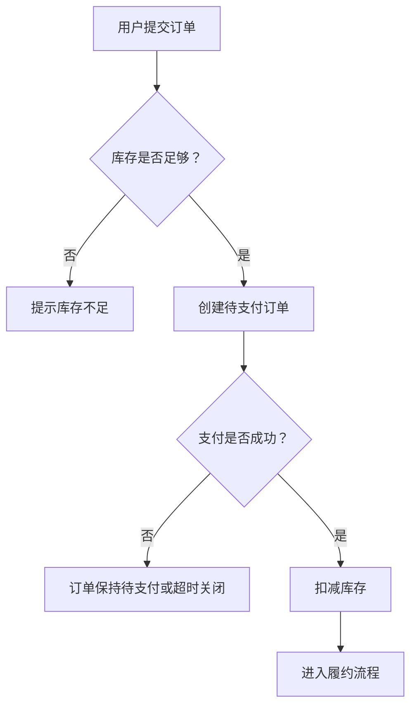

流程图的优点是直观，缺点是容易越画越大。一旦你发现一张流程图里同时出现十几个系统、几十个判断、多个角色职责，就应该考虑拆图，或者换成泳道图、时序图、状态机图。

### 活动图：更正式的流程表达

活动图（Activity Diagram）是 UML 中用于描述流程的图。它和普通流程图很像，但语义更明确，可以表达：

- 开始与结束。
- 分支与合并。
- 并行与汇合。
- 角色泳道。
- 对象流或控制流。

日常工作里，活动图常被当作“更规范的流程图”。如果只是表达简单业务流程，普通流程图已经够用；如果要表达并行任务、跨角色协作或较正式的业务建模，活动图会更合适。

### 泳道图：把职责也画出来

泳道图（Swimlane Diagram）不是一种全新的逻辑，而是在流程图或活动图的基础上，把流程按角色、部门或系统分成不同泳道。

它特别适合跨团队流程：

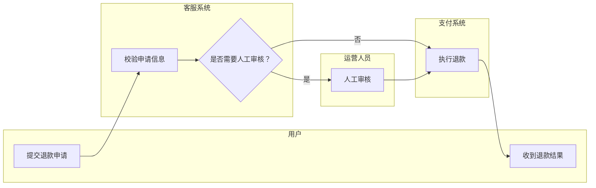

当流程中“谁负责”比“技术调用细节”更重要时，泳道图通常比时序图更好。

---

## 三、时序图：描述系统之间按时间发生的交互

时序图（Sequence Diagram）关注的是：**在一次具体场景里，哪些参与者按照什么顺序互相发送消息**。

它适合回答：

- 前端、后端、数据库、第三方服务如何协作？
- 一次请求从入口到返回经历了哪些调用？
- 同步调用、异步消息、回调、重试发生在哪里？
- 成功路径和失败路径分别是什么？

典型登录流程如下：

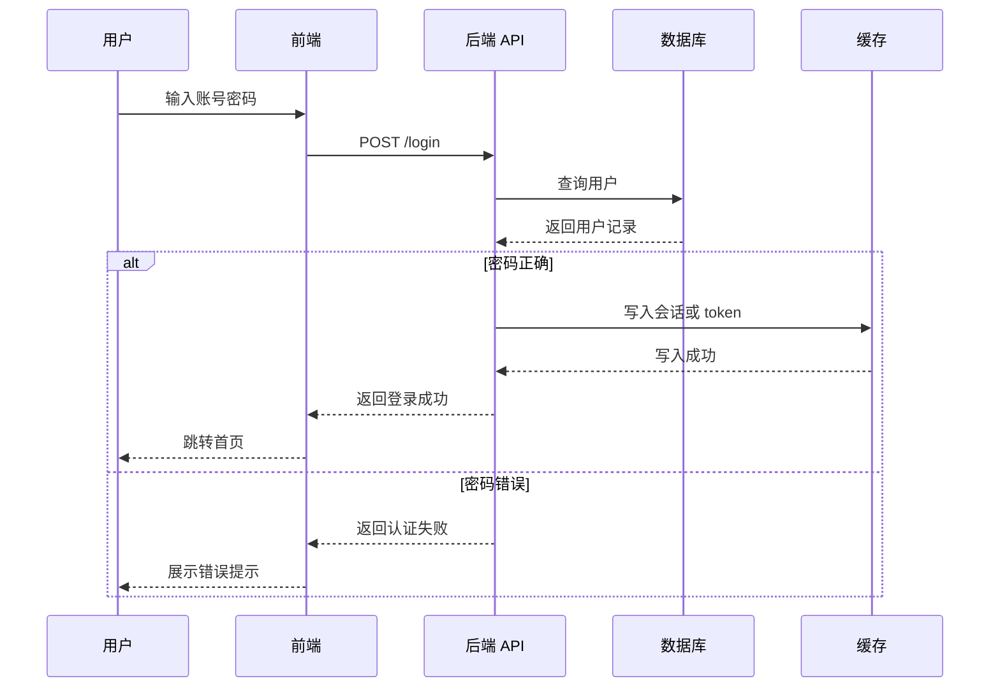

时序图最适合描述“一个场景”。不要试图把系统所有接口都塞进一张时序图里。好的时序图通常有一个明确标题，例如：

- 用户登录时序图。
- 下单支付时序图。
- 消息消费失败重试时序图。
- OAuth 回调处理时序图。

### 通信图：强调谁和谁有关联

通信图（Communication Diagram）也描述对象之间的交互，但它更强调参与者之间的连接关系，而不是时间轴。

在现代工程文档中，通信图的使用频率通常低于时序图。大多数时候，只要你关心调用顺序，用时序图就更直观；如果你更关心对象网络和协作结构，可以考虑通信图或组件图。

---

## 四、状态机图：描述对象生命周期

状态机图（State Machine Diagram）关注的是：**一个对象会处于哪些状态，以及什么事件会触发状态迁移**。

它适合回答：

- 订单从创建到完成有哪些状态？
- 任务、审批、工单、连接、会话如何流转？
- 哪些状态可以互相转换，哪些不可以？
- 哪些事件会触发状态变化？

例如订单状态：

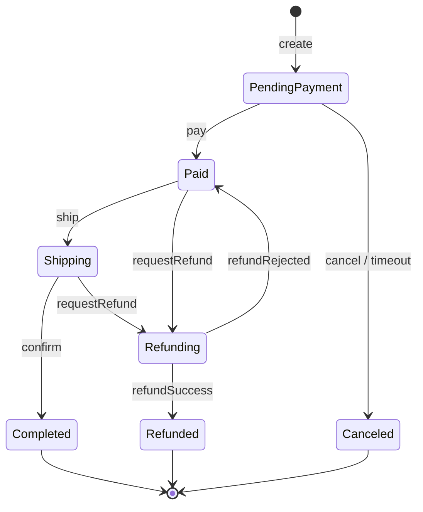

状态机图要比流程图更严格。流程图关心“步骤怎么走”，状态机图关心“对象当前处于什么状态，以及能不能迁移到另一个状态”。

一个常见误区是把所有字段值都画成状态。真正值得画状态机的对象，通常具有这些特征：

- 生命周期较长。
- 状态会影响允许执行的操作。
- 状态迁移有明确规则。
- 错误迁移会造成业务问题。

订单、支付单、工单、审批单、任务、连接、会话，都很适合用状态机图。

---

## 五、类图：描述类型、属性、方法和关系

类图（Class Diagram）是 UML 中最经典的结构图之一。它描述类或接口的字段、方法，以及它们之间的继承、实现、组合、聚合、关联关系。

它适合回答：

- 领域模型有哪些核心对象？
- 类之间是继承、组合还是普通关联？
- 一个接口有哪些实现？
- 设计模式中的角色如何落到代码结构上？

例如一个简化电商领域模型：

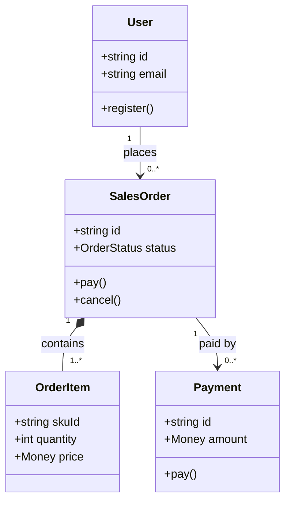

类图很适合解释代码结构，但不适合替代所有文档。尤其在现代工程中，类图如果过度细化，很快就会和代码不同步。实践中更推荐画“关键类图”：

- 只画核心领域对象。
- 只画重要字段和方法。
- 只画对理解设计有帮助的关系。

---

## 六、组件图：描述模块边界和依赖关系

组件图（Component Diagram）关注的是系统由哪些具有明确接口的模块组成，以及这些模块之间如何依赖和协作。

这里要注意一个容易混淆的点：在 UML 里，组件强调可替换的模块和暴露/依赖的接口；在 C4 模型里，Component 是某个 Container 内部的一组相关功能，通常**不是单独部署单元**。如果你想表达“服务跑在哪些机器或容器里”，应该使用部署图，而不是组件图。

它适合回答：

- 系统有哪些模块？
- 每个模块承担什么职责？
- 模块之间的依赖方向是什么？
- 哪些接口是对外暴露的？

例如一个后端系统的组件划分：

下面仍然用 Mermaid 的 flowchart 语法近似表达组件关系；如果是在 UML 工具中，可以换成标准的组件、接口和依赖符号。

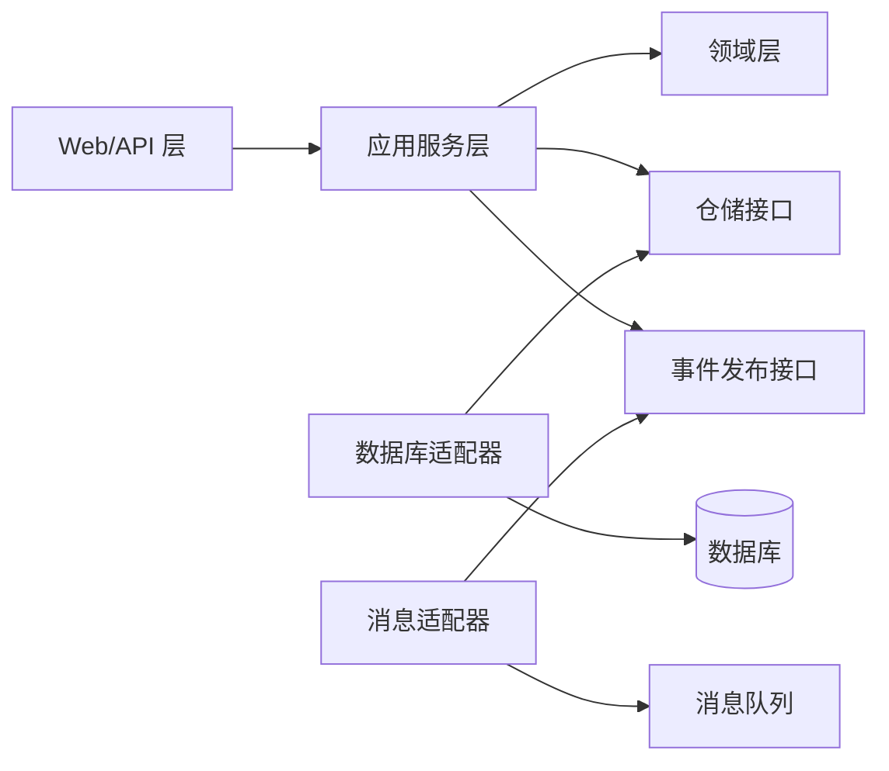

组件图的重点不是“代码文件在哪里”，而是“职责边界在哪里”。如果一张图能帮团队讨论哪些模块可以独立测试、替换和演进，它就是一张有效的组件图。

### 包图与依赖图

包图（Package Diagram）更偏代码组织，常用于表达包、命名空间、模块之间的依赖关系。

依赖图则更通用，可以用于：

- 代码模块依赖。
- 构建依赖。
- 服务依赖。
- 数据任务依赖。

它们的核心原则都一样：**依赖方向应该清晰，循环依赖应该被暴露出来**。

---

## 七、ER 图：描述数据实体和关系

ER 图（Entity Relationship Diagram）主要用于数据模型设计。它描述实体、实体属性以及实体之间的一对一、一对多、多对多关系；如果图的目标偏向物理数据库设计，也常会补充字段类型、主键和外键。

它适合回答：

- 系统有哪些核心数据实体？
- 实体之间是什么关系？
- 一个用户可以有多少订单？
- 一个订单包含多少明细？
- 哪些字段是标识和关联字段？

例如：

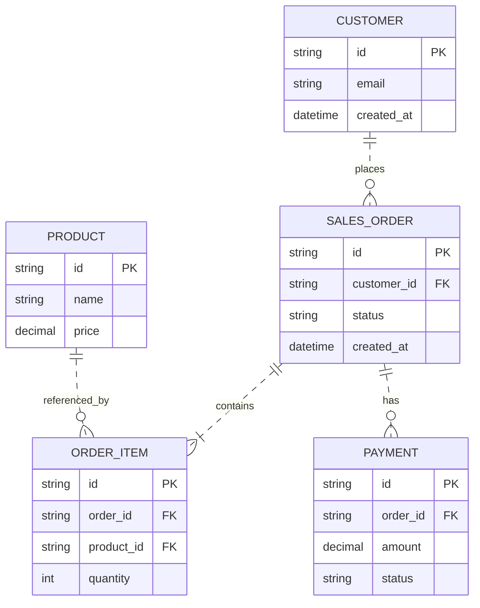

上面的示例使用了 Mermaid ER 图的 Crow's Foot 记法：`||` 表示“恰好一个”，`o{` 表示“零个或多个”，`|{` 表示“一个或多个”。关系线里的 `..` 表示非识别关系，更适合上面这种“子表有独立主键，同时用外键关联父表”的物理表设计；如果子实体必须依赖父实体才能被识别，可以使用 `--` 表示识别关系。

ER 图和类图容易混淆，但它们关注点不同：

| 图 | 关注点 | 常见问题 |
| --- | --- | --- |
| 类图 | 代码或领域对象的结构与行为 | 这个对象有哪些方法？如何组合？ |
| ER 图 | 数据库存储结构和实体关系 | 表怎么设计？外键和基数是什么？ |

一个领域对象不一定对应一张表，一张表也不一定对应一个类。特别是在 DDD、CQRS、事件溯源、读写模型分离等场景中，两者可能差异很大。

---

## 八、数据流图：描述数据如何在系统中流动

数据流图（Data Flow Diagram, DFD）关注的是数据从哪里来、经过哪些处理、存到哪里、流向哪里。正式 DFD 通常包含四类元素：外部实体、处理过程、数据存储和数据流。

它适合回答：

- 用户输入的数据进入系统后流向哪里？
- 哪些处理过程会读取或写入数据？
- 哪些外部系统会交换数据？
- 敏感数据会经过哪些边界？

例如，下面用 Mermaid 的 flowchart 语法近似表达一个 DFD：

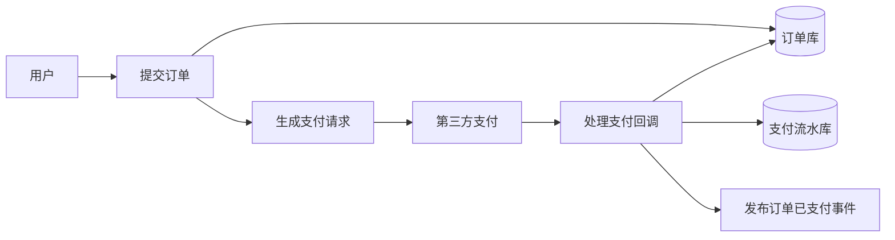

DFD 和流程图也容易混淆：

- 流程图强调控制顺序：先做什么，后做什么。
- 数据流图强调数据流向：数据从哪里到哪里，经过哪些处理。

当你在做隐私合规、数据治理、日志链路、风控链路、ETL 管道设计时，数据流图会比普通流程图更有帮助。

---

## 九、架构图：描述系统整体结构

“架构图”是一个宽泛概念，不是一种严格标准。只要它能表达系统边界、模块职责、服务关系、数据存储、外部依赖、部署形态，都可以叫架构图。

它适合回答：

- 系统边界在哪里？
- 内部有哪些服务或模块？
- 外部依赖有哪些？
- 请求大致如何进入系统？
- 数据存在哪里？
- 哪些组件是同步调用，哪些是异步通信？

例如一个典型 Web 系统：

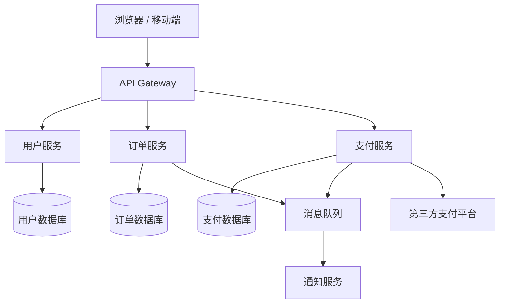

架构图最容易出问题的地方是“层次混乱”：一张图里同时出现业务能力、代码类、数据库表、物理机器、云产品、具体接口，最后谁也看不懂。

更好的办法是分层画图。这里最值得掌握的是 C4 模型。

### C4 模型：从宏观到微观逐层展开

C4 模型把架构表达分成四层：

| 层级 | 名称 | 关注点 |
| --- | --- | --- |
| Level 1 | System Context | 系统与用户、外部系统的关系 |
| Level 2 | Container | 系统内部的应用、服务、数据库、消息队列等运行单元 |
| Level 3 | Component | 某个容器内部的主要组件 |
| Level 4 | Code | 关键代码结构，例如 UML 类图 |

这里的 Container 指应用、数据存储、移动端应用、前端应用、批处理任务等运行边界，不是特指 Docker 容器。

可以把它理解成一组逐渐放大的地图：

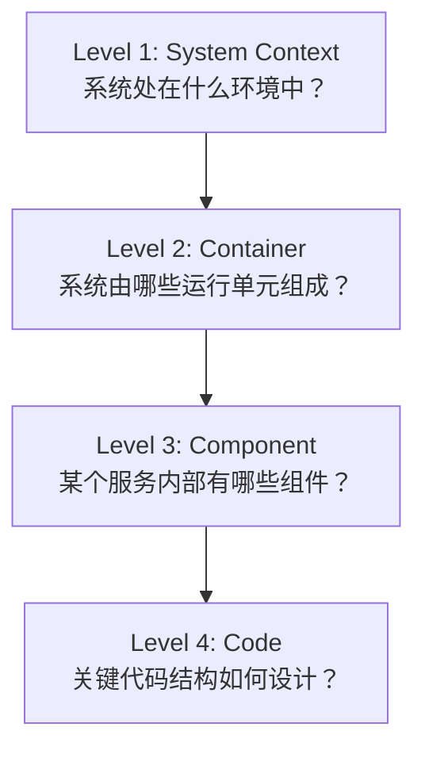

C4 的价值在于控制粒度。你不必在一张“超级架构图”里解释所有细节，而是根据读者需要逐层展开。

面向业务方，通常看 Context 图就够了。面向研发团队，Container 和 Component 图更有价值。Code 图只有在关键设计、复杂模式、框架扩展点等场景下才值得画。

---

## 十、部署图：描述系统运行在哪里

部署图（Deployment Diagram）关注运行时环境：服务部署在哪些节点、容器、虚拟机、Kubernetes 集群、云资源中，它们之间如何通信。这里的“部署图”泛指运行拓扑；在 UML 中它是标准图类型，在 C4 模型中它也作为辅助图存在。

它适合回答：

- 服务跑在哪些机器或容器里？
- 哪些组件在同一个网络边界内？
- 负载均衡、网关、数据库、缓存如何部署？
- 多可用区、多集群、灾备架构是什么样？

例如：

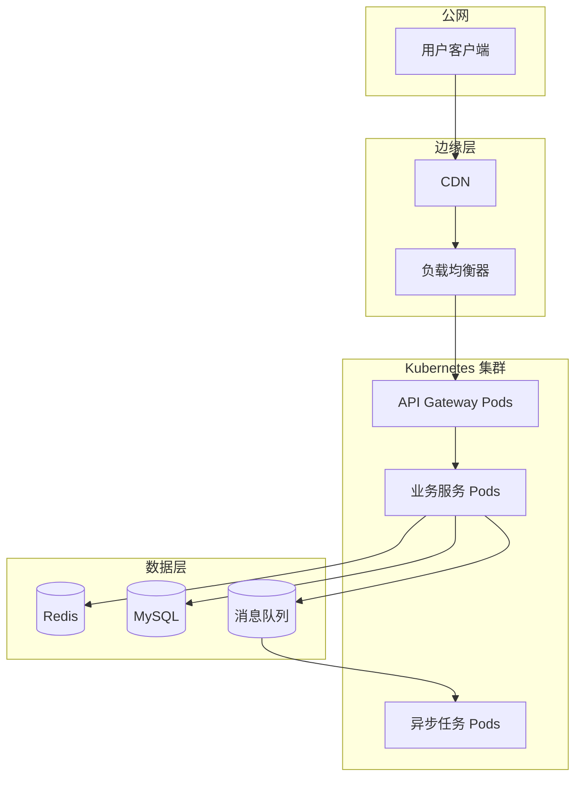

部署图和架构图的差别在于：

- 架构图更关注逻辑结构和职责边界。
- 部署图更关注运行环境和物理/云资源拓扑。

同一个系统，逻辑架构可能很稳定，但部署结构可能随着云平台、集群规模、容灾方案变化而变化。

---

## 十一、用例图：描述用户目标

用例图（Use Case Diagram）是 UML 中面向需求分析的一类图。它描述参与者（Actor）和系统能力之间的关系。

它适合回答：

- 系统有哪些用户角色？
- 每个角色能完成哪些目标？
- 外部系统如何参与业务？
- 系统边界内外分别是什么？

用例图不适合描述详细流程。它表达的是“谁能用系统做什么”，而不是“具体怎么做”。

例如电商系统里：

- 用户可以注册、登录、下单、支付、申请退款。
- 商家可以上架商品、处理订单、查看结算。
- 支付平台参与支付确认。
- 物流平台参与发货和轨迹同步。

如果你需要描述“用户下单后每一步怎么走”，用流程图或时序图；如果你需要描述“系统需要支持哪些能力”，用用例图。

### 用户旅程图

用户旅程图（User Journey Map）更偏产品和体验设计。它从用户视角描述完整体验路径，包括触点、目标、痛点和情绪变化。

它不属于传统代码建模图，但在软件工程中很实用，尤其适合：

- 梳理端到端体验。
- 找到用户流失点。
- 设计跨系统、跨团队的业务流程。
- 帮研发理解功能背后的真实场景。

---

## 十二、如何选择合适的图

选图时可以先问一句：**我现在最想让读者看懂什么？**

| 想说明的问题 | 优先选择 |
| --- | --- |
| 一个业务流程怎么走 | 流程图、活动图 |
| 多个角色或团队如何协作 | 泳道图 |
| 多个系统按什么顺序调用 | 时序图 |
| 一个对象有哪些状态和迁移规则 | 状态机图 |
| 领域对象或代码类型之间的关系 | 类图 |
| 模块职责和依赖方向 | 组件图、包图、依赖图 |
| 数据表、实体和关系 | ER 图 |
| 数据从哪里来到哪里去 | 数据流图 |
| 系统整体边界和外部依赖 | C4 Context 图、架构图 |
| 系统内部有哪些服务和存储 | C4 Container 图 |
| 服务部署在哪里 | 部署图 |
| 用户角色能做什么 | 用例图 |
| 用户完整体验路径是什么 | 用户旅程图 |

一个实际项目的文档，通常不需要把所有图都画一遍。比较常见的组合是：

1. **C4 Context 图**：先说明系统边界。
2. **C4 Container 图或架构图**：说明内部服务和存储。
3. **关键时序图**：说明核心业务链路。
4. **ER 图**：说明核心数据模型。
5. **状态机图**：说明关键业务对象生命周期。
6. **部署图**：说明生产环境运行结构。

这套组合已经能覆盖大多数工程沟通场景。

---

## 十三、画图的几个实践原则

### 1. 一张图只回答一个问题

不要把流程、部署、数据结构、接口细节全部塞进一张图。图越“大而全”，越容易失去表达力。

如果你发现图里需要超过 20 个节点，通常就该拆分。

### 2. 明确读者是谁

给业务方看的图，应该强调角色、能力、业务流程。

给研发看的图，可以强调模块、接口、数据、调用链路。

给运维或平台团队看的图，应该强调部署、网络、容量、容灾。

### 3. 区分逻辑视图和物理视图

逻辑架构图回答“系统由什么组成”。

部署图回答“这些东西运行在哪里”。

把两者混在一起，往往会导致图既不适合讨论设计，也不适合排查线上问题。

### 4. 用稳定名称，不用临时代号

图里的名称最好和代码、服务、数据库、接口文档保持一致。否则读者看完图，还要再做一次翻译。

### 5. 控制细节层级

架构图不需要画到类。

类图不需要画到每个 getter/setter。

ER 图不一定要画所有审计字段。

时序图不一定要画每一次日志记录和监控埋点。

只保留对理解问题有帮助的信息。

### 6. 图要能随代码演进

图如果维护成本太高，很快就会过期。相比昂贵的手工大图，很多团队更喜欢用 Mermaid、PlantUML、Structurizr DSL 这类文本化工具管理图。

文本化图的好处是：

- 可以进入 Git。
- 可以参与代码评审。
- 可以复用和局部修改。
- 可以和 Markdown 文档放在一起。

---

## 总结

软件工程中的图并不是装饰品，而是一种思考和沟通工具。

流程图讲步骤，时序图讲交互，状态机图讲生命周期，类图讲结构，ER 图讲数据关系，数据流图讲数据流向，架构图和 C4 图讲系统边界与层次，部署图讲运行环境，用例图和用户旅程图讲用户目标与体验。

真正好的图，不在于覆盖多少细节，而在于它能不能让团队围绕同一个问题快速达成共识。

在实际项目中，先从最关键的几张图开始：系统边界、核心架构、关键时序、核心数据、关键状态。把这些画清楚，文档的价值就已经非常高了。
