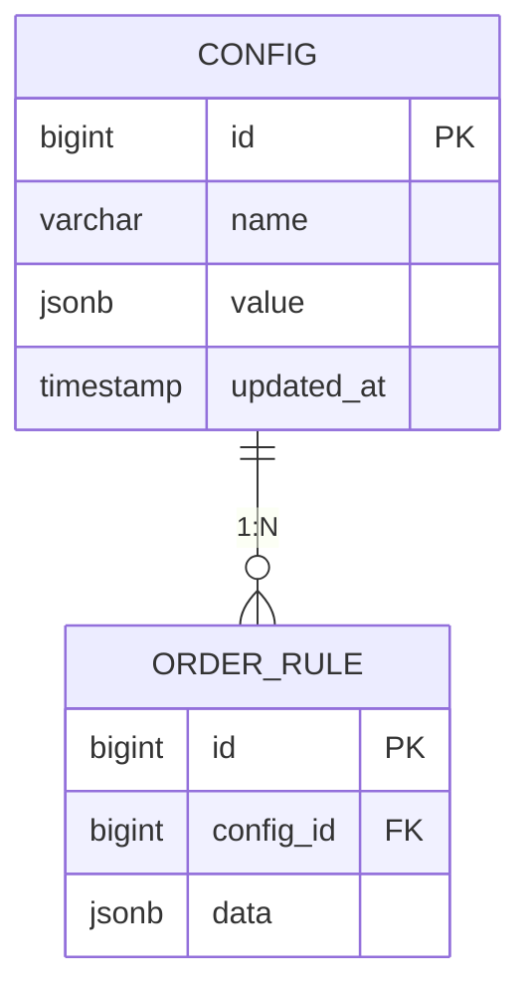
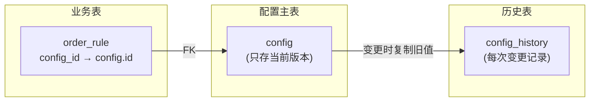
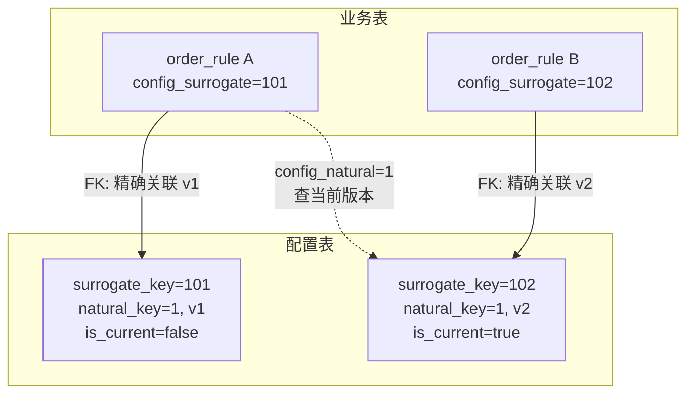
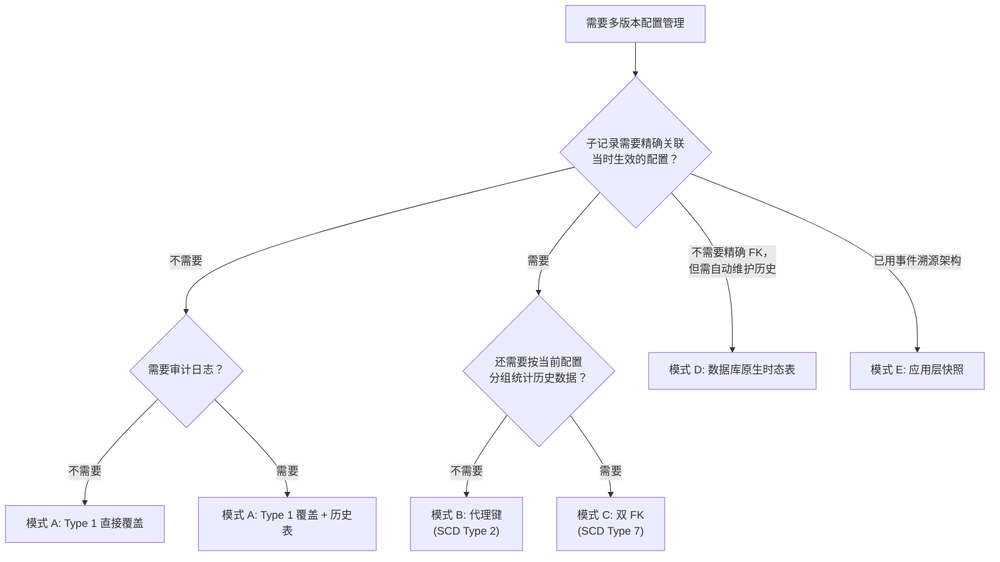

> **核心矛盾**：配置表需要版本化，但业务表通过外键引用配置。FK 指向"当前版本"则丢失历史上下文；FK 指向"某个版本"则查询变复杂。本文梳理业界主流方案，给出选型决策框架。

## 一、问题定义

一个典型的业务系统中，配置表和业务表的关系如下：



需求变化：**配置会随时间修改，但业务记录需要知道"当时用的是哪个版本的配置"。**

这就是"带外键的多版本配置管理"问题。核心冲突在于：

- **FK 指向当前版本**：查询简单，但业务记录无法追溯当时引用的配置
- **FK 指向某个版本**：业务记录精确关联当时配置，但查询需要版本条件

业界对此没有银弹，选型取决于一个关键问题：**是否需要"时间旅行查询"**。

---

## 二、业界权威来源

### 2.1 Kimball SCD 体系

Ralph Kimball 在 1996 年提出缓慢变化维度（Slowly Changing Dimension, SCD）分类，至今仍是数据仓库和配置管理领域最广泛引用的框架。Kimball Group 在 2013 年的 Design Tip #152 中进一步完善了 Type 0~7 的分类。

| SCD 类型 | 做法 | FK 设计 | 典型场景 |
|---------|------|---------|---------|
| Type 0 | 永不变更 | FK 正常 | 出生日期等常量 |
| Type 1 | 直接覆盖旧值 | FK 正常，简单 | 不需要历史 |
| Type 2 | 每次变更加新行，用代理键 | 事实表存 `surrogate_key`，精确关联当时版本 | 需要追溯历史配置 |
| Type 3 | 加列存旧值 | FK 不变 | 只看最近一次变化 |
| Type 4 | 把变化频繁的属性拆成 mini-dimension | 事实表存两个 FK | 高基数/高频变化 |
| Type 5 | Type 4 + Type 1 outrigger | 同上 | 当前值需要直接访问 |
| Type 6 | Type 2 行 + Type 1 列（当前值覆盖所有历史行） | 同一张表，双语义 | 既要按当时统计，也要按当前分组 |
| Type 7 | 事实表存双 FK：`surrogate_key` + `durable_natural_key` | 同一张维度表，事实表两个 FK 分别关联当前版本和历史版本 | 灵活性最高 |

### 2.2 Martin Fowler 时态模式

Martin Fowler 在 2005 年的 *Temporal Patterns* 中提出了面向对象视角的时间建模体系，核心模式包括：

- **Effectivity**：给对象加时间范围（`start_date` / `end_date`），表示生效期间
- **Temporal Property**：属性的访问器接受日期参数，隐藏时间维度的复杂性
- **Temporal Object**：对象分为"连续体"（continuity）和"版本"（version）两个角色
- **Snapshot**：返回某个时间点的对象快照

Fowler 特别指出两个关键洞察：

1. **实际时间（valid time）与记录时间（record time）是两个独立维度** —— 两者可能不一致，完整方案需要双时态（bi-temporal）
2. **Temporal Object 模式中，连续体可以只是一张版本表里的一个字段** —— 在关系数据库中，连续体不必是独立的表，用一个 `natural_key` 字段即可

### 2.3 SQL:2011 时态表标准

SQL:2011 标准引入了原生时态表支持：

- **Application-time period tables**（有效时间表）：用 `PERIOD FOR` 声明时间范围
- **System-versioned tables**（系统版本表）：数据库自动维护历史
- **Bitemporal tables**：两者结合

主流数据库支持情况：

| 数据库 | 特性 |
|--------|------|
| PostgreSQL | Range types 原生支持（9.2+），可结合 `btree_gist` 实现排他约束 |
| SQL Server 2016+ | `SYSTEM_VERSIONING` 时态表，自动维护历史 |
| MariaDB 10.3.4+ | System-Versioned Tables |
| IBM Db2 10+ | Time Travel Query |
| Oracle | Workspace Manager / Flashback |
| MySQL 8.0+ | 无原生时态表，需手动实现 |

**重要限制**：SQL:2011 时态表解决了"时间切片查询"问题，但**不解决 FK 精确关联版本的问题**。FK 仍然指向自然键，版本关联靠查询条件。

---

## 三、五种工程模式详解

### 模式 A：覆盖 + 历史表（SCD Type 1 + 审计表）

**适用场景**：只需要审计日志，不需要精确追溯子记录当时的配置。

```sql
-- 主表：只存当前版本
CREATE TABLE config (
    id          BIGINT PRIMARY KEY,
    name        VARCHAR(100),
    value       JSONB,
    updated_at  TIMESTAMP
);

-- 历史表：变更加新行，不破坏 FK
CREATE TABLE config_history (
    history_id  BIGINT PRIMARY KEY,
    config_id   BIGINT REFERENCES config(id),
    value       JSONB,
    valid_from  TIMESTAMP,
    valid_to    TIMESTAMP
);

-- FK 从业务表正常指向主表
CREATE TABLE order_rule (
    id          BIGINT PRIMARY KEY,
    config_id   BIGINT REFERENCES config(id),  -- FK 正常
    data        JSONB
);
```



**优点**：FK 约束完整，数据库层面可校验一致性；实现简单。

**缺点**：`order_rule` 无法精确知道下单时用的是哪个版本；历史查询需要额外 JOIN `config_history`。

---

### 模式 B：代理键 + 版本行（SCD Type 2）

**适用场景**：业务记录必须精确关联"当时生效的配置"。这是 Kimball、Fowler 以及业界实践共同推荐的基线方案。

```sql
-- 每次变更加新行，用自增代理键做真正的 PK
CREATE TABLE config (
    surrogate_key  BIGINT PRIMARY KEY,          -- 代理键，每版本一个
    natural_key    BIGINT NOT NULL,             -- 业务键（不变）
    name           VARCHAR(100),
    value          JSONB,
    version        INT NOT NULL DEFAULT 1,
    start_date     TIMESTAMP NOT NULL,
    end_date       TIMESTAMP,                   -- NULL = 当前生效
    is_current     BOOLEAN DEFAULT TRUE,
    UNIQUE(natural_key, version)
);

-- 业务表 FK 指向具体版本
CREATE TABLE order_rule (
    id                 BIGINT PRIMARY KEY,
    config_surrogate   BIGINT REFERENCES config(surrogate_key),  -- 精确版本
    config_natural     BIGINT NOT NULL,                          -- 冗余，便于查当前
    data               JSONB
);
```

查询时两种模式都支持：

```sql
-- 1. 查当时版本（精确）
SELECT c.value
FROM order_rule r
JOIN config c ON r.config_surrogate = c.surrogate_key;

-- 2. 查当前版本（快照）
SELECT c.value
FROM order_rule r
JOIN config c ON r.config_natural = c.natural_key
WHERE c.is_current = TRUE;
```



**简化变体**（复合外键）：

```sql
CREATE TABLE order_rule (
    id                BIGINT PRIMARY KEY,
    config_id         BIGINT NOT NULL,
    config_version    INT NOT NULL,
    data              JSONB,
    FOREIGN KEY (config_id, config_version)
        REFERENCES config(natural_key, version)
);
```

FK 用复合键直接约束"这个版本确实存在"，省去了代理键列。

**优点**：版本精确，DB 约束完整；两种查询模式都支持。

**缺点**：每变更一次配置就多一行，表会膨胀；老行需要维护 `is_current` 标记。

---

### 模式 C：双 FK（SCD Type 7）

**适用场景**：既要查历史快照，又要按当前配置分组统计。常见于分析型场景（报表、AB 实验归因）。

```sql
CREATE TABLE order_rule (
    id                   BIGINT PRIMARY KEY,
    config_surrogate     BIGINT REFERENCES config(surrogate_key),  -- 当时
    config_natural       BIGINT NOT NULL,                          -- 现在
    data                 JSONB
);

-- "当时的配置" → 走 surrogate_key
-- "当前配置分组" → 走 natural_key
```

```sql
-- 按当时配置分析
SELECT c.value, COUNT(*)
FROM order_rule r
JOIN config c ON r.config_surrogate = c.surrogate_key
GROUP BY c.value;

-- 按当前配置分组统计
SELECT c.value, COUNT(*)
FROM order_rule r
JOIN config c ON r.config_natural = c.natural_key AND c.is_current = TRUE
GROUP BY c.value;
```

**优点**：两种查询模式都快，无需子查询或 CASE；存储和查询的权衡最优。

**缺点**：存储多一列；ETL 需要额外维护 `config_natural` 字段。

---

### 模式 D：SQL:2011 时态表

**适用场景**：配置变更频繁，需要灵活的时间切片查询，但不需要精确 FK 关联版本。

```sql
-- PostgreSQL 示例：使用 Range 类型
-- 需要 btree_gist 扩展，使标量类型（如 BIGINT）可用于 GiST 排他约束
CREATE EXTENSION IF NOT EXISTS btree_gist;

CREATE TABLE config (
    id          BIGINT PRIMARY KEY,
    name        VARCHAR(100),
    value       JSONB,
    valid_range TSTZRANGE NOT NULL,
    EXCLUDE USING GIST (id WITH =, valid_range WITH &&)  -- 同一 id 不允许时间重叠
);

-- 查询当前生效的配置
SELECT * FROM config
WHERE valid_range @> now();

-- 查询某个历史时刻的配置
SELECT * FROM config
WHERE valid_range @> '2025-06-01'::timestamptz;
```

**注意**：时态表的核心价值是**系统自动维护历史 + 时间切片查询**，但**不解决 FK 精确关联版本的问题**。如果需要精确关联，仍需模式 B 或 C。

---

### 模式 E：应用层快照（事件溯源思路）

**适用场景**：配置变更频繁，且已采用事件驱动架构或 CQRS。

```sql
-- 配置表：只存当前版本，无历史
CREATE TABLE config (
    id      BIGINT PRIMARY KEY,
    name    VARCHAR(100),
    value   JSONB
);

-- 业务表：存储时把当时的配置快照 JSON 存进来
CREATE TABLE order_rule (
    id              BIGINT PRIMARY KEY,
    config_id       BIGINT REFERENCES config(id),
    config_snapshot JSONB,       -- 当时的配置快照（只读副本）
    data            JSONB
);
```

**优点**：FK 简单，查询快，版本信息完全在业务记录里；天然支持事件溯源。

**缺点**：配置与业务耦合，存储冗余，无法统一管理历史版本；配置 schema 变更时快照格式可能不一致。

---

## 四、选型决策框架

### 4.1 决策树



### 4.2 多维对比

| 维度 | 模式 A (历史表) | 模式 B (代理键) | 模式 C (双FK) | 模式 D (时态) | 模式 E (快照) |
|------|--------------|--------------|-------------|-------------|-------------|
| FK 完整性 | DB 保证 | DB 保证 | DB 保证 | 自然键 | DB 保证 |
| 精确版本关联 | 不支持 | 支持 | 支持 | 需应用层 | 支持 |
| 查当前配置 | 直接查主表 | WHERE is_current | 自然键 | 时间条件 | 直接查 |
| 按当前分组统计 | 支持 | 需 JOIN | 自然键 | 支持 | 支持 |
| DB 实现复杂度 | 低 | 中 | 中 | 高（需支持） | 低 |
| 存储开销 | 低 | 中 | 中高 | 中 | 高（JSON 冗余） |
| Schema 变更影响 | 小 | 小 | 小 | 中 | 大 |

---

## 五、实际工程建议

**大多数业务场景选模式 B（代理键 + 版本行）**。这是 Kimball SCD Type 2、Martin Fowler Temporal Object、以及业界实践共同推荐的基线方案。外键用 `surrogate_key` 精确关联当时版本，`natural_key` 冗余存一份便于查当前。

**配置变更频繁且需要按当前分组时，选模式 C（双 FK）**。分析型场景（报表、AB 实验归因）需要同时回答"当时配置是什么"和"当前配置属于哪个分组"，双 FK 是最直接的方案。

**不需要精确版本追溯时，选模式 A（历史表）**。大多数配置管理（功能开关、系统参数）只需要审计日志，不需要子记录精确关联当时版本。历史表方案最简单。

**不推荐纯时态表方案处理 FK**。SQL:2011 时态表解决了"时间切片查询"问题，但不解决 FK 精确关联版本的问题。需要版本精确关联时，仍需模式 B 或 C。

**快照方案（模式 E）适合事件驱动架构**。如果已经用了事件溯源或 CQRS，配置快照天然就在业务事件里，不需要额外的版本管理表。

---

## 六、常见误区

| 误区 | 纠正 |
|---|---|
| "用时态表就能解决 FK 问题" | 时态表解决的是时间切片查询，FK 仍然指向自然键，版本关联需要应用层处理 |
| "历史表和版本行是一回事" | 历史表是独立的审计表，不参与 FK；版本行是主表的一部分，可以被 FK 引用 |
| "双 FK 是冗余设计" | 双 FK 是 Type 7 标准模式，`surrogate_key` 和 `natural_key` 语义不同，各有用途 |
| "配置版本多了表会膨胀" | 配置变更频率通常不高（天/周级），膨胀可控；如果确实高频，考虑 mini-dimension（Type 4） |
| "应用层快照最简单" | 短期看确实简单，但配置 schema 变更时快照格式不一致，长期维护成本高 |
| "所有配置都需要版本管理" | 大多数配置（功能开关、系统参数）用 Type 1 覆盖就够了，只有需要追溯的配置才值得版本化 |

---

## 术语表

| 术语 | 解释 |
|---|---|
| SCD | Slowly Changing Dimension，缓慢变化维度，Kimball 提出的配置/维度变更分类体系 |
| 代理键（Surrogate Key） | 系统自动生成、无业务含义的唯一标识，每版本一个 |
| 自然键（Natural Key） | 有业务含义的唯一标识，整个生命周期不变 |
| 时态表（Temporal Table） | SQL:2011 标准，数据库原生支持时间范围查询和历史维护 |
| 双时态（Bi-temporal） | 同时记录"实际时间"（valid time）和"记录时间"（record time） |
| Effectivity | Martin Fowler 提出的模式，用时间范围标记对象的生效期间 |
| Temporal Object | Martin Fowler 提出的模式，对象分为"连续体"和"版本"两个角色 |
| 时间旅行查询（Time Travel Query） | 查询某个历史时刻的数据状态 |

## 参考文献

1. Kimball Group, [Design Tip #152: Slowly Changing Dimension Types 0, 4, 5, 6 and 7](https://www.kimballgroup.com/2013/02/design-tip-152-slowly-changing-dimension-types-0-4-5-6-7/), 2013
2. Kimball, Ralph; Ross, Margy. *The Data Warehouse Toolkit: The Definitive Guide to Dimensional Modeling, 3rd Edition*. Wiley, 2013
3. Martin Fowler, [Temporal Patterns](https://martinfowler.com/eaaDev/timeNarrative.html), 2005
4. Martin Fowler, [Effectivity](https://martinfowler.com/eaaDev/Effectivity.html), 2004
5. Martin Fowler, [Temporal Object](https://martinfowler.com/eaaDev/TemporalObject.html), 2004
6. Wikipedia, [Slowly Changing Dimension](https://en.wikipedia.org/wiki/Slowly_changing_dimension)
7. Wikipedia, [Temporal Database](https://en.wikipedia.org/wiki/Temporal_database)
8. Kulkarni, Krishna; Michels, Jan-Eike. "Temporal features in SQL:2011". ACM SIGMOD Record 41.3, 2012
