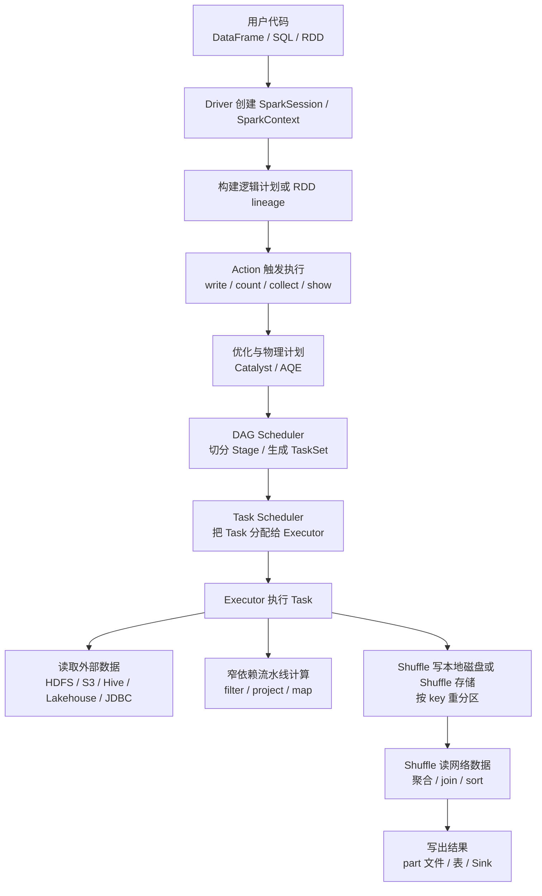
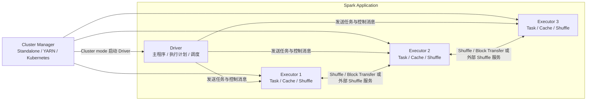
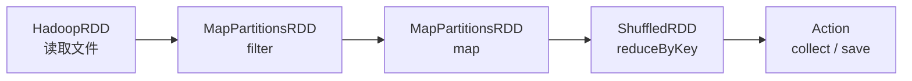
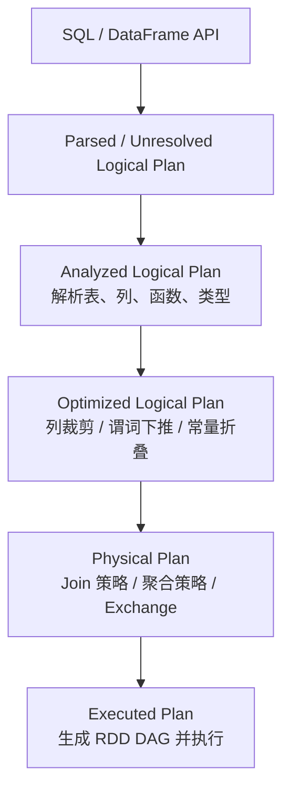
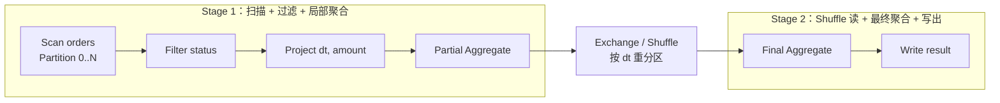
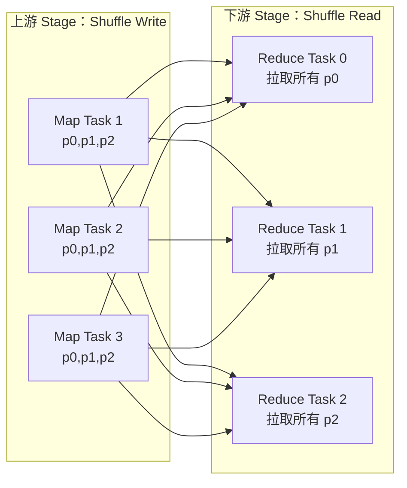
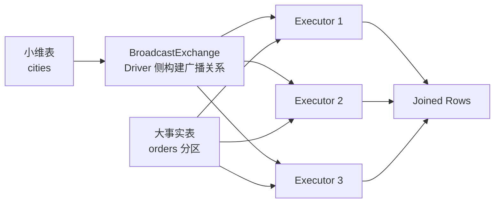
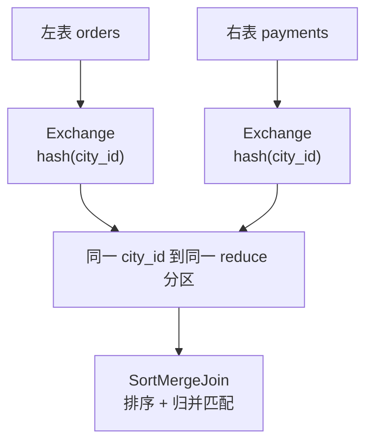
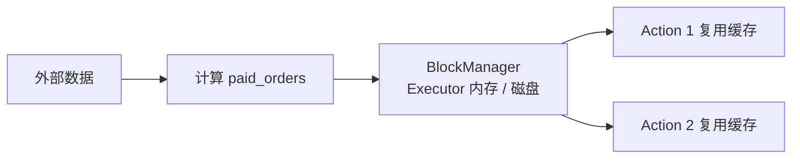
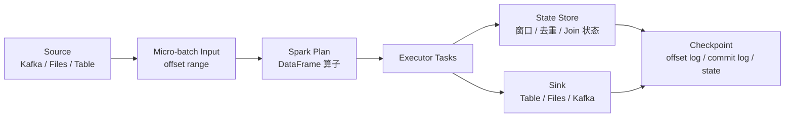

理解 Spark，不能只记 API，也不能只背 Driver、Executor、Stage、Task 这些名词。真正重要的是看清楚一件事：

> **Spark 把用户写下的计算逻辑转换成分布式执行计划，再把计划切成多个 Stage 和 Task，让 Executor 在不同数据分区上并行执行。业务数据通常不经过 Driver 汇总流转，而是在 Executor、外部存储和 Shuffle 数据之间移动。**

这篇文章从一次 Spark 作业的完整生命周期入手，拆开每个步骤发生了什么、数据在哪里、控制信息在哪里、什么时候会触发 Shuffle、什么时候会落盘、什么时候会缓存，以及失败后 Spark 如何恢复。

截至 2026-05-18，Apache Spark 官方 `latest` 文档对应 Spark 4.1.1；本文讲的是 Spark 的稳定核心模型，具体参数默认值和细节仍应以团队实际版本为准。

## 一、先看全链路：一段代码如何变成集群计算

以一段典型的 PySpark DataFrame 作业为例：

```python
from pyspark.sql import SparkSession
from pyspark.sql.functions import broadcast, col, sum as sum_

spark = SparkSession.builder.appName("daily-province-gmv").getOrCreate()

orders = spark.read.parquet("/warehouse/orders")
cities = spark.read.parquet("/warehouse/dim_cities")

report = (
    orders
    .where(col("status") == "paid")
    .select("dt", "city_id", "amount")
    .join(broadcast(cities.select("city_id", "province")), "city_id")
    .groupBy("dt", "province")
    .agg(sum_("amount").alias("gmv"))
)

(
    report.write
    .mode("overwrite")
    .partitionBy("dt")
    .parquet("/warehouse/reports/daily_province_gmv")
)
```

这段代码看起来像本地集合操作，但实际执行时大致会经历以下链路：



这条链路里要区分两种流：

1. **控制流**：Driver 负责生成计划、切分任务、调度任务、跟踪状态、处理失败和提交结果。
2. **数据流**：Executor 负责读输入、执行计算、写 Shuffle 数据、拉取 Shuffle 数据、缓存数据、写输出。

很多误解来自把这两种流混在一起。Driver 是调度中心，但不是数据中转站；除非使用 `collect`、过大的广播表、某些元数据操作或结果回传，否则大规模业务数据不应该被拉到 Driver。

## 二、运行角色：Driver、Executor、Cluster Manager

一个 Spark Application 通常由一个 Driver 和多个 Executor 组成，并由 Cluster Manager 分配资源。需要注意，Cluster Manager 是否直接启动 Driver 取决于 deploy mode：cluster mode 下 Driver 在集群内启动，client mode 下 Driver 运行在提交进程中。



**Driver 负责什么？**

1. 运行用户的 `main` 函数。
2. 创建 `SparkSession` 或 `SparkContext`。
3. 构建逻辑计划、物理计划或 RDD lineage。
4. 根据 Action 生成 Job。
5. 将 Job 切成 Stage，并为 Stage 准备 TaskSet。
6. 通过 Task Scheduler 把 Task 分发给 Executor，并跟踪 Task 成功、失败、重试。
7. 维护广播变量、累加器、缓存块位置、Shuffle map 输出位置等元信息。

**Executor 负责什么？**

1. 运行具体 Task。
2. 从外部存储读取输入分区。
3. 执行过滤、投影、表达式计算、聚合、Join 等算子。
4. 通常把 Shuffle 中间数据写到本地磁盘，并向 Driver 汇报 Shuffle block 位置；使用可靠 Shuffle 存储或自定义 ShuffleDataIO 时实现会不同。
5. 从其他 Executor、外部 Shuffle 服务或可靠 Shuffle 存储拉取 Shuffle block。
6. 在内存或磁盘中缓存数据块。
7. 将最终结果写到外部存储或返回少量结果给 Driver。

**Cluster Manager 负责什么？**

Cluster Manager 只负责资源层面的问题：按部署模式启动或协调 Driver、申请和回收 Executor、分配 CPU 和内存、处理容器或进程生命周期。它不理解你的 SQL 语义，也不负责拆分 Stage。

## 三、提交阶段：spark-submit 之后发生什么

生产环境里，Spark 作业通常通过 `spark-submit` 或调度平台提交。提交阶段主要流转的是代码、配置和资源请求，还不是业务数据。

典型步骤如下：

1. 客户端提交应用代码、依赖、参数和 Spark 配置，例如 executor 数量、executor 内存、executor cores、队列、镜像、JAR 或 Python 文件。
2. Driver 的启动位置由 deploy mode 决定：Client 模式下 Driver 在提交进程中运行；Cluster 模式下 Driver 由 Cluster Manager 在集群内部启动。
3. Driver 创建 `SparkContext`，向 Cluster Manager 申请 Executor。
4. Executor 启动后向 Driver 注册，汇报可用资源。
5. Driver 或 SparkContext 按部署方式分发应用代码和依赖；Task 调度时闭包和任务描述会发送给 Executor，广播变量则通过广播机制分发。
6. Spark UI 启动，常见端口是 Driver 上的 `4040`，用于查看 Job、Stage、Task、Executor、SQL、Storage 等运行信息。

这一阶段的数据流可以概括成：

```text
提交端 -> Cluster Manager: 应用描述、资源配置、依赖信息
Cluster Manager -> Driver/Executor: cluster mode 启动 Driver，并启动 Executor
提交端 -> Driver: client mode 下 Driver 在提交进程中运行
Driver <-> Executor: 注册、心跳、任务调度、状态汇报
```

真正的大规模业务数据通常还没有被读取。`spark.read.parquet(...)` 只是构建 DataFrame 的读取关系，可能会读取文件元数据或表元数据，但不会把整张表拉入 Driver。

## 四、从 API 到计划：Spark 先记账，不急着计算

Spark 的核心执行习惯是惰性求值。大多数 Transformation 只描述计算，不立刻执行。

```python
orders = spark.read.parquet("/warehouse/orders")
paid = orders.where("status = 'paid'")
daily = paid.groupBy("dt").count()

# 到这里通常还没有真正扫描完整业务数据
daily.show()

# show 是 Action，会触发 Job
```

### 1. RDD 路径：形成 lineage DAG

如果使用 RDD API，`map`、`filter`、`reduceByKey` 等转换会形成一条 RDD lineage。每个 RDD 记录自己依赖哪些父 RDD、依赖关系是什么、分区如何产生。



lineage 的价值在于容错：如果某个分区丢了，Spark 可以沿着血缘关系重新计算这个分区，而不是从头恢复整个应用。

### 2. DataFrame 和 SQL 路径：进入 Catalyst

DataFrame 和 SQL 会进入 Spark SQL 的计划体系。SQL 字符串会先被解析成未解析逻辑计划；DataFrame API 通常直接通过 API 调用构造等价的逻辑计划，也会进入后续分析、优化和物理计划生成流程。大致阶段是：

1. **Parsed / Unresolved Logical Plan**：SQL 字符串经过解析得到未解析逻辑计划；DataFrame API 也会构造逻辑计划节点。
2. **Analyzed Logical Plan**：绑定表、列、函数、类型等信息，确认字段是否存在、类型是否匹配。
3. **Optimized Logical Plan**：做逻辑优化，例如列裁剪、谓词下推、常量折叠、过滤合并、投影合并等。
4. **Physical Plan**：选择具体物理算子，例如扫描、过滤、HashAggregate、SortMergeJoin、BroadcastHashJoin、Exchange。
5. **Executed Plan**：运行期执行计划，AQE 开启后可能根据运行期统计信息继续调整。



DataFrame 和 SQL 的优势在这里：因为 Spark 知道 Schema 和关系算子语义，所以可以优化执行计划。RDD API 更灵活，但 Spark 对其中的业务函数理解较少，优化空间也少。

## 五、Action：什么时候真正开始跑

Spark 中常见的 Action 包括：

| API 类型 | 常见 Action |
| --- | --- |
| RDD | `count`、`collect`、`take`、`reduce`、`saveAsTextFile` |
| DataFrame / Dataset | `count`、`collect`、`show`、`take`、`foreach`、`write.parquet`、`write.saveAsTable` |
| Streaming | `writeStream.start()` 启动查询，之后由 Trigger 持续触发微批或连续执行 |

Action 触发后，Driver 才会把前面累积的计划提交给调度器。一个 Action 通常会触发一个 Job，但复杂 SQL 可能因为广播子查询、统计信息收集、写入提交等行为产生多个 Job。判断标准不是“代码里写了几行”，而是 Spark UI 里实际出现了几个 Job 和 SQL execution。

对流式 DataFrame/Dataset，不应把批处理里的 `count()`、`collect()` 直接当作启动方式；通常要通过 `writeStream` 定义输出和 checkpoint，再调用 `start()` 启动查询。

这里最危险的 Action 是 `collect`。它会把分布式结果拉回 Driver，适合小结果调试，不适合大表。`show` 和 `take` 通常只取少量行，但复杂计划仍可能扫描或计算较多数据；生产代码里不要把它们当成免费操作。

## 六、DAG、Job、Stage、Task：Spark 如何切分执行

Action 触发后，Driver 会把执行计划转换成可调度的 DAG。核心拆分单位如下：

| 概念 | 含义 | 产生方式 |
| --- | --- | --- |
| Job | 一次由 Action 触发的并行计算 | `count`、`write`、`collect` 等 |
| Stage | Job 中一段可以流水线执行的任务集合 | 遇到 Shuffle / Exchange 等边界切分 |
| Task | Stage 内处理一个分区的最小执行单元 | Task 数通常等于该 Stage 需要处理的分区数；Shuffle map stage 通常按上游分区生成 Task，Shuffle reduce stage 通常按下游 Shuffle 分区生成 Task |
| Partition | 数据分区，也是并行度的基本来源 | 文件切分、Shuffle 分区、`repartition` 等产生 |

Stage 切分的关键是依赖关系。

**窄依赖**指一个子分区只依赖少量父分区，典型操作包括 `map`、`filter`、`select`、部分 `mapPartitions`。窄依赖可以在同一个 Task 内流水线执行。

**宽依赖**指一个子分区依赖多个父分区，典型操作包括 `groupByKey`、`reduceByKey`、`distinct`、`orderBy`、`repartition`，以及没有命中广播、已有分区布局、bucket 或 Storage Partition Join 优化的 Join。宽依赖通常需要 Shuffle，是 Stage 边界。



上图中，`Scan`、`Filter`、`Project`、`Partial Aggregate` 可以在同一个上游 Stage 内流水线执行。`Exchange / Shuffle` 会把数据按聚合 key 重新分布，因此下游 `Final Aggregate` 必须等上游 Shuffle map 任务产生可读取的中间数据后才能继续。

## 七、读取阶段：输入数据如何进入 Executor

以文件数据源为例，Spark 读取数据不是“一个文件一个任务”这么简单，而是会根据文件大小、格式、配置和文件系统元数据生成输入分区。

常见流程如下：

1. Driver 解析读取路径或表信息，通过 Catalog、文件系统或元数据服务获得文件列表、Schema、分区目录等信息；路径数量很多时，Spark SQL 也可能触发分布式文件列举任务。
2. Spark 根据文件大小和配置生成输入分区。Spark SQL 文件源中，`spark.sql.files.maxPartitionBytes` 的默认值是 `128MB`，用于控制一个输入分区最多打包多少字节；实际切分还会受文件格式是否可切分、`spark.sql.files.openCostInBytes`、建议性的 `minPartitionNum` / `maxPartitionNum` 等配置影响。
3. Task 被调度到 Executor 后，Executor 根据分区描述直接从外部存储读取对应数据。
4. 对 Parquet、ORC 这类列式格式，Spark 可以只读需要的列；如果数据源支持，也可能把过滤条件下推到数据源。
5. 读取后的数据进入后续物理算子，常见内部形态是行式记录或列式批次，具体取决于数据源、算子和执行路径。

数据流转是：

```text
外部存储 -> Executor Task -> Scan 算子 -> Filter / Project / Aggregate / Join
```

Driver 参与的是元数据和调度，不负责把每个文件内容读出来再转发给 Executor。

小文件会在这个阶段制造明显问题：文件太多会增加元数据列举、任务调度和文件打开成本；每个任务处理的数据太少，也会让调度开销占比变高。解决小文件问题通常要从上游写入、表格式 compaction、合理分区和文件大小控制入手。

## 八、窄依赖流水线：为什么 filter 和 select 通常很便宜

在没有 Shuffle 的情况下，多个窄依赖算子通常可以在同一个 Task 内连续执行。

例如：

```python
paid = (
    orders
    .where(col("status") == "paid")
    .select("dt", "city_id", "amount")
)
```

每个 Task 处理一个输入分区，数据在这个 Task 内的流动大致是：

```text
读取一批订单行
  -> 判断 status 是否等于 paid
  -> 丢弃不需要的列
  -> 把保留下来的行交给下一个算子
```

如果后面没有缓存、Shuffle 或写出，这些中间结果通常不会作为完整数据集落盘。它们以迭代器、批次或内部行的形式在算子之间传递。Spark 之所以能快，很大一部分原因就在于它会尽量把可流水线化的操作合并到同一个 Task 内，减少中间物化。

但“窄依赖便宜”不是说没有成本。过滤条件复杂、UDF 很慢、数据源无法列裁剪、解压成本高、单分区过大、Python UDF 跨语言传输频繁，都会让窄依赖阶段变慢。

## 九、Shuffle：Spark 数据流转中最关键的分水岭

Shuffle 是 Spark 中最重要、最昂贵、也最容易出问题的数据流转过程。只要需要“相同 key 的数据来到同一个下游分区”，通常就需要 Shuffle。

典型触发场景包括：

1. `groupBy`、`groupByKey`、`reduceByKey`、`aggregateByKey`。
2. 没有命中广播、已有分区布局、bucket 或 Storage Partition Join 优化的大表 Join。
3. `distinct`、`dropDuplicates`。
4. `repartition`。
5. 全局 `sort`、窗口函数中的部分排序与分布要求。

Shuffle 可以拆成 Map 侧写和 Reduce 侧读。

### 1. Shuffle Map 侧：按目标分区写中间文件

上游 Stage 的每个 Task 会处理一个输入分区，并把输出记录按下游分区规则切开。

以 `groupBy("dt")` 为例：

```text
输入记录: (dt=2026-05-17, amount=100)
概念分区规则: partition_id = pmod(spark_hash(dt), shuffle_partitions)
目标分区: reduce partition 37
```

这里的 `pmod(spark_hash(...), shuffle_partitions)` 是帮助理解的概念公式，重点是分区 ID 必须落在 `[0, shuffle_partitions)`。它不是要求用户用 Python 或 Java 的 `hash` 函数复现 Spark 内部结果；真实计划会使用 Spark 物理计划里的 `HashPartitioning`、`RangePartitioning` 或具体算子的分布要求。

Map 侧会做几件事：

1. 根据 HashPartitioning、RangePartitioning 或具体算子要求，计算每条记录属于哪个下游分区。
2. 如果是可局部聚合的算子，先做 map-side partial aggregate，减少写出的记录数。
3. 将不同目标分区的数据写入本地 Shuffle 文件；如果集群使用远端或可靠 Shuffle 存储，实现会有所不同。
4. 如果内存不足，排序、聚合或缓冲过程会 spill 到磁盘。
5. Task 成功后向 Driver 汇报自己的 Shuffle block 位置信息。

### 2. Shuffle Reduce 侧：从所有 Map 输出拉取自己的分区

下游 Stage 的每个 Task 通常负责一个 Shuffle reduce 分区。开启 AQE 合并 post-shuffle 分区等优化后，一个物理 Task 也可能读取一组合并后的分区范围。它会从相关上游 Executor、外部 Shuffle 服务或可靠 Shuffle 存储拉取属于自己的那部分 block。

```text
Reduce Task 37 需要:
  Map Task 0 写出的 partition 37
  Map Task 1 写出的 partition 37
  Map Task 2 写出的 partition 37
  ...
  Map Task N 写出的 partition 37
```

然后它会把这些数据合并、排序或聚合，产出最终结果分区。



Shuffle 昂贵，是因为它同时消耗网络、磁盘、序列化、内存和调度资源。Spark UI 里如果看到 Shuffle Read/Write 很大、spill 很多、少数 Task 特别慢，通常就要重点排查数据倾斜、分区数、Join 策略和聚合方式。

## 十、聚合的数据流：从局部聚合到最终聚合

聚合是理解 Spark 数据流的最佳例子。下面这段代码：

```python
result = (
    orders
    .where(col("status") == "paid")
    .groupBy("dt")
    .agg(sum_("amount").alias("gmv"))
)
```

在 Spark SQL 里通常不会简单地把所有明细数据直接 Shuffle 后再聚合，而是会尽量拆成两步：

1. **Partial Aggregate**：每个输入分区内部先按 `dt` 聚合，得到局部结果。
2. **Final Aggregate**：Shuffle 后，相同 `dt` 的局部结果来到同一个下游分区，再做最终合并。

数据流大致如下：

```text
订单明细分区 1:
  (2026-05-17, 100), (2026-05-17, 50), (2026-05-18, 20)
  -> 局部聚合: (2026-05-17, 150), (2026-05-18, 20)

订单明细分区 2:
  (2026-05-17, 70), (2026-05-18, 30)
  -> 局部聚合: (2026-05-17, 70), (2026-05-18, 30)

Shuffle by dt:
  2026-05-17 的局部结果进入同一组下游分区
  2026-05-18 的局部结果进入同一组下游分区

最终聚合:
  (2026-05-17, 220)
  (2026-05-18, 50)
```

这就是为什么 `reduceByKey` 通常比 `groupByKey` 更适合做 RDD 聚合：前者可以在 Map 侧先合并，减少 Shuffle 数据量；后者倾向于把同一个 key 的所有原始 value 拉到一起后再处理，网络和内存压力更大。

## 十一、Join 的数据流：广播、Shuffle 与排序

Join 是 Spark 作业里最常见的性能分界点。不同 Join 策略的数据流完全不同。

### 1. Broadcast Hash Join：小表构造成广播关系并分发到 Executor

当一边表足够小，Spark 可以使用广播 Join。Spark SQL 的 `spark.sql.autoBroadcastJoinThreshold` 默认值是 `10MB`；也可以通过 `broadcast(df)` 或 SQL hint 显式提示。

广播 Join 的数据流是：

1. 小表一侧先被计算出来，BroadcastExchange 会在 Driver 侧收集并构造成可广播的关系结构，例如哈希关系。
2. Spark 通过广播机制把这个序列化后的关系分发给相关 Executor，Executor 在本地反序列化或读取后供 Task 使用。
3. 大表按原有分区并行扫描。
4. 每个 Task 在本地用大表记录查广播哈希表，完成 Join。
5. 大表一侧通常不需要按 Join key Shuffle。



广播 Join 的优势是避免大表 Shuffle；风险是小表并不小，导致 Driver 或 Executor 内存压力、广播超时，甚至 OOM。广播表必须谨慎控制大小。

### 2. Sort-Merge Join：两边都按 Join key 重分区

当两边都很大、且没有可复用的分区布局时，Spark 常见选择是 Sort-Merge Join。它的数据流通常是：

1. 左表按 Join key Shuffle，除非上游已经满足所需分布。
2. 右表按 Join key Shuffle，除非上游已经满足所需分布。
3. 相同 key 的左右数据来到相同下游分区。
4. 每个下游 Task 对本分区两侧数据排序并归并匹配。



Sort-Merge Join 能处理大数据，但代价是两边 Shuffle、排序和网络传输。数据倾斜时，某些 key 的分区会异常大，导致少数 Task 拖慢整个 Stage。

### 3. AQE：运行时再优化

Adaptive Query Execution，简称 AQE，会利用运行期统计信息调整执行计划。Spark 3.2.0 起 AQE 默认开启；在 Spark 4.1.1 文档中，`spark.sql.adaptive.enabled` 默认值为 `true`。

AQE 常见能力包括：

1. 合并 Shuffle 后的小分区，减少过多小 Task。
2. 在 join 类型和阈值允许时，根据运行时大小把 Sort-Merge Join 转成 Broadcast Hash Join。
3. 对倾斜 Shuffle 分区进行拆分，降低长尾 Task 影响。
4. 在满足条件时选择更合适的 Join 策略。

AQE 不是万能优化器。统计信息不准、UDF 黑盒逻辑、极端数据倾斜、文件布局很差、资源配置不合理时，仍需要工程师手工分析。

## 十二、缓存与持久化：数据如何留在 Executor

`cache` 和 `persist` 的目的，是让一个中间结果在多个 Action 或多个分支中复用，避免反复从源头重算。

```python
paid_orders = orders.where(col("status") == "paid").cache()

paid_orders.count()          # 第一次 Action，触发计算并填充缓存
paid_orders.groupBy("dt").count().show()
paid_orders.groupBy("city_id").count().show()

paid_orders.unpersist()
```

缓存的数据流是：



关键细节：

1. `cache()` 本身也是惰性的，第一次 Action 才会真正填充缓存。
2. DataFrame 缓存通常使用内存列式格式，并可自动选择压缩以减少内存和 GC 压力。
3. 缓存在每个 Spark Application 自己的 Executor 内，不同 Application 不能直接共享。
4. 缓存块丢失后，Spark 通常可以按 lineage 重新计算。
5. 缓存不是越多越好。缓存会占用存储内存，可能挤压执行内存，导致 Shuffle、Join、Sort 更容易 spill。
6. 不再使用的缓存应及时 `unpersist()`。

如果 lineage 很长、重算代价很高，或者流式状态和批处理边界需要更可靠的恢复，可以考虑可靠 checkpoint。这里的 checkpoint 指把数据写到可靠存储并切断 lineage；`localCheckpoint` 依赖本地存储，容错语义不同。checkpoint 本身也是一次额外 I/O 成本。

## 十三、写出阶段：结果不是由 Driver 合成一个文件

批处理写文件时，常见误解是“最后 Driver 把结果写到目标目录”。实际不是这样。

以 Parquet 写出为例，数据流通常是：

1. 下游 Stage 的每个 Task 处理执行计划中的一个结果分区，也就是一个 RDD/DataFrame partition。
2. Task 在 Executor 上把自己负责的数据写到目标文件系统的临时输出位置，通常会生成一个或多个 `part-*` 文件。
3. 如果使用 `partitionBy("dt")`，输出会按 `dt=...` 这样的目录布局落到文件系统；同一个 Task 可能写入多个分区目录，同一个分区目录也可能收到多个 Task 写出的多个 part 文件。
4. Task 写成功后向 Driver 汇报。
5. Driver 协调提交协议，最终确认输出。

```text
Executor Task 0 -> /warehouse/reports/daily_province_gmv/dt=2026-05-17/part-00000-...
Executor Task 1 -> /warehouse/reports/daily_province_gmv/dt=2026-05-17/part-00001-...
Executor Task 2 -> /warehouse/reports/daily_province_gmv/dt=2026-05-18/part-00002-...
```

因此，输出文件数量通常与写出阶段的结果分区数、动态分区列取值分布、文件格式写入器和提交协议有关，而不是 Driver 决定生成一个总文件。强行 `coalesce(1)` 可以得到更少文件，但会牺牲并行度，让少数 Task 承担大量数据写入，常常不适合大数据量生产作业。

对象存储上还要特别注意提交协议和重命名成本。HDFS 的 rename 通常便宜，对象存储的 rename 往往是复制加删除，写出策略需要结合具体表格式、文件系统连接器和提交器实现评估。

## 十四、失败恢复：哪些数据会重算，哪些数据会丢

Spark 的容错依赖多个层次。

### 1. Task 失败

单个 Task 失败时，Driver 会把同一个 Task 重新调度到可用 Executor 上。只要输入数据还在、依赖还可恢复，Task 可以重新计算。

### 2. Executor 失败

Executor 失败会带走三类东西：

1. 正在运行的 Task。
2. 该 Executor 内存或本地磁盘上的缓存块。
3. 该 Executor 本地磁盘上的 Shuffle 文件；如果只是 Executor 进程退出，而节点上的外部 Shuffle 服务仍可访问，这些文件可能继续被下游读取。

缓存块丢失后通常可以根据 lineage 重算。Shuffle 数据不可访问则更复杂：下游如果拉不到需要的 Shuffle block，可能触发 FetchFailed，Driver 会重新运行相关上游 Shuffle map stage 来重建缺失的 map 输出。

启用动态资源分配时，Spark 需要外部 Shuffle 服务、Shuffle tracking、decommission 机制或可靠 Shuffle 存储来避免 Executor 被移除后 Shuffle 文件直接丢失。

### 3. Driver 失败

Driver 是应用调度状态中心。Driver 失败通常意味着整个 Spark Application 失败，是否能自动重启取决于部署模式、集群管理器、调度平台和应用本身设计。Structured Streaming 可以通过 checkpoint 恢复 offset、commit 和状态，但这不等于普通批处理 Driver 失败后天然无损续跑。

### 4. 输出失败

写出阶段的失败要看数据源、提交协议和幂等设计。批处理作业最好采用可重复覆盖、临时目录加原子发布、分区级重跑或表格式事务能力，避免部分成功、部分失败导致下游读到不一致数据。

## 十五、Structured Streaming：流式计算也是计划和数据流

Structured Streaming 使用 DataFrame/Dataset API 表达流式计算。它的关键思想是：把无界数据流看成不断增长的表，用类似批处理的关系算子表达计算。

常见微批模式下，数据流是：

1. Driver 启动 Streaming Query。
2. 每个 Trigger 到来时，Driver 查询 Source 的新 offset 或新文件范围。
3. Spark 为这一批增量数据生成执行计划。
4. Executor 读取本批输入分区，执行过滤、Join、聚合等算子。
5. 如果有状态算子，例如窗口聚合、去重、流流 Join，状态会写入 State Store，并把状态数据和元数据 checkpoint 到可靠存储。
6. Sink 提交结果，checkpoint 目录记录 offset log、commit log 以及状态数据或状态元数据。



流式作业的难点不只是吞吐，还有状态大小、迟到数据、水位线、端到端语义、Sink 幂等、checkpoint 可靠性和重启恢复。它复用了 Spark SQL 的大量执行机制，但多了长期运行和状态管理的复杂度。

## 十六、用 Spark UI 观察真实数据流

理解 Spark 不应该只靠猜。Spark UI 能把上面这些概念落到证据上。

| UI 位置 | 重点看什么 | 说明 |
| --- | --- | --- |
| Jobs | 一个 Action 触发了几个 Job | 复杂 SQL 可能有多个 Job |
| Stages | Stage 数量、Task 数量、失败重试 | Shuffle 边界通常对应 Stage 边界 |
| SQL | 逻辑计划、物理计划、运行期指标 | 看 Join 策略、Exchange、Aggregate |
| Executors | CPU、内存、GC、Shuffle Read/Write | 判断资源瓶颈 |
| Storage | 缓存了哪些 RDD/DataFrame，命中多少 | 判断 cache 是否有效 |
| Environment | 实际生效配置 | 排查参数是否真的生效 |

排查慢作业时，优先看这些指标：

1. **Input Size / Records**：输入是否超预期。
2. **Shuffle Read / Write**：是否有巨大数据重分布。
3. **Spill Memory / Spill Disk**：聚合、排序、Join 是否内存不足。
4. **Task Duration 分布**：是否有长尾 Task。
5. **GC Time**：是否对象过多或内存配置不合理。
6. **Executor Lost / FetchFailed**：是否有节点或 Shuffle 稳定性问题。
7. **Physical Plan 中的 Exchange**：哪里发生了 Shuffle。
8. **Join 算子类型**：是否用了预期的 BroadcastHashJoin、SortMergeJoin 或其他策略。

## 十七、完整示例：订单日报的数据流转

回到开头的订单日报代码，它的真实执行可以拆成下面几步。

### 1. 构建读取关系

```python
orders = spark.read.parquet("/warehouse/orders")
cities = spark.read.parquet("/warehouse/dim_cities")
```

Driver 记录两个 Parquet 数据源关系，读取表或文件元数据。业务明细数据仍在外部存储，不在 Driver 内存中。

### 2. 构建逻辑计划

```python
orders.where(...).select(...).join(...).groupBy(...).agg(...)
```

Spark 形成逻辑计划：扫描订单，过滤已支付订单，保留必要列，扫描城市维表，Join，按日期和省份聚合。

### 3. Action 触发

```python
report.write.partitionBy("dt").parquet(...)
```

写出方法触发执行。Driver 开始优化计划、选择 Join 策略、生成物理计划和执行 DAG。

### 4. 维表广播

```python
broadcast(cities.select("city_id", "province"))
```

Spark 先计算城市维表一侧，在 Driver 侧构造成广播关系后再分发给 Executor。这里要确保维表足够小，否则广播可能带来 Driver 内存、Executor 内存和超时问题。

### 5. 订单分区扫描与本地 Join

订单表被切成多个输入分区。每个 Task 在 Executor 上读取自己的订单分区：

```text
读取订单分区
  -> 过滤 status = paid
  -> 保留 dt, city_id, amount
  -> 用本地广播哈希表查 city_id 对应 province
  -> 输出 dt, province, amount
```

这个阶段大表不需要为了 Join 发生 Shuffle。

### 6. 局部聚合

每个 Task 在本分区内按 `(dt, province)` 做局部求和：

```text
(2026-05-17, Guangdong, 100)
(2026-05-17, Guangdong, 50)
  -> (2026-05-17, Guangdong, 150)
```

局部聚合减少了后续 Shuffle 需要传输的数据量。

### 7. Shuffle by 聚合 key

Spark 按 `(dt, province)` 对局部聚合结果重分区：

```text
概念分区规则: partition_id = pmod(spark_hash(dt, province), spark.sql.shuffle.partitions)
```

这同样是概念公式；实际分区由 Spark 物理计划中的分区表达式决定，并保证分区 ID 非负且小于分区数。Map 侧写 Shuffle 数据，下游 Task 从所有上游 map 输出中拉取自己负责的分区；这些数据默认通常在 Executor 本地磁盘上，也可能由外部 Shuffle 服务或可靠 Shuffle 存储提供。

### 8. 最终聚合

下游 Task 拿到同一组 `(dt, province)` 的所有局部结果后，做最终求和：

```text
(2026-05-17, Guangdong, 150)
(2026-05-17, Guangdong, 70)
  -> (2026-05-17, Guangdong, 220)
```

### 9. 写出分区目录

最终结果按 `dt` 写出：

```text
/warehouse/reports/daily_province_gmv/dt=2026-05-17/part-...
/warehouse/reports/daily_province_gmv/dt=2026-05-18/part-...
```

每个写出 Task 负责一部分结果文件。Driver 只协调提交，不负责把所有结果合成一个文件。

### 10. AQE 可能调整计划

如果 AQE 开启，Spark 可能在运行时做这些调整：

1. 发现 Shuffle 后分区太小，自动合并分区。
2. 发现维表或中间结果足够小，把 Join 转成广播 Join。
3. 发现某些 Shuffle 分区倾斜，把倾斜分区拆开。

所以同一段 SQL 的最终执行计划，可能要看运行时 Spark UI，而不是只看代码静态判断。

## 十八、常见误区

**误区一：Spark 会自动快。**

Spark 只是提供分布式执行能力。文件布局差、Shuffle 大、数据倾斜、UDF 慢、分区数不合理、资源配置错误时，Spark 一样会很慢。

**误区二：Driver 是所有数据的中心。**

Driver 是调度中心，不应该是大规模数据中心。`collect`、过大广播表和错误的本地化操作，才会把大量数据压到 Driver。

**误区三：分区越多越好。**

分区太少会并行度不足，分区太多会调度开销大、小文件多、Shuffle block 多。分区数要结合数据量、集群资源、文件大小和下游算子调整。

**误区四：`repartition` 只是改个数字。**

`repartition` 通常会触发 Shuffle；`coalesce` 在减少分区时通常可以避免全量 Shuffle，但也可能造成分区不均。RDD 的 `coalesce(..., shuffle=true)` 或需要重新均衡的场景仍会 Shuffle，二者不能随意替换。

**误区五：`cache` 是免费优化。**

缓存会占用内存和磁盘，可能挤压执行内存。只有中间结果会复用、重算代价高、缓存命中率足够时，缓存才值得。

**误区六：广播 Join 永远更快。**

广播 Join 对小表非常有效，但表过大时会让 Driver 和 Executor 承受内存压力，还可能触发广播超时。

**误区七：只看代码就能知道最终计划。**

Spark SQL 会经过优化器，AQE 还会根据运行期统计信息改计划。最终判断要看 Spark UI 和 `explain` 输出。

## 十九、总结

Spark 的执行逻辑可以压缩成一条主线：

```text
用户代码
  -> 逻辑计划或 RDD lineage
  -> Action 触发 Job
  -> 按 Shuffle 边界切分 Stage
  -> 按 Partition 生成 Task
  -> Executor 读取分区并流水线计算
  -> Shuffle 负责跨分区、常常跨节点重分布
  -> 缓存和 Checkpoint 改变复用与恢复路径
  -> Task 并行写出结果
```

真正理解 Spark，要始终追问三个问题：

1. **这一步有没有触发 Action？**
2. **这一步有没有触发 Shuffle？**
3. **数据是在 Executor 本地流动，还是跨网络、跨磁盘、跨 Driver 流动？**

只要能回答这三个问题，Spark 的很多性能现象、失败现象和调优方向都会变得清楚。

## 术语表

| 术语 | 解释 |
| --- | --- |
| Driver | Spark 应用的主控进程，负责执行用户主程序、生成计划、调度任务和跟踪状态。 |
| Executor | 运行在工作节点上的执行进程，负责执行 Task、缓存数据、读写 Shuffle 和写出结果。 |
| Cluster Manager | 资源管理系统，例如 Spark Standalone、YARN、Kubernetes。 |
| SparkContext | Spark Core 的入口对象，负责连接集群并调度底层计算。 |
| SparkSession | Spark SQL 和 DataFrame 的统一入口，通常也是现代 Spark 应用的入口。 |
| RDD | Resilient Distributed Dataset，Spark 最基础的分布式数据抽象。 |
| DataFrame | 带 Schema 的分布式表，是 Spark SQL 最常用的数据抽象。 |
| Dataset | JVM 语言中的强类型分布式数据抽象，结合对象类型和 Spark SQL 执行引擎。 |
| Lineage | RDD 或数据集的血缘关系，记录数据由哪些父数据集转换而来。 |
| DAG | Directed Acyclic Graph，有向无环图，用于描述计算依赖关系。 |
| Job | 由 Action 触发的一次完整并行计算。 |
| Stage | Job 中一段可以流水线执行的任务集合，通常由 Shuffle 边界切分。 |
| Task | Spark 调度的最小执行单元，通常处理一个分区。 |
| Partition | 数据分区，是 Spark 并行计算的基本单位。 |
| Narrow Dependency | 窄依赖，子分区只依赖少量父分区，通常可流水线执行。 |
| Wide Dependency | 宽依赖，子分区依赖多个父分区，通常需要 Shuffle。 |
| Shuffle | 跨分区、常常跨节点重分布数据的过程，涉及网络、磁盘、序列化和内存。 |
| Catalyst | Spark SQL 的查询优化器，负责解析、分析、优化和选择物理计划。 |
| AQE | Adaptive Query Execution，自适应查询执行，根据运行期统计信息调整计划。 |
| Broadcast Join | 将小表广播到 Executor，让大表分区本地完成 Join 的策略。 |
| Sort-Merge Join | 大表 Join 常见策略，两边按 Join key Shuffle、排序后归并匹配。 |
| Bucketing | 按指定列和桶数预先组织表数据的布局方式，某些 Join 可以利用它减少或避免 Shuffle。 |
| Storage Partition Join | Spark SQL 利用数据源已有存储分区布局来避免 Join Shuffle 的优化。 |
| Spill | 内存不足时，把排序、聚合、Shuffle 等中间数据溢写到磁盘。 |
| Checkpoint | 将中间结果写到可靠存储并切断 lineage 的机制。 |
| State Store | Structured Streaming 中保存有状态计算数据的存储机制。 |

## 参考文献

1. Apache Spark Documentation, Spark 4.1.1 Overview, <https://spark.apache.org/docs/latest/index.html>
2. Apache Spark Documentation, Cluster Mode Overview, <https://spark.apache.org/docs/latest/cluster-overview.html>
3. Apache Spark Documentation, RDD Programming Guide, <https://spark.apache.org/docs/latest/rdd-programming-guide.html>
4. Apache Spark Documentation, Spark SQL, DataFrames and Datasets Guide, <https://spark.apache.org/docs/latest/sql-programming-guide.html>
5. Apache Spark Documentation, Spark SQL Performance Tuning, <https://spark.apache.org/docs/latest/sql-performance-tuning.html>
6. Apache Spark Documentation, Tuning Spark, <https://spark.apache.org/docs/latest/tuning.html>
7. Apache Spark Documentation, Job Scheduling, <https://spark.apache.org/docs/latest/job-scheduling.html>
8. Apache Spark Documentation, Structured Streaming Programming Guide, <https://spark.apache.org/docs/latest/streaming/index.html>
9. Apache Spark Documentation, Structured Streaming APIs on DataFrames and Datasets, <https://spark.apache.org/docs/latest/streaming/apis-on-dataframes-and-datasets.html>
10. Apache Spark Documentation, Monitoring and Instrumentation, <https://spark.apache.org/docs/latest/monitoring.html>
11. Apache Spark Source, BroadcastExchangeExec.scala, <https://github.com/apache/spark/blob/branch-4.1/sql/core/src/main/scala/org/apache/spark/sql/execution/exchange/BroadcastExchangeExec.scala>
12. Apache Spark Source, SQL physical partitioning.scala, <https://github.com/apache/spark/blob/branch-4.1/sql/catalyst/src/main/scala/org/apache/spark/sql/catalyst/plans/physical/partitioning.scala>
13. Apache Spark Source, Core Partitioner.scala, <https://github.com/apache/spark/blob/branch-4.1/core/src/main/scala/org/apache/spark/Partitioner.scala>
14. Apache Hadoop Documentation, Committing work to S3 with the S3A Committers, <https://hadoop.apache.org/docs/current/hadoop-aws/tools/hadoop-aws/committers.html>
