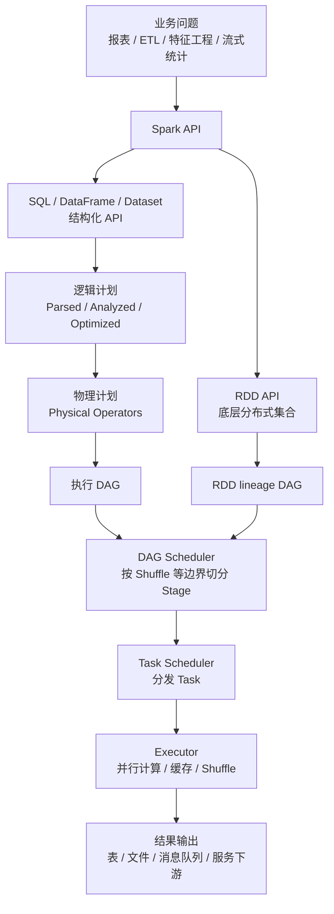
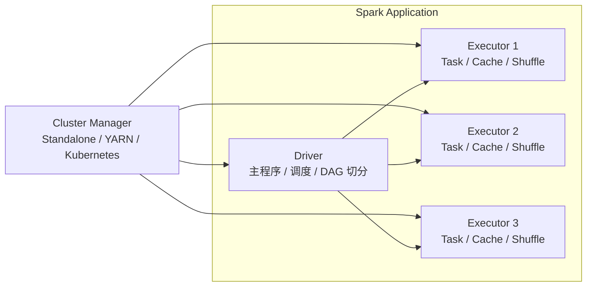
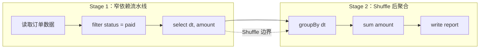
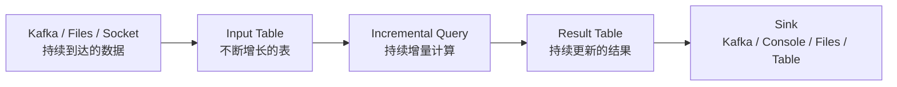

Apache Spark 是大数据工程里最常见的通用计算引擎之一。它不是一个数据库，也不是一个单纯的 SQL 工具，而是一套把大规模数据处理拆成分布式任务、调度到集群上执行、并尽量利用内存加速计算的执行框架。

如果只从 `map`、`filter`、`join`、`groupBy` 这些 API 入手，很容易把 Spark 学成一堆零散函数。理解 Spark 的关键，是抓住一条主线：

> **Spark 的本质是一个面向大规模数据的分布式执行引擎。RDD 会直接形成 lineage DAG；SQL、DataFrame 和 Dataset 会先经过 Spark SQL 的解析、优化和物理计划生成，再落到分布式执行计划。随后 Spark 根据 Shuffle 等执行边界切分 Stage，并把 Stage 拆成 Task 分发给 Executor 并行执行。**

截至 2026-05-18，Apache Spark 官方 `latest` 文档对应版本为 Spark 4.1.1。本文重点讲 Spark 的稳定核心模型，不绑定具体小版本；实际项目应以团队使用的 Spark、Scala、Java、Python、Hadoop、Kubernetes 或 YARN 版本为准。

## 一、Spark 解决的根本问题

大数据计算的核心困难不是“写一个排序、聚合、Join 算法”本身，而是当数据规模超过单机能力之后，如何把计算可靠地拆到多台机器上完成。

一个成熟的大数据计算引擎至少要解决这些问题：

1. **数据如何切分**：几十 TB 甚至 PB 级数据不可能放在一个进程里处理，必须按分区并行处理。
2. **计算如何调度**：同一个作业包含多个步骤，步骤之间有依赖关系，调度器需要决定先算什么、后算什么。
3. **节点失败怎么办**：分布式环境中机器、网络、磁盘都可能出问题，框架必须能恢复中间结果或重新计算。
4. **数据移动如何控制**：跨节点 Shuffle 往往是 Spark 作业最昂贵的部分，性能问题很多时候来自数据移动而不是 CPU 计算。
5. **如何兼顾易用性和性能**：工程师希望写 SQL 或 DataFrame 代码，底层系统则需要尽可能优化执行计划。

Spark 的价值就在于：它把这些复杂性封装到统一的计算模型和运行时里，让开发者用相对高级的 API 表达计算逻辑，同时保留对分区、缓存、并行度、Shuffle、资源配置等关键工程细节的控制权。



这张图可以作为学习 Spark 的地图：先理解 Spark 如何表达计算，再理解它如何把计算变成可调度的 DAG，最后再看 Shuffle、内存、资源和调优。

## 二、从 MapReduce 到 Spark：为什么 Spark 会流行

在 Spark 之前，Hadoop MapReduce 是大数据批处理的代表。MapReduce 的思想非常重要：把计算拆成 Map 和 Reduce 两个阶段，天然适合大规模分布式处理。但它的编程模型偏底层，每一步通常都要读写磁盘，中间结果落盘较重，表达复杂流水线时不够自然。

Spark 并不是否定 MapReduce，而是在它的基础上进一步抽象：

| 维度 | Hadoop MapReduce | Apache Spark |
| --- | --- | --- |
| 编程模型 | Map 阶段 + Reduce 阶段 | DAG，可表达多阶段复杂计算 |
| 中间结果 | 通常依赖磁盘落地 | 可在内存中缓存和复用 |
| API 层次 | 相对底层 | RDD、DataFrame、Dataset、SQL |
| 适用场景 | 稳定批处理 | 批处理、交互式分析、机器学习、流处理 |
| 优化空间 | 主要由开发者手工组织 | Catalyst、代码生成、AQE 等 SQL 引擎优化 |

Spark 流行的核心原因，是它把“分布式计算”从一个偏系统工程的问题，变成了一个更接近数据开发者心智的问题：你描述数据怎么变换，Spark 负责把变换组织成分布式执行计划。

## 三、运行架构：Driver、Executor 与 Cluster Manager

一个 Spark 应用不是一个单进程程序，而是一组运行在集群上的进程。它的核心角色有三个：

1. **Driver**：运行用户的主程序，创建 `SparkSession` 或 `SparkContext`，负责生成执行计划、切分 Job/Stage/Task，并与 Executor 通信。
2. **Executor**：运行在工作节点上的执行进程，负责真正执行 Task，也负责缓存数据、读写 Shuffle 数据。
3. **Cluster Manager**：负责给 Spark 应用分配资源，例如 Spark Standalone、YARN、Kubernetes。



这里有几个关键点：

1. **Driver 是调度大脑**。如果 Driver 崩溃，应用通常也会失败；如果 Driver 离 Executor 网络太远，调度延迟也会变大。
2. **Executor 是计算工人**。每个 Executor 通常有多个 CPU core，可以并行运行多个 Task。
3. **每个 Spark Application 通常有自己的 Executor 进程**。这带来应用间隔离，但不同应用之间不能直接共享内存缓存，必须通过外部存储系统共享数据。
4. **Spark 不强绑定资源管理器**。只要能申请到 Executor 并让 Driver 与 Executor 通信，Spark 就可以运行在不同集群管理系统上。

## 四、API 演进：RDD、DataFrame、Dataset 与 SQL

Spark 的 API 可以分成几层。它们不是互相替代得一干二净，而是适合不同抽象层次。

### 1. RDD：最基础的分布式数据抽象

RDD 是 Resilient Distributed Dataset，即弹性分布式数据集。它可以理解为“分布在多台机器上的、可并行操作的数据集合”。

RDD 有三个重要特征：

1. **分区**：RDD 被切成多个 Partition，每个 Partition 可以由一个 Task 处理。
2. **不可变**：RDD 转换不会原地修改数据，而是生成新的 RDD。
3. **血缘关系**：RDD 记录自己从哪些父 RDD 转换而来。节点失败时，Spark 可以根据 lineage 重新计算丢失分区。

RDD 的优点是灵活，适合表达底层控制逻辑；缺点是 Spark 很难理解数据结构和业务语义，因此优化空间有限。今天写新项目时，除非需要细粒度控制，通常优先选择 DataFrame 或 Spark SQL。

### 2. DataFrame：带 Schema 的分布式表

DataFrame 可以理解为“分布式表”。它有列名、类型和 Schema，形式上接近关系型数据库表或 Pandas DataFrame，但底层是分布式执行。

DataFrame 的优势在于：Spark 能理解数据结构和计算关系，因此可以做更深的优化，例如谓词下推、列裁剪、执行计划优化等；在统计信息充足且相关优化开启时，还可以做更合理的 Join 顺序选择。

```python
from pyspark.sql import SparkSession
from pyspark.sql.functions import col, sum as sum_

spark = SparkSession.builder.appName("orders-report").getOrCreate()

orders = spark.read.parquet("s3a://warehouse/orders/")

daily_gmv = (
    orders
    .where(col("status") == "paid")
    .groupBy("dt")
    .agg(sum_("amount").alias("gmv"))
    .orderBy("dt")
)

daily_gmv.write.mode("overwrite").parquet("s3a://warehouse/reports/daily_gmv/")
```

这段代码表面上像本地集合操作，但真正执行时，Spark 会生成分布式执行计划，而不是在 Driver 上把所有数据拉到本机。示例里的 `s3a://` 路径代表通过 Hadoop S3A 文件系统访问对象存储；真实环境需要配置相应的 Hadoop AWS 依赖、凭证和网络访问，换成本地、HDFS、云对象存储或表格式路径时，DataFrame 逻辑本身不变。

### 3. Dataset：类型安全与优化执行的折中

Dataset 主要存在于 Scala 和 Java API 中，可以理解为“带强类型对象视图的 DataFrame”。它兼具函数式变换和 Spark SQL 优化引擎的部分能力。Python 因为语言动态类型特性，没有同等意义上的 Dataset API，日常主要使用 DataFrame。

### 4. Spark SQL：让分析逻辑贴近数据语义

Spark SQL 允许直接用 SQL 表达分析逻辑：

```sql
SELECT
  dt,
  SUM(amount) AS gmv
FROM orders
WHERE status = 'paid'
GROUP BY dt
ORDER BY dt;
```

SQL 的优势是表达聚合、过滤、Join、窗口函数时非常自然，也更容易被数据分析师、数据工程师和后端工程师共同理解。很多生产环境里，Spark 作业的核心逻辑就是 SQL，外围再用 Python、Scala 或 Java 负责参数、调度和输入输出。

## 五、惰性求值：Spark 为什么不是写一行算一行

Spark API 里的操作大致分为两类：

1. **Transformation**：转换操作，例如 `map`、`filter`、`select`、`where`、`join`、`groupBy`。它们只描述计算关系，不会立刻执行。
2. **Action**：行动操作，例如 RDD 的 `count`、`collect`、`saveAsTextFile`，以及 DataFrame/Dataset 的 `show`、`count`、`collect`、`write.parquet(...)`、`write.save(...)`。它们会触发真正的作业执行。注意，`df.write` 本身只是拿到一个 `DataFrameWriter`，只有调用具体写出方法时才会提交作业。

这种机制叫惰性求值。它的好处是 Spark 可以先看完整条计算链，再统一优化，而不是用户写一步就盲目执行一步。

```python
df = spark.read.parquet("/data/orders")
paid = df.where("status = 'paid'")
result = paid.groupBy("dt").count()

# 到这里还没有触发对数据的完整计算；
# 但读取文件元数据、推断 schema 等轻量动作可能已经发生
result.show()

# show 是 Action，会触发 Job 执行
```

惰性求值有一个容易踩的坑：如果你在代码里写了很多转换，不代表计算已经发生；真正耗时、报错、读写数据，通常出现在 Action 阶段。

## 六、DAG、Job、Stage、Task：Spark 作业如何被拆开

Spark 的执行层有四个高频概念：Job、Stage、Task、DAG。

| 概念 | 含义 | 触发或生成方式 |
| --- | --- | --- |
| DAG | 有向无环图，描述计算依赖关系 | 由一串 Transformation 形成 |
| Job | 一次由 Action 触发的完整计算 | 每个 Action 通常触发一个或多个 Job |
| Stage | Job 中可连续执行的一段任务集合 | 遇到 Shuffle/Exchange 等执行边界会切分 Stage |
| Task | 执行在一个分区上的最小工作单元 | Stage 按分区拆成多个 Task |

理解 Stage 的关键，是理解依赖关系：

1. **窄依赖**：一个子分区只依赖少量父分区，典型如 `map`、`filter`。窄依赖可以流水线执行，不需要大规模数据重分布。
2. **宽依赖**：一个子分区依赖多个父分区，典型如 `groupByKey`、`reduceByKey`、`join`。宽依赖通常需要 Shuffle，会形成 Stage 边界。



这张图是为了说明“窄依赖流水线 + Shuffle 边界”的最小模型，省略了很多物理执行细节。比如前文 DataFrame 示例里的 `orderBy("dt")` 对应 SQL 的 `ORDER BY` 语义，官方文档说明它会保证输出全局有序；在真实物理计划里，这类全局排序通常会引入额外的 Exchange/Sort 和新的 Stage。AQE 开启后，运行时还可能合并 Shuffle 分区、改 Join 策略或处理倾斜分区，所以实际 Stage 数量要以 Spark UI 和 `explain()` 为准。

Spark 性能分析的第一步，往往就是打开 Spark UI，看一个 Job 被切成了多少 Stage，哪些 Stage 时间最长，哪些 Task 倾斜严重，Shuffle read/write 是否异常。

## 七、Shuffle：Spark 性能问题的高发区

Shuffle 指的是数据按照新的分区规则在节点之间重新分布。只要涉及全局聚合、按 Key 分组、Join、去重、排序，就很可能触发 Shuffle。

Shuffle 昂贵，主要有三个原因：

1. **网络传输**：数据需要跨节点移动。
2. **磁盘读写**：Shuffle 中间数据通常会落到本地磁盘。
3. **内存压力**：聚合、排序、Join 需要构建哈希表或排序缓冲，容易导致 spill 甚至 OOM。

常见优化原则如下：

| 问题 | 典型表现 | 处理思路 |
| --- | --- | --- |
| 分区过少 | 少数 Task 特别大，集群 core 吃不满 | 提高并行度，合理设置 `spark.sql.shuffle.partitions` |
| 分区过多 | Task 很碎，调度开销高，小文件多 | 降低分区数，写出前 `coalesce` 或控制输出 |
| 数据倾斜 | 少数 Task 远慢于其他 Task | 识别热点 Key，拆分热点，开启 AQE skew join 优化 |
| 大表 Join 小表 | Shuffle 数据量大 | 使用广播 Join，让小表分发到 Executor |
| 不必要列参与计算 | 读写和 Shuffle 数据变大 | 提前列裁剪，只保留需要字段 |

一个实用判断是：**Spark 作业慢，先看 Shuffle；Shuffle 异常，再看分区、倾斜、Join 策略和数据量。**

## 八、内存模型与缓存：不要把 cache 当成万能加速器

Spark 常被称为内存计算引擎，但这不意味着所有数据都会自动放进内存。在 Spark 的统一内存管理模型里，执行内存和存储内存共享同一块受管理区域；当一侧暂时不用时，另一侧可以利用更多空间。概念上可以把它们理解为两类用途：

1. **Execution Memory**：执行计算时使用，例如 Shuffle、Join、Sort、Aggregation。
2. **Storage Memory**：缓存数据时使用，例如 `cache()`、`persist()` 保存的中间结果。

缓存适合这些场景：

1. 一个中间结果会被多个 Action 复用。
2. 一个 DataFrame/RDD 计算代价很高，且后续多次使用。
3. 交互式分析中反复探索同一份清洗后的数据。

缓存不适合这些场景：

1. 数据只用一次，缓存反而增加内存压力。
2. 数据远大于集群内存，频繁缓存和淘汰会拖慢作业。
3. 上游数据很快就被过滤成小结果，缓存原始大表没有意义。

缓存使用后要注意释放：

```python
clean_orders = orders.where("status in ('paid', 'refunded')").cache()

clean_orders.groupBy("dt").count().show()
clean_orders.groupBy("category").count().show()

clean_orders.unpersist()
```

`cache()` / `persist()` 本身仍然是惰性的：它们只是告诉 Spark “这个结果值得缓存”。真正把分区算出来并放入缓存，发生在后续第一个 Action 执行时；后面的 Action 才能复用已经缓存成功的分区。

一句话原则：**缓存是为了复用昂贵中间结果，不是为了让所有 Spark 作业自动变快。**

## 九、Spark SQL 优化：Catalyst、代码生成与 AQE

现代 Spark 的主力使用方式是 Spark SQL 和 DataFrame。它们背后有几类关键优化能力：

1. **Catalyst Optimizer**：Spark SQL 的查询优化器，负责解析、分析和优化逻辑计划，再生成物理计划。
2. **代码生成与执行层优化**：Spark SQL 物理执行层会通过 whole-stage code generation、列式缓存、内部二进制行格式等手段减少解释开销和 JVM 对象开销。历史上这些内存与 CPU 效率优化常被归入 Project Tungsten，但更准确地说，Tungsten 不是用户直接调用的 API，而是一组已经融入执行引擎的底层优化。
3. **AQE（Adaptive Query Execution）**：自适应查询执行，在运行时根据真实统计信息调整执行计划，例如合并 Shuffle 分区、处理倾斜 Join、调整 Join 策略。

这也是为什么新项目通常优先使用 DataFrame/Spark SQL，而不是直接写 RDD。你给 Spark 的结构化信息越多，它越有机会帮你优化。

需要注意的是，这些优化主要作用在 Spark SQL、DataFrame 和 Dataset 这类结构化 API 上。RDD 仍然有自己的价值，但它不会经过 Catalyst 查询优化器，因此 Spark 对 RDD 代码的语义理解和自动优化能力更弱。

不过优化器不是魔法。以下问题仍然需要工程师自己负责：

1. 数据源文件是否过碎。
2. 分区字段是否合理。
3. 表统计信息是否准确。
4. Join Key 是否倾斜。
5. UDF 是否阻断优化。
6. 写出文件数量是否可控。

尤其要谨慎使用 Python UDF。它表达力强，但可能让 Spark 无法理解函数内部逻辑，影响优化和执行效率。能用内置函数、SQL 表达式、高阶函数解决的逻辑，通常不要优先写 UDF。

## 十、Structured Streaming：把流看成不断增长的表

Spark 不只做离线批处理，也支持流处理。当前更推荐的流处理模型是 Structured Streaming，而不是早期的 DStreams。

Structured Streaming 的核心思想是：**把实时数据流看成一张不断追加的新表，把流式计算看成对这张表持续执行的增量查询。**



一个最小 Kafka 流读取与调试输出示例可以写成这样：

```python
events = (
    spark.readStream
    .format("kafka")
    .option("kafka.bootstrap.servers", "localhost:9092")
    .option("subscribe", "events")
    .load()
)

query = (
    events
    .selectExpr("CAST(value AS STRING) AS raw")
    .writeStream
    .format("console")
    .start()
)

query.awaitTermination()
```

这里的 `console` sink 只适合本地调试，官方文档也明确它不是容错 sink。生产写出到 file、Kafka、表或自定义 sink 时，应为查询配置稳定的 checkpoint 路径，并结合 sink 能力判断端到端语义。

运行这类 Kafka 示例时，应用需要引入与 Spark/Scala 版本匹配的 Kafka connector，例如 Spark 4.1.1 默认 Scala 2.13 对应的 `org.apache.spark:spark-sql-kafka-0-10_2.13:4.1.1`。否则代码本身语法正确，但提交作业时会因为找不到 `kafka` 数据源而失败。

Structured Streaming 的工程关键点包括：

1. **Checkpoint**：保存进度和状态，是故障恢复的基础。
2. **Watermark**：处理乱序和迟到数据，避免状态无限增长。
3. **State Store**：维护聚合、去重、Join 等有状态计算的中间状态。
4. **Sink 语义**：端到端语义依赖可重放的 source、checkpoint/write-ahead log 和 sink 自身能力。官方文档中 file sink 标注为 exactly-once，Kafka sink 标注为 at-least-once；自定义 `foreachBatch` 的语义取决于实现，默认只能提供 at-least-once，需要用 `batchId` 等机制去重后才能接近 exactly-once。

Structured Streaming 默认使用微批处理，官方文档给出的延迟目标是低至约 100 毫秒，并提供 exactly-once 容错保证。历史上的 Continuous Processing 可以进一步降低延迟，但提供的是 at-least-once 语义；Spark 4.1 官方 release note 还提到 Structured Streaming Real-Time Mode，面向 stateless 查询提供连续的亚秒级处理，部分场景可到个位数毫秒。低延迟能力受 source、sink、算子和运行模式约束，不能简单理解为所有 Structured Streaming 作业都适合严格毫秒级延迟。如果业务需要复杂事件处理、长期大状态和严格毫秒级延迟，Apache Flink 这类流处理引擎可能更适合；如果团队已有 Spark 生态，且批流逻辑希望统一，Structured Streaming 是很自然的选择。

## 十一、Spark 适合什么，不适合什么

Spark 适合：

1. 大规模 ETL、离线数仓加工。
2. 数据湖上的文件格式和表格式处理，例如 Parquet、ORC，以及 Iceberg、Delta Lake、Hudi。
3. 交互式分析和临时数据探索。
4. 特征工程、机器学习数据预处理。
5. 批流一体的数据处理链路。

Spark 不适合：

1. 单条记录毫秒级在线事务处理。
2. 高频小请求的在线服务接口。
3. 严格毫秒级延迟、复杂事件处理或超大长期状态的流处理；Spark 有 Continuous Processing 和 Real-Time Mode 等低延迟能力，但不是所有流式需求的默认首选。
4. 数据量很小、单机数据库或脚本就能稳定完成的任务。

一个简单判断是：当你的问题主要是“数据太大、计算链路太长、需要集群并行处理”时，Spark 值得考虑；当你的问题主要是“请求要立刻返回、每次只处理一小条数据”时，Spark 通常不是第一选择。

## 十二、学习 Spark 的推荐路径

学习 Spark 最容易走偏的地方，是一开始就陷入参数调优。更稳妥的路径是：

1. **先学运行模型**：Driver、Executor、Cluster Manager、Application、Job、Stage、Task。
2. **再学数据抽象**：RDD、DataFrame、Dataset、Spark SQL 分别解决什么问题。
3. **理解惰性求值和 DAG**：知道 Transformation 与 Action 的区别，能解释一次写出动作如何触发计算。
4. **重点掌握 Shuffle**：知道哪些操作会 Shuffle，以及如何从 Spark UI 判断 Shuffle 是否是瓶颈。
5. **学习文件和表格式**：Parquet、ORC、分区表、小文件问题、谓词下推、列式存储。
6. **学习调优方法**：分区数、广播 Join、数据倾斜、缓存、AQE、资源配置。
7. **最后再看专项能力**：Structured Streaming、MLlib、GraphX、Spark Connect、Lakehouse 生态。

这条路径的好处是，知识点之间能串起来：API 不是孤立的，参数不是玄学的，性能问题也能落回执行计划、数据分布和资源约束。

## 十三、一个生产排查清单

当一个 Spark 作业变慢或失败时，可以按下面顺序排查：

1. **看 Spark UI**：确认最慢的 Job、Stage、Task 在哪里。
2. **看 Shuffle 指标**：Shuffle read/write 是否异常大，是否频繁 spill。
3. **看 Task 分布**：是否有少数 Task 远慢于其他 Task，判断数据倾斜。
4. **看输入文件**：是否有大量小文件，是否分区裁剪生效。
5. **看执行计划**：用 `explain()` 检查是否出现不合理 Join、全表扫描、Python UDF。
6. **看资源配置**：Executor 数量、core、memory、并行度是否匹配数据规模。
7. **看输出结果**：是否写出过多小文件，是否需要控制分区或合并文件。

不要一上来就改 `executor-memory` 或 `spark.sql.shuffle.partitions`。参数只是结果，真正的问题通常在数据分布、执行计划或资源模型里。

## 结语：Spark 的主线是“描述计算，然后分布式执行”

Spark 的知识体系看起来庞大，但主线并不复杂：

1. 用 SQL、DataFrame、Dataset 或 RDD 描述数据变换。
2. 结构化 API 先经过逻辑计划、优化计划和物理计划；RDD API 则形成 lineage DAG。
3. 遇到 Shuffle 时切分 Stage。
4. Stage 按分区拆成 Task。
5. Task 在 Executor 上并行执行。
6. 调优围绕数据分区、Shuffle、内存、Join、缓存和资源配置展开。

真正掌握 Spark，不是背下所有 API，而是能把一段业务代码翻译成执行过程：它读了哪些数据、过滤是否下推、哪些操作触发 Shuffle、分区是否合理、哪些结果被缓存、哪个 Stage 最慢、瓶颈到底是 CPU、内存、磁盘还是网络。

当你能从这条链路理解 Spark，调优和排障就不再是猜参数，而是有依据地定位问题。

## 术语表

| 术语 | 解释 |
| --- | --- |
| Spark Application | 一个完整的 Spark 应用，由 Driver 和一组 Executor 组成。 |
| Driver | 运行主程序并负责调度的进程。 |
| Executor | 运行 Task、缓存数据、读写 Shuffle 数据的工作进程。 |
| Cluster Manager | 集群资源管理器，例如 Standalone、YARN、Kubernetes。 |
| RDD | 弹性分布式数据集，Spark 最基础的数据抽象。 |
| DataFrame | 带 Schema 的分布式表，是 Spark SQL 的核心 API 之一。 |
| Dataset | 强类型分布式数据集合，主要用于 Scala/Java。 |
| DAG | 有向无环图，用来描述计算步骤之间的依赖关系。 |
| Job | 由 Action 触发的一次完整计算。 |
| Stage | Job 中按 Shuffle/Exchange 等执行边界切分出的执行阶段。 |
| Task | 在单个数据分区上执行的最小工作单元。 |
| Shuffle | 按新的分区规则跨节点重分布数据的过程。 |
| Catalyst | Spark SQL 的查询优化器，主要作用于 SQL、DataFrame 和 Dataset。 |
| AQE | Adaptive Query Execution，自适应查询执行。 |
| Checkpoint | 流处理或容错场景中用于保存进度和状态的机制。 |

## 参考文献

1. Apache Spark 官方文档：Overview，https://spark.apache.org/docs/latest/
2. Apache Spark 官方文档：Cluster Mode Overview，https://spark.apache.org/docs/latest/cluster-overview.html
3. Apache Spark 官方文档：RDD Programming Guide，https://spark.apache.org/docs/latest/rdd-programming-guide.html
4. Apache Spark 官方文档：Spark SQL, DataFrames and Datasets Guide，https://spark.apache.org/docs/latest/sql-programming-guide.html
5. Apache Spark 官方文档：ORDER BY Clause，https://spark.apache.org/docs/latest/sql-ref-syntax-qry-select-orderby.html
6. Apache Spark 官方文档：Spark SQL Performance Tuning，https://spark.apache.org/docs/latest/sql-performance-tuning.html
7. Apache Spark 官方文档：Structured Streaming Overview，https://spark.apache.org/docs/latest/streaming/index.html
8. Apache Spark 官方文档：Structured Streaming Getting Started，https://spark.apache.org/docs/latest/streaming/getting-started.html
9. Apache Spark 官方文档：Structured Streaming APIs on DataFrames and Datasets，https://spark.apache.org/docs/latest/streaming/apis-on-dataframes-and-datasets.html
10. Apache Spark 官方文档：Structured Streaming + Kafka Integration Guide，https://spark.apache.org/docs/latest/streaming/structured-streaming-kafka-integration.html
11. Apache Spark 官方文档：Tuning Spark，https://spark.apache.org/docs/latest/tuning.html
12. Apache Spark 官方发布说明：Spark Release 4.1.0，https://spark.apache.org/releases/spark-release-4.1.0.html
13. Apache Spark 官方网站：Spark Research，https://spark.apache.org/research.html
