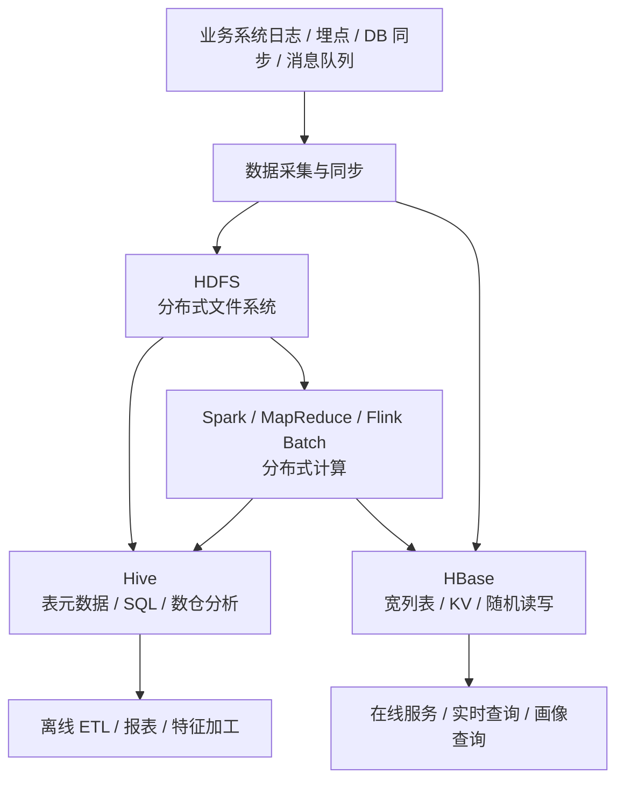
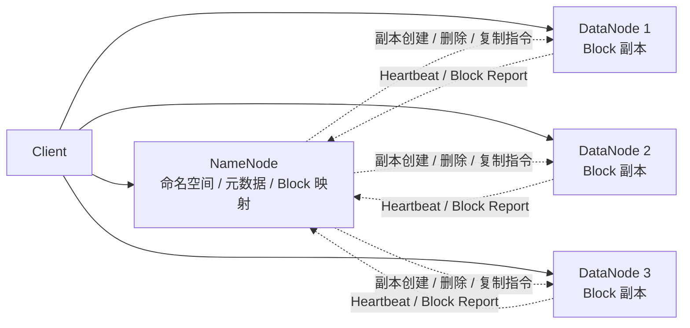
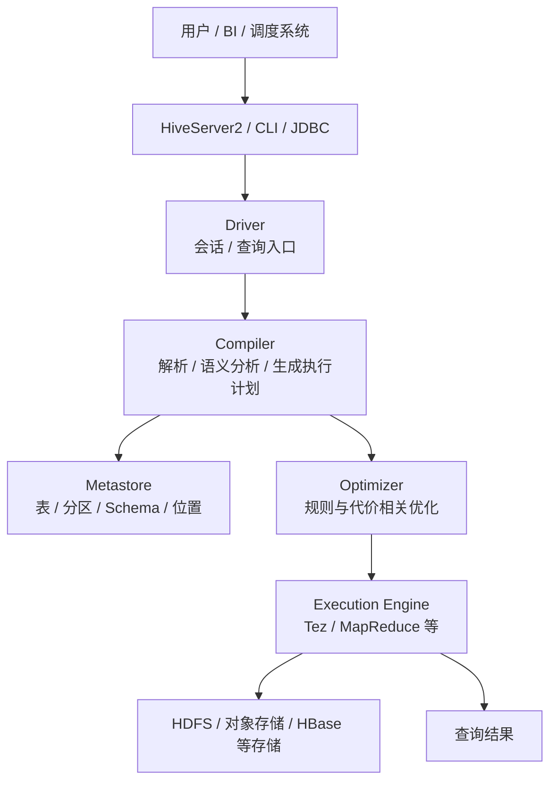
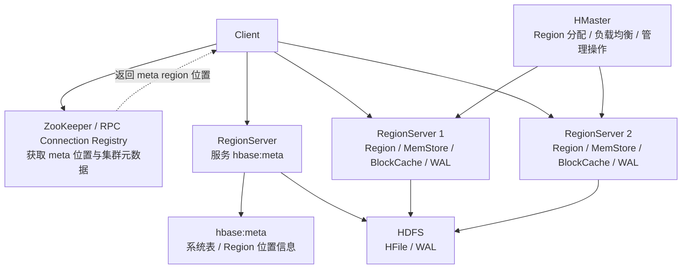
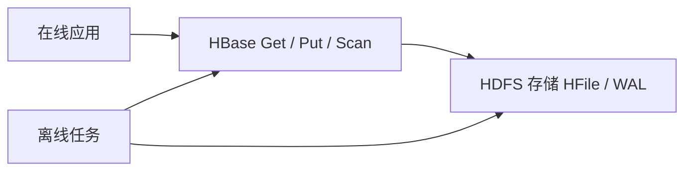

HDFS、Hive、HBase 经常被放在一起学习，因为它们都属于 Hadoop 生态，也常出现在同一套离线数据平台里。但它们解决的问题并不一样：

1. **HDFS 是分布式文件系统**，负责把大文件可靠地存到多台机器上。
2. **Hive 是数据仓库和 SQL 层**，负责把分布式存储中的文件组织成表，并用 SQL 做批量分析。
3. **HBase 是分布式宽列表存储**，负责在海量行上提供按 RowKey 的低延迟随机读写。

如果只记住一句话：

> **HDFS 管数据文件，Hive 管表和 SQL 分析，HBase 管海量明细数据的在线随机访问。**

它们可以协同工作，但不能互相替代。把三者的边界搞清楚，后面再理解 Hadoop、MapReduce、Spark、数据湖、湖仓、离线数仓和在线特征存储，都会顺很多。

## 一、先建立整体地图

三者在一套典型大数据平台中的位置大致如下：



可以把这张图理解成三个层次：

| 层次 | 组件 | 核心职责 | 典型访问方式 |
| --- | --- | --- | --- |
| 底层存储 | HDFS | 存大文件，提供高吞吐顺序读写和副本容错 | 文件路径、Block、流式读写 |
| 分析建模 | Hive | 用表、分区、Schema、SQL 管理和分析数据 | HiveQL、JDBC/ODBC、Metastore |
| 在线存储 | HBase | 在大表上按 RowKey 做快速随机读写 | Java API、Thrift、REST、Scan/Get/Put |

一个常见误区是把 Hive 和 HBase 都理解成“数据库”。更准确地说，Hive 更像**面向批处理分析的数据仓库层**，HBase 更像**面向在线访问的分布式数据存储**。Hive 查询通常扫描大量数据，追求吞吐；HBase 请求通常命中少量行或一个 RowKey 范围，追求低延迟。

## 二、HDFS：为大文件和高吞吐而生的分布式文件系统

HDFS，全称 Hadoop Distributed File System。它的核心目标不是替代本地文件系统，也不是做一个强 POSIX 语义的通用文件系统，而是服务大规模数据处理：数据很大，机器很多，硬件会坏，计算最好靠近数据。

### 1. HDFS 解决什么问题

在单机上，一个几百 GB 或几 TB 的文件可能已经难以存储和处理。HDFS 的做法是把文件切成多个 Block，分散存储在多台机器上，并为每个 Block 保存多个副本。这样可以获得三个能力：

1. **容量扩展**：多台机器的磁盘可以合起来存储大规模数据。
2. **容错能力**：某台机器或某块磁盘失败时，数据可以从其他副本读取。
3. **高吞吐**：大文件可以被多个计算任务并行读取，适合离线批处理。

HDFS 更偏向“写一次、多次读”的模型。文件创建、写入、关闭之后，通常被下游 MapReduce、Spark、Hive 等任务反复扫描。现代 HDFS 支持 append 和 truncate，但它不适合像普通数据库那样对文件中间的任意位置做高频随机更新。

### 2. NameNode 与 DataNode

HDFS 是典型的主从架构：



**NameNode** 管理文件系统命名空间，例如目录、文件、权限，以及“某个文件由哪些 Block 组成、这些 Block 分布在哪些 DataNode 上”。它是 HDFS 元数据的大脑。

**DataNode** 负责真正保存 Block 数据，并处理客户端的读写请求。一个关键点是：**用户数据不会通过 NameNode 中转**。客户端会先向 NameNode 查询元数据，再直接和 DataNode 传输数据。这避免了 NameNode 成为数据传输瓶颈。

这张图画的是逻辑角色，不代表生产环境只能有一个 NameNode。早期 HDFS 的单 NameNode 容易被理解成单点风险，现代生产集群通常会配置 HDFS High Availability，让 Active NameNode 和 Standby NameNode 通过共享 edits 或 JournalNode 保持状态同步。这样 NameNode 仍然是元数据中心，但不必把“一个逻辑主控角色”误解成“生产只能单点运行”。

### 3. 读写流程的直觉理解

读文件时，客户端先问 NameNode：“这个文件有哪些 Block，它们在哪里？”NameNode 返回 Block 位置信息后，客户端选择合适的 DataNode 读取数据。读取失败时，可以切换到其他副本。

写文件时，客户端先向 NameNode 申请创建文件和分配 Block。随后客户端把数据写入一组 DataNode，DataNode 之间形成复制流水线。例如副本数为 3 时，一个 Block 会被写到 3 个不同的 DataNode 上。NameNode 负责记录 Block 副本位置，并在副本不足时触发重新复制。

### 4. HDFS 适合与不适合的场景

HDFS 适合：

1. 日志、埋点、交易流水等大规模原始数据落地。
2. 离线 ETL、批处理、机器学习特征加工。
3. Hive、Spark、MapReduce 等计算引擎共享底层数据。
4. 大文件、顺序读写、高吞吐访问。

HDFS 不适合：

1. 大量很小的文件。每个文件和 Block 都会占用 NameNode 元数据，过多小文件会拖垮元数据管理和任务调度。
2. 毫秒级在线随机查询。HDFS 更强调吞吐而不是单次请求低延迟。
3. 高频原地更新。HDFS 文件模型不适合数据库式细粒度修改。
4. 直接承载复杂事务。事务、索引、二级查询通常需要上层系统提供。

所以，HDFS 的核心价值是“可靠地存放大规模文件，并让计算框架高吞吐地扫描它们”。

## 三、Hive：把文件变成表，把批处理变成 SQL

如果只有 HDFS，用户看到的是一堆目录和文件：

```text
/warehouse/orders/dt=2026-05-17/part-00000.parquet
/warehouse/orders/dt=2026-05-17/part-00001.parquet
```

业务分析人员并不想关心这些文件路径、字段分隔符、Parquet schema、分区目录和任务执行细节。他们更希望写：

```sql
SELECT
  dt,
  SUM(amount) AS gmv
FROM dwd_orders
WHERE dt >= '2026-05-01'
  AND status = 'paid'
GROUP BY dt;
```

Hive 的价值就在这里：它在 HDFS 或其他分布式存储之上提供表、分区、Schema、SQL 和元数据管理，让用户用接近传统数仓的方式处理大规模数据。

### 1. Hive 不是一种固定文件格式

Hive 表不是一种特殊文件格式。一个 Hive 表可以对应 TextFile、ORC、Parquet、Avro 等不同格式的数据，也可以通过 StorageHandler 访问 HBase 等外部存储。Hive 真正管理的是：

1. 表名、库名、字段名、字段类型。
2. 表数据所在位置。
3. 文件格式和 SerDe。
4. 分区、桶、统计信息等元数据。
5. 权限、表属性和其他治理信息。

这些信息通常存储在 Hive Metastore 中。Metastore 本身通常依赖外部关系型数据库保存元数据，例如 MySQL、PostgreSQL、Oracle 等。计算引擎执行查询时，会向 Metastore 查询“这张表在哪里、有哪些字段、有哪些分区、应该怎么读”。

### 2. Hive 的核心组件

Hive 的经典架构可以这样理解：



一次 Hive 查询大致会经历这些步骤：

1. 用户提交 HiveQL。
2. Driver 接收查询并管理会话。
3. Compiler 解析 SQL，做语义检查，并从 Metastore 获取表和分区元数据。
4. 优化器生成更合理的执行计划。
5. Execution Engine 把计划提交给 Tez、MapReduce 等执行引擎。
6. 执行引擎读取 HDFS 或其他存储中的数据，完成过滤、聚合、Join、排序等操作。

这说明 Hive 的本质不是“单机 SQL 数据库”，而是**把 SQL 编译成分布式批处理作业的数据仓库系统**。

### 3. 分区、列式存储与小文件

Hive 生产使用里有三个非常重要的工程点。

**第一，分区决定扫描范围。** 常见分区字段是 `dt`、`hour`、`region`、`biz_type`。如果查询条件能命中分区，Hive 可以只读取相关目录，而不是扫描整张表。

```text
/warehouse/orders/dt=2026-05-16/...
/warehouse/orders/dt=2026-05-17/...
```

**第二，列式存储决定扫描效率。** ORC、Parquet 这类列式格式适合分析场景。查询只需要少数字段时，列式格式可以减少读取的数据量，并结合压缩、统计信息和谓词下推提升性能。

**第三，小文件会显著影响性能。** 上游任务如果写出大量小文件，会增加 NameNode 元数据压力，也会导致 Hive 查询启动大量细碎任务。常见治理方式包括合并小文件、控制写出并行度、使用分区内 compact、把流式写入汇聚后再落表。

### 4. Managed Table 与 External Table

Hive 表还需要区分 Managed Table 和 External Table，这会直接影响数据生命周期。

| 表类型 | Hive 如何看待数据 | Drop 表时通常发生什么 | 适合场景 |
| --- | --- | --- | --- |
| Managed Table | Hive 认为自己管理表数据和布局 | 删除元数据，也删除表数据 | 临时表、中间表、完全由 Hive 管理的数仓表 |
| External Table | Hive 只管理外部文件上的 Schema 和元数据 | 通常只删除元数据，保留外部文件 | 已存在的数据目录、多引擎共享数据、避免误删底层文件 |

这也是为什么不能简单说“Hive 存储数据”。更准确地说，Hive 管理表定义和数据位置；至于文件由谁拥有、Drop 时是否删除底层文件，要看表类型和具体配置。生产数仓里，大量原始层和共享层表会使用 External Table，以降低误删文件的风险。

### 5. Hive 适合与不适合的场景

Hive 适合：

1. 离线数仓建模，例如 ODS、DWD、DWS、ADS 分层。
2. 大规模批量 ETL。
3. 日报、周报、月报和历史回溯。
4. 多团队共享表元数据和数据口径。
5. 用 SQL 表达大规模过滤、聚合、Join 和窗口分析。

Hive 不适合：

1. 单条记录毫秒级查询。
2. 高频在线事务处理。
3. 大量小批次、高并发短查询，除非有专门的低延迟执行层和资源治理。
4. 强事务、多行复杂更新的 OLTP 场景。

Hive 的优势是“用 SQL 管理和分析大规模离线数据”，不是“替代 MySQL、PostgreSQL 这类在线数据库”。

## 四、HBase：面向海量行随机读写的宽列表存储

HBase 源于 Google Bigtable 思想，是 Hadoop 生态中面向在线读写的分布式宽列表存储。它通常部署在 HDFS 之上，底层文件落在 HDFS，但对外提供的是表、RowKey、列族、列限定符和时间版本这些数据模型。

HDFS 擅长存大文件，但不提供快速单行查找。HBase 则在 HDFS 之上组织索引化的 StoreFile/HFile，并通过 RegionServer 提供快速读写。

### 1. HBase 的数据模型

HBase 表可以理解为一个按 RowKey 字典序排序的巨大稀疏 Map：

```text
(rowkey, column_family:qualifier, timestamp) -> value
```

几个概念很关键：

| 概念 | 含义 |
| --- | --- |
| RowKey | 行键，决定数据排序、分布和主要查询路径。 |
| Column Family | 列族，建表时定义，底层存储和压缩通常以列族为单位。 |
| Qualifier | 列限定符，可以动态增加，不需要像关系型数据库那样提前定义每一列。 |
| Timestamp | 单元格版本。HBase 可以按列族配置保留多个版本，但默认通常只读取最新版本。 |
| Region | 表按 RowKey 范围切分出的水平分片。 |

HBase 的查询能力主要围绕 RowKey 展开：

1. `Get`：按完整 RowKey 查一行。
2. `Scan`：按 RowKey 范围顺序扫描。
3. `Put`：写入新值；如果 row、column、version 完全相同，则覆盖同一版本。
4. `Delete`：删除行、列族、列或某个版本，本质上先写删除标记，后续由 compaction 清理。

如果查询条件不是 RowKey 或 RowKey 前缀，例如“按手机号查用户，但 RowKey 是 user_id”，HBase 不会自动像关系型数据库那样给你一个通用二级索引。你需要重新设计 RowKey、建立二级索引表，或用 Phoenix、Solr、Elasticsearch 等外部系统配合。

### 2. RegionServer、HMaster 与连接元数据

HBase 的运行架构可以简化为：



**HMaster** 负责集群管理，例如 Region 分配、负载均衡、表创建删除、RegionServer 故障处理等。正常读写请求一般不经过 HMaster。

**RegionServer** 负责服务一批 Region，是 HBase 在线读写的核心进程。客户端定位到目标 Region 后，会直接和对应 RegionServer 交互。

**Connection Registry** 负责让客户端拿到连接集群所需的元数据。传统 HBase 2.x 集群常用 ZooKeeper-based registry，客户端通过 ZooKeeper 定位 `hbase:meta`；HBase 2.5+ 支持 RpcConnectionRegistry，HBase 3.0.0 默认使用 RPC 方式获取连接元数据。无论采用哪种注册方式，核心路径不变：客户端拿到元数据后，先找到目标 RowKey 范围所在的 Region，再直接访问对应 RegionServer。ZooKeeper 在分布式 HBase 中仍承担集群内部协调职责，生产环境要以 `hbase.client.registry.impl` 等实际配置为准。

图中的 `hbase:meta` 不是一个独立的元数据服务，而是一张 HBase 系统表；它记录各个 Region 的位置信息，并由某个 RegionServer 对外服务。客户端通常会缓存这些定位信息，Region 迁移或 RegionServer 失败后再重新查询。

### 3. 写入与读取的基本路径

写入时，HBase 通常先把变更写入 WAL，以便故障恢复；再写入内存中的 MemStore。MemStore 达到阈值后会 flush 成 HFile 写到 HDFS。后续 compaction 会把多个 HFile 合并，清理删除标记和过期版本，提升读取效率。

读取时，RegionServer 会结合 MemStore、BlockCache 和 HFile 查找数据。BlockCache 缓存热点数据块，Bloom Filter 可以减少不必要的磁盘查找。由于 HBase 表按 RowKey 有序存储，按 RowKey 前缀或范围扫描通常比较自然。

### 4. RowKey 设计决定上限

HBase 的成败很大程度取决于 RowKey 设计。RowKey 不只是主键，它还决定数据在 Region 之间如何分布、查询是否能顺序扫描、热点是否集中。

好的 RowKey 通常要同时考虑：

1. **查询路径**：最常用的查询条件应尽量落在 RowKey 前缀上。
2. **数据分布**：避免大量写入集中到同一个 Region。
3. **排序需求**：需要按时间倒序查最近记录时，可以用反转时间戳等设计。
4. **长度控制**：RowKey 会参与索引和传输，过长会浪费存储和内存。

一个典型反例是单调递增 RowKey，例如纯时间戳、自增 ID。新写入会不断落到最后一个 Region，造成热点。常见改法包括加盐、Hash 前缀、反转 key、预分区，或按业务维度组合 RowKey。

可以用下面几个例子建立直觉，但不要机械照抄：

| 主要查询需求 | 可能的 RowKey 思路 | 需要注意的问题 |
| --- | --- | --- |
| 按用户查画像 | `user_id` 或 `hash(user_id)#user_id` | 用户访问是否热点，是否需要盐值打散 |
| 查某设备最近事件 | `device_id#reverse_timestamp` | 单设备写入很高时仍可能形成热点 |
| 按订单 ID 查详情 | `order_id` 或 `hash(order_id)#order_id` | 订单 ID 如果单调递增，需要打散 |
| 查某商家某天订单 | `seller_id#dt#reverse_timestamp#order_id` | 适合商家维度范围查，不适合任意字段查询 |

RowKey 设计没有通用最优解。HBase 建模一般要从查询语句反推，而不是先照关系型数据库习惯把所有字段平铺成“列”。

### 5. HBase 适合与不适合的场景

HBase 适合：

1. 海量用户画像、设备画像、账户状态。
2. 按 RowKey 查询明细，例如订单详情、轨迹片段、消息记录。
3. 高写入吞吐的时间序列或计数类数据。
4. 需要强一致单行读写的大规模 KV/宽列表场景。
5. 离线任务和在线服务共享部分明细数据。

HBase 不适合：

1. 复杂 SQL、多表 Join 和临时多维分析。
2. 不知道查询模式就先建表。
3. 数据量很小的业务表。
4. 需要关系型数据库完整事务、约束、二级索引和复杂查询优化的场景。

HBase 的优势是“围绕 RowKey 的大规模随机读写”，不是“通用关系型数据库”。

## 五、三者如何协同

HDFS、Hive、HBase 的协同方式可以用两条主线理解。

### 1. Hive 基于 HDFS 做离线分析

最常见的模式是：原始数据进入 HDFS，Hive 在这些文件之上建表，离线计算引擎定期加工产出新表。


这里 HDFS 负责可靠存储，Hive 负责元数据和 SQL 语义，计算引擎负责执行任务。表面看用户在查询 Hive 表，实际底层仍然是在扫描 HDFS 上的文件。

### 2. HBase 基于 HDFS 做在线存储

HBase 的底层 StoreFile/HFile 和 WAL 可以放在 HDFS 上，但对业务应用暴露的是在线读写接口。



这种模式下，HDFS 是底层可靠存储，HBase 是上层在线访问引擎。业务应用不应该直接去 HDFS 上读 HBase 的内部文件，而应该通过 HBase API 访问数据。

### 3. Hive 与 HBase 的关系

Hive 可以通过 StorageHandler 等方式访问 HBase 表，也可以把离线加工结果写入 HBase，供在线服务查询。常见链路是：

1. Hive/Spark 在 HDFS 上加工离线指标。
2. 结果按用户、商家、商品、设备等维度组织成 RowKey。
3. 批量写入 HBase。
4. 在线服务按 RowKey 查询最新指标或画像。

需要注意：让 Hive 查询 HBase 并不意味着 HBase 适合做大规模复杂 OLAP。HBase 的强项仍然是 RowKey 访问；大范围扫描和复杂 Join 更适合放在 Hive、Spark、Trino、ClickHouse、Doris 等分析系统中完成。

## 六、如何选型：HDFS、Hive、HBase 分别该用在哪里

选型时可以先问三个问题。

**第一，我需要的是文件、表，还是在线 KV/宽列表？**

如果只是存大规模日志和离线数据，用 HDFS 或对象存储。如果需要 SQL 表、分区、数仓建模，用 Hive。如果需要在线按 key 查明细，用 HBase。

**第二，我的主要访问模式是扫描还是点查？**

全表扫描、按分区扫描、聚合 Join，通常偏 Hive/Spark。按 RowKey 点查、短范围 Scan，通常偏 HBase。

**第三，我对延迟和并发的要求是什么？**

分钟级、小时级批处理，用 Hive 很自然。毫秒到几十毫秒级的在线访问，Hive 不合适，应考虑 HBase 或其他在线存储。

| 需求 | 更合适的选择 | 原因 |
| --- | --- | --- |
| 存储 PB 级日志文件 | HDFS | 高吞吐、可扩展、副本容错 |
| 离线 SQL 报表 | Hive | 表元数据、分区、SQL、批处理 |
| 每天跑全量 ETL | Hive + Spark/MapReduce | SQL 建模配合分布式计算 |
| 按用户 ID 查询画像 | HBase | RowKey 点查延迟低 |
| 按时间范围查设备轨迹 | HBase | 合理 RowKey 下支持范围 Scan |
| 复杂多表 Join 分析 | Hive/Spark/OLAP 引擎 | HBase 不擅长复杂 SQL 优化 |
| 高频订单事务 | MySQL/PostgreSQL/NewSQL 等 | HDFS/Hive/HBase 都不是传统 OLTP 首选 |
| 大量小文件直接落地 | 需要治理，不是单纯选组件 | 小文件会影响 HDFS、Hive 和计算任务 |

## 七、常见误区

**误区一：HDFS 是数据库。**

HDFS 是文件系统，不负责 SQL、索引、事务和行级更新。数据库语义来自 Hive、HBase 或其他上层系统。

**误区二：Hive 存储数据。**

Hive 主要管理元数据和 SQL 执行入口。表数据通常存放在 HDFS、对象存储或其他底层存储中。

**误区三：Hive 查询一定是 MapReduce。**

早期 Hive 常用 MapReduce 执行查询，但现代 Hive 可使用 Tez 等执行引擎。实际生产环境要看集群配置和发行版。

**误区四：HBase 有列就像关系型数据库。**

HBase 的列族和列限定符不是关系型数据库的列模型。它没有通用 SQL 优化器和自动二级索引，Schema 设计必须围绕访问模式。

**误区五：HBase 可以随便 Scan。**

HBase 支持 Scan，但大范围无边界扫描会压垮 RegionServer，也会影响在线服务稳定性。生产中应限制范围、分页、限流，并把复杂分析放到离线系统。

**误区六：大数据平台只要堆组件就行。**

真正决定效果的是数据模型、文件大小、分区设计、RowKey 设计、资源隔离、权限治理和任务调度。组件只是基础能力。

## 八、一个学习顺序建议

如果从零学习这三者，不建议一开始就背配置参数。更稳的顺序是：

1. **先学 HDFS**：理解 Block、NameNode、DataNode、副本、数据本地性、小文件问题。
2. **再学 MapReduce/Spark 基础**：知道计算如何扫描 HDFS 数据，为什么会有 Shuffle。
3. **再学 Hive**：理解表、分区、文件格式、Metastore、SQL 到执行计划。
4. **最后学 HBase**：理解 RowKey、列族、Region、RegionServer、WAL、MemStore、HFile、Compaction。
5. **用场景串起来**：离线数据入 HDFS，Hive 建表分析，部分结果写入 HBase 服务在线查询。

这样学的好处是，HDFS 是底座，Hive 是分析语义，HBase 是在线访问模型。三者不会混成一团。

## 结语：三者的边界比名字更重要

HDFS、Hive、HBase 都很经典，但真正重要的不是记住组件名字，而是理解它们各自的系统边界。

HDFS 解决的是“海量文件如何可靠存储和高吞吐读取”；Hive 解决的是“如何把文件组织成表，并用 SQL 做大规模离线分析”；HBase 解决的是“如何在海量行上按 RowKey 做低延迟随机读写”。

一套健康的大数据平台，通常不会让一个组件承担所有职责。底层数据落在 HDFS 或对象存储，离线建模交给 Hive 和计算引擎，在线查询交给 HBase 或其他在线数据库。理解这条分工线，比单独背每个组件的概念更有用。

## 术语表

| 术语 | 解释 |
| --- | --- |
| HDFS | Hadoop Distributed File System，Hadoop 生态中的分布式文件系统。 |
| NameNode | HDFS 的元数据管理节点，维护命名空间和 Block 位置信息。 |
| DataNode | HDFS 的数据节点，负责保存 Block 并处理客户端读写。 |
| Block | HDFS 文件的分块单位，一个文件通常由多个 Block 组成。 |
| Replication | 副本机制，用多个 Block 副本提升容错能力。 |
| HDFS HA | HDFS High Availability，通过 Active/Standby NameNode 等机制提升元数据服务可用性。 |
| Hive | 基于 Hadoop 生态的数据仓库软件，提供表、元数据和 SQL 分析能力。 |
| HiveQL | Hive 使用的 SQL 方言。 |
| Metastore | Hive 的元数据服务，保存表、分区、字段、存储位置和格式等信息。 |
| Managed Table | Hive 管理生命周期的表，Drop 表时通常连底层数据一起删除。 |
| External Table | Hive 只管理元数据、底层文件由外部系统或用户管理的表。 |
| SerDe | Serializer/Deserializer，Hive 用于读写特定文件格式或行格式的序列化组件。 |
| ORC | Optimized Row Columnar，常用于 Hive 的列式存储格式。 |
| Parquet | 通用列式存储格式，广泛用于 Hadoop/Spark/数据湖生态。 |
| HBase | 分布式宽列表存储，适合按 RowKey 的海量随机读写。 |
| RowKey | HBase 行键，决定数据排序、分布和主要查询路径。 |
| Column Family | HBase 列族，建表时定义，是重要的物理存储单位。 |
| Region | HBase 表按 RowKey 范围切分出的分片。 |
| RegionServer | HBase 中服务 Region 读写请求的工作节点。 |
| Connection Registry | HBase 客户端获取集群连接元数据的机制，可能基于 ZooKeeper 或 RPC 实现。 |
| HFile | HBase 底层的不可变存储文件，通常存放在 HDFS 上。 |
| WAL | Write-Ahead Log，预写日志，用于写入故障恢复。 |
| Compaction | HBase 合并 HFile、清理删除标记和过期版本的后台过程。 |

## 参考文献

1. Apache Hadoop 官方文档：HDFS Architecture，https://hadoop.apache.org/docs/stable/hadoop-project-dist/hadoop-hdfs/HdfsDesign.html
2. Apache Hadoop 官方文档：HDFS High Availability Using the Quorum Journal Manager，https://hadoop.apache.org/docs/r3.5.0/hadoop-project-dist/hadoop-hdfs/HDFSHighAvailabilityWithQJM.html
3. Apache Hive 官方文档：Introduction to Apache Hive，https://hive.apache.org/docs/latest/introduction-to-apache-hive/
4. Apache Hive 官方文档：Design，https://hive.apache.org/development/desingdocs/design/
5. Apache Hive 官方文档：Language Manual，https://hive.apache.org/docs/latest/language/languagemanual/
6. Apache Hive 官方文档：AdminManual Metastore 3.0 Administration，https://hive.apache.org/docs/latest/admin/adminmanual-metastore-3-0-administration/
7. Apache Hive 官方文档：Managed vs. External Tables，https://hive.apache.org/docs/latest/language/managed-vs--external-tables/
8. Apache Hive 官方文档：HBaseIntegration，https://hive.apache.org/docs/latest/user/hbaseintegration/
9. Apache HBase 官方文档：Data Model，https://hbase.apache.org/docs/datamodel/
10. Apache HBase 官方文档：Architecture Overview，https://hbase.apache.org/docs/architecture/overview/
11. Apache HBase 官方文档：Client，https://hbase.apache.org/docs/architecture/client/
12. Apache HBase 官方文档：Catalog Tables，https://hbase.apache.org/docs/architecture/catalog-tables/
13. Apache HBase 官方文档：ZooKeeper，https://hbase.apache.org/docs/zookeeper/
14. Google Research：Bigtable: A Distributed Storage System for Structured Data，https://research.google/pubs/bigtable-a-distributed-storage-system-for-structured-data/
