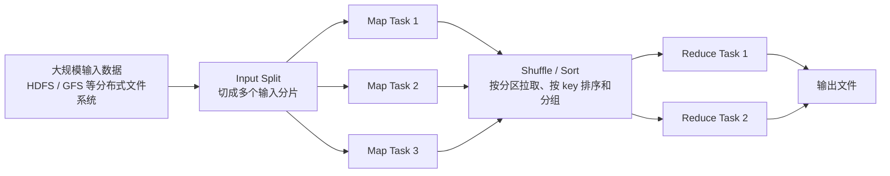
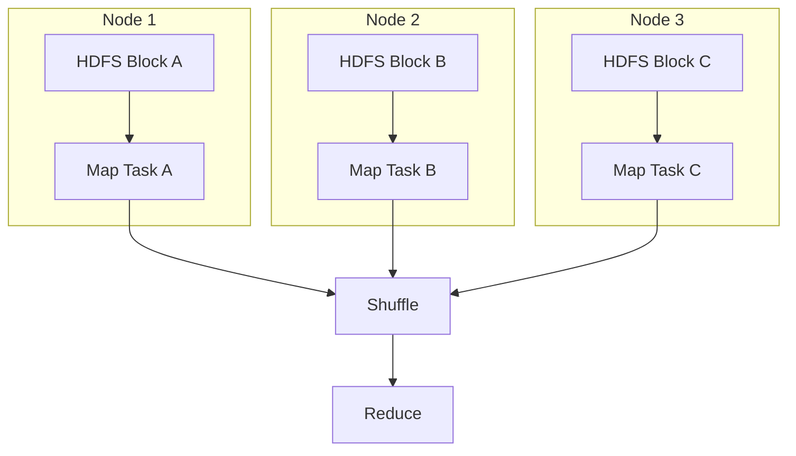

MapReduce 是大数据系统史上最重要的计算模型之一。它把大规模数据处理抽象成两类函数：`Map` 负责把输入记录转换成零个或多个中间键值对，`Reduce` 负责把相同 key 的中间值合并成零个或多个结果。看起来很简单，但真正有价值的部分不只是这两个函数，而是背后的分布式执行框架：它会自动切分输入、调度任务、移动中间数据、处理节点失败，并把结果写回分布式文件系统。

如果只记住“Map 负责映射，Reduce 负责汇总”，很容易低估 MapReduce。更准确地说：

> **MapReduce 是一种用受限编程模型换取大规模并行、容错和工程可控性的分布式批处理模型。**

它不适合所有计算，但非常适合对海量数据做离线扫描、过滤、转换、聚合和排序。理解 MapReduce，也能帮助理解后来的 Hadoop、Hive、Spark、Flink 等大数据系统为什么要处理分区、Shuffle、数据倾斜和容错这些核心问题。

## 一、MapReduce 要解决什么问题

在单机上处理数据时，最直接的写法通常是：

1. 打开一个文件。
2. 一行一行读取。
3. 解析、过滤、统计。
4. 把结果写出去。

当数据从 GB 变成 TB、PB 之后，这个思路会遇到几个硬问题。

**第一，数据放不下一台机器。** 输入数据需要分布在很多机器或很多磁盘上，计算也必须并行展开。

**第二，机器随时可能失败。** 任务运行时间越长、机器数量越多，磁盘坏、进程崩、网络抖动就越不稀奇。系统不能因为一台机器失败就让整个作业从头开始。

**第三，中间结果会跨机器移动。** 聚合、排序、Join 这类操作经常要求“相同 key 的数据来到同一个地方”，这意味着必须跨节点重分布数据，也就是 Shuffle。

**第四，普通开发者不应该手写分布式调度。** 如果每个业务都要自己处理任务切分、重试、网络传输和容错，工程成本会非常高。

MapReduce 的设计思路是：让开发者只关心 `map` 和 `reduce` 的业务逻辑，框架负责分布式运行时。下面这张图描述的是典型的“带 Reduce 阶段”的作业；如果 Reducer 数量为 0，作业可以退化成 map-only 任务，Map 输出直接成为最终输出。



这张图就是 MapReduce 的核心路径：输入被切开并行处理，中间结果按 key 重新分布，最后由 Reduce 写出结果。

## 二、编程模型：一切围绕键值对

MapReduce 把输入、中间结果和输出都看成键值对。在 Google 原始论文中，模型的核心形式可以写成：

```text
map:    (k1, v1)       -> list(k2, v2)
reduce: (k2, list(v2)) -> list(v2)
```

Hadoop MapReduce API 更一般，Reducer 的输出 key/value 类型可以不同于中间 key/value 类型，因此工程里也常写成：

```text
map:    (k1, v1)       -> list(k2, v2)
reduce: (k2, list(v2)) -> list(k3, v3)
```

这里的类型签名和后面的 WordCount 都是用于说明模型的伪代码，不是 Hadoop Java API 的完整泛型声明。

其中：

1. `k1, v1` 是输入记录。例如文本文件中，`k1` 可以是行偏移量，`v1` 可以是一行文本。
2. `k2, v2` 是 Map 输出的中间键值对。例如词频统计中，`k2` 是单词，`v2` 是数字 1。
3. `k3, v3` 是 Hadoop API 中的最终输出类型。例如 `word -> count`。

这个模型看起来受限，但限制本身就是它的优势。只要计算能被表达为“独立处理输入记录，再按 key 汇总”，系统就可以把 Map 任务大量并行化，把相同 key 的数据自动汇聚到同一个 Reduce 任务里。

最经典的例子是 WordCount：

```text
输入：
Hello Hadoop
Hello MapReduce

Map 输出：
(Hello, 1)
(Hadoop, 1)
(Hello, 1)
(MapReduce, 1)

Shuffle / Sort 后：
Hadoop    -> [1]
Hello     -> [1, 1]
MapReduce -> [1]

Reduce 输出：
(Hadoop, 1)
(Hello, 2)
(MapReduce, 1)
```

对应的伪代码如下：

```text
map(offset, line):
    for word in tokenize(line):
        emit(word, 1)

reduce(word, counts):
    total = 0
    for count in counts:
        total += count
    emit(word, total)
```

这里的关键不是代码短，而是每一行输入都可以独立执行 `map`。不同机器可以同时处理不同分片，互不影响。只有到按单词汇总时，系统才需要把相同单词的数据移动到同一个 Reduce 任务。

## 三、一次 MapReduce 作业如何运行

以 Hadoop MapReduce 为例，一个作业通常经历以下步骤。

### 1. 提交作业

用户提交作业代码、配置、输入路径、输出路径、Mapper 类、Reducer 类、输入输出格式等信息。现代 Hadoop 集群通常运行在 YARN 上，涉及 `ResourceManager`、`NodeManager` 和每个应用自己的 `MRAppMaster`。

从使用者角度看，提交作业并不是直接把所有数据拉到本机处理，而是把计算逻辑发到集群，让集群在靠近数据的位置执行。

### 2. 切分输入

`InputFormat` 根据输入文件生成多个 `InputSplit`。一个 `InputSplit` 可以理解为一个 Map 任务要处理的数据范围。常见情况下，大文件会按 HDFS block 附近的粒度被切分。

注意，`InputSplit` 是逻辑分片，不等同于物理 block 本身。Hadoop 官方文档明确把它描述为输入的逻辑切分，输入文件本身不会因为生成 split 而被物理切碎；默认的文件型 `InputFormat` 通常按输入字节数切分，并把文件系统 block size 作为 split 大小的上界。它描述“这个 Map 任务应该读哪里、读多少”，具体读取由 `RecordReader` 把原始字节转换成一条条输入记录，并负责处理记录边界。

### 3. 执行 Map

每个 Map 任务读取一个输入分片，对其中每条记录调用用户定义的 `map` 函数，并输出中间键值对。

当作业存在 Reduce 阶段时，Map 的输出不会立刻交给 Reduce。它通常先进入内存缓冲区，随后在溢写和归并过程中落到本地磁盘，并按目标 Reduce 分区组织。这样做有两个原因：

1. 中间数据可能很大，不能全部放在内存里。
2. Reduce 需要从所有 Map 任务中拉取属于自己的那部分数据。

### 4. 分区、排序和 Shuffle

当 Reducer 数量大于 0 时，Map 输出会经过 `Partitioner` 决定去哪个 Reduce 任务。Hadoop 默认的 `HashPartitioner` 思路大致是：

```text
partition = (key.hashCode() & Integer.MAX_VALUE) % num_reducers
```

官方 API 文档把 `HashPartitioner` 概括为使用 `Object.hashCode()` 分区；上面是经典实现的等价写法。它能保证相同 key 进入同一个 Reduce 分区，但不能保证不同 key 均匀分布。随后框架会在 Map 端和 Reduce 端对中间数据进行排序、溢写、归并和分组。Reduce 端会从各个 Map 节点拉取属于自己的分区数据，这个跨节点传输过程就是 Shuffle。

Shuffle 是 MapReduce 中最昂贵、也最容易出问题的阶段之一。它涉及磁盘 I/O、网络传输、排序、归并和内存缓冲。很多 MapReduce 性能问题，本质上都是 Shuffle 数据量过大或 key 分布不均。

### 5. 执行 Reduce

Reduce 端拿到数据后，会先得到按 key 排序和分组后的输入，再对每个 key 调用一次 `reduce(key, values)`。

例如所有 `(Hello, 1)` 会被分到同一组：

```text
Hello -> [1, 1, 1, ...]
```

Reducer 只需要遍历这个 values 列表并输出最终结果。多个 Reduce 任务会各自写出一个或多个结果文件，所以一个作业的输出目录下经常能看到类似 `part-r-00000`、`part-r-00001` 的文件。

需要注意：Reduce 的输入会按 key 排序和分组，但同一个 key 对应的 values 迭代顺序不应该被当作业务语义依赖，除非显式使用二次排序一类设计。Reducer 写出的最终记录不会被框架再次排序；如果 Reducer 自己改变输出 key 或一对多输出，单个输出文件也不一定保持输入顺序。多个 Reduce 任务之间通常更不保证全局有序。如果要全局排序，需要额外设计分区策略和采样边界，或使用专门的排序作业。

并不是所有 MapReduce 作业都必须有 Reduce 阶段。对于只做过滤、解析、字段转换、格式转换的任务，可以把 Reducer 数量设为 0，作业就会成为 map-only 作业，Map 输出直接写成最终结果，而且不会再按 key 排序。

## 四、Combiner：减少 Shuffle 的局部聚合

在 WordCount 里，如果某个 Map 任务处理的数据中有很多 `Hello`，它可能输出成千上万个 `(Hello, 1)`。这些数据都发到 Reduce 端再求和，网络成本很高。

Combiner 的作用是在 Map 端先做一次局部聚合：

```text
Map 原始输出：
(Hello, 1), (Hello, 1), (Hello, 1), (Hadoop, 1)

Combiner 后：
(Hello, 3), (Hadoop, 1)
```

这样传给 Reduce 的数据量会明显下降。

但 Combiner 有两个非常重要的约束。第一，**不能依赖 Combiner 保证正确性**：它是可选优化，框架可以不运行，也可能在溢写、归并等过程中运行多次。第二，Combiner 处理的是 Map 输出并继续产出中间结果，因此它的输入和输出 key/value 类型都必须保持为中间类型 `(k2, v2)`，也就是 Reducer 的输入类型。只有当局部聚合和最终聚合在语义上安全时，才应该使用 Combiner；如果 Reducer 的最终输出类型是 `(k3, v3)` 且不同于中间类型，就不能简单把同一个 Reducer 类拿来当 Combiner。

适合 Combiner 的操作通常有：

1. 求和。
2. 计数。
3. 最大值、最小值。
4. 可结合、可交换的局部聚合。

不适合直接用 Combiner 的典型例子是平均值。如果 Map 端直接输出局部平均数，Reduce 端再对平均数求平均，结果通常是错的。正确做法是输出 `(sum, count)`，最后再计算 `sum / count`。

## 五、容错机制：为什么机器坏了作业还能继续

MapReduce 默认假设失败会发生。它的容错思路不是避免失败，而是让失败后的恢复成本可控。

### 1. Map 任务失败

Map 任务的输入通常来自分布式文件系统，原始数据有副本。某个 Map 任务失败后，调度器可以把同一个输入分片重新调度到其他健康节点上运行。

如果执行 Map 的节点宕机，它本地磁盘上的中间结果也会丢失。由于这些中间结果可以由原始输入重新计算出来，框架会重新运行对应 Map 任务，再让 Reduce 拉取新的中间结果。

### 2. Reduce 任务失败

Reduce 的输入来自 Map 输出。Reduce 任务失败后，可以重新从 Map 端拉取中间数据并重新执行。最终输出通常写到分布式文件系统，作业提交协议会确保成功任务的输出被正确提交，失败或重试任务的临时输出不会污染最终结果。

### 3. 慢任务和推测执行

大集群里常见一种问题：大部分任务都完成了，但少数任务因为机器慢、磁盘慢、网络慢或数据倾斜迟迟结束不了。这类任务被称为 straggler。

MapReduce 可以使用推测执行：当框架发现某个任务明显慢于其他任务时，可能在另一台机器上启动同一任务的副本。哪个副本先完成，就采用哪个结果。推测执行不能解决所有问题，但能缓解个别慢节点拖垮整个作业的问题。

这也带来一个工程约束：Mapper 和 Reducer 最好是确定性的，并尽量避免写外部副作用。Hadoop 官方文档提到，同一个 Mapper 或 Reducer 的多个 task attempt 可能因为推测执行同时运行；如果业务确实要写额外的 side-effect 文件，需要使用 task attempt 级别的唯一路径，不能只按 task id 写同一个目标文件。普通作业输出应交给 `OutputFormat` 和 `OutputCommitter` 管理。

## 六、数据本地性：把计算移动到数据旁边

MapReduce 经常和 HDFS 搭配使用。HDFS 会把大文件切成 block，并把 block 副本分布在不同 DataNode 上。MapReduce 调度 Map 任务时，会尽量把任务调度到持有输入数据副本的节点上，或者调度到同机架节点上。

这背后的原则是：在大数据场景里，移动计算通常比移动数据便宜。

这个优势主要成立于计算节点和存储节点共址的 HDFS、GFS 类部署。如果输入来自对象存储，MapReduce 仍然可以读取数据，但通常没有同等意义上的本地磁盘数据本地性。



这也是 MapReduce 适合大规模离线批处理的重要原因：输入扫描阶段可以充分利用每个节点的本地磁盘带宽，避免所有数据先集中到一台机器。

## 七、MapReduce 适合什么场景

MapReduce 最适合的是吞吐优先的离线批处理。典型场景包括：

1. **日志统计**：统计 PV、UV、错误码、接口耗时分布。
2. **ETL**：清洗、转换、过滤、去重、格式转换。
3. **倒排索引**：搜索引擎中从文档生成词到文档列表的映射。
4. **大规模排序**：按 key 对海量记录排序。
5. **离线聚合**：按用户、商品、城市、日期等维度聚合指标。
6. **批量特征工程**：为机器学习任务生成离线特征。

这些场景有共同特征：数据量大、实时性要求不高、计算可以拆成大量并行任务，并且中间结果按 key 聚合。

## 八、MapReduce 不适合什么场景

MapReduce 也有明显边界。

**第一，不适合低延迟在线请求。** MapReduce 作业启动、调度、读写分布式文件系统和 Shuffle 都有较重开销，不适合作为用户请求链路的一部分。

**第二，不适合复杂迭代计算。** 机器学习、图计算这类任务经常需要多轮迭代。用 MapReduce 实现时，每一轮通常都要启动新作业并把中间结果落盘，开销很大。Spark、Flink、图计算系统在这类场景通常更自然。

**第三，不适合大量小文件。** 每个小文件都可能带来元数据和任务调度开销。HDFS 和 MapReduce 更偏向处理大文件、大分片、顺序读写。

**第四，不适合强事务场景。** MapReduce 面向批处理文件输出，不提供 OLTP 数据库那样的细粒度事务、索引和毫秒级点查能力。

所以，MapReduce 的价值不是“万能”，而是在适合的批处理问题上提供简单、稳定、可扩展的工程模型。

## 九、MapReduce 和 Spark 的关系

今天很多团队已经更多使用 Spark、Flink 或云厂商托管的数据处理服务，但 MapReduce 仍然值得学习，因为很多概念都从它这里延续下来。

| 维度 | Hadoop MapReduce | Apache Spark |
| --- | --- | --- |
| 核心抽象 | Map 阶段 + Reduce 阶段 | DAG 执行计划 |
| 中间结果 | 通常落本地磁盘，作业之间依赖分布式存储 | 可在内存中缓存和复用，也会在 Shuffle 等场景落盘 |
| 表达能力 | 复杂流水线需要串联多个作业 | 更自然表达多阶段计算 |
| 典型优势 | 稳定、简单、适合大规模离线批处理 | 通用性强，适合 SQL、ETL、迭代计算、交互分析 |
| 典型短板 | 延迟高，复杂作业代码繁琐 | 运行时更复杂，内存和 Shuffle 调优要求更高 |

Spark 并不是简单地“替代 MapReduce 的两个函数”。更准确地说，Spark 把多个转换组织成 DAG，减少不必要的作业边界和落盘，同时提供更高层的 SQL、DataFrame、Dataset API。但 Spark 仍然要面对 MapReduce 已经揭示的核心问题：数据分区、Shuffle、容错、调度、数据倾斜和资源管理。

学懂 MapReduce 后，再看 Spark 的 Stage、Task、Shuffle、宽依赖和窄依赖，会容易很多。

## 十、常见性能问题与优化思路

MapReduce 的性能优化通常围绕“少读、少写、少 Shuffle、少倾斜”展开。

### 1. 减少输入数据量

能在上游过滤的数据，不要拖到后面再处理。合理使用压缩、列式存储或分区目录，可以减少扫描成本。虽然经典 MapReduce 常处理文本和 SequenceFile，但在现代数据平台中，输入格式选择同样关键。

### 2. 使用 Combiner 降低网络传输

对于计数、求和、最大值、最小值等安全聚合，Combiner 可以显著减少 Map 到 Reduce 的数据传输量。

### 3. 设计合理的 key

key 决定数据如何分组，也影响分区是否均匀。如果某个 key 特别大，例如 `UNKNOWN`、`NULL`、热门商品或超级用户，它可能让单个 Reduce 任务处理远多于其他任务的数据，形成数据倾斜。

### 4. 控制 Reducer 数量

Reducer 太少，单个 Reduce 压力大，输出文件少但任务慢。Reducer 太多，调度开销和小文件变多。实际数量需要结合数据量、集群资源、输出文件期望和下游系统能力调整。

### 5. 避免不必要的全量排序

Shuffle 和排序成本很高。如果业务只需要局部 TopN、分组聚合或近似统计，就不要设计成全局排序问题。

### 6. 处理小文件问题

大量小文件会放大 NameNode 元数据压力，也会导致过多 Map 任务。常见做法包括合并小文件、使用容器格式、在上游控制输出文件数量，或使用适合小文件合并的输入格式。

## 十一、一个排查 MapReduce 作业的清单

当一个 MapReduce 作业慢或失败时，可以按下面顺序排查：

1. **看输入规模**：输入文件数量、总大小、是否有大量小文件。
2. **看 Map 数量和耗时分布**：是否大量短任务，是否少数 Map 明显慢。
3. **看 Shuffle 数据量**：Map 输出是否远大于输入，Combiner 是否可以减少传输。
4. **看 Reduce 倾斜**：是否某些 Reduce 处理的数据量远高于其他 Reduce。
5. **看失败重试**：是否节点故障、磁盘问题、网络问题导致任务反复重跑。
6. **看输出文件**：Reducer 数量是否导致小文件过多，输出目录是否已存在。
7. **看业务逻辑**：是否把本该过滤的数据过早发到了 Shuffle，是否使用了错误的 key。

如果只能优先看一个地方，通常先看 Shuffle 和 Reduce 倾斜。MapReduce 作业的大头成本，经常就藏在“相同 key 的数据如何汇聚”这件事里。

## 结语：MapReduce 的本质是受限但可靠的分布式批处理

MapReduce 的伟大之处，不是发明了 `map` 和 `reduce` 这两个函数，而是把一个复杂的分布式系统问题，压缩成普通开发者可以理解和使用的编程模型。

它要求你把计算写成键值对变换：

1. Map 并行处理输入记录。
2. Shuffle 把相同 key 的中间数据汇聚到一起。
3. Reduce 对每个 key 的 values 做合并。
4. 框架负责切分、调度、排序、传输、重试和容错。

这种模型牺牲了一部分表达灵活性，换来了清晰的执行边界、天然的水平扩展能力和较强的失败恢复能力。即使今天很多生产任务已经迁移到 Spark、Flink 或云原生数据平台，MapReduce 仍然是理解大数据计算系统的基础。

只要你能把一个大数据任务拆成“输入如何分片、Map 输出什么 key、Shuffle 如何分区、Reduce 如何聚合、失败后能否重算”，就已经抓住了 MapReduce 的核心。

## 术语表

| 术语 | 解释 |
| --- | --- |
| MapReduce | 面向大规模数据处理的编程模型和分布式执行框架，核心由 Map、Shuffle、Reduce 组成。 |
| Mapper | 执行 `map` 函数的任务逻辑，负责把输入记录转换成零个或多个中间键值对。 |
| Reducer | 执行 `reduce` 函数的任务逻辑，负责对相同 key 的 values 做聚合或合并，并输出零个或多个结果键值对。 |
| InputSplit | 输入逻辑分片，一个 Map 任务通常处理一个 InputSplit。 |
| InputFormat | Hadoop 中负责切分输入并创建记录读取器的组件。 |
| RecordReader | 把输入字节流转换为一条条键值对记录的组件。 |
| Partitioner | 决定中间 key 被分配到哪个 Reduce 任务的组件。 |
| Combiner | 可选的 Map 端局部聚合逻辑，用于减少 Shuffle 数据量。 |
| Shuffle | Map 输出按分区传输到 Reduce 端，并进行排序、归并、分组的过程。 |
| Data Locality | 数据本地性，指尽量把计算调度到数据所在节点或附近节点执行。 |
| Straggler | 明显慢于其他同类任务的慢任务，可能拖慢整个作业完成时间。 |
| HDFS | Hadoop Distributed File System，Hadoop 生态中常用的分布式文件系统。 |
| YARN | Hadoop 的资源管理和作业调度平台，负责为应用分配集群资源。 |

## 参考文献

1. Jeffrey Dean, Sanjay Ghemawat. MapReduce: Simplified Data Processing on Large Clusters. OSDI 2004. https://research.google/pubs/mapreduce-simplified-data-processing-on-large-clusters/
2. Apache Hadoop 官方文档：MapReduce Tutorial. https://hadoop.apache.org/docs/stable3/hadoop-mapreduce-client/hadoop-mapreduce-client-core/MapReduceTutorial.html
3. Apache Hadoop 官方文档：HDFS Architecture. https://hadoop.apache.org/docs/stable/hadoop-project-dist/hadoop-hdfs/HdfsDesign.html
4. Apache Hadoop API：Reducer. https://hadoop.apache.org/docs/stable/api/org/apache/hadoop/mapreduce/Reducer.html
5. Apache Hadoop API：HashPartitioner. https://hadoop.apache.org/docs/stable/api/org/apache/hadoop/mapreduce/lib/partition/HashPartitioner.html
6. Apache Hadoop API：Job. https://hadoop.apache.org/docs/stable/api/org/apache/hadoop/mapreduce/Job.html
7. Apache Hadoop Source：HashPartitioner. https://hadoop.apache.org/docs/r2.7.2/api/src-html/org/apache/hadoop/mapreduce/lib/partition/HashPartitioner.html
8. Apache Hadoop 官方文档：Apache Hadoop YARN. https://hadoop.apache.org/docs/stable/hadoop-yarn/hadoop-yarn-site/YARN.html
9. Apache Hadoop 官方文档：Hadoop Streaming，Map-Only Jobs. https://hadoop.apache.org/docs/current/hadoop-streaming/HadoopStreaming.html
10. Apache Hadoop API：Mapper. https://hadoop.apache.org/docs/stable/api/org/apache/hadoop/mapreduce/Mapper.html
11. Apache Hadoop API：InputFormat. https://hadoop.apache.org/docs/stable/api/org/apache/hadoop/mapreduce/InputFormat.html
12. Apache Hadoop API：RecordReader. https://hadoop.apache.org/docs/stable/api/org/apache/hadoop/mapreduce/RecordReader.html
13. Apache Spark Research. https://spark.apache.org/research.html
