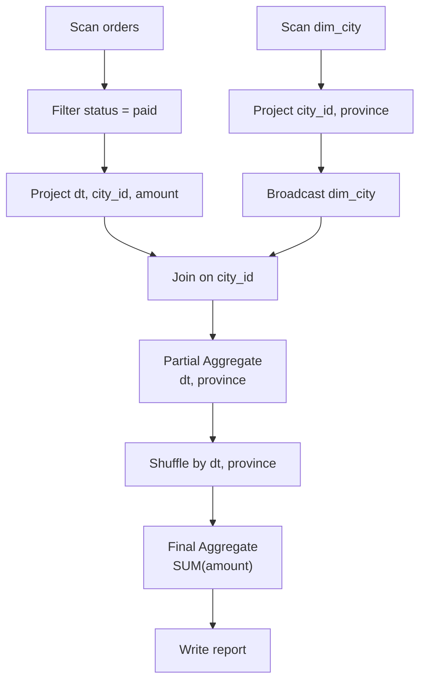
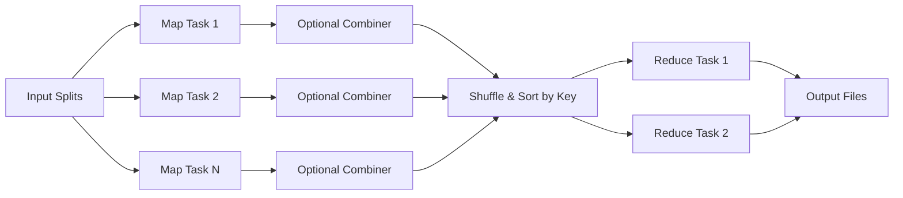
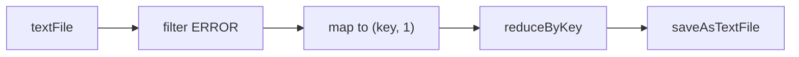
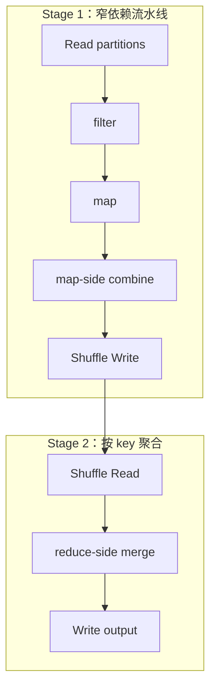
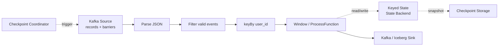
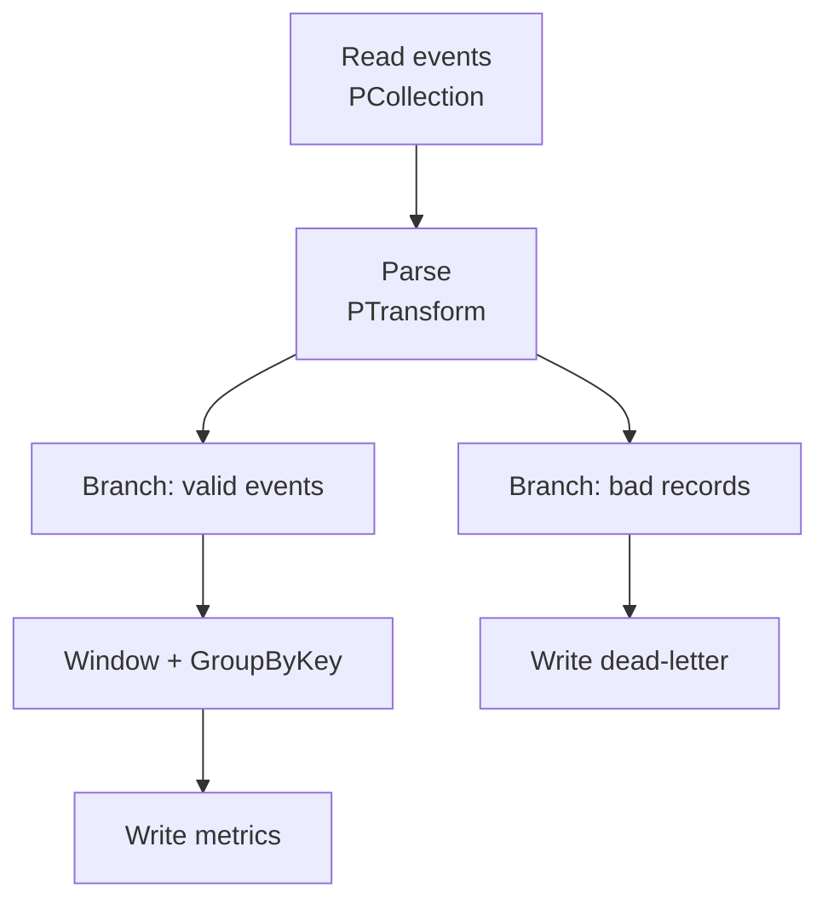
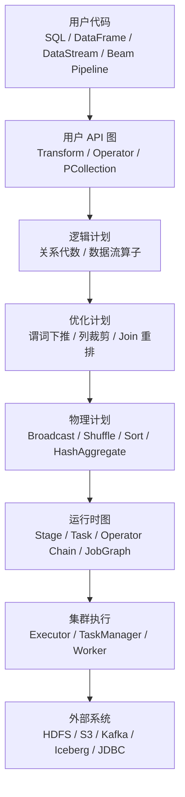

> **核心命题**：大数据处理中的计算图，不是神经网络里的张量求导图，而是描述“数据从哪里来、经过哪些算子、在哪里重分布、如何并行执行、最终写到哪里去”的分布式数据流图。理解这张图，才能真正理解 Spark 的 Stage、Flink 的 Operator、Beam 的 Pipeline、MapReduce 的 Shuffle，以及大数据作业为什么慢、为什么 OOM、为什么数据倾斜、为什么任务会被切成成千上万个 Task。

写大数据任务时，我们看到的往往是一段链式代码：

```python
report = (
    orders
    .where("status = 'paid'")
    .join(cities, "city_id")
    .groupBy("dt", "province")
    .sum("amount")
)
```

这段代码看起来像本地集合操作，但真正运行时，它会被框架转换成一张计算图。节点是读数据、过滤、Join、聚合、排序、写出等算子；边是分区数据、Shuffle 数据、广播数据和控制依赖。有状态流处理还会把算子状态、checkpoint barrier 和 checkpoint 存储一起纳入执行语义。

大数据系统之所以能处理 TB、PB 级数据，关键不在于单个算子有多神奇，而在于它能把这张图拆成可以并行执行、可以容错恢复、可以跨机器调度的任务网络。

## 一、先定义：大数据里的计算图是什么？

一句话：

> **大数据计算图是由数据集、算子和依赖关系组成的有向数据流表示，用来描述分布式数据处理任务如何从输入变成输出。**

在不同系统里，它有不同名字：

| 系统 | 常见说法 | 图中节点 | 图中边 |
| --- | --- | --- | --- |
| Hadoop MapReduce | Job / MapReduce 流程 | Mapper、Combiner、Reducer | 中间 key/value、Shuffle 分区 |
| Spark RDD | Lineage / DAG | RDD transformation、Stage、Task | RDD 依赖、Shuffle 依赖 |
| Spark SQL | Logical Plan / Physical Plan | Scan、Filter、Join、Aggregate、Exchange | 行数据、分区数据、Shuffle / Broadcast |
| Flink | Dataflow Graph / JobGraph / ExecutionGraph | Source、Operator、Sink | DataStream、Keyed Stream、网络边、checkpoint barrier |
| Apache Beam | Pipeline Graph | PTransform | PCollection |

可以把它理解为三层：

1. **用户视角的图**：代码里写下的 `map`、`filter`、`join`、`groupBy`、`window`。
2. **优化器视角的图**：逻辑计划、物理计划、代价估计、算子重排、Join 策略、分区策略。
3. **运行时视角的图**：Stage、Task、Executor、Operator Chain、Checkpoint、Shuffle 文件、网络传输。

这三层经常不是一一对应的。你写的一个 `groupBy`，运行时可能变成局部聚合、Shuffle、最终聚合；你写的多个 `map/filter`，运行时可能被合并到同一个 Task 或 Operator Chain 中。

## 二、和机器学习计算图有什么不同？

很多人听到“计算图”，第一反应是 TensorFlow、PyTorch、自动求导。大数据计算图和机器学习计算图有相似之处：都是节点表示操作，边表示数据依赖。但它们关注的问题不同。

| 维度 | 大数据计算图 | 机器学习计算图 |
| --- | --- | --- |
| 数据单位 | 分区、记录、表、流、文件块 | 张量、参数、激活值 |
| 主要目标 | 分布式处理、Shuffle、容错、吞吐、延迟 | 数值计算、自动求导、矩阵算子优化 |
| 典型瓶颈 | 网络、磁盘、序列化、数据倾斜、状态大小 | GPU 显存、矩阵乘、算子融合、带宽 |
| 图的边 | 分区依赖、数据流、Shuffle、广播、checkpoint barrier | 张量依赖、控制依赖、梯度依赖 |
| 容错方式 | lineage 重算、checkpoint、savepoint、重试 | 训练 checkpoint、算子重算、分布式训练恢复 |
| 是否需要反向图 | 通常不需要 | 训练时通常需要 |

所以，大数据里的计算图首先是**分布式数据流图**，不是自动求导图。

## 三、一个 SQL 如何变成计算图？

假设有这样一个日报任务：

```sql
SELECT
  o.dt,
  c.province,
  SUM(o.amount) AS gmv
FROM orders o
JOIN dim_city c
  ON o.city_id = c.city_id
WHERE o.status = 'paid'
GROUP BY o.dt, c.province;
```

从人的角度看，这是一个查询；从执行引擎角度看，它是一张图。下面这张图假设 `dim_city` 足够小，可以广播到处理 `orders` 的 worker；如果维表不能广播，Join 前通常还会出现按 `city_id` 重分布的 `Exchange` / Shuffle。



注意这张图里最关键的往往不是 `SUM` 本身，而是 Broadcast、Exchange、Shuffle 这类数据移动边。

在单机程序里，`groupBy` 只是内存里的哈希表操作；在分布式系统里，`groupBy(dt, province)` 意味着相同 key 的数据必须被送到同一个下游分区。这个“把数据按 key 重新分布”的过程，就是大数据任务最昂贵的边之一。

## 四、计算图的核心：边比点更重要

理解大数据计算图，不能只看算子节点，更要看边。

节点表示“做什么计算”，边表示“数据怎么移动”。在大数据里，真正贵的往往不是 CPU 做加法，而是数据移动。

| 关注对象 | 含义 | 典型代价 |
| --- | --- | --- |
| 本地流水线边 | 一个分区内连续处理，例如 `filter -> map` | 低，通常可在同一个 Task 中完成 |
| Shuffle 边 | 按 key 或分区规则跨节点重分布 | 高，涉及网络、磁盘、序列化、排序 |
| Broadcast 边 | 小表复制到多个 Worker | 中等，取决于表大小和 Executor 数量 |
| 状态访问 / checkpoint | 流处理算子读写 keyed/operator state，并把状态快照持久化 | 取决于状态大小、状态后端和 checkpoint 存储 |
| Sink 边 | 写外部系统，例如 HDFS、S3、Kafka、数据库 | 取决于外部系统吞吐和提交协议 |

一个任务慢，往往不是因为节点太多，而是因为图里有昂贵的数据移动、状态访问或外部写入：

1. 大 Shuffle。
2. 倾斜 Shuffle。
3. 反复读写外部存储。
4. 大状态 checkpoint。
5. 小文件过多导致 sink 提交慢。
6. 广播表过大导致 Driver 或 Worker 内存压力。

## 五、MapReduce：最经典的固定计算图

MapReduce 是大数据计算图的原型。典型的、有 Reduce 阶段的 MapReduce Job，会把批处理任务压缩成一个固定模式：



Google MapReduce 论文把模型定义为：用户提供 `map` 函数，把输入 key/value 转成中间 key/value；再提供 `reduce` 函数，合并相同中间 key 的所有 value。Hadoop MapReduce 文档也明确描述：输入被切成独立 chunk，由 map task 并行处理；map 输出会排序，再进入 reduce task。

这类 MapReduce 计算图的特点是：

1. **结构固定**：典型有 Reduce 的 Job 是 Map -> Shuffle/Sort -> Reduce；map-only Job 则没有 Reduce 阶段。
2. **边界清晰**：有 Reduce 阶段时，Map 和 Reduce 之间会发生按 key 分区、排序、拉取和分组；如果把 reduce task 数设为 0，map 输出会直接写到文件系统，不经过 reduce 阶段。
3. **容错简单**：失败的 task 可以基于输入数据或中间输出重跑。
4. **表达力有限**：复杂任务需要串多个 MapReduce Job，每个 Job 往往要落盘。

也就是说，MapReduce 很稳，但表达复杂数据流时图比较刚性。Spark、Flink、Beam 等系统把“单个或串联的 MapReduce Job”扩展成更灵活的 DAG 或数据流图。

## 六、Spark：从 lineage DAG 到 Stage / Task

Spark 的核心思想之一，是把一系列 transformation 先记下来，不立刻执行。官方 RDD 文档明确说：Spark transformation 是 lazy 的，只有 action 需要结果时才计算。

比如：

```python
lines = sc.textFile("hdfs:///logs")
errors = lines.filter(lambda x: "ERROR" in x)
pairs = errors.map(lambda x: (x.split()[0], 1))
counts = pairs.reduceByKey(lambda a, b: a + b)
counts.saveAsTextFile("hdfs:///out")
```

在 `saveAsTextFile` 之前，Spark 只是记住了 lineage：



真正执行时，Spark 会识别哪里可以流水线执行，哪里必须 Shuffle。`reduceByKey` 的 reduce 函数要求满足结合律和交换律，Spark 会先在 map 侧做本地合并，再把合并后的中间结果按 key 分区传给 reduce 侧。



Spark 的关键点：

1. **Transformation 构图**：`map`、`filter`、`select`、`join`、`groupBy` 等先构成逻辑依赖。
2. **Action 触发执行**：`count`、`collect`、`saveAsTextFile`、`DataFrameWriter.save`、`saveAsTable` 等会触发 Job。
3. **Shuffle 切 Stage**：需要跨分区重分布的数据依赖通常会形成 Stage 边界。
4. **Partition 变 Task**：每个 Stage 根据分区数生成多个 Task。
5. **Lineage 支撑容错**：中间分区丢失时，可以根据 lineage 从上游重算。

Spark SQL / DataFrame 还会多一层优化器。用户写下的是 DataFrame 或 SQL，Spark 会生成逻辑计划、优化逻辑计划、物理计划，再执行。AQE（Adaptive Query Execution）还能利用运行期统计信息，在执行过程中重新选择更高效的计划，例如合并 Shuffle 分区、处理倾斜 Join、把 Sort-Merge Join 转成 Broadcast Hash Join。

## 七、Flink：持续运行的流式数据流图

Spark 的典型批处理图通常有明确开始和结束；Flink 更强调在有界和无界数据流上做有状态计算。Flink 官网把它描述为用于 bounded / unbounded data streams 上有状态计算的分布式处理引擎。

一个典型 Flink 任务像这样：



Flink DataStream 文档中有几个重要事实：

1. `DataStream` 可以表示有限或无界数据。
2. `map`、`filter`、`keyBy`、`window` 等 transformation 会派生新的 stream。
3. Flink 程序也是 lazy 的：main 方法执行时并不直接处理数据，而是把操作加入 dataflow graph；调用 `execute()` 后才触发执行。
4. Operator 可以组合成复杂 dataflow topology。

Flink 的计算图和批处理 DAG 不完全一样。流处理图可能长期运行，节点内部持有状态，边上有连续事件流，checkpoint barrier 和水位线（watermark）会随数据流传播，定时器和状态后端则属于算子的运行时语义。

这带来几个额外问题：

1. **状态在哪里？** 例如每个 key 的窗口聚合、中间计数、去重集合。
2. **时间怎么推进？** 使用 processing time、event time、watermark。
3. **失败怎么恢复？** 通过 checkpoint / savepoint 恢复算子状态和输入位置；checkpoint barrier 从 source 侧进入数据流，并随数据流向下游传播。
4. **反压怎么传播？** 下游慢会通过网络边影响上游。
5. **图能不能改？** 修改 operator UID、并行度或状态结构，可能影响 savepoint 恢复。

所以，Flink 的计算图不仅是“算子 DAG”，更是“带状态和时间语义的持续数据流图”。

## 八、Beam：把计算图和执行引擎解耦

Apache Beam 的定位更像一个统一编程模型。Beam 程序由 `PCollection` 和 `PTransform` 组成：

1. `PCollection` 表示分布式数据集，可以是 bounded，也可以是 unbounded。
2. `PTransform` 表示对 `PCollection` 的处理步骤。
3. Pipeline 不必是直线，可以是 DAG 形式的 processing graph，支持分支、合流和多输出。
4. Runner 会根据 `PCollection` 和 `PTransform` 构造 workflow graph，再交给具体后端执行。



Beam 的价值在于，它把“图的定义”和“图的执行”拆开：

1. 同一套 Pipeline 逻辑可以交给不同 Runner。
2. Runner 决定如何翻译成 Spark、Flink、Dataflow 或其他后端的执行图。
3. Beam 的模型天然强调 bounded/unbounded、window、trigger、watermark 等统一语义。

这意味着 Beam 用户看到的是通用计算图；真正的物理执行图由 Runner 和后端决定。

## 九、从代码到集群：一张图会经历哪些形态？

大数据系统一般会把一段程序逐步转换：



每一层都可能改变图：

1. **API 层**：用户写出大致的数据处理逻辑。
2. **逻辑层**：系统理解语义，例如 filter、join、aggregate。
3. **优化层**：系统重排、裁剪、合并和改写图。
4. **物理层**：系统决定具体算法，例如 broadcast join 还是 shuffle join。
5. **运行时层**：系统把图切成任务，分配到机器，处理失败和重试。

所以调试大数据任务时，不能只看代码。真正要看的通常是：

1. Spark UI 的 SQL plan、DAG、Stage、Task。
2. Flink Web UI 的 Job Graph、operator metrics、checkpoint、backpressure。
3. Beam Runner 生成的执行计划和后端监控。
4. 外部存储的读写吞吐、文件数量、分区布局。

## 十、计算图优化到底优化什么？

大数据计算图优化可以分成五类。

### 1. 减少节点：少做无用计算

常见优化：

1. **列裁剪**：只读取需要的列。
2. **谓词下推**：把过滤条件推到数据源或扫描阶段。
3. **分区裁剪**：只读取相关日期、区域、租户的分区。
4. **常量折叠**：提前计算常量表达式。
5. **无用分支删除**：不影响结果的中间计算不执行。

这些优化的目标是：在数据进入昂贵边之前，尽早减少数据量。

### 2. 减少边：少 Shuffle、少跨网络

Shuffle 是大数据计算图里最贵的边之一。常见优化：

1. 使用 broadcast join 避免大表小表 Join 的双边 Shuffle。
2. 利用 bucket、partition、sort order 或 Storage Partition Join 避免重复重分布。
3. 用 map-side combine / partial aggregate 先做局部聚合。
4. 避免连续多个无意义的 `repartition`。
5. 在写出前合理控制分区数，避免小文件风暴。

这类优化通常比微调单个函数更有效。

### 3. 改变节点算法：同一语义，不同物理实现

同一个逻辑节点可以有多种物理实现：

| 逻辑算子 | 可能的物理实现 |
| --- | --- |
| Join | Broadcast Hash Join、Shuffle Hash Join、Sort-Merge Join、Nested Loop Join |
| Aggregate | Hash Aggregate、Sort Aggregate、Partial + Final Aggregate |
| Sort | 全局排序、分区内排序、Top-N |
| Window | 滚动窗口、滑动窗口、会话窗口、增量聚合 |

优化器的任务不是“有没有 Join”，而是选择“怎么 Join”。

### 4. 改变并行度：把图切得刚刚好

并行度太低，资源吃不满；并行度太高，调度开销、Shuffle 文件、小文件和状态开销会暴涨。

常见手段：

1. Spark 调整 Shuffle partition，或依赖 AQE 合并 post-shuffle partition。
2. Flink 设置 operator parallelism，必要时让不同算子有不同并行度。
3. Beam 交给 Runner 决定分片和并行度，但仍要控制 key 分布和 window 规模。
4. 对热点 key 做 salting 或拆分，缓解数据倾斜。
5. 对 sink 控制输出文件大小和提交频率。

并行度是计算图的“切分粒度”，不是越大越好。

### 5. 管理状态和容错：让图能长期运行

批处理里，容错常靠 task retry、lineage 重算、checkpoint、输出提交协议。流处理里，状态和 checkpoint 更核心。

流式计算图需要额外关注：

1. 状态大小是否随 key 数、窗口数无限增长。
2. watermark 是否能正常推进。
3. checkpoint 是否超时或过大。
4. sink 是否支持端到端一致性，特别是 source 是否可重放、sink 是否事务化或幂等。
5. 反压是否来自某个下游 operator 或外部系统。

Flink 任务变慢时，经常不是算子逻辑变复杂，而是状态访问、checkpoint 快照或 sink 边开始拖慢整张图。

## 十一、如何读懂一张大数据计算图？

可以按下面顺序看。

### 1. 先看 Source

问题：

1. 数据从哪里来？HDFS、S3、Kafka、Iceberg、JDBC？
2. 输入是否能并行切分？
3. 有没有分区裁剪？
4. 小文件是否过多？
5. Kafka topic 分区数是否限制了最大并行度？

Source 决定了整张图的初始吞吐上限。

### 2. 再看宽边

重点找：

1. `Exchange`
2. `Shuffle`
3. `GroupByKey`
4. `keyBy`
5. `repartition`
6. `join`
7. `sort`

这些通常是跨分区、跨节点、跨磁盘的边。大多数性能问题都能在这里找到线索。

### 3. 再看数据是否变少

一个好的图通常尽早让数据变少：

1. 先 filter，再 join。
2. 先 project，再 shuffle。
3. 先 partial aggregate，再 final aggregate。
4. 先本地 combine，再跨网络传输。

如果一张图在 Shuffle 前没有过滤、裁剪、局部聚合，就要警惕。

### 4. 再看并行度和倾斜

观察：

1. 每个 Stage / Operator 的 task 数。
2. 最大 task 耗时和中位 task 耗时差距。
3. Shuffle read/write 是否集中在少数 task。
4. 某些 key 是否过热。
5. 某些分区是否远大于其他分区。

如果 99% 的 task 都跑完了，剩几个 task 卡很久，通常是倾斜。

### 5. 最后看 Sink

Sink 经常被低估：

1. 写 S3/对象存储是否有提交开销？
2. 是否产生大量小文件？
3. 数据库 sink 是否被连接数或事务限制卡住？
4. Kafka sink 是否受 topic 分区数或 broker 吞吐限制？
5. Iceberg/Hudi/Delta 写入是否有元数据提交瓶颈？

计算图最后一条边慢，整张图也会慢。

## 十二、常见误区

**误区一：计算图就是 lineage。**

Lineage 是计算图的一部分，更强调数据如何由上游派生而来，以及失败后如何重算。完整执行图还包括物理算子、并行度、Shuffle、状态、调度和外部系统边。

**误区二：没有 `repartition` 就没有 Shuffle。**

`groupBy`、`join`、`distinct`、`orderBy`、`reduceByKey` 等都可能触发 Shuffle。显式 `repartition` 只是其中一种。

**误区三：节点越少越快。**

不一定。有时增加一个局部聚合节点，可以大幅减少 Shuffle 数据；增加一个缓存或 checkpoint 节点，可以避免重复计算。

**误区四：Broadcast Join 永远好。**

广播表过大时，可能压垮 Driver、Executor 或网络；并且不是所有 Join 类型都适合广播。

**误区五：流处理图只是批处理图一直跑。**

流处理多了状态、时间、水位线、迟到数据、checkpoint、反压和端到端一致性。它不是简单的 while 循环。

**误区六：看代码就能知道最终执行图。**

现代引擎有优化器和运行时自适应机制。Spark AQE 可能在运行中改计划；Beam Runner 会把通用 pipeline 翻译成后端特定图；Flink 也会做 operator chaining 和物理分区。

## 十三、总结

大数据计算图可以压缩成一句话：

> **它是分布式数据处理任务的执行蓝图：节点定义计算，边定义数据移动，运行时把图切成可并行、可恢复、可调度的任务。**

真正理解一张大数据计算图，要持续追问五个问题：

1. **数据从哪里来？**
2. **哪些节点只是本地流水线，哪些边会跨网络 Shuffle？**
3. **数据量是在变小，还是被过早放大？**
4. **并行度是否合适，key 是否倾斜？**
5. **状态、checkpoint 和 sink 是否成为瓶颈？**

典型 MapReduce Job 把计算压成 Map -> Shuffle -> Reduce，map-only Job 是重要例外；Spark 把批处理扩展成 lineage DAG 和 Stage 图；Flink 把图扩展成有状态、带时间语义、持续运行的数据流；Beam 则把图定义和执行后端解耦。

所以，学习大数据处理，不应该只背 API，而要学会看图。API 是你写给框架看的表层语言，计算图才是框架真正执行的程序。

## 术语表

| 术语 | 解释 |
| --- | --- |
| 计算图 | 描述数据处理任务中算子、数据集和依赖关系的有向图。 |
| DAG | Directed Acyclic Graph，有向无环图，很多批处理任务可表示为 DAG。 |
| Operator | 数据处理算子，例如 map、filter、join、aggregate、window。 |
| Source | 数据输入节点，例如 HDFS、S3、Kafka、JDBC、Iceberg 表。 |
| Sink | 数据输出节点，例如文件、消息队列、数据库、湖仓表。 |
| Shuffle | 按 key 或分区规则跨节点重分布数据的过程，通常涉及网络、磁盘和序列化。 |
| Stage | Spark 中由 Shuffle 边界切分出来的一组可并行执行任务。 |
| Task | 分布式执行的最小调度单元，通常处理一个或多个数据分片。 |
| Lineage | 数据集从上游数据和 transformation 派生而来的血缘关系。 |
| PCollection | Apache Beam 中的分布式数据集抽象，可表示 bounded 或 unbounded 数据。 |
| PTransform | Apache Beam 中对 PCollection 执行的数据处理步骤。 |
| DataStream | Apache Flink 中表示有限或无界数据流的数据抽象。 |
| Keyed Stream | 按 key 逻辑分区后的流，常用于 keyed state、window、reduce。 |
| Watermark | 流处理中用于表示事件时间进度的机制。 |
| Checkpoint | 保存运行状态以便失败恢复的机制，流处理中特别重要。 |
| AQE | Adaptive Query Execution，Spark SQL 中基于运行期统计信息重新优化执行计划的机制。 |
| Backpressure | 反压，下游处理能力不足导致上游发送速度被迫下降的现象。 |

## 参考文献

1. Apache Spark Documentation, RDD Programming Guide, <https://spark.apache.org/docs/latest/rdd-programming-guide.html>
2. Apache Spark Documentation, PySpark `RDD.reduceByKey` API, <https://spark.apache.org/docs/latest/api/python/reference/api/pyspark.RDD.reduceByKey.html>
3. Apache Spark Documentation, Spark SQL Performance Tuning, <https://spark.apache.org/docs/latest/sql-performance-tuning.html>
4. Apache Flink Documentation, DataStream API Programming Guide, <https://nightlies.apache.org/flink/flink-docs-stable/docs/dev/datastream/overview/>
5. Apache Flink Documentation, DataStream Operators, <https://nightlies.apache.org/flink/flink-docs-stable/docs/dev/datastream/operators/overview/>
6. Apache Flink Documentation, Fault Tolerance, <https://nightlies.apache.org/flink/flink-docs-stable/docs/learn-flink/fault_tolerance/>
7. Apache Beam Documentation, Programming Guide, <https://beam.apache.org/documentation/programming-guide/>
8. Apache Beam Documentation, Basics of the Beam Model, <https://beam.apache.org/documentation/basics/>
9. Apache Hadoop Documentation, MapReduce Tutorial, <https://hadoop.apache.org/docs/r3.3.6/hadoop-mapreduce-client/hadoop-mapreduce-client-core/MapReduceTutorial.html>
10. Jeffrey Dean and Sanjay Ghemawat, MapReduce: Simplified Data Processing on Large Clusters, OSDI 2004, <https://research.google/pubs/mapreduce-simplified-data-processing-on-large-clusters/>
