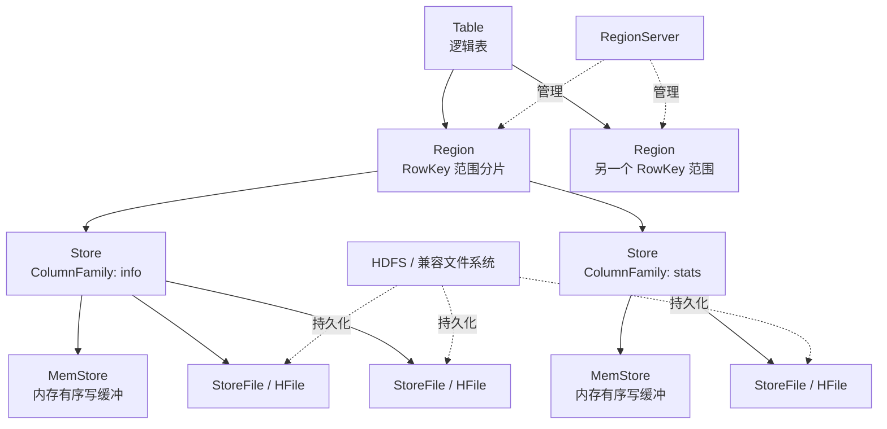
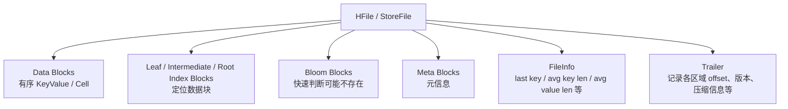
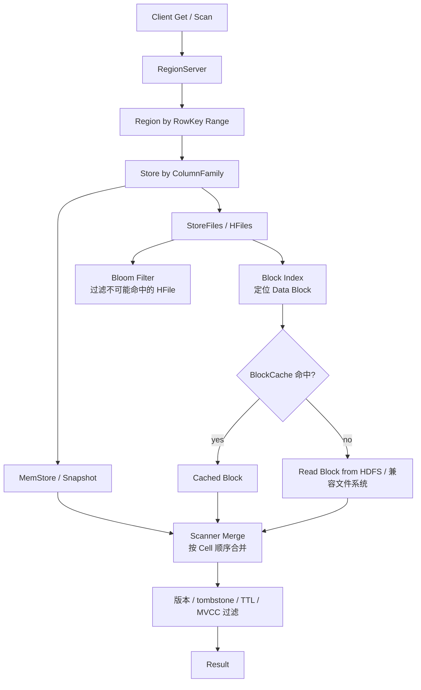
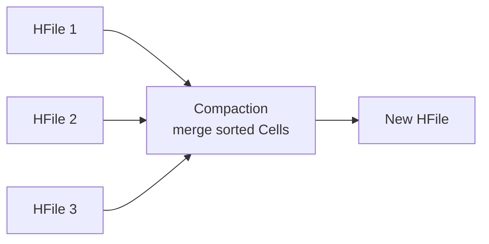

> **核心命题**：HBase 的存储格式不是“关系型表按行存储”或“像 Parquet 一样按列存储”，而是一个面向 RowKey 排序的、按列族物理组织的稀疏多维 Map。默认 `SYNC_WAL` 持久性下，写入先记录到 WAL，再进入 MemStore，并在返回成功前等待 WAL 同步到文件系统实现；随后 MemStore 刷成不可变的 StoreFile，也就是 HFile。HFile 内部再由有序 Cell、数据块、索引块、Bloom Filter、FileInfo 和 Trailer 组成。

理解 HBase，最容易混淆的是两个层次：

1. **逻辑数据模型**：表、RowKey、列族、列限定符、时间版本、Cell。
2. **物理存储格式**：Region、Store、MemStore、StoreFile/HFile、Block、KeyValue。

逻辑模型告诉我们“数据怎么看”，物理格式告诉我们“数据怎么落盘、怎么读取、为什么这样设计”。这篇文章重点讲第二件事，但会从逻辑模型开始，因为 HBase 的物理格式几乎完全围绕 RowKey、列族和版本排序展开。

## 一、先用一句话描述 HBase 的存储模型

HBase 可以被理解成这样一个稀疏多维 Map：

```text
(rowkey, column_family, column_qualifier, timestamp) -> value
```

更准确一点：

```text
Table
  -> RowKey
    -> ColumnFamily
      -> ColumnQualifier
        -> Timestamp Version
          -> Value
```

HBase 官方文档也强调，不要把 HBase 表直接类比成关系型数据库表。HBase 表更像一个多维 Map：行按 RowKey 的字节字典序排序，列由列族和列限定符组成，Cell 由行、列族、列限定符和时间戳共同定位。

举个例子：

```text
rowkey = user#1001

info:name        -> "Aaron"      @ t3
info:city        -> "Shanghai"   @ t2
stats:login_days -> "128"        @ t5
```

这里有两个列族：`info` 和 `stats`。列族必须在建表时声明，而 `name`、`city`、`login_days` 这样的列限定符可以动态出现。某一行没有某个列时，HBase 不会为这个“空格子”额外占空间，这就是 HBase 适合稀疏宽表的原因。

## 二、物理层级：Table -> Region -> Store -> HFile

HBase 的物理存储层级可以先记成这张图：



这张图里有几个关键点：

| 层级 | 含义 | 存储格式相关重点 |
| --- | --- | --- |
| Table | 用户看到的逻辑表 | 表中的行按 RowKey 字节字典序排序，不按自增主键或 SQL 索引组织 |
| Region | Table 按 RowKey 范围切分后的分片 | 一个 Region 负责一段连续 RowKey 范围 |
| Store | Region 内某个列族的物理存储单元 | 一个列族对应一个 Store，列族是重要物理边界 |
| MemStore | Store 的内存写缓冲 | 保存尚未刷盘的有序 Cell |
| StoreFile / HFile | Store 刷盘后的不可变文件 | HBase 真正的数据文件格式 |

一个非常重要的结论是：

> **列族不是普通字段分组，而是物理存储边界。**

同一个 Region 中，每个列族都有自己的 Store、MemStore 和 StoreFile。`info` 列族和 `stats` 列族的刷盘产物会分别写成各自的 StoreFile，后续也会分开压缩、分开参与 Compaction，并且可以配置不同的 TTL、压缩算法、Bloom Filter 和 BlockCache 策略。

这就是为什么 HBase 不建议随意创建大量列族。列族越多，Region 内的 Store 越多，MemStore、刷盘、Compaction 和文件数量都会变复杂。实践中通常只保留少量列族，并把访问模式、生命周期、数据大小相近的列放在同一列族里。

## 三、HBase 的 Cell 到底长什么样？

在 HBase 内部，数据不是只保存一个裸 value。每个 Cell 都会带上定位它所需的 key 信息。可以把一个 Cell 粗略理解成：

```text
Cell / KeyValue
  key:
    rowkey
    column family
    column qualifier
    timestamp
    type
  value:
    bytes
  tags:
    optional metadata, HFile v3 支持
```

更贴近 HFile 中 KeyValue 的序列化形式，可以理解为：

```text
key_length
value_length
key_bytes
value_bytes
tags_length    # HFile v3 且 FileInfo 中存在 MAX_TAGS_LEN 时
tags_bytes
```

其中 `key_bytes` 内部又包含：

```text
row_length
row
family_length
family
qualifier
timestamp
key_type
```

`key_type` 用来区分 Put、Delete、DeleteColumn、DeleteFamily 等类型。也就是说，删除在 HBase 里不是立即改旧文件，而是写入一种特殊的删除标记，也就是 tombstone。

这个格式带来两个直接影响。

第一，**RowKey、列族名、列限定符都会重复出现在每个 Cell 的 key 中**。如果 RowKey 很长、列族名很长、列限定符很长，磁盘和内存里的 KeyValue 都会变大。HBase 官方 Regions 文档也特别提醒：rowkey、ColumnFamily 和 column qualifier 都嵌在 KeyValue 里，标识符越长，KeyValue 越大。

第二，**HBase 不是把一整行序列化成一个对象再保存**。同一行里的多个列，会拆成多个按 key 排序的 Cell。它的排序顺序大致是：

```text
rowkey ASC
column family ASC
column qualifier ASC
timestamp DESC
type
```

时间戳倒序很关键：同一列的多个版本中，新版本排在前面。因此默认读取最新版本时，HBase 能更快遇到需要返回的 Cell。

## 四、HBase 是“列式存储”吗？

这个问题要分清语境。

HBase 属于 **wide-column store**，中文常译作宽列表或宽列存储。它的列族确实是物理存储边界，同一个列族的数据会放在一起。但这不等于 Parquet、ORC 那种面向分析扫描的列式文件格式。

| 对比项 | HBase | Parquet / ORC |
| --- | --- | --- |
| 主要目标 | 按 RowKey 做低延迟随机读写和范围扫描 | 大规模分析查询、列裁剪、批量扫描 |
| 物理组织 | 按 RowKey 有序，按列族分 StoreFile | 按列或列块组织，适合扫描少数字段 |
| 更新方式 | LSM 风格追加写、MemStore flush、Compaction | 通常重写文件或分区，不适合高频随机更新 |
| 查询入口 | Get / Scan / Filter | SQL 引擎扫描和向量化执行 |
| 空值 | 空 Cell 不存储 | 通常由列式编码和定义层级表达 |

所以更准确的说法是：

> **HBase 是按 RowKey 排序、按列族物理聚簇的宽列 KV 存储，不是分析型列式文件格式。**

## 五、写入路径：WAL + MemStore + HFile

HBase 的写入路径体现了典型 LSM Tree 思想：避免原地随机写，把写入先追加到日志和内存结构，再批量刷成不可变文件。下面描述的是默认 `SYNC_WAL` 持久性；如果显式使用 `SKIP_WAL`、`ASYNC_WAL` 或 `FSYNC_WAL`，可靠性和返回成功的时机都会不同。

```mermaid
sequenceDiagram
    participant C as Client
    participant RS as RegionServer
    participant WAL as WAL
    participant MS as MemStores
    participant FS as HDFS / 兼容文件系统

    C->>RS: Put / Delete
    RS->>WAL: append edit
    RS->>MS: insert sorted Cell
    Note over RS,WAL: SYNC_WAL waits for filesystem sync; FSYNC_WAL forces disk sync
    RS-->>C: write success
    MS->>FS: flush to StoreFile / HFile
```

一次 Put 大致会发生这些事：

1. Client 根据 RowKey 找到负责该 Region 的 RegionServer。
2. RegionServer 先把 mutation append 到 WAL，再把 Cell 写入对应列族的 MemStore。
3. 默认 `SYNC_WAL` 下，本次修改在返回成功前会等待 WAL 同步到文件系统实现；以 HDFS 为例，这意味着 flush 到指定数量的 DataNode，但不等同于 `FSYNC_WAL` 的强制落盘。如果 WAL 写入或同步失败，本次修改不会对客户端报告成功。
4. MemStore 达到阈值或被系统触发 flush 时，写成新的 StoreFile/HFile。

这里要补一个容易忽略的细节：HBase 官方 Regions 文档把 **flush 的最小单位描述为 Region，而不是单个 MemStore**。常规理解是：当某个 MemStore 触发 flush 时，同一个 Region 下各个列族的 MemStore 会一起刷盘；只是刷盘产物仍然按 Store/ColumnFamily 分别写成各自的 StoreFile。新版本和特定配置下还可能使用 `FlushLargeStoresPolicy`，在全局 MemStore 压力触发 flush 时只刷超过阈值的部分 Store，因此实际行为要以集群版本和 flush policy 为准。

WAL 的作用是崩溃恢复。正常读请求不靠 WAL 返回数据；如果 RegionServer 在 MemStore 刷盘前宕机，HBase 可以通过 WAL replay 把未落盘的修改恢复回来。官方 RegionServer 文档明确说，如果 WAL 写入失败，数据修改操作本身也会失败。

MemStore 是内存中的有序结构。它不是无序缓存，而是服务后续 flush 和读合并的写缓冲。flush 之后产生的 HFile 是不可变文件。之后如果同一行同一列被更新，并不会去旧 HFile 里修改旧值，而是写入新的 Cell。读取时再按照排序、版本、删除标记和 MVCC 规则合并出可见结果。

## 六、HFile：HBase 真正的数据文件格式

StoreFile 是 HBase 面向上层的概念，HFile 是底层文件格式。很多场景下你可以把 StoreFile 理解成 HFile 的封装。

一个 HFile 不是简单的 key-value 文本文件，而是由多类 block 组成的有序文件。简化后可以这样看：



### 1. Data Block

Data Block 存放实际 Cell。HBase 读取 HFile 时，并不是每次只从磁盘读取一个 Cell，而是以 block 为单位读取。默认 block size 常见配置是列族级别的 `BLOCKSIZE`，示例中经常可以看到 `65536`，也就是 64 KB。真实生产值要结合随机读、范围扫描、压缩比和缓存命中率调优。

还有一个细节：单个 KeyValue/Cell 不会被拆到多个 block 里。如果一个 Cell 本身很大，即使列族 block size 是 64 KB，这个 Cell 也会作为一个完整单元被读取，这也是大 Cell 容易放大内存和 I/O 压力的原因之一。

block 越大，顺序扫描和压缩效率可能越好，但随机读会多读不需要的数据；block 越小，随机读放大较低，但索引和元数据开销会变高。

### 2. Block Index

HFile 内部有 block index，用于从目标 key 定位到可能包含它的数据块。HFile v2 引入多级 block index，避免超大索引一次性占用过多内存。索引项记录的核心信息包括目标 block 的 offset、on-disk size 和索引 key。

可以把它理解成：

```text
index key -> (block offset, block on-disk size)
```

读取某个 RowKey 时，HBase 不需要从 HFile 头扫到尾，而是通过索引定位到对应的数据块，再在块内查找 Cell。

### 3. Bloom Filter

Bloom Filter 用来减少无效 HFile 读取。因为一个 Store 里可能有多个 HFile，而某个 RowKey 或 Row+Column 未必存在于每个 HFile 中。Bloom Filter 可以快速判断“这个文件大概率不包含目标 key”，从而跳过不必要的磁盘访问。

HBase 常见 Bloom Filter 类型包括：

| 类型 | 粒度 | 适合场景 |
| --- | --- | --- |
| `NONE` | 不使用 | 写入为主、读路径不依赖随机点查 |
| `ROW` | RowKey 级别 | 常见点查整行或行内少量列 |
| `ROWCOL` | RowKey + Column 级别 | 同一行列很多，点查具体列 |
| `ROWPREFIX_FIXED_LENGTH` | 固定长度 RowKey 前缀级别 | RowKey 前缀本身就是主要查询粒度 |

Bloom Filter 可能出现假阳性，但不会出现假阴性。也就是说，它可能误判“可能存在”，导致多读一个文件；但不会把真实存在的数据错判为不存在。

### 4. FileInfo 和 Trailer

FileInfo 是 HFile 内的小型元数据映射，包含 last key、平均 key 长度、平均 value 长度等信息。Trailer 位于文件尾部，记录 HFile 版本、压缩方式、索引位置、load-on-open 区域位置等关键 offset。

为什么 Trailer 在尾部？因为 HFile 写入时很多 offset 和统计信息只有写完之后才知道。读取时先读尾部 Trailer，再按 Trailer 中的 offset 找索引、FileInfo 和其他元数据。

### 5. HFile v2 和 v3

HFile v2 的关键改进包括多级 block index、compound Bloom Filter，以及把打开文件时必须加载的信息放到连续的 load-on-open 区域，降低 RegionServer 打开大量 HFile 时的内存和启动开销。

HFile v3 在 v2 结构基础上增加了对 cell tags 的支持；透明加密等安全能力也要求使用 HFile v3，并会在每个加密 HFile 中保存解密所需的数据密钥信息。当前 HBase 默认配置中，`hfile.format.version` 是 `3`。如果读旧版本资料时看到 HFile v1/v2，需要注意它们是格式演进历史，不应直接当作现代集群的新文件默认格式。

## 七、读取路径：合并 MemStore 和多个 HFile

读路径和写路径一样，都是理解 HBase 存储格式的关键。



一次 Get 或 Scan 可能同时读取：

1. 当前 MemStore。
2. flush 中的 MemStore snapshot。
3. 多个历史 StoreFile/HFile。

这些来源里的 Cell 都已经按 HBase 的 key 顺序组织。RegionServer 会创建 scanner，把 MemStore scanner 和 StoreFile scanner 合并，再根据版本数、时间范围、删除标记、TTL 和 MVCC read point 过滤出对本次请求可见的数据。

这也解释了为什么 StoreFile 太多会拖慢读取：一次读可能要在多个 HFile 之间做候选判断、seek 和合并。Bloom Filter、BlockCache 和 Compaction 都是在降低这个成本。

## 八、Compaction：把多个不可变文件重新整理

因为 HBase 不原地更新 HFile，写入越久，一个 Store 下的 StoreFile 就可能越多。Compaction 的目标是把多个 StoreFile 合并成更少、更大的 StoreFile。



Compaction 有两类：

| 类型 | 做什么 | 结果 |
| --- | --- | --- |
| Minor Compaction | 选择部分较小、相邻的 StoreFile 合并 | 减少文件数，通常不会彻底清理所有删除和过期版本 |
| Major Compaction | 对某个 Store 做更完整的重写 | 默认策略下通常显著减少 StoreFile 数量，并处理 tombstone、TTL、最大版本等；是否最终只有一个文件取决于 compaction policy、文件大小和表配置 |

删除在 HBase 中尤其依赖 Compaction。Delete 操作写入 tombstone，查询时 tombstone 会遮蔽被删除的数据；真正把旧 Cell 和 tombstone 从文件中清掉，通常发生在 major compaction 中。

所以，HBase 的“删除”不是立刻释放磁盘空间。短时间内频繁删除，磁盘占用不降反升是正常现象。是否及时释放，取决于 major compaction、TTL、版本保留策略和相关配置。

## 九、压缩与 Data Block Encoding

HBase 的压缩和数据块编码都是列族级别的重要存储优化。

**压缩** 面向 block 中的 value 和整体字节流，目标是减少磁盘占用和 I/O。常见选择包括 Snappy、LZ4、GZ、ZSTD 等，具体可用性取决于 HBase/Hadoop 版本和集群安装的 native codec。

**Data Block Encoding** 面向 HBase Cell key 中的重复信息。因为 HFile 内部 Cell 按 RowKey、列族、列限定符排序，相邻 Cell 往往有很长的公共前缀。Data Block Encoding 就是利用这种重复性，减少 key 的存储开销。官方文档也明确说，data block encoding 会利用 RowKey 排序和表 schema 中的重复模式来减少 key 信息重复。

二者可以一起使用：

```text
原始 KeyValue
  -> data block encoding 减少 key 重复
  -> compression 压缩 block 字节
  -> 写入 HFile
```

需要注意，修改列族的压缩或编码配置后，通常要等后续 compaction 重写 HFile 后，旧文件才会真正变成新格式。配置变更不是瞬间改写所有历史文件。

## 十、存储格式对表设计的影响

HBase 的存储格式不是内部细节那么简单，它会直接影响表设计。

### 1. RowKey 决定物理顺序和访问效率

HBase 按 RowKey 的字节字典序存储行。RowKey 相近的数据会落在相近位置，也会进入相邻 Region 范围。好的 RowKey 应该服务主要查询模式：

| 查询模式 | RowKey 设计倾向 |
| --- | --- |
| 按用户点查 | `user_id` 或带前缀的 `user_id` |
| 按用户 + 时间查最近记录 | `user_id#reverse_timestamp` 或类似结构 |
| 按时间范围全局扫描 | 时间前缀可用，但要小心写热点 |
| 高并发写入单调递增 key | 需要加盐、散列前缀或反转部分 key，避免热点 Region |

RowKey 不是越长越好。它会出现在每个 Cell 的 key 里，长 RowKey 会放大存储、缓存和网络开销。

### 2. 列族要少，并按访问模式划分

列族是 Store 边界，不是随手建的字段目录。应该把访问频率、数据大小、TTL、压缩策略相近的列放在一起。

比如：

```text
info:      小字段，长期保存，点查频繁
activity: 事件摘要，中等大小，保留 90 天
blob:     大字段，低频读取，单独压缩和缓存策略
```

如果一个列族里混入大量低频大字段，可能会污染 BlockCache，也会让点查小字段时读取更多无关 block。反过来，如果列族拆得太碎，Region 内 Store 数量会膨胀，flush 和 compaction 成本上升。

### 3. 列限定符也有成本

HBase 支持动态列，不意味着列名可以无限长、无限乱。列限定符保存在每个 Cell key 中。短而稳定的 qualifier 能减少开销，也能让 data block encoding 更有效。

如果业务列名天然很长，可以考虑在应用层维护字段名映射，例如把 `last_login_timestamp` 映射成 `llt`。但这种做法会牺牲可读性和排障便利，需要在存储成本和可维护性之间权衡。

### 4. 版本数不是免费的

HBase 原生支持多版本，但每个版本都是一个 Cell。保留更多版本意味着更多磁盘、更多 compaction 成本、更多读过滤成本。默认最大版本数在现代 HBase 中通常是 `1`，如果要保留历史版本，应明确说明业务为什么需要它，以及 TTL 和最大版本如何配合。

### 5. 大 Cell 会影响分裂和内存稳定性

HBase 可以存 byte array，但不适合把它当通用对象存储。过大的 Cell 会让 block、RPC、MemStore、compaction 和 Region split 都变得难处理。官方默认配置里也有单个 Cell 最大大小的保护项，默认值常见为 10 MB。超过这个量级的数据，更应该考虑 HDFS、对象存储或 HBase MOB 等方案。

## 十一、一个小例子：同一行如何变成多个 HFile 里的 Cell

假设有一张表 `user_profile`：

```text
ColumnFamily:
  info
  stats
```

写入伪代码如下，其中 `delete_column` 表示写入一个 `DeleteColumn` tombstone，用来遮蔽该列所有时间戳小于等于 t5 的版本：

```text
put           user_profile, user#1001, info:name, Aaron, t1
put           user_profile, user#1001, info:city, Shanghai, t2
put           user_profile, user#1001, stats:login_days, 128, t3
put           user_profile, user#1001, info:city, Singapore, t4
delete_column user_profile, user#1001, info:name, <= t5
```

逻辑上你可能看到：

```text
user#1001
  info:city        -> Singapore
  stats:login_days -> 128
```

但物理上可能是：

```text
Region: [user#0000, user#9999)

Store: info
  MemStore:
    DeleteColumn user#1001/info:name <= t5
    Put    user#1001/info:city @ t4 = Singapore
  HFile A:
    Put    user#1001/info:city @ t2 = Shanghai
    Put    user#1001/info:name @ t1 = Aaron

Store: stats
  HFile B:
    Put    user#1001/stats:login_days @ t3 = 128
```

读取 `user#1001` 时，HBase 会同时看 `info` Store 的 MemStore 和 HFile A，也会看 `stats` Store 的 HFile B。最终 `info:city` 返回 t4 的 Singapore；`info:name` 的 t1 版本被 `DeleteColumn <= t5` 的 tombstone 遮蔽；`stats:login_days` 返回 128。

等后续 major compaction 发生后，`info:name` 的旧值和 tombstone 才可能被真正清理掉。

## 十二、常见误区

**误区一：HBase 更新会修改原文件。**

不会。HBase 是追加写和合并读。更新写入新版本 Cell，旧版本在 compaction 时按规则清理。

**误区二：删除会立刻释放磁盘。**

不会。Delete 写入 tombstone。磁盘释放依赖 compaction、TTL、版本策略和 delete marker 清理规则。

**误区三：列族越多越灵活。**

不是。列族是物理 Store 边界，过多列族会增加 MemStore、flush、StoreFile 和 compaction 管理成本。

**误区四：HBase 是 Parquet 那样的列式分析格式。**

不是。HBase 是宽列 KV 存储，按 RowKey 有序并按列族物理聚簇，主要服务随机读写和范围扫描。

**误区五：Bloom Filter 是索引。**

不是。Bloom Filter 只能判断某个 key 是否“不可能存在”或“可能存在”，不能定位数据位置。真正定位 block 的是 HFile block index。

**误区六：BlockCache 能缓存一切。**

不是。BlockCache 缓存的是 HFile block，命中率受访问模式、block size、列族缓存策略、压缩缓存策略和数据集大小影响。写热点数据通常还在 MemStore，冷数据可能每次都要访问底层文件系统。

## 十三、总结

HBase 的数据存储格式可以从三句话把握：

1. **逻辑上**，HBase 是 `(rowkey, family, qualifier, timestamp) -> value` 的稀疏多维 Map。
2. **物理上**，HBase 按 RowKey 范围切 Region，Region 内按列族切 Store，Store 内由 MemStore 和多个不可变 HFile 组成。
3. **文件上**，HFile 是有序 Cell 的 block 化存储，配合 block index、Bloom Filter、FileInfo、Trailer、压缩和 data block encoding 来兼顾随机读、范围扫描和磁盘效率。

真正掌握 HBase 存储格式之后，很多表设计原则就不再是经验口号：RowKey 为什么重要，列族为什么要少，删除为什么不立即释放空间，长列名为什么有成本，Compaction 为什么会影响读写性能，Bloom Filter 为什么能减少无效 I/O。这些都可以从 HBase 的物理格式里直接推出来。

## 术语表

| 术语 | 解释 |
| --- | --- |
| RowKey | HBase 行键，决定行的字节字典序排序和 Region 范围分布。 |
| Column Family | 列族，建表时声明，是 HBase 的物理存储和配置边界。 |
| Column Qualifier | 列限定符，列族下的动态列名，可以在写入时出现。 |
| Cell | 由 row、family、qualifier、timestamp 定位的值，是 HBase 内部读写的基本数据单元。 |
| KeyValue | HBase 早期和内部常见的 Cell 表示形式，key 中包含 row、family、qualifier、timestamp、type。 |
| Region | Table 按 RowKey 范围切分后的分片，由 RegionServer 托管。 |
| Store | Region 内某个 Column Family 的存储单元，包含 MemStore 和 StoreFile。 |
| MemStore | Store 的内存写缓冲，保存尚未刷盘的有序 Cell。 |
| WAL | Write Ahead Log，写前日志，用于 RegionServer 崩溃后的数据恢复。 |
| StoreFile | Store 刷盘或 compaction 后生成的不可变文件，上层概念上常对应 HFile。 |
| HFile | HBase 底层数据文件格式，由数据块、索引块、Bloom 块、元数据和 Trailer 组成。 |
| BlockCache | RegionServer 中缓存 HFile block 的读缓存。 |
| Bloom Filter | 概率型过滤结构，用于快速跳过不可能包含目标 key 的 HFile。 |
| Compaction | 合并多个 StoreFile 的后台过程，用于减少文件数、清理过期版本和删除标记。 |
| Tombstone | 删除标记。Delete 操作写入 tombstone，后续读取时遮蔽旧数据，并在 compaction 中清理。 |
| Data Block Encoding | HBase 数据块编码机制，利用相邻 Cell key 的重复前缀减少存储开销。 |

## 参考文献

1. Apache HBase Documentation, [Data Model](https://hbase.apache.org/docs/datamodel/)
2. Apache HBase Documentation, [Architecture: Regions](https://hbase.apache.org/docs/architecture/regions/)
3. Apache HBase Documentation, [Architecture: RegionServer](https://hbase.apache.org/docs/architecture/regionserver/)
4. Apache HBase Documentation, [HFile Format](https://hbase.apache.org/docs/hfile-format/)
5. Apache HBase Documentation, [Compression and Data Block Encoding In HBase](https://hbase.apache.org/docs/compression/)
6. Apache HBase Documentation, [Default Configuration](https://hbase.apache.org/docs/configuration/default/)
7. Apache HBase Javadocs, [Durability](https://hbase.apache.org/devapidocs/org/apache/hadoop/hbase/client/Durability.html)
8. Apache HBase Javadocs, [BloomType](https://hbase.apache.org/2.2/apidocs/org/apache/hadoop/hbase/regionserver/BloomType.html)
9. Fay Chang et al., [Bigtable: A Distributed Storage System for Structured Data](https://research.google/pubs/bigtable-a-distributed-storage-system-for-structured-data/)
