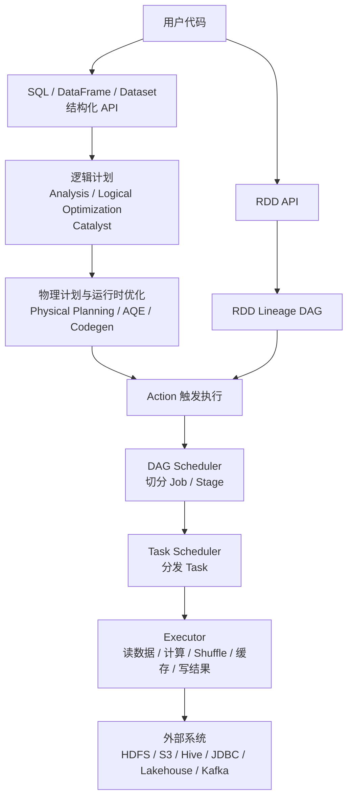
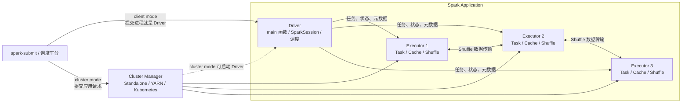
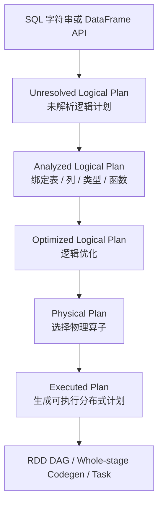
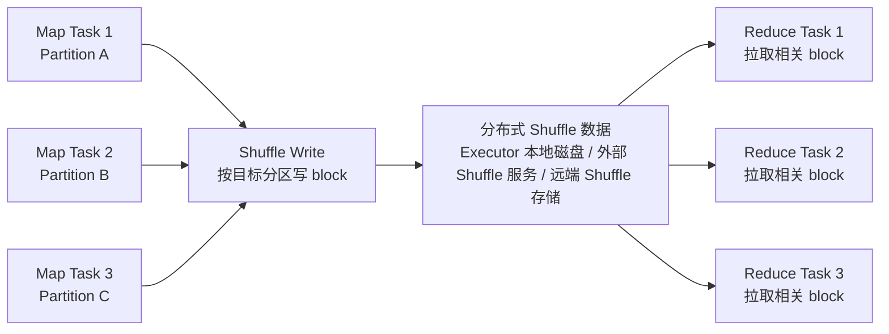

理解 Spark，不能只背 Driver、Executor、RDD、Stage、Task 这些词。真正重要的是看清楚一条主线：

> **Spark 把用户写下的数据处理逻辑转换成分布式执行计划，再按 Shuffle 等执行边界切分成 Stage，把每个 Stage 的数据分区变成 Task，最后调度到 Executor 上并行执行。**

很多 Spark 问题，本质上都是这条链路中的某一环出了问题：Driver 拉回了过多结果，Executor 单个 Task 处理的数据太大，Shuffle 写读过重，Join key 倾斜，缓存挤占了执行内存，或者分区数和资源配置不匹配。

这篇文章按“能写代码、能看 Spark UI、能排查线上问题”的顺序梳理 Spark 核心知识点。它不是 API 清单，而是一张认知地图：先看架构，再看数据抽象，再看执行计划，最后落到 Shuffle、内存、缓存、数据倾斜和调优。

截至 2026-06-02，Apache Spark 官方 `latest` 文档对应 Spark 4.1.2。本文重点讲 Spark 3.x/4.x 中相对稳定的核心模型；具体参数默认值和行为细节仍应以团队实际版本为准。

## 一、先看全貌：Spark 到底是什么？

Apache Spark 是一个通用分布式计算引擎。它不是数据库，也不只是 SQL 工具，而是负责把大规模数据处理逻辑拆成分布式任务，并调度到集群上执行。

Spark 要解决的问题可以概括成四件事：

1. **表达计算**：用 SQL、DataFrame、Dataset 或 RDD 描述数据如何转换。
2. **分布执行**：把大数据集切成多个 Partition，由多个 Task 并行处理。
3. **容错恢复**：通过 lineage、Task retry、Stage retry、缓存重算、checkpoint 等机制处理失败。
4. **性能优化**：通过 Catalyst、AQE、代码生成、缓存、广播、分区策略和资源配置减少不必要的数据移动。



这张图里有两条流：

1. **控制流**：Driver 负责生成计划、切分任务、调度任务、跟踪状态和处理失败。
2. **数据流**：Executor 负责读输入、执行算子、写 Shuffle、拉 Shuffle、缓存中间数据和写出结果。

很多误解来自把这两条流混在一起。Driver 是调度中心，但不是大数据中转站。除非使用 `collect()`、过大的广播表、某些元数据操作或小结果回传，大规模业务数据不应该被拉到 Driver。

## 二、运行架构：Driver、Executor、Cluster Manager

一个 Spark Application 通常由一个 Driver 和多个 Executor 组成，并由外部 Cluster Manager 分配资源。



### 1. Driver：应用的大脑

Driver 是运行用户主程序的进程，也就是创建 `SparkSession` 或 `SparkContext` 的地方。

Driver 的核心职责：

1. 运行用户的 `main` 函数或 Notebook 交互代码。
2. 创建 `SparkSession` / `SparkContext`，连接集群。
3. 构建 RDD lineage、DataFrame 逻辑计划或 SQL 计划。
4. 在 Action 触发时生成 Job。
5. 通过 DAG Scheduler 按 Shuffle 等边界切分 Stage。
6. 通过 Task Scheduler 把 Task 分发给 Executor。
7. 跟踪 Task 状态、重试失败任务、收集少量结果。
8. 维护广播变量、累加器、缓存块位置、Shuffle map 输出位置等元信息。

对 Driver 最重要的提醒是：它是控制中心，不应该承接全量数据。`collect()` 会把结果拉回 Driver，数据量大时很容易造成 Driver OOM。`show()`、`take()`、`limit(...).show()` 也要理解其触发执行和结果回传行为，只是通常结果规模较小。

### 2. Executor：真正干活的进程

Executor 运行在 Worker Node 上，是 Spark Application 的计算进程。

Executor 的核心职责：

1. 执行 Driver 分发来的 Task。
2. 从 HDFS、对象存储、Hive、JDBC、Kafka 等外部系统读取数据。
3. 执行过滤、投影、聚合、Join、排序等算子。
4. 写入和读取 Shuffle 数据。
5. 缓存 RDD/DataFrame 分区数据。
6. 向 Driver 汇报任务状态、指标和失败信息。
7. 将最终结果写入外部存储，或把少量结果返回 Driver。

每个 Executor 通常有多个 CPU core，可以同时运行多个 Task。默认情况下一个 Task 使用 1 个 CPU core；如果配置了 `spark.task.cpus`，单个 Task 会占用更多 core，同一个 Executor 上可并发运行的 Task 数也会相应减少。

| 配置 | 含义 |
| --- | --- |
| `spark.executor.instances` | Executor 数量；动态资源分配开启时可能由框架自动调整 |
| `spark.executor.cores` | 每个 Executor 可并行运行 Task 的 core 数 |
| `spark.task.cpus` | 每个 Task 需要的 CPU core 数，默认是 1 |
| `spark.executor.memory` | Executor JVM heap 大小 |
| `spark.executor.memoryOverhead` | Executor 非堆内存，包含 JVM overhead、native memory、PySpark worker 等 |
| `spark.local.dir` | 本地临时目录，常用于 Shuffle、spill、缓存落盘 |

### 3. Cluster Manager：资源管理者

Cluster Manager 负责资源，不负责业务逻辑。它按部署模式启动或协调 Driver/Executor，分配 CPU 和内存，管理容器或进程生命周期。

常见类型：

| 类型 | 特点 |
| --- | --- |
| Standalone | Spark 自带，部署简单，适合测试、中小集群或专用集群 |
| YARN | Hadoop 生态常用，适合传统大数据平台 |
| Kubernetes | 云原生常用，适合容器化、弹性调度和多租户环境 |

这里容易混淆一个词：Spark Application 是 Driver-Executor 架构；Standalone 集群管理器里才有 Master/Worker 角色。因此，说 Spark 是“Master-Slave 架构”并不够准确，最好直接说 Driver、Executor 和 Cluster Manager。

### 4. Client Mode 与 Cluster Mode

Driver 运行在哪里，由 deploy mode 决定。

| 模式 | Driver 位置 | 适合场景 | 注意点 |
| --- | --- | --- | --- |
| Client Mode | 提交作业的客户端机器 | 本地调试、交互式 Notebook、开发环境 | 客户端必须与 Executor 网络互通，客户端断开可能影响作业 |
| Cluster Mode | 集群内部节点或容器 | 生产批处理、调度平台提交 | 日志通常要到集群平台或 History Server 查看 |

生产批处理一般更偏向 Cluster Mode。调试和交互式分析常见 Client Mode。

## 三、数据抽象：RDD、DataFrame、Dataset、SQL

Spark 的 API 有多个层次。它们不是简单的新旧替代关系，而是适合不同表达方式和优化空间。

### 1. RDD：最底层的弹性分布式数据集

RDD 是 Resilient Distributed Dataset，即弹性分布式数据集。可以理解为一个只读、分区、可并行处理的数据集合。

RDD 的关键特性：

1. **分区**：一个 RDD 由多个 Partition 组成，Partition 是并行计算的基本数据单位。
2. **不可变**：RDD transformation 不会修改原 RDD，而是生成新 RDD。
3. **血缘关系**：RDD 记录自己由哪些父 RDD 通过哪些转换得到。
4. **容错**：某个分区丢失时，Spark 可以根据 lineage 重新计算。
5. **可控性强**：可以控制分区器、缓存级别、底层函数逻辑。

RDD 的优势是灵活，适合处理非结构化数据、复杂对象和需要细粒度控制的场景。缺点是 Spark 很难理解用户函数内部的语义，因此很难做列裁剪、谓词下推、Join 策略选择等优化。

### 2. DataFrame：带 Schema 的分布式表

DataFrame 是按命名列组织的数据集，可以类比关系型数据库表或 Pandas DataFrame，但底层是分布式执行。

DataFrame 的优势：

1. 有 Schema，Spark 能理解字段名和类型。
2. 能进入 Spark SQL 优化器，做逻辑计划和物理计划优化。
3. 能利用列式存储、列裁剪、谓词下推、代码生成等优化。
4. Python、Scala、Java、R 都支持。

“DataFrame 是带 Schema 的 RDD”是一个入门类比，但不够准确。现代 Spark 中，DataFrame 更准确地说是以逻辑计划为核心的结构化 API。在 Scala/Java 中，DataFrame 本质上是 `Dataset[Row]`。

### 3. Dataset：类型安全的结构化 API

Dataset 主要用于 Scala 和 Java。它结合了 RDD 的强类型对象操作和 Spark SQL 的优化执行能力。

Dataset 的特点：

1. 支持编译期类型检查。
2. 可以用 `map`、`flatMap`、`filter` 等函数式操作。
3. 也能利用 Spark SQL 的优化执行引擎。
4. Python 没有真正等价的 Dataset API，PySpark 日常主要使用 DataFrame。

### 4. Spark SQL：声明式表达结构化计算

Spark SQL 允许直接用 SQL 表达过滤、聚合、Join、窗口函数等逻辑。

```sql
SELECT
  dt,
  province,
  SUM(amount) AS gmv
FROM orders
WHERE status = 'paid'
GROUP BY dt, province;
```

SQL 的优势是贴近数据语义，适合分析、报表、ETL 和跨团队协作。很多生产 Spark 作业的核心逻辑就是 SQL，外围再用 Python、Scala 或 Java 负责参数、调度和输入输出。

## 四、惰性求值：Spark 为什么不是写一行算一行

Spark 的算子大致分为两类：Transformation 和 Action。

### 1. Transformation：只描述，不立刻算

Transformation 会返回新的 RDD/DataFrame/Dataset，但不会立刻触发完整计算。

常见 Transformation：

| API 类型 | 常见算子 |
| --- | --- |
| RDD | `map`、`flatMap`、`filter`、`mapPartitions`、`reduceByKey`、`join` |
| DataFrame/Dataset | `select`、`where`、`filter`、`withColumn`、`groupBy`、`agg`、`join`、`orderBy` |

示例：

```python
orders = spark.read.parquet("/warehouse/orders")
paid = orders.where("status = 'paid'")
daily = paid.groupBy("dt").count()
```

这几行代码主要是在 Driver 上构建计划，不会立刻扫描完整数据。不过“惰性”不是绝对不做任何 I/O。读取表元数据、列出文件、推断 schema 等轻量动作仍然可能发生。

### 2. Action：触发真正执行

Action 会触发 Spark 提交 Job。

常见 Action：

| API 类型 | 常见算子 |
| --- | --- |
| RDD | `count`、`collect`、`take`、`first`、`reduce`、`saveAsTextFile`、`foreach` |
| DataFrame/Dataset | `show`、`count`、`collect`、`take`、`first`、`foreach`、`write.save`、`write.parquet`、`write.insertInto` |

注意，`df.write` 本身只是构造 `DataFrameWriter`，真正触发执行的是 `save`、`parquet`、`orc`、`insertInto` 等写出方法。

### 3. 惰性求值的意义

惰性求值的意义不是“偷懒”，而是给优化器留下空间：

1. Spark 可以看到完整计算链，再统一优化。
2. 多个窄依赖算子可以合并成一个 pipeline。
3. DataFrame/SQL 可以做列裁剪、谓词下推、常量折叠、投影合并等优化。
4. 不必要的中间结果可以不物化。
5. 缓存可以等第一次 Action 触发时再计算并存储。

## 五、DataFrame/SQL 执行计划：Catalyst 与 AQE

RDD API 主要形成 lineage DAG；DataFrame 和 SQL 会进入 Spark SQL 的计划体系。



### 1. Catalyst 做什么

Catalyst 是 Spark SQL 的查询优化器。它大致做这些事：

1. **解析**：把 SQL 文本解析成语法树和逻辑计划。
2. **分析**：解析表名、列名、函数、类型，检查字段是否存在。
3. **逻辑优化**：重写逻辑计划。
4. **物理计划选择**：选择 Join、聚合、排序、扫描等物理算子。
5. **代码生成**：在部分场景下生成更高效的 JVM 字节码执行表达式。

常见逻辑优化：

| 优化 | 含义 |
| --- | --- |
| Predicate Pushdown | 把过滤条件尽量下推到数据源或更靠前的位置 |
| Column Pruning | 只读取和计算需要的列 |
| Constant Folding | 常量表达式提前计算 |
| Projection Pushdown | 把列选择下推到扫描阶段 |
| Filter Reorder | 重排过滤条件 |
| Limit Pushdown | 把 limit 尽可能下推 |

### 2. 常见物理 Join 策略

Spark SQL 会根据数据大小、统计信息、配置和 Hint 选择 Join 策略。

| Join 策略 | 适用场景 | 特点 |
| --- | --- | --- |
| Broadcast Hash Join | 一边表较小 | 小表广播到各 Executor，避免大表 Shuffle |
| Sort Merge Join | 两边都较大 | 双方按 key Shuffle 并排序，通用但开销较大 |
| Shuffle Hash Join | 一边相对较小且适合构建 hash table | 需要 Shuffle，部分场景比 Sort Merge 快 |
| Broadcast Nested Loop Join | 非等值 Join 或特殊场景 | 可能很贵，要谨慎 |

生产中常见经验：

1. 小维表 Join 大事实表，优先考虑 Broadcast Join。
2. 统计信息不准时，优化器可能选错计划，需要 `ANALYZE TABLE` 或使用 Hint。
3. 大表 Join 大表时，重点关注 Join key 分布、Shuffle 分区数和数据倾斜。

### 3. AQE：运行时自适应优化

AQE 是 Adaptive Query Execution。它会利用运行时统计信息，在查询执行过程中重新优化计划。

常见能力：

1. 合并过小的 Shuffle 分区，减少小 Task。
2. 发现倾斜分区并拆分，降低长尾 Task。
3. 在运行时把 Sort Merge Join 转换成 Broadcast Hash Join。
4. 根据实际数据量调整部分执行策略。

常见配置：

| 配置 | 含义 |
| --- | --- |
| `spark.sql.adaptive.enabled` | 是否开启 AQE，Spark 3.2 起默认开启 |
| `spark.sql.adaptive.coalescePartitions.enabled` | 是否合并 Shuffle 后小分区 |
| `spark.sql.adaptive.skewJoin.enabled` | 是否启用倾斜 Join 优化 |
| `spark.sql.adaptive.advisoryPartitionSizeInBytes` | AQE 目标分区大小参考值 |

AQE 很有用，但不能替代正确的数据建模、分区设计和 Join key 选择。它能缓解一部分问题，不能把明显倾斜或错误的计算模型自动变好。

## 六、依赖关系：窄依赖、宽依赖与 Stage 切分

Spark 的执行边界主要由依赖关系决定。

### 1. 窄依赖

窄依赖指父 RDD 的每个分区最多被子 RDD 的一个分区使用。

常见窄依赖：

1. `map`
2. `filter`
3. `flatMap`
4. `mapPartitions`
5. 不改变分区方式的 `select` / `where`

窄依赖的特点：

1. 数据通常不需要跨节点重新分发。
2. 多个窄依赖算子可以合并成 pipeline。
3. 一个 Task 可以在同一分区上连续执行多步计算。

### 2. 宽依赖

宽依赖指父 RDD 的一个分区可能被多个子分区使用，通常需要 Shuffle。

常见宽依赖：

1. `groupByKey`
2. `reduceByKey`
3. `join`
4. `distinct`
5. `repartition`
6. `orderBy` / `sortBy`
7. DataFrame 的 `groupBy().agg()`、大表 Join、全局排序

宽依赖的特点：

1. 数据需要按 key 或分区规则重新分布。
2. 会产生 Stage 边界。
3. 通常伴随网络、磁盘、序列化和内存开销。

### 3. Job、Stage、Task

当一个 Action 触发时，Spark 会生成一个或多个 Job。一个 Job 会被切分成多个 Stage。每个 Stage 再被拆成多个 Task。

| 层级 | 含义 | 触发或决定因素 |
| --- | --- | --- |
| Application | 一个 Spark 应用 | 一次 `spark-submit`、一个 Notebook SparkContext 等 |
| Job | 一次 Action 触发的并行计算 | `count`、`collect`、`write`、`show` 等 |
| Stage | Job 中一组可流水线执行的 Task | Shuffle 边界、部分执行边界 |
| Task | 发到 Executor 的最小执行单元 | 通常由当前 Stage 的分区数决定 |
| Task Attempt | Task 的一次尝试 | 失败重试或推测执行会产生多个 attempt |

可以先用一个简化模型记住它：

1. 一个 Action 通常至少产生一个 Job。
2. 遇到 Shuffle，Job 会被切成多个 Stage。
3. Stage 的 Task 数通常等于该 Stage 要处理的分区数。
4. Task 是调度到 Executor 上运行的最小单位。

但不要把“Stage 数等于 Shuffle 次数加一”当成严格公式。实际 Stage 切分还会受到多个依赖分支、缓存、AQE、失败重试等因素影响。

## 七、Shuffle：Spark 性能问题的高发区

Shuffle 是 Spark 在分布式节点之间重新分发数据的过程。它经常出现在聚合、Join、去重、重分区和排序中。



### 1. Shuffle 为什么贵

Shuffle 代价高，是因为它同时消耗多种资源：

1. **CPU**：序列化、反序列化、排序、压缩、聚合。
2. **内存**：map side combine、聚合 hash table、排序 buffer。
3. **磁盘**：Shuffle write、spill、临时文件。
4. **网络**：reduce side 从多个 Executor 拉取数据。
5. **调度**：后续 Stage 必须等待前序 Shuffle map 输出完成到一定程度。

典型链路：

```text
读取输入分区
-> 按 key 或分区规则计算目标分区
-> 内存中聚合或排序
-> 内存不足时 spill 到磁盘
-> map task 输出 shuffle block
-> reduce task 通过网络拉取 block
-> 反序列化、聚合、排序或 Join
```

### 2. 常见触发 Shuffle 的操作

| 操作 | 是否 Shuffle | 说明 |
| --- | --- | --- |
| `map` / `filter` | 通常不触发 | 窄依赖 |
| `reduceByKey` | 触发 | 但可以 map side combine，通常优于 `groupByKey` |
| `groupByKey` | 触发 | 容易产生大量数据移动和内存压力 |
| `join` | 通常触发 | Broadcast Join 可避免大表一侧 Shuffle |
| `distinct` | 触发 | 本质需要按值去重 |
| `repartition` | 触发 | 全量重分区 |
| `coalesce` | 通常不触发 | DataFrame/Dataset `coalesce` 是窄依赖；RDD API 可用 `coalesce(n, shuffle=true)` 主动触发 Shuffle |
| `orderBy` | 触发 | 全局排序需要重分布 |

### 3. Shuffle 调优原则

1. 能避免 Shuffle 就避免，例如用 Broadcast Join 替代大表 Shuffle Join。
2. 能减少 Shuffle 数据量就提前减少，例如先过滤、列裁剪、预聚合。
3. 能在 map side 聚合就不要把原始明细全发到 reduce side。
4. 大表聚合优先用 `reduceByKey` / `aggregateByKey`，避免不必要的 `groupByKey`。
5. 合理设置 `spark.sql.shuffle.partitions`，默认 200 不一定适合所有数据量。
6. 开启并观察 AQE，让 Spark 运行时合并小分区、处理部分倾斜。
7. 关注 `Shuffle Read Size`、`Shuffle Write Size`、`Spill`、`Fetch Wait Time`、`GC Time`。

## 八、分区：并行度、Task 数和数据分布

Partition 是 Spark 并行计算的基本数据单位。每个 Stage 的 Task 数通常与该 Stage 的分区数相关。

### 1. 分区数太少的问题

1. 并行度不足，集群资源闲置。
2. 单个 Task 数据量过大，容易慢或 OOM。
3. Shuffle 后 reduce task 压力大。

### 2. 分区数太多的问题

1. Task 数量太多，调度开销变大。
2. 小文件增多，影响下游读写效率。
3. 每个 Task 处理数据太少，整体效率下降。

### 3. `repartition` 与 `coalesce`

| 方法 | 是否 Shuffle | 适合场景 |
| --- | --- | --- |
| `repartition(n)` | 是 | 增加分区、重新打散数据、缓解分布不均 |
| `coalesce(n)` | 否，窄依赖 | 减少分区，常用于写出前减少小文件；如果减少得太狠，可能让后续计算集中到少数节点 |
| RDD `coalesce(n, shuffle=true)` | 是 | RDD API 中减少分区但希望重新均衡数据；DataFrame/Dataset 通常用 `repartition(n)` 获得 Shuffle |

经验上，分区数不是越多越好。要结合数据量、Executor cores、Task 耗时、Shuffle 指标和输出文件数量来调整。理想 Task 耗时没有固定标准，但通常要避免大量毫秒级小 Task，也要避免少数跑很久的长尾 Task。

## 九、内存管理：Execution 与 Storage 的动态博弈

Spark Executor 的内存不只是一块“缓存空间”。它要同时支撑任务执行、Shuffle、排序、聚合、缓存、用户对象、Spark 元数据以及 JVM 自身开销。

### 1. Executor 内存组成

生产环境里要区分：

| 区域 | 含义 |
| --- | --- |
| JVM Heap | `spark.executor.memory`，Spark 执行内存和存储内存主要在这里管理 |
| Memory Overhead | JVM 非堆、native memory、PySpark worker、容器额外开销等 |
| Off-heap Memory | 开启 `spark.memory.offHeap.enabled` 后使用的堆外内存 |
| 本地磁盘 | Shuffle、spill、缓存落盘、临时文件 |

对于 PySpark，要特别关注 memory overhead，因为 Python worker 进程不完全在 JVM heap 内。

### 2. Unified Memory

Spark 使用统一内存管理模型。核心区域是 Unified Memory，包含：

1. **Execution Memory**：用于 Shuffle、Join、Sort、Aggregation 等执行过程。
2. **Storage Memory**：用于缓存 RDD/DataFrame、广播变量等。

默认情况下：

1. `spark.memory.fraction = 0.6`，表示 Unified Memory 大约是 `(JVM heap - 300MiB) * 0.6`。
2. 剩余部分用于用户数据结构、Spark 内部元数据和防止异常大记录导致 OOM。
3. `spark.memory.storageFraction = 0.5`，表示 Unified Memory 中有一部分区域作为 Storage 的保护区。

所以，“统一内存约 60%、用户内存约 25%、预留内存 300MB”可以帮助入门，但更准确的说法是：

> **Spark 会先从 JVM heap 中扣除约 300MiB reserved memory，再用 `spark.memory.fraction` 决定统一内存区域；统一内存外的剩余空间并不是固定业务对象区，而是用于用户对象、Spark 元数据以及 OOM 缓冲。**

### 3. Execution 与 Storage 谁能抢谁

可以这样理解：

1. Execution 和 Storage 共享 Unified Memory。
2. 没有 Execution 压力时，Storage 可以使用更多空间缓存数据。
3. Execution 空间不足时，可以驱逐部分 Storage 缓存块，让计算继续执行。
4. Storage 不能反过来强行驱逐 Execution。
5. Storage 有一块保护区域，落在保护区内的缓存块不会被 Execution 驱逐。

这解释了为什么有时 `.cache()` 了，后面仍然会看到缓存命中率不高：缓存可能因为 Execution 压力、内存不足或 LRU 策略被驱逐。

### 4. 常见内存问题

| 问题 | 常见原因 | 处理方向 |
| --- | --- | --- |
| Driver OOM | `collect` 太大、广播表过大、元数据过多 | 避免拉全量、增大 driver memory、限制结果大小 |
| Executor OOM | 单 Task 数据过大、Join/聚合倾斜、缓存过多 | 增加分区、处理倾斜、调整缓存、增大 executor memory/overhead |
| GC 时间过高 | Java 对象过多、缓存反序列化对象过大 | 使用 DataFrame、序列化缓存、减少对象创建、调整 executor 大小 |
| Spill 过多 | Execution memory 不足、Shuffle 数据量大 | 减少 Shuffle、增加分区、增大内存、优化聚合和 Join |
| PySpark worker OOM | Python 进程内存超出 overhead | 增大 `memoryOverhead` 或 `spark.executor.pyspark.memory`，减少 UDF 数据量 |

## 十、缓存与持久化：`cache`、`persist`、`unpersist`

缓存用于避免同一份中间结果被多次从头计算。

### 1. 缓存不是立刻发生的

```python
df_cached = df.where("status = 'paid'").cache()

# 这里还没有真正缓存完整数据
df_cached.count()

# 第一次 Action 后，计算结果才会被物化并缓存
df_cached.groupBy("dt").count().show()
```

`.cache()` 或 `.persist()` 只是打标记。第一次 Action 计算到该数据集时，Spark 才会把对应分区存起来。

### 2. `cache` 与 `persist`

| 方法 | 含义 |
| --- | --- |
| `cache()` | 使用默认 StorageLevel 的简写 |
| `persist(level)` | 显式指定存储级别 |
| `unpersist()` | 释放缓存 |

默认级别要区分 API：

1. RDD 的 `cache()` 默认是 `MEMORY_ONLY`。
2. PySpark DataFrame 的 `cache()` 默认是 `MEMORY_AND_DISK_DESER`，Spark 3.0 起与 Scala 默认保持一致。
3. Spark SQL 缓存表/DataFrame 时，会使用内存列式格式，并可自动压缩以降低内存和 GC 压力。

### 3. 常见 StorageLevel

| 级别 | 含义 | 适合场景 |
| --- | --- | --- |
| `MEMORY_ONLY` | 只放内存，放不下的分区下次重算 | RDD 默认，数据能放进内存且计算不贵 |
| `MEMORY_AND_DISK` | 内存放不下则落磁盘 | 计算成本高、不希望频繁重算 |
| `MEMORY_ONLY_SER` | 序列化后放内存，Java/Scala 常用 | 降低内存占用，牺牲一些 CPU |
| `MEMORY_AND_DISK_SER` | 序列化后放内存，不够落磁盘 | 内存紧张且重算成本高 |
| `DISK_ONLY` | 只放磁盘 | 内存很紧张但中间结果复用明显 |
| `_2` 后缀 | 保存两份副本 | 需要更快失败恢复，但成本更高 |
| `OFF_HEAP` | 使用堆外内存 | 需要开启 off-heap 配置，使用门槛更高 |

PySpark RDD 的对象存储语义要单独看：Python 对象会通过 Pickle 序列化，部分 Java/Scala 中的 `_SER` 级别不以同样方式暴露。PySpark DataFrame 则走 Spark SQL/DataFrame 的缓存语义，默认级别以对应版本 API 文档为准。

### 4. 什么时候应该缓存

应该缓存：

1. 同一 DataFrame/RDD 被多个 Action 复用。
2. 同一中间结果被多个下游分支复用。
3. 上游计算很贵，例如复杂 Join、聚合、解析、UDF。
4. 交互式分析需要反复查询同一份数据。

不建议缓存：

1. 只使用一次的数据。
2. 数据太大，缓存会挤压 Execution memory，导致 Shuffle 频繁 spill。
3. 上游计算很便宜，重算比读缓存更划算。
4. 缓存后忘记 `unpersist()`，长作业里占住内存。

## 十一、闭包、广播变量与累加器

### 1. Driver 代码与 Executor 代码

判断代码在哪里执行，可以看它是否位于分布式算子的闭包中。

Driver 上执行：

```python
threshold = 100
print("start job")
df.count()
```

Executor 上执行：

```python
rdd.map(lambda x: x + 1)
rdd.foreach(lambda x: write_to_external_system(x))
```

规则：

1. 算子外部的普通代码在 Driver 上执行。
2. 传给 `map`、`filter`、`foreach`、`mapPartitions` 等算子的函数会被序列化后发到 Executor。
3. Executor 修改 Driver 本地变量不会可靠地反映回 Driver。
4. 需要跨 Task 统计时用 Accumulator。
5. 需要把只读大对象发给多个 Task 时用 Broadcast。

### 2. Broadcast Variable

广播变量用于把只读数据高效分发到 Executor，避免每个 Task 重复携带一份。

适合：

1. 小维表、本地字典、规则表。
2. 多个 Stage 复用的只读对象。
3. 不方便通过 DataFrame Broadcast Join 表达的 RDD 场景。

注意：

1. 广播对象不能太大，否则会压垮 Driver 或 Executor 内存。
2. 广播变量是只读语义，不要在 Executor 中修改。
3. DataFrame 小表 Join 通常优先使用 `broadcast(df)` 或 SQL Hint。

### 3. Accumulator

累加器用于从 Executor 向 Driver 汇总计数、求和等信息。

适合：

1. 统计脏数据条数。
2. 统计解析失败次数。
3. 采集简单指标。

注意：

1. Task 失败重试可能导致累加器更新语义变复杂。
2. 不要把累加器当业务数据结果存储。
3. 对精确业务结果，优先用 DataFrame/RDD 聚合计算。

## 十二、容错机制：Spark 如何从失败中恢复

分布式计算默认要接受失败。Spark 的容错机制主要包括五类。

### 1. RDD Lineage 重算

RDD 不一定保存所有数据，但会保存如何从父 RDD 计算出来的血缘关系。某个分区丢失时，Spark 可以沿 lineage 只重算丢失分区。

### 2. Task Retry

Task 失败后，Spark 会在同一个或其他 Executor 上重试。常见原因包括：

1. Executor 进程退出。
2. 读取远端 Shuffle block 失败。
3. 用户代码异常。
4. 临时网络问题。

如果同一个 Task 多次失败，Stage 可能失败，最终 Job 失败。

### 3. Stage Retry

Shuffle map 输出丢失时，下游 reduce task 可能报 `FetchFailed`。Spark 会重新运行相关 map stage，重新生成丢失的 Shuffle block。

### 4. Cache 与 Persist 的容错

缓存丢失不是数据丢失。缓存块如果被驱逐或所在 Executor 丢失，Spark 可以根据 lineage 重算。

### 5. Checkpoint

Checkpoint 会把数据写到可靠存储，截断 lineage。适合：

1. lineage 很长，重算成本高。
2. 迭代算法。
3. 流处理状态或部分需要可靠恢复的场景。

`cache` 是性能优化，`checkpoint` 更偏容错和截断 lineage，两者不要混为一谈。

## 十三、日志与 Spark UI：线上问题怎么定位

Spark 排查要同时看 Driver 日志、Executor 日志和 Spark UI。

### 1. Driver 日志看什么

Driver 日志适合看：

1. 应用启动失败。
2. 依赖包、配置、权限、认证问题。
3. SQL 解析或 AnalysisException。
4. Job/Stage 失败的总体原因。
5. 哪个 Stage、哪个 Task、哪个 Executor 失败。
6. Driver OOM、`collect` 结果过大。

常见 Driver 报错：

```text
Job aborted due to stage failure
Task not serializable
AnalysisException
OutOfMemoryError: Java heap space
Total size of serialized results is bigger than spark.driver.maxResultSize
```

### 2. Executor 日志看什么

Executor 日志适合看：

1. Task 内部真实异常。
2. 数据质量导致的解析失败、空指针、类型转换错误。
3. Executor OOM。
4. Python worker 异常。
5. Shuffle fetch、网络、磁盘问题。
6. GC 日志和线程栈。

常见 Executor 报错：

```text
java.lang.OutOfMemoryError: Java heap space
ExecutorLostFailure
FetchFailedException
PythonException
NullPointerException
NumberFormatException
No space left on device
```

### 3. Spark UI 重点看哪些 Tab

| Tab | 重点 |
| --- | --- |
| Jobs | Action 触发了哪些 Job，整体耗时和失败原因 |
| Stages | Stage DAG、Task 分布、长尾 Task、Shuffle、spill、失败 Task |
| SQL | SQL/DataFrame 的逻辑计划、物理计划、SQL 指标 |
| Executors | Executor 内存、磁盘、Task、GC、Shuffle read/write、失败情况 |
| Storage | 缓存数据大小、缓存比例、内存/磁盘占用 |
| Environment | Spark 配置、JVM 参数、classpath、系统环境 |

### 4. 一条实用排查路径

1. 先看 Driver 日志，确认失败的 Job、Stage、Task 和 Executor。
2. 打开 Spark UI 的 failed Stage，查看失败 Task 的错误摘要。
3. 对比该 Stage 的 Task duration、input size、shuffle read/write、spill，判断是否长尾或倾斜。
4. 找到对应 Executor 日志，看最底层异常栈。
5. 如果是 SQL/DataFrame，打开 SQL Tab 看物理计划和 Join 策略。
6. 如果是内存问题，看 Executors Tab 的 GC、spill、storage memory 和失败 Executor。
7. 如果是 Shuffle 问题，看 FetchFailed、shuffle read block、网络等待和本地磁盘空间。

## 十四、数据倾斜：大数据作业的长尾来源

数据倾斜指数据在 key 或分区上的分布极不均匀，导致少数 Task 处理远多于其他 Task 的数据。

### 1. 常见表现

1. 大多数 Task 很快完成，少数 Task 跑很久。
2. 某个 reduce task 的 shuffle read size 明显大于其他 Task。
3. 某些 Executor OOM 或频繁 GC。
4. Stage 卡在 99% 很久。
5. 重试后仍然在同类 Task 上失败。

### 2. 常见原因

1. 热点 key，例如爆款商品、默认城市、未知用户、空值 key。
2. Join key 分布不均。
3. `groupByKey` 把同一 key 的所有明细聚到一个 Task。
4. 分区字段选择不合理。
5. 上游数据已经严重不均衡。

### 3. 定位方法

先从 Spark UI 看 Stage 的 Task duration 分布，再看每个 Task 的 Shuffle Read Size 是否极不均匀。然后对 Join/Aggregation key 做抽样统计：

```python
df.groupBy("join_key").count().orderBy("count", ascending=False).show(20)
```

还要单独统计空值、默认值、特殊值。很多线上倾斜不是业务主 key 本身，而是异常值把大量数据挤到了同一个 key。

### 4. 解决方法

| 方法 | 适用场景 | 思路 |
| --- | --- | --- |
| 过滤或单独处理异常 key | 空值、默认值、无业务意义 key | 避免无意义热点参与 Shuffle |
| Broadcast Join | 一侧表足够小 | 小表广播到 Executor，避免大表 Shuffle |
| Salting 加盐 | 少数 key 特别热 | 给热点 key 加随机前缀打散，再二次聚合 |
| 两阶段聚合 | 大聚合、热点 key | 先局部聚合再全局聚合 |
| AQE Skew Join | Spark SQL Join 倾斜 | 让 Spark 运行时拆分倾斜分区 |
| 调整分区数 | 每个分区普遍过大 | 增大并行度，降低单 Task 数据量 |
| 优化 Join key | key 设计不合理 | 选择更均匀、更有业务意义的 key |

只调大 `spark.sql.shuffle.partitions` 不能根治极端热点 key。它能降低平均分区大小，但如果 90% 数据都属于同一个 key，这个 key 仍然可能落到一个或少数分区。

## 十五、常见性能优化清单

### 1. 读取侧优化

1. 优先使用 Parquet/ORC 等列式格式。
2. 只读取需要的列，避免 `select *`。
3. 尽量让过滤条件命中分区裁剪和谓词下推。
4. 控制小文件数量，避免大量小 Task 和文件打开成本。
5. 合理设置文件扫描分区大小，例如 `spark.sql.files.maxPartitionBytes`。

### 2. Transformation 优化

1. 尽早过滤无用数据。
2. 尽早裁剪无用列。
3. 避免在大数据量上使用高开销 UDF。
4. Python UDF 慎用，优先使用 Spark SQL 内置函数。
5. 多次复用的复杂中间结果才缓存。

### 3. Join 优化

1. 小表 Join 大表优先 Broadcast Join。
2. 大表 Join 大表时重点检查 Join key 分布。
3. 维护统计信息，让优化器更容易选对计划。
4. 必要时使用 Join Hint，但不要滥用。
5. 关注是否发生笛卡尔积或非等值 Join。

### 4. Shuffle 优化

1. 减少进入 Shuffle 的数据量。
2. 使用 map side combine 能力，例如 `reduceByKey` 优于 `groupByKey`。
3. 合理设置 `spark.sql.shuffle.partitions`。
4. 开启并观察 AQE。
5. 处理数据倾斜，而不是只盲目加资源。

### 5. 缓存优化

1. 只缓存会复用的数据。
2. 缓存后用 Action 物化。
3. 使用后及时 `unpersist()`。
4. 通过 Storage Tab 观察缓存是否真正命中。
5. 内存不足时考虑序列化缓存或降低缓存数据量。

### 6. 写出侧优化

1. 控制输出文件数量，避免小文件爆炸。
2. 写出前根据目标文件大小合理 `coalesce` 或 `repartition`。
3. 分区字段不要选择过高基数或严重倾斜字段。
4. 动态分区写入要注意分区数量和元数据压力。
5. 避免单分区写出超大文件。

### 7. 资源配置优化

1. Executor core 不宜盲目过大，否则单 Executor 内并发 Task 太多，内存和 GC 压力升高。
2. Executor memory 不是越大越好，过大 heap 可能带来更长 GC。
3. PySpark 作业要重点配置 memory overhead。
4. Shuffle 重的作业要保证本地磁盘容量和 I/O。
5. 动态资源分配适合资源共享集群，但要关注 Executor 回收对缓存和 Shuffle 的影响。

## 十六、用一段 PySpark 作业串起来

以一个典型日报作业为例：

```python
from pyspark.sql import SparkSession
from pyspark.sql.functions import broadcast, col, sum as sum_

spark = SparkSession.builder.appName("daily-province-gmv").getOrCreate()

orders = spark.read.parquet("/warehouse/orders")
cities = spark.read.parquet("/warehouse/dim_cities")

report = (
    orders
    .where(col("status") == "paid")
    .select("dt", "city_id", "amount")
    .join(broadcast(cities.select("city_id", "province")), "city_id")
    .groupBy("dt", "province")
    .agg(sum_("amount").alias("gmv"))
)

(
    report.write
    .mode("overwrite")
    .partitionBy("dt")
    .parquet("/warehouse/reports/daily_province_gmv")
)
```

这段代码可以这样拆：

1. `read.parquet` 构建读取计划，可能读取元数据，但不会立即完整扫描数据。
2. `where` 和 `select` 是 Transformation，会进入逻辑计划。
3. `broadcast(cities...)` 给优化器 Join 策略提示，倾向于广播城市维表。
4. `groupBy(...).agg(...)` 会触发按 `dt, province` 的 Shuffle 聚合。
5. `write.parquet(...)` 是 Action，真正提交 Job。
6. Spark 会在 SQL Tab 中展示物理计划，例如扫描、过滤、广播、聚合、Exchange、写出。
7. 如果城市表广播成功，可以避免订单表和城市表的双边 Shuffle Join。
8. 最终按 `dt` 分区写出，输出文件数受上游分区数、AQE 和写出逻辑影响。

如果这段作业慢，排查顺序通常是：

1. 看 SQL Tab，确认 Join 是否广播成功，是否出现大规模 Sort Merge Join。
2. 看 Stages Tab，确认 Shuffle Read/Write、Spill 和长尾 Task。
3. 看 key 分布，确认 `city_id` 或 `province` 是否倾斜。
4. 看 Executors Tab，确认是否有 Executor OOM、GC 过高、磁盘空间不足。
5. 看输出目录，确认是否产生大量小文件。

## 十七、常见误区

### 1. “Spark 就是 Master-Slave 架构”

更准确地说，Spark Application 是 Driver-Executor 架构；Standalone 集群管理器里才有 Master/Worker 角色。

### 2. “DataFrame 就是 RDD 加了 Schema”

这是入门类比。更准确地说，DataFrame 是结构化逻辑计划，能进入 Catalyst 优化器。

### 3. “Transformation 完全不会读任何东西”

大多数 Transformation 不会触发完整数据计算，但某些读取动作可能会访问元数据，例如推断 schema、列出文件、读取表元信息。

### 4. “Cache 了就一定在内存里”

缓存只是标记，第一次 Action 才物化；物化后也可能因为内存不足被驱逐，或部分分区落磁盘。

### 5. “加 Executor 就一定更快”

如果瓶颈是数据倾斜、单 Task 过大、外部存储吞吐、Driver 调度、GC 或小文件，单纯加 Executor 可能效果很差，甚至让外部系统压力更大。

### 6. “`collect()` 只是看一下数据”

`collect()` 会把所有结果拉到 Driver。调试时优先用 `show()`、`take()`、`limit(...).show()` 这类结果规模可控的方式。

## 十八、学习 Spark 的一条路线

建议按这个顺序学习：

1. 先理解 Driver、Executor、Cluster Manager。
2. 再理解 Partition、Task、Job、Stage。
3. 然后掌握 Transformation、Action、Lazy Evaluation。
4. 接着重点学习 Shuffle、宽窄依赖、Join 和聚合。
5. 写 Spark SQL/DataFrame 时学习 Catalyst、物理计划和 AQE。
6. 能看 Spark UI 后，再系统学习缓存、内存、GC、资源配置。
7. 最后把数据倾斜、小文件、Broadcast、分区设计、故障排查串起来。

如果只记 API，Spark 会显得很碎；如果抓住“计划如何生成、数据如何移动、任务如何切分、失败如何恢复”这条主线，很多问题就能归位。

## 术语表

| 术语 | 解释 |
| --- | --- |
| Spark Application | 一个 Spark 应用，由 Driver 和一组 Executor 组成 |
| Driver | 运行主程序、生成执行计划并调度任务的进程 |
| Executor | 运行在工作节点上执行 Task、缓存数据、处理 Shuffle 的进程 |
| Cluster Manager | 资源管理系统，如 Standalone、YARN、Kubernetes |
| SparkSession | Spark 2.x 后统一入口，封装 SQL、DataFrame、SparkContext 等能力 |
| SparkContext | Spark Core 入口，负责连接集群和创建 RDD 等 |
| RDD | 弹性分布式数据集，Spark 底层分布式集合抽象 |
| DataFrame | 带命名列和 Schema 的结构化分布式数据集 |
| Dataset | Scala/Java 中支持强类型的结构化 API |
| Partition | 数据分区，Spark 并行处理的基本数据单位 |
| Transformation | 转换算子，描述计算但不立即执行 |
| Action | 行动算子，触发 Job 执行 |
| Lazy Evaluation | 惰性求值，Spark 先记录计算计划，等 Action 再执行 |
| Lineage | RDD 血缘关系，用于描述数据如何由父 RDD 转换而来 |
| DAG | 有向无环图，用于表示计算依赖关系 |
| Job | 一次 Action 触发的并行计算 |
| Stage | Job 中按 Shuffle 边界切分出的执行阶段 |
| Task | 发给 Executor 执行的最小工作单元 |
| Shuffle | 按 key 或分区规则跨节点重新分发数据的过程 |
| Narrow Dependency | 窄依赖，父分区最多被一个子分区使用 |
| Wide Dependency | 宽依赖，父分区可能被多个子分区使用，通常触发 Shuffle |
| Catalyst | Spark SQL 查询优化器 |
| AQE | Adaptive Query Execution，自适应查询执行 |
| Broadcast Join | 把小表广播到 Executor，避免大表 Shuffle 的 Join 策略 |
| Spill | 内存不足时把中间数据写到磁盘 |
| StorageLevel | Spark 缓存/持久化级别 |
| Checkpoint | 将中间结果写入可靠存储以截断 lineage 的机制 |
| Data Skew | 数据倾斜，少数 key 或分区数据量远大于其他分区 |
| Salting | 加盐，通过给热点 key 添加随机前缀打散数据 |
| Spark UI | Spark Web UI，用于查看 Job、Stage、SQL、Executor、Storage 等信息 |
| History Server | 基于事件日志查看已结束 Spark 应用 Web UI 的服务 |

## 参考文献

1. Apache Spark Documentation: [Overview](https://spark.apache.org/docs/latest/)
2. Apache Spark Documentation: [Cluster Mode Overview](https://spark.apache.org/docs/latest/cluster-overview.html)
3. Apache Spark Documentation: [RDD Programming Guide](https://spark.apache.org/docs/latest/rdd-programming-guide.html)
4. Apache Spark Documentation: [Spark SQL, DataFrames and Datasets Guide](https://spark.apache.org/docs/latest/sql-programming-guide.html)
5. Apache Spark Documentation: [Spark SQL Performance Tuning](https://spark.apache.org/docs/latest/sql-performance-tuning.html)
6. Apache Spark Documentation: [Tuning Spark](https://spark.apache.org/docs/latest/tuning.html)
7. Apache Spark Documentation: [Configuration](https://spark.apache.org/docs/latest/configuration.html)
8. Apache Spark Documentation: [Monitoring and Instrumentation](https://spark.apache.org/docs/latest/monitoring.html)
9. PySpark API Reference: [pyspark.sql.DataFrame.cache](https://spark.apache.org/docs/latest/api/python/reference/pyspark.sql/api/pyspark.sql.DataFrame.cache.html)
10. PySpark API Reference: [pyspark.sql.DataFrame.coalesce](https://spark.apache.org/docs/latest/api/python/reference/pyspark.sql/api/pyspark.sql.DataFrame.coalesce.html)
11. PySpark API Reference: [pyspark.sql.DataFrame.repartition](https://spark.apache.org/docs/latest/api/python/reference/pyspark.sql/api/pyspark.sql.DataFrame.repartition.html)
12. Michael Armbrust et al., SIGMOD 2015: [Spark SQL: Relational Data Processing in Spark](https://amplab.cs.berkeley.edu/publication/spark-sql-relational-data-processing-in-spark/)
