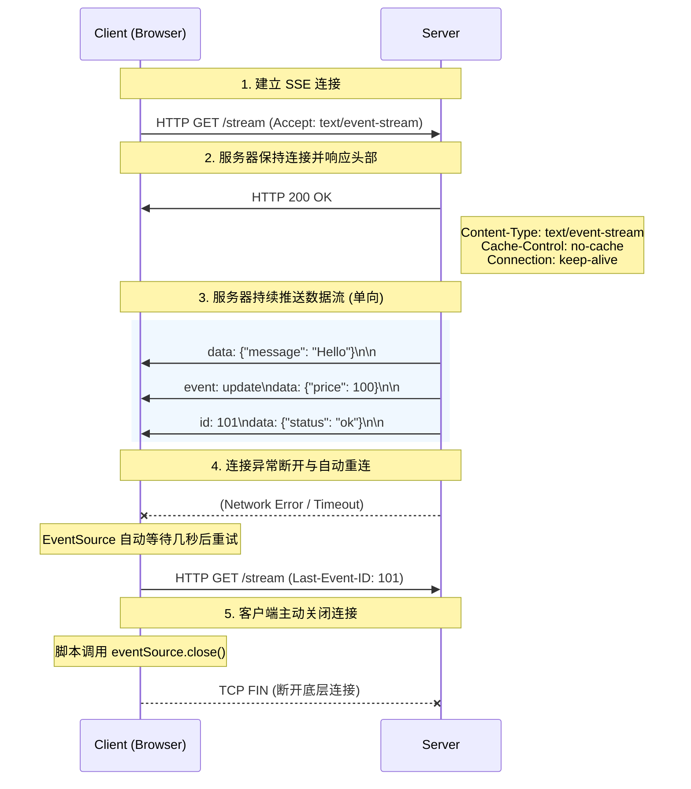

在 Web 开发中，服务器向客户端实时推送数据是一个常见需求。我们在前文讨论过，**WebSocket** 是解决这一问题的“终极武器”，它提供了强大的全双工双向通信能力。

然而，在实际的业务场景中，很多时候我们**只需要服务器单向地向客户端发送数据**（例如：实时日志、股票行情、系统通知，以及最近爆火的 **AI 大模型“打字机”式回复**）。如果仅仅为了单向推送就引入复杂的 WebSocket，往往会带来不必要的系统开销和运维成本（如负载均衡器的特殊配置）。

这时，基于 HTTP 协议的轻量级替代方案——**Server-Sent Events (SSE)**，就成为了更优雅的选择。

## 1. 什么是 Server-Sent Events (SSE)？

**Server-Sent Events (SSE)** 是一种允许服务器端通过 HTTP 连接主动向客户端（通常是浏览器）推送数据的技术。

它是 HTML5 规范的一部分，提供了一套标准的 JavaScript API —— `EventSource`，使得浏览器能够非常方便地与服务器保持单向的长连接，并持续接收数据流。

**核心特点：**
1. **单向通信**：数据只能从服务器流向客户端（Server -> Client）。
2. **基于纯 HTTP**：不需要像 WebSocket 那样进行协议升级。它完全复用现有的 HTTP 基础设施，对防火墙和反向代理（如 Nginx）非常友好。
3. **文本驱动**：SSE 传输的数据必须是 UTF-8 编码的纯文本格式（通常是 JSON 字符串化后的文本）。
4. **内置重连机制**：浏览器的 `EventSource` 对象在连接意外断开时，会自动尝试重新连接服务器。
5. **事件流分发**：支持自定义事件类型，前端可以像监听 DOM 事件一样监听服务器推送的不同业务数据。

## 2. SSE 的工作原理

SSE 的本质是一个**持续未关闭的 HTTP 响应（HTTP Streaming）**。

传统的 HTTP 请求是“请求-响应-断开”。而在 SSE 中，服务器端在发送完响应头之后，**不会关闭连接**，而是顺着这个连接源源不断地向客户端输出文本数据流。

我们可以用时序图来展示这个过程：



### 2.1 客户端请求与服务器响应

**客户端发送的 HTTP 请求：**
客户端通过创建一个普通的 HTTP GET 请求发起连接。为了声明这是 SSE 请求，通常会在请求头中带上：
```http
Accept: text/event-stream
```

**服务器返回的 HTTP 响应头：**
服务器如果同意建立 SSE 连接，必须返回特定的响应头，这是 SSE 能够工作的关键：
```http
HTTP/1.1 200 OK
Content-Type: text/event-stream
Cache-Control: no-cache
Connection: keep-alive
X-Accel-Buffering: no
```
- `Content-Type: text/event-stream`：明确告诉浏览器，接下来返回的是 SSE 事件流格式的数据，不要当作普通 HTML 或 JSON 直接结束渲染。
- `Cache-Control: no-cache`：禁用任何中间代理缓存，确保数据实时到达。
- `Connection: keep-alive`：保持 HTTP 长连接不关闭。**（⚠️ 注意：如果在 HTTP/2 环境下，`Connection` 等连接专用头部是严格被禁止的，必须省略该字段，因为 HTTP/2 本身默认就是持久连接且多路复用的）。**
- `X-Accel-Buffering: no`：**（非标准但极度推荐）** 这是专门写给 Nginx 的指令，告诉 Nginx 遇到这个请求时绝对不要开启缓冲，而是立刻透传给客户端。这对解决线上部署时流式输出被卡住的问题非常有效。

## 3. SSE 的数据传输格式 (Event Stream)

SSE 规定了一套非常简单且严谨的纯文本数据格式。事件流由一系列的“消息”组成，**每条消息之间用两个换行符 `\n\n` 分隔**。

一条消息内部可以包含多个字段，字段名和字段值之间用冒号 `:` 分隔，且以单个换行符 `\n` 结尾。

SSE 规范支持以下四个标准字段：

### 1. `data` 字段 (数据内容)
这是最核心的字段，承载实际要传输的数据。如果数据有多行，可以使用多个 `data:` 行。

```text
data: 这是第一行数据
data: 这是第二行数据

```

### 2. `event` 字段 (事件类型)
默认情况下，前端使用 `onmessage` 接收数据。如果指定了 `event` 字段，前端可以针对不同的事件类型绑定不同的监听器。

```text
event: userLogin
data: {"username": "Aaron"}

event: systemAlert
data: {"msg": "Server overload!"}

```

### 3. `id` 字段 (事件 ID 与断线重连)
服务器可以为每条消息分配一个唯一的 `id`。浏览器的 `EventSource` 对象会记录最近一次接收到的 `id`。
**当网络闪断，浏览器自动发起重连时，会在请求头中自动添加 `Last-Event-ID` 字段，把记录的 ID 发给服务器。** 这样服务器就能知道客户端是从哪里断开的，从而实现断点续传。

```text
id: 99
data: 消息内容

```
*(断开重连时，客户端的 HTTP Request Header 会自动携带：`Last-Event-ID: 99`)*

### 4. `retry` 字段 (控制重连时间)
默认情况下，浏览器在断线后会等待大约 3 秒钟尝试重连。服务器可以通过发送 `retry` 字段（单位为毫秒）来改变这个重连间隔。

```text
retry: 5000
data: 告诉浏览器，如果断开连接，请等待 5 秒后再试

```

## 4. SSE vs WebSocket vs 轮询 (Polling)

在选择实时通信方案时，经常需要在这三者之间做权衡。

| 特性 / 方案 | HTTP 轮询 (Polling) | Server-Sent Events (SSE) | WebSocket |
| :--- | :--- | :--- | :--- |
| **通信方向** | 客户端主动拉取 (单向) | 服务器推送到客户端 (**单向**) | 全双工 (**双向**) |
| **底层协议** | HTTP | **HTTP** | 独立的 WebSocket 协议 (基于 TCP) |
| **建立连接开销** | 极高 (每次都要建立新请求) | 低 (一次 HTTP 请求，保持长连接) | 中等 (需借用 HTTP 进行 101 协议升级) |
| **数据格式** | 任意格式 | **仅支持 UTF-8 文本** | 二进制或纯文本 |
| **自动重连机制**| 需要开发者自己写逻辑 | **浏览器原生支持 (EventSource)** | 需要开发者自己写逻辑 |
| **断点续传** | 无 | **支持 (`Last-Event-ID`)** | 无 |
| **防火墙/代理穿透**| 极佳 | **极佳 (纯正 HTTP，Nginx 天然支持)**| 较差 (部分严格的代理会阻断 WebSocket) |
| **适用场景** | 兼容极老旧浏览器 | **状态更新、实时日志、AI 聊天输出** | 互动游戏、聊天室、协同编辑 |

## 5. 典型应用场景

SSE 曾经一度被 WebSocket 的光芒所掩盖，但在近年来，它迎来了“第二春”，并在许多特定场景下展现出不可替代的优势。

### 5.1 AI 大模型“打字机”输出 (如 ChatGPT)
这是目前 SSE 最火热的应用场景。由于大语言模型生成回复需要时间，如果等整段话生成完再通过一次 HTTP 响应返回，用户可能需要等待几十秒，体验极差。
ChatGPT 等 AI 产品广泛采用 SSE：服务器每生成一个字或一个词（Token），就立刻作为一条 SSE 消息推送给前端。前端实时将文本拼接渲染出来，形成了平滑的“打字机”视觉效果。

### 5.2 实时日志监控平台 / CI/CD 部署
比如在 Jenkins 构建项目或查看 Kubernetes Pod 日志时，日志是不断产生的。前端只需要查看，不需要向服务器发送复杂的控制指令，使用 SSE 将日志流式传输到浏览器前端控制台是最优雅的方案。

### 5.3 股票、加密货币实时行情
金融行情大屏或客户端通常只需要被动地接收价格跳动，此时用 SSE 单向推送不仅节省开销，还能利用其内置的重连机制保证行情的稳定性。

### 5.4 社交媒体的新消息通知
类似于 Twitter 或知乎的“你有 3 条新通知”红点提醒。后端只要发现数据库有更新，通过 SSE 向该用户的浏览器推送一个简单的通知事件即可。

## 6. 总结与注意事项

**Server-Sent Events 是一种极其轻量、优雅的单向数据流推送方案。**

它完全拥抱现有的 HTTP 生态，前端 API 设计极其人性化（自带重连、支持事件监听）。当你面临的需求是“**服务器需要不断地塞数据给浏览器，而浏览器只需要听着就行**”时，请毫不犹豫地选择 SSE，而不是盲目地上 WebSocket。

**⚠️ 使用 SSE 时的注意事项：**
1. **浏览器并发限制**：由于 SSE 基于 HTTP 长连接，在 HTTP/1.1 下，大多数浏览器（如 Chrome）对同一个域名的并发连接数限制为 **6 个**。如果用户打开了 7 个网页标签卡并在每个卡中都建立 SSE 连接，第 7 个连接就会一直处于 Pending 状态。
   - **解决方案**：升级并开启 **HTTP/2** 协议。HTTP/2 采用了多路复用技术，可以通过单一 TCP 连接并发处理成百上千个数据流（RFC 并没有硬性规定上限，多数服务器如 Nginx/Tomcat 默认配置的 `SETTINGS_MAX_CONCURRENT_STREAMS` 为 100 甚至更高），彻底打破了 6 个连接的限制。
2. **代理配置与缓冲问题 (Nginx 坑点)**：使用 Nginx 等反向代理时，默认行为会破坏 SSE 的流式传输。
   - **关闭缓冲**：Nginx 默认会缓冲响应，导致数据攒够一定大小才发给客户端（表现为前端迟迟收不到数据，然后突然收到一大坨）。最优雅的解法是**在后端应用程序的响应头中**加上 `X-Accel-Buffering: no`，这样 Nginx 就会自动放行该请求的缓冲。或者在 Nginx 中针对该接口配置 `proxy_buffering off;`。
   - **保持长连接**：Nginx 默认代理到后端使用的是 HTTP/1.0 且会关闭连接。必须在 Nginx 代理配置中显式加上 `proxy_http_version 1.1;` 和 `proxy_set_header Connection "";`，同时调大超时时间（`proxy_read_timeout`），否则连接会被强制截断。
3. **不支持跨域 (默认)**：和普通 AJAX 一样，SSE 默认受同源策略限制。如果需要跨域推送，服务器必须正确配置 CORS (跨域资源共享) 相关的 Header，前端实例化 `EventSource` 时也可传入 `{ withCredentials: true }`。
4. **原生 EventSource API 的局限性**：浏览器原生的 `EventSource` API **只支持 GET 请求**，并且**无法自定义请求头（如 `Authorization: Bearer token`）**。如果需要在请求中传递 Token 进行鉴权，通常只能将 Token 放在 URL 参数中或使用 Cookie。若必须要用 POST 请求或自定义 Header，可以使用微软开源的 `@microsoft/fetch-event-source` 库或直接基于 Fetch API 自己实现流式读取。
