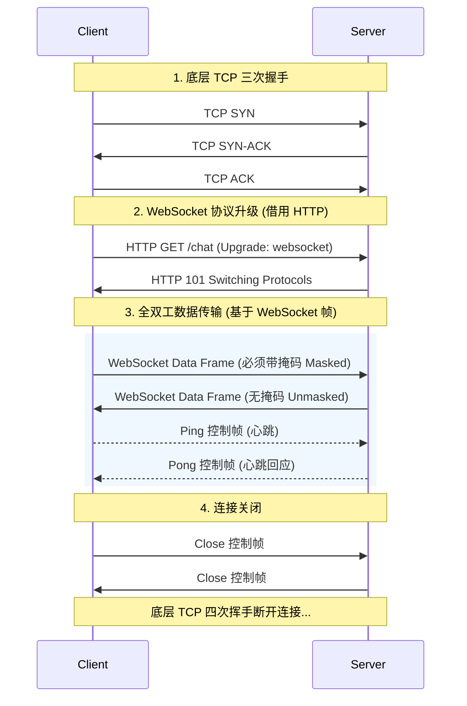

在当今的 Web 开发中，实时通信已经成为许多应用的核心需求，无论是聊天室、在线文档协作、网页游戏，还是实时的股票行情推送，都需要服务器能够实时地向客户端推送数据。为了解决这一需求，**WebSocket** 应运而生。

本文将深入解析 WebSocket 协议的原理、机制，以及它与传统 HTTP 的对比。

## 1. 为什么需要 WebSocket？

在了解 WebSocket 之前，我们需要先看看 HTTP 协议在实时通信方面的局限性。

传统的 HTTP 协议（如 HTTP/1.1）是基于**“请求-响应”**模式的：客户端必须首先向服务器发送请求，服务器才能返回响应数据。服务器**无法主动**向客户端推送数据。

为了在 HTTP 上实现“伪实时”的通信，开发者们曾经使用过以下几种技术：

- **短轮询 (Short Polling)**：客户端每隔固定时间（比如 1 秒）向服务器发送 HTTP 请求，询问是否有新数据。
  - **缺点**：大量请求浪费带宽，服务器压力大，且大部分请求都是无效的（没有新数据）。
- **长轮询 (Long Polling)**：客户端发起请求后，如果没有新数据，服务器会将请求挂起（保持连接不断开），直到有新数据或者超时才返回响应。客户端收到响应后立即发起下一次请求。
  - **缺点**：虽然减少了无效请求，但频繁的 HTTP 头部开销依然存在，且服务器挂起大量连接会消耗资源。

随着实时 Web 应用的复杂化，HTTP 的这种单向通信模式成为了性能瓶颈。我们需要一种**全双工、低开销、基于持久连接**的协议。

## 2. 什么是 WebSocket？

**WebSocket** 是一种在单个 TCP 连接上进行**全双工 (Full-Duplex)** 通信的协议。它在 2011 年被 IETF 定为标准 (RFC 6455)，并且 WebSocket API 被 W3C 定为标准。

**核心特点：**
1. **建立在传输层之上**：WebSocket 传统上建立在 TCP 之上。但在现代网络协议演进中，**RFC 8441** 允许 WebSocket 复用 **HTTP/2** 的多路复用数据流，而 **RFC 9220** 更支持 WebSocket 运行在基于 UDP 的 **HTTP/3 (QUIC)** 之上，这极大提升了连接效率并改善了弱网环境下的表现。
2. **复用 HTTP 端口**：默认使用 80 (ws://) 或 443 (wss://) 端口，这使得 WebSocket 可以很容易地穿透企业防火墙和代理服务器。
3. **一次握手，持久连接**：只需要进行一次类似 HTTP 的握手过程，之后连接就会一直保持，双方可以随时互发数据。
4. **轻量级数据帧**：相比 HTTP 庞大的 Header，WebSocket 传输数据的头部开销非常小（2~14 字节），非常适合高频的实时数据传输。

## 3. WebSocket 的工作原理

WebSocket 的完整生命周期可以分为三个主要阶段：**连接建立（包含握手）**、**数据双向传输**、以及**连接关闭**。

我们可以通过下面的时序图直观地了解整个交互过程：



### 3.1 握手阶段 (兼容 HTTP)

为了复用现有的 Web 基础设施，WebSocket 的连接建立（握手）**借用了 HTTP 协议**。客户端会发送一个特殊的 HTTP GET 请求给服务器，请求“升级”为 WebSocket 协议。

**客户端发起的 HTTP 请求示例：**
```http
GET /chat HTTP/1.1
Host: example.com
Upgrade: websocket
Connection: Upgrade
Sec-WebSocket-Key: dGhlIHNhbXBsZSBub25jZQ==
Sec-WebSocket-Version: 13
```
- `Upgrade: websocket` 和 `Connection: Upgrade`：告诉服务器，我想将这个 HTTP 连接升级为 WebSocket 连接。
- `Sec-WebSocket-Key`：一个 Base64 编码的随机字符串，用于安全验证，防止跨协议攻击。

**服务器的 HTTP 响应示例：**
```http
HTTP/1.1 101 Switching Protocols
Upgrade: websocket
Connection: Upgrade
Sec-WebSocket-Accept: s3pPLMBiTxaQ9kYGzzhZRbK+xOo=
```
- `101 Switching Protocols`：状态码 101 表示服务器同意协议切换，握手成功。
- `Sec-WebSocket-Accept`：服务器根据客户端发来的 Key 计算出的摘要，证明服务器确实理解 WebSocket 协议。计算公式如下：
  ```text
  Sec-WebSocket-Accept = base64(sha1(Sec-WebSocket-Key + "258EAFA5-E914-47DA-95CA-C5AB0DC85B11"))
  ```
  *(注：这里的字符串拼接是直接将两个字符串相连，`258EAFA5-E914-47DA-95CA-C5AB0DC85B11` 是 RFC 6455 中定义的一个全局唯一的固定 UUID。)*

**握手完成后，HTTP 协议就完成了它的使命。接下来的通信将直接在这个 TCP 连接上以 WebSocket 数据帧的格式进行传输。**

> **⚠️ 补充：HTTP/2 与 HTTP/3 中的握手差异**
> 上述 `101 Switching Protocols` 是基于 HTTP/1.1 的经典握手方式。在 **HTTP/2 (RFC 8441)** 和 **HTTP/3 (RFC 9220)** 中，由于协议本身支持多路复用，不再需要“独占”整个连接。因此，它们使用扩展的 `CONNECT` 方法进行握手，并带有伪头 `:protocol: websocket`，成功时服务器直接返回 `200 OK` 而不是 `101` 状态码。

### 3.2 数据传输阶段 (数据帧格式)

WebSocket 使用**帧 (Frame)** 来传输数据。一个完整的消息可能由一个或多个帧组成（这就是 WebSocket 的分片机制，用于高效传输大文件或流媒体，避免阻塞多路复用连接）。

根据 RFC 6455 规范，WebSocket 的数据帧底层结构如下所示：

```text
      0                   1                   2                   3
      0 1 2 3 4 5 6 7 8 9 0 1 2 3 4 5 6 7 8 9 0 1 2 3 4 5 6 7 8 9 0 1
     +-+-+-+-+-------+-+-------------+-------------------------------+
     |F|R|R|R| opcode|M| Payload len |    Extended payload length    |
     |I|S|S|S|  (4)  |A|     (7)     |             (16/64)           |
     |N|V|V|V|       |S|             |   (if payload len==126/127)   |
     | |1|2|3|       |K|             |                               |
     +-+-+-+-+-------+-+-------------+ - - - - - - - - - - - - - - - +
     |     Extended payload length continued, if payload len == 127  |
     + - - - - - - - - - - - - - - - +-------------------------------+
     |                               |Masking-key, if MASK set to 1  |
     +-------------------------------+-------------------------------+
     | Masking-key (continued)       |          Payload Data         |
     +-------------------------------- - - - - - - - - - - - - - - - +
     :                     Payload Data continued ...                :
     +---------------------------------------------------------------+
```

WebSocket 数据帧的头部非常精简（最小 2 字节，最大 14 字节），主要包含以下关键字段：
- **FIN (1 bit)**：标记是否为消息的最后一帧。如果是 1，表示这是完整消息的尾帧；如果是 0，表示后续还有分片帧。
- **RSV1, RSV2, RSV3 (各 1 bit)**：保留位，默认均为 0。如果通信双方在握手时协商了扩展（例如 `permessage-deflate` 数据压缩扩展），这些位可能被激活使用。
- **Opcode (4 bits)**：操作码，指示帧的类型。常见的有：
  - `0x0`：连续帧 (Continuation Frame，配合 FIN 位实现消息分片)
  - `0x1`：文本数据 (Text Frame，必须是合法的 UTF-8 编码)
  - `0x2`：二进制数据 (Binary Frame)
  - `0x8`：连接关闭 (Close 控制帧)
  - `0x9`：Ping (心跳检测控制帧)
  - `0xA`：Pong (心跳响应控制帧)
- **MASK (1 bit) & Masking-key (0 或 32 bits)**：掩码标志和掩码密钥。RFC 6455 严格规定：**客户端发往服务器的数据必须经过掩码处理**（MASK=1，并携带 4 字节的 Masking-key，主要为了防止中间的代理服务器产生混淆或被缓存投毒攻击），而**服务器发往客户端的数据绝对不能使用掩码**（MASK=0，此时没有 Masking-key 字段）。
- **Payload length (7 bits, 7+16 bits, 或 7+64 bits)**：数据载荷的长度。这也是头部大小会变动的原因所在：
  - 如果真实数据长度在 0~125 字节之间，直接用这 7 bits 的值表示即可。
  - 如果该 7 bits 的值等于 **126**，则紧随其后的 2 个字节（16 bits）将被解析为一个无符号整数，用来表示真实的长度（范围 126 ~ 2<sup>16</sup>-1 字节，即最大约 64KB）。
  - 如果该 7 bits 的值等于 **127**，则紧随其后的 8 个字节（64 bits）将被解析为一个无符号整数，用来表示真实的长度（范围 65536 ~ 2<sup>63</sup>-1 字节，根据 RFC 规定，最高位必须为 0 以避免符号混淆）。
  - **⚠️ 编码规范**：RFC 6455 强制要求必须使用“**最小字节数**”来编码长度。例如，124 字节的数据必须用 7 bits 表示，绝不能用 126 加上后跟的 2 字节来表示。

### 3.3 心跳保活 (Ping/Pong)

由于网络环境的复杂性（如 NAT 超时），长连接可能会被路由器或防火墙静默断开（即所谓的“死连接”）。为了维持连接的活跃状态并检测连接是否断开，WebSocket 协议内置了**心跳机制**。
- 发送方（通常是服务器端）定期发送 **Ping 帧**。
- 接收方收到 Ping 帧后，必须立即回复 **Pong 帧**。

## 4. WebSocket 与 HTTP 的对比

| 特性 | HTTP/1.1 | WebSocket |
| :--- | :--- | :--- |
| **通信模式** | 单向（客户端请求，服务器响应） | 全双工（双向同时通信） |
| **连接状态** | 无状态，通常一个请求对应一个响应 | 持久连接（状态保持） |
| **头部开销** | 较大（通常几百字节） | 极小（2~14 字节） |
| **协议层级** | 应用层协议 | 应用层协议（传统基于 TCP，现代支持 HTTP/2、HTTP/3 复用） |
| **服务端推送** | 不支持（需依赖轮询或 SSE） | 原生支持 |
| **适用场景** | 静态页面、RESTful API、一次性数据加载 | 实时聊天、游戏、行情推送、直播弹幕 |

> **补充说明：SSE (Server-Sent Events)**
> 如果你的应用场景**只需要服务器向客户端单向推送数据**（例如股票行情只读、日志实时滚动），并且不需要客户端频繁向服务器发消息，那么使用基于 HTTP 的 **SSE** 可能是比 WebSocket 更轻量级的选择。

## 5. 常见应用场景

WebSocket 凭借其低延迟、全双工的特性，广泛应用于以下领域：
1. **即时通讯 (IM) / 聊天室**：微信网页版、Slack 等。
2. **实时在线游戏**：多人浏览器游戏，玩家位置和动作需要实时同步。
3. **协同编辑**：多个人同时在线编辑一份文档（如 Google Docs、飞书文档），需要将按键操作实时广播给其他人。
4. **实时数据大屏 / 金融行情**：股票、加密货币交易所的 K 线图实时刷新。
5. **物联网 (IoT) 控制**：实时控制智能设备并获取其状态反馈。

## 6. 总结

WebSocket 弥补了传统 HTTP 协议在实时双向通信领域的短板。它巧妙地利用了 HTTP 进行握手，然后蜕变为一个纯粹的、低开销的 TCP 长连接协议。

在选择技术方案时，开发者应根据业务需求权衡：如果是传统的网页数据拉取，HTTP（尤其是 HTTP/2 和 HTTP/3）依然是绝对主力；而当业务高度依赖实时互动、低延迟和高频数据推送时，WebSocket 则是不可或缺的利器。
