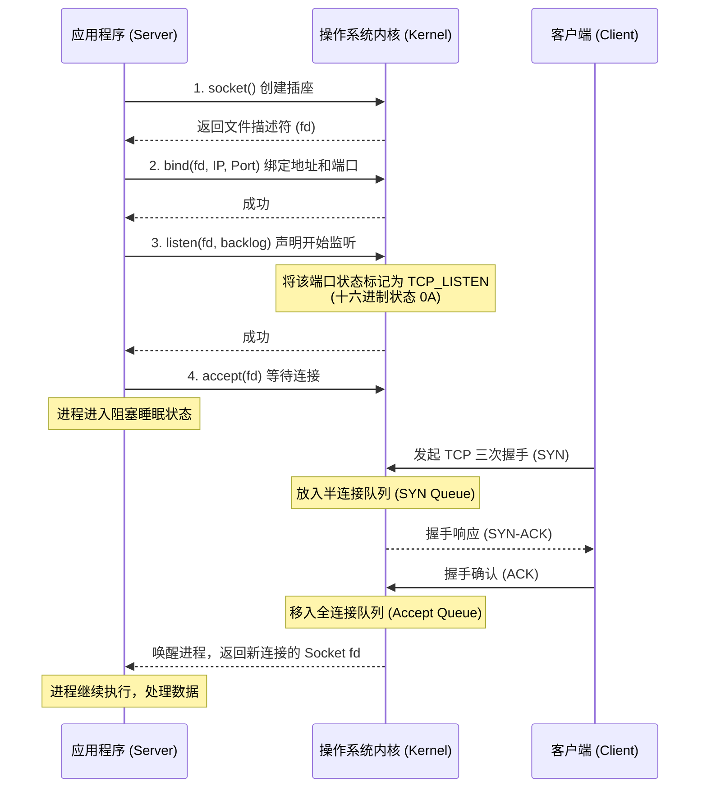

在配置服务器、部署 Web 应用或排查网络故障时，我们经常会听到一个词：“端口监听”（Port Listening）。如果端口没有被正确监听，客户端就会无情地抛出“Connection Refused”（连接被拒绝）的错误。

那么，到底什么是端口监听？它是如何运作的？我们平时敲打的排查命令，又是如何获取这些信息的？本文将带你打破砂锅问到底，自底向上（从操作系统内核到底层应用，再到用户工具）地讲透“端口监听”的原理。

## 底层：内核、协议栈与 Socket 契约

要理解端口监听，我们必须先进入操作系统的最底层——内核（Kernel）。

当带有数据的网络包通过网线或光纤到达你的计算机网卡时，网卡会触发硬件中断，把数据包交给操作系统的 TCP/IP 协议栈处理。此时，操作系统面临一个问题：**我该把这个数据包交给系统里运行的成百上千个程序中的哪一个？**

为了解决这个问题，网络协议引入了**“端口（Port）”**的概念。如果说 IP 地址是这台计算机的“街道地址”，那么端口号就是这台计算机内部各个程序的“房间号”。

但操作系统不会自动把房间号分配给程序，应用程序必须主动向操作系统申请。这个申请和建立约定的过程，就是通过 **Socket API（套接字接口）** 来完成的。

我们可以用一张时序图来展示这个核心过程：



在底层，C 语言的代码实现大致如下：

```c
#include <sys/socket.h>
#include <netinet/in.h>
#include <arpa/inet.h>
#include <string.h>
#include <unistd.h>

int main() {
    // 1. 创建 Socket (AF_INET = IPv4, SOCK_STREAM = TCP)
    int server_fd = socket(AF_INET, SOCK_STREAM, 0);

    // 2. 绑定端口 (绑定到 80 端口)
    struct sockaddr_in server_addr;
    memset(&server_addr, 0, sizeof(server_addr)); // 清空结构体，防止出现未知错误
    server_addr.sin_family = AF_INET;
    server_addr.sin_addr.s_addr = htonl(INADDR_ANY); // 监听所有网卡 IP (转换为网络字节序)
    server_addr.sin_port = htons(80);                // 端口号需要转换为网络字节序
    bind(server_fd, (struct sockaddr*)&server_addr, sizeof(server_addr));

    // 3. 开始监听 (backlog = 128 代表全连接队列的最大长度)
    listen(server_fd, 128); 

    // 4. 阻塞等待，接听客户端的连接
    struct sockaddr_in client_addr;
    socklen_t client_len = sizeof(client_addr);
    int client_fd = accept(server_fd, (struct sockaddr*)&client_addr, &client_len);

    // 处理完业务后关闭
    close(client_fd);
    close(server_fd);

    return 0;
}
```

这就是“监听”在操作系统底层的绝对真相：**它是应用程序向内核注册端口使用权，并委托内核代收网络请求的一种状态。**

## 中层：应用程序的角色扮演与 TCP 四元组

懂了底层的内核机制，我们再回到应用程序（如 Nginx, Tomcat, MySQL）这一层。

处于 `LISTEN` 状态的程序，就像是一个坐在前台接待处的**专属接待员**。

- 他什么具体的业务都不办，他的唯一职责就是戴着耳机，专注地“监听”分机号（端口）。
- 当没有电话打进来时，他不消耗太多 CPU 资源，只是安静地阻塞在 `accept()` 阶段。
- 一旦客户端（如用户的浏览器）发起 TCP 三次握手，内核处理完握手后，就会把这个连接塞给接待员。接待员接起电话，然后通常会把这个具体的通话转交给后面的工作线程去处理，而自己马上又坐回原位，继续“监听”下一个新连接。

在网络协议的数学逻辑抽象中，每一个独一无二的 TCP 网络连接都由一个**四元组（4-Tuple）**来唯一标识：

$$ \text{Connection} = \{ \text{Local IP}, \text{Local Port}, \text{Remote IP}, \text{Remote Port} \} $$

而对于一个处于**监听状态（LISTEN）**的 Socket 来说，因为它还没有和任何具体的客户端建立连接，它的远程 IP 和远程端口都是未知的（通配符 `*`）。因此，监听 Socket 的逻辑表达可以看作是：

$$ \text{Listening Socket} = \{ \text{Local IP}, 80, *, * \} $$

当内核收到发往 80 端口的数据包时，它会在其内部的哈希表中进行最长前缀匹配。如果没有程序调用 `listen()` 从而产生这个 $\{ \text{Local IP}, 80, *, * \}$ 的记录，内核查表发现“查无此人”，就会直接给客户端回送一个 `RST`（重置）包，这就是导致“Connection Refused”的直接原因。

## 顶层：系统管理员的透视眼（排查工具）

作为系统管理员或开发者，我们通常无法直接看到内核里的“端口-进程映射表”。我们需要借助用户态的命令行工具来“透视”内核。

内核非常贴心地将这些底层状态暴露给了用户空间。接下来，我们将通过三个经典的命令，一步步查看端口监听状态。

### 工具一：直击内核原始数据

在 Linux 系统中，“一切皆文件”。内核会在内存中虚拟出一个文件系统，将当前的网络状态实时写入其中。我们可以用最基础的命令去读取它。

```bash
cat /proc/net/tcp
```

**【命令及参数详细解析】**
- **命令的主要功能**：直接读取并打印 Linux 内核实时维护的 IPv4 TCP Socket 状态的底层哈希表信息。
- **`cat` (concatenate)**：基础文本输出命令。它的作用是读取后面指定的文件内容，并将其毫无保留地输出到标准输出设备（当前终端屏幕）上。
- **`/proc/net/tcp`**：这是 `cat` 命令要读取的路径参数。
  - **`/proc` (procfs)**：这不是硬盘上的真实目录，而是一个完全驻留在内存中的虚拟文件系统。它是内核向用户空间提供系统信息的接口。
  - **`/net`**：`/proc` 下的子目录，包含所有网络协议栈的状态接口。
  - **`/tcp`**：虚拟出的文本文件。读取它时，内核会动态生成当前所有 TCP 协议的网络套接字信息。你会看到一堆十六进制的代码，比如监听 80 端口的记录可能长这样：
    `0: 00000000:0050 00000000:0000 0A ...`
    - `00000000:0050`（本地地址）：冒号前是本地 IP 地址的十六进制表示（注意：在 x86 架构等小端机器上，`/proc/net/tcp` 中的 IP 地址会以**小端序网络字节**倒排显示，例如 `127.0.0.1` 会显示为 `0100007F`，这里的 `00000000` 则是 `0.0.0.0`）。冒号后的 `0050` 则是十进制端口 `80` 的十六进制表示（端口号在打印时会转换为直观的十六进制数值）。
    - `00000000:0000`（远程地址）：全 0 代表没有建立连接，对应前面提到的通配符 `*`。
    - `0A`（连接状态 `st` 列）：在内核态代表 `TCP_LISTEN`（监听）状态（在 Linux 源码 `include/net/tcp_states.h` 中 `TCP_LISTEN = 10`，十进制的 10 转为十六进制即为 `0A`）。

### 工具二：现代而高效的透视镜 `ss`

直接看十六进制太反人类了。现代 Linux 系统最推荐使用 `ss` 命令。它不通过读取文本文件，而是利用 Netlink（如 `NETLINK_INET_DIAG`）机制直接与内核进行二进制通信，速度极快。

```bash
sudo ss -tulnp | grep :80
```

**【命令及参数详细解析】**
- **命令的主要功能**：以管理员权限查询系统中所有处于监听状态的 TCP 和 UDP 端口，显示对应的进程信息，并从中筛选出仅包含 80 端口的行。
- **`sudo` (SuperUser DO)**：以 root（超级管理员）权限执行后面的命令。因为普通用户受限于安全机制，无法读取属于其他用户的进程信息。
- **`ss` (Socket Statistics)**：核心工具，用于输出网络套接字的详细统计和状态信息。
- **`-t` (TCP)**：过滤选项，指示 `ss` 仅列出使用 TCP 协议的连接。
- **`-u` (UDP)**：过滤选项，指示 `ss` 仅列出使用 UDP 协议的连接。
- **`-l` (Listening)**：状态过滤选项，指示 `ss` 仅显示当前处于 `LISTEN`（监听等待）状态的端口，忽略那些已经建立连接或正在断开的套接字。
- **`-n` (Numeric)**：格式化选项，强制命令直接输出数字形式的 IP 地址和端口号（如输出 `80` 而不是尝试反向解析成 `http`），极大提升命令执行速度。
- **`-p` (Processes)**：指示命令显示是哪一个进程名称和进程 ID（PID）在使用这个端口。
- **`|` (Pipe 管道符)**：Shell 中的特殊控制字符。它的作用是将左侧命令（`ss -tulnp`）本应输出到屏幕的结果，直接“导流”并作为右侧命令（`grep`）的输入数据。
- **`grep` (Global Regular Expression Print)**：文本搜索过滤工具。它会在接收到的数据中，逐行搜索匹配特定模式的文本。
- **`:80`**：作为 `grep` 的搜索模式参数。命令将只把包含 `:80` 字符的行打印到屏幕上，从而精准定位 80 端口的监听情况。

### 工具三：万物皆文件的“找内鬼”利器 `lsof`

因为在 Linux 中网络套接字也是一种“文件”，所以我们可以用列出打开文件的工具 `lsof` 来反向查找端口。

```bash
sudo lsof -i :80
```

**【命令及参数详细解析】**
- **命令的主要功能**：列出当前系统中，打开或占用了网络端口 80 的所有进程的详细信息。
- **`sudo`**：同样需要超级管理员权限来获取所有进程的文件描述符信息。
- **`lsof` (List Open Files)**：核心命令，用于列举系统当前已经被各种进程打开的所有文件。由于 Linux 中网络连接（Socket）也被抽象为文件，因此它能查网络状态。
- **`-i` (Internet/IPv4/IPv6)**：网络地址筛选选项。它指示 `lsof` 限制其输出，只显示那些符合特定 Internet 网络地址或端口的“文件”（即网络连接）。
- **`:80`**：附加给 `-i` 选项的具体参数值，表示仅过滤出端口号为 80 的网络连接。如果结果中出现状态为 `(LISTEN)` 的条目，即可证明该程序正在监听此端口。

## 结语

从底层的内核网络协议栈剥离数据，到 Socket API 的状态注册（`bind` 和 `listen`），再到应用层的阻塞等待，最后通过 `procfs` 或 `Netlink` 将状态暴露给 `ss` 等命令行工具。

“端口监听”的生命周期贯穿了计算机系统的各个层级。掌握了自底向上的思维，下次遇到“Connection Refused”时，你脑海中浮现的将不再是单纯的报错，而是数据包敲响 80 端口大门，却发现接待处空无一人的清晰画面。
