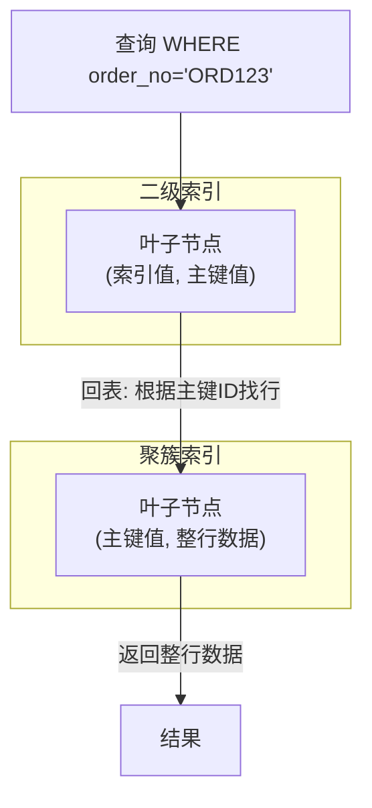
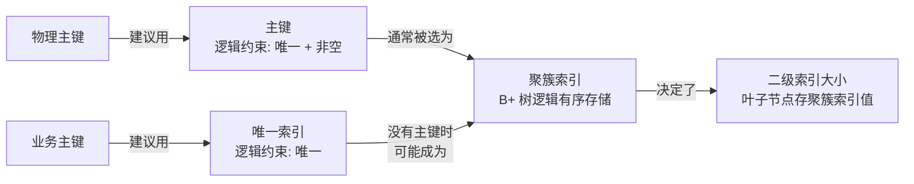

> **核心命题**：物理主键是给数据库管数据用的，不是给查询用的；业务主键是业务标识，用唯一索引约束就够了。理解聚簇索引和二级索引的关系，才能理解为什么这个惯例成立。

## 一、先明确：主键是干什么的

主键（Primary Key）的核心作用只有两条：

1. **唯一标识每一行** —— 表中不会出现两条主键值相同的记录
2. **数据库默认用它组织数据** —— InnoDB 按主键构建聚簇索引，数据在主键 B+ 树中按逻辑顺序排列

但"唯一标识一行"不一定要用主键约束来实现，唯一索引（UNIQUE + NOT NULL）同样能做到。这就给"用物理主键还是业务主键"留下了讨论空间。

## 二、物理主键 vs 业务主键

| | 物理主键（代理主键） | 业务主键（自然主键） |
|---|---|---|
| 来源 | 系统自动生成，无业务含义 | 用业务中已有字段（身份证号、订单号等） |
| 常见形式 | `AUTO_INCREMENT`、雪花 ID | `order_no`、`user_name`、`id_card` |
| 稳定性 | 通常不变 | 可能随业务规则变更 |
| 大小 | 通常 4~8 字节（int/bigint） | 通常较大（字符串、二进制等） |
| 写入性能 | 自增顺序追加，页分裂少 | 随机插入，页分裂频繁 |

### 用业务主键有什么问题？

假设你用订单号做主键：

```sql
CREATE TABLE orders (
    order_no   VARCHAR(32) PRIMARY KEY,
    user_id    INT NOT NULL,
    amount     DECIMAL(10,2)
);
```

**问题一：变更代价高**

如果业务规则调整，需要修改订单号：

```sql
UPDATE orders SET order_no = 'NEW_NO' WHERE order_no = 'OLD_NO';
```

因为 `order_no` 是聚簇索引，更新它意味着：
1. 删除旧的索引条目
2. 在 B+ 树中重新插入（可能触发页分裂）
3. 所有二级索引里记录的聚簇索引值（即 `order_no`）都要同步更新

**问题二：二级索引膨胀**

假设表上还有一个 `user_id` 索引。二级索引的叶子节点存的是聚簇索引的值。根据 MySQL 官方文档，`VARCHAR(M)` 存储占用 `L + 1~2 字节`（L 为实际字节长度；值长度 ≤255 字节时用 1 字节存储长度前缀，>255 字节时用 2 字节）。如果聚簇索引是 `VARCHAR(32)`，每个二级索引条目要额外存这个字符串的实际字节长度；如果是 `BIGINT`，固定只要 8 字节。数据量上亿时差异巨大。

**问题三：写入性能差**

业务主键通常是随机的（UUID、有序号但前缀不同等），新插入的行可能落在 B+ 树中间位置，触发页分裂。自增主键永远追加在末尾，写入效率高得多。

### 业界惯例

```sql
CREATE TABLE orders (
    id         BIGINT AUTO_INCREMENT PRIMARY KEY,  -- 物理主键，数据库自己管
    order_no   VARCHAR(32) NOT NULL,               -- 业务主键，加唯一索引
    user_id    INT NOT NULL,
    amount     DECIMAL(10,2),
    UNIQUE KEY uk_order_no (order_no)
);
```

**物理主键做主键，业务主键用唯一索引约束**。两者各司其职，互不干扰。

适用物理主键的场景：
- 业务主键可能变更
- 业务主键是字符串/UUID 等大字段
- 写入量大，需要顺序追加性能

适用业务主键的场景：
- 业务主键是稳定、递增的整数（如自增序列号）
- 表很小，二级索引膨胀可以忽略
- 没有变更业务主键的需求

## 三、聚簇索引与二级索引

要理解上面的惯例，必须搞清这两种索引。

### 聚簇索引（Clustered Index）

InnoDB 中，表数据本身就是主键的 B+ 树。叶子节点直接存**整行数据**：

```text
[主键 B+ 树]
    ├─ 非叶子节点: (主键值, 子节点指针)
    └─ 叶子节点: (主键值, 整行数据)
```

特性：
- **一个表只有一个聚簇索引**（数据只有一份）
- **数据按聚簇索引排序** —— B+ 树叶子节点通过双向链表连接，逻辑上按主键有序
- **找到索引即找到数据** —— 不需要额外跳转

InnoDB 选择聚簇索引的规则：
1. 有主键 → 主键作为聚簇索引
2. 没有主键但有唯一非空索引 → 第一个这样的索引作为聚簇索引
3. 都没有 → InnoDB 自动生成 6 字节隐藏的 `ROW_ID`

### 二级索引（Secondary Index）

也叫辅助索引，叶子节点存的不是行数据，而是**聚簇索引的值**（通常是主键值）：

```text
[二级索引 B+ 树]
    ├─ 非叶子节点: (索引字段值, 子节点指针)
    └─ 叶子节点: (索引字段值, 对应主键值)
```

查询走二级索引时，需要两步：

```text
二级索引查到主键值 → 去聚簇索引找到整行数据
```

这一步在 MySQL 中通常称为**回表**（官方描述为 "InnoDB uses this primary key value to search for the row in the clustered index"，注意不要和 SQL Server 的 "bookmark lookup" 混淆）。

### 两者的关系



### 覆盖索引

如果二级索引的叶子节点已经包含了查询需要的所有字段，就不需要回表：

```sql
-- 假设有索引 (order_no, amount)
SELECT order_no, amount FROM orders WHERE order_no = 'ORD123';
-- amount 已经在二级索引里，直接返回，不用回表
```

这就是**覆盖索引**（Covering Index）的优化。

## 四、物理主键 vs 聚簇索引的关系

容易混淆的一组概念：

| | 物理主键 | 业务主键 |
|---|---|---|
| 聚簇索引 | 默认用物理主键（通常是自增 ID） | 用业务字段（如 order_no） |
| 二级索引大小 | 小（存 BIGINT 8 字节） | 大（存 VARCHAR 等） |
| 写入模式 | 顺序追加，高效 | 可能随机插入，页分裂 |
| 适合场景 | 大多数业务系统 | 少数稳定递增的业务字段 |

**物理主键 = 聚簇索引的理想选择**，但业务主键也可以做聚簇索引，只是通常不推荐。

## 五、常见误区

| 误区 | 纠正 |
|---|---|
| "主键就是聚簇索引" | 主键是逻辑约束，聚簇索引是物理存储结构。主键通常被选为聚簇索引，但两者不是一回事 |
| "查询走主键更快" | 快是因为聚簇索引直接包含整行数据，不需要回表。跟"是不是主键"无关，而是跟"是不是聚簇索引"有关。唯一索引如果是二级索引，仍然需要回表，比聚簇索引多一步 |
| "没有主键表就不能用" | 可以，InnoDB 会用隐藏 ROW_ID。但复制、DMS 工具、ORM 等依赖显式主键，实践中很少真的不建主键 |
| "业务主键做主键就省了一个字段" | 省了一个字段，但付出了二级索引膨胀、写入性能下降、变更成本高的代价。是否值得取决于具体场景 |
| "UUID 做主键也可以，用就行" | UUID 完全随机，插入时几乎每次都触发页分裂，写入性能极差。考虑有序 UUID（UUID v7）或雪花 ID |

## 六、总结

一张图理清所有关系：



一句话建议：

**绝大多数场景用自增物理主键做主键，业务主键用唯一索引。这样写入快、索引小、变更无痛。只有当业务主键是稳定递增整数且表规模很小时，才值得直接用业务主键。**

## 术语表

| 术语 | 解释 |
|---|---|
| 物理主键 | 系统自动生成、无业务含义的主键（自增 ID、雪花 ID 等） |
| 业务主键 | 有实际业务含义、可作为唯一标识的字段（订单号、身份证号等） |
| 聚簇索引 | 叶子节点存整行数据的索引，数据按主键逻辑有序，一个表只有一个 |
| 二级索引 | 叶子节点存聚簇索引值（通常是主键值），查到时需要回表 |
| 回表 | 二级索引查到主键值后，再到聚簇索引中找整行数据的过程 |
| 覆盖索引 | 二级索引包含查询所需全部字段，无需回表 |

## 参考文献

1. MySQL 官方文档, [Clustered and Secondary Indexes](https://dev.mysql.com/doc/refman/8.4/en/innodb-index-types.html)
2. 姜承尧, *MySQL 技术内幕：InnoDB 存储引擎*, 第 4 章：索引与算法
3. MySQL 官方文档, [Primary Key Optimization](https://dev.mysql.com/doc/refman/8.4/en/primary-key-optimization.html)
