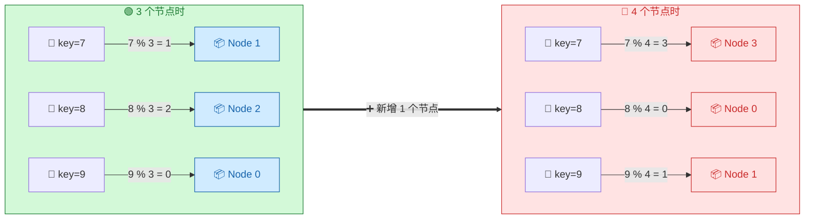
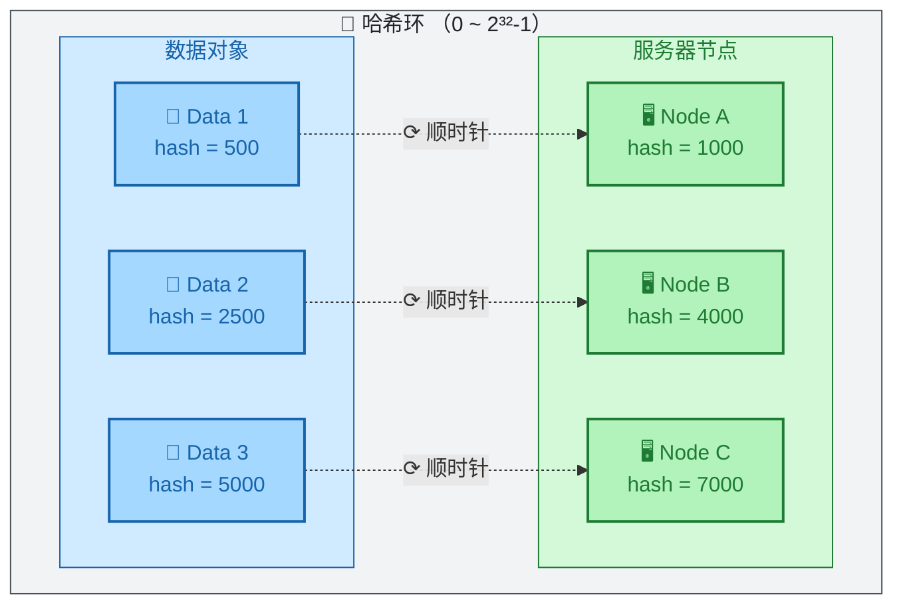
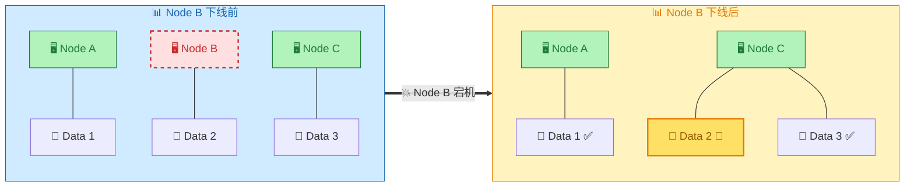
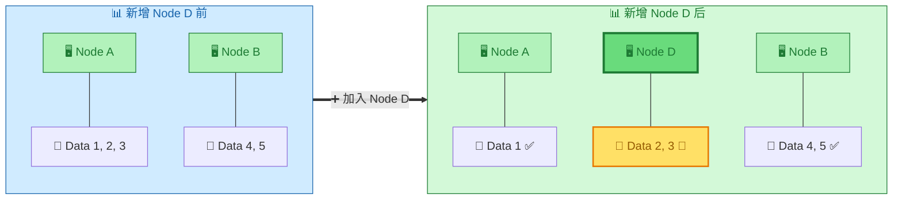
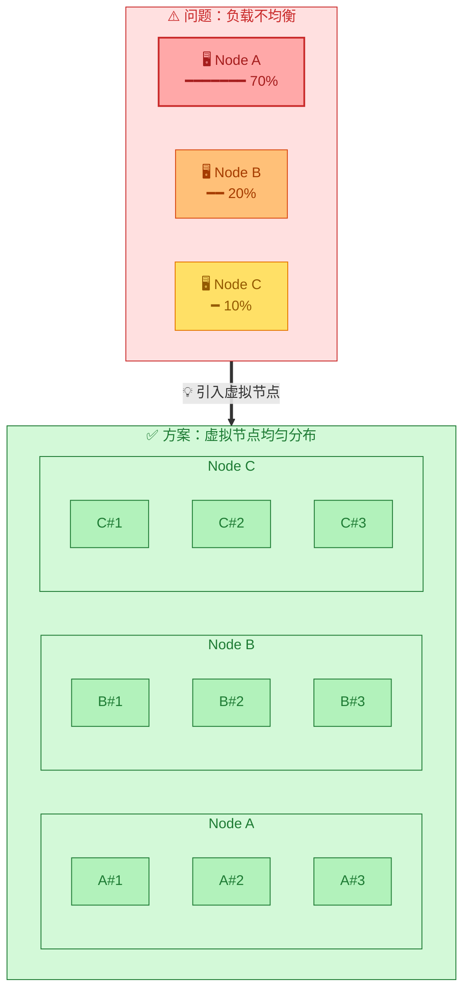

> **核心观点**：一致性哈希通过**哈希环**将数据和节点映射到同一空间，使得节点增删时**仅影响相邻区间的数据**，避免全局数据迁移，是分布式系统动态扩缩容的关键技术。

## 一、问题：传统哈希的致命缺陷

假设用 `hash(key) % N` 将数据分配到 N 个节点：



**问题**：节点数从 3 变成 4，**几乎所有数据的映射都变了**，需要大规模迁移。

## 二、解决方案：哈希环

一致性哈希的核心是将节点和数据映射到一个**首尾相连的环形空间**（通常是 `0 ~ 2³²-1`）：



**定位规则**：数据从自身位置**顺时针查找**，遇到的第一个节点就是其归属节点。

## 三、核心优势：最小化数据迁移

### 节点下线



**只有 Node B 的数据迁移到 Node C**，其他数据不受影响。

### 节点上线



**只有部分数据从 Node A 迁移到新节点 D**。

## 四、虚拟节点：解决数据倾斜

当节点数较少时，可能出现分布不均：



| 特性     | 无虚拟节点           | 有虚拟节点                |
| -------- | -------------------- | ------------------------- |
| 数据分布 | 可能严重不均         | 趋于均匀                  |
| 故障影响 | 全部迁移到下一个节点 | 分散迁移到多个节点        |
| 内存开销 | 低                   | 需维护虚拟节点映射        |
| 常见配置 | -                    | 100~200 个/节点（ketama） |

## 五、代码示例（Go）

```go
type ConsistentHash struct {
    ring     map[uint32]string // hash -> node
    sorted   []uint32          // 有序的 hash 值
    replicas int               // 每个节点的虚拟节点数
}

func (c *ConsistentHash) Add(node string) {
    for i := 0; i < c.replicas; i++ {
        hash := c.hash(fmt.Sprintf("%s#%d", node, i))
        c.ring[hash] = node
        c.sorted = append(c.sorted, hash)
    }
    sort.Slice(c.sorted, func(i, j int) bool {
        return c.sorted[i] < c.sorted[j]
    })
}

func (c *ConsistentHash) Get(key string) string {
    hash := c.hash(key)
    // 二分查找第一个 >= hash 的节点
    idx := sort.Search(len(c.sorted), func(i int) bool {
        return c.sorted[i] >= hash
    })
    if idx == len(c.sorted) {
        idx = 0 // 回绕到环首
    }
    return c.ring[c.sorted[idx]]
}
```

## 六、实际应用

| 系统              | 实现方式                                      |
| ----------------- | --------------------------------------------- |
| **Memcached**     | 客户端实现一致性哈希（ketama 算法）           |
| **Cassandra**     | Murmur3Partitioner + 虚拟节点（vnodes）       |
| **Nginx/Tengine** | Nginx 内置 `hash ... consistent` 参数；Tengine 提供专用 `consistent_hash` 模块 |
| **Amazon Dynamo** | 一致性哈希的经典实现，影响了众多后续系统      |

> **注意**：Redis Cluster 使用 16384 个**固定哈希槽**（Hash Slots），虽然也能最小化数据迁移，但这是**预分配的分片机制**，与一致性哈希的环形空间动态映射是不同的设计。

## 七、总结

| 对比项       | 传统哈希 `% N`        | 一致性哈希         |
| ------------ | --------------------- | ------------------ |
| 节点变化影响 | 全局重新映射          | 仅影响相邻区间     |
| 数据迁移量   | N/(N+1)（约 75%~90%） | ~1/N（约 10%~25%） |
| 扩展性       | 差                    | 优秀               |
| 实现复杂度   | 简单                  | 中等               |

**一句话总结**：一致性哈希通过环形空间 + 顺时针查找的设计，将节点变化的影响从**全局**收敛到**局部**，是分布式系统实现弹性伸缩的核心算法。

---

**参考资料**：
- Karger et al. [*"Consistent Hashing and Random Trees: Distributed Caching Protocols for Relieving Hot Spots on the World Wide Web"*](https://dl.acm.org/doi/10.1145/258533.258660) (STOC 1997) — 一致性哈希的原始论文

