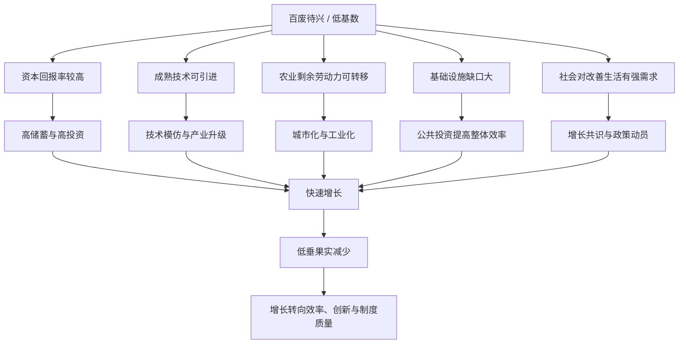

> **核心观点**：一个国家处在“百废待兴”的阶段时，确实更容易出现高速增长。原因不是某一种体制天然更神奇，而是低基数、重建需求、技术差距、劳动力转移和资本积累一起打开了很大的增长空间。不同体制都可能在早期把这些空间转化为增长，但体制会决定增长的成本、质量、分配结果、纠错能力和后续天花板。

我最近想到一个问题：关于经济发展，会不会存在这样一种现象：

> 只要一个国家处于百废待兴的状态，无论采用什么经济机制，都能快速发展？

这个直觉有道理，但需要拆开看。

“百废待兴”不是一个严格经济学概念，它通常包含几种状态：战争或危机后的重建、低收入国家的工业化起步、长期停滞后的制度松动、以及大量资源还没有被现代经济组织起来。处在这种状态下，一个国家不一定已经有很高的创新能力，但它往往有很多“容易做对的事”：修路、通电、建厂、扫盲、城市化、把劳动力从低效率农业转移到工业和服务业、引进国外成熟技术、恢复基本市场秩序。

这些事情本身就能带来很高的增长率。

所以，更准确的说法不是“什么体制都能快速发展”，而是：

**在低基数和后发阶段，只要一种体制能够维持基本秩序、动员储蓄和投资、推动劳动力转移、吸收外部技术，并且不把资源长期锁死在低效率部门，它就可能出现一段快速增长。**

但这只是前半段。后半段是：当低垂果实被摘完，增长就会从“重建和追赶”转向“效率、创新和制度质量”。这时，不同体制之间的差异会变得越来越明显。

## 一、先区分三种高速增长

讨论这个问题时，最容易混淆的是“增长率高”到底来自哪里。

| 类型 | 典型场景 | 增长来源 | 是否容易持续 |
| --- | --- | --- | --- |
| 重建性增长 | 战争、危机、制度崩溃后的恢复 | 修复资本存量、恢复生产秩序 | 通常较难长期持续 |
| 后发追赶增长 | 低收入国家工业化起步 | 引进技术、资本积累、劳动力转移 | 可以持续较久，但会递减 |
| 前沿创新增长 | 接近高收入水平后继续增长 | 原创技术、管理创新、制度效率 | 更难，也更依赖深层能力 |

“百废待兴”对应的多半是前两种。

如果一个工厂原来能生产，只是因为战争、动乱、通胀、封锁或制度失序停了下来，那么恢复秩序之后，产出增长会很快。这个阶段的增长不是凭空创造了新能力，而是把被破坏、被闲置、被扭曲的能力重新释放出来。

如果一个国家本来就很穷，农业人口占比高，城市化率低，基础设施不足，技术水平落后，那么它也容易高速增长。因为它不必从零发明所有技术，只要把已经在先进国家成熟的机器、工艺、管理方法和产业组织搬进来，就可能迅速提高生产率。

这就是后发优势。

后发优势不等于自动成功。它只是说：落后国家面前有一条已经被别人走过的路，技术和产业方向更清楚，试错成本相对低。真正困难的是：这个国家有没有能力把人、资本、土地、教育、金融、贸易和政府执行力组织起来。

## 二、为什么百废待兴时容易增长

高速增长通常不是单一原因，而是几个机制叠在一起。

第一，资本缺口大，投资回报率容易高。

一个缺电、缺路、缺港口、缺机器的经济体，只要补上基础设施和基本工业设备，就可能大幅提高产出。早期投资往往不是“锦上添花”，而是把经济活动从无法发生变成可以发生。

第二，技术差距大，模仿比原创容易。

后发国家可以购买设备、引进工艺、派人学习、吸收外资、进入跨国供应链。它不需要一开始就站在科学技术前沿，只要能把成熟技术本地化，就能快速提高生产率。

第三，农业到工业和服务业的劳动力转移会释放巨大效率。

刘易斯的二元经济模型讲的就是这个问题：传统农业部门里存在大量边际产出较低的劳动力，现代工业部门扩张后，可以吸收这些劳动力。只要工资、住房、教育、城市治理和产业岗位能跟上，劳动力转移本身就是增长来源。

第四，低基数会放大增长率。

一个经济体从 100 增长到 110，是 10% 的增长；从 10000 增长到 10100，只是 1% 的增长。早期增长率高，不能简单等同于长期能力强。它可能只是因为起点低、缺口大。

第五，社会目标更集中。

在贫穷、战后或秩序重建阶段，社会往往对“吃饱饭、有工作、修基础设施、恢复生产”有较强共识。政府、企业和家庭都愿意把更多资源投向储蓄、投资、教育和工业化。这种共识在早期很有力量。

## 三、不同国家的早期快速发展对比

历史上，不同制度背景下都出现过高速增长。把它们放在一起看，会发现表层体制不同，但底层机制有很多相似之处。

先说明比较口径：这里说的“快速发展”，主要指 GDP、工业产出、基础设施、城市化和生产能力的扩张，不直接等同于居民福利同步改善，也不等同于某种体制整体更优。尤其是苏联这类案例，工业化速度、资源动员能力和社会成本必须分开看。

| 国家或地区 | 关键时期 | 体制和政策特征 | 快速增长的主要机制 | 后续问题 |
| --- | --- | --- | --- | --- |
| 西德 | 1950 年代至 1960 年代初 | 社会市场经济、货币改革、价格机制恢复、出口导向、融入西方市场 | 战后重建、产业基础仍在、熟练劳动力、欧洲复兴和贸易扩张 | 重建红利结束后增速回落，劳动力供给、宏观调控和外部冲击约束上升 |
| 日本 | 1955-1970/1973 年前后 | 市场经济加产业政策协调，通产省、主银行体系、企业集团、高储蓄 | 战后重建、设备投资、技术引进、出口制造、人口红利 | 石油冲击后高增长结束，后期出现资产泡沫和长期停滞 |
| 苏联 | 1928-1940 年起步，战后至 1960 年代仍有较快工业扩张 | 国有制、计划经济、重工业优先、强制性资源动员 | 农业劳动力向工业转移、高投资率、重工业扩张、教育和基础工业建设 | 消费被压低，强制成本高，信息和激励问题导致后期效率下降 |
| 韩国和台湾 | 1960 年代至 1980 年代 | 发展型国家、出口导向、金融管制、信贷扶持、绩效约束 | 受教育劳动力多、资本稀缺带来高投资回报、政府协调投资、进入国际市场 | 韩国的问题更多体现为财阀集中和金融脆弱性，台湾更多体现为中小企业网络的升级、接班和转型压力；两者都经历了政治转型压力 |
| 中国 | 1978 年以后 | 渐进改革、家庭联产承包、乡镇企业、特区、双轨制、外资和出口导向 | 农业效率释放、农村劳动力转移、基础设施投资、全球产业链、地方政府竞争 | 投资和出口模式边际收益下降，债务、老龄化、房地产和生产率转型压力增加 |

西德和日本是战后重建的典型。

它们不是从零开始。战争摧毁了大量资本存量，但并没有完全摧毁技术传统、教育水平、产业经验和组织能力。秩序恢复、货币稳定、外部市场打开之后，原有能力很快重新被组织起来。日本银行在回顾日本高增长时期时提到，1955 到 1970 年间日本实际 GDP 接近翻了两番，年均增长接近 10%。这类增长里，重建红利、人口红利、设备投资和技术引进叠加在一起。

苏联说明，计划经济在工业化早期也能推动工业产出和重工业能力高速扩张。

原因并不神秘：如果一个国家有大量农业人口、资本品工业薄弱，而政府又能强制性地把资源压向重工业、铁路、电力、机械、军工和教育，那么工业产出会快速扩张。Robert C. Allen 对苏联工业化的研究就把重点放在从农业到工业的结构转型、投资动员和计划体制的作用上。

但苏联案例也说明，速度不等于福利最大化，更不等于效率最优。强制集体化、消费压缩、政治高压和资源错配都是真实成本。Cheremukhin、Golosov、Guriev 和 Tsyvinski 对 1928-1940 年苏联结构转型的研究就强调，这一时期存在严重市场扭曲，TFP 总体低于一战前趋势，并估算了显著福利损失。计划体制在“把资源集中到少数明确目标”时有动员优势，但在经济复杂度上升后，价格信号、企业激励、创新选择和消费者需求会变得越来越重要。早期能快，不代表后期能灵。

韩国和台湾是另一种类型：不是自由放任，也不是苏式计划，而是发展型国家。

政府控制金融资源，给重点行业和出口企业提供信贷、税收、外汇和行政支持，但同时用出口业绩、投资结果和国际竞争来约束企业。Dani Rodrik 对韩国和台湾的研究强调，单说“出口导向”不够，关键还在于当时这些经济体拥有相对良好的教育基础和很低的资本存量，投资回报潜力高；政府通过协调和补贴，把私人投资回报抬高，触发了投资潮。

不过，韩国和台湾的企业结构并不一样。韩国更依靠大型财阀，1997 年金融危机前后暴露出企业部门高杠杆和金融部门脆弱性；台湾则长期保有更密集的中小企业网络，后来的压力更多体现为产业升级、接班、数字化和全球供应链重组。

中国改革开放后的增长又是另一种组合。

中国不是一步到位地从计划经济切到完全市场经济，而是通过渐进改革释放被压抑的生产积极性。农村家庭联产承包提高了农业效率，乡镇企业吸收了农村劳动力，经济特区和外资带来技术、订单和管理经验，加入全球产业链后出口制造业迅速扩张。世界银行对中国的概述中提到，自 1978 年改革开放以来，中国 GDP 年均增速超过 9%，近 8 亿人摆脱极端贫困。

这几个案例说明：早期高增长可以出现在社会市场经济、发展型国家、计划经济和渐进改革体制中。体制不同，但都抓住了类似的增长空间：重建、投资、技术吸收、劳动力转移、基础设施和外部市场。这也和世界银行《东亚奇迹》报告中的一个判断相符：东亚高绩效经济体使用了从相对放任到高度干预的不同政策组合，并不存在单一的“东亚模式”。

## 四、共同点比口号更重要

世界银行的《增长报告》研究过二战后长期高速增长的经济体。报告提到，自 1950 年以来，有 13 个经济体实现了年均 7% 以上、持续 25 年或更久的增长；这些经济体没有同一种制度模板，但有一些共同味道：融入世界经济、资源尤其是劳动力能够流动、高储蓄和高投资、以及一个有能力并承诺增长的政府。

这很关键。

真正解释增长的，不是“市场”或“计划”这两个词本身，而是一个经济体有没有完成下面几件事：

| 问题 | 重要性 |
| --- | --- |
| 资本能不能流向高回报部门？ | 决定投资是否形成真实产能，而不是浪费 |
| 劳动力能不能从低效率部门流向高效率部门？ | 决定农业人口、城市化和工业化能否转化为生产率 |
| 技术能不能被引进、学习和扩散？ | 决定后发优势能否兑现 |
| 政府能不能提供基础设施、教育和稳定预期？ | 决定私人投资是否敢长期投入 |
| 企业有没有压力提高效率？ | 决定增长是靠补贴维持，还是靠竞争升级 |
| 错误政策能不能被纠正？ | 决定高增长能否穿越周期和危机 |

不同体制的差别，主要体现在这些问题的解决方式不同。

市场经济依靠价格、利润、竞争和破产来筛选资源配置；优势是分散决策和纠错能力较强，问题是可能投资不足、短期主义、贫富分化和公共品供给不足。

计划经济依靠行政命令和集中目标来配置资源；优势是可以在短期内动员资源、推进少数清晰目标，问题是信息不足、激励扭曲、消费被压制、错误难纠正。

发展型国家试图在两者之间找平衡：政府选择方向、协调投资、提供融资和保护，但企业仍要面对出口市场或绩效考核。它的成败取决于政府能力和约束机制。如果补贴只给关系户，产业政策就会变成寻租；如果补贴和绩效绑定，就可能变成追赶工具。

渐进改革体制则常常通过“双轨”方式降低转型风险：旧系统暂时保留，新系统逐步扩张。好处是社会冲击较小，坏处是容易留下扭曲、套利和利益固化。

## 五、为什么早期看起来“体制不重要”

早期发展阶段，很多增长来自“把明显低效的地方变得不那么低效”。在这个阶段，体制差异会被几个因素遮住。

第一，低垂果实太多。

当道路、电力、教育、卫生、住房、工业设备都不足时，很多投资不需要特别精巧的市场筛选也能产生效果。建一条真正需要的铁路、一个真正缺电地区的电厂、一批基础学校和医院，收益可能非常明显。

第二，技术路线相对清楚。

一个农业国要发展纺织、钢铁、水泥、机械、化肥、电力和港口，不需要先发明产业形态。世界上已经有样板。政府、企业和工程师要做的是学习、采购、消化和本地化。

第三，社会愿意承受高储蓄和高投资。

早期发展常常意味着当代人少消费、多储蓄、多投资。不同体制都可能做到这一点：市场经济通过利润和金融体系吸储，计划经济通过行政压低消费，发展型国家通过金融管制和政策银行引导资金。方式不同，但结果都是把更多资源投向资本形成。

第四，劳动力转移本身就能带来增长。

从低效率农业转到工厂、建筑、物流、服务业，即使单个工人的技能不高，生产率也可能大幅提高。只要城市和产业能吸收，增长就会很快。

所以，在发展早期，人们容易得出“体制好像没那么重要”的印象。

但这只是因为增长空间太大，掩盖了资源配置中的浪费和制度成本。

## 六、为什么后来体制会变得越来越重要

当一个国家已经完成基本工业化、城市化和基础设施建设后，增长问题会变难。

早期的问题是：

> 哪里缺路，哪里缺电，哪里缺工厂，哪里缺学校？

后期的问题变成：

> 哪些产业真的有未来？哪些企业应该退出？哪些技术路线值得下注？如何保护创新而不是保护落后企业？如何让金融系统识别风险？如何让公共财政不被低效项目吞掉？

这时，体制差异会变得非常重要。

第一，信息问题变复杂。

早期建钢厂、修铁路、办小学，方向相对明确。后期要判断半导体、生物医药、人工智能、新能源、金融服务、文化产业、先进制造，信息分散在企业、大学、消费者和全球市场中。单一行政系统很难掌握所有细节。

第二，纠错能力变关键。

高增长阶段一定会犯错。真正重要的不是不犯错，而是错了能不能停、能不能破产、能不能换人、能不能让资源转向更高效率部门。缺乏纠错机制的体制，早期错误可能被高增长掩盖，后期会变成沉重包袱。

第三，创新需要更复杂的激励。

模仿阶段可以靠引进设备和学习工艺。创新阶段则需要产权保护、长期资本、开放的知识流动、试错空间、人才流动和对失败的容忍。过度僵化的体制会削弱这些条件。

第四，增长的分配问题会反过来影响增长。

如果增长收益长期集中在少数群体，社会共识会下降；如果福利负担过早过重，投资能力会下降；如果地方和部门只追求数字，债务和环境成本会积累。后期发展不只是“继续投资”，还要处理分配、治理和风险。

因此，早期增长像是在填坑；后期增长像是在解复杂系统。

填坑阶段，多种体制都可能有速度。复杂系统阶段，体制质量会越来越决定上限。

## 七、用一句话概括这种现象

可以把这个现象概括成：

**经济发展早期的高增长，往往不是体制已经完美，而是初始缺口足够大；体制的作用，是决定一个国家能以多低的成本、多高的效率、持续多久地把这些缺口转化为真实生产力。**

这句话里有三个层次。

第一，初始条件很重要。

战后重建、低收入、农业人口多、基础设施不足、技术落后，都会给增长提供空间。

第二，动员能力很重要。

一个国家必须把储蓄、投资、劳动力、土地、技术和外部市场组织起来。没有基本秩序和执行力，低基数也不会自动变成增长。

第三，纠错能力决定长期命运。

早期可以靠动员，后期必须靠效率；早期可以靠模仿，后期必须靠创新；早期可以靠投资拉动，后期必须靠生产率提升。

## 八、分析一个国家早期增长，可以问这七个问题

以后看到某个国家突然高速增长，不必急着归因于“某某体制优越”。可以先问七个问题。

1. 它的起点有多低？是战后恢复，还是长期贫困后的追赶？
2. 它有没有大量可转移的农业或低效率部门劳动力？
3. 它有没有可以直接引进的成熟技术和产业链位置？
4. 它的储蓄和投资是怎么被动员起来的？
5. 它是靠国内市场，还是靠外部市场、外资和出口？
6. 它的政府有没有提供基础设施、教育、秩序和稳定预期？
7. 当投资错误、产业失败、债务上升时，它有没有纠错机制？

如果前六个问题答案都不错，早期增长往往不会差。如果第七个问题答案不好，后面大概率会遇到瓶颈。

## 总结

“百废待兴时，无论什么经济机制都能快速发展”这个想法抓住了一个重要事实：**发展早期确实存在巨大的追赶空间，很多增长来自重建、模仿、投资和劳动力转移，而不是来自体制本身的神奇性。**

但这个想法还需要补上一半：**不是任何体制都能同样好地利用这种空间，也不是任何体制都能把早期速度延续到后期。**

早期看速度，后期看效率；早期看动员，后期看纠错；早期看能不能把资源集中起来，后期看能不能让资源流向真正有生产率的地方。

所以，各国早期快速发展之间真正值得比较的，不是它们挂着什么主义或制度标签，而是它们如何处理五件事：资本、劳动力、技术、市场和政府能力。

在低基数阶段，这五件事只要大致做通，就可能高增长。进入中高收入阶段后，它们必须做得越来越精细，否则增长会慢下来，甚至会被早期积累的问题反噬。

这也解释了为什么很多国家都曾经“起飞”，但只有少数国家真正完成了从起飞到高收入的跨越。

## 术语表

- **后发优势**：落后经济体可以学习、引进和模仿先进经济体已经成熟的技术、制度和产业组织，从而以较低试错成本追赶。
- **重建性增长**：战争、危机或制度崩溃后，恢复原有生产能力带来的高增长，通常有明显阶段性。
- **结构转型**：劳动力和资本从低生产率部门流向高生产率部门，例如从传统农业转向工业和现代服务业。
- **刘易斯二元经济模型**：发展经济学模型，强调传统农业部门的剩余劳动力向现代部门转移，是早期工业化的重要增长来源。
- **全要素生产率（TFP）**：不能由单纯资本和劳动投入解释的产出效率，通常与技术、管理、制度和资源配置质量有关。
- **发展型国家**：政府积极协调产业、金融和贸易政策，以推动工业化和出口竞争力的国家发展模式。
- **社会市场经济**：以市场竞争为基础，同时通过社会政策、竞争秩序和公共制度缓和资本主义副作用的经济模式，常用于描述战后西德。

## 参考文献

- Commission on Growth and Development, [The Growth Report: Strategies for Sustained Growth and Inclusive Development](https://openknowledge.worldbank.org/entities/publication/dd088843-1252-5d20-b388-360d59a24f97), World Bank, 2008.
- World Bank, [The East Asian Miracle: Economic Growth and Public Policy](https://documents1.worldbank.org/curated/en/322361469672160172/pdf/123510v20PUB0r00Box371943B00PUBLIC0.pdf), 1993.
- World Bank, [China Overview](https://www.worldbank.org/ext/en/country/china).
- World Bank and Development Research Center of the State Council, [Four Decades of Poverty Reduction in China: Drivers, Insights for the World, and the Way Ahead](https://openknowledge.worldbank.org/entities/publication/c0d9423b-f682-5f14-b40b-22b99af80b97), 2022.
- Bank of Japan, [Restructuring Japan's Economy](https://www2.boj.or.jp/archive/en/announcements/press/koen_2003/ko0310c.htm), 2003.
- Dani Rodrik, [Getting Interventions Right: How South Korea and Taiwan Grew Rich](https://www.nber.org/papers/w4964), NBER Working Paper No. 4964, 1994.
- IMF, [The Korean Financial Crisis of 1997: A Strategy of Financial Sector Reform](https://www.imf.org/en/publications/wp/issues/2016/12/30/the-korean-financial-crisis-of-1997-a-strategy-of-financial-sector-reform-2903), 1999.
- Small and Medium Enterprise and Startup Administration, Ministry of Economic Affairs, [2025 White Paper on Small and Medium Enterprises in Taiwan](https://www.sme.gov.tw/list-en-2572), 2025.
- Robert C. Allen, [Farm to Factory: A Reinterpretation of the Soviet Industrial Revolution](https://ora.ox.ac.uk/objects/uuid:6b39c15c-a0eb-4edd-86f9-bc6e2b32bb20), Princeton University Press, 2003.
- Anton Cheremukhin, Mikhail Golosov, Sergei Guriev, Aleh Tsyvinski, [Was Stalin Necessary for Russia's Economic Development?](https://ideas.repec.org/p/nbr/nberwo/19425.html), NBER Working Paper No. 19425, 2013.
- Alexander Gerschenkron, [Economic Backwardness in Historical Perspective](https://openlibrary.org/books/OL14645811M/Economic_backwardness_in_historical_perspective), 1962.
- Groningen Growth and Development Centre, [Maddison Project Database 2023](https://www.rug.nl/ggdc/historicaldevelopment/maddison/releases/maddison-project-database-2023).
- NobelPrize.org, [The Prize in Economics 1979 - Press Release](https://www.nobelprize.org/prizes/economic-sciences/1979/press-release/).
- Robert M. Solow, [A Contribution to the Theory of Economic Growth](https://academic.oup.com/qje/article/70/1/65/1903777), The Quarterly Journal of Economics, 1956.
- Encyclopaedia Britannica, [Wirtschaftswunder](https://www.britannica.com/topic/Wirtschaftswunder).
- German History in Documents and Images, [The Economic Miracle](https://germanhistorydocs.ghi-dc.org/document.cfm?document_id=2625&language=english).
