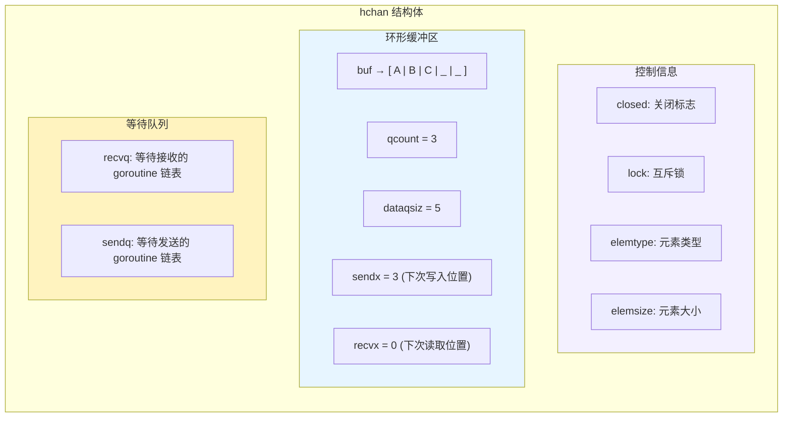
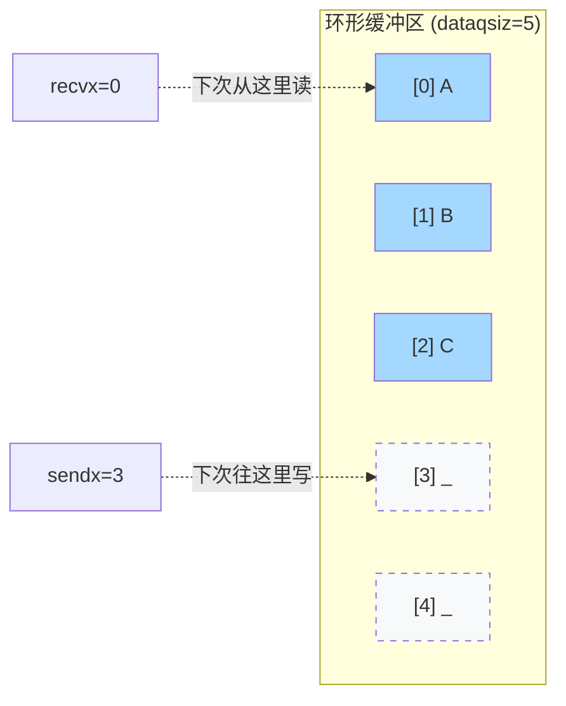
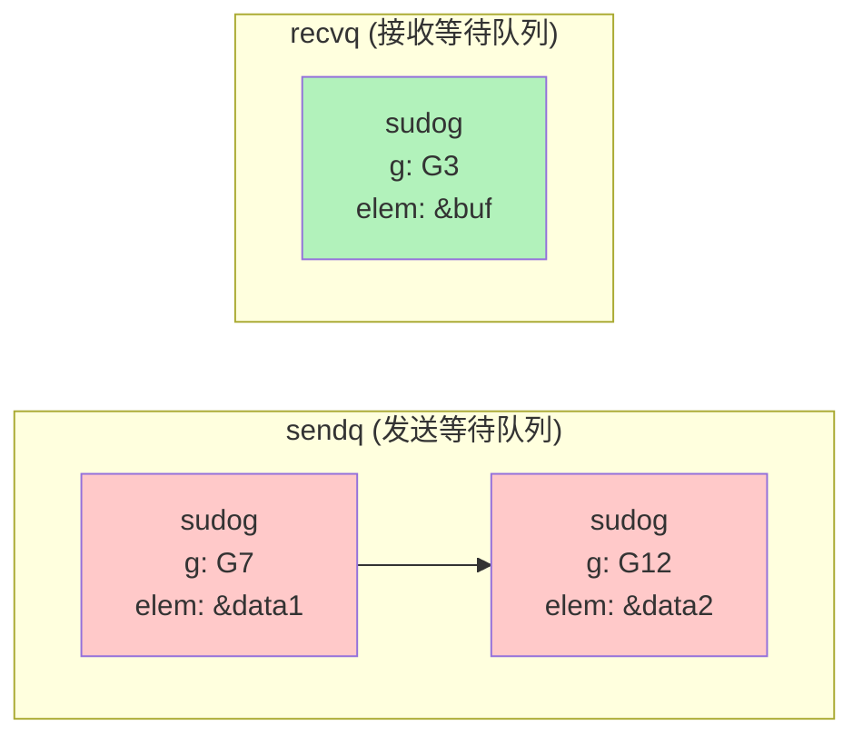
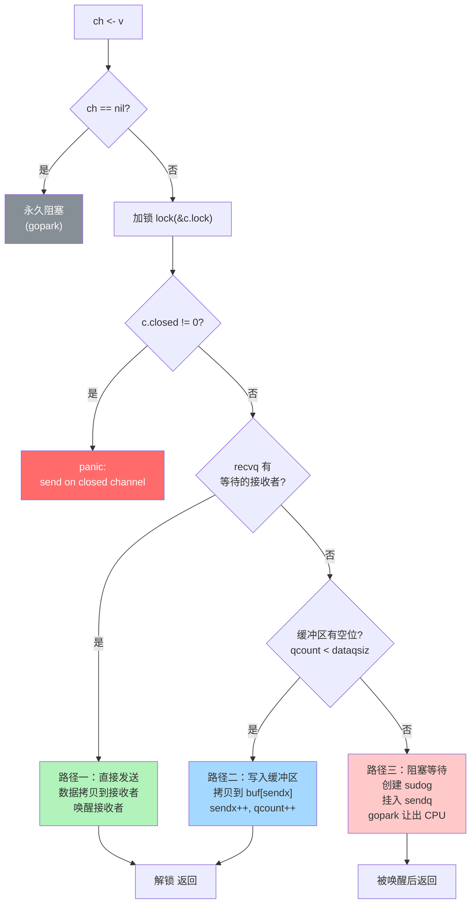
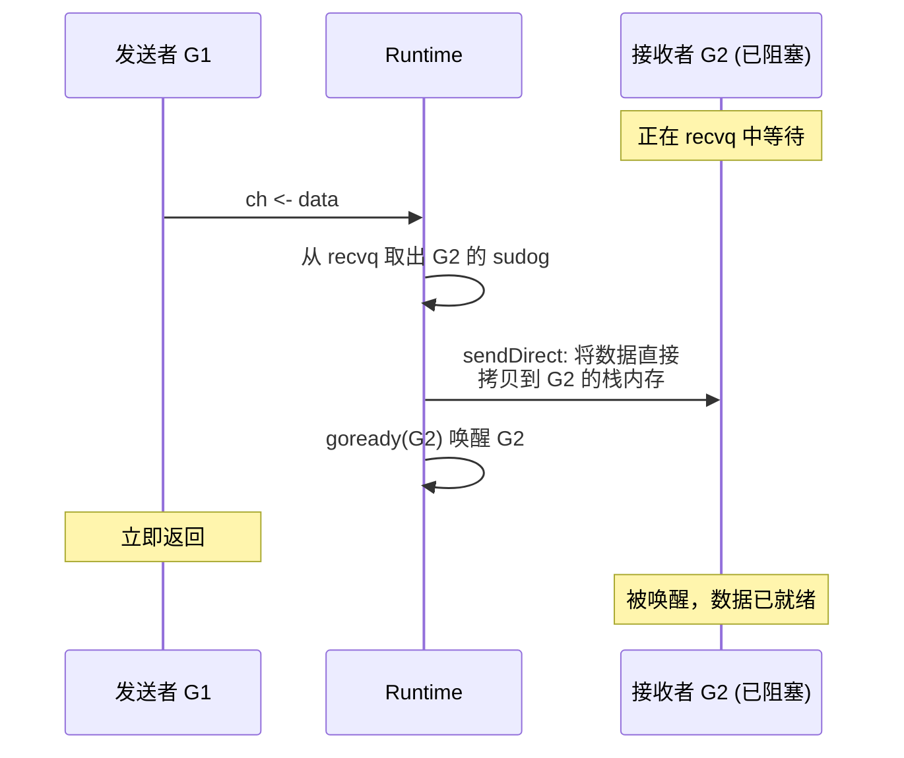
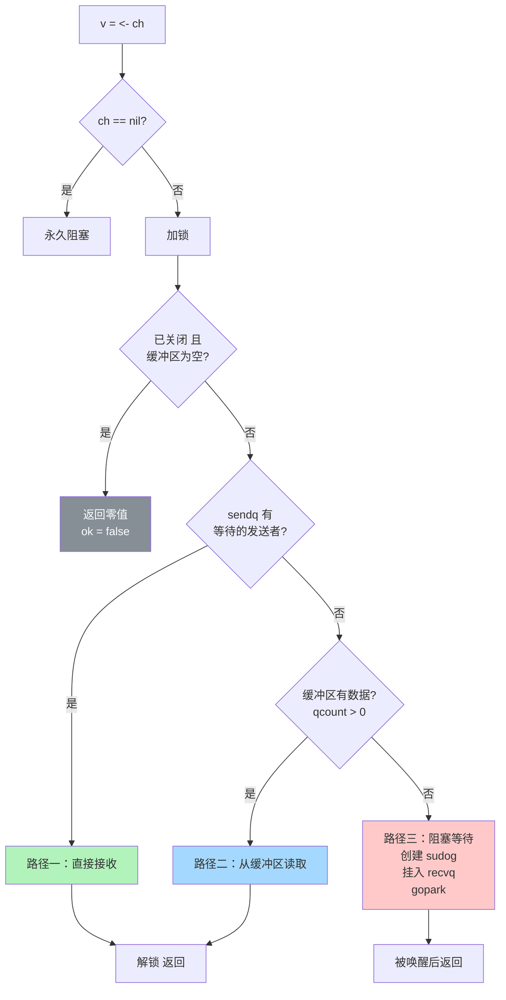
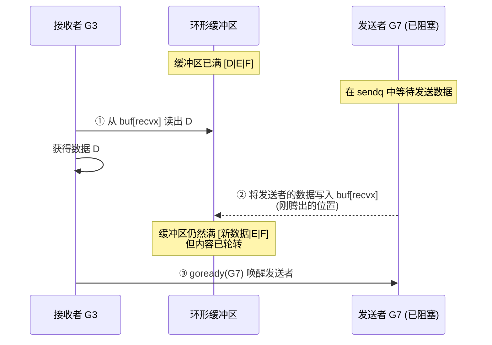
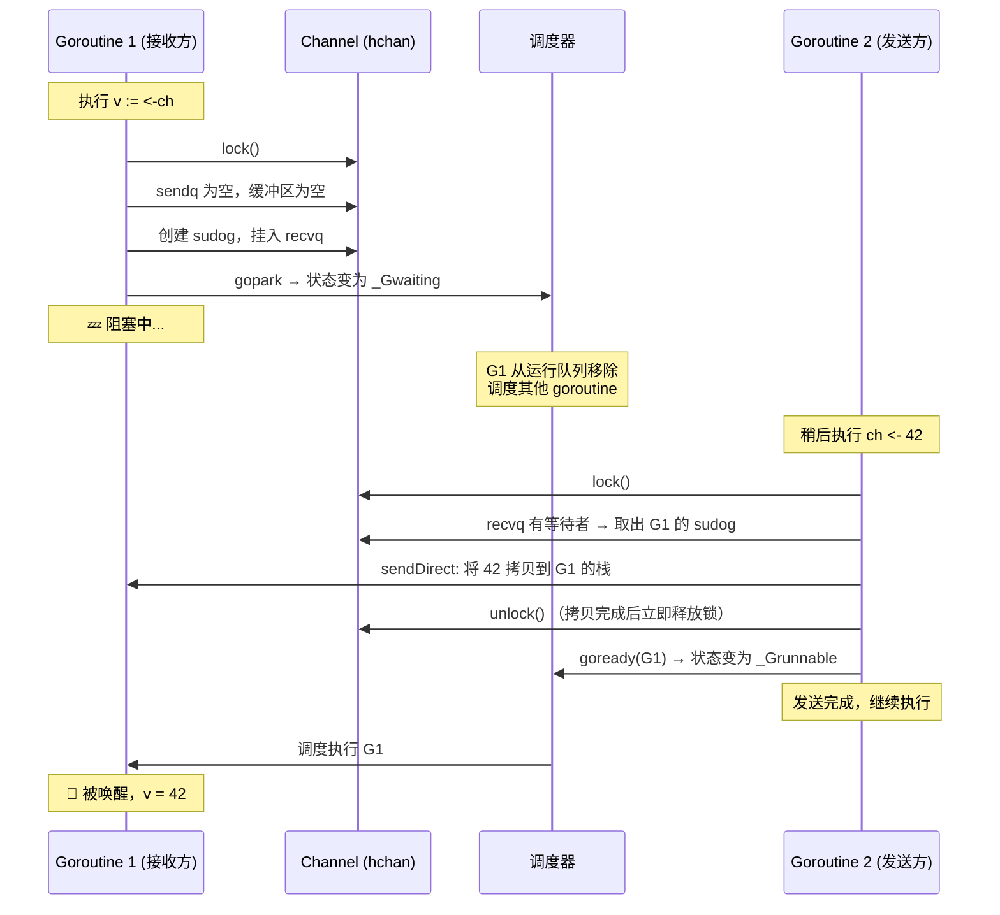
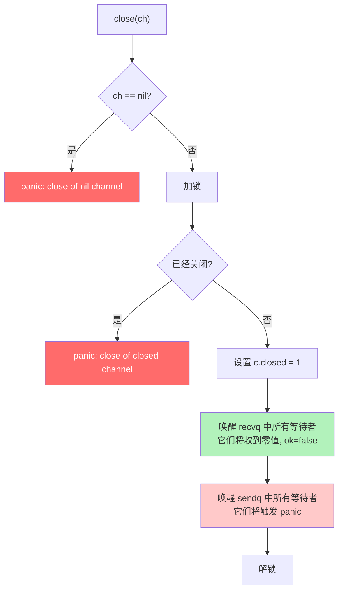
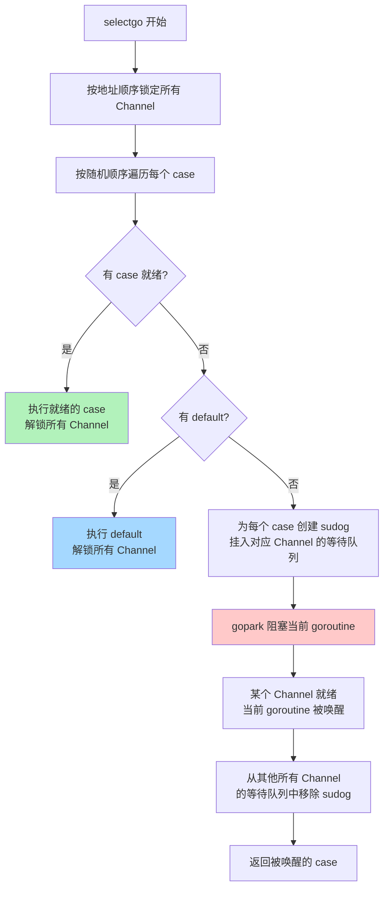

> **核心观点**：Channel 并非魔法——它的底层是一个**带互斥锁的环形队列**加上**两个 goroutine 等待队列**。理解 `hchan` 的内存布局、发送/接收的三条执行路径、以及 `gopark`/`goready` 的阻塞唤醒机制，是真正掌握 Go 并发编程的钥匙。

## 一、Channel：Go 并发的核心通信原语

Go 的并发哲学源自 Tony Hoare 在 1978 年提出的 **CSP（Communicating Sequential Processes）** 模型，浓缩为一句话：

> *Do not communicate by sharing memory; instead, share memory by communicating.*
>
> 不要通过共享内存来通信，而是通过通信来共享内存。

Channel 就是这句话的直接体现。它是 goroutine 之间传递数据和同步执行的管道，扮演着 Go 并发世界中"信使"的角色。


与互斥锁（Mutex）不同，Channel 不是保护共享资源的"门卫"，而是数据所有权的"转移通道"——当数据通过 Channel 发送后，发送方不应再访问该数据，接收方获得独占所有权。

## 二、基础用法：从表面理解 Channel

### 创建 Channel

Channel 通过内置的 `make` 函数创建：

```go
ch1 := make(chan int)      // 无缓冲 Channel
ch2 := make(chan string, 5) // 有缓冲 Channel，容量为 5
```

### 无缓冲 vs 有缓冲

这是理解 Channel 行为的第一道分水岭：

| 特性       | 无缓冲 Channel (`make(chan T)`)          | 有缓冲 Channel (`make(chan T, N)`)           |
| ---------- | ---------------------------------------- | -------------------------------------------- |
| 内部缓冲区 | 无（容量为 0）                           | 有（容量为 N）                               |
| 发送行为   | 阻塞，直到有接收者                       | 缓冲区未满时立即返回；满了则阻塞             |
| 接收行为   | 阻塞，直到有发送者                       | 缓冲区非空时立即返回；空了则阻塞             |
| 同步语义   | **同步**：发送和接收必须同时就绪（握手） | **异步**：发送者和接收者可以在一定程度上解耦 |
| 典型用途   | 信号通知、同步协调                       | 削峰填谷、批量处理                           |

一个直观的比喻：

- **无缓冲 Channel** 像面对面递东西——你伸出手，对方必须同时伸手接住，否则双方都得等着。
- **有缓冲 Channel** 像传送带——你可以先把东西放上去就走，对方随后来取；但传送带满了，你也得等。

### 基本操作

```go
// 发送
ch <- 42

// 接收
v := <-ch

// 接收并检查 Channel 是否关闭
v, ok := <-ch  // ok 为 false 表示 Channel 已关闭且缓冲区为空

// 关闭 Channel
close(ch)

// 遍历 Channel（直到关闭）
for v := range ch {
    fmt.Println(v)
}
```

看上去很简单？那我们现在就揭开表面，看看这些操作背后到底发生了什么。

## 三、hchan：揭开 Channel 的底层面纱

当你写下 `make(chan int, 5)` 时，Go Runtime 会调用 `runtime.makechan` 函数，在**堆**上分配一个 `hchan` 结构体。所有 Channel 的行为，都围绕这个结构体展开。

### hchan 结构体

以下是 `hchan` 的核心字段（源码位于 `runtime/chan.go`）：

```go
type hchan struct {
    qcount   uint           // 缓冲区中当前的元素个数
    dataqsiz uint           // 缓冲区容量（即 make 时指定的 size）
    buf      unsafe.Pointer // 指向环形缓冲区的指针
    elemsize uint16         // 单个元素的大小（字节）
    closed   uint32         // 关闭标志（0=未关闭，1=已关闭）
    elemtype *_type         // 元素类型信息（用于数据拷贝和 GC）
    sendx    uint           // 下一次发送的位置（环形索引）
    recvx    uint           // 下一次接收的位置（环形索引）
    recvq    waitq          // 等待接收的 goroutine 队列
    sendq    waitq          // 等待发送的 goroutine 队列
    lock     mutex          // 保护 hchan 所有字段的互斥锁
}
```

每个字段都有明确的职责，组合起来构成了 Channel 的完整运行时状态：



### 环形缓冲区

有缓冲 Channel 的核心是一个**环形队列（Ring Buffer）**，由 `buf` 指向的连续内存块实现：



工作方式：

- **写入**：将数据拷贝到 `buf[sendx]`，然后 `sendx = (sendx + 1) % dataqsiz`，`qcount++`
- **读取**：从 `buf[recvx]` 拷贝数据，然后 `recvx = (recvx + 1) % dataqsiz`，`qcount--`
- **判满**：`qcount == dataqsiz`
- **判空**：`qcount == 0`

当索引到达末尾时自动绕回起始位置，形成"环形"效果。对于**无缓冲 Channel**，`dataqsiz = 0`，`buf` 不分配内存。

### 等待队列与 sudog

当 goroutine 因 Channel 操作而阻塞时，它会被包装成一个 `sudog` 结构体，挂到对应的等待队列上：

```go
type waitq struct {
    first *sudog    // 队列头
    last  *sudog    // 队列尾
}

type sudog struct {
    g     *g              // 被阻塞的 goroutine
    next  *sudog          // 链表下一个节点
    prev  *sudog          // 链表上一个节点
    elem  unsafe.Pointer  // 指向发送/接收的数据
    c     *hchan          // 所属的 Channel
    // ... 其他字段
}
```

`sudog` 是 goroutine 与 Channel 之间的"连接器"——它同时记录了是哪个 goroutine 在等待，以及它要发送/接收的数据在哪里。



### makechan：Channel 的内存分配策略

`runtime.makechan` 根据元素类型采取不同的分配策略：

| 场景                  | 分配方式                              | 原因                            |
| --------------------- | ------------------------------------- | ------------------------------- |
| 无缓冲 / 元素大小为 0 | 仅分配 `hchan` 本身                   | 不需要缓冲区                    |
| 元素不含指针          | **一次分配** `hchan` + `buf` 连续内存 | GC 无需扫描 buf，合并分配更高效 |
| 元素包含指针          | **两次分配** `hchan` 和 `buf` 分开    | GC 需要单独扫描 buf 中的指针    |

这是一个典型的运行时优化：减少内存分配次数，同时配合 GC 的扫描策略。

## 四、发送操作全流程：ch <- v

当执行 `ch <- v` 时，编译器将其转换为 `runtime.chansend` 调用。整个发送流程分为**三条路径**，优先级从高到低：



### 路径一：直接发送（最快路径）

**条件**：`recvq` 中有正在等待的接收者。

这是最高效的情况——有一个 goroutine 已经在等着收数据了。Runtime 会做一件精妙的事：



**关键细节**：数据是通过 `sendDirect` **直接从发送者的栈拷贝到接收者的栈**，完全绕过了缓冲区。这意味着：

1. 即使是有缓冲 Channel，如果缓冲区为空且有接收者在等待，也走直接发送路径
2. 这是一次**跨 goroutine 的栈内存写入**——Go Runtime 可以这么做，因为接收者此时处于 parked 状态，其栈不会移动

### 路径二：写入缓冲区

**条件**：`recvq` 为空，且缓冲区未满（`qcount < dataqsiz`）。

这是有缓冲 Channel 的常规路径：

```go
// 伪代码
qp := chanbuf(c, c.sendx)     // 计算 buf[sendx] 的地址
typedmemmove(c.elemtype, qp, ep) // 将数据拷贝到缓冲区
c.sendx++
if c.sendx == c.dataqsiz {
    c.sendx = 0                // 环形绕回
}
c.qcount++
unlock(&c.lock)
```

数据被拷贝到环形缓冲区的下一个可写位置，发送者立即返回。注意这里是**值拷贝**——Channel 传递的永远是数据的副本。

### 路径三：阻塞等待

**条件**：无等待的接收者，且缓冲区已满（或无缓冲 Channel）。

发送者无处安放数据，只能阻塞自己：

```go
// 伪代码
mysg := acquireSudog()        // 从缓存池获取 sudog
mysg.elem = ep                // 记录要发送的数据地址
mysg.g = getg()               // 记录当前 goroutine
c.sendq.enqueue(mysg)         // 挂入发送等待队列
gopark(...)                   // 让出 CPU，切换到其他 goroutine
// ---- 此处暂停执行，直到被唤醒 ----
releaseSudog(mysg)            // 唤醒后，释放 sudog
```

关键要点：`sudog.elem` 保存的是**发送数据的指针**。当接收者到来时，可以直接从这个地址拷贝数据，而无需发送者参与——因为发送者此时根本不在运行。

## 五、接收操作全流程：v = <- ch

接收操作由 `runtime.chanrecv` 实现，同样有三条路径：



### 路径一：直接接收（sendq 有等待者）

**条件**：`sendq` 中有正在等待的发送者。

这种情况意味着：

- **无缓冲 Channel**：直接从发送者的栈拷贝数据到接收者（与发送路径一对称）
- **有缓冲 Channel**：此时缓冲区**必然已满**（否则发送者不会阻塞）。需要执行一个精巧的两步操作：



**为什么有缓冲 Channel 不能直接从发送者拷贝？** 因为缓冲区里还有更早的数据等着被读，必须维护 FIFO（先进先出）顺序。所以先读缓冲区头部的旧数据给接收者，再把发送者的新数据放到缓冲区中。

### 路径二：从缓冲区读取

**条件**：`sendq` 为空，缓冲区有数据（`qcount > 0`）。

```go
// 伪代码
qp := chanbuf(c, c.recvx)         // 计算 buf[recvx] 的地址
typedmemmove(c.elemtype, ep, qp)   // 拷贝数据到接收者
typedmemclr(c.elemtype, qp)        // 清零缓冲区槽位（帮助 GC）
c.recvx++
if c.recvx == c.dataqsiz {
    c.recvx = 0                    // 环形绕回
}
c.qcount--
unlock(&c.lock)
```

注意 `typedmemclr` 操作：读取后会将缓冲区对应位置清零。这不是为了正确性，而是为了帮助 GC——如果元素包含指针，清零可以让 GC 知道这个位置不再引用任何对象，避免内存泄漏。

### 路径三：阻塞等待

**条件**：无等待的发送者，缓冲区为空。

与发送的路径三对称：创建 sudog，挂入 `recvq`，调用 `gopark` 阻塞当前 goroutine。

## 六、阻塞与唤醒的本质：gopark 与 goready

Channel 之所以能实现"发不出去就等着，收不到就等着"的行为，核心依赖于 Go Runtime 调度器提供的两个原语。

### gopark：让出 CPU

当 goroutine 需要阻塞时，Runtime 调用 `gopark`：

```go
// 伪代码：gopark 的核心逻辑
func gopark(unlockf func(), reason waitReason) {
    gp := getg()              // 获取当前 goroutine
    gp.status = _Gwaiting     // 状态：运行中 → 等待中
    gp.waitreason = reason    // 记录等待原因（如 "chan send"）
    unlockf()                 // 释放 Channel 的锁
    schedule()                // 调用调度器，切换到其他 goroutine
    // ---- 此处不会继续执行，直到被 goready 唤醒 ----
}
```

关键点：

1. goroutine 状态从 `_Grunning` 变为 `_Gwaiting`，**不再参与调度**（运行中的 G 本就不在运行队列中，此时转为等待状态，直到被唤醒）
2. 释放 Channel 的锁（这个顺序很重要——先设好状态，再释放锁，防止竞态）
3. 调用 `schedule()` 让当前线程（M）去执行别的 goroutine

### goready：重新调度

当另一端的 goroutine 到来，需要唤醒等待者时，Runtime 调用 `goready`：

```go
// 伪代码：goready 的核心逻辑
func goready(gp *g) {
    gp.status = _Grunnable    // 状态：等待中 → 可运行
    runqput(getg().m.p, gp)   // 放入当前 P 的本地运行队列
    wakep()                   // 如果有空闲的 P，唤醒它
}
```

关键点：

1. goroutine 状态从 `_Gwaiting` 变为 `_Grunnable`
2. 被放回调度器的运行队列，等待被某个线程（M）执行
3. `goready` 并不立即执行被唤醒的 goroutine——它只是把它标记为"可运行"

### 完整的阻塞-唤醒时序

以一次无缓冲 Channel 通信为例，看完整的流程：



整个过程中的**锁持有时间非常短**——只在操作 hchan 字段时持锁，数据拷贝完成后立刻释放。这是 Channel 高效的关键之一。

## 七、关闭 Channel：close(ch)

### close 的执行流程

`runtime.closechan` 的核心逻辑：



注意两个关键行为：

1. **等待接收的 goroutine** 被唤醒后，收到类型零值，`ok` 标志为 `false`
2. **等待发送的 goroutine** 被唤醒后，检测到 Channel 已关闭，触发 `panic`

### 边界行为总结

Channel 在不同状态下的操作结果，是面试高频考点：

| 操作      | nil Channel  | 已关闭 Channel                     | 正常 Channel   |
| --------- | ------------ | ---------------------------------- | -------------- |
| `ch <- v` | **永久阻塞** | **panic**                          | 阻塞或成功发送 |
| `<-ch`    | **永久阻塞** | 返回缓冲区数据；缓冲区空则返回零值 | 阻塞或成功接收 |
| `close()` | **panic**    | **panic**                          | 成功关闭       |

**设计准则**：

- 只由**发送方**关闭 Channel，不要在接收方关闭
- 不要关闭一个已经关闭的 Channel
- 不要向一个已经关闭的 Channel 发送数据

## 八、select 多路复用原理

`select` 是 Channel 的多路复用器，允许一个 goroutine 同时等待多个 Channel 操作：

```go
select {
case v := <-ch1:
    fmt.Println("从 ch1 收到", v)
case ch2 <- 42:
    fmt.Println("发送到 ch2")
case <-time.After(time.Second):
    fmt.Println("超时")
default:
    fmt.Println("没有 Channel 就绪")
}
```

看似简单的语法，背后是 `runtime.selectgo` 一个相当复杂的函数。

### 编译器转换

编译器会将 `select` 语句转换为不同的运行时调用：

| select 形态          | 编译器优化                       |
| -------------------- | -------------------------------- |
| 空 select `select{}` | 直接调用 `block()` 永久阻塞      |
| 单 case + default    | 转换为 `if` + 非阻塞的 send/recv |
| 单 case 无 default   | 转换为普通的 send/recv 调用      |
| 多 case              | 调用 `runtime.selectgo`          |

### selectgo 核心逻辑

`selectgo` 是 select 的核心实现，处理多 case 的一般情况。它的流程可以分为三个阶段：

**阶段一：随机轮询**

```go
// 伪代码
pollorder := randomPermutation(cases)  // 将 case 随机排列
```

**为什么要随机化？** 为了公平性。如果总是按固定顺序检查，排在前面的 case 会被优先选中，造成**饥饿**——后面的 case 永远得不到执行。

**阶段二：确定锁顺序**

```go
lockorder := sortByChannelAddress(cases)  // 按 Channel 地址排序
lockAllChannels(lockorder)                // 按顺序加锁
```

**为什么按地址排序加锁？** 因为 select 可能涉及多个 Channel，需要同时获取多把锁。如果不按固定顺序加锁，两个 goroutine 的 select 涉及相同的 Channel 时可能会**死锁**。按地址升序加锁是经典的死锁预防策略。

**阶段三：执行**



阶段三的关键细节：

1. **按随机顺序**遍历所有 case，检查是否可以立即执行
2. 如果有多个 case 同时就绪，选择随机遍历中**第一个碰到的**
3. 如果没有 case 就绪且有 `default`，走 `default` 分支
4. 如果没有 case 就绪且没有 `default`：
   - 为**每个 case** 创建一个 sudog
   - 将 sudog 分别挂入各个 Channel 的 `sendq` 或 `recvq`
   - 调用 `gopark` 阻塞
   - 当任一 Channel 就绪时，当前 goroutine 被唤醒
   - 从**所有其他 Channel** 的等待队列中移除自己的 sudog（防止重复唤醒）

这就是为什么一个 goroutine 在 select 中等待 N 个 Channel 时，会在 N 个等待队列中同时出现——被唤醒后还需要"清理现场"。

## 九、常见的 Channel 使用模式

### 模式一：信号通知（Done Channel）

用无缓冲或容量为 1 的 Channel 传递"完成"信号：

```go
done := make(chan struct{}) // struct{} 不占内存

go func() {
    defer close(done) // 任务完成时关闭
    doWork()
}()

<-done // 阻塞等待任务完成
```

`chan struct{}` 是惯用写法——传递的是信号本身，不需要携带数据，零字节不浪费内存。

### 模式二：超时控制

结合 `select` 和 `time.After` 实现超时：

```go
select {
case result := <-ch:
    fmt.Println("收到结果:", result)
case <-time.After(3 * time.Second):
    fmt.Println("超时!")
}
```

`time.After` 返回一个 Channel，在指定时间后发送当前时间。配合 select，如果主 Channel 在 3 秒内没有数据，就走超时分支。

### 模式三：限流器（Semaphore）

有缓冲 Channel 天然就是一个**计数信号量**：

```go
sem := make(chan struct{}, 10) // 最多允许 10 个并发

for _, task := range tasks {
    sem <- struct{}{} // 获取令牌（满了就阻塞）
    go func(t Task) {
        defer func() { <-sem }() // 归还令牌
        process(t)
    }(task)
}
```

缓冲区容量就是最大并发数。满了就阻塞等待，有人完成释放位置后才能继续。

### 模式四：nil Channel 动态开关

`nil` Channel 的特殊行为（永久阻塞）在 `select` 中有妙用——动态禁用某个 case：

```go
var ch1, ch2 <-chan int
ch1 = producer1()
ch2 = producer2()

for ch1 != nil || ch2 != nil {
    select {
    case v, ok := <-ch1:
        if !ok {
            ch1 = nil // 关闭后设为 nil，此 case 永远不再被选中
            continue
        }
        process(v)
    case v, ok := <-ch2:
        if !ok {
            ch2 = nil
            continue
        }
        process(v)
    }
}
```

将 Channel 变量设为 `nil` 后，对应的 select case 在下次循环中会被自动"禁用"（因为对 nil Channel 操作永远阻塞，select 永远不会选中它），无需修改 select 结构。

### 模式五：扇入（Fan-in）

将多个 Channel 的数据汇聚到一个 Channel：

```go
func fanIn(channels ...<-chan int) <-chan int {
    out := make(chan int)
    var wg sync.WaitGroup
    
    for _, ch := range channels {
        wg.Add(1)
        go func(c <-chan int) {
            defer wg.Done()
            for v := range c {
                out <- v
            }
        }(ch)
    }
    
    go func() {
        wg.Wait()
        close(out) // 所有输入 Channel 关闭后，关闭输出 Channel
    }()
    
    return out
}
```

每个输入 Channel 由一个独立的 goroutine 读取并转发到输出 Channel，最终所有输入关闭后输出也随之关闭。

## 十、性能特征与最佳实践

### Channel 的开销在哪里

| 操作           | 开销来源                      |
| -------------- | ----------------------------- |
| 每次 send/recv | 互斥锁加锁/解锁               |
| 数据传递       | 至少一次 `memmove`（值拷贝）  |
| 阻塞/唤醒      | `gopark`/`goready` 涉及调度器 |
| select 多 case | 多个锁的获取/释放，sudog 分配 |

Channel 不是零开销的抽象。在极端高性能场景下（如每秒千万次操作），Channel 的锁竞争可能成为瓶颈，此时可能需要考虑 `sync/atomic` 或无锁数据结构。

### 选型建议

| 场景                        | 推荐方案              |
| --------------------------- | --------------------- |
| goroutine 间传递数据所有权  | Channel               |
| 保护共享数据结构            | `sync.Mutex`          |
| 简单的计数器/标志位         | `sync/atomic`         |
| 多个 goroutine 等待同一事件 | `close(channel)` 广播 |
| 需要取消/超时控制           | `context.Context`     |

## 十一、总结

本文从 Channel 的基础用法出发，逐层深入到 Runtime 实现层面：

| 层次     | 内容                                                             |
| -------- | ---------------------------------------------------------------- |
| **表面** | `make`、`<-`、`close`——简洁的语法糖                              |
| **结构** | `hchan` = 环形缓冲区 + 两个等待队列 + 互斥锁                     |
| **流程** | 发送/接收各三条路径：直接传递 → 缓冲区 → 阻塞                    |
| **调度** | `gopark` 让出 CPU，`goready` 重回运行队列——与 GMP 调度器深度集成 |
| **多路** | `selectgo` 用随机轮询保证公平，用地址排序预防死锁                |

Channel 的设计体现了 Go 一贯的工程哲学：**接口简单，内部精巧**。表面上你只需要 `<-` 一个箭头，背后 Runtime 帮你处理了锁、调度、内存拷贝、GC 协作等所有复杂性。

理解这些底层机制，不是为了自己重写一个 Channel，而是为了在遇到并发问题时——无论是性能瓶颈、死锁排查、还是架构选型——能够做出有据可依的判断。
