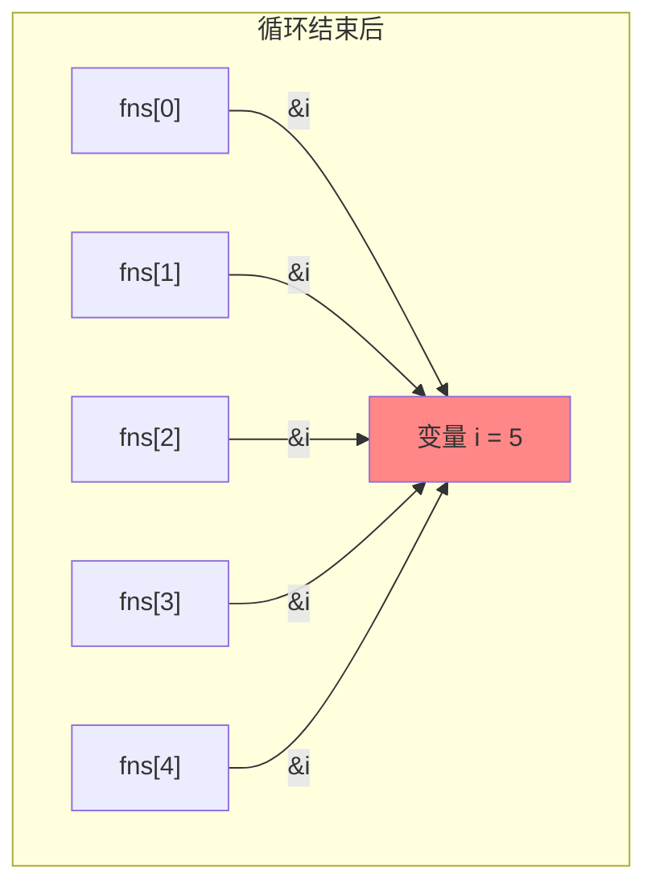
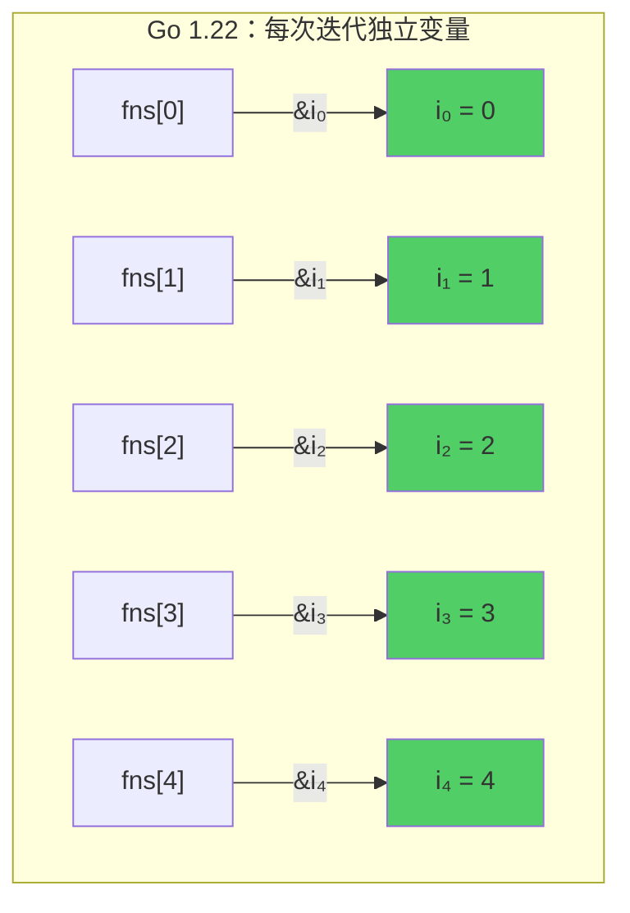
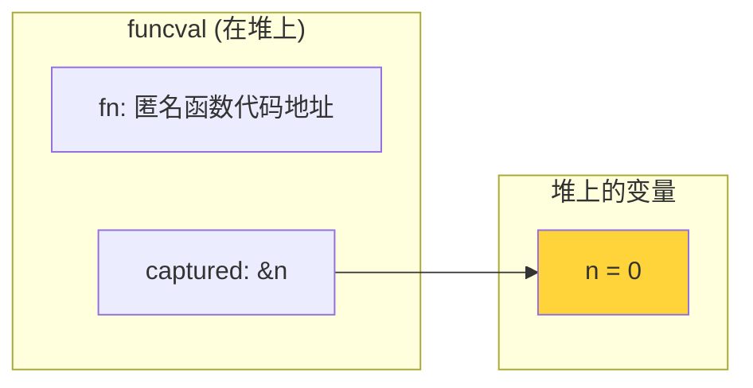
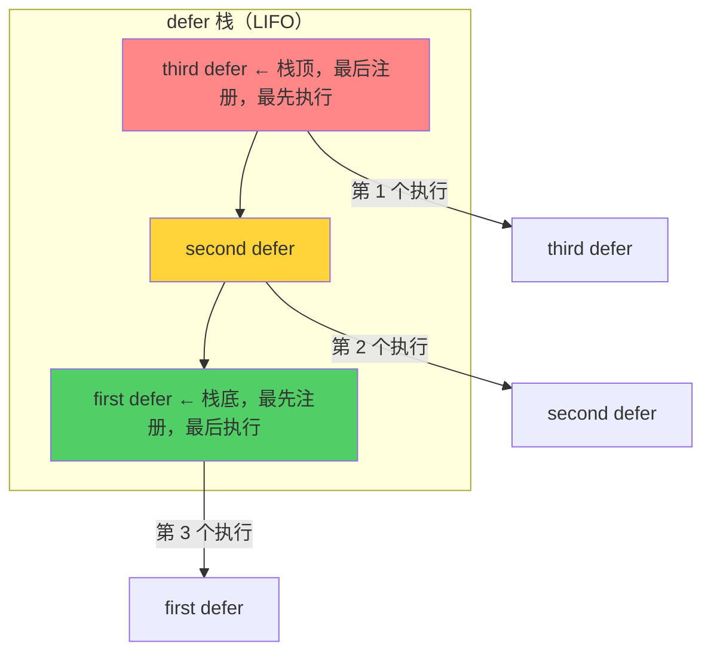
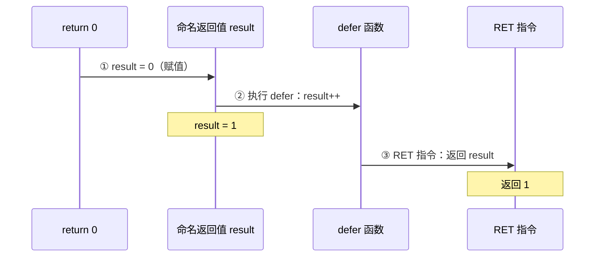
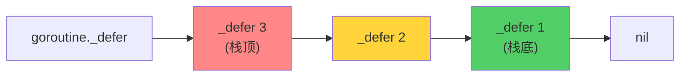
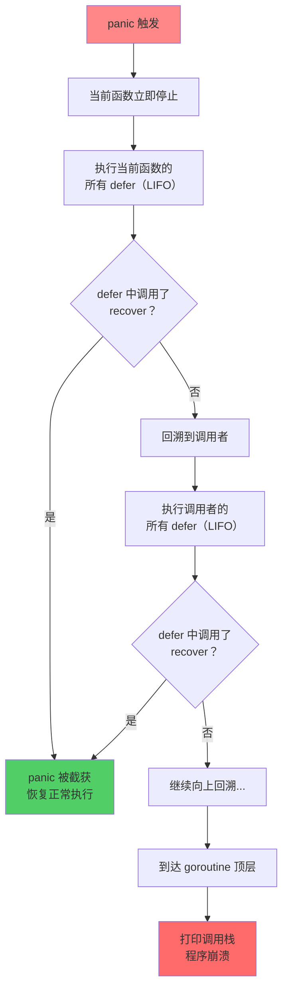
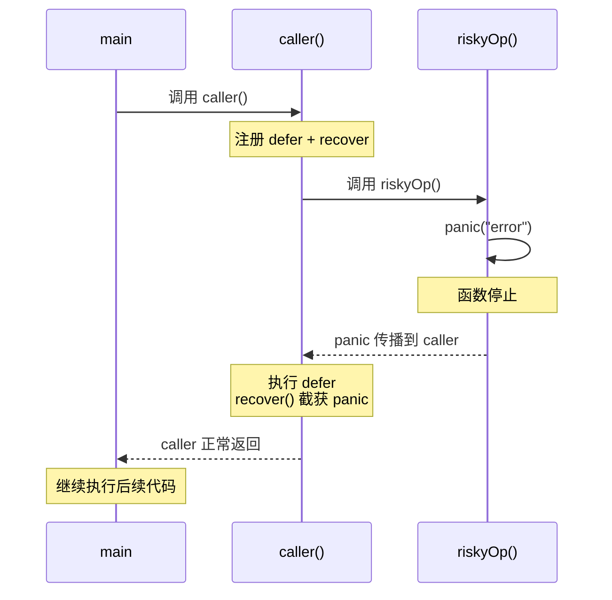

> **核心观点**：闭包让函数"记住"创建时的环境，defer 让资源清理"确定发生"，panic/recover 提供了最后的安全网。这三个特性看似简单，但它们的底层行为充满微妙之处——理解这些细节，是写出健壮 Go 代码的关键。

## 一、闭包：函数与环境的结合

### 什么是闭包

闭包（Closure）是一个**能够访问其定义时所在作用域中变量的函数**。用一句话概括：

> 闭包 = 函数 + 它引用的外部变量

在 Go 中，匿名函数可以引用外层函数的局部变量。即使外层函数已经返回，这些变量依然存活：

```go
func counter() func() int {
    n := 0
    return func() int {
        n++ // 引用了外部变量 n
        return n
    }
}

func main() {
    c := counter()
    fmt.Println(c()) // 1
    fmt.Println(c()) // 2
    fmt.Println(c()) // 3
}
```

`counter()` 返回了一个匿名函数，这个匿名函数引用了外部变量 `n`。每次调用 `c()`，`n` 都会递增。`counter` 函数早已返回，但 `n` 没有被回收——因为闭包持有对它的引用。

### 变量捕获：引用而非值

理解闭包最关键的一点：**Go 闭包捕获的是变量本身（通过指针引用），而非变量的值拷贝。**

```go
func main() {
    x := 1
    f := func() {
        fmt.Println(x) // 捕获变量 x 的地址
    }
    x = 100
    f() // 输出：100（不是 1）
}
```

```mermaid
graph LR
    subgraph 闭包创建时
        F1["匿名函数 f"] -->|"持有 &x"| X1["x = 1"]
    end

    subgraph "x = 100 之后"
        F2["匿名函数 f"] -->|"持有 &x"| X2["x = 100"]
    end

    闭包创建时 -->|"x = 100"| "x = 100 之后"

    style X1 fill:#74c0fc
    style X2 fill:#ff8787
```

闭包 `f` 并没有在创建时"拍快照"保存 `x = 1`，而是持有 `x` 的地址。当 `x` 被修改为 100 后，`f()` 通过地址读到的就是 100。

这种机制可以和"共享文档"类比：闭包拿到的是一个文档的**链接**，而不是**副本**。谁改了文档，通过链接看到的内容也会变。

### 经典陷阱：for 循环中的闭包

这是 Go 面试的高频考题，也是实际开发中最容易踩的坑：

```go
// Go 1.21 及以前的版本
func main() {
    fns := make([]func(), 5)
    for i := 0; i < 5; i++ {
        fns[i] = func() {
            fmt.Print(i, " ")
        }
    }
    for _, f := range fns {
        f()
    }
}
// 输出：5 5 5 5 5（不是 0 1 2 3 4）
```

**为什么？**

在 Go 1.21 及以前，整个 for 循环只有**一个**变量 `i`。5 个闭包共享同一个 `i` 的地址。循环结束后 `i = 5`，所有闭包打印的都是 5。



5 个闭包 → 同一个地址 → 同一个值 5。

**传统解决方案**有两种：

```go
// 方案 1：通过函数参数传值（创建值拷贝）
for i := 0; i < 5; i++ {
    fns[i] = func(n int) func() {
        return func() { fmt.Print(n, " ") }
    }(i) // i 的当前值被拷贝给参数 n
}

// 方案 2：在循环体内创建同名局部变量
for i := 0; i < 5; i++ {
    i := i // 新建局部变量 i，遮蔽循环变量 i
    fns[i] = func() {
        fmt.Print(i, " ")
    }
}
```

两种方案的核心思路相同：让每个闭包引用各自独立的变量，打破"共享同一地址"的局面。

### Go 1.22 的破局：循环变量语义变更

Go 1.22 做出了一项语言级别的重大变更：**每次循环迭代都会创建新的循环变量。**

```go
// Go 1.22+（go.mod 中 go >= 1.22）
func main() {
    fns := make([]func(), 5)
    for i := 0; i < 5; i++ {
        fns[i] = func() {
            fmt.Print(i, " ")
        }
    }
    for _, f := range fns {
        f()
    }
}
// 输出：0 1 2 3 4 ✓
```



这个变更由 `go.mod` 中的 `go` 指令版本控制。如果模块声明 `go 1.22` 或更高版本，编译器会自动为每次迭代创建独立的循环变量。该特性在 Go 1.21 中可通过 `GOEXPERIMENT=loopvar` 提前体验。

### 闭包的底层实现

当编译器遇到闭包时，主要做两件事：

**1. 逃逸分析：将被捕获的变量从栈移到堆**

```bash
$ go build -gcflags="-m" main.go
./main.go:4:2: moved to heap: n
./main.go:5:9: func literal escapes to heap
```

当编译器发现变量 `n` 被返回的闭包引用时，`n` 必须在 `counter` 函数返回后依然存活，因此不能放在栈上（栈帧会随函数返回而销毁），而是分配在堆上。

**2. 构造 funcval 结构体**

闭包在运行时被表示为一个 `funcval` 结构体，包含函数指针和捕获变量的指针：

```go
// Go 运行时中闭包的底层表示（简化）
type funcval struct {
    fn uintptr // 函数代码入口地址
    // 后面紧跟捕获的变量指针
}
```

以 `counter` 函数为例：



调用闭包时，Go 的 ABI 约定通过特定寄存器（amd64 上是 DX 寄存器）传递 `funcval` 的地址，闭包代码通过固定偏移量访问捕获的变量：

```
// 伪汇编：调用闭包时
MOVQ 8(DX), AX   // 从 funcval+8 加载 &n
INCQ (AX)         // n++
MOVQ (AX), ret    // return n
```

**简单记忆**：闭包 = 代码指针 + 数据指针。代码是共享的，数据是独立的（每次创建闭包都会生成新的 funcval 实例）。

## 二、defer：确定执行的清理者

### 基本语义：后进先出

`defer` 将函数调用推入一个**后进先出（LIFO）栈**，在当前函数返回前依次执行：

```go
func main() {
    fmt.Println("start")
    defer fmt.Println("first defer")
    defer fmt.Println("second defer")
    defer fmt.Println("third defer")
    fmt.Println("end")
}
```

输出：

```
start
end
third defer
second defer
first defer
```



LIFO 的设计是有意为之的：后获取的资源往往依赖先获取的资源，后进先出保证资源按正确的逆序释放。

### 规则一：参数在注册时求值

这是 defer 最容易出错的地方。**defer 语句的参数在 defer 注册时立即求值**，而不是等到执行时才求值：

```go
func main() {
    x := 0
    defer fmt.Println("defer:", x) // x 在此刻求值为 0
    x = 100
    fmt.Println("main:", x)
}
// 输出：
// main: 100
// defer: 0（不是 100！）
```

`fmt.Println("defer:", x)` 中的 `x` 在 `defer` 语句执行时就被求值并保存了，后续对 `x` 的修改不会影响已经保存的值。

**但是，如果 defer 调用的是闭包，闭包内的变量引用依然是动态的：**

```go
func main() {
    x := 0
    defer func() {
        fmt.Println("defer:", x) // 闭包通过指针引用 x
    }()
    x = 100
}
// 输出：defer: 100
```

为什么结果不同？因为 `func() { ... }()` 整体作为 defer 的函数，它没有参数需要求值。闭包内部的 `x` 是对外部变量的引用，执行时才读取当前值。

| 写法                      | 求值时机              | 结果           |
| ------------------------- | --------------------- | -------------- |
| `defer f(x)`              | x 在 defer 注册时求值 | 使用注册时的值 |
| `defer func() { f(x) }()` | x 在 defer 执行时读取 | 使用最新的值   |

### 规则二：defer 与命名返回值

defer 可以**读取并修改**命名返回值，这是 Go 中一个强大但容易被忽视的特性：

```go
func f() (result int) {
    defer func() {
        result++ // 修改命名返回值
    }()
    return 0
}

func main() {
    fmt.Println(f()) // 输出：1（不是 0）
}
```

要理解这个行为，需要知道 `return` 语句的**真正执行顺序**：



`return x` 不是一个原子操作，它展开为三步：

1. **赋值**：将 `x` 赋给命名返回值
2. **执行 defer**：此时 defer 中的闭包可以修改命名返回值
3. **RET**：真正返回

这个特性在错误处理中非常实用：

```go
func doSomething() (err error) {
    f, err := os.Open("file.txt")
    if err != nil {
        return err
    }
    defer func() {
        // 如果 Close 出错且之前没有其他错误，记录 Close 的错误
        if cerr := f.Close(); cerr != nil && err == nil {
            err = cerr
        }
    }()
    // ... 处理文件 ...
    return nil
}
```

### 规则三：defer 在函数级别而非代码块级别

defer 绑定的是**整个函数**的生命周期，不是代码块：

```go
func processItems(items []string) {
    for _, item := range items {
        f, err := os.Open(item)
        if err != nil {
            continue
        }
        defer f.Close() // ⚠️ 不会在每次循环结束时执行！
        // ... 处理文件 ...
    }
    // 所有文件在这里才关闭
}
```

如果 `items` 有 1000 个文件，这 1000 个文件句柄会一直持有到 `processItems` 返回。正确的做法是提取为独立函数：

```go
func processItems(items []string) {
    for _, item := range items {
        processOneItem(item) // defer 在这个函数返回时执行
    }
}

func processOneItem(item string) {
    f, err := os.Open(item)
    if err != nil {
        return
    }
    defer f.Close() // ✓ 每次调用结束时关闭
    // ... 处理文件 ...
}
```

### defer 的性能演进

Go 团队持续优化 defer 的性能开销，经历了三个阶段：

| 版本           | 实现方式 | 机制                                 | 开销     |
| -------------- | -------- | ------------------------------------ | -------- |
| Go 1.12 及以前 | 堆分配   | 在堆上分配 `_defer` 结构体，链表管理 | ~35ns/次 |
| Go 1.13        | 栈分配   | 简单场景将 `_defer` 分配在栈上       | ~6ns/次  |
| Go 1.14+       | 开放编码 | 编译器将 defer 调用内联到返回路径    | ~6ns     |

**Go 1.12 及以前：堆分配**

每次执行 `defer` 语句时，运行时在堆上分配一个 `_defer` 结构体，记录函数指针和参数，并将其插入当前 goroutine 的 defer 链表头部：



堆分配 + 链表操作使每次 defer 的开销约 35ns。

**Go 1.13：栈分配**

对于**不在循环中**的 defer，编译器在函数栈帧上预分配 `_defer` 结构体的空间，避免堆分配。仍使用链表管理，但结构体本身在栈上，开销降至约 6ns。

**Go 1.14+：开放编码（Open-coded defer）**

这是最激进的优化。编译器在编译期将 defer 调用**直接内联**到每个函数返回点，完全消除运行时开销。编译器用一个**位图（bitmap）**追踪哪些 defer 需要执行：

```go
// 编译器生成的伪代码
func example() {
    var deferBits byte = 0

    // defer f1()
    deferBits |= 1 << 0

    // defer f2()
    deferBits |= 1 << 1

    // 在每个返回点：
    if deferBits & (1 << 1) != 0 { f2() }
    if deferBits & (1 << 0) != 0 { f1() }
    return
}
```

开放编码的启用条件：
- 函数中 defer 数量 **≤ 8 个**（因为使用单字节位图）
- defer **不在循环中**

不满足条件时，退回到栈分配方案。当 panic 发生时，运行时也会回退到扫描位图的方式来执行 defer。

### 易错点：os.Exit 不触发 defer

`os.Exit` 会**立即终止进程**，不执行任何 defer 函数：

```go
func main() {
    defer fmt.Println("这行永远不会被打印")
    fmt.Println("即将退出")
    os.Exit(0)
}
// 输出：
// 即将退出
```

同理，`log.Fatal` 内部调用了 `os.Exit(1)`，也会跳过 defer。在需要 defer 清理的场景中，应避免直接使用 `os.Exit`。

## 三、panic/recover：Go 的异常安全网

Go 的错误处理哲学以 `error` 返回值为核心，但对于**不可恢复的严重错误**，Go 提供了 `panic` 和 `recover` 机制。

### panic 的触发

panic 有两类来源：

| 来源           | 示例                            |
| -------------- | ------------------------------- |
| **运行时错误** | 数组越界、nil 指针解引用、除零  |
| **主动调用**   | `panic("something went wrong")` |

```go
// 运行时 panic
var s []int
_ = s[0] // panic: runtime error: index out of range

// 主动 panic
func mustPositive(n int) {
    if n <= 0 {
        panic(fmt.Sprintf("expected positive number, got %d", n))
    }
}
```

### panic 的传播过程

当 panic 发生时，Go 运行时按以下流程处理：



来看一个完整的传播示例：

```go
func c() {
    fmt.Println("c: start")
    panic("boom!")
    fmt.Println("c: end") // 永远不会执行
}

func b() {
    defer fmt.Println("b: defer")
    fmt.Println("b: start")
    c()
    fmt.Println("b: end") // 永远不会执行
}

func a() {
    defer fmt.Println("a: defer")
    fmt.Println("a: start")
    b()
    fmt.Println("a: end") // 永远不会执行
}

func main() {
    a()
}
```

输出：

```
a: start
b: start
c: start
b: defer
a: defer
panic: boom!

goroutine 1 [running]:
main.c()
    /tmp/main.go:6 +0x...
main.b()
    /tmp/main.go:13 +0x...
main.a()
    /tmp/main.go:20 +0x...
main.main()
    /tmp/main.go:25 +0x...
```

注意 defer 的执行顺序：先 `b` 的 defer（离 panic 更近），再 `a` 的 defer。panic 沿调用栈逐层向上传播，每到一层都会先执行该层的 defer。

### recover：截获 panic

`recover` 是唯一能阻止 panic 继续传播的手段：

```go
func safeDiv(a, b int) (result int, err error) {
    defer func() {
        if r := recover(); r != nil {
            err = fmt.Errorf("caught panic: %v", r)
        }
    }()
    return a / b, nil
}

func main() {
    result, err := safeDiv(10, 0)
    fmt.Println(result, err) // 0 caught panic: runtime error: integer divide by zero

    result, err = safeDiv(10, 2)
    fmt.Println(result, err) // 5 <nil>
}
```

**recover 成功后的执行流：**



关键理解：**recover 后，程序从 defer 所在函数的返回点继续，而不是从 panic 发生的位置继续。** panic 所在函数中 panic 之后的代码，以及调用它的函数中调用点之后的代码，都不会执行。

```go
func caller() {
    defer func() {
        recover()
    }()
    riskyOp()
    fmt.Println("这行不会执行") // ← 不会执行！
}

func main() {
    caller()
    fmt.Println("这行会执行") // ← 会执行
}
```

### recover 的严格限制

recover 并不是随便调用就有效的，它有严格的调用条件：

```go
// ✗ 无效：不在 defer 中
func bad1() {
    recover() // 返回 nil，无法截获 panic
    panic("boom")
}

// ✗ 无效：在 defer 的嵌套函数中
func bad2() {
    defer func() {
        func() {
            recover() // 无效！不是 defer 直接调用的函数
        }()
    }()
    panic("boom")
}

// ✓ 有效：在 defer 函数中直接调用
func good1() {
    defer func() {
        if r := recover(); r != nil {
            fmt.Println("recovered:", r)
        }
    }()
    panic("boom")
}

// ✓ 有效：defer 调用的命名函数中直接调用
func handlePanic() {
    if r := recover(); r != nil {
        fmt.Println("recovered:", r)
    }
}

func good2() {
    defer handlePanic()
    panic("boom")
}
```

**规则总结**：`recover()` 只在**被 defer 直接调用的那一层函数**中有效。再多嵌套一层就无效了。

### Go 1.21：panic(nil) 的行为修正

在 Go 1.21 之前，`panic(nil)` 会导致一个令人困惑的问题——`recover()` 返回 `nil`，无法区分"没有发生 panic"和"发生了 `panic(nil)`"：

```go
// Go 1.20 及以前
func f() {
    defer func() {
        r := recover()
        fmt.Println(r == nil) // true，但到底是没 panic 还是 panic(nil)？
    }()
    panic(nil)
}
```

Go 1.21 修正了这个问题：`panic(nil)` 会被转换为 `*runtime.PanicNilError` 类型的值：

```go
// Go 1.21+
func f() {
    defer func() {
        r := recover()
        fmt.Println(r) // panic called with nil argument（*runtime.PanicNilError 的 Error() 输出）
    }()
    panic(nil)
}
```

如需保留旧行为，可设置 `GODEBUG=panicnil=1`。

### panic vs error：何时用哪个

Go 的错误处理有一条明确的分界线：

| 场景             | 机制                  | 示例                                   |
| ---------------- | --------------------- | -------------------------------------- |
| **预期中的错误** | `return error`        | 文件不存在、网络超时、参数校验失败     |
| **程序员的 bug** | `panic`               | nil 指针、数组越界、不应到达的代码路径 |
| **初始化失败**   | `panic` / `log.Fatal` | 配置文件缺失、数据库连接失败           |

> **准则**：如果调用者能合理地处理这个问题，返回 `error`；如果这代表一个编程错误，使用 `panic`。

标准库中的典型 panic 场景：

```go
// regexp.MustCompile：编译期确定的正则，失败说明代码写错了
var re = regexp.MustCompile(`\d+`) // panic if invalid

// 类型断言没有 ok 接收：程序员确信类型正确
v := i.(string) // panic if i is not string
```

### 生产实践：HTTP 中间件的 panic 恢复

在 HTTP 服务中，单个请求的 panic 不应该拖垮整个服务。这是 `recover` 最经典的生产用法：

```go
func recoveryMiddleware(next http.Handler) http.Handler {
    return http.HandlerFunc(func(w http.ResponseWriter, r *http.Request) {
        defer func() {
            if err := recover(); err != nil {
                // 记录调用栈
                stack := debug.Stack()
                log.Printf("panic recovered: %v\n%s", err, stack)

                // 返回 500 错误
                w.WriteHeader(http.StatusInternalServerError)
                w.Write([]byte("Internal Server Error"))
            }
        }()
        next.ServeHTTP(w, r)
    })
}
```

几乎所有 Go Web 框架都内置了类似的 recovery 中间件：Gin 的 `gin.Recovery()`、Echo 的 `echo.Recover()` 等。

## 四、三者的协作

闭包、defer 和 panic/recover 三者经常协同工作。以下是一个综合示例，展示了它们如何配合实现健壮的函数：

```go
func processTransaction(db *sql.DB, userID int, amount float64) (err error) {
    // 1. 开启事务
    tx, err := db.Begin()
    if err != nil {
        return fmt.Errorf("begin transaction: %w", err)
    }

    // 2. defer + 闭包 + 命名返回值 + recover
    //    实现"提交或回滚"的事务安全保证
    defer func() {
        if r := recover(); r != nil {
            // panic 恢复：回滚并设置错误
            tx.Rollback()
            err = fmt.Errorf("panic in transaction: %v", r)
            return
        }
        if err != nil {
            // 业务错误：回滚
            tx.Rollback()
            return
        }
        // 无错误：提交
        if cerr := tx.Commit(); cerr != nil {
            err = fmt.Errorf("commit: %w", cerr)
        }
    }()

    // 3. 业务逻辑（可能返回 error，也可能 panic）
    _, err = tx.Exec("UPDATE accounts SET balance = balance - $1 WHERE id = $2", amount, userID)
    if err != nil {
        return fmt.Errorf("debit: %w", err)
    }

    // ... 更多数据库操作 ...

    return nil
}
```

这段代码中：
- **闭包**捕获了 `tx` 和命名返回值 `err` 的引用
- **defer** 确保无论正常返回还是 panic，事务一定会被提交或回滚
- **recover** 截获可能的 panic，将其转化为普通 error 返回
- **命名返回值** 让 defer 能修改最终返回的错误

## 五、速查表

| 特性        | 核心机制                         | 常见陷阱                                |
| ----------- | -------------------------------- | --------------------------------------- |
| **闭包**    | 捕获变量的引用（地址）           | 循环变量共享（Go < 1.22）               |
| **defer**   | LIFO 栈，函数返回前执行          | 参数注册时求值；循环中 defer 累积       |
| **panic**   | 沿调用栈向上传播，逐层执行 defer | 不应用于正常错误处理                    |
| **recover** | 只在 defer 直接调用的函数中有效  | 不能在嵌套函数中调用；不恢复到 panic 点 |

## 六、总结

Go 的函数特性设计体现了几个核心理念：

1. **显式优于隐式**：闭包明确捕获引用而非值，defer 参数明确在注册时求值，panic/recover 有严格的调用约束——一切行为都有清晰的规则
2. **简单但不简陋**：defer 用一个关键字解决了资源清理的确定性问题，避免了 try-finally 的嵌套地狱
3. **正常路径用 error，异常路径用 panic**：Go 没有 try-catch，因为它认为大多数错误应该被显式处理，panic/recover 只是最后的安全网

理解这三个特性的底层机制后，你会发现它们在 Go 的标准库和生产代码中无处不在。掌握它们的行为细节，是从"能写 Go"到"写好 Go"的重要一步。
