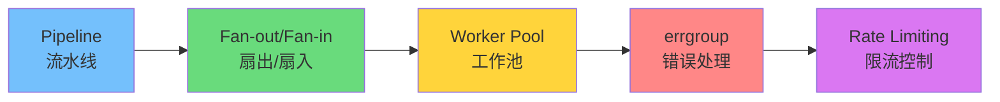
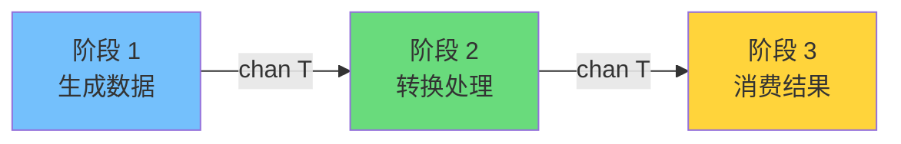
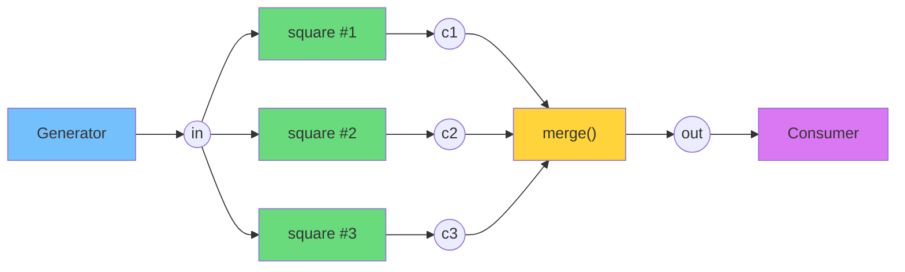
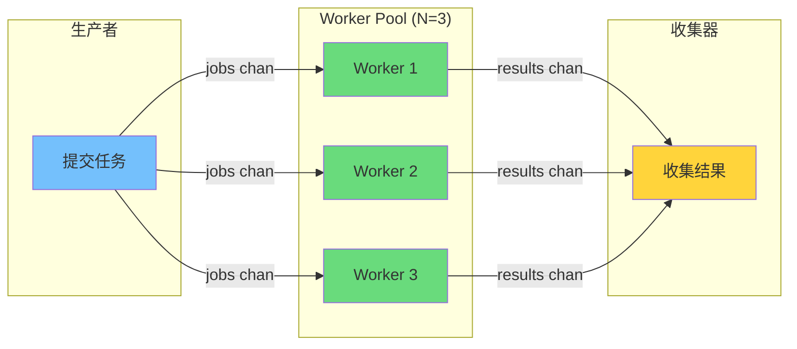
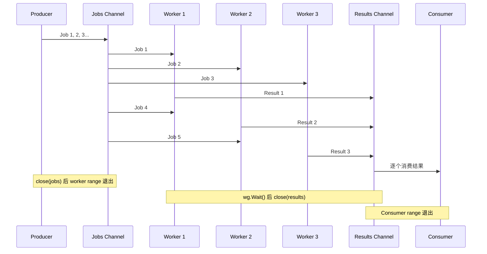

> **核心观点**：Go 的并发原语（goroutine + channel）极其简洁，但真正的挑战在于**如何正确组合它们**。Pipeline、Fan-out/Fan-in、Worker Pool 是三种经过生产验证的并发模式，掌握它们能让你写出既高效又安全的并发程序。

## 一、为什么需要并发模式

Go 语言的并发能力源于两个核心原语：**goroutine**（轻量级协程）和 **channel**（类型安全的通信管道）。启动一个 goroutine 只需 `go f()`，创建一个 channel 只需 `make(chan T)`——语法极其简洁。

但简洁的原语不等于简单的并发程序。实际开发中，你会面临一系列问题：

- 如何**组织**多个 goroutine 之间的数据流动？
- 如何**控制**并发的数量，避免资源耗尽？
- 如何在 goroutine 出错时**优雅地取消**其他正在运行的任务？
- 如何确保所有 goroutine **正确退出**，不发生 goroutine 泄漏？

**并发模式**就是对这些问题的系统性回答。它们是经过大量实践验证的 goroutine + channel 组合方式，就像建筑中的结构模式一样，提供了可靠的"脚手架"。

本文将由浅入深地讲解三种最核心的并发模式，并延伸到生产级别的错误处理与限流实践：



## 二、Pipeline 模式：数据处理流水线

### 什么是 Pipeline

Pipeline（流水线）是最基础的并发模式。它将数据处理分解为**多个阶段（stage）**，每个阶段由一组 goroutine 执行，阶段之间通过 channel 连接：



每个阶段的函数签名通常遵循统一模式：**接收一个输入 channel，返回一个输出 channel**。

### 基础实现

来看一个经典示例——生成整数、计算平方、打印结果：

```go
package main

import "fmt"

// generator 将一组整数发送到 channel
func generator(nums ...int) <-chan int {
    out := make(chan int)
    go func() {
        defer close(out) // 发送完毕后关闭 channel
        for _, n := range nums {
            out <- n
        }
    }()
    return out
}

// square 从 in 读取整数，计算平方后发送到输出 channel
func square(in <-chan int) <-chan int {
    out := make(chan int)
    go func() {
        defer close(out)
        for n := range in {
            out <- n * n
        }
    }()
    return out
}

func main() {
    // 构建流水线：generator -> square -> 消费
    ch := generator(2, 3, 4)
    out := square(ch)

    for v := range out {
        fmt.Println(v) // 输出：4, 9, 16
    }
}
```

这段代码有几个关键设计：

1. **`<-chan int` 单向 channel**：返回值类型用只读 channel，编译器层面防止调用方误写
2. **`defer close(out)`**：每个阶段发送完毕后关闭输出 channel，让下游的 `range` 循环自然退出
3. **goroutine 内部发送**：每个阶段在独立 goroutine 中运行，阶段之间可以并发执行

Pipeline 的优雅之处在于**可组合性**——你可以像搭积木一样串联阶段：

```go
// 两次平方：2→4→16, 3→9→81, 4→16→256
out := square(square(generator(2, 3, 4)))
```

### Pipeline 的致命问题：Goroutine 泄漏

上面的实现有一个隐含的严重问题：如果下游提前退出（比如只需要第一个结果），上游的 goroutine 会**永远阻塞在 channel 发送上**，造成 goroutine 泄漏。

```go
func main() {
    ch := generator(2, 3, 4)
    out := square(ch)
    fmt.Println(<-out) // 只取一个值：4
    // square 和 generator 的 goroutine 仍在阻塞！永远不会被回收
}
```

解决方案是引入**取消机制**。现代 Go 推荐使用 `context.Context`：

```go
func generator(ctx context.Context, nums ...int) <-chan int {
    out := make(chan int)
    go func() {
        defer close(out)
        for _, n := range nums {
            select {
            case out <- n:
            case <-ctx.Done(): // 收到取消信号，立即退出
                return
            }
        }
    }()
    return out
}

func square(ctx context.Context, in <-chan int) <-chan int {
    out := make(chan int)
    go func() {
        defer close(out)
        for n := range in {
            select {
            case out <- n * n:
            case <-ctx.Done():
                return
            }
        }
    }()
    return out
}

func main() {
    ctx, cancel := context.WithCancel(context.Background())
    defer cancel() // main 退出时，所有 pipeline goroutine 都会收到取消信号

    ch := generator(ctx, 2, 3, 4)
    out := square(ctx, ch)
    fmt.Println(<-out) // 4
    // cancel() 被 defer 调用，generator 和 square 的 goroutine 安全退出
}
```

> **最佳实践**：Pipeline 的每个阶段都应该接受 `context.Context` 参数，并在 `select` 中监听 `ctx.Done()`，确保取消时 goroutine 能及时退出。

## 三、Fan-out / Fan-in：并行加速流水线

### 问题：Pipeline 的瓶颈

在 Pipeline 中，如果某个阶段是 CPU 密集或 I/O 密集的，单个 goroutine 会成为整条流水线的瓶颈。比如，`square` 阶段如果涉及复杂计算，一个 goroutine 处理不过来。

Fan-out / Fan-in 就是解决这个问题的模式：



### Fan-out：扇出

**Fan-out** 是指**多个 goroutine 从同一个 channel 读取数据**。Go 的 channel 天然支持这种模式——多个 goroutine 同时 `range` 同一个 channel 时，每个值只会被其中一个 goroutine 接收，自动实现了工作分发。

```go
// 启动 N 个 square goroutine，它们竞争读取同一个 in channel
in := generator(ctx, 2, 3, 4, 5, 6, 7, 8, 9, 10)
numWorkers := 3
channels := make([]<-chan int, numWorkers)
for i := 0; i < numWorkers; i++ {
    channels[i] = square(ctx, in) // 每个 square 从同一个 in 读取
}
```

### Fan-in：扇入

**Fan-in** 是指**将多个 channel 的数据合并到一个 channel 中**。我们需要一个 `merge` 函数来实现：

```go
func merge(ctx context.Context, cs ...<-chan int) <-chan int {
    var wg sync.WaitGroup
    out := make(chan int)

    // 为每个输入 channel 启动一个 goroutine，将数据转发到 out
    output := func(c <-chan int) {
        defer wg.Done()
        for n := range c {
            select {
            case out <- n:
            case <-ctx.Done():
                return
            }
        }
    }

    wg.Add(len(cs))
    for _, c := range cs {
        go output(c)
    }

    // 所有输入 channel 耗尽后，关闭 out
    go func() {
        wg.Wait()
        close(out)
    }()

    return out
}
```

`merge` 的设计有三个关键点：

1. **每个输入 channel 对应一个 goroutine**，它们并发地将数据转发到同一个输出 channel
2. **`sync.WaitGroup` 协调关闭时机**：只有当所有输入 channel 都关闭后，才关闭输出 channel
3. **`select` 监听 `ctx.Done()`**：支持取消

### 完整示例

```go
func main() {
    ctx, cancel := context.WithCancel(context.Background())
    defer cancel()

    // 阶段 1：生成数据
    in := generator(ctx, 2, 3, 4, 5, 6, 7, 8, 9, 10)

    // 阶段 2：Fan-out — 启动 3 个 worker 并行计算平方
    numWorkers := 3
    channels := make([]<-chan int, numWorkers)
    for i := 0; i < numWorkers; i++ {
        channels[i] = square(ctx, in)
    }

    // 阶段 3：Fan-in — 合并所有 worker 的结果
    for result := range merge(ctx, channels...) {
        fmt.Println(result)
    }
}
```

> **注意**：Fan-out/Fan-in **不保证输出顺序**。因为多个 worker 并发执行，结果到达 `merge` 的顺序是不确定的。如果需要有序输出，需要额外的排序逻辑。

### 何时使用 Fan-out/Fan-in

| 场景                  | 是否适合 | 原因                            |
| --------------------- | -------- | ------------------------------- |
| 每个任务是 CPU 密集型 | ✅        | 多核并行，充分利用 `GOMAXPROCS` |
| 每个任务是 I/O 密集型 | ✅        | 并发等待，减少总耗时            |
| 任务之间有依赖关系    | ❌        | 需要顺序执行，不适合并行        |
| 需要保持输入顺序      | ⚠️        | 可以但需要额外排序逻辑          |

## 四、Worker Pool：有界并发工作池

### 与 Fan-out 的区别

Fan-out/Fan-in 强调的是 **Pipeline 的并行化**——你在组合 Pipeline 阶段时，让某个阶段运行多个实例。

Worker Pool 强调的是**有界并发**——你有一个 **任务队列（Job Queue）**，固定数量的 worker goroutine 从中取任务执行。它更像一个独立的"并发执行器"，而非 Pipeline 的一个阶段。



### 经典实现

```go
package main

import (
    "fmt"
    "sync"
    "time"
)

// Job 表示一个待处理的任务
type Job struct {
    ID    int
    Input int
}

// Result 表示任务的处理结果
type Result struct {
    Job    Job
    Output int
}

// worker 从 jobs channel 读取任务，将结果发送到 results channel
func worker(id int, jobs <-chan Job, results chan<- Result, wg *sync.WaitGroup) {
    defer wg.Done()
    for job := range jobs {
        // 模拟耗时处理
        time.Sleep(100 * time.Millisecond)
        results <- Result{
            Job:    job,
            Output: job.Input * job.Input,
        }
        fmt.Printf("Worker %d 完成 Job %d\n", id, job.ID)
    }
}

func main() {
    const numWorkers = 3
    const numJobs = 10

    jobs := make(chan Job)
    results := make(chan Result)

    // 启动 worker pool
    var wg sync.WaitGroup
    for i := 1; i <= numWorkers; i++ {
        wg.Add(1)
        go worker(i, jobs, results, &wg)
    }

    // 当所有 worker 完成后，关闭 results channel
    go func() {
        wg.Wait()
        close(results)
    }()

    // 提交任务（在独立 goroutine 中，避免和 results 收集互相阻塞）
    go func() {
        for i := 1; i <= numJobs; i++ {
            jobs <- Job{ID: i, Input: i}
        }
        close(jobs) // 所有任务提交完毕，关闭 jobs channel
    }()

    // 收集结果
    for result := range results {
        fmt.Printf("Job %d: %d² = %d\n", result.Job.ID, result.Job.Input, result.Output)
    }
}
```

这段代码的执行流程：



### 关键设计要点

1. **提交任务和收集结果必须在不同 goroutine 中**：如果在同一个 goroutine 中先提交所有任务再收集结果，当 `jobs` 和 `results` 都是无缓冲 channel 时，会发生死锁
2. **关闭 `jobs` channel 触发 worker 退出**：worker 的 `range jobs` 在 `jobs` 关闭后自然结束循环
3. **`WaitGroup` 确保 `results` channel 的正确关闭**：只有在所有 worker 退出后才关闭 `results`，否则 Consumer 的 `range results` 会提前退出

## 五、errgroup：生产级并发错误处理

### 问题：WaitGroup 不处理错误

上面的 Worker Pool 实现有一个明显缺陷：**如果某个 worker 发生错误怎么办？**

`sync.WaitGroup` 只负责等待 goroutine 完成，不关心它们是否成功。在生产环境中，我们需要：

- 收集并发任务的**第一个错误**
- 某个任务出错时，**取消其他正在运行的任务**
- 控制**最大并发数**

`golang.org/x/sync/errgroup` 包完美解决了这些问题。

### 基本用法

```go
import (
    "context"
    "fmt"
    "net/http"

    "golang.org/x/sync/errgroup"
)

func fetchURLs(urls []string) error {
    g, ctx := errgroup.WithContext(context.Background())

    for _, url := range urls {
        g.Go(func() error {
            req, err := http.NewRequestWithContext(ctx, "GET", url, nil)
            if err != nil {
                return err
            }
            resp, err := http.DefaultClient.Do(req)
            if err != nil {
                return fmt.Errorf("fetch %s: %w", url, err)
            }
            defer resp.Body.Close()

            if resp.StatusCode != http.StatusOK {
                return fmt.Errorf("fetch %s: status %d", url, resp.StatusCode)
            }
            return nil
        })
    }

    // Wait 返回第一个非 nil 的 error
    return g.Wait()
}
```

> **Go 1.22+ 提示**：从 Go 1.22 开始，`for` 循环变量的作用域改为**每次迭代独立**，因此上面代码中 `url` 在闭包内可以直接使用，无需 `url := url` 这种经典的捕获写法。如果你的项目仍在使用 Go 1.21 及以下版本，需要在循环体内添加 `url := url` 来避免闭包捕获陷阱。

### errgroup 的三大能力

#### 1. 自动取消：一错全停

`errgroup.WithContext` 返回的 `ctx` 会在**任何一个 goroutine 返回 error 时自动取消**。这意味着其他 goroutine 可以通过监听 `ctx.Done()` 及时停止工作：

```go
g, ctx := errgroup.WithContext(context.Background())

g.Go(func() error {
    // 这个任务会失败
    return errors.New("task 1 failed")
})

g.Go(func() error {
    // 这个任务通过 ctx 感知到取消
    select {
    case <-time.After(10 * time.Second):
        return nil
    case <-ctx.Done():
        fmt.Println("task 2 被取消")
        return ctx.Err()
    }
})

err := g.Wait() // 返回 "task 1 failed"
```

#### 2. 限制并发数：SetLimit

在实际场景中，你不希望同时启动成千上万个 goroutine（比如并发请求 10000 个 URL）。`SetLimit` 可以限制同时运行的 goroutine 数量：

```go
g, ctx := errgroup.WithContext(context.Background())
g.SetLimit(10) // 最多同时运行 10 个 goroutine

for _, url := range thousandsOfURLs {
    g.Go(func() error {
        // SetLimit 会自动控制：超过 10 个时，新的 Go() 调用会阻塞等待
        return fetch(ctx, url)
    })
}

return g.Wait()
```

#### 3. 非阻塞提交：TryGo

`TryGo` 在达到并发上限时**不会阻塞**，而是返回 `false`：

```go
g.SetLimit(5)

for _, task := range tasks {
    task := task // Go 1.21 及以下需要
    if !g.TryGo(func() error {
        return process(task)
    }) {
        // 已达到并发上限，可以选择等待或跳过
        fmt.Println("并发已满，跳过任务")
    }
}
```

### errgroup vs sync.WaitGroup 对比

| 特性       | sync.WaitGroup               | errgroup.Group         |
| ---------- | ---------------------------- | ---------------------- |
| 等待完成   | ✅                            | ✅                      |
| 错误收集   | ❌ 需自行实现                 | ✅ 自动收集第一个错误   |
| 取消传播   | ❌ 需自行实现                 | ✅ WithContext 自动取消 |
| 并发限制   | ❌ 需自行实现                 | ✅ SetLimit             |
| 使用复杂度 | 低（但需要额外代码处理错误） | 低（内置错误处理）     |

## 六、限流：控制并发速率

并发限制（限制同时运行的 goroutine 数量）和**速率限制（限制单位时间内的操作次数）**是两个不同的概念。Worker Pool 和 `errgroup.SetLimit` 解决的是前者，本节讨论后者。

### 场景：API 请求限速

假设你需要爬取 10000 个 URL，目标服务器限制每秒最多 10 个请求。即使你只启动 10 个并发 worker，如果每个请求只需 50ms，你的实际速率会达到 200 req/s，远超限制。

### 方案 1：基于 Channel 的信号量

这是最简单的并发控制方式——用一个带缓冲的 channel 作为"令牌桶"：

```go
// 限制最大并发数为 maxConcurrent
sem := make(chan struct{}, maxConcurrent)

for _, task := range tasks {
    task := task // Go 1.21 及以下需要，避免闭包捕获
    sem <- struct{}{} // 获取令牌（缓冲区满时阻塞）
    go func() {
        defer func() { <-sem }() // 完成后归还令牌
        process(task)
    }()
}

// 等待所有 goroutine 完成
for i := 0; i < cap(sem); i++ {
    sem <- struct{}{}
}
```

> 这种方式只控制**并发数**，不控制**速率**。如果需要限制每秒请求数，请使用下面的方案。

### 方案 2：基于 time.Ticker 的速率控制

```go
// 每 100ms 允许一个请求 = 每秒 10 个请求
ticker := time.NewTicker(100 * time.Millisecond)
defer ticker.Stop()

for _, url := range urls {
    url := url // Go 1.21 及以下需要，避免闭包捕获
    <-ticker.C // 等待下一个 tick
    go func() {
        fetch(url)
    }()
}
```

这种方式简单直观，但有两个限制：速率是固定的，不支持突发（burst）；而且 goroutine 数量不受控制。

### 方案 3：golang.org/x/time/rate（推荐）

标准扩展库提供了基于**令牌桶算法（Token Bucket）**的限流器，支持稳定速率和突发流量：

```go
import "golang.org/x/time/rate"

// 每秒 10 个请求，允许突发 5 个
limiter := rate.NewLimiter(rate.Limit(10), 5)

g, ctx := errgroup.WithContext(context.Background())
g.SetLimit(20) // 并发数限制

for _, url := range urls {
    url := url // Go 1.21 及以下需要，避免闭包捕获
    // Wait 阻塞直到获得一个令牌，或 ctx 被取消
    if err := limiter.Wait(ctx); err != nil {
        return err
    }
    g.Go(func() error {
        return fetch(ctx, url)
    })
}

return g.Wait()
```

`rate.NewLimiter(r, b)` 的两个参数：

- **`r`（rate.Limit）**：每秒允许的事件数。`rate.Limit(10)` 表示每秒 10 个，`rate.Every(100*time.Millisecond)` 也等价于每秒 10 个
- **`b`（int）**：突发容量。允许在短时间内突发 `b` 个事件（令牌桶初始有 `b` 个令牌）

这个方案同时控制了**速率**（limiter）和**并发数**（errgroup.SetLimit），是生产环境的推荐做法。

## 七、实战：并发数据处理系统

下面用一个完整示例展示如何组合多种模式。场景：**并发获取多个 API 端点的数据，处理并汇总结果**。

```go
package main

import (
    "context"
    "fmt"
    "math/rand"
    "sync"
    "time"

    "golang.org/x/sync/errgroup"
    "golang.org/x/time/rate"
)

// ---- 数据类型 ----

type Request struct {
    ID  int
    URL string
}

type Response struct {
    RequestID int
    Data      string
    Duration  time.Duration
}

// ---- Pipeline 阶段 1：生成请求 ----

func generateRequests(ctx context.Context, urls []string) <-chan Request {
    out := make(chan Request)
    go func() {
        defer close(out)
        for i, url := range urls {
            select {
            case out <- Request{ID: i + 1, URL: url}:
            case <-ctx.Done():
                return
            }
        }
    }()
    return out
}

// ---- Pipeline 阶段 2：Worker Pool + 限流处理请求 ----

func processRequests(
    ctx context.Context,
    requests <-chan Request,
    numWorkers int,
    rateLimit rate.Limit,
) (<-chan Response, func() error) {

    responses := make(chan Response)
    limiter := rate.NewLimiter(rateLimit, int(rateLimit)) // 突发容量 = 速率

    g, ctx := errgroup.WithContext(ctx)
    g.SetLimit(numWorkers)

    // 消费所有请求
    var wg sync.WaitGroup
    wg.Add(1)
    go func() {
        defer wg.Done()
        for req := range requests {
            // 速率控制
            if err := limiter.Wait(ctx); err != nil {
                return
            }
            req := req // Go 1.21 及以下需要
            g.Go(func() error {
                resp, err := fetchAndProcess(ctx, req)
                if err != nil {
                    return fmt.Errorf("request %d failed: %w", req.ID, err)
                }
                select {
                case responses <- resp:
                case <-ctx.Done():
                    return ctx.Err()
                }
                return nil
            })
        }
    }()

    // 等待所有工作完成后关闭 responses channel
    waitFn := func() error {
        wg.Wait()     // 等待请求消费完毕
        err := g.Wait() // 等待所有 worker 完成
        close(responses)
        return err
    }

    return responses, waitFn
}

// 模拟 HTTP 请求与数据处理
func fetchAndProcess(ctx context.Context, req Request) (Response, error) {
    // 模拟网络延迟 50~200ms
    delay := time.Duration(50+rand.Intn(150)) * time.Millisecond
    select {
    case <-time.After(delay):
    case <-ctx.Done():
        return Response{}, ctx.Err()
    }

    return Response{
        RequestID: req.ID,
        Data:      fmt.Sprintf("data from %s", req.URL),
        Duration:  delay,
    }, nil
}

// ---- Pipeline 阶段 3：汇总结果 ----

func aggregate(responses <-chan Response) map[int]Response {
    results := make(map[int]Response)
    for resp := range responses {
        results[resp.RequestID] = resp
    }
    return results
}

// ---- 主函数：组装 Pipeline ----

func main() {
    ctx, cancel := context.WithTimeout(context.Background(), 30*time.Second)
    defer cancel()

    urls := []string{
        "https://api.example.com/users",
        "https://api.example.com/orders",
        "https://api.example.com/products",
        "https://api.example.com/inventory",
        "https://api.example.com/analytics",
        "https://api.example.com/reports",
        "https://api.example.com/notifications",
        "https://api.example.com/settings",
    }

    // 构建 Pipeline
    // 阶段 1：生成请求
    requests := generateRequests(ctx, urls)

    // 阶段 2：Worker Pool + 限流处理（3 个 worker，每秒 5 个请求）
    responses, wait := processRequests(ctx, requests, 3, 5)

    // 阶段 3：在独立 goroutine 中汇总结果
    resultCh := make(chan map[int]Response, 1)
    go func() {
        resultCh <- aggregate(responses)
    }()

    // 等待处理完成
    if err := wait(); err != nil {
        fmt.Printf("处理过程中发生错误: %v\n", err)
    }

    // 获取汇总结果
    results := <-resultCh
    fmt.Printf("\n成功处理 %d/%d 个请求:\n", len(results), len(urls))
    for id, resp := range results {
        fmt.Printf("  请求 %d: %s (耗时 %v)\n", id, resp.Data, resp.Duration)
    }
}
```

这个示例综合运用了：

| 模式              | 应用位置                        | 作用                           |
| ----------------- | ------------------------------- | ------------------------------ |
| **Pipeline**      | 三个阶段串联                    | 分离关注点，每个阶段独立       |
| **Worker Pool**   | `errgroup.SetLimit(numWorkers)` | 限制并发 worker 数量           |
| **Rate Limiting** | `rate.NewLimiter`               | 控制每秒请求速率               |
| **errgroup**      | 错误处理与取消                  | 任一请求失败时自动取消所有任务 |
| **Context**       | 贯穿全流程                      | 超时控制与取消传播             |

## 八、总结与选型指南

### 模式速查表

| 模式               | 核心思想                       | 适用场景                     | 关键组件                              |
| ------------------ | ------------------------------ | ---------------------------- | ------------------------------------- |
| **Pipeline**       | 分阶段，通过 channel 串联      | 数据需要经过多步处理         | channel 方向性、`close` 信号          |
| **Fan-out/Fan-in** | 并行化 Pipeline 的某个阶段     | 某阶段是瓶颈（CPU/IO 密集）  | 多 goroutine 读同一 channel + `merge` |
| **Worker Pool**    | 固定数量的 worker 处理任务队列 | 需要控制并发资源消耗         | jobs/results channel + `WaitGroup`    |
| **errgroup**       | WaitGroup + 错误处理 + 取消    | 生产环境的并发任务编排       | `errgroup.WithContext` + `SetLimit`   |
| **Rate Limiting**  | 控制单位时间操作次数           | API 调用、爬虫、外部服务限速 | `rate.NewLimiter` 令牌桶              |

### 五条黄金法则

1. **永远考虑 goroutine 的退出条件**：每个 goroutine 都应该有明确的退出路径，使用 `context.Context` 传播取消信号
2. **关闭 channel 是发送方的责任**：只有发送方知道何时没有更多数据，接收方不应关闭 channel
3. **`select` + `ctx.Done()` 是安全卫士**：在每个可能阻塞的 channel 操作中加入 `ctx.Done()` 分支
4. **先保证正确，再优化性能**：先用最简单的方式实现（可能是单 goroutine），验证逻辑正确后再引入并发模式
5. **并发数和速率是两个维度**：`SetLimit`/`WaitGroup` 控制并发数，`rate.Limiter` 控制速率，生产环境通常两者都需要
